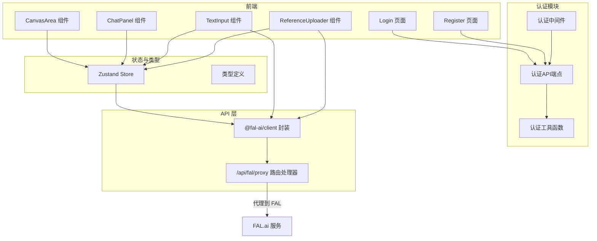
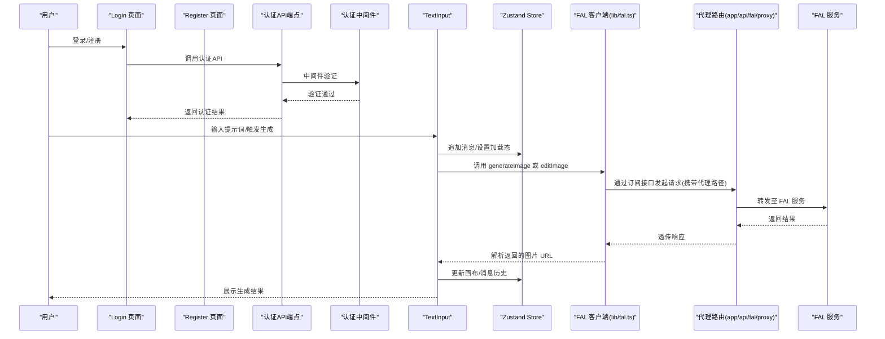
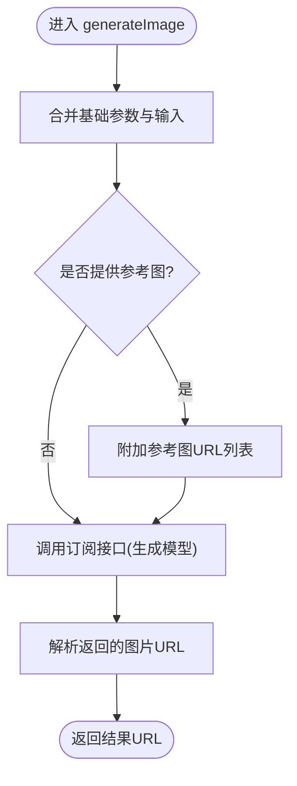
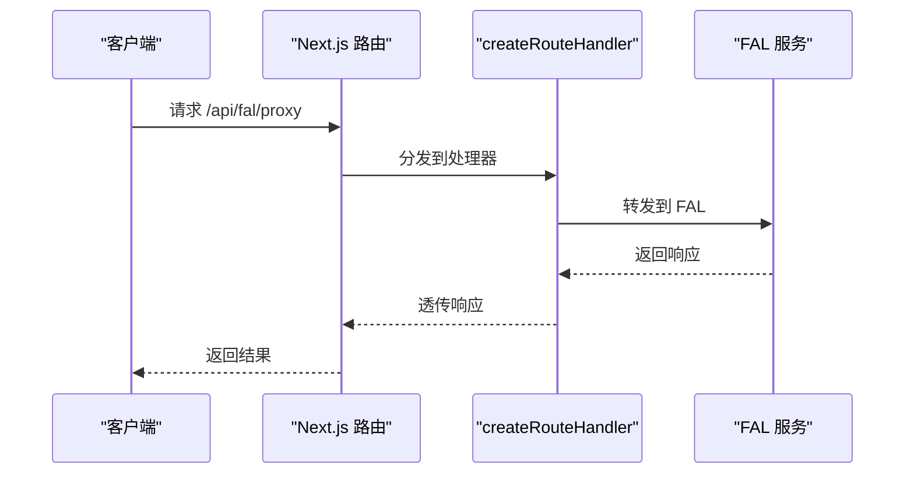
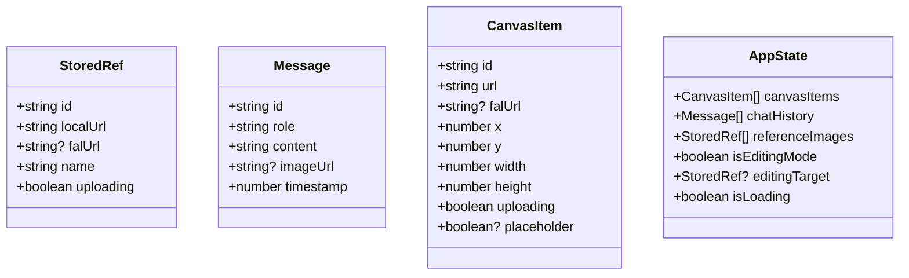
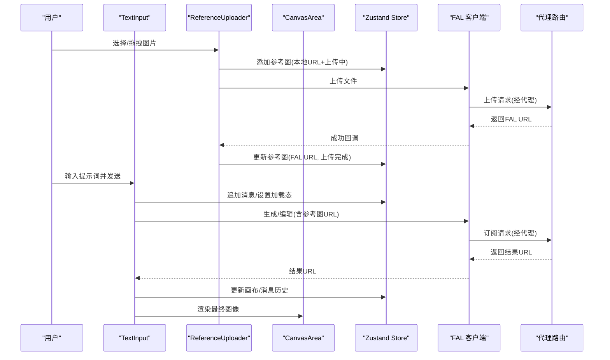
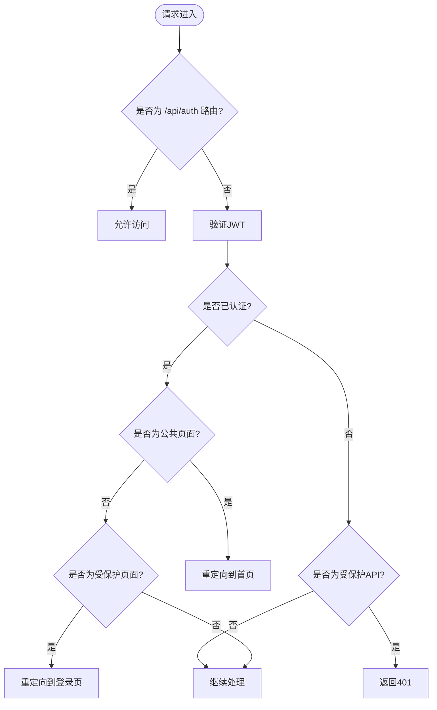
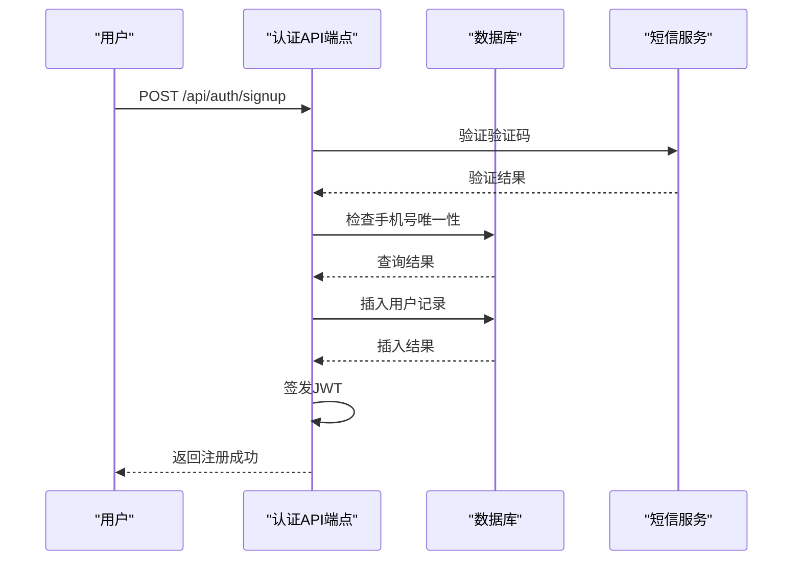
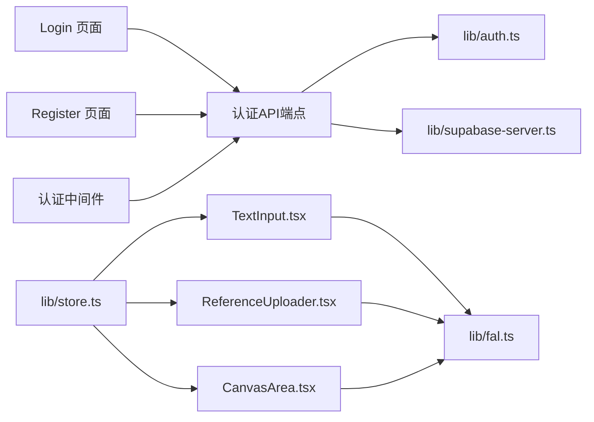

# API 集成

<cite>
**本文引用的文件**
- [lib/fal.ts](file://lib/fal.ts)
- [app/api/fal/proxy/route.ts](file://app/api/fal/proxy/route.ts)
- [lib/types.ts](file://lib/types.ts)
- [lib/store.ts](file://lib/store.ts)
- [lib/validate.ts](file://lib/validate.ts)
- [lib/auth.ts](file://lib/auth.ts)
- [lib/supabase-server.ts](file://lib/supabase-server.ts)
- [app/api/auth/me/route.ts](file://app/api/auth/me/route.ts)
- [app/api/auth/signup/route.ts](file://app/api/auth/signup/route.ts)
- [app/api/auth/signin/route.ts](file://app/api/auth/signin/route.ts)
- [app/api/auth/signout/route.ts](file://app/api/auth/signout/route.ts)
- [app/api/auth/send-code/route.ts](file://app/api/auth/send-code/route.ts)
- [app/api/auth/signin-sms/route.ts](file://app/api/auth/signin-sms/route.ts)
- [app/login/page.tsx](file://app/login/page.tsx)
- [app/register/page.tsx](file://app/register/page.tsx)
- [middleware.ts](file://middleware.ts)
- [components/chat/ReferenceUploader.tsx](file://components/chat/ReferenceUploader.tsx)
- [components/canvas/CanvasArea.tsx](file://components/canvas/CanvasArea.tsx)
- [components/chat/ChatPanel.tsx](file://components/chat/ChatPanel.tsx)
- [components/chat/TextInput.tsx](file://components/chat/TextInput.tsx)
- [app/page.tsx](file://app/page.tsx)
- [__tests__/fal.test.ts](file://__tests__/fal.test.ts)
- [__tests__/store.test.ts](file://__tests__/store.test.ts)
- [__tests__/validate.test.ts](file://__tests__/validate.test.ts)
- [package.json](file://package.json)
</cite>

## 目录
1. [简介](#简介)
2. [项目结构](#项目结构)
3. [核心组件](#核心组件)
4. [架构总览](#架构总览)
5. [详细组件分析](#详细组件分析)
6. [认证API端点](#认证api端点)
7. [依赖关系分析](#依赖关系分析)
8. [性能考虑](#性能考虑)
9. [故障排除指南](#故障排除指南)
10. [结论](#结论)
11. [附录](#附录)

## 简介
本文件面向 Loveart 项目中 FAL.ai Nano Banana API 的集成实现，系统性阐述客户端封装、请求处理与响应解析、API 代理路由的设计与实现、服务器端代理如何保护敏感密钥、完整的使用示例（图像生成、编辑与文件上传）、错误处理与重试策略、超时配置、性能优化与监控指标建议，以及最佳实践与故障排除指南。目标是帮助开发者快速理解并安全、稳定地集成该 API。

**更新** 新增认证API端点集成，包括用户注册、登录、短信验证、用户信息获取、登出等功能，完善了完整的用户身份认证体系。

## 项目结构
项目采用 Next.js 应用结构，前端交互集中在组件层，业务逻辑与状态管理位于 lib 层，API 路由通过 app/api 下的 Next.js 路由处理器暴露。FAL 客户端通过 @fal-ai/client 与 @fal-ai/server-proxy 实现，代理路由负责转发与隐藏后端密钥。新增认证模块提供完整的用户身份认证功能。

**图表来源**
- [app/api/auth/me/route.ts:1-54](file://app/api/auth/me/route.ts#L1-L54)
- [app/api/auth/signup/route.ts:1-118](file://app/api/auth/signup/route.ts#L1-L118)
- [app/api/auth/signin/route.ts:1-93](file://app/api/auth/signin/route.ts#L1-L93)
- [app/api/auth/signout/route.ts:1-20](file://app/api/auth/signout/route.ts#L1-L20)
- [app/api/auth/send-code/route.ts:1-48](file://app/api/auth/send-code/route.ts#L1-L48)
- [app/api/auth/signin-sms/route.ts:1-94](file://app/api/auth/signin-sms/route.ts#L1-L94)
- [lib/auth.ts:1-64](file://lib/auth.ts#L1-L64)
- [middleware.ts:1-64](file://middleware.ts#L1-L64)

**章节来源**
- [app/page.tsx:1-59](file://app/page.tsx#L1-L59)
- [package.json:1-48](file://package.json#L1-L48)

## 核心组件
- FAL 客户端封装：集中于 lib/fal.ts，提供 generateImage、editImage、uploadFile 三个方法，并通过 fal.config 指定代理路径。
- 代理路由：app/api/fal/proxy/route.ts 使用 @fal-ai/server-proxy/nextjs 提供 GET/POST/PUT 路由处理器。
- 认证API端点：提供用户注册、登录、短信验证、用户信息获取、登出等完整认证功能。
- 认证工具函数：JWT签发与验证、Cookie操作、请求头验证等。
- 中间件认证：保护非认证API路由，实现统一的访问控制。
- 状态与类型：lib/store.ts 与 lib/types.ts 定义应用状态、画布项、消息与参考图等数据模型。
- 前端集成：CanvasArea、ChatPanel、TextInput、ReferenceUploader、Login、Register 组合完成用户交互与调用链路。
- 文件校验：lib/validate.ts 提供文件类型与大小限制，避免无效上传。

**章节来源**
- [lib/fal.ts:1-62](file://lib/fal.ts#L1-L62)
- [app/api/fal/proxy/route.ts:1-4](file://app/api/fal/proxy/route.ts#L1-L4)
- [lib/auth.ts:1-64](file://lib/auth.ts#L1-L64)
- [middleware.ts:1-64](file://middleware.ts#L1-L64)
- [lib/store.ts:1-119](file://lib/store.ts#L1-L119)
- [lib/types.ts:1-37](file://lib/types.ts#L1-L37)
- [lib/validate.ts:1-14](file://lib/validate.ts#L1-L14)
- [components/chat/ReferenceUploader.tsx:1-100](file://components/chat/ReferenceUploader.tsx#L1-L100)
- [components/canvas/CanvasArea.tsx:1-431](file://components/canvas/CanvasArea.tsx#L1-L431)
- [components/chat/ChatPanel.tsx:1-22](file://components/chat/ChatPanel.tsx#L1-L22)
- [components/chat/TextInput.tsx:1-140](file://components/chat/TextInput.tsx#L1-L140)

## 架构总览
下图展示从用户输入到 FAL 服务的完整调用链，以及代理路由如何在客户端与服务端之间进行中转，确保密钥不暴露给浏览器。新增认证流程包括用户注册、登录、信息获取等完整身份验证过程。

**图表来源**
- [app/login/page.tsx:66-133](file://app/login/page.tsx#L66-L133)
- [app/register/page.tsx:90-115](file://app/register/page.tsx#L90-L115)
- [app/api/auth/signin/route.ts:8-92](file://app/api/auth/signin/route.ts#L8-L92)
- [middleware.ts:11-50](file://middleware.ts#L11-L50)
- [components/chat/TextInput.tsx:34-89](file://components/chat/TextInput.tsx#L34-L89)
- [lib/fal.ts:21-61](file://lib/fal.ts#L21-L61)
- [app/api/fal/proxy/route.ts:1-4](file://app/api/fal/proxy/route.ts#L1-L4)

## 详细组件分析

### FAL 客户端封装（lib/fal.ts）
- 配置代理：通过 fal.config 指定 proxyUrl 为 "/api/fal/proxy"，使所有请求经由 Next.js 路由处理器转发。
- 图像生成：generateImage 接收 prompt 与可选 referenceUrls，合并基础参数后调用 fal.subscribe 指向 "fal-ai/nano-banana" 模型，解析返回的图片 URL。
- 图像编辑：editImage 接收 prompt、targetUrl 与 referenceUrls，合并基础参数后调用 "fal-ai/nano-banana/edit" 模型，解析返回的图片 URL。
- 文件上传：uploadFile 直接委托 fal.storage.upload，返回 FAL 存储的 URL。
- 基础参数：分别定义了生成与编辑的基础输入参数，统一输出格式为 PNG，便于前端渲染与下载。

**图表来源**
- [lib/fal.ts:21-38](file://lib/fal.ts#L21-L38)

**章节来源**
- [lib/fal.ts:1-62](file://lib/fal.ts#L1-L62)

### 代理路由（app/api/fal/proxy/route.ts）
- 使用 @fal-ai/server-proxy/nextjs 的 createRouteHandler 创建路由处理器，暴露 GET/POST/PUT 方法，将请求转发至 FAL 服务。
- 设计目的：在客户端侧隐藏真实 API 密钥，避免在浏览器中直接访问 FAL 服务，降低泄露风险；同时统一鉴权与配额控制在服务端执行。

**图表来源**
- [app/api/fal/proxy/route.ts:1-4](file://app/api/fal/proxy/route.ts#L1-L4)

**章节来源**
- [app/api/fal/proxy/route.ts:1-4](file://app/api/fal/proxy/route.ts#L1-L4)

### 状态与类型（lib/store.ts、lib/types.ts）
- 类型定义：StoredRef、Message、CanvasItem、AppState 等，用于描述参考图、消息、画布项与全局状态。
- 状态管理：使用 Zustand 管理会话与持久化状态，包含画布项、聊天历史、参考图、编辑模式与加载态；提供增删改查与清理等动作。
- 本地存储：通过 localStorage 包装器保证异常安全，避免因存储异常导致应用崩溃。

**图表来源**
- [lib/types.ts:1-37](file://lib/types.ts#L1-L37)
- [lib/store.ts:1-119](file://lib/store.ts#L1-L119)

**章节来源**
- [lib/types.ts:1-37](file://lib/types.ts#L1-L37)
- [lib/store.ts:1-119](file://lib/store.ts#L1-L119)

### 前端组件集成
- ChatPanel：整合消息历史、参考图上传区与文本输入框。
- TextInput：根据编辑模式决定调用生成或编辑接口，维护占位图与最终结果，处理加载态与错误提示。
- ReferenceUploader：限制最多 6 张参考图，校验文件类型与大小，上传成功后更新状态。
- CanvasArea：支持拖拽上传、中间键平移、滚轮缩放、选择与变换，集成占位动画与下载功能。
- Login 页面：提供密码登录和短信登录两种方式，集成验证码发送与倒计时功能。
- Register 页面：提供手机号注册功能，包含密码验证、确认密码和验证码验证。

**图表来源**
- [components/chat/TextInput.tsx:34-89](file://components/chat/TextInput.tsx#L34-L89)
- [components/chat/ReferenceUploader.tsx:18-41](file://components/chat/ReferenceUploader.tsx#L18-L41)
- [components/canvas/CanvasArea.tsx:306-340](file://components/canvas/CanvasArea.tsx#L306-L340)
- [lib/fal.ts:21-61](file://lib/fal.ts#L21-L61)
- [app/api/fal/proxy/route.ts:1-4](file://app/api/fal/proxy/route.ts#L1-L4)

**章节来源**
- [components/chat/ChatPanel.tsx:1-22](file://components/chat/ChatPanel.tsx#L1-L22)
- [components/chat/TextInput.tsx:1-140](file://components/chat/TextInput.tsx#L1-L140)
- [components/chat/ReferenceUploader.tsx:1-100](file://components/chat/ReferenceUploader.tsx#L1-L100)
- [components/canvas/CanvasArea.tsx:1-431](file://components/canvas/CanvasArea.tsx#L1-L431)

### 错误处理与重试策略
- 网络错误识别：TextInput 在捕获到网络类错误时提示"网络连接失败"，引导用户检查网络。
- 上传失败处理：ReferenceUploader 与 CanvasArea 在上传失败时回滚状态、清理本地对象 URL 并提示错误。
- 重试策略：当前未实现自动重试，建议在生产环境增加指数退避重试与最大重试次数限制。
- 超时配置：未显式设置超时时间，建议在客户端封装中增加超时控制，避免长时间挂起。

**章节来源**
- [components/chat/TextInput.tsx:82-88](file://components/chat/TextInput.tsx#L82-L88)
- [components/chat/ReferenceUploader.tsx:31-38](file://components/chat/ReferenceUploader.tsx#L31-L38)
- [components/canvas/CanvasArea.tsx:331-337](file://components/canvas/CanvasArea.tsx#L331-L337)

### API 使用示例（路径指引）
- 图像生成
  - 调用路径：[lib/fal.ts:21-38](file://lib/fal.ts#L21-L38)
  - 触发位置：[components/chat/TextInput.tsx:68-72](file://components/chat/TextInput.tsx#L68-L72)
- 图像编辑
  - 调用路径：[lib/fal.ts:40-57](file://lib/fal.ts#L40-L57)
  - 触发位置：[components/chat/TextInput.tsx:68-72](file://components/chat/TextInput.tsx#L68-L72)
- 文件上传
  - 调用路径：[lib/fal.ts:59-61](file://lib/fal.ts#L59-L61)
  - 触发位置：[components/chat/ReferenceUploader.tsx:31-33](file://components/chat/ReferenceUploader.tsx#L31-L33)、[components/canvas/CanvasArea.tsx:331-333](file://components/canvas/CanvasArea.tsx#L331-L333)

**章节来源**
- [lib/fal.ts:21-61](file://lib/fal.ts#L21-L61)
- [components/chat/TextInput.tsx:68-72](file://components/chat/TextInput.tsx#L68-L72)
- [components/chat/ReferenceUploader.tsx:31-33](file://components/chat/ReferenceUploader.tsx#L31-L33)
- [components/canvas/CanvasArea.tsx:331-333](file://components/canvas/CanvasArea.tsx#L331-L333)

## 认证API端点

### 认证中间件（middleware.ts）
- 路由保护：对非认证API路由进行JWT验证，未登录用户访问受保护路由时返回401。
- 公共路由：/api/auth 路由组允许匿名访问，用于用户注册、登录等认证操作。
- 重定向逻辑：已登录用户访问登录/注册页面时重定向到首页；未登录用户访问受保护页面时重定向到登录页。
- 边缘兼容：提供 verifyJwtFromRequest 函数，支持在边缘环境中从请求头读取Cookie。

**图表来源**
- [middleware.ts:11-50](file://middleware.ts#L11-L50)

**章节来源**
- [middleware.ts:1-64](file://middleware.ts#L1-L64)

### 用户认证API端点

#### 注册端点（/api/auth/signup）
- 功能：手机号+密码+验证码注册新用户
- 参数验证：手机号格式校验、密码长度校验、验证码验证
- 数据库操作：检查手机号唯一性，加密密码后插入用户表
- 响应：签发JWT并写入Cookie，返回用户信息

#### 登录端点（/api/auth/signin）
- 功能：手机号+密码登录
- 参数验证：手机号格式校验、密码验证
- 数据库查询：按手机号查询用户信息
- 密码验证：使用bcrypt比较密码哈希
- 响应：签发JWT并写入Cookie，返回用户信息（不含密码哈希）

#### 短信登录端点（/api/auth/signin-sms）
- 功能：手机号+验证码登录（支持自动注册）
- 参数验证：手机号格式校验、验证码验证
- 自动注册：用户不存在时自动创建用户记录
- 响应：签发JWT并写入Cookie，返回用户信息

#### 获取用户信息端点（/api/auth/me）
- 功能：获取当前登录用户信息
- 认证：从Cookie中提取JWT，验证有效性
- 数据库查询：按用户ID查询用户详情
- 响应：返回用户信息

#### 发送验证码端点（/api/auth/send-code）
- 功能：发送短信验证码
- 参数验证：手机号格式校验
- 验证码发送：调用短信服务发送验证码
- 响应：返回发送结果

#### 登出端点（/api/auth/signout）
- 功能：用户登出
- 操作：清除认证Cookie
- 响应：返回登出成功信息

**图表来源**
- [app/api/auth/signup/route.ts:9-117](file://app/api/auth/signup/route.ts#L9-L117)
- [app/api/auth/send-code/route.ts:6-47](file://app/api/auth/send-code/route.ts#L6-L47)

**章节来源**
- [app/api/auth/me/route.ts:1-54](file://app/api/auth/me/route.ts#L1-L54)
- [app/api/auth/signup/route.ts:1-118](file://app/api/auth/signup/route.ts#L1-L118)
- [app/api/auth/signin/route.ts:1-93](file://app/api/auth/signin/route.ts#L1-L93)
- [app/api/auth/signout/route.ts:1-20](file://app/api/auth/signout/route.ts#L1-L20)
- [app/api/auth/send-code/route.ts:1-48](file://app/api/auth/send-code/route.ts#L1-L48)
- [app/api/auth/signin-sms/route.ts:1-94](file://app/api/auth/signin-sms/route.ts#L1-L94)

### 认证工具函数（lib/auth.ts）
- JWT管理：signJwt（签发JWT）、verifyJwt（验证JWT）
- Cookie操作：setAuthCookie（设置认证Cookie）、clearAuthCookie（清除认证Cookie）、getAuthToken（获取认证Token）
- 请求验证：verifyJwtFromRequest（从请求头验证JWT）
- 配置：JWT密钥、Cookie名称、过期时间等

**章节来源**
- [lib/auth.ts:1-64](file://lib/auth.ts#L1-L64)

### 前端认证页面

#### 登录页面（app/login/page.tsx）
- 功能：支持密码登录和短信登录两种方式
- 表单验证：手机号格式验证、密码验证、验证码验证
- 交互：验证码倒计时、加载状态、错误提示
- 路由跳转：登录成功后跳转到首页

#### 注册页面（app/register/page.tsx）
- 功能：手机号+密码+验证码注册
- 表单验证：手机号格式、密码长度、确认密码一致性、验证码
- 交互：验证码倒计时、表单验证、错误提示
- 路由跳转：注册成功后跳转到首页

**章节来源**
- [app/login/page.tsx:1-233](file://app/login/page.tsx#L1-L233)
- [app/register/page.tsx:1-199](file://app/register/page.tsx#L1-L199)

## 依赖关系分析
- 外部依赖
  - @fal-ai/client：提供订阅与存储能力，配合代理路由使用。
  - @fal-ai/server-proxy：提供 Next.js 路由处理器，实现服务端代理。
  - zustand：状态管理，支持持久化。
  - jose：JWT签名与验证。
  - bcryptjs：密码哈希加密。
  - @supabase/supabase-js：数据库操作。
- 内部耦合
  - 组件通过 TextInput 与 ReferenceUploader 调用 lib/fal.ts，后者通过代理路由访问 FAL。
  - 认证API端点通过 lib/auth.ts 和 lib/supabase-server.ts 实现JWT管理和数据库操作。
  - 中间件保护非认证API路由，实现统一的访问控制。
  - 状态通过 Zustand 统一管理，避免跨组件重复请求与状态漂移。

**图表来源**
- [components/chat/TextInput.tsx:1-140](file://components/chat/TextInput.tsx#L1-L140)
- [components/chat/ReferenceUploader.tsx:1-100](file://components/chat/ReferenceUploader.tsx#L1-L100)
- [components/canvas/CanvasArea.tsx:1-431](file://components/canvas/CanvasArea.tsx#L1-L431)
- [lib/fal.ts:1-62](file://lib/fal.ts#L1-L62)
- [app/login/page.tsx:1-233](file://app/login/page.tsx#L1-L233)
- [app/register/page.tsx:1-199](file://app/register/page.tsx#L1-L199)
- [lib/auth.ts:1-64](file://lib/auth.ts#L1-L64)
- [lib/supabase-server.ts:1-16](file://lib/supabase-server.ts#L1-L16)
- [middleware.ts:1-64](file://middleware.ts#L1-L64)
- [lib/store.ts:1-119](file://lib/store.ts#L1-L119)

**章节来源**
- [package.json:11-29](file://package.json#L11-L29)

## 性能考虑
- 传输格式：统一输出 PNG，减少解码差异带来的渲染问题。
- 占位图与渐变动画：CanvasArea 中的占位节点提供视觉反馈，改善感知性能。
- 本地缩略预览：ReferenceUploader 与 CanvasArea 使用本地对象 URL 快速预览，提升交互流畅度。
- 上传并发：当前未实现并发控制，建议限制同时上传数量以避免资源争用。
- 缓存策略：可考虑在代理层缓存部分静态资源或结果，减少重复请求。
- 监控指标建议
  - 请求延迟、成功率、失败率、上传体积分布、并发请求数、代理转发耗时。
  - 建议埋点位置：TextInput 发送前、FAL 客户端订阅调用前后、代理路由转发前后。
- 认证性能优化
  - JWT缓存：在中间件中缓存验证结果，减少重复验证开销。
  - 数据库连接池：复用Supabase连接，避免频繁创建连接。
  - 密码哈希成本：合理设置bcrypt成本因子，在安全性与性能间平衡。

## 故障排除指南
- "网络连接失败"提示
  - 可能原因：网络不稳定、代理路由不可达、FAL 服务限流。
  - 处理步骤：检查网络连通性、确认代理路由可用、查看服务端日志。
- "上传失败"
  - 可能原因：文件类型不支持、文件过大、代理密钥配置错误。
  - 处理步骤：确认文件类型与大小限制、检查代理路由密钥配置、重试上传。
- "生成失败，请重试"
  - 可能原因：模型负载过高、输入参数异常、代理转发失败。
  - 处理步骤：简化提示词、检查参考图数量与质量、查看代理与服务端日志。
- 认证相关问题
  - "未登录"或"登录已过期"：检查Cookie是否正确设置、JWT是否过期、中间件是否正常工作。
  - "验证码错误或已过期"：检查短信服务配置、验证码有效期、用户输入是否正确。
  - "手机号已注册"：检查数据库中是否存在重复手机号、清理测试数据。
- 测试验证
  - 单元测试覆盖了 generateImage、editImage 的调用行为与参数传递，可作为回归验证依据。

**章节来源**
- [components/chat/TextInput.tsx:82-88](file://components/chat/TextInput.tsx#L82-L88)
- [components/chat/ReferenceUploader.tsx:31-38](file://components/chat/ReferenceUploader.tsx#L31-L38)
- [components/canvas/CanvasArea.tsx:331-337](file://components/canvas/CanvasArea.tsx#L331-L337)
- [app/api/auth/me/route.ts:5-52](file://app/api/auth/me/route.ts#L5-L52)
- [app/api/auth/signup/route.ts:44-59](file://app/api/auth/signup/route.ts#L44-L59)
- [app/api/auth/signin/route.ts:44-48](file://app/api/auth/signin/route.ts#L44-L48)
- [__tests__/fal.test.ts:1-61](file://__tests__/fal.test.ts#L1-L61)
- [__tests__/validate.test.ts:1-43](file://__tests__/validate.test.ts#L1-L43)

## 结论
Loveart 项目通过 @fal-ai/client 与 @fal-ai/server-proxy 实现了安全、可控的 FAL.ai 集成。客户端封装简洁明确，代理路由有效保护了敏感密钥，前端组件围绕状态与类型构建了完整的交互闭环。新增的认证API端点提供了完整的用户身份认证体系，包括注册、登录、短信验证、用户信息获取和登出功能。认证中间件实现了统一的访问控制，确保只有已认证用户才能访问受保护资源。建议在生产环境中补充超时与重试策略、并发控制与监控埋点，以进一步提升稳定性与可观测性。

## 附录

### 最佳实践清单
- 代理路由必须部署在服务端，禁止在浏览器直接调用 FAL 服务。
- 上传前严格校验文件类型与大小，避免无效请求。
- 控制并发上传数量，避免带宽与服务端压力过大。
- 为关键路径增加超时与重试策略，提升鲁棒性。
- 埋点监控关键指标，持续优化用户体验。
- 认证安全：使用HTTPS传输、合理设置Cookie属性、定期轮换JWT密钥。
- 数据库安全：使用服务角色密钥、最小权限原则、定期审计访问日志。
- 短信服务：配置合适的重试策略、监控发送成功率、设置合理的验证码有效期。