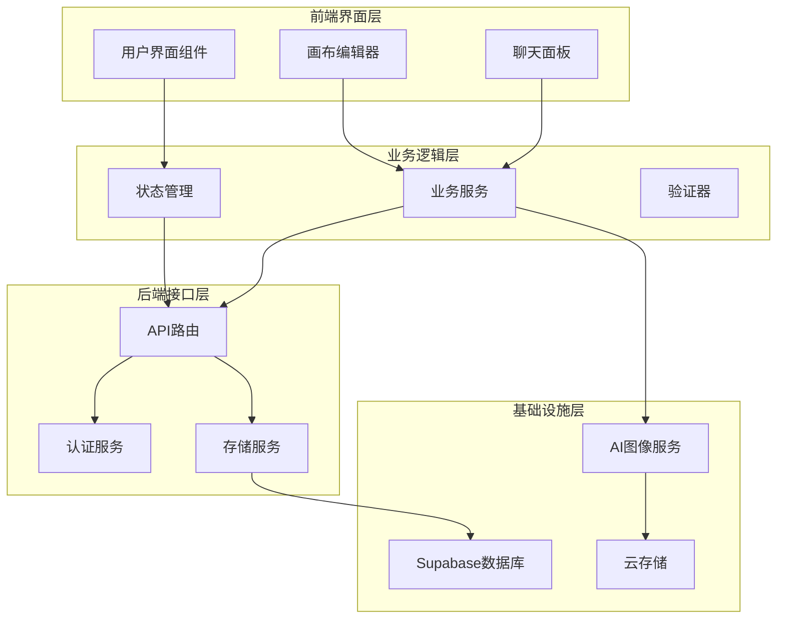
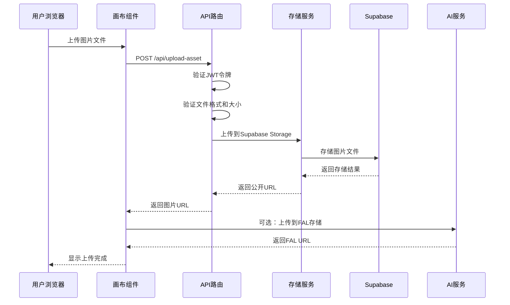
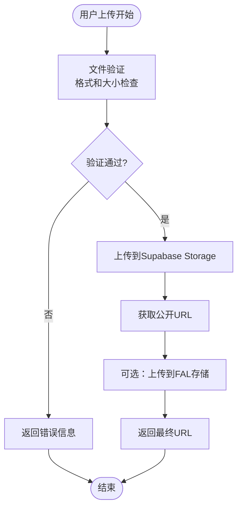
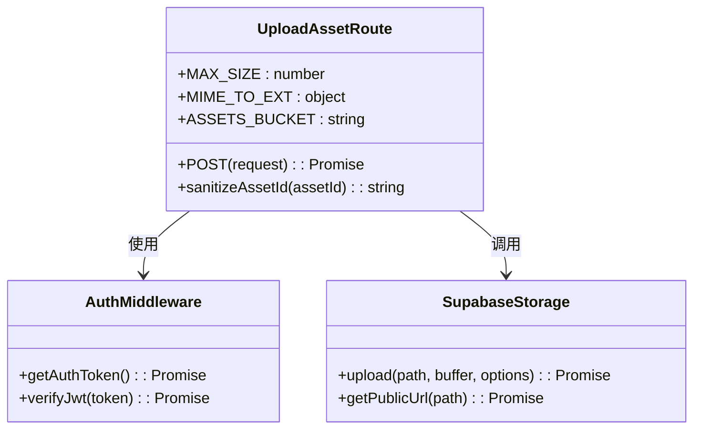
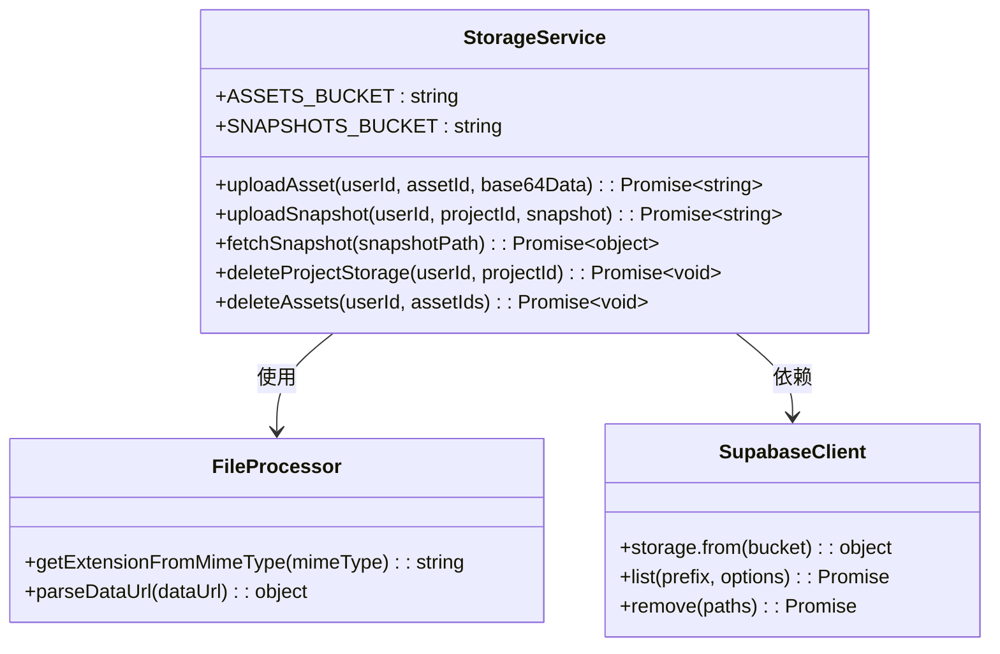
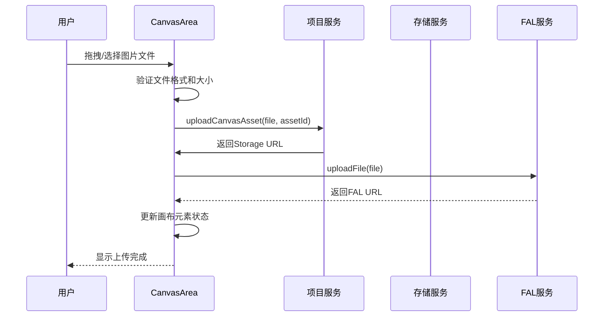
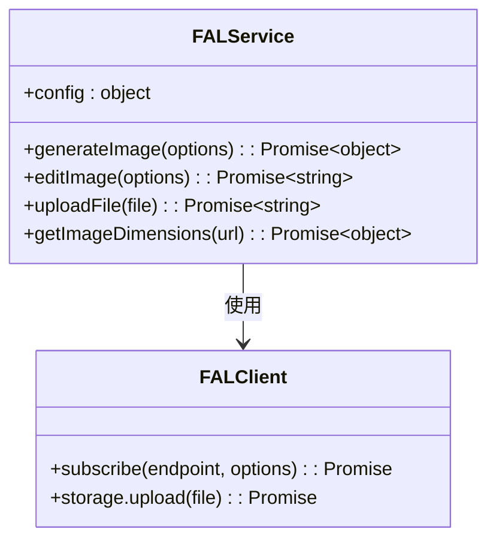
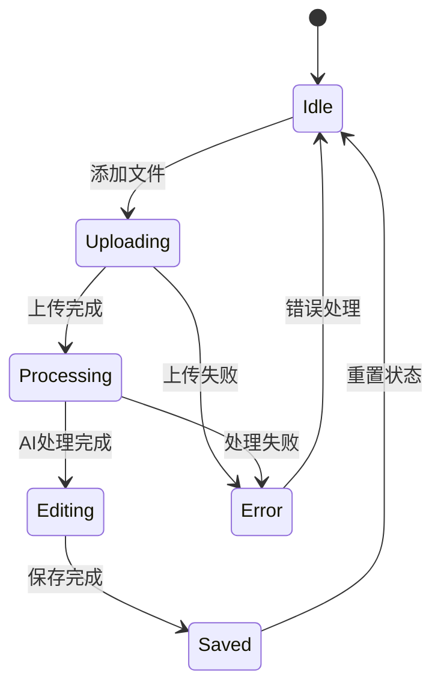
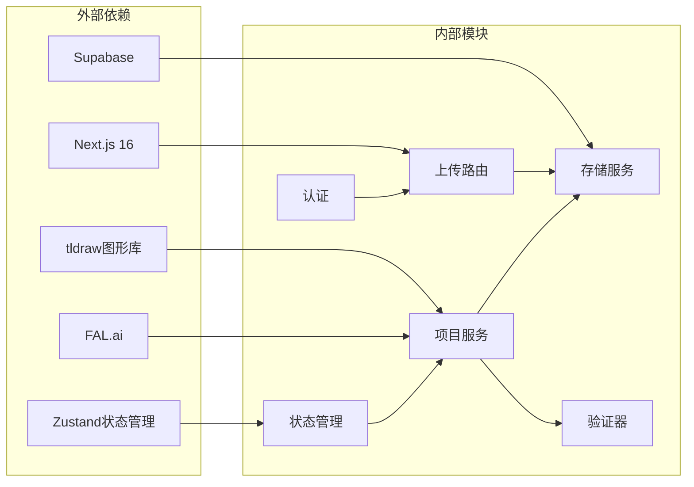
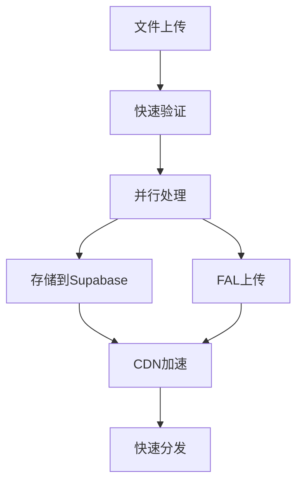

# 资产上传系统

<cite>
**本文档引用的文件**
- [app/api/upload-asset/route.ts](file://app/api/upload-asset/route.ts)
- [lib/storage-service.ts](file://lib/storage-service.ts)
- [lib/project-service.ts](file://lib/project-service.ts)
- [lib/fal.ts](file://lib/fal.ts)
- [lib/validate.ts](file://lib/validate.ts)
- [lib/store.ts](file://lib/store.ts)
- [lib/auth.ts](file://lib/auth.ts)
- [components/canvas/CanvasArea.tsx](file://components/canvas/CanvasArea.tsx)
- [components/canvas/InlineEditPanel.tsx](file://components/canvas/InlineEditPanel.tsx)
- [app/api/projects/[id]/route.ts](file://app/api/projects/[id]/route.ts)
- [middleware.ts](file://middleware.ts)
- [supabase/schema.sql](file://supabase/schema.sql)
- [package.json](file://package.json)
</cite>

## 目录
1. [简介](#简介)
2. [项目结构](#项目结构)
3. [核心组件](#核心组件)
4. [架构概览](#架构概览)
5. [详细组件分析](#详细组件分析)
6. [依赖关系分析](#依赖关系分析)
7. [性能考虑](#性能考虑)
8. [故障排除指南](#故障排除指南)
9. [结论](#结论)

## 简介

LoveArt 是一个基于 Next.js 的数字艺术创作平台，专注于提供高质量的图像生成和编辑体验。该系统的核心功能是资产上传系统，它支持用户上传图片资源、与 AI 图像生成服务集成，并提供可靠的存储管理机制。

系统采用现代化的技术栈，包括 Next.js 16、tldraw 图形编辑器、Supabase 数据库和存储服务，以及 FAL.ai 的 AI 图像生成能力。整个架构设计注重用户体验、性能优化和可扩展性。

## 项目结构

项目采用模块化的组织方式，主要分为以下几个核心部分：

**图表来源**
- [package.json:11-34](file://package.json#L11-L34)
- [lib/store.ts:107-426](file://lib/store.ts#L107-L426)

**章节来源**
- [package.json:1-54](file://package.json#L1-L54)
- [README.md:1-37](file://README.md#L1-L37)

## 核心组件

### 资产上传服务

资产上传系统是整个平台的核心功能之一，负责处理用户上传的图片资源。系统支持多种图片格式（JPG、PNG、WebP），文件大小限制为10MB，并提供双重存储策略。

### 存储管理服务

系统采用双存储策略：
- **Canvas Assets Bucket**: 存储用户上传的图片资源，支持公开访问
- **Canvas Snapshots Bucket**: 存储项目快照JSON文件，仅供服务端访问

### AI 图像生成集成

系统集成了 FAL.ai 的 AI 图像生成功能，支持：
- 文本到图像生成
- 图像编辑和修改
- 参考图上传和处理
- 实时进度监控

### 状态管理系统

基于 Zustand 的轻量级状态管理，提供：
- 画布元素状态管理
- 用户交互状态
- 项目元数据管理
- 聊天历史记录

**章节来源**
- [lib/storage-service.ts:1-324](file://lib/storage-service.ts#L1-L324)
- [lib/project-service.ts:70-91](file://lib/project-service.ts#L70-L91)
- [lib/fal.ts:155-170](file://lib/fal.ts#L155-L170)

## 架构概览

系统采用分层架构设计，确保各层职责清晰分离：

**图表来源**
- [app/api/upload-asset/route.ts:31-145](file://app/api/upload-asset/route.ts#L31-L145)
- [lib/storage-service.ts:65-113](file://lib/storage-service.ts#L65-L113)

### 数据流架构

**图表来源**
- [lib/validate.ts:9-13](file://lib/validate.ts#L9-L13)
- [lib/storage-service.ts:65-113](file://lib/storage-service.ts#L65-L113)

## 详细组件分析

### 资产上传路由处理器

上传路由处理器是系统的核心入口点，负责处理所有图片上传请求：

**图表来源**
- [app/api/upload-asset/route.ts:31-145](file://app/api/upload-asset/route.ts#L31-L145)
- [lib/auth.ts:52-55](file://lib/auth.ts#L52-L55)

#### 处理流程详解

1. **身份验证阶段**：验证JWT令牌的有效性
2. **文件解析阶段**：从FormData中提取文件和assetId
3. **格式验证阶段**：检查MIME类型和文件大小
4. **存储处理阶段**：上传到Supabase Storage
5. **URL生成阶段**：获取公开访问URL

**章节来源**
- [app/api/upload-asset/route.ts:31-145](file://app/api/upload-asset/route.ts#L31-L145)

### 存储服务管理器

存储服务提供了完整的文件管理功能：

**图表来源**
- [lib/storage-service.ts:65-324](file://lib/storage-service.ts#L65-L324)

#### 存储策略分析

系统采用双重存储策略：
- **Canvas Assets Bucket**: 用户上传的图片资源，支持公开访问
- **Canvas Snapshots Bucket**: 项目快照数据，仅供服务端访问

**章节来源**
- [lib/storage-service.ts:19-324](file://lib/storage-service.ts#L19-L324)

### 画布组件集成

画布组件实现了复杂的文件处理逻辑：

**图表来源**
- [components/canvas/CanvasArea.tsx:920-950](file://components/canvas/CanvasArea.tsx#L920-L950)
- [lib/project-service.ts:74-91](file://lib/project-service.ts#L74-L91)

#### 并行上传机制

系统实现了智能的并行上传策略：
- 同时上传到Supabase Storage和FAL.ai
- 优先使用Storage URL，回退到FAL URL
- 提供本地预览作为最终回退方案

**章节来源**
- [components/canvas/CanvasArea.tsx:920-950](file://components/canvas/CanvasArea.tsx#L920-L950)

### AI 图像生成服务

FAL.ai 集成提供了强大的图像生成能力：

**图表来源**
- [lib/fal.ts:155-170](file://lib/fal.ts#L155-L170)

#### 模型选择策略

系统根据输入条件智能选择模型：
- **纯文本生成**: 使用 `fal-ai/nano-banana-2`
- **图像编辑**: 使用 `fal-ai/nano-banana-2/edit`

**章节来源**
- [lib/fal.ts:45-109](file://lib/fal.ts#L45-L109)

### 状态管理系统

Zustand 状态管理提供了高效的状态维护：

**图表来源**
- [lib/store.ts:78-105](file://lib/store.ts#L78-L105)

#### 状态持久化机制

系统实现了智能的状态持久化：
- 用户聊天历史和项目名称持久化
- FAL API密钥持久化
- 临时状态（如上传状态）不持久化

**章节来源**
- [lib/store.ts:405-426](file://lib/store.ts#L405-L426)

## 依赖关系分析

系统依赖关系清晰，各模块职责明确：

**图表来源**
- [package.json:11-34](file://package.json#L11-L34)
- [lib/project-service.ts:1-225](file://lib/project-service.ts#L1-L225)

### 关键依赖特性

1. **Next.js 16**: 提供现代Web应用框架
2. **tldraw**: 强大的图形编辑能力
3. **Supabase**: 完整的后端即服务解决方案
4. **FAL.ai**: 专业的AI图像生成服务
5. **Zustand**: 轻量级状态管理

**章节来源**
- [package.json:11-34](file://package.json#L11-L34)

## 性能考虑

### 上传性能优化

系统采用了多项性能优化策略：

1. **并行上传**: 同时进行Storage和FAL上传
2. **智能回退**: 多层回退机制确保可靠性
3. **缓存策略**: 合理利用浏览器缓存
4. **内存管理**: 及时释放Blob URL资源

### 存储性能优化

**图表来源**
- [components/canvas/CanvasArea.tsx:920-950](file://components/canvas/CanvasArea.tsx#L920-L950)

## 故障排除指南

### 常见问题及解决方案

#### 1. 上传失败问题

**症状**: 文件上传后无法显示或报错

**可能原因**:
- 文件格式不支持
- 文件大小超出限制
- 网络连接问题
- 存储服务异常

**解决步骤**:
1. 检查文件格式是否为JPG/PNG/WebP
2. 确认文件大小不超过10MB
3. 验证网络连接稳定性
4. 查看控制台错误日志

#### 2. 权限验证失败

**症状**: 访问受保护资源时返回401错误

**解决方法**:
1. 检查JWT令牌是否有效
2. 确认用户已登录
3. 验证令牌是否过期
4. 重新登录获取新令牌

#### 3. 存储空间不足

**症状**: 上传新文件时报存储空间不足

**解决方法**:
1. 清理不再使用的项目
2. 删除不需要的图片资源
3. 检查项目快照清理情况
4. 联系管理员扩容

**章节来源**
- [lib/validate.ts:1-14](file://lib/validate.ts#L1-L14)
- [lib/auth.ts:21-28](file://lib/auth.ts#L21-L28)

### 调试工具和技巧

1. **浏览器开发者工具**: 检查网络请求和响应
2. **控制台日志**: 查看详细的错误信息
3. **Supabase仪表板**: 监控存储使用情况
4. **FAL.ai控制台**: 跟踪AI生成任务状态

## 结论

LoveArt 资产上传系统是一个设计精良、功能完善的现代化Web应用。系统的主要优势包括：

### 技术优势

1. **架构清晰**: 分层设计确保了良好的可维护性
2. **性能优秀**: 并行处理和智能回退机制提升了用户体验
3. **扩展性强**: 模块化设计便于功能扩展
4. **可靠性高**: 多层验证和错误处理机制

### 功能特色

1. **多存储策略**: 同时支持本地和云端存储
2. **AI集成**: 深度整合FAL.ai图像生成功能
3. **实时协作**: 基于tldraw的实时图形编辑
4. **智能回退**: 多层次的容错机制

### 发展建议

1. **监控增强**: 添加更详细的性能监控指标
2. **缓存优化**: 实现更智能的缓存策略
3. **安全加固**: 增强文件内容安全检测
4. **国际化**: 支持多语言界面

该系统为数字艺术创作提供了强大而灵活的基础设施，为未来的功能扩展和技术演进奠定了坚实基础。