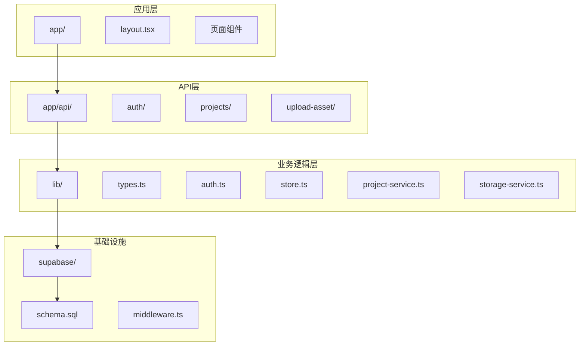
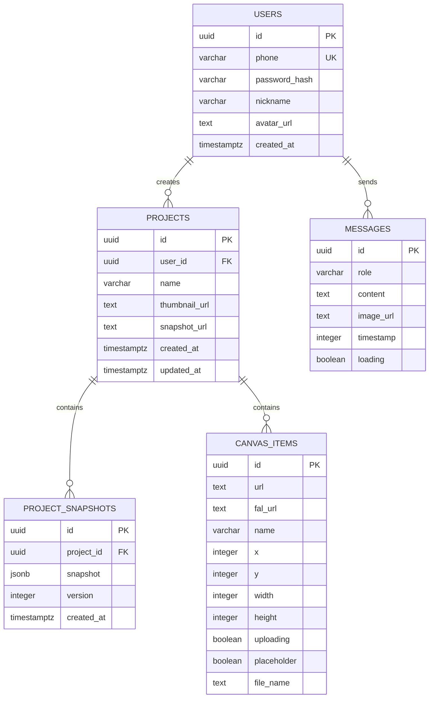
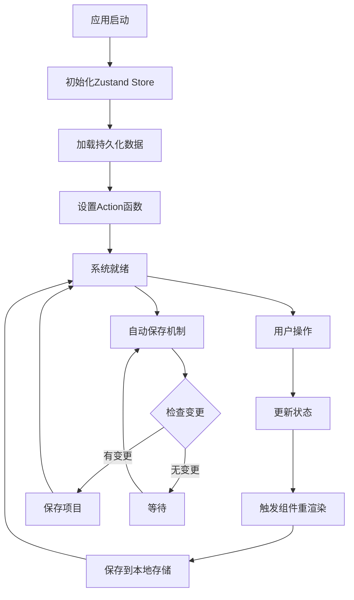
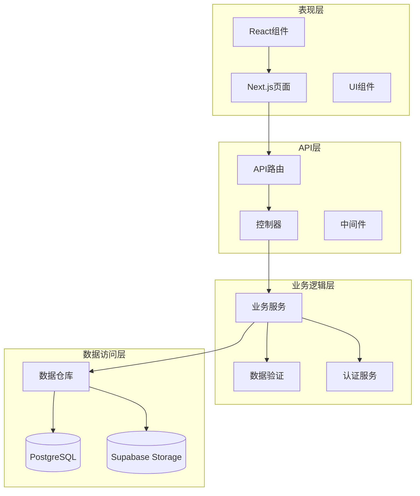
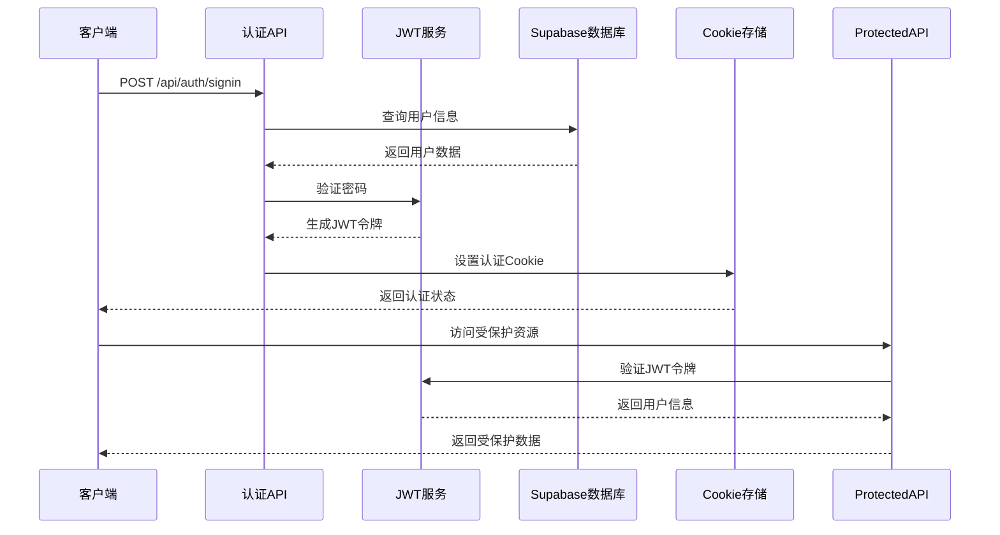
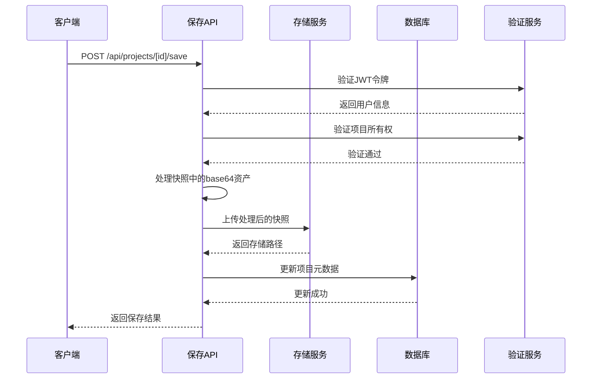
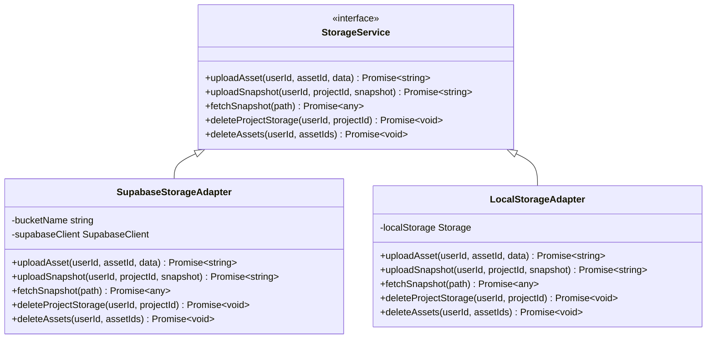
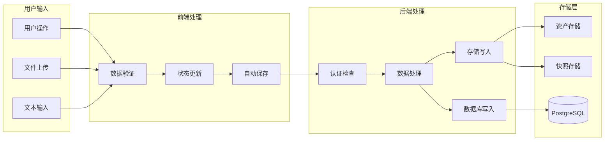
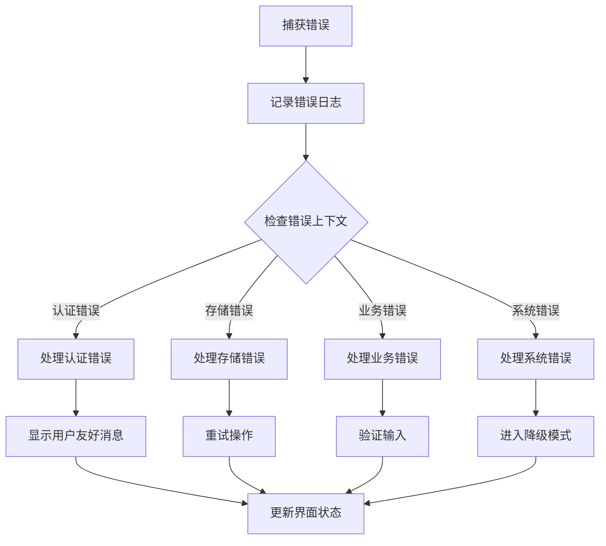

# 项目管理API系统

<cite>
**本文档引用的文件**
- [README.md](file://README.md)
- [package.json](file://package.json)
- [lib/types.ts](file://lib/types.ts)
- [lib/auth.ts](file://lib/auth.ts)
- [lib/project-service.ts](file://lib/project-service.ts)
- [lib/supabase-server.ts](file://lib/supabase-server.ts)
- [lib/store.ts](file://lib/store.ts)
- [lib/storage-service.ts](file://lib/storage-service.ts)
- [middleware.ts](file://middleware.ts)
- [app/api/projects/route.ts](file://app/api/projects/route.ts)
- [app/api/projects/[id]/route.ts](file://app/api/projects/[id]/route.ts)
- [app/api/projects/[id]/save/route.ts](file://app/api/projects/[id]/save/route.ts)
- [app/api/upload-asset/route.ts](file://app/api/upload-asset/route.ts)
- [app/api/auth/me/route.ts](file://app/api/auth/me/route.ts)
- [app/api/auth/signin/route.ts](file://app/api/auth/signin/route.ts)
- [app/api/auth/signup/route.ts](file://app/api/auth/signup/route.ts)
- [supabase/schema.sql](file://supabase/schema.sql)
</cite>

## 目录
1. [项目概述](#项目概述)
2. [项目结构](#项目结构)
3. [核心组件](#核心组件)
4. [架构概览](#架构概览)
5. [详细组件分析](#详细组件分析)
6. [依赖关系分析](#依赖关系分析)
7. [性能考虑](#性能考虑)
8. [故障排除指南](#故障排除指南)
9. [结论](#结论)

## 项目概述

LoveArt是一个基于Next.js构建的项目管理API系统，专注于提供一个完整的项目管理和协作平台。该系统集成了实时画布编辑、AI图像生成、用户认证和项目持久化等功能。

### 主要特性
- **实时项目管理**: 支持项目的创建、编辑、删除和版本控制
- **智能画布编辑**: 基于TLDRAW的交互式画布编辑功能
- **AI集成**: 通过FAL AI服务提供图像生成功能
- **安全认证**: 基于JWT的用户认证和授权机制
- **云端存储**: 使用Supabase Storage进行资源和快照的云端存储
- **自动保存**: 智能的防抖保存机制，确保数据安全

## 项目结构

项目采用现代化的Next.js架构，按照功能模块进行组织：



**图表来源**
- [package.json:1-54](file://package.json#L1-L54)
- [lib/types.ts:1-85](file://lib/types.ts#L1-L85)

**章节来源**
- [README.md:1-37](file://README.md#L1-L37)
- [package.json:1-54](file://package.json#L1-L54)

## 核心组件

### 数据模型架构

系统定义了完整的数据模型体系，支持复杂的项目管理需求：



**图表来源**
- [lib/types.ts:51-85](file://lib/types.ts#L51-L85)
- [supabase/schema.sql:26-51](file://supabase/schema.sql#L26-L51)

### 状态管理系统

系统使用Zustand实现全局状态管理，支持复杂的UI状态同步：



**图表来源**
- [lib/store.ts:107-427](file://lib/store.ts#L107-L427)

**章节来源**
- [lib/types.ts:1-85](file://lib/types.ts#L1-L85)
- [lib/store.ts:1-427](file://lib/store.ts#L1-L427)

## 架构概览

系统采用分层架构设计，确保关注点分离和可维护性：



**图表来源**
- [middleware.ts:1-80](file://middleware.ts#L1-L80)
- [lib/auth.ts:1-64](file://lib/auth.ts#L1-L64)

### 认证流程

系统实现了完整的JWT认证流程，确保用户身份的安全验证：



**图表来源**
- [app/api/auth/signin/route.ts:8-93](file://app/api/auth/signin/route.ts#L8-L93)
- [lib/auth.ts:13-28](file://lib/auth.ts#L13-L28)

**章节来源**
- [middleware.ts:17-66](file://middleware.ts#L17-L66)
- [lib/auth.ts:1-64](file://lib/auth.ts#L1-L64)

## 详细组件分析

### 项目管理服务

项目管理服务提供了完整的CRUD操作和高级功能：

```mermaid
classDiagram
class ProjectService {
+listProjects() Promise~ProjectMeta[]~
+createProject(name) Promise~{projectId}~
+loadProject(id) Promise~ProjectDetail~
+saveProjectSnapshot(id, snapshot, name) Promise~void~
+deleteProject(id) Promise~void~
+updateProjectName(id, name) Promise~void~
+uploadCanvasAsset(file, assetId) Promise~string~
+setupAutoSave(editor, projectId, getState) () => void
}
class AutoSaveMechanism {
-debounceTimer Timeout
-isSaving boolean
-hasPendingChanges boolean
-savedStatusTimer Timeout
+scheduleSave(delay) void
+runSave() Promise~void~
+debouncedSave() void
+forceSave() void
+handleBeforeUnload(e) void
}
class StorageService {
+uploadAsset(userId, assetId, base64Data) Promise~string~
+uploadSnapshot(userId, projectId, snapshot) Promise~string~
+fetchSnapshot(path) Promise~ExtendedSnapshot~
+deleteProjectStorage(userId, projectId) Promise~void~
+deleteAssets(userId, assetIds) Promise~void~
}
ProjectService --> AutoSaveMechanism : 使用
ProjectService --> StorageService : 依赖
```

**图表来源**
- [lib/project-service.ts:6-225](file://lib/project-service.ts#L6-L225)
- [lib/storage-service.ts:65-324](file://lib/storage-service.ts#L65-L324)

#### 自动保存机制

系统实现了智能的防抖保存机制，确保用户体验和数据安全：

```mermaid
flowchart TD
USER_EDIT[用户编辑画布] --> DETECT_CHANGE{检测到变更}
DETECT_CHANGE --> |是| SET_PENDING[标记有待保存的变更]
DETECT_CHANGE --> |否| WAIT[等待]
SET_PENDING --> SCHEDULE_SAVE[调度保存(1500ms防抖)]
SCHEDULE_SAVE --> CHECK_RESTORING{检查恢复状态}
CHECK_RESTORING --> |正在恢复| SKIP_SAVE[跳过保存]
CHECK_RESTORING --> |正常状态| RUN_SAVE[执行保存]
RUN_SAVE --> CHECK_PROJECT_ID{验证项目ID}
CHECK_PROJECT_ID --> |ID不匹配| SKIP_SAVE
CHECK_PROJECT_ID --> |ID匹配| SET_SAVING[设置保存中状态]
SET_SAVING --> GET_SNAPSHOT[获取画布快照]
GET_SNAPSHOT --> PROCESS_SNAPSHOT[处理快照中的资产]
PROCESS_SNAPSHOT --> UPLOAD_SNAPSHOT[上传快照到存储]
UPLOAD_SNAPSHOT --> UPDATE_PROJECT[更新项目元数据]
UPDATE_PROJECT --> SET_SAVED[设置已保存状态]
SET_SAVED --> CLEAR_PENDING[清除待保存标记]
CLEAR_PENDING --> WAIT
SKIP_SAVE --> WAIT
```

**图表来源**
- [lib/project-service.ts:97-225](file://lib/project-service.ts#L97-L225)

**章节来源**
- [lib/project-service.ts:1-225](file://lib/project-service.ts#L1-L225)

### API路由架构

系统采用Next.js App Router模式，实现了RESTful API设计：

```mermaid
graph LR
subgraph "认证API"
ME[GET /api/auth/me]
SIGNIN[POST /api/auth/signin]
SIGNUP[POST /api/auth/signup]
SEND_CODE[POST /api/auth/send-code]
SIGNOUT[POST /api/auth/signout]
end
subgraph "项目API"
LIST_PROJECTS[GET /api/projects]
CREATE_PROJECT[POST /api/projects]
GET_PROJECT[GET /api/projects/[id]]
SAVE_PROJECT[POST /api/projects/[id]/save]
DELETE_PROJECT[DELETE /api/projects/[id]]
UPDATE_PROJECT[PATCH /api/projects/[id]]
end
subgraph "资源API"
UPLOAD_ASSET[POST /api/upload-asset]
end
AUTH_API --> PROJECT_API
PROJECT_API --> RESOURCE_API
```

**图表来源**
- [app/api/auth/me/route.ts:5-54](file://app/api/auth/me/route.ts#L5-L54)
- [app/api/projects/route.ts:9-133](file://app/api/projects/route.ts#L9-L133)
- [app/api/upload-asset/route.ts:31-145](file://app/api/upload-asset/route.ts#L31-L145)

#### 项目保存流程

项目保存流程确保数据的一致性和完整性：



**图表来源**
- [app/api/projects/[id]/save/route.ts:63-194](file://app/api/projects/[id]/save/route.ts#L63-L194)

**章节来源**
- [app/api/projects/[id]/save/route.ts:1-194](file://app/api/projects/[id]/save/route.ts#L1-L194)

### 存储服务架构

系统实现了灵活的存储抽象，支持多种存储策略：



**图表来源**
- [lib/storage-service.ts:19-324](file://lib/storage-service.ts#L19-L324)

**章节来源**
- [lib/storage-service.ts:1-324](file://lib/storage-service.ts#L1-L324)

## 依赖关系分析

系统依赖关系清晰，遵循单一职责原则：

```mermaid
graph TD
subgraph "外部依赖"
NEXTJS[Next.js 16.2.1]
TLDRAW[TLEditor 4.5.3]
SUPABASE[@supabase/supabase-js 2.100.1]
ZUSTAND[zustand 5.0.12]
BCRYPT[bcryptjs 3.0.3]
end
subgraph "内部模块"
AUTH[认证模块]
STORE[状态管理]
SERVICE[业务服务]
STORAGE[存储服务]
TYPES[类型定义]
end
subgraph "工具库"
JWT[jose 6.2.2]
NANOID[nanoid 5.1.7]
LUCIDE[lucide-react 1.6.0]
TAILWIND[tailwind-merge 3.5.0]
end
NEXTJS --> AUTH
NEXTJS --> STORE
AUTH --> SUPABASE
STORE --> ZUSTAND
SERVICE --> SUPABASE
SERVICE --> STORAGE
STORAGE --> SUPABASE
AUTH --> JWT
SERVICE --> TYPES
STORE --> TYPES
```

**图表来源**
- [package.json:11-35](file://package.json#L11-L35)
- [lib/types.ts:1-85](file://lib/types.ts#L1-L85)

### 数据流分析

系统实现了清晰的数据流向，确保数据的一致性和完整性：



**图表来源**
- [lib/project-service.ts:97-225](file://lib/project-service.ts#L97-L225)
- [lib/storage-service.ts:122-157](file://lib/storage-service.ts#L122-L157)

**章节来源**
- [package.json:1-54](file://package.json#L1-L54)

## 性能考虑

系统在多个层面进行了性能优化：

### 缓存策略
- **本地缓存**: 使用localStorage存储持久化状态
- **会话缓存**: 使用内存存储临时状态
- **CDN加速**: 通过Supabase Storage提供静态资源加速

### 异步处理
- **防抖机制**: 1500ms防抖延迟减少不必要的保存操作
- **并发控制**: 保存操作的互斥锁防止竞态条件
- **批量操作**: 支持批量文件上传和删除

### 资源管理
- **内存优化**: 及时释放Object URLs避免内存泄漏
- **连接池**: Supabase客户端连接复用
- **压缩传输**: JSON数据的压缩传输

## 故障排除指南

### 常见问题及解决方案

#### 认证相关问题
- **问题**: 登录后仍显示未登录状态
- **原因**: JWT令牌过期或Cookie设置失败
- **解决**: 检查JWT_SECRET配置和Cookie域设置

#### 存储相关问题
- **问题**: 项目保存失败
- **原因**: Supabase Storage权限不足或网络连接问题
- **解决**: 验证服务角色密钥和存储桶权限配置

#### 性能相关问题
- **问题**: 页面加载缓慢
- **原因**: 防抖时间过长或保存频率过高
- **解决**: 调整防抖参数和优化图片资源

**章节来源**
- [lib/auth.ts:57-64](file://lib/auth.ts#L57-L64)
- [lib/supabase-server.ts:19-28](file://lib/supabase-server.ts#L19-L28)

### 错误监控

系统实现了全面的错误监控机制：



**图表来源**
- [middleware.ts:47-56](file://middleware.ts#L47-L56)
- [lib/project-service.ts:165-173](file://lib/project-service.ts#L165-L173)

## 结论

LoveArt项目管理API系统展现了现代Web应用的最佳实践，通过合理的架构设计和丰富的功能实现，为用户提供了完整的项目管理解决方案。

### 系统优势
- **架构清晰**: 分层设计确保了良好的可维护性
- **功能完整**: 覆盖了项目管理的核心需求
- **性能优秀**: 多层次的优化确保了流畅的用户体验
- **安全可靠**: 完善的认证授权机制保障了数据安全

### 技术亮点
- **智能自动保存**: 防抖机制平衡了用户体验和数据安全
- **云端存储**: 基于Supabase的分布式存储方案
- **实时协作**: 支持多用户协同编辑
- **AI集成**: 无缝集成AI图像生成功能

该系统为类似项目管理应用的开发提供了优秀的参考模板，其设计理念和实现方式值得其他开发者学习和借鉴。