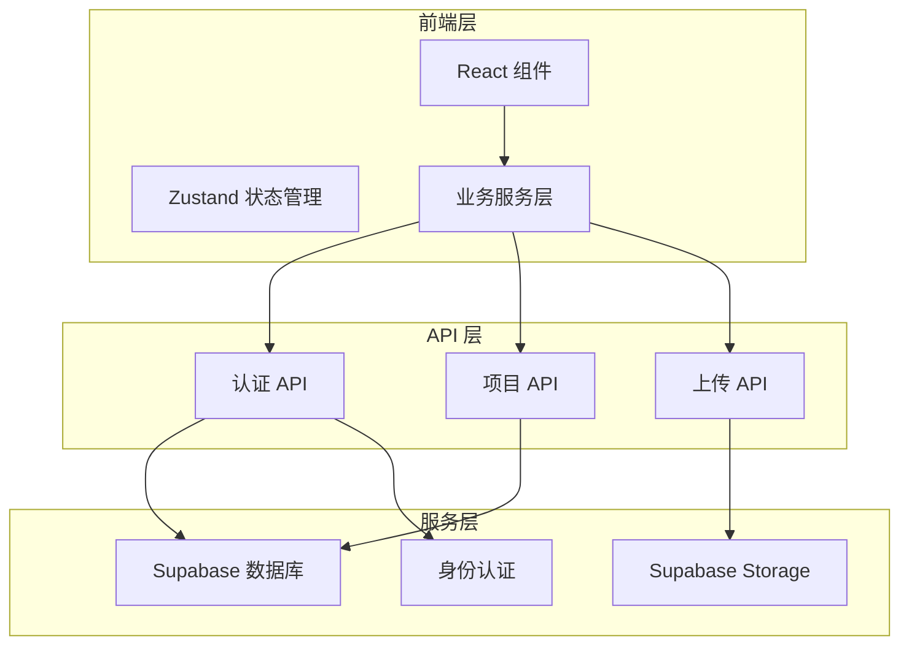
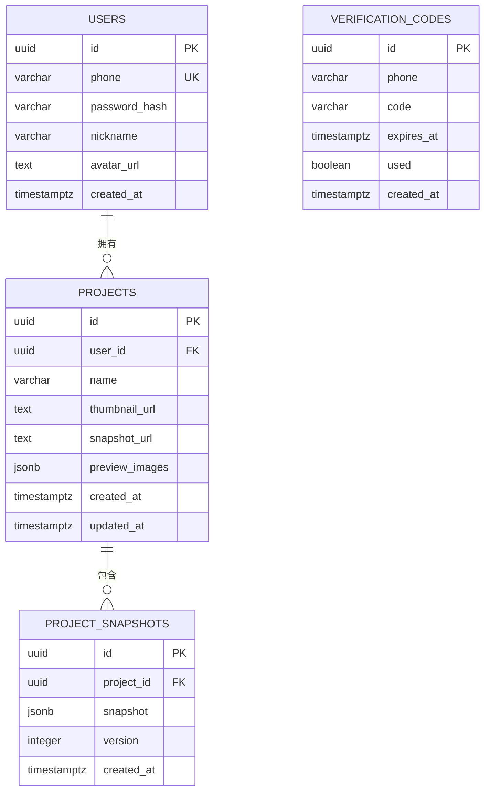
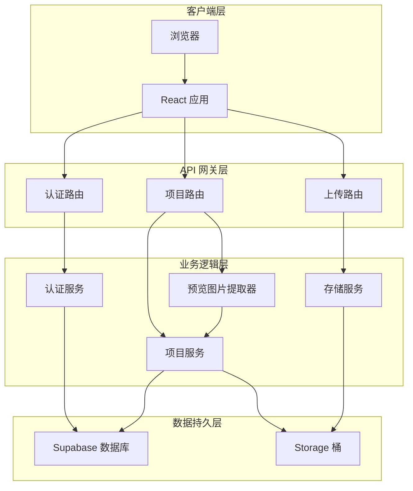
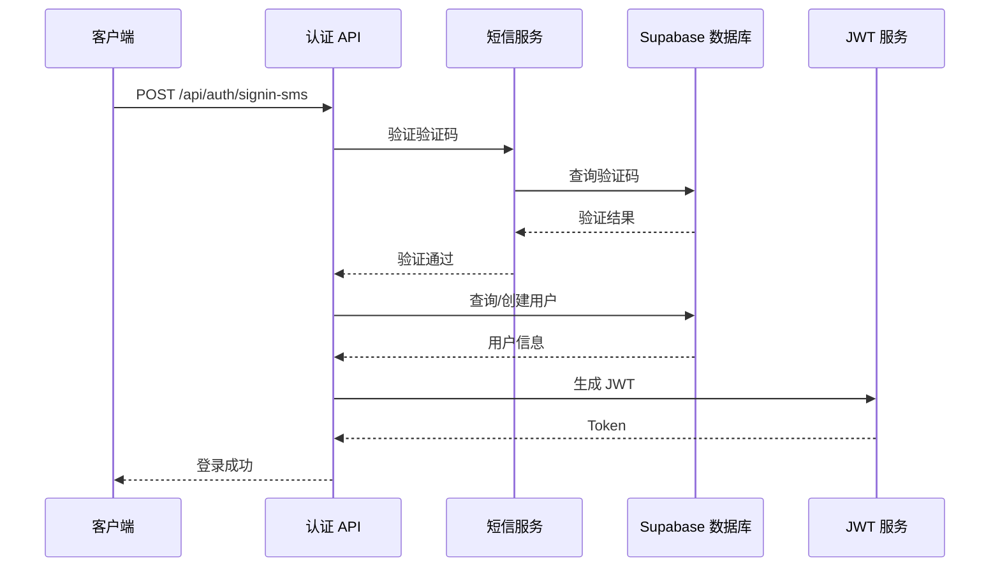
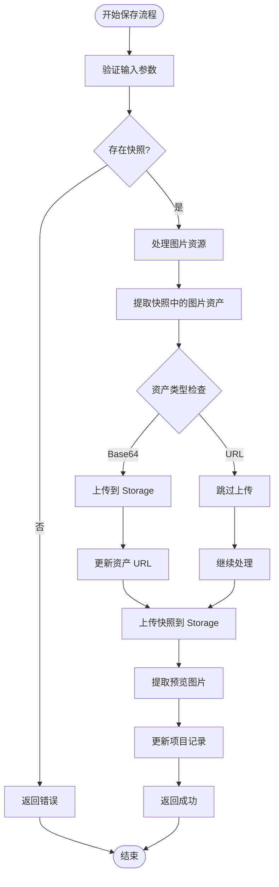
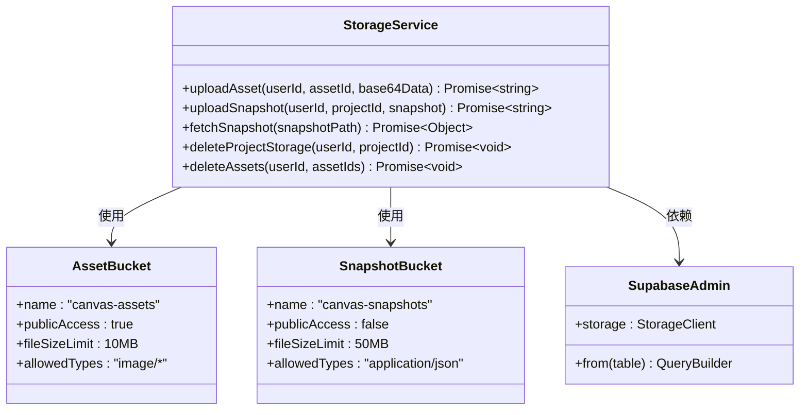
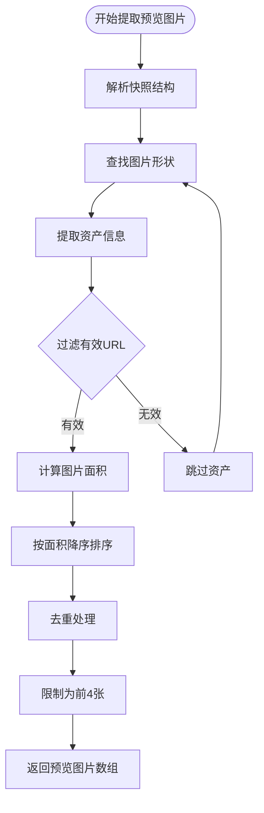
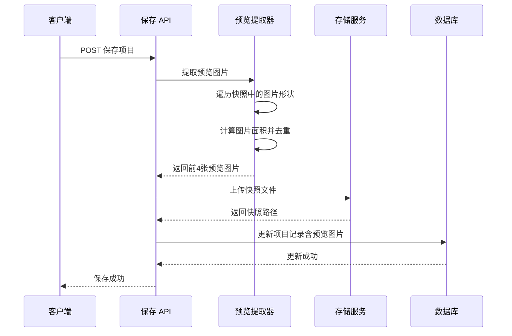
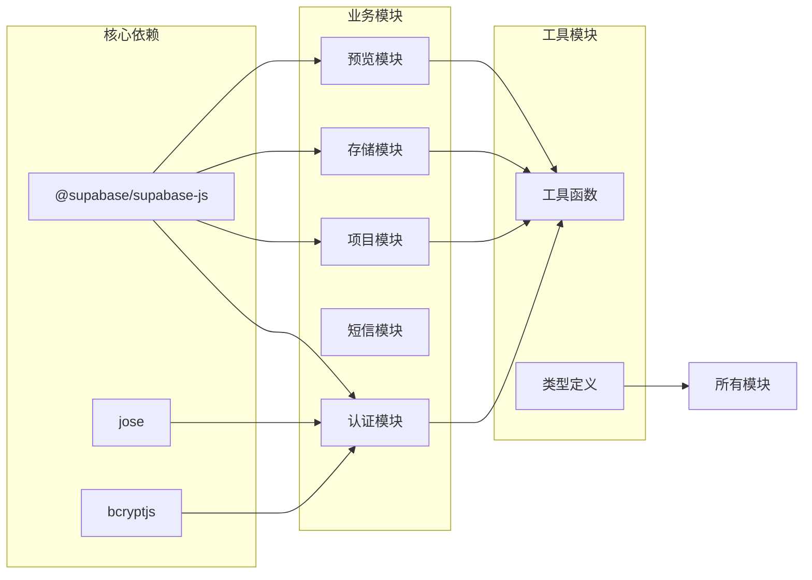
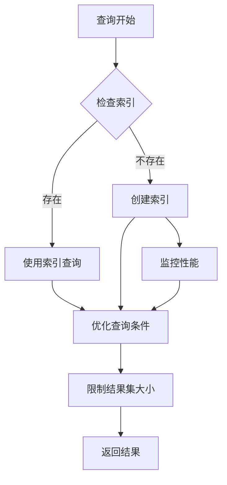

# 数据库架构更新文档

<cite>
**本文档中引用的文件**
- [schema.sql](file://supabase/schema.sql)
- [supabase-server.ts](file://lib/supabase-server.ts)
- [types.ts](file://lib/types.ts)
- [auth.ts](file://lib/auth.ts)
- [sms.ts](file://lib/sms.ts)
- [project-service.ts](file://lib/project-service.ts)
- [storage-service.ts](file://lib/storage-service.ts)
- [route.ts](file://app/api/auth/me/route.ts)
- [route.ts](file://app/api/projects/route.ts)
- [route.ts](file://app/api/projects/[id]/route.ts)
- [route.ts](file://app/api/projects/[id]/save/route.ts)
- [route.ts](file://app/api/auth/signin-sms/route.ts)
- [route.ts](file://app/api/auth/signup/route.ts)
</cite>

## 更新摘要
**变更内容**
- 新增项目预览图片功能，支持从快照中自动提取预览图
- 数据库模式更新：添加preview_images JSONB列
- 新增extractPreviewImages函数实现预览图提取逻辑
- 更新项目API以支持预览图片的读取和写入

## 目录
1. [简介](#简介)
2. [项目结构概览](#项目结构概览)
3. [核心数据库架构](#核心数据库架构)
4. [架构总览](#架构总览)
5. [详细组件分析](#详细组件分析)
6. [预览图片功能](#预览图片功能)
7. [依赖关系分析](#依赖关系分析)
8. [性能考虑](#性能考虑)
9. [故障排除指南](#故障排除指南)
10. [结论](#结论)

## 简介

Loveart 是一个基于 Next.js 和 Supabase 的数字艺术创作平台。本项目专注于数据库架构的现代化升级，特别是从传统的 JSONB 快照存储迁移到基于 Supabase Storage 的文件存储系统。本次更新实现了更高效的数据存储、更好的可扩展性和更强的系统稳定性。

**更新** 新增了项目预览图片功能，支持从快照中自动提取前4张最大面积的图片作为项目预览图，提升用户体验和项目展示效果。

## 项目结构概览

项目采用现代全栈架构设计，主要分为以下几个层次：

**图表来源**
- [supabase-server.ts:1-29](file://lib/supabase-server.ts#L1-L29)
- [storage-service.ts:1-324](file://lib/storage-service.ts#L1-L324)

**章节来源**
- [supabase-server.ts:1-29](file://lib/supabase-server.ts#L1-L29)
- [storage-service.ts:1-324](file://lib/storage-service.ts#L1-L324)

## 核心数据库架构

### 数据库表结构

系统采用 PostgreSQL 作为主数据库，结合 Supabase 的强大功能实现完整的数据管理：

**图表来源**
- [schema.sql:1-55](file://supabase/schema.sql#L1-L55)

### 关键特性

1. **用户管理系统**: 支持手机号登录和传统密码登录
2. **项目存储**: 采用混合存储策略（新版本使用 Storage，旧版本兼容 JSONB）
3. **预览图片功能**: 自动从快照中提取前4张最大面积的图片作为项目预览
4. **验证码系统**: 集成短信验证功能
5. **权限控制**: 基于用户 ID 的严格访问控制

**更新** 新增了preview_images JSONB列，用于存储项目预览图片URL数组，默认为空数组。

**章节来源**
- [schema.sql:1-55](file://supabase/schema.sql#L1-L55)
- [types.ts:60-67](file://lib/types.ts#L60-L67)

## 架构总览

系统采用分层架构设计，确保各组件职责清晰、耦合度低：

**图表来源**
- [auth.ts:1-64](file://lib/auth.ts#L1-L64)
- [project-service.ts:1-225](file://lib/project-service.ts#L1-L225)
- [storage-service.ts:1-324](file://lib/storage-service.ts#L1-L324)

## 详细组件分析

### 认证系统

认证系统支持多种登录方式，确保用户体验和安全性的平衡：

**图表来源**
- [route.ts:1-94](file://app/api/auth/signin-sms/route.ts#L1-L94)
- [sms.ts:43-115](file://lib/sms.ts#L43-L115)
- [auth.ts:13-28](file://lib/auth.ts#L13-L28)

### 项目管理系统

项目管理系统实现了从简单 CRUD 操作到复杂快照存储的完整生命周期管理：

**图表来源**
- [route.ts:55-194](file://app/api/projects/[id]/save/route.ts#L55-L194)
- [storage-service.ts:122-157](file://lib/storage-service.ts#L122-L157)

### 存储服务架构

存储服务采用了双桶架构，分别处理公共资源和私有资源：

**图表来源**
- [storage-service.ts:1-324](file://lib/storage-service.ts#L1-L324)
- [supabase-server.ts:1-29](file://lib/supabase-server.ts#L1-L29)

**章节来源**
- [auth.ts:1-64](file://lib/auth.ts#L1-L64)
- [project-service.ts:1-225](file://lib/project-service.ts#L1-L225)
- [storage-service.ts:1-324](file://lib/storage-service.ts#L1-L324)

## 预览图片功能

### 功能概述

预览图片功能允许系统从项目的快照中自动提取前4张最大面积的图片作为项目预览图，提升用户界面的视觉效果和项目展示能力。

### 技术实现

**图表来源**
- [route.ts:17-67](file://app/api/projects/[id]/save/route.ts#L17-L67)

### 数据流图

**图表来源**
- [route.ts:207-212](file://app/api/projects/[id]/save/route.ts#L207-L212)
- [route.ts:32-33](file://app/api/projects/route.ts#L32-L33)

### 数据结构

预览图片功能使用以下数据结构：

- **存储格式**: JSONB数组，存储图片URL字符串
- **提取规则**: 
  1. 从快照的store中查找所有图片形状
  2. 计算每张图片的面积（宽×高）
  3. 按面积降序排列
  4. 去除重复URL，保留面积最大的版本
  5. 限制为前4张图片
- **默认值**: 空数组'[]'

**章节来源**
- [schema.sql:35](file://supabase/schema.sql#L35)
- [route.ts:17-67](file://app/api/projects/[id]/save/route.ts#L17-L67)
- [route.ts:32-33](file://app/api/projects/route.ts#L32-L33)
- [types.ts:63-64](file://lib/types.ts#L63-L64)

## 依赖关系分析

系统各组件之间的依赖关系清晰明确，遵循单一职责原则：

**图表来源**
- [package.json:11-35](file://package.json#L11-L35)
- [supabase-server.ts:1-29](file://lib/supabase-server.ts#L1-L29)

**章节来源**
- [package.json:1-54](file://package.json#L1-L54)
- [supabase-server.ts:1-29](file://lib/supabase-server.ts#L1-L29)

## 性能考虑

### 存储优化策略

1. **分层存储架构**: 将公共资源和私有资源分离到不同存储桶
2. **索引优化**: 为常用查询字段建立复合索引
3. **缓存策略**: 利用 Supabase 的内置缓存机制
4. **异步处理**: 大文件上传采用异步处理模式
5. **预览图片缓存**: 预览图片URL可以被浏览器缓存，减少重复加载

### 查询性能优化

**更新** 预览图片查询优化：由于preview_images是JSONB类型，建议在高频查询场景下考虑添加GIN索引以提升查询性能。

**章节来源**
- [schema.sql:21-24](file://supabase/schema.sql#L21-L24)
- [schema.sql:48-50](file://supabase/schema.sql#L48-L50)

## 故障排除指南

### 常见问题及解决方案

1. **环境变量配置错误**
   - 检查 `NEXT_PUBLIC_SUPABASE_URL` 和 `SUPABASE_SERVICE_ROLE_KEY`
   - 确认环境变量在部署环境中正确设置

2. **存储权限问题**
   - 验证 Storage 桶的访问权限设置
   - 检查服务角色密钥的有效性

3. **认证失败**
   - 验证 JWT 密钥配置
   - 检查用户会话状态

4. **预览图片提取失败**
   - 检查快照数据结构是否符合预期
   - 验证图片形状的assetId格式
   - 确认URL格式为http/https协议

**更新** 新增预览图片功能相关的故障排除指导。

**章节来源**
- [supabase-server.ts:10-28](file://lib/supabase-server.ts#L10-L28)
- [storage-service.ts:1-17](file://lib/storage-service.ts#L1-L17)

## 结论

本次数据库架构更新成功实现了从传统 JSONB 存储到现代文件存储系统的迁移，并新增了预览图片功能。新架构具有以下优势：

1. **更好的可扩展性**: 支持更大规模的数据存储需求
2. **更高的性能**: 优化的存储结构和查询机制
3. **更强的安全性**: 分离的存储权限管理和访问控制
4. **更易维护**: 清晰的架构设计和模块化组织
5. **增强的用户体验**: 自动化的预览图片提取功能，提升项目展示效果

通过这次更新，Loveart 平台为未来的功能扩展和技术演进奠定了坚实的基础。预览图片功能的引入不仅提升了用户界面的视觉效果，也为项目管理和分享提供了更好的支持。