# 依赖管理

<cite>
**本文档引用的文件**
- [package.json](file://package.json)
- [lib/auth.ts](file://lib/auth.ts)
- [lib/supabase-server.ts](file://lib/supabase-server.ts)
- [lib/sms.ts](file://lib/sms.ts)
- [middleware.ts](file://middleware.ts)
- [app/api/auth/signin/route.ts](file://app/api/auth/signin/route.ts)
- [app/api/auth/signup/route.ts](file://app/api/auth/signup/route.ts)
- [app/api/auth/signin-sms/route.ts](file://app/api/auth/signin-sms/route.ts)
- [app/api/auth/me/route.ts](file://app/api/auth/me/route.ts)
- [app/api/auth/signout/route.ts](file://app/api/auth/signout/route.ts)
- [app/api/auth/send-code/route.ts](file://app/api/auth/send-code/route.ts)
- [next.config.ts](file://next.config.ts)
- [tsconfig.json](file://tsconfig.json)
- [vitest.config.ts](file://vitest.config.ts)
- [__tests__/setup.ts](file://__tests__/setup.ts)
</cite>

## 更新摘要
**变更内容**
- 新增密码哈希和认证相关依赖（bcryptjs、jose）
- 新增数据库连接依赖（@supabase/supabase-js）
- 新增阿里云 SDK 依赖（@alicloud 系列包）
- 新增认证中间件和完整认证 API 端点
- 新增短信验证码发送和验证功能

## 目录
1. [简介](#简介)
2. [项目结构](#项目结构)
3. [核心组件](#核心组件)
4. [架构概览](#架构概览)
5. [详细组件分析](#详细组件分析)
6. [依赖关系分析](#依赖关系分析)
7. [性能考虑](#性能考虑)
8. [故障排除指南](#故障排除指南)
9. [结论](#结论)

## 简介

Loveart 是一个基于 Next.js 的 AI 驱动创意设计平台，专注于图像生成和编辑功能。该项目采用现代前端技术栈，集成了多种第三方库和服务来实现丰富的用户体验。

**更新** 项目现已集成完整的用户认证系统，包括密码认证、短信验证码认证、JWT 令牌管理和数据库连接。

本项目的依赖管理策略体现了以下特点：
- 明确区分运行时依赖和开发依赖
- 使用 TypeScript 进行类型安全
- 集成多个专业库以实现特定功能
- 实现了完整的测试配置
- 新增企业级安全和数据库依赖

## 项目结构

项目采用模块化的组织方式，主要分为以下几个部分：

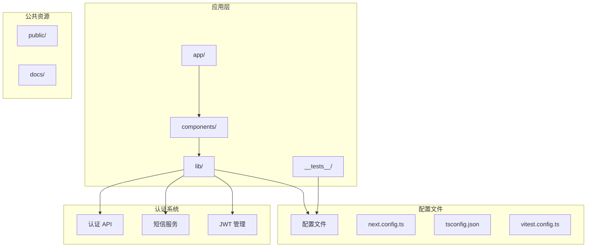

**图表来源**
- [package.json:1-54](file://package.json#L1-L54)
- [tsconfig.json:1-35](file://tsconfig.json#L1-L35)

**章节来源**
- [package.json:1-54](file://package.json#L1-L54)
- [tsconfig.json:1-35](file://tsconfig.json#L1-L35)

## 核心组件

### 依赖管理策略

**生产环境依赖 (24个)**
- 基础框架：Next.js 16.2.1, React 19.2.4
- UI 组件库：@base-ui/react, lucide-react, tailwind-merge
- 状态管理：zustand 5.0.12
- 图形处理：tldraw 4.5.3
- 工具函数：clsx 2.1.1, nanoid 5.1.7
- 字体和样式：geist 1.7.0
- 通知系统：sonner 2.0.7
- **新增认证依赖**：bcryptjs 3.0.3, jose 6.2.2
- **新增数据库依赖**：@supabase/supabase-js 2.100.1
- **新增阿里云依赖**：@alicloud/dysmsapi20170525 4.5.0, @alicloud/openapi-client 0.4.15, @alicloud/tea-util 1.4.11

**开发环境依赖 (15个)**
- 类型定义：@types/react, @types/node, @types/bcryptjs
- 构建工具：@vitejs/plugin-react, tailwindcss 4
- 测试框架：vitest 4.1.1, @testing-library/react
- 代码质量：eslint 9, jsdom 29.0.1

**章节来源**
- [package.json:11-34](file://package.json#L11-L34)
- [package.json:36-52](file://package.json#L36-L52)

### TypeScript 配置

项目使用严格的 TypeScript 配置确保代码质量：

- 模块解析：bundler（支持现代打包器）
- 路径映射：@/* → ./*
- 编译选项：严格模式、增量编译、JSX 支持
- 插件系统：Next.js 内置插件

**章节来源**
- [tsconfig.json:1-35](file://tsconfig.json#L1-L35)

## 架构概览

项目采用分层架构，每个层都有明确的职责分工：

```mermaid
graph TB
subgraph "表现层"
UI[UI 组件]
CHAT[聊天面板]
CANVAS[画布区域]
end
subgraph "业务逻辑层"
STORE[状态管理]
VALIDATE[验证逻辑]
UTILS[工具函数]
AUTH[认证服务]
SMS[短信服务]
end
subgraph "数据访问层"
SUPABASE[Supabase 数据库]
FAL[FAL API 客户端]
STORAGE[本地存储]
end
subgraph "基础设施"
NEXT[Next.js 框架]
TLDRAW[Tldraw 图形库]
BASEUI[Base UI]
JWT[JWt 认证]
ALICLOUD[阿里云 SDK]
END
UI --> STORE
CHAT --> STORE
CANVAS --> STORE
STORE --> FAL
STORE --> STORAGE
UI --> NEXT
CHAT --> NEXT
CANVAS --> TLDRAW
UI --> BASEUI
UI --> UTILS
AUTH --> JWT
AUTH --> SUPABASE
AUTH --> SMS
SMS --> ALICLOUD
VALIDATE --> UTILS
```

**图表来源**
- [lib/store.ts:1-199](file://lib/store.ts#L1-L199)
- [lib/fal.ts:1-62](file://lib/fal.ts#L1-L62)
- [lib/auth.ts:1-64](file://lib/auth.ts#L1-L64)
- [lib/sms.ts:1-115](file://lib/sms.ts#L1-L115)
- [lib/supabase-server.ts:1-16](file://lib/supabase-server.ts#L1-L16)

## 详细组件分析

### 认证系统

**更新** 新增完整的认证系统，包括密码认证、短信验证码认证和 JWT 令牌管理。

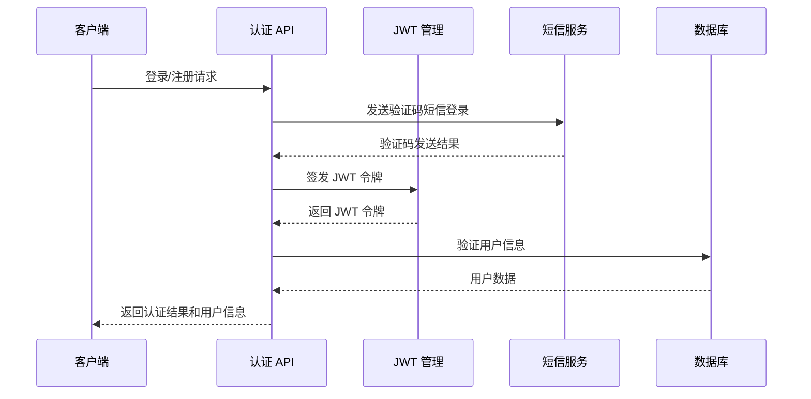

**图表来源**
- [lib/auth.ts:13-28](file://lib/auth.ts#L13-L28)
- [lib/sms.ts:43-90](file://lib/sms.ts#L43-L90)
- [app/api/auth/signin/route.ts:68-84](file://app/api/auth/signin/route.ts#L68-L84)

#### JWT 令牌管理

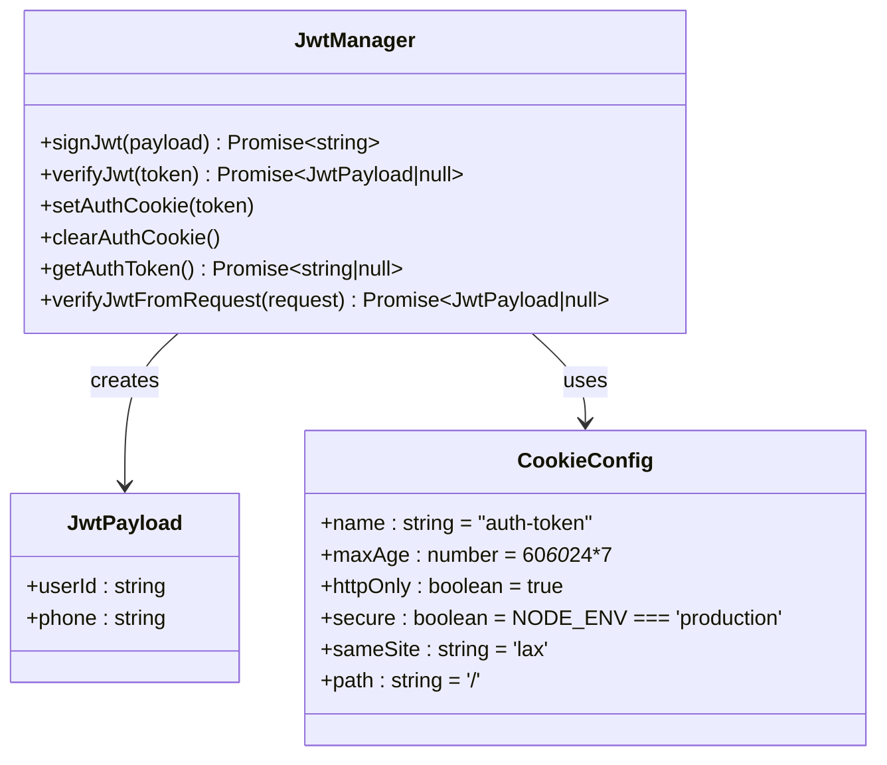

**图表来源**
- [lib/auth.ts:8-11](file://lib/auth.ts#L8-L11)
- [lib/auth.ts:30-55](file://lib/auth.ts#L30-L55)

**章节来源**
- [lib/auth.ts:1-64](file://lib/auth.ts#L1-L64)
- [middleware.ts:1-41](file://middleware.ts#L1-L41)

### 短信验证码服务

**更新** 新增阿里云短信服务集成，支持验证码发送和验证功能。

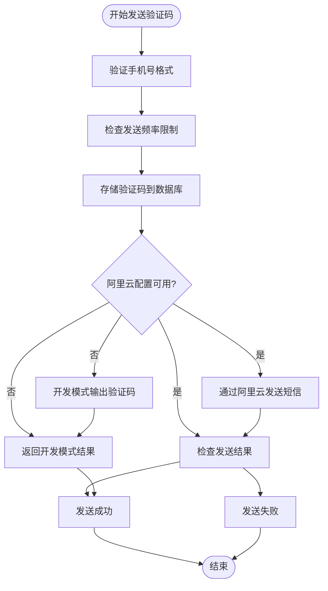

**图表来源**
- [lib/sms.ts:43-90](file://lib/sms.ts#L43-L90)
- [lib/sms.ts:12-41](file://lib/sms.ts#L12-L41)

#### 验证码验证流程

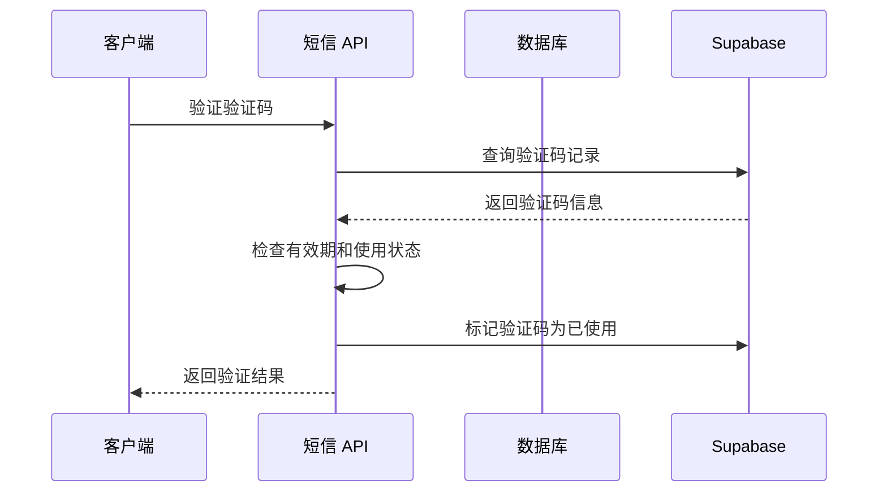

**图表来源**
- [lib/sms.ts:92-114](file://lib/sms.ts#L92-L114)
- [app/api/auth/send-code/route.ts:27](file://app/api/auth/send-code/route.ts#L27)

**章节来源**
- [lib/sms.ts:1-115](file://lib/sms.ts#L1-L115)
- [app/api/auth/send-code/route.ts:1-48](file://app/api/auth/send-code/route.ts#L1-L48)

### 数据库连接管理

**更新** 新增 Supabase 数据库连接管理，提供统一的数据库客户端访问接口。

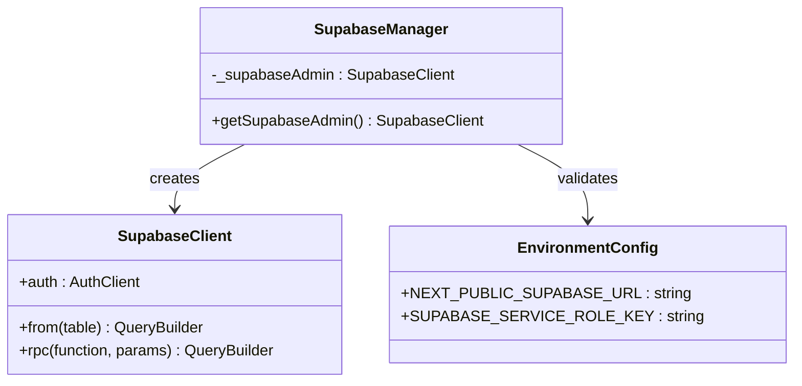

**图表来源**
- [lib/supabase-server.ts:5-15](file://lib/supabase-server.ts#L5-L15)

**章节来源**
- [lib/supabase-server.ts:1-16](file://lib/supabase-server.ts#L1-L16)

### 状态管理系统

状态管理采用 Zustand，实现了复杂的状态持久化机制：

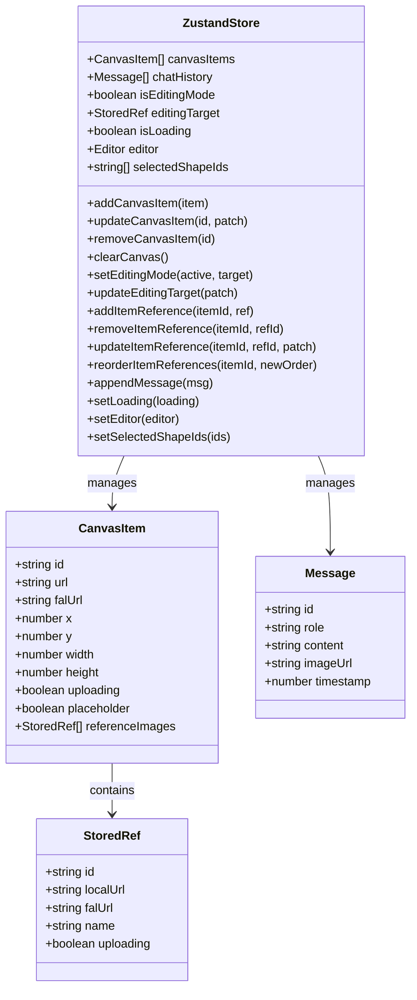

**图表来源**
- [lib/store.ts:20-60](file://lib/store.ts#L20-L60)
- [lib/types.ts:17-36](file://lib/types.ts#L17-L36)

#### 状态持久化机制

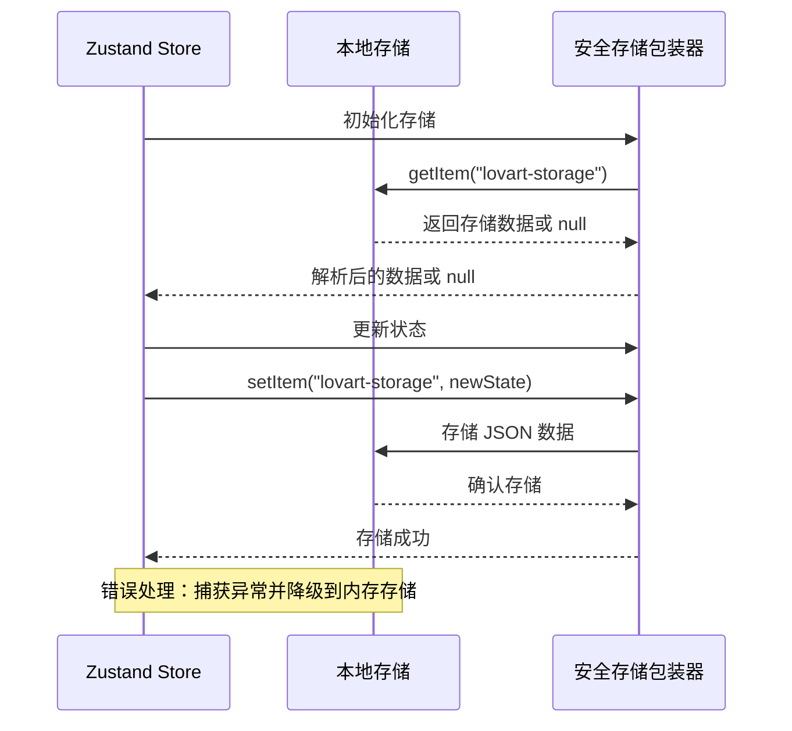

**图表来源**
- [lib/store.ts:8-18](file://lib/store.ts#L8-L18)
- [lib/store.ts:182-196](file://lib/store.ts#L182-L196)

**章节来源**
- [lib/store.ts:1-199](file://lib/store.ts#L1-L199)
- [lib/types.ts:1-37](file://lib/types.ts#L1-L37)

### FAL AI 服务集成

项目集成了 FAL AI 服务进行图像生成和编辑：

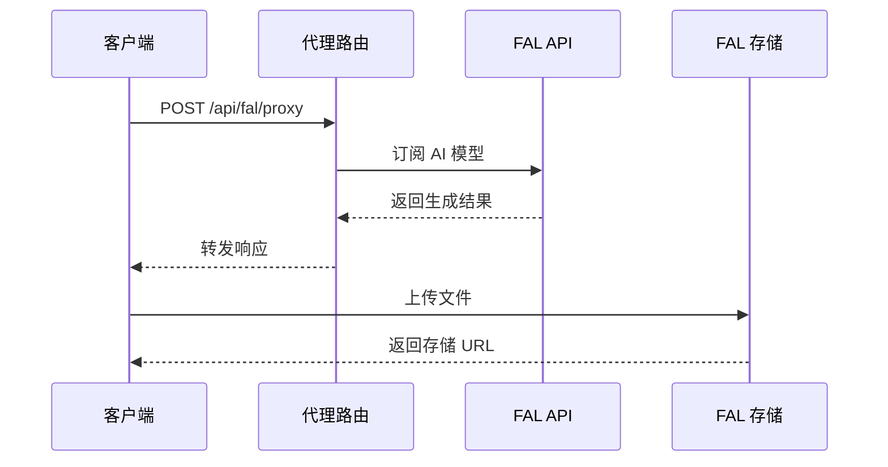

**图表来源**
- [lib/fal.ts:1-62](file://lib/fal.ts#L1-L62)
- [app/api/fal/proxy/route.ts:1-4](file://app/api/fal/proxy/route.ts#L1-L4)

#### 图像处理流程


**图表来源**
- [lib/validate.ts:1-14](file://lib/validate.ts#L1-L14)
- [lib/fal.ts:21-57](file://lib/fal.ts#L21-L57)

**章节来源**
- [lib/fal.ts:1-62](file://lib/fal.ts#L1-L62)
- [lib/validate.ts:1-14](file://lib/validate.ts#L1-L14)

### UI 组件系统

项目采用模块化的 UI 组件设计：

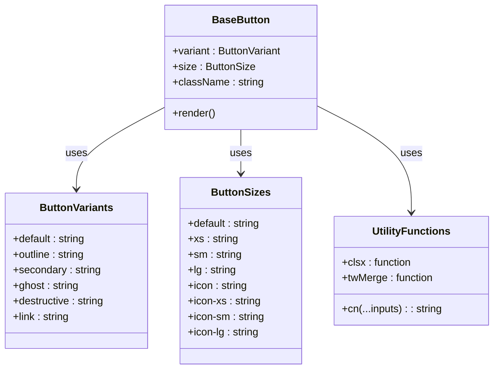

**图表来源**
- [components/ui/button.tsx:8-43](file://components/ui/button.tsx#L8-L43)
- [lib/utils.ts:1-7](file://lib/utils.ts#L1-L7)

**章节来源**
- [components/ui/button.tsx:1-61](file://components/ui/button.tsx#L1-L61)
- [lib/utils.ts:1-7](file://lib/utils.ts#L1-L7)

## 依赖关系分析

### 外部依赖关系图

**更新** 新增认证、数据库和阿里云相关依赖。

```mermaid
graph TB
subgraph "核心框架"
NEXT[Next.js]
REACT[React]
end
subgraph "状态管理"
ZUSTAND[Zustand]
PERSIST[Zustand Persist Middleware]
end
subgraph "图形处理"
TLDRAW[Tldraw]
CANVAS[Canvas Area]
end
subgraph "AI 服务"
FAL_CLIENT[@fal-ai/client]
FAL_PROXY[@fal-ai/server-proxy]
end
subgraph "UI 组件"
BASE_UI[@base-ui/react]
LUCIDE[Lucide React]
SONNER[Sonner]
end
subgraph "工具库"
CLSX[clsx]
TWMERGE[tailwind-merge]
NANOID[nanoid]
GEIST[Geist Font]
end
subgraph "认证系统"
BCRYPT[bcryptjs]
JOSE[jose]
JWT[JWT 管理]
MIDDLEWARE[认证中间件]
end
subgraph "数据库连接"
SUPABASE[@supabase/supabase-js]
end
subgraph "阿里云服务"
ALICLOUD_SDK[@alicloud SDK]
ALICLOUD_SMS[@alicloud/dysmsapi20170525]
ALICLOUD_CLIENT[@alicloud/openapi-client]
ALICLOUD_UTIL[@alicloud/tea-util]
end
NEXT --> REACT
REACT --> ZUSTAND
ZUSTAND --> PERSIST
REACT --> TLDRAW
TLDRAW --> CANVAS
FAL_CLIENT --> FAL_PROXY
REACT --> BASE_UI
REACT --> LUCIDE
REACT --> SONNER
REACT --> CLSX
CLSX --> TWMERGE
REACT --> NANOID
NEXT --> GEIST
BCRYPT --> JWT
JOSE --> JWT
JWT --> MIDDLEWARE
MIDDLEWARE --> SUPABASE
SUPABASE --> ALICLOUD_SDK
ALICLOUD_SDK --> ALICLOUD_SMS
ALICLOUD_SDK --> ALICLOUD_CLIENT
ALICLOUD_SDK --> ALICLOUD_UTIL
```

**图表来源**
- [package.json:11-34](file://package.json#L11-L34)
- [package.json:36-52](file://package.json#L36-L52)

### 内部模块依赖

**更新** 新增认证相关模块的依赖关系。

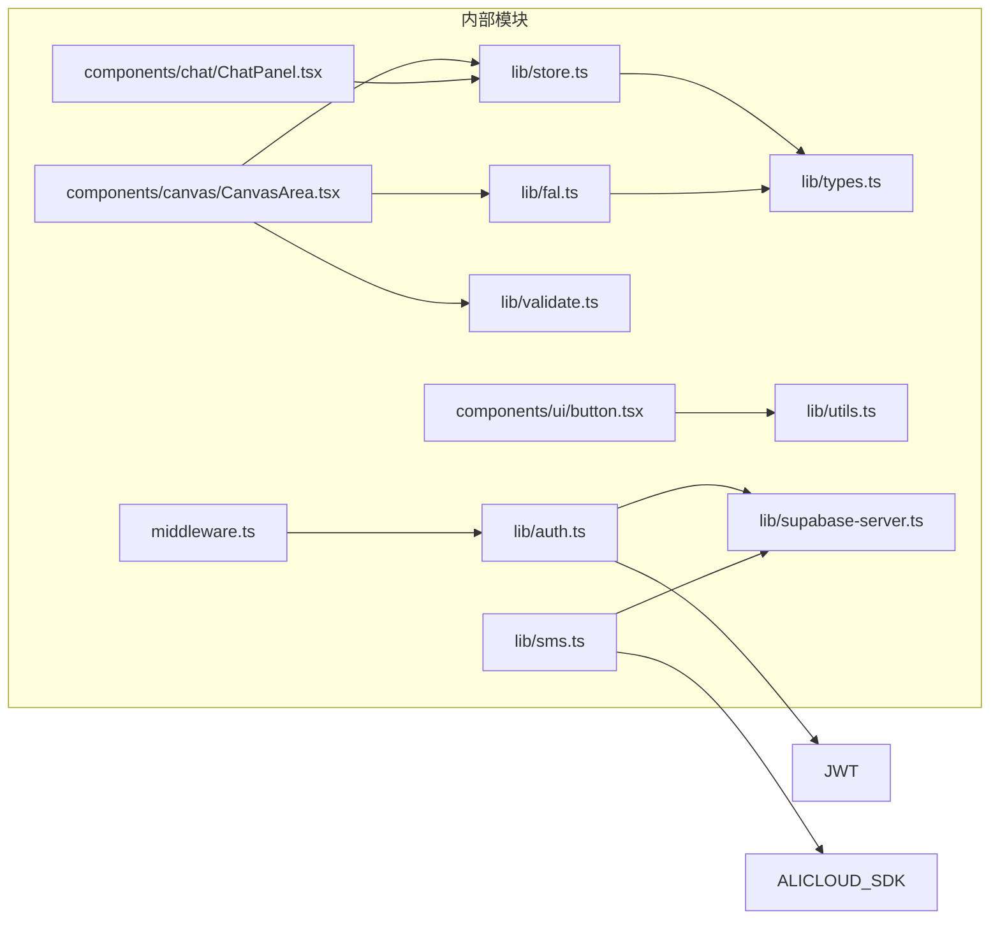

**图表来源**
- [lib/store.ts:1-5](file://lib/store.ts#L1-L5)
- [components/canvas/CanvasArea.tsx:6-14](file://components/canvas/CanvasArea.tsx#L6-L14)

**章节来源**
- [package.json:1-54](file://package.json#L1-L54)

## 性能考虑

### 依赖优化策略

**更新** 新增认证和数据库相关性能优化策略。

项目在依赖管理方面采用了多项优化措施：

1. **按需加载**：使用动态导入减少初始包大小
2. **Tree Shaking**：利用 ES6 模块系统实现无用代码消除
3. **代码分割**：Next.js 自动进行代码分割
4. **缓存策略**：Zustand 提供高效的本地存储缓存
5. **JWT 缓存**：中间件缓存认证状态减少重复验证
6. **数据库连接池**：Supabase 客户端复用连接
7. **阿里云 SDK 懒加载**：仅在实际使用时加载

### 性能监控

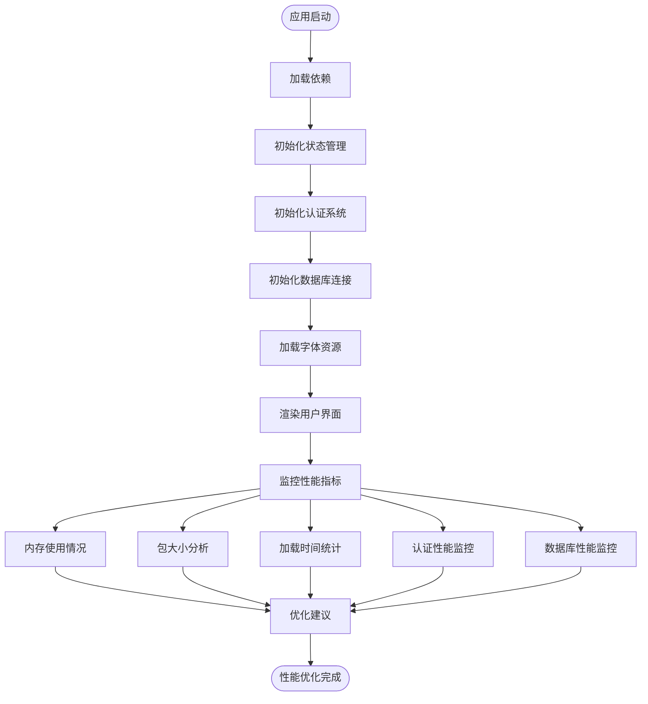

## 故障排除指南

### 常见依赖问题

**更新** 新增认证和数据库相关故障排除指南。

**模块解析错误**
- 检查 tsconfig.json 中的路径映射配置
- 确认 package.json 中的依赖版本兼容性

**构建失败**
- 清理 node_modules 和 package-lock.json
- 更新到最新的 Next.js 版本

**运行时错误**
- 检查浏览器控制台中的错误信息
- 验证 API 密钥和网络连接

**认证相关问题**
- 检查 JWT_SECRET 环境变量配置
- 验证 Supabase 数据库连接参数
- 确认阿里云短信服务配置

**数据库连接问题**
- 检查 NEXT_PUBLIC_SUPABASE_URL 和 SUPABASE_SERVICE_ROLE_KEY
- 验证数据库网络连接和防火墙设置

**章节来源**
- [vitest.config.ts:1-16](file://vitest.config.ts#L1-L16)
- [__tests__/setup.ts:1-2](file://__tests__/setup.ts#L1-L2)

### 测试配置

项目配备了完整的测试环境：

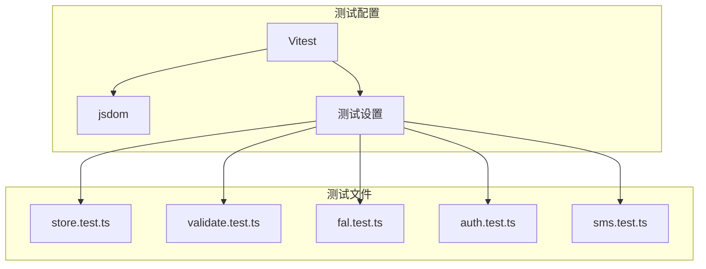

**图表来源**
- [vitest.config.ts:5-15](file://vitest.config.ts#L5-L15)
- [__tests__/setup.ts:1-2](file://__tests__/setup.ts#L1-L2)

**章节来源**
- [vitest.config.ts:1-16](file://vitest.config.ts#L1-L16)
- [__tests__/setup.ts:1-2](file://__tests__/setup.ts#L1-L2)

## 结论

**更新** Loveart 项目的依赖管理展现了现代前端项目的最佳实践，并新增了企业级安全和数据库功能。

Loveart 项目的依赖管理展现了现代前端项目的最佳实践：

1. **清晰的分层架构**：将依赖按照功能和层次进行合理划分
2. **类型安全保证**：通过 TypeScript 确保代码质量和开发体验
3. **模块化设计**：每个模块都有明确的职责和边界
4. **可维护性**：依赖关系清晰，便于后续扩展和维护
5. **企业级安全**：集成 bcryptjs 和 jose 提供安全的密码哈希和 JWT 管理
6. **数据库集成**：通过 Supabase 提供可靠的数据库连接和管理
7. **云服务集成**：通过阿里云 SDK 提供短信服务支持

项目在依赖管理方面的优势包括：
- 合理的依赖版本选择和更新策略
- 完善的开发和生产环境分离
- 全面的测试覆盖和质量保证
- 良好的性能优化和用户体验
- 企业级的安全和数据库支持

这些特性使得 Loveart 成为一个高质量、可扩展的 AI 创意设计平台，为用户提供了流畅的图像生成和编辑体验，同时具备完善的用户认证和数据管理能力。