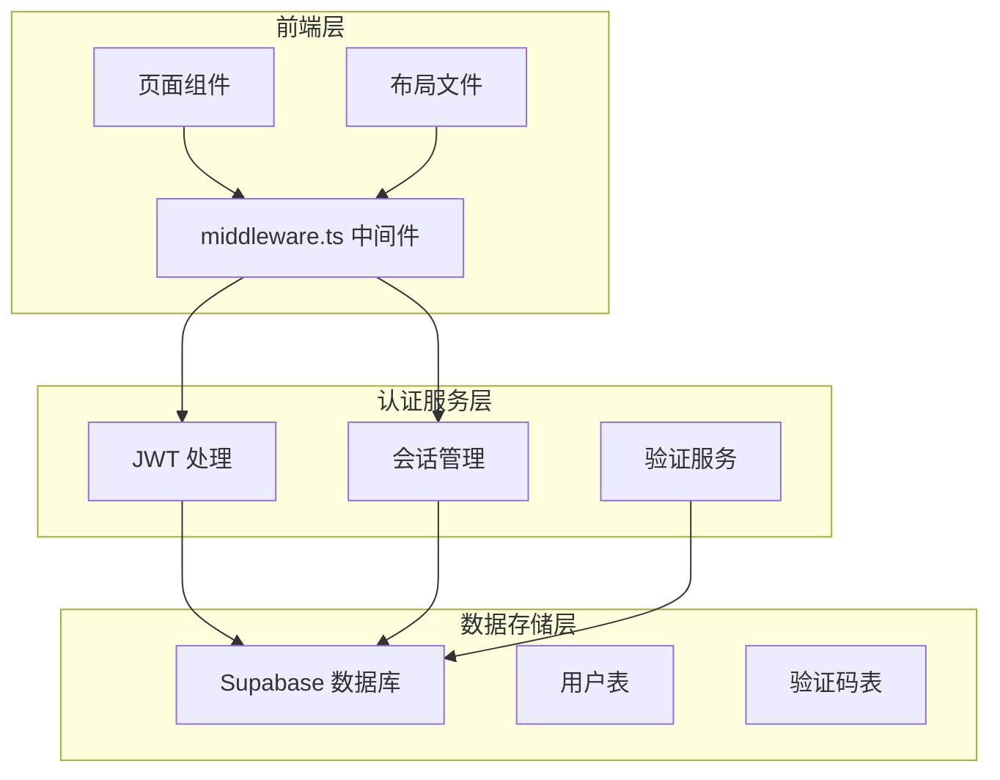
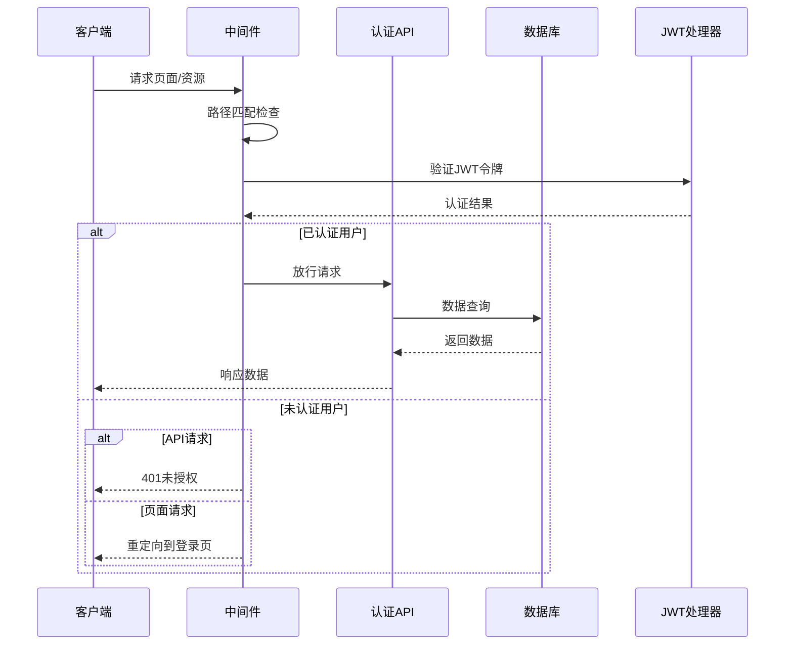
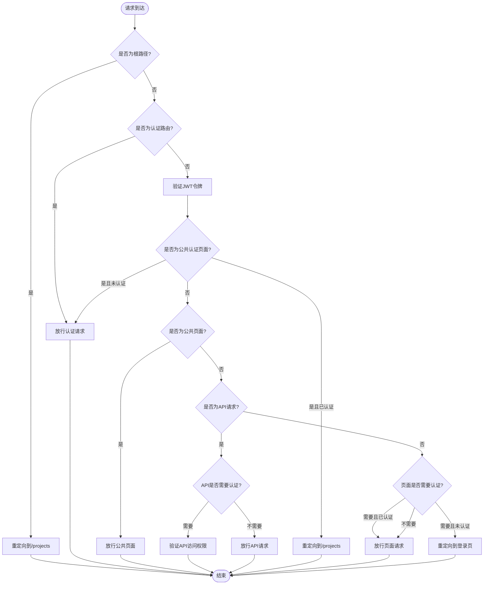
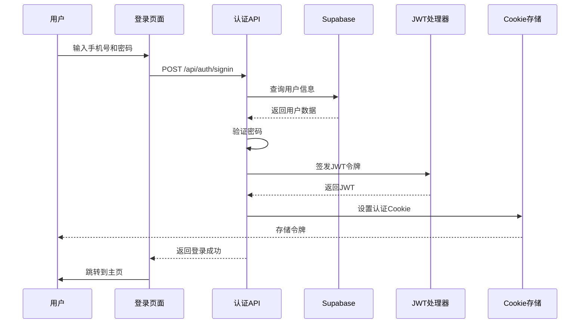
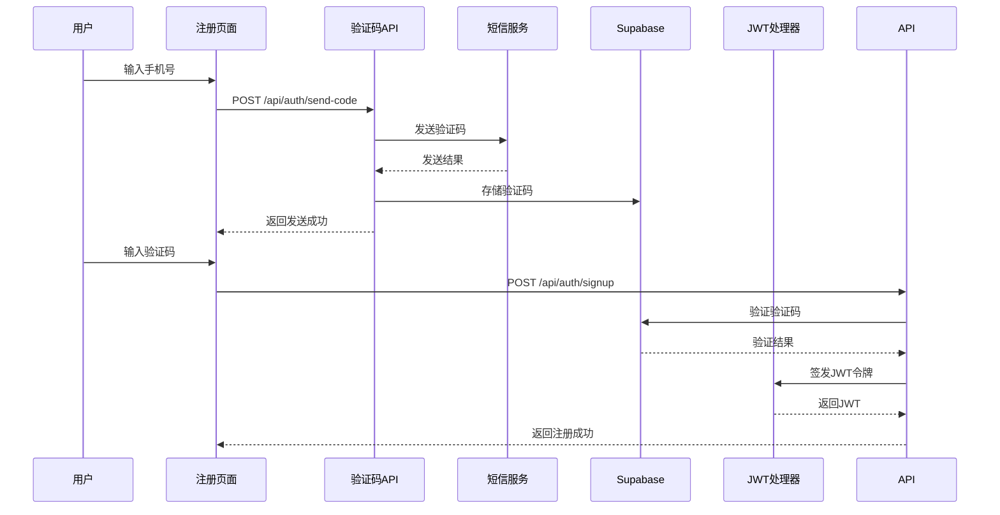
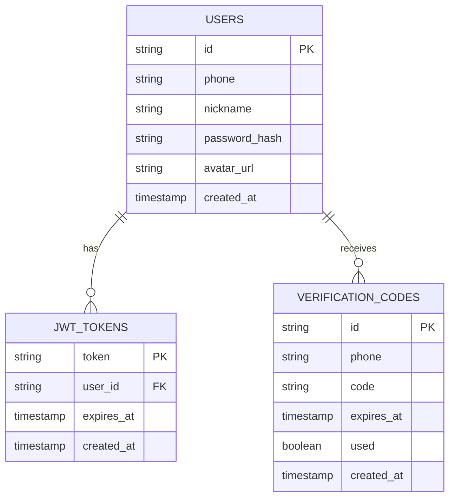
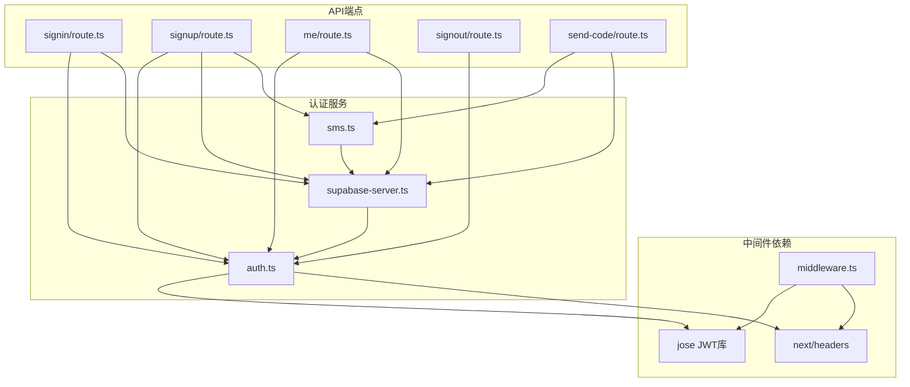

# 增强中间件

<cite>
**本文档引用的文件**
- [middleware.ts](file://middleware.ts)
- [auth.ts](file://lib/auth.ts)
- [supabase-server.ts](file://lib/supabase-server.ts)
- [signin/route.ts](file://app/api/auth/signin/route.ts)
- [signup/route.ts](file://app/api/auth/signup/route.ts)
- [me/route.ts](file://app/api/auth/me/route.ts)
- [signout/route.ts](file://app/api/auth/signout/route.ts)
- [send-code/route.ts](file://app/api/auth/send-code/route.ts)
- [sms.ts](file://lib/sms.ts)
- [login/page.tsx](file://app/login/page.tsx)
- [register/page.tsx](file://app/register/page.tsx)
- [canvas/page.tsx](file://app/canvas/page.tsx)
- [layout.tsx](file://app/layout.tsx)
- [types.ts](file://lib/types.ts)
- [package.json](file://package.json)
</cite>

## 目录
1. [简介](#简介)
2. [项目结构](#项目结构)
3. [核心组件](#核心组件)
4. [架构概览](#架构概览)
5. [详细组件分析](#详细组件分析)
6. [依赖关系分析](#依赖关系分析)
7. [性能考虑](#性能考虑)
8. [故障排除指南](#故障排除指南)
9. [结论](#结论)

## 简介

增强中间件是 Lovart.ai 平台的核心安全基础设施，负责管理用户认证、授权和访问控制。该系统采用基于 JWT 的无状态认证机制，结合 Next.js 中间件实现高效的请求拦截和处理。

系统支持多种认证方式：
- 传统密码认证
- 短信验证码认证  
- 用户会话管理
- API 访问控制

通过智能路由匹配和条件判断，中间件能够精确控制不同路径的访问权限，确保应用的安全性和用户体验的流畅性。

## 项目结构

**图表来源**
- [middleware.ts:1-80](file://middleware.ts#L1-L80)
- [auth.ts:1-64](file://lib/auth.ts#L1-L64)
- [supabase-server.ts:1-29](file://lib/supabase-server.ts#L1-L29)

**章节来源**
- [middleware.ts:1-80](file://middleware.ts#L1-L80)
- [layout.tsx:1-38](file://app/layout.tsx#L1-L38)

## 核心组件

### 中间件核心功能

增强中间件实现了五层访问控制策略：

1. **根路径重定向** - 将根路径自动重定向到项目页面
2. **认证 API 放行** - 允许认证相关接口直接访问
3. **公共页面访问** - 支持无需认证的公开页面
4. **受保护 API 验证** - 对非认证 API 进行身份验证
5. **受保护页面重定向** - 对需要认证的页面进行重定向处理

### JWT 认证机制

系统采用基于 jose 库的 JWT 实现，支持以下功能：
- JWT 签发和验证
- Cookie 会话管理
- 边缘兼容的认证处理
- 安全的令牌存储和传输

**章节来源**
- [middleware.ts:17-66](file://middleware.ts#L17-L66)
- [auth.ts:13-63](file://lib/auth.ts#L13-L63)

## 架构概览

**图表来源**
- [middleware.ts:17-66](file://middleware.ts#L17-L66)
- [auth.ts:21-28](file://lib/auth.ts#L21-L28)
- [supabase-server.ts:5-28](file://lib/supabase-server.ts#L5-L28)

## 详细组件分析

### 中间件执行流程

**图表来源**
- [middleware.ts:17-66](file://middleware.ts#L17-L66)

### 认证流程详解

#### 密码登录流程

**图表来源**
- [login/page.tsx:66-94](file://app/login/page.tsx#L66-L94)
- [signin/route.ts:8-92](file://app/api/auth/signin/route.ts#L8-L92)
- [auth.ts:13-19](file://lib/auth.ts#L13-L19)

#### 短信验证码流程

**图表来源**
- [register/page.tsx:32-63](file://app/register/page.tsx#L32-L63)
- [send-code/route.ts:6-47](file://app/api/auth/send-code/route.ts#L6-L47)
- [sms.ts:43-90](file://lib/sms.ts#L43-L90)

**章节来源**
- [login/page.tsx:1-233](file://app/login/page.tsx#L1-L233)
- [register/page.tsx:1-219](file://app/register/page.tsx#L1-L219)
- [signin/route.ts:1-93](file://app/api/auth/signin/route.ts#L1-L93)
- [signup/route.ts:1-134](file://app/api/auth/signup/route.ts#L1-L134)

### 数据模型设计

**图表来源**
- [types.ts:51-57](file://lib/types.ts#L51-L57)
- [types.ts:18-33](file://lib/types.ts#L18-L33)

**章节来源**
- [types.ts:1-85](file://lib/types.ts#L1-85)

## 依赖关系分析

### 核心依赖关系

**图表来源**
- [middleware.ts:1-3](file://middleware.ts#L1-L3)
- [auth.ts:1-2](file://lib/auth.ts#L1-L2)
- [package.json:11-34](file://package.json#L11-L34)

### 外部服务集成

系统集成了多个外部服务：
- **Supabase**: 作为主要数据库和认证后端
- **阿里云短信服务**: 提供短信验证码功能
- **Fal AI**: 支持AI图像生成和存储
- **Edge Runtime**: 支持边缘计算部署

**章节来源**
- [package.json:11-34](file://package.json#L11-L34)
- [supabase-server.ts:1-29](file://lib/supabase-server.ts#L1-L29)
- [sms.ts:12-41](file://lib/sms.ts#L12-L41)

## 性能考虑

### 缓存策略

中间件采用多层缓存机制：
- **JWT 令牌缓存**: 减少重复验证开销
- **用户信息缓存**: 在会话期间缓存用户数据
- **API 响应缓存**: 对静态内容启用浏览器缓存

### 性能优化建议

1. **异步处理**: 所有数据库操作使用异步方法
2. **连接池管理**: Supabase 客户端实例复用
3. **错误处理**: 实现优雅降级和错误恢复
4. **监控指标**: 添加性能监控和日志记录

## 故障排除指南

### 常见问题及解决方案

#### JWT 验证失败
- 检查环境变量配置
- 验证令牌签名算法
- 确认令牌过期时间设置

#### 数据库连接问题
- 验证 Supabase 环境变量
- 检查网络连接状态
- 确认服务密钥有效性

#### 短信服务异常
- 检查阿里云服务配置
- 验证短信模板设置
- 确认频率限制配置

**章节来源**
- [auth.ts:58-63](file://lib/auth.ts#L58-L63)
- [supabase-server.ts:19-24](file://lib/supabase-server.ts#L19-L24)
- [sms.ts:78-89](file://lib/sms.ts#L78-L89)

## 结论

增强中间件系统通过精心设计的分层架构和严格的访问控制策略，为 Lovart.ai 平台提供了可靠的安全保障。系统的主要优势包括：

1. **模块化设计**: 清晰的功能分离和职责划分
2. **可扩展性**: 支持多种认证方式和第三方集成
3. **性能优化**: 高效的中间件执行和缓存策略
4. **安全性**: 基于 JWT 的无状态认证机制
5. **用户体验**: 无缝的认证流程和错误处理

该系统为未来的功能扩展和性能优化奠定了坚实的基础，能够有效支撑平台的持续发展需求。