# UI 组件系统

<cite>
**本文引用的文件**
- [components/ui/button.tsx](file://components/ui/button.tsx)
- [components/ui/badge.tsx](file://components/ui/badge.tsx)
- [components/ui/textarea.tsx](file://components/ui/textarea.tsx)
- [components/ui/scroll-area.tsx](file://components/ui/scroll-area.tsx)
- [components/ui/tooltip.tsx](file://components/ui/tooltip.tsx)
- [components/canvas/CanvasArea.tsx](file://components/canvas/CanvasArea.tsx)
- [components/canvas/InlineEditPanel.tsx](file://components/canvas/InlineEditPanel.tsx)
- [components/canvas/Toolbar.tsx](file://components/canvas/Toolbar.tsx)
- [components/canvas/TopBar.tsx](file://components/canvas/TopBar.tsx)
- [components/chat/ChatPanel.tsx](file://components/chat/ChatPanel.tsx)
- [components/chat/TextInput.tsx](file://components/chat/TextInput.tsx)
- [components/chat/SelectionBadge.tsx](file://components/chat/SelectionBadge.tsx)
- [lib/types.ts](file://lib/types.ts)
- [lib/store.ts](file://lib/store.ts)
- [app/globals.css](file://app/globals.css)
- [lib/utils.ts](file://lib/utils.ts)
- [package.json](file://package.json)
- [components.json](file://components.json)
- [app/layout.tsx](file://app/layout.tsx)
- [app/page.tsx](file://app/page.tsx)
</cite>

## 更新摘要
**变更内容**
- 新增选择徽章系统（SelectionBadge）提供缩略图预览和交互式选择控制
- 自定义工具提示实现（CustomTooltip）提供改进的悬停交互和可定制定位
- 新增画布工具栏组件（Toolbar）和顶部栏组件（TopBar）
- 更新工具提示系统以支持自定义实现和Base UI React封装
- 扩展Canvas组件系统以支持Marker标记工具和Marker徽章

## 目录
1. [简介](#简介)
2. [项目结构](#项目结构)
3. [核心组件](#核心组件)
4. [架构总览](#架构总览)
5. [详细组件分析](#详细组件分析)
6. [依赖关系分析](#依赖关系分析)
7. [性能考量](#性能考量)
8. [故障排查指南](#故障排查指南)
9. [结论](#结论)
10. [附录](#附录)

## 简介
本文件为 Loveart 的 UI 组件系统提供完整参考，覆盖基于 Tailwind CSS 与 Radix UI（通过 Base UI React 封装）构建的基础组件以及新增的Canvas区域组件系统。内容涵盖组件属性接口、事件处理、样式定制选项、可访问性支持、设计原则与一致性保障机制，并给出组合模式与场景化应用策略，帮助设计师与开发者高效、一致地使用组件。

**更新** 新增选择徽章系统、自定义工具提示实现、画布工具栏和顶部栏组件，扩展了Canvas编辑工作流的功能完整性。

## 项目结构
组件库位于 components 目录下，采用"按功能分层 + 原子化样式"的组织方式：
- **UI组件层**：button、badge、textarea、scroll-area、tooltip
- **Canvas组件层**：CanvasArea（画布主容器）、InlineEditPanel（内联编辑面板）、Toolbar（画布工具栏）、TopBar（顶部栏）
- **聊天组件层**：ChatPanel、MessageHistory、ReferenceUploader、TextInput、SelectionBadge（新增）
- **样式层**：Tailwind 主题变量与暗色模式基线、颜色语义映射
- **工具层**：cn 合并工具函数、Zustand 状态管理
- **配置层**：components.json 指定主题风格、Tailwind 路径与别名

```mermaid
graph TB
subgraph "应用层"
LAYOUT["app/layout.tsx"]
PAGE["app/page.tsx"]
END
subgraph "Canvas组件层"
CANVAS["components/canvas/CanvasArea.tsx"]
INLINEEDIT["components/canvas/InlineEditPanel.tsx"]
TOOLBAR["components/canvas/Toolbar.tsx"]
TOPBAR["components/canvas/TopBar.tsx"]
END
subgraph "UI组件层"
BTN["components/ui/button.tsx"]
BADGE["components/ui/badge.tsx"]
TEXTAREA["components/ui/textarea.tsx"]
SCROLL["components/ui/scroll-area.tsx"]
TOOLTIP["components/ui/tooltip.tsx"]
END
subgraph "聊天组件层"
CHATPANEL["components/chat/ChatPanel.tsx"]
TEXTINPUT["components/chat/TextInput.tsx"]
SELECTIONBADGE["components/chat/SelectionBadge.tsx"]
END
subgraph "状态与类型"
TYPES["lib/types.ts"]
STORE["lib/store.ts"]
END
subgraph "样式与配置"
GLOBALS["app/globals.css"]
UTILS["lib/utils.ts"]
CFG["components.json"]
END
LAYOUT --> PAGE
PAGE --> CANVAS
CANVAS --> INLINEEDIT
CANVAS --> TOOLBAR
CANVAS --> TOPBAR
CHATPANEL --> TEXTINPUT
CHATPANEL --> SELECTIONBADGE
INLINEEDIT --> STORE
CANVAS --> STORE
STORE --> TYPES
BTN --> UTILS
BADGE --> UTILS
TEXTAREA --> UTILS
SCROLL --> UTILS
TOOLTIP --> UTILS
GLOBALS --> BTN
GLOBALS --> BADGE
GLOBALS --> TEXTAREA
GLOBALS --> SCROLL
GLOBALS --> TOOLTIP
CFG --> GLOBALS
```

**图表来源**
- [app/layout.tsx:1-38](file://app/layout.tsx#L1-L38)
- [app/page.tsx:1-10](file://app/page.tsx#L1-L10)
- [components/canvas/CanvasArea.tsx:1-508](file://components/canvas/CanvasArea.tsx#L1-L508)
- [components/canvas/InlineEditPanel.tsx:1-333](file://components/canvas/InlineEditPanel.tsx#L1-L333)
- [components/canvas/Toolbar.tsx:1-668](file://components/canvas/Toolbar.tsx#L1-L668)
- [components/canvas/TopBar.tsx:1-222](file://components/canvas/TopBar.tsx#L1-L222)
- [components/chat/ChatPanel.tsx:1-22](file://components/chat/ChatPanel.tsx#L1-L22)
- [components/chat/TextInput.tsx:1-10](file://components/chat/TextInput.tsx#L1-L10)
- [components/chat/SelectionBadge.tsx:1-104](file://components/chat/SelectionBadge.tsx#L1-L104)
- [lib/types.ts:1-49](file://lib/types.ts#L1-L49)
- [lib/store.ts:1-378](file://lib/store.ts#L1-L378)
- [components/ui/button.tsx:1-61](file://components/ui/button.tsx#L1-L61)
- [components/ui/badge.tsx:1-53](file://components/ui/badge.tsx#L1-L53)
- [components/ui/textarea.tsx:1-19](file://components/ui/textarea.tsx#L1-L19)
- [components/ui/scroll-area.tsx:1-56](file://components/ui/scroll-area.tsx#L1-L56)
- [components/ui/tooltip.tsx:1-174](file://components/ui/tooltip.tsx#L1-L174)
- [app/globals.css:1-128](file://app/globals.css#L1-L128)
- [lib/utils.ts:1-7](file://lib/utils.ts#L1-L7)
- [components.json:1-26](file://components.json#L1-L26)

**章节来源**
- [app/layout.tsx:1-38](file://app/layout.tsx#L1-L38)
- [app/page.tsx:1-10](file://app/page.tsx#L1-L10)
- [components/canvas/CanvasArea.tsx:1-508](file://components/canvas/CanvasArea.tsx#L1-L508)
- [components/canvas/InlineEditPanel.tsx:1-333](file://components/canvas/InlineEditPanel.tsx#L1-L333)
- [components/canvas/Toolbar.tsx:1-668](file://components/canvas/Toolbar.tsx#L1-L668)
- [components/canvas/TopBar.tsx:1-222](file://components/canvas/TopBar.tsx#L1-L222)
- [components/chat/ChatPanel.tsx:1-22](file://components/chat/ChatPanel.tsx#L1-L22)
- [components/chat/TextInput.tsx:1-10](file://components/chat/TextInput.tsx#L1-L10)
- [components/chat/SelectionBadge.tsx:1-104](file://components/chat/SelectionBadge.tsx#L1-L104)
- [lib/types.ts:1-49](file://lib/types.ts#L1-L49)
- [lib/store.ts:1-378](file://lib/store.ts#L1-L378)
- [components/ui/button.tsx:1-61](file://components/ui/button.tsx#L1-L61)
- [components/ui/badge.tsx:1-53](file://components/ui/badge.tsx#L1-L53)
- [components/ui/textarea.tsx:1-19](file://components/ui/textarea.tsx#L1-L19)
- [components/ui/scroll-area.tsx:1-56](file://components/ui/scroll-area.tsx#L1-L56)
- [components/ui/tooltip.tsx:1-174](file://components/ui/tooltip.tsx#L1-L174)
- [app/globals.css:1-128](file://app/globals.css#L1-L128)
- [lib/utils.ts:1-7](file://lib/utils.ts#L1-L7)
- [components.json:1-26](file://components.json#L1-L26)

## 核心组件
本节概述八个基础组件的功能定位、关键属性与样式约定，便于快速检索与对比。

- **按钮（Button）**
  - 角色：承载交互动作，支持多种视觉状态与尺寸
  - 关键属性：variant（默认/描边/次要/幽灵/破坏/链接）、size（默认/xs/sm/lg/icon 系列）
  - 可访问性：继承原生按钮行为，支持聚焦环、禁用态、aria-expanded 状态
  - 样式定制：通过变体类与数据槽（data-slot）实现一致的视觉与交互反馈

- **徽章（Badge）**
  - 角色：信息标签或状态指示，强调性较低
  - 关键属性：variant（默认/次要/破坏/描边/幽灵/链接）
  - 渲染扩展：支持自定义渲染器（render），便于嵌入图标或复杂内容
  - 样式定制：紧凑尺寸与圆角设计，适配密集信息展示

- **文本域（Textarea）**
  - 角色：多行文本输入，支持自适应高度
  - 关键属性：标准 textarea 属性（受控/非受控均可）
  - 行为特性：自动调整高度、禁用态、占位符、焦点环与无效态样式
  - 样式定制：统一圆角、边框与背景色，适配暗色主题

- **滚动区域（ScrollArea）**
  - 角色：容器滚动增强，提供可定制滚动条
  - 关键属性：根组件支持通用属性；滚动条支持方向（垂直/水平）与尺寸
  - 行为特性：视口聚焦环、角落装饰、滚动条随内容动态显示
  - 样式定制：滚动条尺寸、颜色与过渡效果可调

- **工具提示（Tooltip）**
  - 角色：上下文提示，支持延迟、位置与箭头对齐
  - 关键属性：Provider 延迟控制；Root/Trigger/Content 支持定位与动画
  - 行为特性：基于 Portal 渲染，支持多侧边与偏移量微调
  - 样式定制：内容区圆角、背景与前景色、动画入场/出场
  - **更新**：新增自定义Tooltip实现，支持纯React实现和Base UI React封装两种模式

- **画布区域（CanvasArea）**
  - 角色：图像编辑主容器，支持拖拽、缩放、变换和实时预览
  - 关键属性：响应式尺寸、中间鼠标拖拽、滚轮缩放、拖放文件支持
  - 行为特性：动态背景网格、拖拽项同步、选择状态管理、下载功能
  - 样式定制：暗色背景、网格纹理、投影效果

- **内联编辑面板（InlineEditPanel）**
  - 角色：图像编辑的内联控制面板，支持参考图管理和AI生成
  - 关键属性：CanvasItem关联、可见性控制、文件上传、拖拽排序
  - 行为特性：自动高度调整、参考图上传、拖拽到文本域、重新排序
  - 样式定制：半透明背景、模糊效果、圆角边框、悬停状态

- **选择徽章（SelectionBadge）**
  - 角色：画布项选择的可视化表示，支持缩略图预览和交互控制
  - 关键属性：CanvasItem关联、isActive状态、onRemove回调、markerNumber标记序号
  - 行为特性：悬停显示缩略图预览、点击激活/移除、固定定位逃逸overflow
  - 样式定制：灰度与实色状态切换、蓝色序号圆圈、文件名截断显示

- **画布工具栏（Toolbar）**
  - 角色：画布编辑的主要工具入口，集成多种编辑工具
  - 关键属性：工具状态管理、子工具选择、文件上传处理
  - 行为特性：悬停菜单、快捷键支持、tldraw编辑器同步、画笔设置面板
  - 样式定制：工具按钮状态切换、菜单弹出动画、快捷键显示

- **顶部栏（TopBar）**
  - 角色：应用顶部控制区域，包含项目管理和用户交互
  - 关键属性：项目名称编辑、菜单操作、用户状态显示
  - 行为特性：可编辑项目名称、菜单下拉、快捷键操作、聊天面板控制
  - 样式定制：半透明背景、阴影效果、响应式布局

**章节来源**
- [components/ui/button.tsx:45-61](file://components/ui/button.tsx#L45-L61)
- [components/ui/badge.tsx:30-53](file://components/ui/badge.tsx#L30-L53)
- [components/ui/textarea.tsx:5-19](file://components/ui/textarea.tsx#L5-L19)
- [components/ui/scroll-area.tsx:8-56](file://components/ui/scroll-area.tsx#L8-L56)
- [components/ui/tooltip.tsx:7-174](file://components/ui/tooltip.tsx#L7-L174)
- [components/canvas/CanvasArea.tsx:174-508](file://components/canvas/CanvasArea.tsx#L174-L508)
- [components/canvas/InlineEditPanel.tsx:14-333](file://components/canvas/InlineEditPanel.tsx#L14-L333)
- [components/chat/SelectionBadge.tsx:6-11](file://components/chat/SelectionBadge.tsx#L6-L11)
- [components/canvas/Toolbar.tsx:20-27](file://components/canvas/Toolbar.tsx#L20-L27)
- [components/canvas/TopBar.tsx:21-97](file://components/canvas/TopBar.tsx#L21-L97)

## 架构总览
组件系统以"原子化样式 + 变体系统 + 原生语义 + 状态管理"为核心设计原则：
- **原子化样式**：通过 Tailwind 类与主题变量实现一致的间距、圆角、色彩与阴影
- **变体系统**：使用 class-variance-authority 定义变体与默认值，确保组件在不同上下文中的一致表现
- **原生语义**：优先使用原生 HTML 元素（如 button、textarea），结合 Base UI React 提供的可访问性能力
- **数据槽（data-slot）**：为样式与测试提供稳定选择器，避免脆弱的 DOM 结构耦合
- **状态管理**：使用 Zustand 管理全局状态，支持持久化存储和会话状态分离
- **类型安全**：通过 TypeScript 接口确保组件间的数据传递一致性
- **工具提示系统**：同时支持自定义Tooltip实现和Base UI React封装，提供灵活的交互方案

```mermaid
graph TB
UTILS["lib/utils.ts<br/>cn(...) 合并类名"]
THEME["app/globals.css<br/>主题变量与暗色基线"]
CFG["components.json<br/>风格与别名配置"]
STORE["lib/store.ts<br/>Zustand状态管理"]
TYPES["lib/types.ts<br/>CanvasItem/StoredRef/Marker类型"]
BTN["components/ui/button.tsx"]
BADGE["components/ui/badge.tsx"]
TEXTAREA["components/ui/textarea.tsx"]
SCROLL["components/ui/scroll-area.tsx"]
TOOLTIP["components/ui/tooltip.tsx<br/>CustomTooltip + Base UI"]
CANVAS["components/canvas/CanvasArea.tsx"]
INLINEEDIT["components/canvas/InlineEditPanel.tsx"]
TOOLBAR["components/canvas/Toolbar.tsx"]
TOPBAR["components/canvas/TopBar.tsx"]
SELECTIONBADGE["components/chat/SelectionBadge.tsx"]
CHAT["components/chat/ChatPanel.tsx"]
CFG --> THEME
THEME --> BTN
THEME --> BADGE
THEME --> TEXTAREA
THEME --> SCROLL
THEME --> TOOLTIP
THEME --> CANVAS
THEME --> INLINEEDIT
THEME --> TOOLBAR
THEME --> TOPBAR
THEME --> SELECTIONBADGE
UTILS --> BTN
UTILS --> BADGE
UTILS --> TEXTAREA
UTILS --> SCROLL
UTILS --> TOOLTIP
UTILS --> CANVAS
UTILS --> INLINEEDIT
UTILS --> TOOLBAR
UTILS --> TOPBAR
UTILS --> SELECTIONBADGE
STORE --> CANVAS
STORE --> INLINEEDIT
STORE --> TOOLBAR
STORE --> TOPBAR
STORE --> SELECTIONBADGE
TYPES --> CANVAS
TYPES --> INLINEEDIT
TYPES --> TOOLBAR
TYPES --> TOPBAR
TYPES --> SELECTIONBADGE
```

**图表来源**
- [lib/utils.ts:1-7](file://lib/utils.ts#L1-L7)
- [app/globals.css:1-128](file://app/globals.css#L1-L128)
- [components.json:1-26](file://components.json#L1-L26)
- [lib/store.ts:1-378](file://lib/store.ts#L1-L378)
- [lib/types.ts:1-49](file://lib/types.ts#L1-L49)
- [components/ui/button.tsx:1-61](file://components/ui/button.tsx#L1-L61)
- [components/ui/badge.tsx:1-53](file://components/ui/badge.tsx#L1-L53)
- [components/ui/textarea.tsx:1-19](file://components/ui/textarea.tsx#L1-L19)
- [components/ui/scroll-area.tsx:1-56](file://components/ui/scroll-area.tsx#L1-L56)
- [components/ui/tooltip.tsx:1-174](file://components/ui/tooltip.tsx#L1-L174)
- [components/canvas/CanvasArea.tsx:1-508](file://components/canvas/CanvasArea.tsx#L1-L508)
- [components/canvas/InlineEditPanel.tsx:1-333](file://components/canvas/InlineEditPanel.tsx#L1-L333)
- [components/canvas/Toolbar.tsx:1-668](file://components/canvas/Toolbar.tsx#L1-L668)
- [components/canvas/TopBar.tsx:1-222](file://components/canvas/TopBar.tsx#L1-L222)
- [components/chat/SelectionBadge.tsx:1-104](file://components/chat/SelectionBadge.tsx#L1-L104)
- [components/chat/ChatPanel.tsx:1-22](file://components/chat/ChatPanel.tsx#L1-L22)

## 详细组件分析

### 按钮（Button）
- **设计原则**
  - 语义明确：承载主要或辅助操作
  - 视觉层级：通过 variant 区分主次与危险操作
  - 尺寸一致性：通过 size 控制高度、内边距与图标尺寸
  - 可访问性：支持键盘聚焦、禁用态、aria-expanded 状态
- **属性与事件**
  - 属性：className、variant、size、原生 button 属性
  - 事件：onClick、onMouseDown 等原生事件透传
- **样式定制**
  - 使用变体类与数据槽（data-slot="button"）确保样式稳定
  - 通过 Tailwind 类覆盖默认样式，保持与主题一致
- **最佳实践**
  - 主要操作使用默认变体；危险操作使用破坏变体
  - 图标按钮使用 icon 系列尺寸，确保视觉平衡
  - 在按钮组中使用特定尺寸以保持对齐

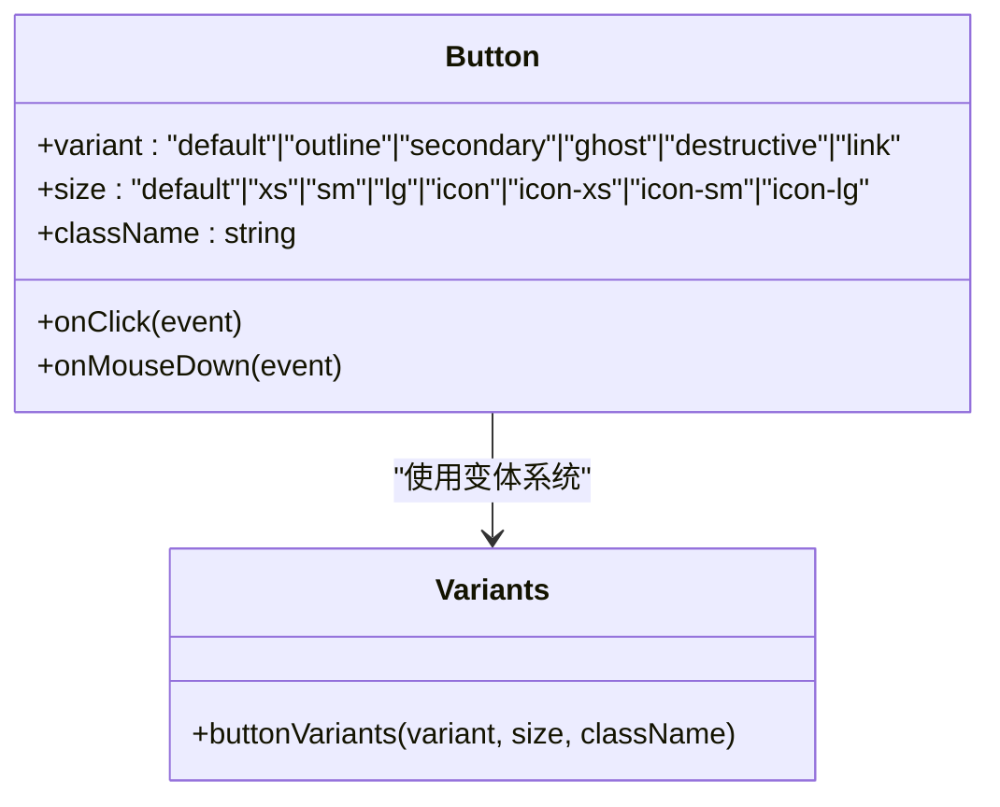

**图表来源**
- [components/ui/button.tsx:8-43](file://components/ui/button.tsx#L8-L43)
- [components/ui/button.tsx:45-61](file://components/ui/button.tsx#L45-L61)

**章节来源**
- [components/ui/button.tsx:1-61](file://components/ui/button.tsx#L1-L61)
- [lib/utils.ts:1-7](file://lib/utils.ts#L1-L7)
- [app/globals.css:1-128](file://app/globals.css#L1-L128)

### 徽章（Badge）
- **设计原则**
  - 轻量化：用于弱提示或状态标识
  - 可读性：紧凑尺寸与清晰对比度
  - 扩展性：支持自定义渲染器以容纳图标或复杂内容
- **属性与事件**
  - 属性：className、variant、render、原生 span 属性
  - 事件：透传至底层元素
- **样式定制**
  - 使用变体类与数据槽（data-slot="badge"）确保样式稳定
  - 通过 Tailwind 类覆盖默认样式，保持与主题一致
- **最佳实践**
  - 使用默认变体传达中性信息；破坏变体突出错误或警告
  - 与图标配合时，注意间距与对齐

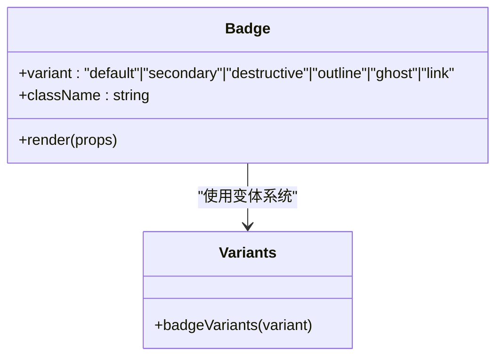

**图表来源**
- [components/ui/badge.tsx:7-28](file://components/ui/badge.tsx#L7-L28)
- [components/ui/badge.tsx:30-53](file://components/ui/badge.tsx#L30-L53)

**章节来源**
- [components/ui/badge.tsx:1-53](file://components/ui/badge.tsx#L1-L53)
- [lib/utils.ts:1-7](file://lib/utils.ts#L1-L7)
- [app/globals.css:1-128](file://app/globals.css#L1-L128)

### 文本域（Textarea）
- **设计原则**
  - 自适应高度：提升输入体验，避免滚动干扰
  - 明确状态：禁用态、无效态与焦点态有清晰视觉反馈
  - 一致性：与主题颜色与圆角保持一致
- **属性与事件**
  - 属性：className、受控/非受控值、占位符、禁用态
  - 事件：onChange、onKeyDown、onFocus、onInput 等
- **样式定制**
  - 使用数据槽（data-slot="textarea"）确保样式稳定
  - 通过 Tailwind 类覆盖默认样式，保持与主题一致
- **最佳实践**
  - 输入监听中使用 onInput 动态调整高度，限制最大高度
  - 与按钮组合时，确保尺寸与间距协调


**图表来源**
- [components/ui/textarea.tsx:5-19](file://components/ui/textarea.tsx#L5-L19)

**章节来源**
- [components/ui/textarea.tsx:1-19](file://components/ui/textarea.tsx#L1-L19)
- [lib/utils.ts:1-7](file://lib/utils.ts#L1-L7)
- [app/globals.css:1-128](file://app/globals.css#L1-L128)

### 滚动区域（ScrollArea）
- **设计原则**
  - 可见性：滚动条仅在需要时出现，避免遮挡内容
  - 一致性：滚动条尺寸、颜色与主题一致
  - 可访问性：视口支持键盘导航与聚焦环
- **属性与事件**
  - 根组件：通用属性透传
  - 滚动条：支持方向（vertical/horizontal）与尺寸
- **样式定制**
  - 使用数据槽（data-slot="scroll-area" 等）确保样式稳定
  - 通过 Tailwind 类覆盖默认样式，保持与主题一致
- **最佳实践**
  - 在对话列表或长内容面板中使用，避免强制滚动
  - 与文本域组合时，确保滚动条不遮挡输入区域

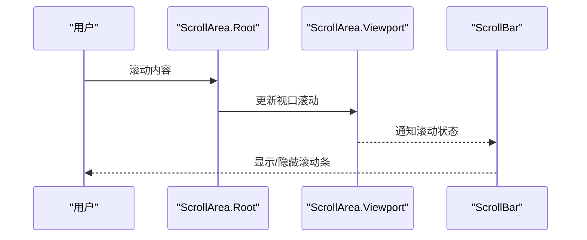

**图表来源**
- [components/ui/scroll-area.tsx:8-56](file://components/ui/scroll-area.tsx#L8-L56)

**章节来源**
- [components/ui/scroll-area.tsx:1-56](file://components/ui/scroll-area.tsx#L1-L56)
- [lib/utils.ts:1-7](file://lib/utils.ts#L1-L7)
- [app/globals.css:1-128](file://app/globals.css#L1-L128)

### 工具提示（Tooltip）
- **设计原则**
  - 即时性：延迟可控，避免频繁闪烁
  - 准确性：内容区与触发元素对齐，箭头方向正确
  - 可访问性：支持键盘触发与焦点管理
- **属性与事件**
  - Provider：delay 控制延迟
  - Trigger：作为触发器包装任意元素
  - Content：支持 side、sideOffset、align、alignOffset 定位
  - **新增**：CustomTooltip 支持纯React实现，提供更灵活的定位控制
- **样式定制**
  - 使用数据槽（data-slot="tooltip-provider"/"tooltip-trigger"/"tooltip-content"）确保样式稳定
  - 通过 Tailwind 类覆盖默认样式，保持与主题一致
- **最佳实践**
  - 在按钮组或图标按钮上使用，提供简短说明
  - 与加载态结合时，提示用户当前不可交互的原因
  - **新增**：在Canvas工具栏中使用CustomTooltip提供精确的工具提示

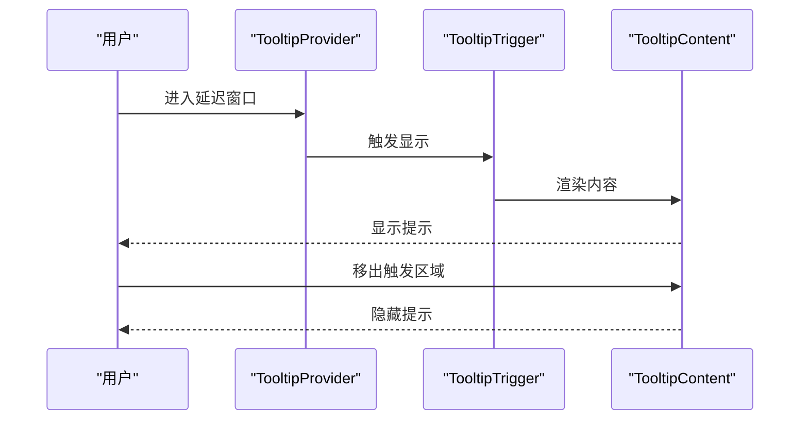

**图表来源**
- [components/ui/tooltip.tsx:7-174](file://components/ui/tooltip.tsx#L7-L174)

**章节来源**
- [components/ui/tooltip.tsx:1-174](file://components/ui/tooltip.tsx#L1-L174)
- [lib/utils.ts:1-7](file://lib/utils.ts#L1-L7)
- [app/globals.css:1-128](file://app/globals.css#L1-L128)

### 画布区域（CanvasArea）
- **设计原则**
  - 响应式布局：自适应容器尺寸变化
  - 专业工具：支持中间鼠标拖拽、滚轮缩放、拖放文件
  - 实时预览：动态背景网格跟随画布移动和缩放
  - 用户体验：流畅的拖拽变换和选择反馈
- **属性与事件**
  - 状态管理：canvasItems、isEditingMode、editingTarget
  - 交互事件：拖拽开始/移动/结束、滚轮缩放、点击选择
  - 文件操作：拖放文件上传、下载选中项、清除画布
- **样式定制**
  - 动态背景网格：基于 bgOffset 和 bgScale 实时更新
  - 暗色主题：深色背景与网格纹理
  - 投影效果：半透明背景和模糊效果
- **最佳实践**
  - 使用响应式容器确保画布自适应屏幕
  - 合理设置缩放范围避免过度放大或缩小
  - 在拖拽过程中提供视觉反馈（光标变化）

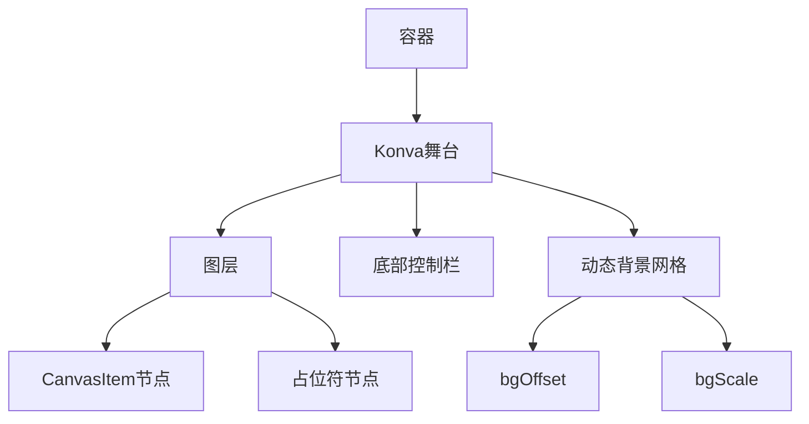

**图表来源**
- [components/canvas/CanvasArea.tsx:174-508](file://components/canvas/CanvasArea.tsx#L174-L508)

**章节来源**
- [components/canvas/CanvasArea.tsx:1-508](file://components/canvas/CanvasArea.tsx#L1-L508)
- [lib/store.ts:1-378](file://lib/store.ts#L1-L378)
- [lib/types.ts:18-32](file://lib/types.ts#L18-L32)

### 内联编辑面板（InlineEditPanel）
- **设计原则**
  - 集成性：与CanvasItem紧密集成，提供无缝编辑体验
  - 灵活性：支持参考图上传、拖拽排序、文本编辑
  - 反馈性：实时上传状态、错误提示、加载动画
  - 可访问性：键盘快捷键、禁用态处理、焦点管理
- **属性与事件**
  - 组件属性：item（CanvasItem）、visible（可见性）
  - 文件操作：单个或多文件上传、验证、错误处理
  - 编辑功能：AI生成、编辑图像、生成新图像
  - 拖拽功能：参考图重新排序、拖拽到文本域
- **样式定制**
  - 半透明背景：zinc-800/90 与 backdrop-blur-sm
  - 圆角边框：rounded-xl 与 border-zinc-700/50
  - 悬停效果：渐变过渡与指针事件处理
- **最佳实践**
  - 限制参考图数量（MAX_REFS=6）避免性能问题
  - 提供清晰的上传状态反馈
  - 在AI生成期间禁用相关交互

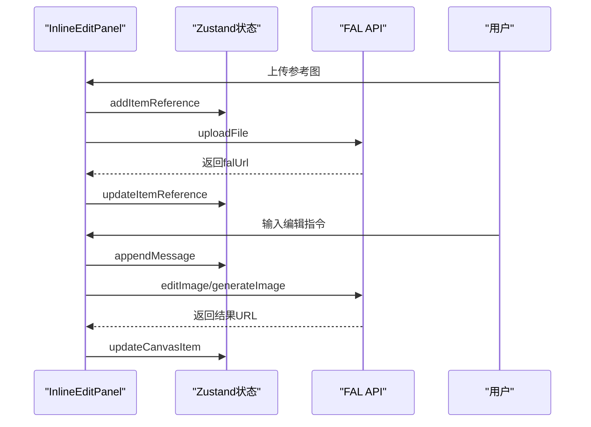

**图表来源**
- [components/canvas/InlineEditPanel.tsx:14-333](file://components/canvas/InlineEditPanel.tsx#L14-L333)
- [lib/store.ts:190-238](file://lib/store.ts#L190-L238)

**章节来源**
- [components/canvas/InlineEditPanel.tsx:1-333](file://components/canvas/InlineEditPanel.tsx#L1-L333)
- [lib/store.ts:1-378](file://lib/store.ts#L1-L378)
- [lib/types.ts:1-7](file://lib/types.ts#L1-L7)

### 选择徽章（SelectionBadge）
- **设计原则**
  - 可视化：通过缩略图直观显示画布项内容
  - 交互性：支持悬停预览、点击激活/移除
  - 标识性：通过蓝色序号圆圈标识标记位置
  - 响应性：灰度与实色状态区分激活/非激活状态
- **属性与事件**
  - 组件属性：item（CanvasItem）、isActive（激活状态）、onRemove（删除回调）、markerNumber（标记序号）
  - 交互事件：鼠标进入/离开（悬停预览）、点击（激活/移除）
  - 定位计算：基于触发元素边界计算预览位置
- **样式定制**
  - 状态切换：激活时实色边框与文本，非激活时灰度与低透明度
  - 缩略图：200x200像素固定尺寸，圆角裁剪
  - 序号圆圈：蓝色背景、白色粗体数字、10px字体大小
- **最佳实践**
  - 使用fileName或id作为显示名称，确保用户识别
  - 合理设置markerNumber范围（1-8），避免超出限制
  - 在大量画布项时提供滚动容器，避免布局溢出

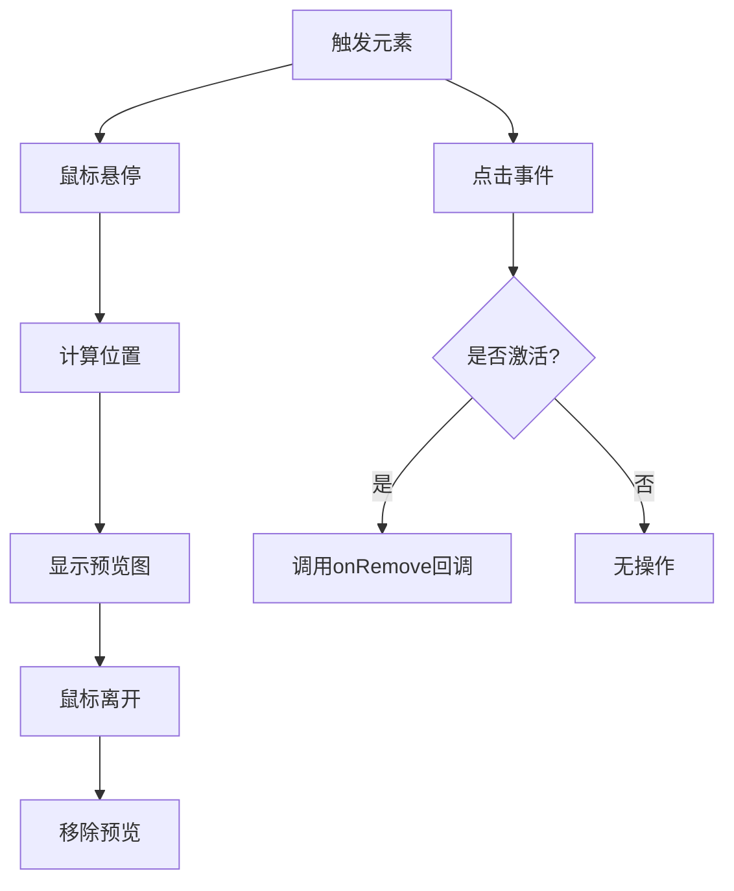

**图表来源**
- [components/chat/SelectionBadge.tsx:13-104](file://components/chat/SelectionBadge.tsx#L13-L104)

**章节来源**
- [components/chat/SelectionBadge.tsx:1-104](file://components/chat/SelectionBadge.tsx#L1-L104)
- [lib/types.ts:18-32](file://lib/types.ts#L18-L32)

### 画布工具栏（Toolbar）
- **设计原则**
  - 工具集：集成选择、标记、上传、形状、画笔、文本等多种工具
  - 交互性：支持悬停菜单、快捷键、工具状态同步
  - 响应性：根据tldraw编辑器状态动态更新UI
  - 可访问性：键盘快捷键支持、工具提示、状态反馈
- **属性与事件**
  - 工具状态：activeTool（当前激活工具）、activeSubTool（子工具状态）
  - 事件处理：工具点击、菜单选择、文件上传、快捷键监听
  - tldraw集成：工具切换同步、位置计算、形状样式设置
- **样式定制**
  - 工具按钮：激活状态深色背景与白色文字，非激活状态浅色悬停效果
  - 菜单弹出：从底部向上滑入动画，半透明背景与阴影
  - 快捷键显示：右对齐的快捷键标签，浅色文本
- **最佳实践**
  - 使用常量定义工具ID，确保类型安全
  - 合理设置菜单延迟，避免误触
  - 在文件上传前进行格式验证，提供清晰错误提示

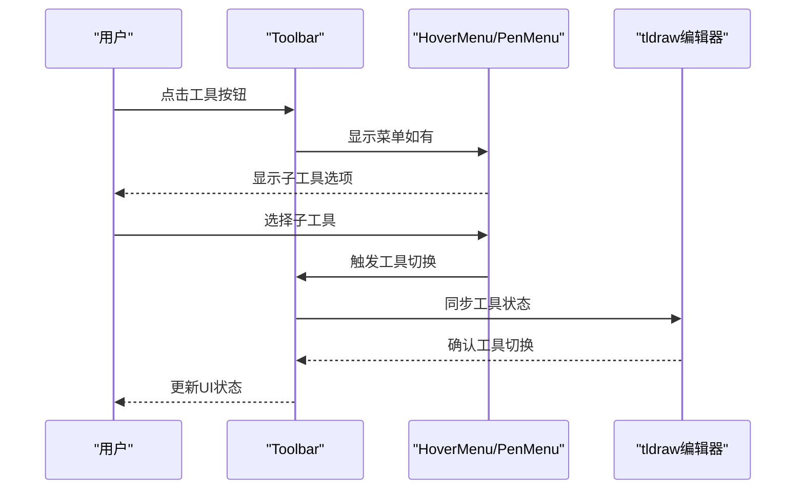

**图表来源**
- [components/canvas/Toolbar.tsx:194-668](file://components/canvas/Toolbar.tsx#L194-L668)

**章节来源**
- [components/canvas/Toolbar.tsx:1-668](file://components/canvas/Toolbar.tsx#L1-L668)
- [lib/store.ts:268-296](file://lib/store.ts#L268-L296)
- [lib/types.ts:34-40](file://lib/types.ts#L34-L40)

### 顶部栏（TopBar）
- **设计原则**
  - 信息性：显示项目名称、用户状态、积分信息
  - 交互性：支持项目名称编辑、菜单操作、聊天面板控制
  - 响应性：根据应用状态动态显示/隐藏元素
  - 美观性：半透明背景、阴影效果、圆角设计
- **属性与事件**
  - 项目管理：项目名称编辑、菜单操作（撤销、重做、缩放等）
  - 用户交互：积分显示、用户头像、聊天面板开关
  - 状态管理：isChatOpen（聊天面板状态）、toggleChat（切换函数）
- **样式定制**
  - Logo区域：圆角背景、半透明效果、阴影
  - 项目名称：可编辑状态下的输入框样式
  - 用户区域：圆角背景、阴影、悬停效果
  - 菜单下拉：深色背景、分隔线、快捷键显示
- **最佳实践**
  - 在编辑项目名称时提供键盘快捷键支持（Enter保存、Esc取消）
  - 菜单项操作后及时关闭菜单，避免遮挡画布
  - 积分显示提供视觉反馈，增强用户成就感

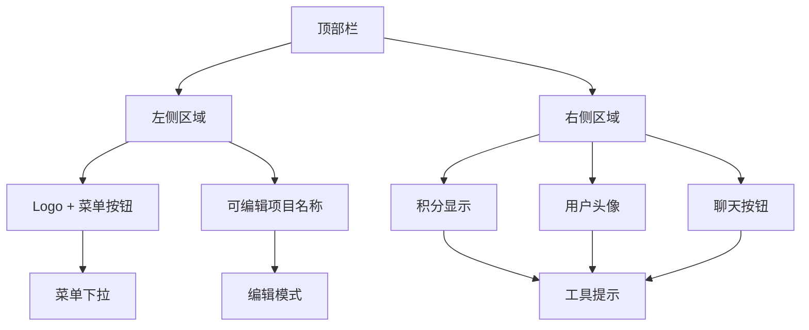

**图表来源**
- [components/canvas/TopBar.tsx:175-222](file://components/canvas/TopBar.tsx#L175-L222)

**章节来源**
- [components/canvas/TopBar.tsx:1-222](file://components/canvas/TopBar.tsx#L1-L222)
- [lib/store.ts:260-266](file://lib/store.ts#L260-L266)

## 依赖关系分析
- **外部依赖**
  - Base UI React：提供可访问性与语义化的 UI 原语（按钮、滚动区域、工具提示）
  - class-variance-authority：变体系统，统一组件外观与状态
  - Tailwind CSS 与 tailwind-merge：原子化样式与类名合并
  - shadcn：主题与组件风格基线
  - react-konva：Canvas绘图与交互（CanvasArea）
  - konva：2D图形库（CanvasArea）
  - zustand：状态管理（CanvasArea、InlineEditPanel、Toolbar、TopBar）
  - lucide-react：图标库（CanvasArea、InlineEditPanel、Toolbar、TopBar）
  - sonner：通知系统（CanvasArea、InlineEditPanel、Toolbar）
  - nanoid：唯一ID生成（CanvasArea、InlineEditPanel、Toolbar、TopBar）
  - @tldraw/tlschema：形状样式定义（Toolbar）
  - @tldraw/react：tldraw编辑器集成（Toolbar）
- **内部依赖**
  - cn 工具函数：合并类名，避免冲突
  - 主题变量：集中管理颜色、圆角与字体
  - 组件别名：components.json 中的 aliases 确保导入路径一致
  - 类型定义：CanvasItem、StoredRef、Message、Marker 确保数据结构一致性

```mermaid
graph TB
PKG["package.json<br/>依赖声明"]
CFG["components.json<br/>别名与风格"]
UTILS["lib/utils.ts<br/>cn(...)"]
THEME["app/globals.css<br/>主题变量"]
STORE["lib/store.ts<br/>Zustand状态"]
TYPES["lib/types.ts<br/>类型定义"]
BTN["button.tsx"]
BADGE["badge.tsx"]
TEXTAREA["textarea.tsx"]
SCROLL["scroll-area.tsx"]
TOOLTIP["tooltip.tsx<br/>CustomTooltip + Base UI"]
CANVAS["CanvasArea.tsx"]
INLINEEDIT["InlineEditPanel.tsx"]
TOOLBAR["Toolbar.tsx<br/>@tldraw/react + @tldraw/tlschema"]
TOPBAR["TopBar.tsx<br/>lucide-react + sonner"]
SELECTIONBADGE["SelectionBadge.tsx"]
CHAT["ChatPanel.tsx"]
PKG --> BTN
PKG --> BADGE
PKG --> TEXTAREA
PKG --> SCROLL
PKG --> TOOLTIP
PKG --> CANVAS
PKG --> INLINEEDIT
PKG --> TOOLBAR
PKG --> TOPBAR
PKG --> SELECTIONBADGE
PKG --> CHAT
CFG --> BTN
CFG --> BADGE
CFG --> TEXTAREA
CFG --> SCROLL
CFG --> TOOLTIP
CFG --> CANVAS
CFG --> INLINEEDIT
CFG --> TOOLBAR
CFG --> TOPBAR
CFG --> SELECTIONBADGE
CFG --> CHAT
UTILS --> BTN
UTILS --> BADGE
UTILS --> TEXTAREA
UTILS --> SCROLL
UTILS --> TOOLTIP
UTILS --> CANVAS
UTILS --> INLINEEDIT
UTILS --> TOOLBAR
UTILS --> TOPBAR
UTILS --> SELECTIONBADGE
THEME --> BTN
THEME --> BADGE
THEME --> TEXTAREA
THEME --> SCROLL
THEME --> TOOLTIP
THEME --> CANVAS
THEME --> INLINEEDIT
THEME --> TOOLBAR
THEME --> TOPBAR
THEME --> SELECTIONBADGE
STORE --> CANVAS
STORE --> INLINEEDIT
STORE --> TOOLBAR
STORE --> TOPBAR
STORE --> SELECTIONBADGE
TYPES --> CANVAS
TYPES --> INLINEEDIT
TYPES --> TOOLBAR
TYPES --> TOPBAR
TYPES --> SELECTIONBADGE
```

**图表来源**
- [package.json:1-48](file://package.json#L1-L48)
- [components.json:1-26](file://components.json#L1-L26)
- [lib/utils.ts:1-7](file://lib/utils.ts#L1-L7)
- [app/globals.css:1-128](file://app/globals.css#L1-L128)
- [lib/store.ts:1-378](file://lib/store.ts#L1-L378)
- [lib/types.ts:1-49](file://lib/types.ts#L1-L49)
- [components/ui/button.tsx:1-61](file://components/ui/button.tsx#L1-L61)
- [components/ui/badge.tsx:1-53](file://components/ui/badge.tsx#L1-L53)
- [components/ui/textarea.tsx:1-19](file://components/ui/textarea.tsx#L1-L19)
- [components/ui/scroll-area.tsx:1-56](file://components/ui/scroll-area.tsx#L1-L56)
- [components/ui/tooltip.tsx:1-174](file://components/ui/tooltip.tsx#L1-L174)
- [components/canvas/CanvasArea.tsx:1-508](file://components/canvas/CanvasArea.tsx#L1-L508)
- [components/canvas/InlineEditPanel.tsx:1-333](file://components/canvas/InlineEditPanel.tsx#L1-L333)
- [components/canvas/Toolbar.tsx:1-668](file://components/canvas/Toolbar.tsx#L1-L668)
- [components/canvas/TopBar.tsx:1-222](file://components/canvas/TopBar.tsx#L1-L222)
- [components/chat/SelectionBadge.tsx:1-104](file://components/chat/SelectionBadge.tsx#L1-L104)
- [components/chat/ChatPanel.tsx:1-22](file://components/chat/ChatPanel.tsx#L1-L22)

**章节来源**
- [package.json:1-48](file://package.json#L1-L48)
- [components.json:1-26](file://components.json#L1-L26)
- [lib/utils.ts:1-7](file://lib/utils.ts#L1-L7)
- [app/globals.css:1-128](file://app/globals.css#L1-L128)
- [lib/store.ts:1-378](file://lib/store.ts#L1-L378)
- [lib/types.ts:1-49](file://lib/types.ts#L1-L49)

## 性能考量
- **样式合并**：使用 cn 合并类名，减少重复与冲突，降低样式抖动
- **变体系统**：通过变体类减少条件分支带来的渲染开销
- **原生语义**：优先使用原生元素，减少额外包裹与事件处理成本
- **Canvas优化**
  - 使用 requestAnimationFrame 优化动画性能
  - 合理的缩放范围（0.05-10）避免数值溢出
  - 对象URL清理防止内存泄漏
  - 批量绘制减少重绘次数
- **状态管理**
  - Zustand提供轻量级状态管理，避免不必要的重渲染
  - 持久化存储分离会话状态与持久化状态
  - **新增**：使用store.listen事件驱动替代轮询，提高性能
- **文件处理**
  - 限制参考图数量（MAX_REFS=6）控制内存使用
  - 及时清理对象URL释放内存
  - 错误处理避免无限重试
- **工具提示优化**
  - **新增**：CustomTooltip使用requestAnimationFrame优化显示/隐藏动画
  - **新增**：延迟定时器管理避免频繁创建销毁DOM元素
- **选择徽章优化**
  - **新增**：固定定位逃逸overflow，避免影响画布布局
  - **新增**：悬停位置计算使用getBoundingClientRect，确保准确性

## 故障排查指南
- **样式未生效**
  - 检查主题变量是否正确加载（app/globals.css）
  - 确认 cn 合并顺序与 Tailwind 类优先级
  - 验证数据槽选择器与样式规则匹配
- **可访问性问题**
  - 确保按钮与文本域具备键盘可聚焦性
  - 检查禁用态与 aria-* 属性是否正确设置
  - 验证焦点管理与键盘快捷键
- **Canvas交互异常**
  - 检查Konva版本兼容性和事件绑定
  - 确认中间鼠标拖拽事件处理逻辑
  - 验证拖拽状态与选择状态同步
- **状态管理问题**
  - 确认Zustand状态初始化和持久化配置
  - 检查CanvasItem引用清理逻辑
  - 验证对象URL撤销时机
  - **新增**：检查store.listen订阅是否正确清理
- **文件上传失败**
  - 检查FAL API密钥和网络连接
  - 验证文件格式和大小限制
  - 确认错误处理和用户反馈
- **工具提示问题**
  - **新增**：检查CustomTooltip的延迟定时器是否正确清理
  - **新增**：验证Portal渲染是否正确挂载到DOM
- **选择徽章问题**
  - **新增**：检查悬停位置计算是否考虑滚动偏移
  - **新增**：验证固定定位是否正确逃逸父容器overflow
- **工具栏同步问题**
  - **新增**：检查tldraw编辑器状态同步逻辑
  - **新增**：验证快捷键监听是否正确绑定/解绑

**章节来源**
- [app/globals.css:1-128](file://app/globals.css#L1-L128)
- [lib/utils.ts:1-7](file://lib/utils.ts#L1-L7)
- [components/canvas/CanvasArea.tsx:1-508](file://components/canvas/CanvasArea.tsx#L1-L508)
- [components/canvas/InlineEditPanel.tsx:1-333](file://components/canvas/InlineEditPanel.tsx#L1-L333)
- [components/canvas/Toolbar.tsx:529-535](file://components/canvas/Toolbar.tsx#L529-L535)
- [components/chat/SelectionBadge.tsx:22-29](file://components/chat/SelectionBadge.tsx#L22-L29)
- [lib/store.ts:1-378](file://lib/store.ts#L1-L378)

## 结论
Loveart 的 UI 组件系统以 Tailwind 与 Base UI React 为基础，结合 class-variance-authority 实现一致的变体与状态管理，辅以主题变量与 cn 工具函数，确保在不同场景下保持设计一致性与可维护性。新增的Canvas组件系统进一步扩展了组件库的能力，提供了专业的图像编辑功能。**更新** 新增的选择徽章系统、自定义工具提示实现和画布工具栏组件显著提升了用户体验和交互质量。通过数据槽与可访问性原语，组件在功能与体验上均达到较高水准。建议在实际开发中遵循变体与尺寸规范，合理使用 Provider 与 Portal，充分利用Zustand状态管理，以获得最佳的组合效果与用户体验。

## 附录
- **组件使用示例与场景**
  - **Canvas编辑流程**：从拖放文件到内联编辑再到下载导出的完整工作流
  - **参考图管理**：多图上传、拖拽排序、实时预览与删除功能
  - **文本输入与按钮组合**：在聊天输入区，文本域自适应高度，按钮根据状态切换图标与禁用态，工具提示在上传进行中提供即时反馈
  - **滚动区域与长内容**：在消息历史或画布预览中使用滚动区域，确保滚动条不遮挡内容
  - **徽章与状态**：在工具栏或图层面板中使用徽章标识状态或类型
  - **选择徽章系统**：在画布项选择时使用SelectionBadge提供缩略图预览和交互控制
  - **工具提示增强**：在Toolbar中使用CustomTooltip提供精确的工具提示
  - **画布工具栏**：集成多种编辑工具，支持快捷键和菜单操作
  - **顶部栏功能**：项目管理、用户状态显示和聊天面板控制
- **最佳实践清单**
  - **Canvas开发**：使用响应式容器、合理设置缩放范围、及时清理对象URL
  - **状态管理**：利用Zustand的持久化功能、分离会话状态与持久化状态
  - **性能优化**：限制并发上传数量、使用批处理绘制、避免不必要的重渲染
  - **错误处理**：提供清晰的错误提示、实现重试机制、优雅降级
  - **可访问性**：确保键盘导航、屏幕阅读器支持、高对比度模式
  - **类型安全**：严格使用TypeScript接口、避免类型断言滥用
  - **工具提示优化**：合理设置延迟时间、使用合适的定位策略
  - **选择徽章设计**：确保缩略图加载成功、提供清晰的状态反馈
  - **工具栏同步**：使用事件驱动替代轮询、正确处理tldraw状态同步

**章节来源**
- [components/canvas/CanvasArea.tsx:1-508](file://components/canvas/CanvasArea.tsx#L1-L508)
- [components/canvas/InlineEditPanel.tsx:1-333](file://components/canvas/InlineEditPanel.tsx#L1-L333)
- [components/canvas/Toolbar.tsx:1-668](file://components/canvas/Toolbar.tsx#L1-L668)
- [components/canvas/TopBar.tsx:1-222](file://components/canvas/TopBar.tsx#L1-L222)
- [components/chat/SelectionBadge.tsx:1-104](file://components/chat/SelectionBadge.tsx#L1-L104)
- [lib/store.ts:1-378](file://lib/store.ts#L1-L378)
- [lib/types.ts:1-49](file://lib/types.ts#L1-L49)
- [app/layout.tsx:1-38](file://app/layout.tsx#L1-L38)
- [app/page.tsx:1-10](file://app/page.tsx#L1-L10)