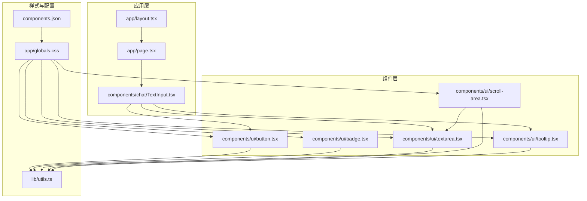
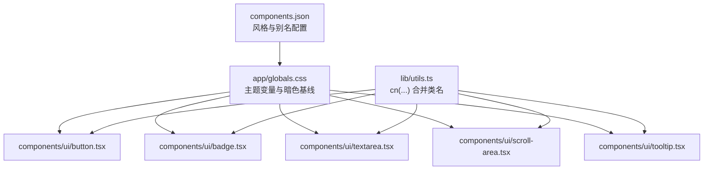
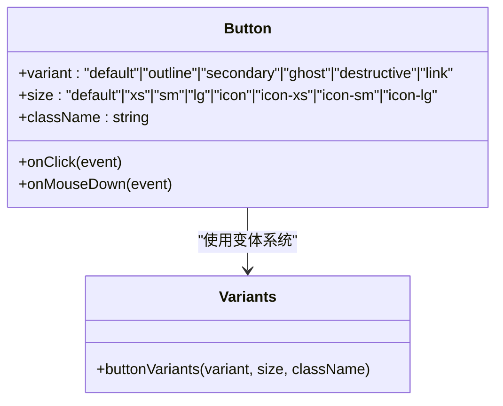
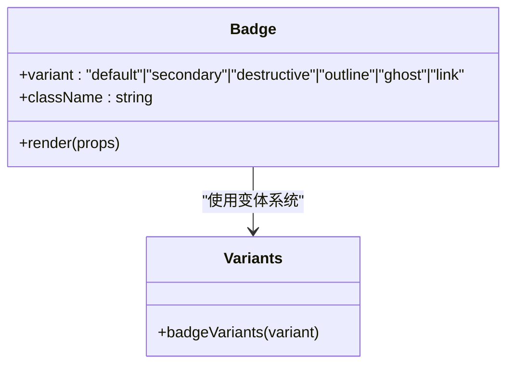
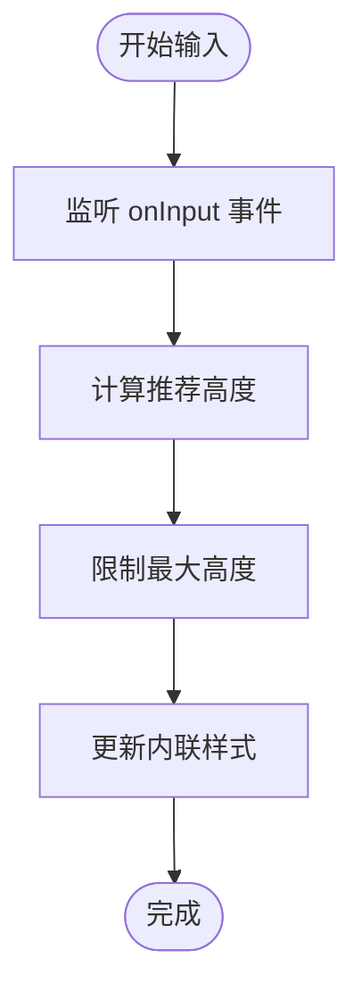
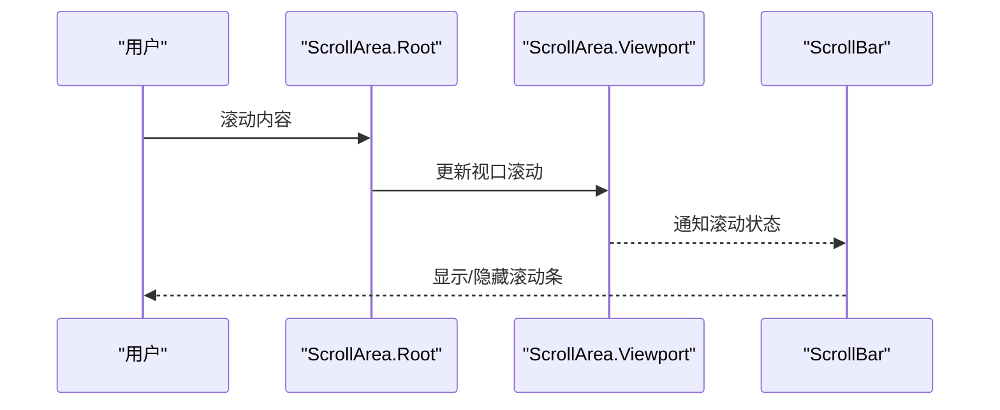
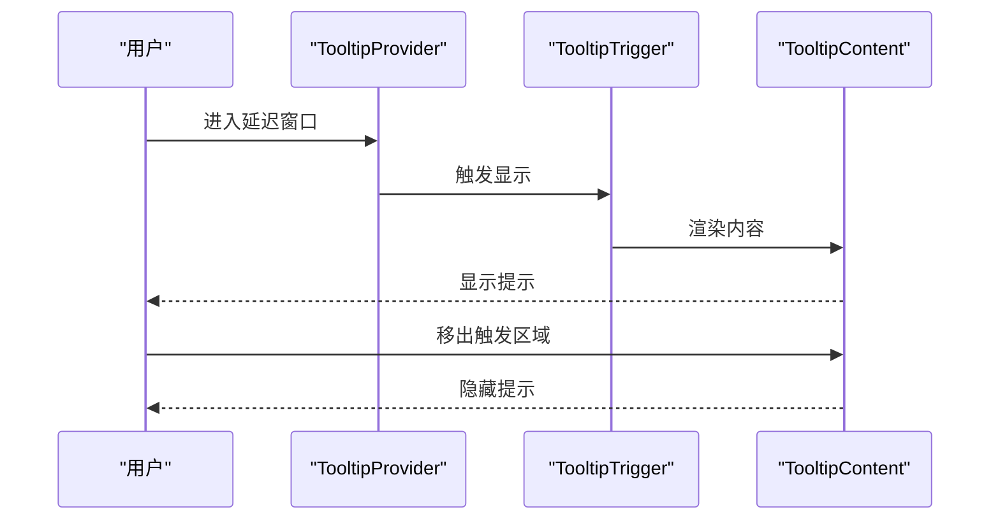
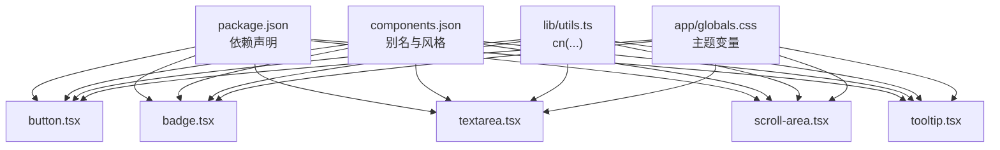

# UI 组件系统

<cite>
**本文引用的文件**
- [components/ui/button.tsx](file://components/ui/button.tsx)
- [components/ui/badge.tsx](file://components/ui/badge.tsx)
- [components/ui/textarea.tsx](file://components/ui/textarea.tsx)
- [components/ui/scroll-area.tsx](file://components/ui/scroll-area.tsx)
- [components/ui/tooltip.tsx](file://components/ui/tooltip.tsx)
- [app/globals.css](file://app/globals.css)
- [lib/utils.ts](file://lib/utils.ts)
- [package.json](file://package.json)
- [components.json](file://components.json)
- [components/chat/TextInput.tsx](file://components/chat/TextInput.tsx)
- [app/layout.tsx](file://app/layout.tsx)
- [app/page.tsx](file://app/page.tsx)
</cite>

## 目录
1. [简介](#简介)
2. [项目结构](#项目结构)
3. [核心组件](#核心组件)
4. [架构总览](#架构总览)
5. [详细组件分析](#详细组件分析)
6. [依赖关系分析](#依赖关系分析)
7. [性能考量](#性能考量)
8. [故障排查指南](#故障排查指南)
9. [结论](#结论)
10. [附录](#附录)

## 简介
本文件为 Loveart 的 UI 组件系统提供完整参考，覆盖基于 Tailwind CSS 与 Radix UI（通过 Base UI React 封装）构建的基础组件：按钮、文本域、滚动区域、工具提示与徽章。内容涵盖组件属性接口、事件处理、样式定制选项、可访问性支持、设计原则与一致性保障机制，并给出组合模式与场景化应用策略，帮助设计师与开发者高效、一致地使用组件。

## 项目结构
组件库位于 components/ui 下，采用“按功能分层 + 原子化样式”的组织方式：
- 组件层：button、badge、textarea、scroll-area、tooltip
- 样式层：Tailwind 主题变量与暗色模式基线、颜色语义映射
- 工具层：cn 合并工具函数
- 配置层：components.json 指定主题风格、Tailwind 路径与别名

图表来源
- [app/layout.tsx:1-38](file://app/layout.tsx#L1-L38)
- [app/page.tsx:1-59](file://app/page.tsx#L1-L59)
- [components/chat/TextInput.tsx:1-140](file://components/chat/TextInput.tsx#L1-L140)
- [components/ui/button.tsx:1-61](file://components/ui/button.tsx#L1-L61)
- [components/ui/badge.tsx:1-53](file://components/ui/badge.tsx#L1-L53)
- [components/ui/textarea.tsx:1-19](file://components/ui/textarea.tsx#L1-L19)
- [components/ui/scroll-area.tsx:1-56](file://components/ui/scroll-area.tsx#L1-L56)
- [components/ui/tooltip.tsx:1-67](file://components/ui/tooltip.tsx#L1-L67)
- [app/globals.css:1-128](file://app/globals.css#L1-L128)
- [lib/utils.ts:1-7](file://lib/utils.ts#L1-L7)
- [components.json:1-26](file://components.json#L1-L26)

章节来源
- [app/layout.tsx:1-38](file://app/layout.tsx#L1-L38)
- [app/page.tsx:1-59](file://app/page.tsx#L1-L59)
- [components/chat/TextInput.tsx:1-140](file://components/chat/TextInput.tsx#L1-L140)
- [components/ui/button.tsx:1-61](file://components/ui/button.tsx#L1-L61)
- [components/ui/badge.tsx:1-53](file://components/ui/badge.tsx#L1-L53)
- [components/ui/textarea.tsx:1-19](file://components/ui/textarea.tsx#L1-L19)
- [components/ui/scroll-area.tsx:1-56](file://components/ui/scroll-area.tsx#L1-L56)
- [components/ui/tooltip.tsx:1-67](file://components/ui/tooltip.tsx#L1-L67)
- [app/globals.css:1-128](file://app/globals.css#L1-L128)
- [lib/utils.ts:1-7](file://lib/utils.ts#L1-L7)
- [components.json:1-26](file://components.json#L1-L26)

## 核心组件
本节概述五个基础组件的功能定位、关键属性与样式约定，便于快速检索与对比。

- 按钮（Button）
  - 角色：承载交互动作，支持多种视觉状态与尺寸
  - 关键属性：variant（默认/描边/次要/幽灵/破坏/链接）、size（默认/xs/sm/lg/icon 系列）
  - 可访问性：继承原生按钮行为，支持聚焦环、禁用态、aria-expanded 状态
  - 样式定制：通过变体类与数据槽（data-slot）实现一致的视觉与交互反馈

- 徽章（Badge）
  - 角色：信息标签或状态指示，强调性较低
  - 关键属性：variant（默认/次要/破坏/描边/幽灵/链接）
  - 渲染扩展：支持自定义渲染器（render），便于嵌入图标或复杂内容
  - 样式定制：紧凑尺寸与圆角设计，适配密集信息展示

- 文本域（Textarea）
  - 角色：多行文本输入，支持自适应高度
  - 关键属性：标准 textarea 属性（受控/非受控均可）
  - 行为特性：自动调整高度、禁用态、占位符、焦点环与无效态样式
  - 样式定制：统一圆角、边框与背景色，适配暗色主题

- 滚动区域（ScrollArea）
  - 角色：容器滚动增强，提供可定制滚动条
  - 关键属性：根组件支持通用属性；滚动条支持方向（垂直/水平）与尺寸
  - 行为特性：视口聚焦环、角落装饰、滚动条随内容动态显示
  - 样式定制：滚动条尺寸、颜色与过渡效果可调

- 工具提示（Tooltip）
  - 角色：上下文提示，支持延迟、位置与箭头对齐
  - 关键属性：Provider 延迟控制；Root/Trigger/Content 支持定位与动画
  - 行为特性：基于 Portal 渲染，支持多侧边与偏移量微调
  - 样式定制：内容区圆角、背景与前景色、动画入场/出场

章节来源
- [components/ui/button.tsx:45-61](file://components/ui/button.tsx#L45-L61)
- [components/ui/badge.tsx:30-53](file://components/ui/badge.tsx#L30-L53)
- [components/ui/textarea.tsx:5-19](file://components/ui/textarea.tsx#L5-L19)
- [components/ui/scroll-area.tsx:8-56](file://components/ui/scroll-area.tsx#L8-L56)
- [components/ui/tooltip.tsx:7-67](file://components/ui/tooltip.tsx#L7-L67)

## 架构总览
组件系统以“原子化样式 + 变体系统 + 原生语义”为核心设计原则：
- 原子化样式：通过 Tailwind 类与主题变量实现一致的间距、圆角、色彩与阴影
- 变体系统：使用 class-variance-authority 定义变体与默认值，确保组件在不同上下文中的一致表现
- 原生语义：优先使用原生 HTML 元素（如 button、textarea），结合 Base UI React 提供的可访问性能力
- 数据槽（data-slot）：为样式与测试提供稳定选择器，避免脆弱的 DOM 结构耦合

图表来源
- [lib/utils.ts:1-7](file://lib/utils.ts#L1-L7)
- [app/globals.css:1-128](file://app/globals.css#L1-L128)
- [components.json:1-26](file://components.json#L1-L26)
- [components/ui/button.tsx:1-61](file://components/ui/button.tsx#L1-L61)
- [components/ui/badge.tsx:1-53](file://components/ui/badge.tsx#L1-L53)
- [components/ui/textarea.tsx:1-19](file://components/ui/textarea.tsx#L1-L19)
- [components/ui/scroll-area.tsx:1-56](file://components/ui/scroll-area.tsx#L1-L56)
- [components/ui/tooltip.tsx:1-67](file://components/ui/tooltip.tsx#L1-L67)

## 详细组件分析

### 按钮（Button）
- 设计原则
  - 语义明确：承载主要或辅助操作
  - 视觉层级：通过 variant 区分主次与危险操作
  - 尺寸一致性：通过 size 控制高度、内边距与图标尺寸
  - 可访问性：支持键盘聚焦、禁用态、aria-expanded 状态
- 属性与事件
  - 属性：className、variant、size、原生 button 属性
  - 事件：onClick、onMouseDown 等原生事件透传
- 样式定制
  - 使用变体类与数据槽（data-slot="button"）确保样式稳定
  - 通过 Tailwind 类覆盖默认样式，保持与主题一致
- 最佳实践
  - 主要操作使用默认变体；危险操作使用破坏变体
  - 图标按钮使用 icon 系列尺寸，确保视觉平衡
  - 在按钮组中使用特定尺寸以保持对齐

图表来源
- [components/ui/button.tsx:8-43](file://components/ui/button.tsx#L8-L43)
- [components/ui/button.tsx:45-61](file://components/ui/button.tsx#L45-L61)

章节来源
- [components/ui/button.tsx:1-61](file://components/ui/button.tsx#L1-L61)
- [lib/utils.ts:1-7](file://lib/utils.ts#L1-L7)
- [app/globals.css:1-128](file://app/globals.css#L1-L128)

### 徽章（Badge）
- 设计原则
  - 轻量化：用于弱提示或状态标识
  - 可读性：紧凑尺寸与清晰对比度
  - 扩展性：支持自定义渲染器以容纳图标或复杂内容
- 属性与事件
  - 属性：className、variant、render、原生 span 属性
  - 事件：透传至底层元素
- 样式定制
  - 使用变体类与数据槽（data-slot="badge"）确保样式稳定
  - 通过 Tailwind 类覆盖默认样式，保持与主题一致
- 最佳实践
  - 使用默认变体传达中性信息；破坏变体突出错误或警告
  - 与图标配合时，注意间距与对齐

图表来源
- [components/ui/badge.tsx:7-28](file://components/ui/badge.tsx#L7-L28)
- [components/ui/badge.tsx:30-53](file://components/ui/badge.tsx#L30-L53)

章节来源
- [components/ui/badge.tsx:1-53](file://components/ui/badge.tsx#L1-L53)
- [lib/utils.ts:1-7](file://lib/utils.ts#L1-L7)
- [app/globals.css:1-128](file://app/globals.css#L1-L128)

### 文本域（Textarea）
- 设计原则
  - 自适应高度：提升输入体验，避免滚动干扰
  - 明确状态：禁用态、无效态与焦点态有清晰视觉反馈
  - 一致性：与主题颜色与圆角保持一致
- 属性与事件
  - 属性：className、受控/非受控值、占位符、禁用态
  - 事件：onChange、onKeyDown、onFocus、onInput 等
- 样式定制
  - 使用数据槽（data-slot="textarea"）确保样式稳定
  - 通过 Tailwind 类覆盖默认样式，保持与主题一致
- 最佳实践
  - 输入监听中使用 onInput 动态调整高度，限制最大高度
  - 与按钮组合时，确保尺寸与间距协调

图表来源
- [components/ui/textarea.tsx:5-19](file://components/ui/textarea.tsx#L5-L19)
- [components/chat/TextInput.tsx:112-117](file://components/chat/TextInput.tsx#L112-L117)

章节来源
- [components/ui/textarea.tsx:1-19](file://components/ui/textarea.tsx#L1-L19)
- [components/chat/TextInput.tsx:1-140](file://components/chat/TextInput.tsx#L1-L140)
- [lib/utils.ts:1-7](file://lib/utils.ts#L1-L7)
- [app/globals.css:1-128](file://app/globals.css#L1-L128)

### 滚动区域（ScrollArea）
- 设计原则
  - 可见性：滚动条仅在需要时出现，避免遮挡内容
  - 一致性：滚动条尺寸、颜色与主题一致
  - 可访问性：视口支持键盘导航与聚焦环
- 属性与事件
  - 根组件：通用属性透传
  - 滚动条：支持方向（vertical/horizontal）与尺寸
- 样式定制
  - 使用数据槽（data-slot="scroll-area" 等）确保样式稳定
  - 通过 Tailwind 类覆盖默认样式，保持与主题一致
- 最佳实践
  - 在对话列表或长内容面板中使用，避免强制滚动
  - 与文本域组合时，确保滚动条不遮挡输入区域

图表来源
- [components/ui/scroll-area.tsx:8-56](file://components/ui/scroll-area.tsx#L8-L56)

章节来源
- [components/ui/scroll-area.tsx:1-56](file://components/ui/scroll-area.tsx#L1-L56)
- [lib/utils.ts:1-7](file://lib/utils.ts#L1-L7)
- [app/globals.css:1-128](file://app/globals.css#L1-L128)

### 工具提示（Tooltip）
- 设计原则
  - 即时性：延迟可控，避免频繁闪烁
  - 准确性：内容区与触发元素对齐，箭头方向正确
  - 可访问性：支持键盘触发与焦点管理
- 属性与事件
  - Provider：delay 控制延迟
  - Trigger：作为触发器包装任意元素
  - Content：支持 side、sideOffset、align、alignOffset 定位
- 样式定制
  - 使用数据槽（data-slot="tooltip-provider"/"tooltip-trigger"/"tooltip-content"）确保样式稳定
  - 通过 Tailwind 类覆盖默认样式，保持与主题一致
- 最佳实践
  - 在按钮组或图标按钮上使用，提供简短说明
  - 与加载态结合时，提示用户当前不可交互的原因

图表来源
- [components/ui/tooltip.tsx:7-67](file://components/ui/tooltip.tsx#L7-L67)

章节来源
- [components/ui/tooltip.tsx:1-67](file://components/ui/tooltip.tsx#L1-L67)
- [lib/utils.ts:1-7](file://lib/utils.ts#L1-L7)
- [app/globals.css:1-128](file://app/globals.css#L1-L128)

## 依赖关系分析
- 外部依赖
  - Base UI React：提供可访问性与语义化的 UI 原语（按钮、滚动区域、工具提示）
  - class-variance-authority：变体系统，统一组件外观与状态
  - Tailwind CSS 与 tailwind-merge：原子化样式与类名合并
  - shadcn：主题与组件风格基线
- 内部依赖
  - cn 工具函数：合并类名，避免冲突
  - 主题变量：集中管理颜色、圆角与字体
  - 组件别名：components.json 中的 aliases 确保导入路径一致

图表来源
- [package.json:1-48](file://package.json#L1-L48)
- [components.json:1-26](file://components.json#L1-L26)
- [lib/utils.ts:1-7](file://lib/utils.ts#L1-L7)
- [app/globals.css:1-128](file://app/globals.css#L1-L128)
- [components/ui/button.tsx:1-61](file://components/ui/button.tsx#L1-L61)
- [components/ui/badge.tsx:1-53](file://components/ui/badge.tsx#L1-L53)
- [components/ui/textarea.tsx:1-19](file://components/ui/textarea.tsx#L1-L19)
- [components/ui/scroll-area.tsx:1-56](file://components/ui/scroll-area.tsx#L1-L56)
- [components/ui/tooltip.tsx:1-67](file://components/ui/tooltip.tsx#L1-L67)

章节来源
- [package.json:1-48](file://package.json#L1-L48)
- [components.json:1-26](file://components.json#L1-L26)
- [lib/utils.ts:1-7](file://lib/utils.ts#L1-L7)
- [app/globals.css:1-128](file://app/globals.css#L1-L128)

## 性能考量
- 样式合并：使用 cn 合并类名，减少重复与冲突，降低样式抖动
- 变体系统：通过变体类减少条件分支带来的渲染开销
- 原生语义：优先使用原生元素，减少额外包裹与事件处理成本
- 滚动区域：仅在需要时显示滚动条，避免不必要的布局重排
- 工具提示：延迟控制与 Portal 渲染，减少对主 DOM 的影响

## 故障排查指南
- 样式未生效
  - 检查主题变量是否正确加载（app/globals.css）
  - 确认 cn 合并顺序与 Tailwind 类优先级
- 可访问性问题
  - 确保按钮与文本域具备键盘可聚焦性
  - 检查禁用态与 aria-* 属性是否正确设置
- 组件组合异常
  - 检查 data-slot 是否与样式规则匹配
  - 确认 Provider 作用范围覆盖到触发器与内容区
- 暗色模式显示异常
  - 确认 :root 与 .dark 值一致，且 html 根节点包含 dark 类

章节来源
- [app/globals.css:1-128](file://app/globals.css#L1-L128)
- [lib/utils.ts:1-7](file://lib/utils.ts#L1-L7)
- [components/ui/button.tsx:1-61](file://components/ui/button.tsx#L1-L61)
- [components/ui/tooltip.tsx:1-67](file://components/ui/tooltip.tsx#L1-L67)

## 结论
Loveart 的 UI 组件系统以 Tailwind 与 Base UI React 为基础，结合 class-variance-authority 实现一致的变体与状态管理，辅以主题变量与 cn 工具函数，确保在不同场景下保持设计一致性与可维护性。通过数据槽与可访问性原语，组件在功能与体验上均达到较高水准。建议在实际开发中遵循变体与尺寸规范，合理使用 Provider 与 Portal，以获得最佳的组合效果与用户体验。

## 附录
- 组件使用示例与场景
  - 文本输入与按钮组合：在聊天输入区，文本域自适应高度，按钮根据状态切换图标与禁用态，工具提示在上传进行中提供即时反馈
  - 滚动区域与长内容：在消息历史或画布预览中使用滚动区域，确保滚动条不遮挡内容
  - 徽章与状态：在工具栏或图层面板中使用徽章标识状态或类型
- 最佳实践清单
  - 优先使用默认变体表达主要操作，破坏变体仅用于危险操作
  - 图标按钮使用 icon 系列尺寸，保持视觉平衡
  - 文本域使用受控值与 onInput 自适应高度，限制最大高度
  - 工具提示提供简洁说明，避免冗长文本
  - 暗色模式下保持颜色对比度与可读性

章节来源
- [components/chat/TextInput.tsx:1-140](file://components/chat/TextInput.tsx#L1-L140)
- [app/layout.tsx:1-38](file://app/layout.tsx#L1-L38)
- [app/page.tsx:1-59](file://app/page.tsx#L1-L59)