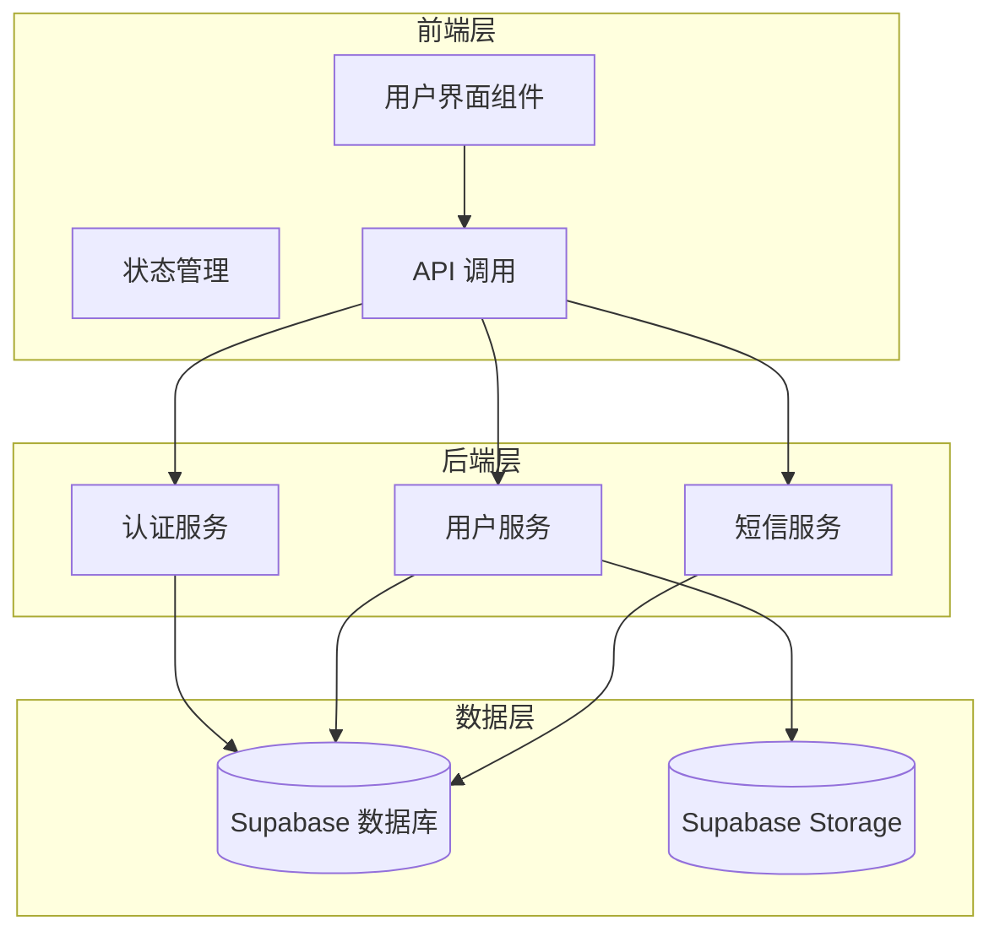
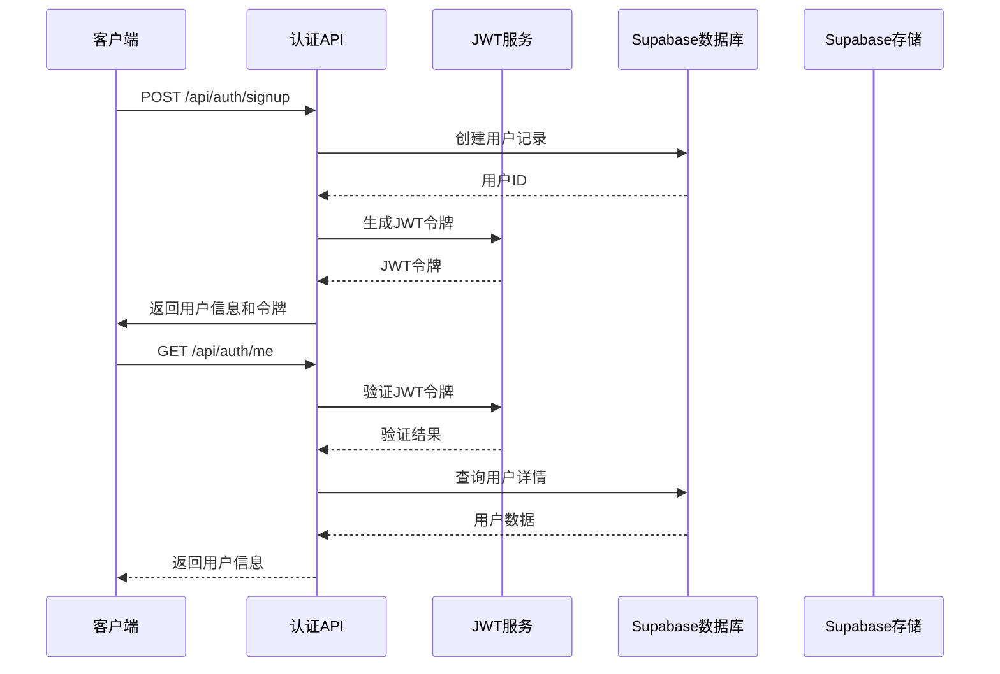
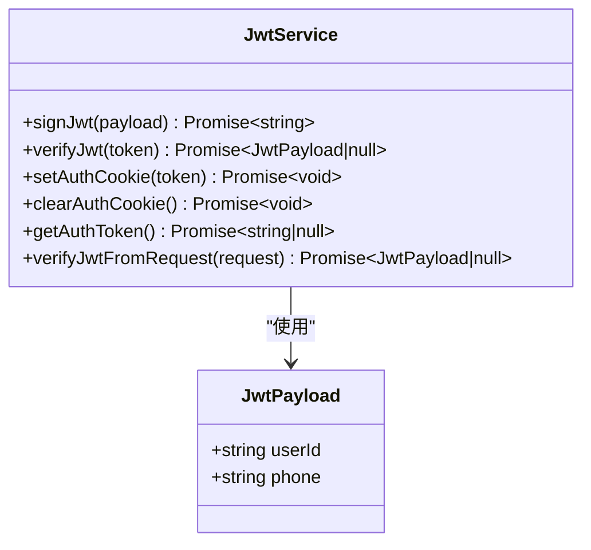
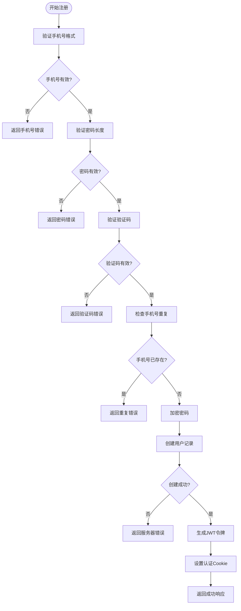
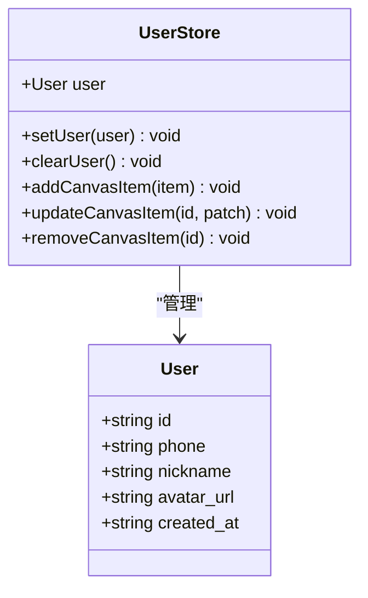
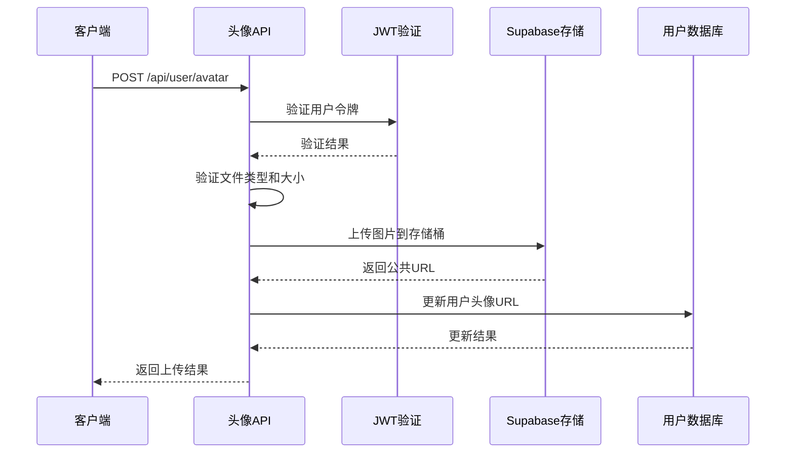
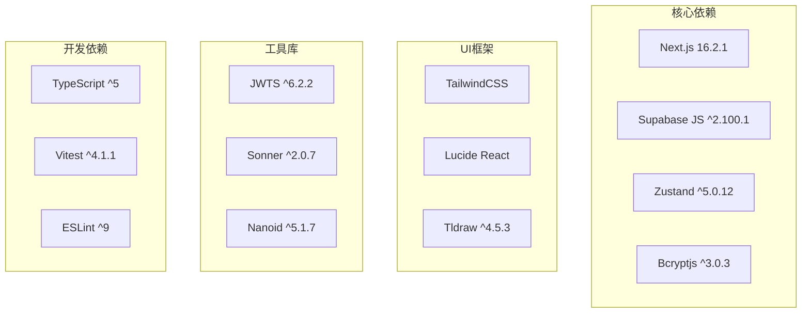

# 用户系统路线图

<cite>
**本文档引用的文件**
- [docs/user-system-roadmap.md](file://docs/user-system-roadmap.md)
- [lib/auth.ts](file://lib/auth.ts)
- [lib/supabase-server.ts](file://lib/supabase-server.ts)
- [lib/store.ts](file://lib/store.ts)
- [lib/types.ts](file://lib/types.ts)
- [lib/sms.ts](file://lib/sms.ts)
- [app/api/auth/me/route.ts](file://app/api/auth/me/route.ts)
- [app/api/auth/signin/route.ts](file://app/api/auth/signin/route.ts)
- [app/api/auth/signup/route.ts](file://app/api/auth/signup/route.ts)
- [app/api/auth/signout/route.ts](file://app/api/auth/signout/route.ts)
- [app/api/auth/send-code/route.ts](file://app/api/auth/send-code/route.ts)
- [app/api/user/avatar/route.ts](file://app/api/user/avatar/route.ts)
- [app/api/user/profile/route.ts](file://app/api/user/profile/route.ts)
- [components/canvas/TopBar.tsx](file://components/canvas/TopBar.tsx)
- [app/profile/page.tsx](file://app/profile/page.tsx)
- [supabase/schema.sql](file://supabase/schema.sql)
- [package.json](file://package.json)
</cite>

## 目录
1. [项目概述](#项目概述)
2. [项目结构](#项目结构)
3. [核心组件](#核心组件)
4. [架构概览](#架构概览)
5. [详细组件分析](#详细组件分析)
6. [依赖关系分析](#依赖关系分析)
7. [性能考虑](#性能考虑)
8. [故障排除指南](#故障排除指南)
9. [结论](#结论)

## 项目概述

Loveart 是一个基于 Next.js 和 Supabase 构建的 AI 绘画应用，当前正处于用户系统的开发阶段。该项目采用现代化的技术栈，包括 TypeScript、TailwindCSS、Zustand 状态管理等，致力于为用户提供流畅的 AI 绘画体验。

根据用户系统路线图，项目目前处于 Phase 1：头像昵称系统阶段，已完成手机号注册/登录/退出功能，并正在扩展用户个性化功能。

## 项目结构

项目采用模块化的组织方式，主要分为以下几个核心部分：

**图表来源**
- [lib/store.ts:1-396](file://lib/store.ts#L1-L396)
- [lib/auth.ts:1-64](file://lib/auth.ts#L1-L64)
- [lib/supabase-server.ts:1-29](file://lib/supabase-server.ts#L1-L29)

**章节来源**
- [package.json:1-54](file://package.json#L1-L54)
- [docs/user-system-roadmap.md:1-62](file://docs/user-system-roadmap.md#L1-L62)

## 核心组件

### 认证系统
认证系统基于 JWT（JSON Web Token）实现，提供安全的用户身份验证机制。系统支持手机号+密码和验证码两种登录方式。

### 用户状态管理
使用 Zustand 进行全局状态管理，包含用户信息、画布状态、聊天历史等数据的持久化存储。

### 头像和昵称系统
用户可以设置个性化的昵称和头像，增强用户的归属感和个性化体验。

**章节来源**
- [lib/auth.ts:1-64](file://lib/auth.ts#L1-L64)
- [lib/store.ts:1-396](file://lib/store.ts#L1-L396)
- [lib/types.ts:50-57](file://lib/types.ts#L50-L57)

## 架构概览

系统采用前后端分离的架构设计，通过 API Routes 提供 RESTful 接口服务：

**图表来源**
- [app/api/auth/signup/route.ts:1-134](file://app/api/auth/signup/route.ts#L1-L134)
- [app/api/auth/me/route.ts:1-54](file://app/api/auth/me/route.ts#L1-L54)
- [lib/auth.ts:13-28](file://lib/auth.ts#L13-L28)

## 详细组件分析

### 认证服务组件

#### JWT 令牌管理
JWT 服务负责用户令牌的签发、验证和管理，采用 HS256 算法确保令牌安全性。

**图表来源**
- [lib/auth.ts:8-64](file://lib/auth.ts#L8-L64)

#### 用户注册流程
注册流程支持手机号+密码和验证码两种方式，包含完整的输入验证和错误处理。

**图表来源**
- [app/api/auth/signup/route.ts:9-134](file://app/api/auth/signup/route.ts#L9-L134)

**章节来源**
- [app/api/auth/signup/route.ts:1-134](file://app/api/auth/signup/route.ts#L1-L134)
- [app/api/auth/signin/route.ts:1-93](file://app/api/auth/signin/route.ts#L1-L93)
- [app/api/auth/send-code/route.ts:1-48](file://app/api/auth/send-code/route.ts#L1-L48)

### 用户状态管理系统

#### Zustand 状态管理
使用 Zustand 实现全局状态管理，支持数据持久化和响应式更新。

**图表来源**
- [lib/store.ts:49-51](file://lib/store.ts#L49-L51)
- [lib/types.ts:50-57](file://lib/types.ts#L50-L57)

#### 顶部导航栏用户菜单
提供用户信息展示和操作入口，包含头像显示、昵称展示和下拉菜单功能。

**章节来源**
- [lib/store.ts:1-396](file://lib/store.ts#L1-L396)
- [components/canvas/TopBar.tsx:286-382](file://components/canvas/TopBar.tsx#L286-L382)

### 头像和昵称系统

#### 头像上传服务
支持多种图片格式的头像上传，包含文件类型验证、大小限制和存储管理。

**图表来源**
- [app/api/user/avatar/route.ts:9-122](file://app/api/user/avatar/route.ts#L9-L122)

#### 个人资料页面
提供用户昵称修改和个人信息管理功能。

**章节来源**
- [app/api/user/avatar/route.ts:1-122](file://app/api/user/avatar/route.ts#L1-L122)
- [app/api/user/profile/route.ts:1-75](file://app/api/user/profile/route.ts#L1-L75)
- [app/profile/page.tsx:1-284](file://app/profile/page.tsx#L1-L284)

### 短信验证码服务

#### 验证码发送和验证
支持阿里云短信服务和开发模式，提供验证码的生成、存储和验证功能。

**章节来源**
- [lib/sms.ts:1-115](file://lib/sms.ts#L1-L115)

## 依赖关系分析

项目的核心依赖关系如下：

**图表来源**
- [package.json:11-35](file://package.json#L11-L35)

**章节来源**
- [package.json:1-54](file://package.json#L1-54)

## 性能考虑

### JWT 令牌优化
- 令牌有效期设置为7天，平衡安全性和用户体验
- 使用 HS256 算法确保令牌验证效率
- Cookie 设置 HttpOnly、Secure、SameSite 属性提升安全性

### 数据库查询优化
- 为 verification_codes 表建立复合索引提高查询性能
- users 表的 phone 字段建立索引支持快速查找
- 使用单字段查询减少数据库负载

### 缓存策略
- 用户信息在客户端进行短期缓存
- 头像图片使用浏览器缓存机制
- 状态管理使用持久化存储减少重复加载

## 故障排除指南

### 常见问题及解决方案

#### 认证相关问题
- **令牌过期**：检查 JWT_SECRET 环境变量配置
- **Cookie 设置失败**：确认域名和路径配置正确
- **登录状态异常**：检查 Supabase 环境变量是否正确

#### 数据库连接问题
- **连接失败**：验证 NEXT_PUBLIC_SUPABASE_URL 和 SUPABASE_SERVICE_ROLE_KEY
- **查询超时**：检查数据库索引和查询语句优化
- **权限不足**：确认服务角色密钥配置正确

#### 文件上传问题
- **上传失败**：检查存储桶权限和文件大小限制
- **URL 无法访问**：验证存储桶 CORS 配置
- **格式不支持**：确认文件类型在允许列表中

**章节来源**
- [lib/auth.ts:19-28](file://lib/auth.ts#L19-L28)
- [lib/supabase-server.ts:19-26](file://lib/supabase-server.ts#L19-L26)
- [app/api/user/avatar/route.ts:75-81](file://app/api/user/avatar/route.ts#L75-L81)

## 结论

Loveart 的用户系统路线图展现了清晰的功能规划和技术实现路径。当前阶段的头像昵称系统为用户提供了基本的个性化功能，为后续的第三方登录等功能奠定了基础。

### 已完成的关键里程碑
- 手机号注册/登录/退出功能完整实现
- JWT 认证体系建立
- 头像上传和昵称修改功能
- 状态管理和用户界面集成

### 技术优势
- 现代化的技术栈选择，具备良好的可维护性
- 完善的错误处理和安全机制
- 清晰的模块化架构设计
- 良好的性能优化策略

### 后续发展方向
根据路线图规划，下一步将重点实现第三方登录功能，包括 Google 登录和微信登录，进一步丰富用户的登录方式选择。