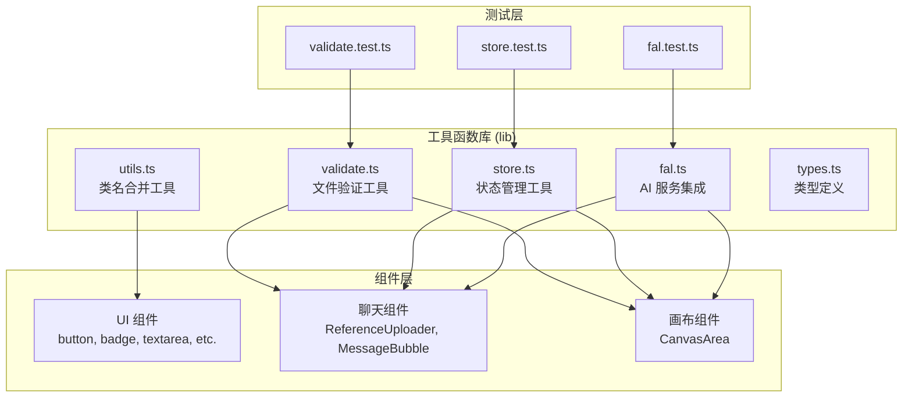
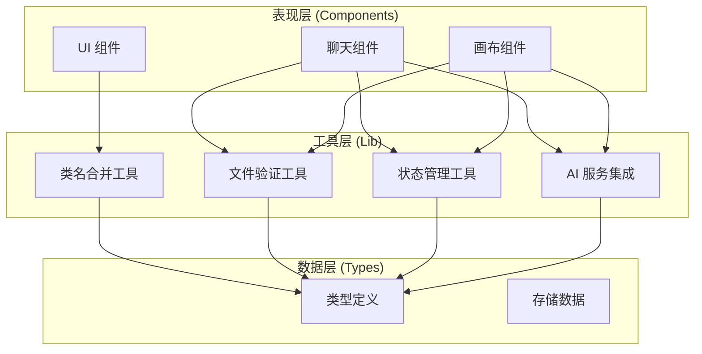
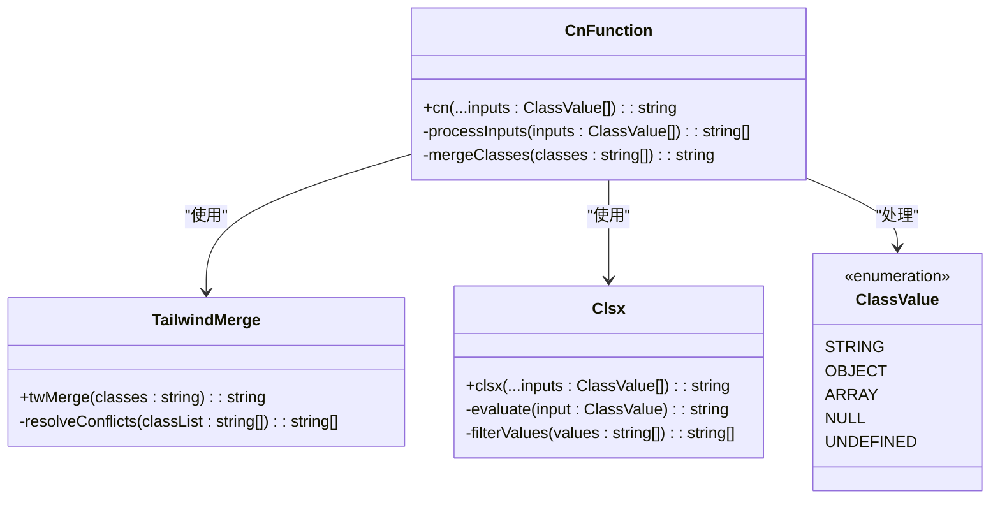
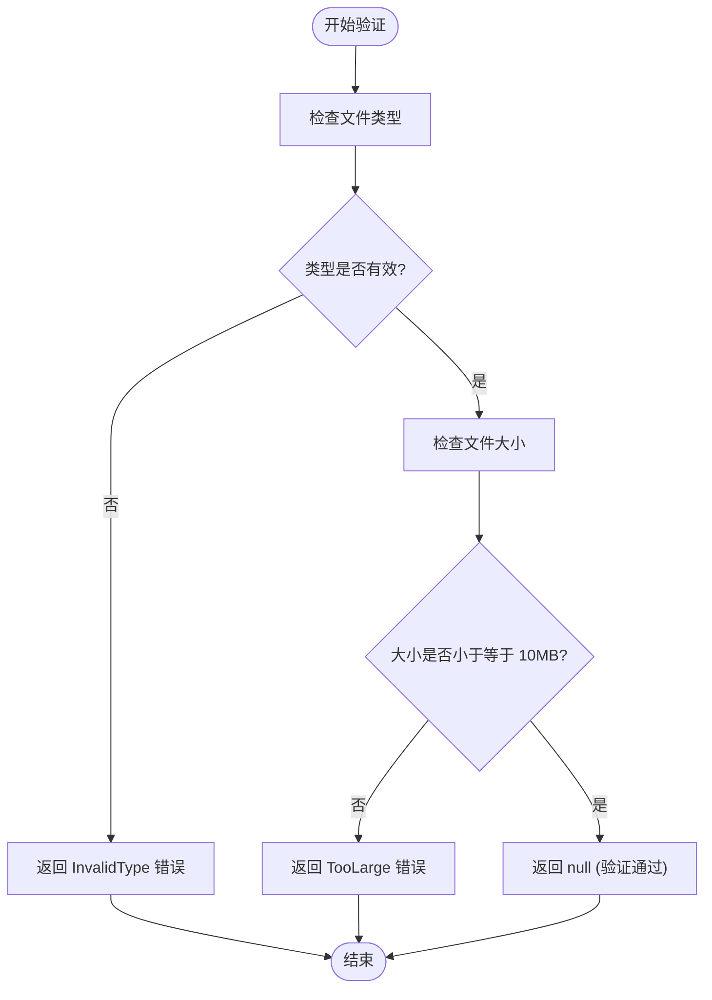
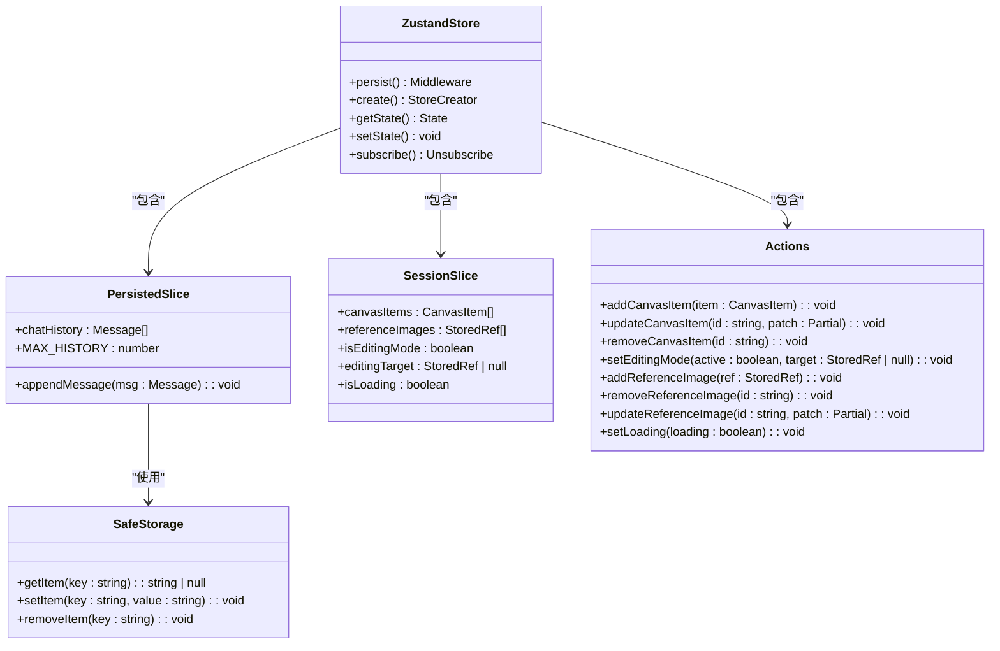
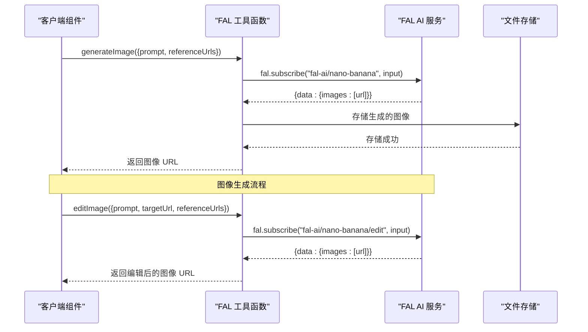

# 工具函数库

<cite>
**本文档引用的文件**
- [lib/utils.ts](file://lib/utils.ts)
- [lib/validate.ts](file://lib/validate.ts)
- [lib/store.ts](file://lib/store.ts)
- [lib/fal.ts](file://lib/fal.ts)
- [lib/types.ts](file://lib/types.ts)
- [components/chat/ReferenceUploader.tsx](file://components/chat/ReferenceUploader.tsx)
- [components/canvas/CanvasArea.tsx](file://components/canvas/CanvasArea.tsx)
- [components/ui/button.tsx](file://components/ui/button.tsx)
- [components/ui/badge.tsx](file://components/ui/badge.tsx)
- [components/ui/textarea.tsx](file://components/ui/textarea.tsx)
- [components/ui/scroll-area.tsx](file://components/ui/scroll-area.tsx)
- [components/ui/tooltip.tsx](file://components/ui/tooltip.tsx)
- [__tests__/validate.test.ts](file://__tests__/validate.test.ts)
- [__tests__/store.test.ts](file://__tests__/store.test.ts)
- [__tests__/fal.test.ts](file://__tests__/fal.test.ts)
</cite>

## 目录
1. [简介](#简介)
2. [项目结构](#项目结构)
3. [核心组件](#核心组件)
4. [架构概览](#架构概览)
5. [详细组件分析](#详细组件分析)
6. [依赖关系分析](#依赖关系分析)
7. [性能考虑](#性能考虑)
8. [故障排除指南](#故障排除指南)
9. [结论](#结论)
10. [附录](#附录)

## 简介

Loveart 工具函数库是一个专为 Next.js 应用程序设计的通用工具集，主要包含以下几类功能：

- **类名合并工具**：提供简洁的 Tailwind CSS 类名组合功能
- **文件验证工具**：处理图像文件上传的格式和大小验证
- **状态管理工具**：基于 Zustand 的应用状态管理解决方案
- **AI 服务集成**：与 FAL AI 平台的图像生成和编辑服务集成

该工具函数库的设计目标是提供简单易用、类型安全且可扩展的开发体验，同时确保代码的可维护性和可测试性。

## 项目结构

工具函数库位于项目的 `lib` 目录下，采用按功能模块组织的方式：



**图表来源**
- [lib/utils.ts:1-7](file://lib/utils.ts#L1-L7)
- [lib/validate.ts:1-14](file://lib/validate.ts#L1-L14)
- [lib/store.ts:1-119](file://lib/store.ts#L1-L119)
- [lib/fal.ts:1-62](file://lib/fal.ts#L1-L62)

**章节来源**
- [lib/utils.ts:1-7](file://lib/utils.ts#L1-L7)
- [lib/validate.ts:1-14](file://lib/validate.ts#L1-L14)
- [lib/store.ts:1-119](file://lib/store.ts#L1-L119)
- [lib/fal.ts:1-62](file://lib/fal.ts#L1-L62)

## 核心组件

### 类名合并工具 (cn 函数)

`cn` 函数是 Tailwind CSS 类名合并的核心工具，它结合了 `clsx` 和 `twMerge` 的优势，提供智能的类名冲突解决机制。

**函数签名**: `cn(...inputs: ClassValue[]): string`

**参数说明**:
- `...inputs`: 可变数量的类名输入，支持字符串、对象、数组等类型

**返回值**: 合并后的类名字符串

**功能特性**:
- 自动处理重复类名的冲突
- 支持条件类名的应用
- 保持 Tailwind CSS 的原子化设计原则

**使用示例路径**:
- [components/ui/button.tsx](file://components/ui/button.tsx)
- [components/ui/badge.tsx](file://components/ui/badge.tsx)
- [components/ui/textarea.tsx](file://components/ui/textarea.tsx)
- [components/ui/scroll-area.tsx](file://components/ui/scroll-area.tsx)
- [components/ui/tooltip.tsx](file://components/ui/tooltip.tsx)

**章节来源**
- [lib/utils.ts:4-6](file://lib/utils.ts#L4-L6)

### 文件验证工具

文件验证工具提供完整的图像文件上传验证功能，确保只接受指定格式和大小限制的文件。

**验证规则**:
- 支持格式：JPG、PNG、WebP
- 大小限制：不超过 10MB
- 类型检查：严格验证 MIME 类型

**错误枚举**:
- `InvalidType`: "仅支持 JPG/PNG/WebP 格式"
- `TooLarge`: "文件不能超过 10MB"

**函数签名**: `validateFile(file: File): ValidationError | null`

**参数说明**:
- `file`: 要验证的 File 对象

**返回值**: 验证通过返回 `null`，否则返回对应的 `ValidationError` 枚举值

**使用示例路径**:
- [components/chat/ReferenceUploader.tsx](file://components/chat/ReferenceUploader.tsx)
- [components/canvas/CanvasArea.tsx](file://components/canvas/CanvasArea.tsx)

**章节来源**
- [lib/validate.ts:1-14](file://lib/validate.ts#L1-L14)

### 状态管理工具

基于 Zustand 的应用状态管理解决方案，提供全局状态的集中管理和持久化存储。

**状态结构**:
- `chatHistory`: 聊天历史记录（持久化）
- `canvasItems`: 画布项目列表（会话状态）
- `referenceImages`: 参考图像列表（会话状态）
- `isEditingMode`: 编辑模式状态（会话状态）
- `editingTarget`: 当前编辑目标（会话状态）
- `isLoading`: 加载状态（会话状态）

**持久化配置**:
- 存储策略：localStorage
- 存储名称："lovart-storage"
- 持久化范围：仅保存聊天历史记录

**函数签名示例**:
- `addCanvasItem(item: CanvasItem)`: 添加画布项目
- `removeReferenceImage(id: string)`: 删除参考图像
- `appendMessage(msg: Message)`: 追加消息
- `setLoading(loading: boolean)`: 设置加载状态

**使用示例路径**:
- [components/chat/ReferenceUploader.tsx](file://components/chat/ReferenceUploader.tsx)
- [components/chat/MessageHistory.tsx](file://components/chat/MessageHistory.tsx)
- [components/canvas/CanvasArea.tsx](file://components/canvas/CanvasArea.tsx)

**章节来源**
- [lib/store.ts:45-119](file://lib/store.ts#L45-L119)

### AI 服务集成

与 FAL AI 平台的深度集成，提供图像生成和编辑功能。

**支持的服务**:
- 图像生成 (`generateImage`)
- 图像编辑 (`editImage`)
- 文件上传 (`uploadFile`)

**配置信息**:
- 代理地址："/api/fal/proxy"
- 默认输出格式：PNG
- 生成参数：每批 1 张图片
- 编辑参数：自动宽高比、1K 分辨率

**函数签名示例**:
- `generateImage({ prompt, referenceUrls }): Promise<string>`
- `editImage({ prompt, targetUrl, referenceUrls }): Promise<string>`
- `uploadFile(file: File): Promise<string>`

**使用示例路径**:
- [components/chat/ReferenceUploader.tsx](file://components/chat/ReferenceUploader.tsx)
- [components/canvas/CanvasArea.tsx](file://components/canvas/CanvasArea.tsx)

**章节来源**
- [lib/fal.ts:1-62](file://lib/fal.ts#L1-L62)

## 架构概览

工具函数库采用分层架构设计，确保各组件之间的松耦合和高内聚：



**图表来源**
- [lib/utils.ts:1-7](file://lib/utils.ts#L1-L7)
- [lib/validate.ts:1-14](file://lib/validate.ts#L1-L14)
- [lib/store.ts:1-119](file://lib/store.ts#L1-L119)
- [lib/fal.ts:1-62](file://lib/fal.ts#L1-L62)
- [lib/types.ts:1-37](file://lib/types.ts#L1-L37)

## 详细组件分析

### 类名合并工具详细分析

类名合并工具是整个工具函数库中最基础且重要的组件，它解决了 React 中动态类名组合的常见问题。



**图表来源**
- [lib/utils.ts:4-6](file://lib/utils.ts#L4-L6)

**实现特点**:
- 使用 `clsx` 处理条件类名逻辑
- 使用 `twMerge` 解决 Tailwind CSS 类名冲突
- 支持多种输入类型的灵活组合

**最佳实践**:
- 优先使用条件表达式进行动态类名控制
- 避免重复定义相同的样式类
- 结合 Tailwind CSS 的原子化设计原则

**章节来源**
- [lib/utils.ts:1-7](file://lib/utils.ts#L1-L7)

### 文件验证工具详细分析

文件验证工具提供了严格的文件上传安全保障，确保用户只能上传符合要求的图像文件。



**图表来源**
- [lib/validate.ts:9-13](file://lib/validate.ts#L9-L13)

**验证流程**:
1. 首先检查文件 MIME 类型是否在允许列表中
2. 然后检查文件大小是否不超过 10MB 限制
3. 返回相应的验证结果或 null

**边界情况处理**:
- 精确 10MB 边界值被接受（包含）
- 超过 10MB 的文件被拒绝（不包含）
- 不支持的文件类型被拒绝

**章节来源**
- [lib/validate.ts:1-14](file://lib/validate.ts#L1-L14)

### 状态管理工具详细分析

状态管理工具基于 Zustand 提供了完整的应用状态解决方案，包括持久化存储和会话状态管理。



**图表来源**
- [lib/store.ts:7-17](file://lib/store.ts#L7-L17)
- [lib/store.ts:45-119](file://lib/store.ts#L45-L119)

**状态管理策略**:
- 使用 `persist` 中间件实现状态持久化
- 区分持久化状态和会话状态
- 实现状态历史记录的自动截断

**关键特性**:
- 安全的本地存储访问（异常处理）
- 自动的历史记录管理（最多保留 50 条消息）
- 类型安全的状态更新操作

**章节来源**
- [lib/store.ts:1-119](file://lib/store.ts#L1-L119)

### AI 服务集成详细分析

AI 服务集成为应用程序提供了强大的图像生成和编辑能力，通过 FAL AI 平台实现。



**图表来源**
- [lib/fal.ts:21-57](file://lib/fal.ts#L21-L57)

**服务配置**:
- 模型选择：nano-banana（图像生成）和 nano-banana/edit（图像编辑）
- 输出格式：PNG
- 分辨率设置：1K
- 图片数量：每批 1 张

**错误处理**:
- 网络请求失败时的重试机制
- 服务器响应超时的处理
- 存储上传失败的回退方案

**章节来源**
- [lib/fal.ts:1-62](file://lib/fal.ts#L1-L62)

## 依赖关系分析

工具函数库的依赖关系清晰明确，遵循单一职责原则：

```mermaid
graph TB
subgraph "外部依赖"
clsx[clsx]
tailwind_merge[tailwind-merge]
zustand[zustand]
zustand_middleware[zustand/middleware]
fal_ai[@fal-ai/client]
end
subgraph "内部模块"
utils_ts[utils.ts]
validate_ts[validate.ts]
store_ts[store.ts]
fal_ts[fal.ts]
types_ts[types.ts]
end
utils_ts --> clsx
utils_ts --> tailwind_merge
store_ts --> zustand
store_ts --> zustand_middleware
fal_ts --> fal_ai
validate_ts --> types_ts
store_ts --> types_ts
fal_ts --> types_ts
```

**图表来源**
- [lib/utils.ts:1-2](file://lib/utils.ts#L1-L2)
- [lib/store.ts:1-3](file://lib/store.ts#L1-L3)
- [lib/fal.ts:1](file://lib/fal.ts#L1)

**依赖特点**:
- 最小化外部依赖，专注于核心功能
- 类型安全的依赖注入
- 渐进式功能扩展支持

**章节来源**
- [lib/utils.ts:1-2](file://lib/utils.ts#L1-L2)
- [lib/store.ts:1-3](file://lib/store.ts#L1-L3)
- [lib/fal.ts:1](file://lib/fal.ts#L1)

## 性能考虑

工具函数库在设计时充分考虑了性能优化：

### 类名合并优化
- 使用 `twMerge` 避免重复类名导致的样式冲突
- 智能的类名去重算法
- 最小化的 DOM 操作次数

### 状态管理优化
- 基于 Zustand 的轻量级状态管理
- 按需订阅状态更新
- 高效的批量状态更新

### 文件验证优化
- O(1) 时间复杂度的类型检查
- 内存友好的文件大小比较
- 非阻塞的异步验证流程

### AI 服务优化
- 智能的缓存策略
- 并发请求的合理控制
- 错误重试机制的指数退避

## 故障排除指南

### 类名合并问题
**问题症状**: 类名显示异常或样式不生效
**可能原因**:
- 传入了无效的类名参数
- Tailwind CSS 配置问题
- 类名冲突未正确处理

**解决方案**:
- 检查传入的类名参数类型
- 确认 Tailwind CSS 已正确编译
- 使用 `cn` 函数替代手动拼接

### 文件验证失败
**问题症状**: 文件上传被拒绝但无明确错误提示
**可能原因**:
- 文件类型不在允许列表中
- 文件大小超过限制
- 浏览器兼容性问题

**解决方案**:
- 检查文件的 MIME 类型
- 验证文件大小是否符合要求
- 确认浏览器支持 File API

### 状态管理异常
**问题症状**: 状态更新不生效或出现意外行为
**可能原因**:
- 状态更新函数调用错误
- 持久化存储访问失败
- 状态订阅时机不当

**解决方案**:
- 检查状态更新函数的调用方式
- 确认本地存储权限设置
- 使用正确的状态订阅模式

### AI 服务连接问题
**问题症状**: 图像生成或编辑请求失败
**可能原因**:
- 网络连接不稳定
- FAL AI 服务不可用
- 认证配置错误

**解决方案**:
- 检查网络连接状态
- 验证 FAL AI 服务的可用性
- 确认代理配置正确

**章节来源**
- [lib/utils.ts:4-6](file://lib/utils.ts#L4-L6)
- [lib/validate.ts:9-13](file://lib/validate.ts#L9-L13)
- [lib/store.ts:7-17](file://lib/store.ts#L7-L17)
- [lib/fal.ts:3](file://lib/fal.ts#L3)

## 结论

Loveart 工具函数库通过精心设计的模块化架构，为现代 React 应用程序提供了强大而灵活的工具支持。其核心优势包括：

1. **类型安全**: 全面的 TypeScript 支持，确保开发时的类型安全
2. **易于使用**: 简洁的 API 设计，降低学习成本
3. **可扩展性**: 模块化的架构设计，便于功能扩展
4. **性能优化**: 针对性的性能优化策略
5. **测试覆盖**: 完善的单元测试和集成测试

该工具函数库不仅满足了当前项目的需求，还为未来的功能扩展奠定了坚实的基础。通过遵循本文档提供的最佳实践和扩展指南，开发者可以有效地利用这些工具来构建高质量的应用程序。

## 附录

### 扩展方法和自定义工具函数添加指南

#### 添加新的工具函数步骤

1. **创建新文件**: 在 `lib` 目录下创建新的工具函数文件
2. **实现功能**: 编写核心功能实现
3. **添加类型定义**: 确保完整的 TypeScript 类型支持
4. **编写测试**: 创建对应的单元测试
5. **更新导出**: 在 `lib/index.ts` 中导出新功能
6. **文档更新**: 更新相关文档和使用示例

#### 最佳实践建议

- **单一职责**: 每个工具函数应专注于单一功能
- **错误处理**: 实现完善的错误处理和边界情况检查
- **性能考虑**: 优化算法复杂度和内存使用
- **测试驱动**: 先编写测试再实现功能
- **文档齐全**: 提供清晰的使用说明和示例

#### 常见扩展场景

- **新增验证规则**: 扩展文件验证工具以支持更多格式
- **状态管理增强**: 添加新的状态切片或动作
- **AI 服务扩展**: 集成新的 AI 模型或服务
- **UI 工具函数**: 创建更多 React 组件相关的工具函数