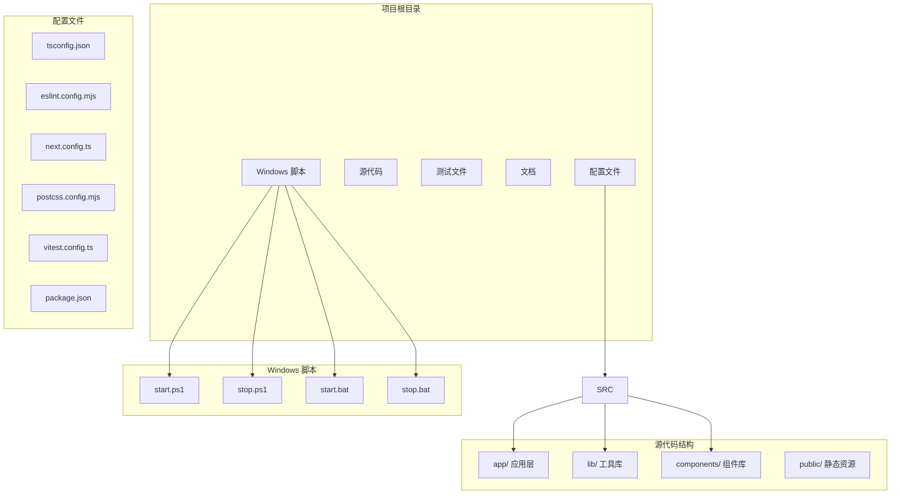
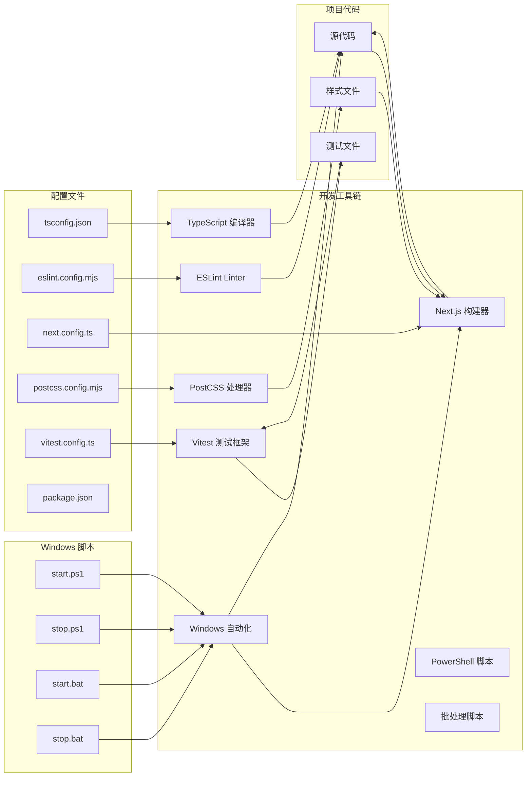
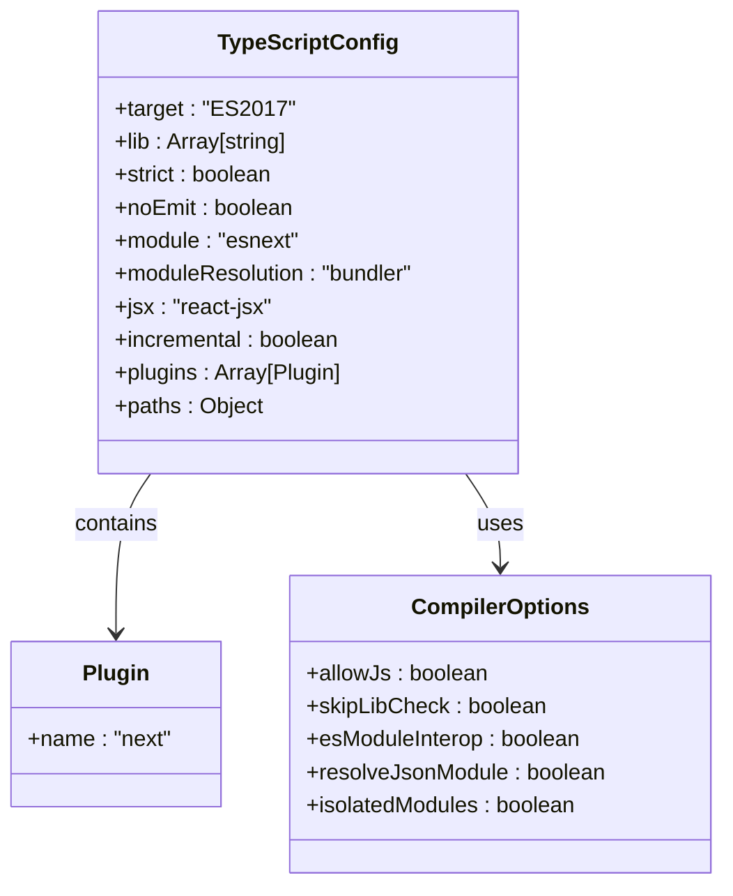
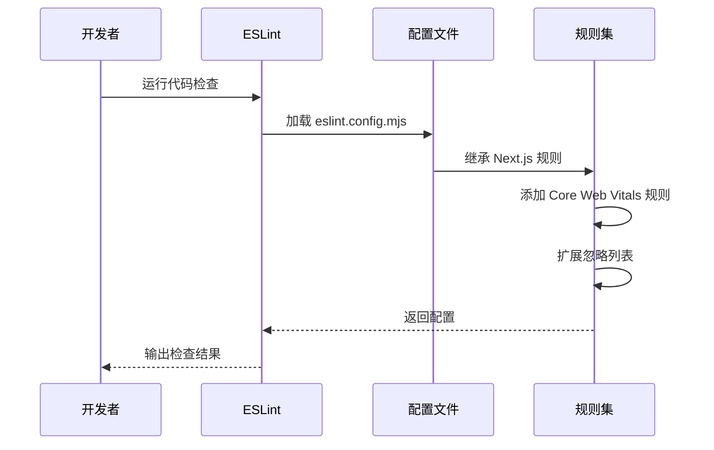
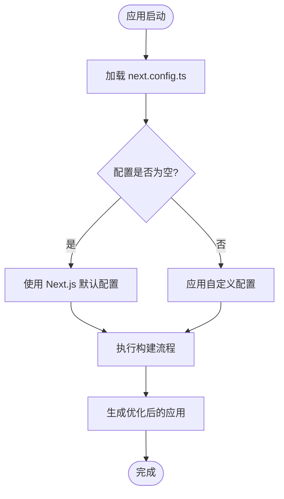
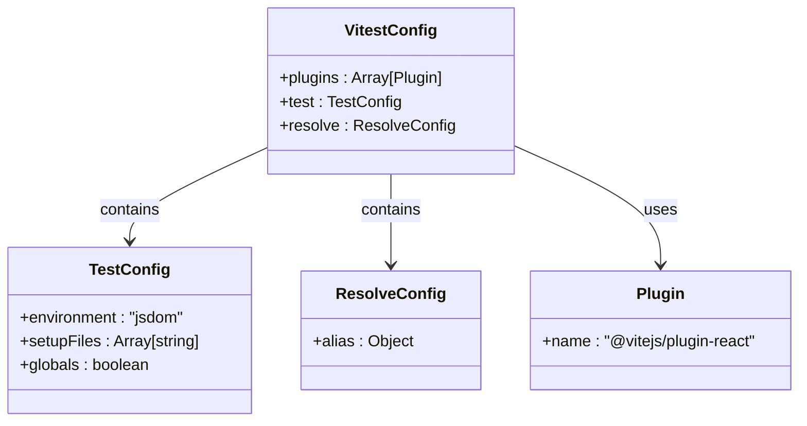
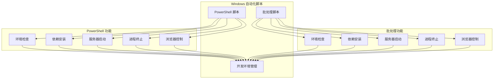
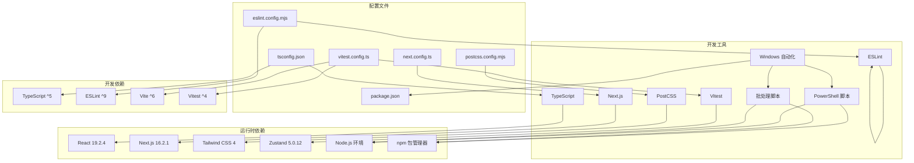

# 开发工具配置

<cite>
**本文档引用的文件**
- [tsconfig.json](file://tsconfig.json)
- [eslint.config.mjs](file://eslint.config.mjs)
- [next.config.ts](file://next.config.ts)
- [postcss.config.mjs](file://postcss.config.mjs)
- [vitest.config.ts](file://vitest.config.ts)
- [package.json](file://package.json)
- [components.json](file://components.json)
- [app/globals.css](file://app/globals.css)
- [app/layout.tsx](file://app/layout.tsx)
- [app/page.tsx](file://app/page.tsx)
- [lib/store.ts](file://lib/store.ts)
- [lib/types.ts](file://lib/types.ts)
- [lib/utils.ts](file://lib/utils.ts)
- [__tests__/setup.ts](file://__tests__/setup.ts)
- [start.ps1](file://start.ps1)
- [stop.ps1](file://stop.ps1)
- [start.bat](file://start.bat)
- [stop.bat](file://stop.bat)
</cite>

## 更新摘要
**变更内容**
- 新增 Windows 开发环境自动化管理脚本章节
- 更新项目结构图以包含启动和停止脚本
- 添加 PowerShell 和批处理脚本的功能分析
- 更新开发工具链架构图以反映新的自动化工具

## 目录
1. [简介](#简介)
2. [项目结构](#项目结构)
3. [核心配置组件](#核心配置组件)
4. [架构概览](#架构概览)
5. [详细组件分析](#详细组件分析)
6. [Windows 开发环境自动化](#windows-开发环境自动化)
7. [依赖关系分析](#依赖关系分析)
8. [性能考虑](#性能考虑)
9. [故障排除指南](#故障排除指南)
10. [结论](#结论)

## 简介

Loveart 是一个基于 Next.js 16 的 AI 驱动创意设计平台，采用现代化的开发工具链配置。本文件详细介绍了项目的开发工具配置，包括 TypeScript 编译配置、ESLint 代码规范、Next.js 构建配置、PostCSS 样式处理配置以及 Windows 开发环境自动化管理脚本。这些配置共同确保了项目的类型安全、代码质量和构建效率，同时为 Windows 用户提供了便捷的开发环境管理工具。

## 项目结构

项目采用标准的 Next.js 16 结构，结合现代前端开发最佳实践和 Windows 开发环境自动化：



**图表来源**
- [tsconfig.json:1-35](file://tsconfig.json#L1-L35)
- [package.json:1-47](file://package.json#L1-L47)
- [start.ps1:1-118](file://start.ps1#L1-L118)
- [stop.ps1:1-74](file://stop.ps1#L1-L74)
- [start.bat:1-105](file://start.bat#L1-L105)
- [stop.bat:1-60](file://stop.bat#L1-L60)

**章节来源**
- [tsconfig.json:1-35](file://tsconfig.json#L1-L35)
- [package.json:1-47](file://package.json#L1-L47)

## 核心配置组件

### TypeScript 编译配置

TypeScript 配置文件提供了严格且高效的编译设置，支持现代 JavaScript 特性和 Next.js 生态系统集成。

**关键特性：**
- **目标兼容性**: ES2017 目标确保与现代浏览器的兼容性
- **模块解析**: 使用 bundler 模块解析器优化打包性能
- **路径映射**: 配置 `@/*` 路径别名简化导入语句
- **插件集成**: 内置 Next.js 类型检查插件
- **增量编译**: 启用增量编译提升开发体验

**章节来源**
- [tsconfig.json:1-35](file://tsconfig.json#L1-L35)

### ESLint 代码规范

ESLint 配置基于 Next.js 官方推荐规则，提供核心 Web 性能指标和 TypeScript 支持。

**配置特点：**
- **规则继承**: 基于 `eslint-config-next` 提供标准化规则集
- **自定义忽略**: 扩展默认忽略列表以适应项目需求
- **性能优先**: 包含 Core Web Vitals 相关规则

**章节来源**
- [eslint.config.mjs:1-19](file://eslint.config.mjs#L1-L19)

### Next.js 构建配置

Next.js 配置文件保持简洁，默认配置即可满足大部分需求，同时预留扩展空间。

**当前状态：**
- **空配置**: 当前配置为空对象，使用 Next.js 默认设置
- **扩展潜力**: 可根据需要添加性能优化、构建定制等配置

**章节来源**
- [next.config.ts:1-8](file://next.config.ts#L1-L8)

### PostCSS 样式处理

PostCSS 配置专注于 Tailwind CSS 集成，提供现代化的样式处理能力。

**配置要点：**
- **Tailwind 集成**: 使用官方 Tailwind CSS 插件
- **CSS 处理**: 支持现代 CSS 特性和变量系统

**章节来源**
- [postcss.config.mjs:1-8](file://postcss.config.mjs#L1-L8)

### 测试配置

Vitest 配置提供完整的单元测试和集成测试支持。

**测试环境：**
- **JS DOM 环境**: 使用 jsdom 进行 DOM 操作测试
- **React 支持**: 集成 @vitejs/plugin-react 插件
- **路径别名**: 配置 `@` 别名指向项目根目录
- **测试设置**: 自动加载测试工具库

**章节来源**
- [vitest.config.ts:1-16](file://vitest.config.ts#L1-L16)

## 架构概览

开发工具链的整体架构展示了各配置文件之间的协作关系，包括新增的 Windows 自动化脚本：



**图表来源**
- [tsconfig.json:1-35](file://tsconfig.json#L1-L35)
- [eslint.config.mjs:1-19](file://eslint.config.mjs#L1-L19)
- [next.config.ts:1-8](file://next.config.ts#L1-L8)
- [postcss.config.mjs:1-8](file://postcss.config.mjs#L1-L8)
- [vitest.config.ts:1-16](file://vitest.config.ts#L1-L16)
- [package.json:1-47](file://package.json#L1-L47)
- [start.ps1:1-118](file://start.ps1#L1-L118)
- [stop.ps1:1-74](file://stop.ps1#L1-L74)
- [start.bat:1-105](file://start.bat#L1-L105)
- [stop.bat:1-60](file://stop.bat#L1-L60)

## 详细组件分析

### TypeScript 配置深度分析

TypeScript 配置体现了现代前端开发的最佳实践：



**图表来源**
- [tsconfig.json:1-35](file://tsconfig.json#L1-L35)

**关键配置项说明：**

1. **编译目标和库支持**
   - ES2017 目标确保现代浏览器兼容性
   - 包含 DOM、DOM Iterable 和 ESNext 库

2. **严格模式配置**
   - 启用严格类型检查
   - 禁止输出编译结果（由 Next.js 处理）
   - 跳过库类型检查提升性能

3. **模块系统**
   - ESNext 模块系统
   - Bundler 模块解析器优化打包
   - React JSX 处理

4. **路径别名**
   - `@/*` 映射到项目根目录
   - 简化相对路径导入

**章节来源**
- [tsconfig.json:1-35](file://tsconfig.json#L1-L35)

### ESLint 配置分析

ESLint 配置基于 Next.js 官方推荐，提供企业级代码质量保证：



**图表来源**
- [eslint.config.mjs:1-19](file://eslint.config.mjs#L1-L19)

**配置流程：**
1. **基础规则继承**: 从 `eslint-config-next` 获取标准规则
2. **性能规则**: 添加 Core Web Vitals 相关检查
3. **自定义忽略**: 扩展默认忽略列表以适应项目结构

**章节来源**
- [eslint.config.mjs:1-19](file://eslint.config.mjs#L1-L19)

### Next.js 配置分析

Next.js 配置保持极简设计，充分利用默认优化：



**图表来源**
- [next.config.ts:1-8](file://next.config.ts#L1-L8)

**当前配置状态：**
- 配置文件为空，完全依赖 Next.js 默认设置
- 保留扩展空间用于未来性能优化

**章节来源**
- [next.config.ts:1-8](file://next.config.ts#L1-L8)

### PostCSS 配置分析

PostCSS 配置专注于 Tailwind CSS 集成，提供现代化样式处理：

```mermaid
graph TB
subgraph "样式处理流程"
CSS[原始 CSS 文件]
IMPORT[@import 规则]
TAILWIND[Tailwind CSS]
THEME[主题变量]
OUTPUT[最终样式]
end
CSS --> IMPORT
IMPORT --> TAILWIND
TAILWIND --> THEME
THEME --> OUTPUT
subgraph "配置组件"
CONFIG[postcss.config.mjs]
COMPONENTS[components.json]
GLOBALS[app/globals.css]
end
CONFIG --> TAILWIND
COMPONENTS --> GLOBALS
GLOBALS --> THEME
```

**图表来源**
- [postcss.config.mjs:1-8](file://postcss.config.mjs#L1-L8)
- [components.json:1-26](file://components.json#L1-L26)
- [app/globals.css:1-128](file://app/globals.css#L1-L128)

**配置组件：**
1. **Tailwind 集成**: 使用官方 PostCSS 插件
2. **主题系统**: 支持 CSS 变量和暗色模式
3. **动画支持**: 集成 tw-animate-css 动画库

**章节来源**
- [postcss.config.mjs:1-8](file://postcss.config.mjs#L1-L8)
- [components.json:1-26](file://components.json#L1-L26)
- [app/globals.css:1-128](file://app/globals.css#L1-L128)

### 测试配置分析

Vitest 配置提供完整的测试基础设施：



**图表来源**
- [vitest.config.ts:1-16](file://vitest.config.ts#L1-L16)

**测试环境配置：**
- **JS DOM 环境**: 模拟浏览器 DOM 环境
- **React 插件**: 支持 JSX 和 React 组件测试
- **路径别名**: `@` 指向项目根目录
- **全局设置**: 自动加载测试工具库

**章节来源**
- [vitest.config.ts:1-16](file://vitest.config.ts#L1-L16)

## Windows 开发环境自动化

### PowerShell 脚本功能分析

项目提供了完整的 PowerShell 开发环境自动化脚本，为 Windows 用户提供便捷的开发体验。

#### start.ps1 脚本功能

**主要功能：**
1. **环境检查**: 自动检测 Node.js 和 npm 是否已安装
2. **依赖管理**: 检查 node_modules 目录和关键依赖，必要时自动执行 `npm install`
3. **开发服务器启动**: 启动 Next.js 开发服务器并自动打开浏览器
4. **用户体验优化**: 提供彩色输出和进度提示

**技术实现：**
- 使用 `[Console]::OutputEncoding` 设置 UTF-8 编码
- 通过 `Get-NetTCPConnection` 查找占用 3000 端口的进程
- 使用 `Start-Job` 异步启动浏览器
- 错误处理和用户交互优化

**章节来源**
- [start.ps1:1-118](file://start.ps1#L1-L118)

#### stop.ps1 脚本功能

**主要功能：**
1. **进程查找**: 使用 `Get-NetTCPConnection` 查找占用 3000 端口的进程
2. **进程终止**: 终止找到的开发服务器进程
3. **批量处理**: 支持多个进程的查找和终止
4. **错误处理**: 提供详细的错误信息和用户反馈

**技术实现：**
- 使用 `Select-Object -Unique` 去重处理多个连接
- 通过 `Stop-Process -Force` 强制终止进程
- 错误处理和异常捕获机制

**章节来源**
- [stop.ps1:1-74](file://stop.ps1#L1-L74)

### 批处理脚本功能分析

#### start.bat 脚本功能

**主要功能：**
1. **环境检查**: 使用 `where` 命令检查 Node.js 和 npm
2. **依赖管理**: 检查 node_modules 目录和关键依赖
3. **开发服务器启动**: 启动 Next.js 开发服务器
4. **浏览器自动打开**: 使用 `start http://localhost:3000` 打开浏览器

**技术实现：**
- 使用 `chcp 65001` 设置 UTF-8 编码
- 通过 `call` 命令执行 npm install
- 使用 `timeout` 命令延迟启动浏览器
- 完整的错误处理和用户提示

**章节来源**
- [start.bat:1-105](file://start.bat#L1-L105)

#### stop.bat 脚本功能

**主要功能：**
1. **进程查找**: 使用 `netstat -ano` 和 `tasklist` 查找进程
2. **进程终止**: 使用 `taskkill /PID` 终止进程
3. **批量处理**: 支持多个进程的查找和终止
4. **用户反馈**: 提供详细的执行结果信息

**技术实现：**
- 使用 `findstr` 过滤特定端口的连接
- 通过 `for /f` 循环处理查找结果
- 使用 `taskkill /F` 强制终止进程

**章节来源**
- [stop.bat:1-60](file://stop.bat#L1-L60)

### 脚本架构对比



**图表来源**
- [start.ps1:1-118](file://start.ps1#L1-L118)
- [stop.ps1:1-74](file://stop.ps1#L1-L74)
- [start.bat:1-105](file://start.bat#L1-L105)
- [stop.bat:1-60](file://stop.bat#L1-L60)

## 依赖关系分析

开发工具配置之间的依赖关系展现了完整的开发工具链，包括新增的 Windows 自动化脚本：



**图表来源**
- [package.json:1-47](file://package.json#L1-L47)
- [tsconfig.json:1-35](file://tsconfig.json#L1-L35)
- [eslint.config.mjs:1-19](file://eslint.config.mjs#L1-L19)
- [vitest.config.ts:1-16](file://vitest.config.ts#L1-L16)
- [start.ps1:1-118](file://start.ps1#L1-L118)
- [stop.ps1:1-74](file://stop.ps1#L1-L74)
- [start.bat:1-105](file://start.bat#L1-L105)
- [stop.bat:1-60](file://stop.bat#L1-L60)

**关键依赖关系：**
- **TypeScript** 依赖于 React 和 Next.js 运行时
- **ESLint** 依赖于 TypeScript 类型检查
- **Vitest** 依赖于 React 和测试工具库
- **PostCSS** 依赖于 Tailwind CSS 和 shadcn 组件库
- **Windows 脚本** 依赖于 Node.js 和 npm 环境
- **PowerShell 脚本** 提供高级 Windows 功能
- **批处理脚本** 提供跨平台兼容性

**章节来源**
- [package.json:1-47](file://package.json#L1-L47)

## 性能考虑

### 编译性能优化

1. **增量编译**
   - 启用 `incremental` 选项提升 TypeScript 编译速度
   - 减少重复编译时间，特别是在大型项目中

2. **模块解析优化**
   - 使用 `bundler` 模块解析器提升打包效率
   - 避免不必要的模块搜索路径

3. **类型检查优化**
   - `skipLibCheck` 跳过库文件类型检查
   - `isolatedModules` 支持快速模块编译

### 构建性能优化

1. **Next.js 默认优化**
   - 当前空配置允许 Next.js 使用最优默认设置
   - 可在需要时添加性能相关配置

2. **样式处理优化**
   - Tailwind CSS 的原子化特性减少 CSS 体积
   - CSS 变量系统提升主题切换性能

### 测试性能优化

1. **测试环境优化**
   - JS DOM 环境模拟真实浏览器行为
   - 全局测试设置减少重复配置

2. **路径别名优化**
   - `@` 别名简化导入路径
   - 减少模块解析时间

### Windows 脚本性能优化

1. **异步处理**
   - PowerShell 脚本使用 `Start-Job` 异步启动浏览器
   - 批处理脚本使用 `start /b` 后台启动

2. **进程管理**
   - PowerShell 使用 `Get-NetTCPConnection` 高效查找进程
   - 批处理使用 `netstat` 和 `tasklist` 组合查找

3. **错误处理优化**
   - 完善的异常捕获和错误恢复机制
   - 用户友好的错误信息和提示

## 故障排除指南

### TypeScript 相关问题

**问题：类型检查失败**
- 检查 `skipLibCheck` 设置
- 验证 `moduleResolution` 配置
- 确认 `paths` 别名配置正确

**问题：增量编译不生效**
- 确认 `incremental` 选项启用
- 检查 TypeScript 版本兼容性

### ESLint 相关问题

**问题：规则冲突**
- 检查 `eslint-config-next` 版本匹配
- 验证自定义忽略规则配置
- 确认 Core Web Vitals 规则适用性

**问题：性能问题**
- 调整 `globalIgnores` 忽略列表
- 优化规则继承配置

### Next.js 相关问题

**问题：构建失败**
- 检查默认配置兼容性
- 验证第三方依赖版本

**问题：性能问题**
- 考虑添加自定义性能配置
- 优化静态资源处理

### PostCSS 相关问题

**问题：样式未生效**
- 检查 Tailwind CSS 插件配置
- 验证 CSS 导入顺序
- 确认主题变量定义

**问题：构建错误**
- 检查 PostCSS 插件版本
- 验证 CSS 语法正确性

### 测试相关问题

**问题：测试环境错误**
- 检查 jsdom 版本兼容性
- 验证 setupFiles 路径
- 确认 React 插件配置

**问题：测试性能问题**
- 优化测试文件组织
- 调整测试环境配置

### Windows 脚本相关问题

**PowerShell 脚本问题：**
- **权限问题**: 确保 PowerShell 执行策略允许运行脚本
- **编码问题**: 检查 UTF-8 编码设置
- **进程查找失败**: 验证管理员权限
- **浏览器启动问题**: 检查默认浏览器设置

**批处理脚本问题：**
- **编码问题**: 确保文件保存为 UTF-8 编码
- **路径问题**: 验证脚本路径和工作目录
- **依赖检查失败**: 检查 npm 和 node_modules 目录
- **端口占用**: 验证 3000 端口可用性

**通用问题：**
- **网络连接**: 确保 npm install 能够访问外部仓库
- **磁盘空间**: 检查 node_modules 目录大小
- **防火墙设置**: 验证开发服务器端口访问权限

## 结论

Loveart 项目的开发工具配置展现了现代前端开发的最佳实践，现已扩展为包含 Windows 开发环境自动化的完整工具链。通过精心设计的 TypeScript、ESLint、Next.js、PostCSS 配置以及新增的 PowerShell 和批处理脚本，项目实现了：

1. **类型安全**: 严格的 TypeScript 配置确保代码质量
2. **代码规范**: ESLint 提供统一的代码风格标准
3. **构建效率**: Next.js 默认优化提供高性能构建
4. **样式管理**: PostCSS 和 Tailwind CSS 实现现代化样式处理
5. **测试覆盖**: Vitest 提供完整的测试基础设施
6. **Windows 优化**: PowerShell 和批处理脚本提供便捷的开发环境管理

**新增的 Windows 自动化功能特别优势：**
- **PowerShell 脚本**: 提供高级功能和更好的错误处理
- **批处理脚本**: 确保跨平台兼容性和简单易用性
- **环境自动化**: 自动检查和安装依赖，简化开发环境搭建
- **进程管理**: 智能查找和终止开发服务器进程

这些配置为开发者提供了稳定、高效且可扩展的开发环境，支持从原型开发到生产部署的完整工作流程。随着项目的发展，可以在现有配置基础上进行针对性优化，进一步提升开发体验和应用性能。Windows 用户现在可以享受到与 Linux/macOS 用户同等的开发便利性，通过简单的双击操作即可启动和停止开发服务器。