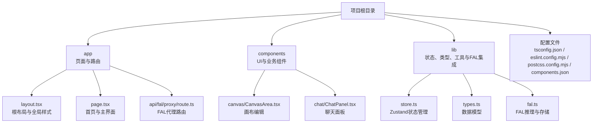
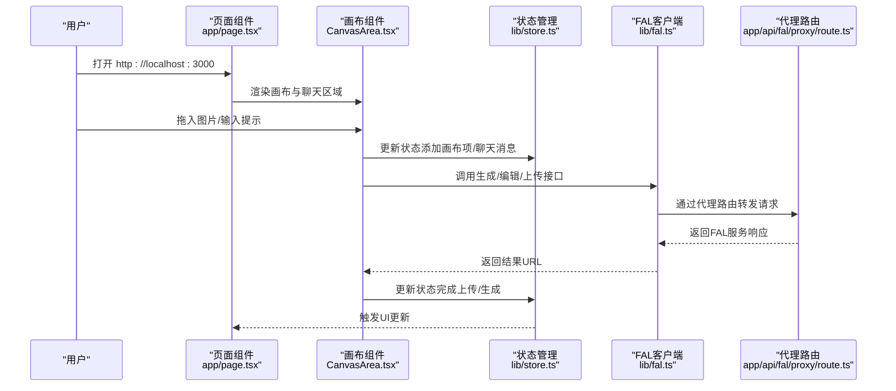
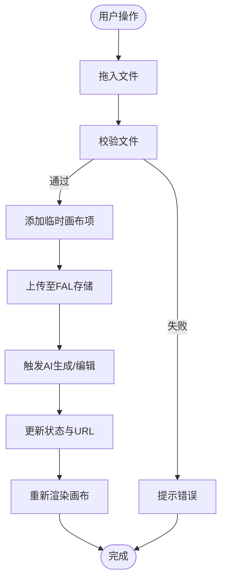
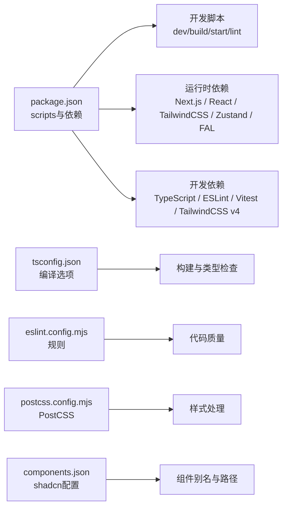

# 快速开始

<cite>
**本文引用的文件**
- [package.json](file://package.json)
- [README.md](file://README.md)
- [next.config.ts](file://next.config.ts)
- [tsconfig.json](file://tsconfig.json)
- [app/layout.tsx](file://app/layout.tsx)
- [app/page.tsx](file://app/page.tsx)
- [components.json](file://components.json)
- [postcss.config.mjs](file://postcss.config.mjs)
- [eslint.config.mjs](file://eslint.config.mjs)
- [lib/store.ts](file://lib/store.ts)
- [lib/types.ts](file://lib/types.ts)
- [components/canvas/CanvasArea.tsx](file://components/canvas/CanvasArea.tsx)
- [components/chat/ChatPanel.tsx](file://components/chat/ChatPanel.tsx)
- [lib/fal.ts](file://lib/fal.ts)
- [app/api/fal/proxy/route.ts](file://app/api/fal/proxy/route.ts)
</cite>

## 目录
1. [简介](#简介)
2. [项目结构](#项目结构)
3. [核心组件](#核心组件)
4. [架构总览](#架构总览)
5. [详细组件分析](#详细组件分析)
6. [依赖分析](#依赖分析)
7. [性能考虑](#性能考虑)
8. [故障排除指南](#故障排除指南)
9. [结论](#结论)
10. [附录](#附录)

## 简介
本指南面向首次接触 Loveart 项目的开发者，帮助你在最短时间内完成环境准备、项目克隆、依赖安装与开发服务器启动，并理解项目的基本结构与运行方式。项目基于 Next.js 构建，采用 TypeScript、TailwindCSS 与 shadcn/ui 组件体系，集成了 FAL AI 推理与存储能力，支持画布编辑与 AI 聊天交互。

## 项目结构
项目采用 Next.js App Router 的目录组织方式，核心目录与职责如下：
- app：页面与路由入口，包含布局、全局样式与页面组件
- components：可复用 UI 组件与业务组件（如画布与聊天）
- lib：状态管理、类型定义、工具函数与 FAL 集成逻辑
- 其他根级配置：TypeScript、ESLint、PostCSS、TailwindCSS 等

图表来源
- [app/layout.tsx:1-38](file://app/layout.tsx#L1-L38)
- [app/page.tsx:1-59](file://app/page.tsx#L1-L59)
- [components/canvas/CanvasArea.tsx:1-431](file://components/canvas/CanvasArea.tsx#L1-L431)
- [components/chat/ChatPanel.tsx:1-22](file://components/chat/ChatPanel.tsx#L1-L22)
- [lib/store.ts:1-119](file://lib/store.ts#L1-L119)
- [lib/types.ts:1-37](file://lib/types.ts#L1-L37)
- [lib/fal.ts:1-62](file://lib/fal.ts#L1-L62)
- [app/api/fal/proxy/route.ts:1-4](file://app/api/fal/proxy/route.ts#L1-L4)

章节来源
- [package.json:1-48](file://package.json#L1-L48)
- [tsconfig.json:1-35](file://tsconfig.json#L1-L35)
- [eslint.config.mjs:1-19](file://eslint.config.mjs#L1-L19)
- [postcss.config.mjs:1-8](file://postcss.config.mjs#L1-L8)
- [components.json:1-26](file://components.json#L1-L26)

## 核心组件
- 根布局与全局样式：负责注入字体、主题与全局通知组件
- 首页页面：移动端与桌面端不同的布局策略，左侧画布、右侧聊天
- 画布组件：基于 Konva/Konva 的交互式画布，支持拖拽、缩放、变换与下载
- 聊天组件：消息历史、参考图上传与文本输入
- 状态管理：Zustand 管理画布元素、参考图、聊天历史与加载状态
- 类型系统：统一的数据模型（CanvasItem、Message、StoredRef）
- FAL 集成：图像生成、编辑与文件上传，通过 Next.js API 路由代理

章节来源
- [app/layout.tsx:1-38](file://app/layout.tsx#L1-L38)
- [app/page.tsx:1-59](file://app/page.tsx#L1-L59)
- [components/canvas/CanvasArea.tsx:1-431](file://components/canvas/CanvasArea.tsx#L1-L431)
- [components/chat/ChatPanel.tsx:1-22](file://components/chat/ChatPanel.tsx#L1-L22)
- [lib/store.ts:1-119](file://lib/store.ts#L1-L119)
- [lib/types.ts:1-37](file://lib/types.ts#L1-L37)
- [lib/fal.ts:1-62](file://lib/fal.ts#L1-L62)

## 架构总览
下图展示了从浏览器到后端服务的关键调用链路，重点体现 FAL 代理路由与前端状态管理的协作。

图表来源
- [app/page.tsx:1-59](file://app/page.tsx#L1-L59)
- [components/canvas/CanvasArea.tsx:1-431](file://components/canvas/CanvasArea.tsx#L1-L431)
- [lib/store.ts:1-119](file://lib/store.ts#L1-L119)
- [lib/fal.ts:1-62](file://lib/fal.ts#L1-L62)
- [app/api/fal/proxy/route.ts:1-4](file://app/api/fal/proxy/route.ts#L1-L4)

## 详细组件分析

### 页面与布局
- 根布局负责注入字体变量、全局样式与通知组件，设置站点元数据
- 首页根据屏幕尺寸采用不同布局：桌面端为左右分栏，移动端为画布在上、聊天抽屉在下

章节来源
- [app/layout.tsx:1-38](file://app/layout.tsx#L1-L38)
- [app/page.tsx:1-59](file://app/page.tsx#L1-L59)

### 画布组件（CanvasArea）
- 支持拖拽文件进入、自动缩放、中键平移、滚轮缩放、选中与变换
- 使用 Zustand 管理画布元素，结合 FAL 完成上传与生成流程
- 提供下载与清空功能；无内容时显示引导占位

图表来源
- [components/canvas/CanvasArea.tsx:294-340](file://components/canvas/CanvasArea.tsx#L294-L340)
- [lib/fal.ts:59-62](file://lib/fal.ts#L59-L62)
- [lib/store.ts:58-100](file://lib/store.ts#L58-L100)

章节来源
- [components/canvas/CanvasArea.tsx:1-431](file://components/canvas/CanvasArea.tsx#L1-L431)
- [lib/store.ts:1-119](file://lib/store.ts#L1-L119)
- [lib/fal.ts:1-62](file://lib/fal.ts#L1-L62)

### 聊天组件（ChatPanel）
- 包含消息历史、参考图上传与文本输入
- 在移动设备上作为底部抽屉展示，支持展开/收起

章节来源
- [components/chat/ChatPanel.tsx:1-22](file://components/chat/ChatPanel.tsx#L1-L22)

### 状态管理（Zustand）
- 分片持久化：仅持久化聊天历史，会话状态（如画布元素）不持久
- 提供增删改查与编辑模式切换等动作
- 本地存储安全封装：异常时静默失败，避免阻断应用

章节来源
- [lib/store.ts:1-119](file://lib/store.ts#L1-L119)
- [lib/types.ts:1-37](file://lib/types.ts#L1-L37)

### FAL 集成
- 通过代理路由隐藏密钥与实现跨域
- 封装生成、编辑与上传接口，返回可用的图片URL

章节来源
- [lib/fal.ts:1-62](file://lib/fal.ts#L1-L62)
- [app/api/fal/proxy/route.ts:1-4](file://app/api/fal/proxy/route.ts#L1-L4)

## 依赖分析
- 运行时依赖：Next.js、React、TailwindCSS、shadcn/ui、Konva、Zustand、Sonner、@fal-ai/* 等
- 开发依赖：TypeScript、ESLint、TailwindCSS v4、Vitest、测试库等
- 构建与运行脚本：dev/build/start/lint

图表来源
- [package.json:1-48](file://package.json#L1-L48)
- [tsconfig.json:1-35](file://tsconfig.json#L1-L35)
- [eslint.config.mjs:1-19](file://eslint.config.mjs#L1-L19)
- [postcss.config.mjs:1-8](file://postcss.config.mjs#L1-L8)
- [components.json:1-26](file://components.json#L1-L26)

章节来源
- [package.json:1-48](file://package.json#L1-L48)
- [tsconfig.json:1-35](file://tsconfig.json#L1-L35)
- [eslint.config.mjs:1-19](file://eslint.config.mjs#L1-L19)
- [postcss.config.mjs:1-8](file://postcss.config.mjs#L1-L8)
- [components.json:1-26](file://components.json#L1-L26)

## 性能考虑
- 画布渲染优化：使用 requestAnimationFrame 实现占位动画，Konva 变换后批量绘制
- 自适应缩放：首次加载时按最大宽度计算缩放比例，避免过大元素影响性能
- 事件节流：滚动缩放与拖拽平移采用原生事件，减少不必要的重绘
- 状态持久化：仅持久化必要数据，降低本地存储压力

章节来源
- [components/canvas/CanvasArea.tsx:17-67](file://components/canvas/CanvasArea.tsx#L17-L67)
- [components/canvas/CanvasArea.tsx:85-102](file://components/canvas/CanvasArea.tsx#L85-L102)
- [components/canvas/CanvasArea.tsx:238-251](file://components/canvas/CanvasArea.tsx#L238-L251)
- [lib/store.ts:102-118](file://lib/store.ts#L102-L118)

## 故障排除指南
- 启动失败（端口占用）
  - 现象：无法启动开发服务器
  - 处理：更换端口或结束占用进程
  - 参考：Next.js 默认端口配置
- 依赖安装失败（网络/权限）
  - 现象：安装过程中断或报错
  - 处理：使用稳定镜像源或代理；以管理员权限运行；清理缓存后重试
  - 参考：包管理器选择与缓存清理
- FAL 相关错误
  - 现象：上传/生成失败，弹出错误提示
  - 处理：检查 FAL_KEY 是否正确配置；确认代理路由已启用；查看控制台网络面板
  - 参考：FAL 代理路由与客户端配置
- 浏览器兼容性
  - 现象：部分特性不可用
  - 处理：确保使用现代浏览器；关注 TypeScript 编译目标
  - 参考：tsconfig 中的 target 与模块解析

章节来源
- [README.md:1-37](file://README.md#L1-L37)
- [lib/fal.ts:1-62](file://lib/fal.ts#L1-L62)
- [app/api/fal/proxy/route.ts:1-4](file://app/api/fal/proxy/route.ts#L1-L4)
- [tsconfig.json:1-35](file://tsconfig.json#L1-L35)

## 结论
通过本指南，你可以在本地快速搭建并运行 Loveart 项目。建议先完成环境准备与依赖安装，再启动开发服务器进行验证。后续可深入学习画布交互、聊天集成与状态管理机制，逐步扩展功能。

## 附录

### 环境要求与安装步骤
- Node.js 版本
  - 项目使用 Next.js 16 与 TypeScript，建议使用长期支持版本（如 18 或 20）
  - TypeScript 目标为 ES2017，确保与现代浏览器兼容
- 包管理器选择
  - 支持 npm、yarn、pnpm、bun；任选其一即可
- 克隆与安装
  - 克隆仓库后，在项目根目录执行依赖安装命令
- 启动开发服务器
  - 执行开发脚本，浏览器打开 http://localhost:3000 即可访问

章节来源
- [README.md:1-37](file://README.md#L1-L37)
- [package.json:1-48](file://package.json#L1-L48)
- [tsconfig.json:1-35](file://tsconfig.json#L1-L35)

### 项目启动后的访问方式
- 访问地址：http://localhost:3000
- 功能概览：左侧为画布编辑区，右侧为聊天交互区；移动端以抽屉形式呈现

章节来源
- [README.md:17-17](file://README.md#L17-L17)
- [app/page.tsx:1-59](file://app/page.tsx#L1-L59)