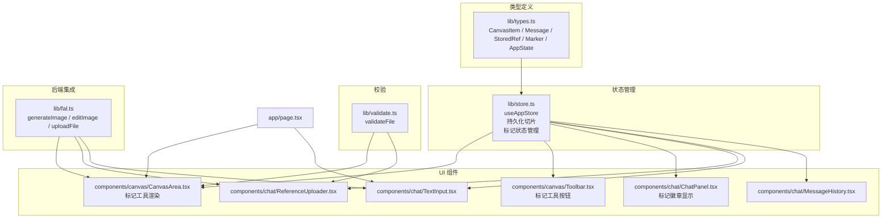
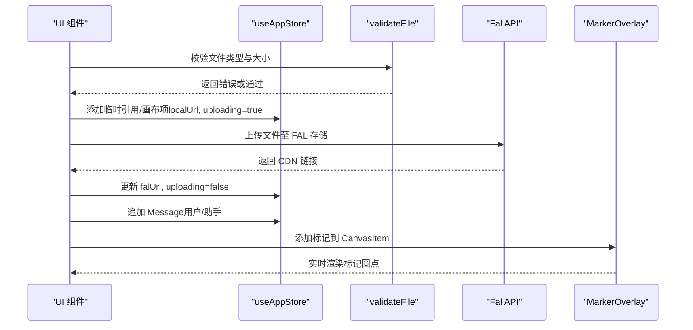
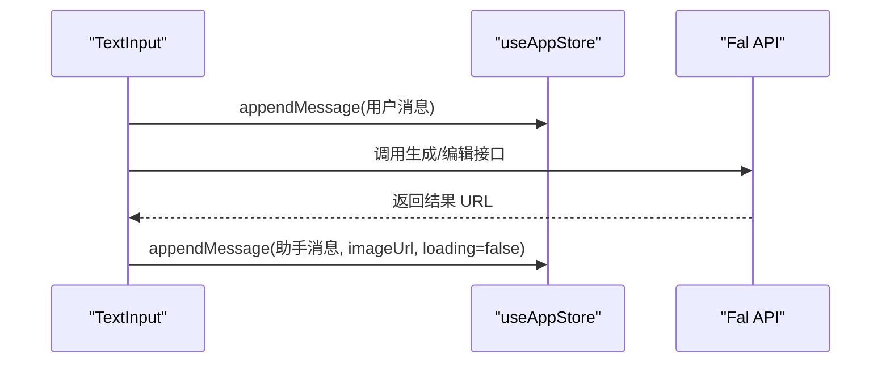
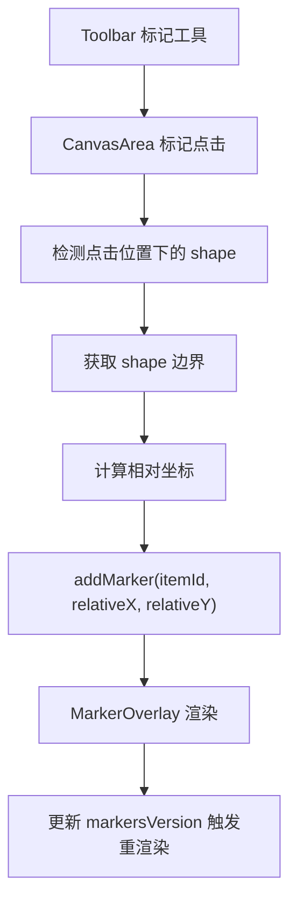
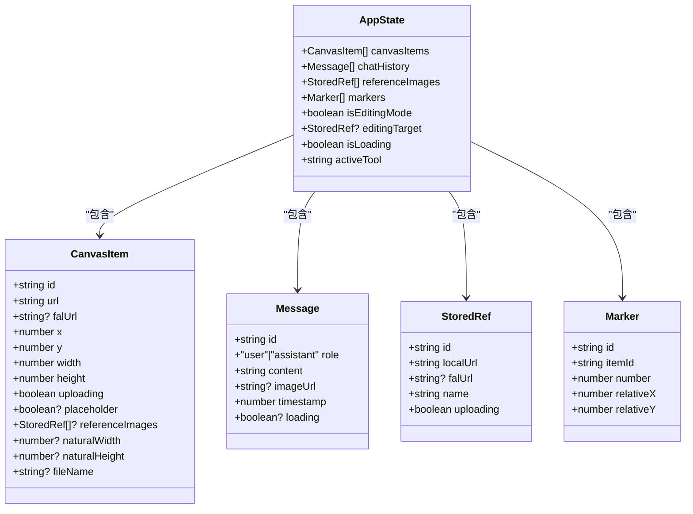
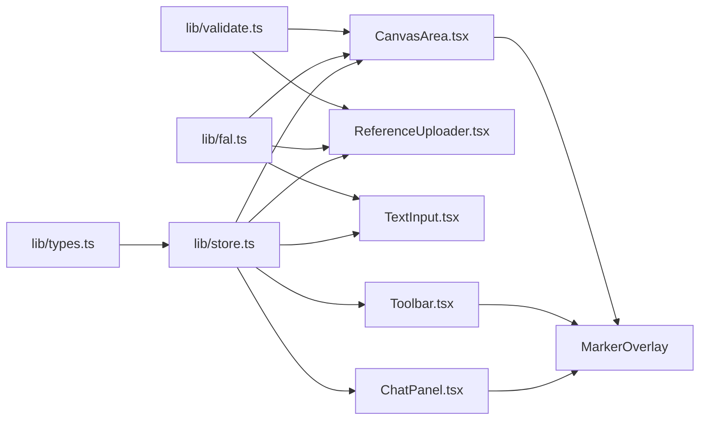

# 数据模型

<cite>
**本文引用的文件**
- [lib/types.ts](file://lib/types.ts)
- [lib/store.ts](file://lib/store.ts)
- [lib/validate.ts](file://lib/validate.ts)
- [lib/fal.ts](file://lib/fal.ts)
- [components/canvas/CanvasArea.tsx](file://components/canvas/CanvasArea.tsx)
- [components/canvas/Toolbar.tsx](file://components/canvas/Toolbar.tsx)
- [components/chat/ChatPanel.tsx](file://components/chat/ChatPanel.tsx)
- [components/chat/ReferenceUploader.tsx](file://components/chat/ReferenceUploader.tsx)
- [components/chat/TextInput.tsx](file://components/chat/TextInput.tsx)
- [components/chat/MessageHistory.tsx](file://components/chat/MessageHistory.tsx)
- [app/page.tsx](file://app/page.tsx)
- [__tests__/validate.test.ts](file://__tests__/validate.test.ts)
- [__tests__/store.test.ts](file://__tests__/store.test.ts)
</cite>

## 更新摘要
**变更内容**
- 新增Marker类型定义，支持标记系统所需的数据结构
- 扩展CanvasItem接口以支持新的注释和标记功能
- 在AppState中增加markers字段管理标记状态
- 在useAppStore中实现完整的标记状态管理API
- 在CanvasArea组件中实现标记工具的渲染和交互逻辑

## 目录
1. [简介](#简介)
2. [项目结构](#项目结构)
3. [核心组件](#核心组件)
4. [架构总览](#架构总览)
5. [详细组件分析](#详细组件分析)
6. [依赖分析](#依赖分析)
7. [性能考虑](#性能考虑)
8. [故障排除指南](#故障排除指南)
9. [结论](#结论)
10. [附录](#附录)

## 简介
本文件系统性梳理 Loveart 的核心数据模型与状态管理，重点覆盖以下数据类型：
- CanvasItem：画布元素，承载图片显示、上传状态、位置与尺寸信息，现支持标记功能
- Message：聊天消息，记录用户与 AI 的对话历史及结果图片链接
- StoredRef：参考图片，用于编辑时作为风格或内容参考
- Marker：标记系统，支持在画布元素上添加注释标记
- AppState：应用状态，聚合画布、聊天、参考图片和标记等全局状态，并提供编辑模式与加载状态

同时，文档解释各数据类型之间的关系、业务规则、序列化/反序列化策略、验证规则与类型安全保障，并给出常见使用场景与最佳实践。

## 项目结构
数据模型主要分布在以下模块：
- 类型定义：lib/types.ts
- 全局状态：lib/store.ts（Zustand + 持久化）
- 文件校验：lib/validate.ts
- 后端集成：lib/fal.ts（图像生成/编辑/上传）
- UI 使用：components/canvas/CanvasArea.tsx、components/canvas/Toolbar.tsx、components/chat/ChatPanel.tsx、components/chat/ReferenceUploader.tsx、components/chat/TextInput.tsx、components/chat/MessageHistory.tsx
- 页面布局：app/page.tsx

**图表来源**
- [lib/types.ts:1-49](file://lib/types.ts#L1-L49)
- [lib/store.ts:1-378](file://lib/store.ts#L1-L378)
- [lib/validate.ts:1-14](file://lib/validate.ts#L1-L14)
- [lib/fal.ts:1-62](file://lib/fal.ts#L1-L62)
- [components/canvas/CanvasArea.tsx:1-1621](file://components/canvas/CanvasArea.tsx#L1-L1621)
- [components/canvas/Toolbar.tsx:1-668](file://components/canvas/Toolbar.tsx#L1-L668)
- [components/chat/ChatPanel.tsx:1-200](file://components/chat/ChatPanel.tsx#L1-L200)
- [components/chat/ReferenceUploader.tsx:1-100](file://components/chat/ReferenceUploader.tsx#L1-L100)
- [components/chat/TextInput.tsx:1-140](file://components/chat/TextInput.tsx#L1-L140)
- [components/chat/MessageHistory.tsx:1-37](file://components/chat/MessageHistory.tsx#L1-L37)
- [app/page.tsx:1-59](file://app/page.tsx#L1-L59)

**章节来源**
- [lib/types.ts:1-49](file://lib/types.ts#L1-L49)
- [lib/store.ts:1-378](file://lib/store.ts#L1-L378)
- [lib/validate.ts:1-14](file://lib/validate.ts#L1-L14)
- [lib/fal.ts:1-62](file://lib/fal.ts#L1-L62)
- [components/canvas/CanvasArea.tsx:1-1621](file://components/canvas/CanvasArea.tsx#L1-L1621)
- [components/canvas/Toolbar.tsx:1-668](file://components/canvas/Toolbar.tsx#L1-L668)
- [components/chat/ChatPanel.tsx:1-200](file://components/chat/ChatPanel.tsx#L1-L200)
- [components/chat/ReferenceUploader.tsx:1-100](file://components/chat/ReferenceUploader.tsx#L1-L100)
- [components/chat/TextInput.tsx:1-140](file://components/chat/TextInput.tsx#L1-L140)
- [components/chat/MessageHistory.tsx:1-37](file://components/chat/MessageHistory.tsx#L1-L37)
- [app/page.tsx:1-59](file://app/page.tsx#L1-L59)

## 核心组件
本节对五个核心数据类型进行逐项说明，包括字段定义、类型约束、业务规则与典型用法。

- CanvasItem（画布元素）
  - 字段与约束
    - id：字符串，唯一标识
    - url：字符串，显示用 URL（本地 Blob 或远端 CDN）
    - falUrl：字符串或空，FAL CDN 地址；上传完成前为 null
    - x/y：数字，元素在画布上的坐标
    - width/height：数字，元素宽高；0 表示首次加载时自动计算
    - uploading：布尔，是否正在上传
    - placeholder：可选布尔，AI 生成过程中的占位状态
    - referenceImages：可选数组，每项参考图片集合
    - naturalWidth/naturalHeight：可选数字，原始图片尺寸
    - fileName：可选字符串，原始文件名
  - 业务规则
    - 当 width=0 且图片加载完成后，应根据自然宽高按最大边缩放以适配界面
    - placeholder=true 时，UI 展示"闪烁"占位动画，不可交互
    - 上传完成后，falUrl 应从 null 更新为实际 CDN 链接
    - 支持标记功能，可通过相对坐标系统在图片上添加注释标记
  - 使用示例路径
    - 添加元素：[components/canvas/CanvasArea.tsx:880-890](file://components/canvas/CanvasArea.tsx#L880-L890)
    - 更新上传状态：[components/canvas/CanvasArea.tsx:332-337](file://components/canvas/CanvasArea.tsx#L332-L337)
    - 自动尺寸调整：[components/canvas/CanvasArea.tsx:88-98](file://components/canvas/CanvasArea.tsx#L88-L98)

- Message（聊天消息）
  - 字段与约束
    - id：字符串，唯一标识
    - role：字面量联合类型 "user"|"assistant"
    - content：字符串，消息正文
    - imageUrl：可选字符串，仅 assistant 消息返回结果图片 URL
    - timestamp：数字，时间戳
    - loading：可选布尔，骨架屏加载状态
  - 业务规则
    - 用户消息由前端直接追加到历史
    - AI 响应消息包含生成结果 URL，用于展示与下载
    - 历史长度限制为 50 条，超出时丢弃最旧条目
    - 支持加载状态显示，提升用户体验
  - 使用示例路径
    - 追加用户消息：[components/chat/TextInput.tsx:39](file://components/chat/TextInput.tsx#L39)
    - 追加 AI 消息并设置结果图：[components/chat/TextInput.tsx:75-81](file://components/chat/TextInput.tsx#L75-L81)
    - 历史截断逻辑：[lib/store.ts:240-244](file://lib/store.ts#L240-L244)

- StoredRef（参考图片）
  - 字段与约束
    - id：字符串，唯一标识
    - localUrl：字符串，本地对象 URL，用于预览；清理时需撤销
    - falUrl：字符串或空，FAL 存储地址；上传完成前为 null
    - name：字符串，文件名
    - uploading：布尔，是否正在上传
  - 业务规则
    - 最多允许 6 张参考图
    - 上传成功后，falUrl 从 null 更新为 CDN 链接
    - 删除时需撤销本地对象 URL
  - 使用示例路径
    - 添加参考图并标记上传中：[components/chat/ReferenceUploader.tsx:27-29](file://components/chat/ReferenceUploader.tsx#L27-L29)
    - 上传成功更新 CDN 链接：[components/chat/ReferenceUploader.tsx:32-33](file://components/chat/ReferenceUploader.tsx#L32-L33)
    - 删除并撤销 URL：[components/chat/ReferenceUploader.tsx:70-73](file://components/chat/ReferenceUploader.tsx#L70-L73)

- Marker（标记）
  - 字段与约束
    - id：字符串，nanoid生成的唯一标识
    - itemId：字符串，所属 CanvasItem 的 id
    - number：数字，全局序号 1-8
    - relativeX：数字，相对图片的 X 位置 (0-1)
    - relativeY：数字，相对图片的 Y 位置 (0-1)
  - 业务规则
    - 每个画布元素最多支持 8 个标记
    - 相对坐标范围必须在 0-1 之间
    - 标记按添加顺序自动编号
    - 标记位置基于 tldraw 形状边界计算
  - 使用示例路径
    - 添加标记：[lib/store.ts:270-296](file://lib/store.ts#L270-L296)
    - 删除标记：[lib/store.ts:298-318](file://lib/store.ts#L298-L318)
    - 清空标记：[lib/store.ts:342-359](file://lib/store.ts#L342-L359)

- AppState（应用状态）
  - 字段与约束
    - canvasItems：CanvasItem 数组
    - chatHistory：Message 数组
    - isEditingMode：布尔，当前是否处于编辑模式
    - editingTarget：StoredRef 或空，当前编辑目标
    - isLoading：布尔，是否处于生成/编辑流程中
    - markers：Marker 数组，标记状态
    - activeTool：字符串，当前激活的工具
  - 业务规则
    - 编辑模式下，TextInput 将提示"描述你想如何编辑..."
    - 清空画布会同时重置编辑模式与目标
    - 上传中的资源会阻塞发送新请求
    - 支持标记工具的激活状态管理
  - 使用示例路径
    - 设置编辑模式与目标：[components/canvas/CanvasArea.tsx:283-289](file://components/canvas/CanvasArea.tsx#L283-L289)
    - 清空画布并重置编辑态：[lib/store.ts:152-179](file://lib/store.ts#L152-L179)
    - 读取状态并禁用发送按钮：[components/chat/TextInput.tsx:31](file://components/chat/TextInput.tsx#L31)

**章节来源**
- [lib/types.ts:18-32](file://lib/types.ts#L18-L32)
- [lib/types.ts:9-16](file://lib/types.ts#L9-L16)
- [lib/types.ts:1-7](file://lib/types.ts#L1-L7)
- [lib/types.ts:34-40](file://lib/types.ts#L34-L40)
- [lib/types.ts:42-49](file://lib/types.ts#L42-L49)
- [components/canvas/CanvasArea.tsx:88-98](file://components/canvas/CanvasArea.tsx#L88-L98)
- [components/canvas/CanvasArea.tsx:283-289](file://components/canvas/CanvasArea.tsx#L283-L289)
- [components/canvas/CanvasArea.tsx:880-890](file://components/canvas/CanvasArea.tsx#L880-L890)
- [components/canvas/CanvasArea.tsx:332-337](file://components/canvas/CanvasArea.tsx#L332-L337)
- [components/chat/ReferenceUploader.tsx:27-29](file://components/chat/ReferenceUploader.tsx#L27-L29)
- [components/chat/ReferenceUploader.tsx:32-33](file://components/chat/ReferenceUploader.tsx#L32-L33)
- [components/chat/ReferenceUploader.tsx:70-73](file://components/chat/ReferenceUploader.tsx#L70-L73)
- [components/chat/TextInput.tsx:31](file://components/chat/TextInput.tsx#L31)
- [components/chat/TextInput.tsx:39](file://components/chat/TextInput.tsx#L39)
- [components/chat/TextInput.tsx:75-81](file://components/chat/TextInput.tsx#L75-L81)
- [lib/store.ts:152-179](file://lib/store.ts#L152-L179)
- [lib/store.ts:240-244](file://lib/store.ts#L240-L244)
- [lib/store.ts:270-296](file://lib/store.ts#L270-L296)
- [lib/store.ts:298-318](file://lib/store.ts#L298-L318)
- [lib/store.ts:342-359](file://lib/store.ts#L342-L359)

## 架构总览
数据流自上而下贯穿 UI、状态层与后端服务：
- UI 组件通过 useAppStore 读写 AppState
- CanvasItem 与 StoredRef 通过本地 Blob 与 FAL CDN 双链路存储
- Message 仅在前端维护，上限 50 条
- Marker 系统通过 tldraw 集成，支持实时标记渲染
- 文件上传统一走 FAL 存储，生成 CDN 链接回填到对应字段

**图表来源**
- [lib/validate.ts:9-13](file://lib/validate.ts#L9-L13)
- [lib/fal.ts:59-61](file://lib/fal.ts#L59-L61)
- [components/chat/ReferenceUploader.tsx:27-33](file://components/chat/ReferenceUploader.tsx#L27-L33)
- [components/canvas/CanvasArea.tsx:880-890](file://components/canvas/CanvasArea.tsx#L880-L890)
- [components/chat/TextInput.tsx:75-81](file://components/chat/TextInput.tsx#L75-L81)
- [components/canvas/CanvasArea.tsx:194-253](file://components/canvas/CanvasArea.tsx#L194-L253)

## 详细组件分析

### CanvasItem 数据模型
- 字段与含义
  - id/url/falUrl：元素标识与显示/存储链接
  - x/y/width/height：定位与尺寸，0 表示自动
  - uploading/placeholder：上传与生成状态
  - referenceImages：每项参考图片集合
  - naturalWidth/naturalHeight：原始图片尺寸
  - fileName：原始文件名
- 关键处理逻辑
  - 图片加载完成后自动计算尺寸并更新
  - 占位元素不参与交互，仅用于生成期间的视觉反馈
  - 支持标记功能，通过相对坐标系统实现精确定位
- 复杂度与性能
  - 更新操作为 O(n) 遍历数组映射
  - 自动尺寸计算为单张图片加载事件触发，开销可控
  - 标记渲染使用 tldraw 的高效渲染引擎

**图表来源**
- [components/canvas/CanvasArea.tsx:880-890](file://components/canvas/CanvasArea.tsx#L880-L890)
- [components/canvas/CanvasArea.tsx:88-98](file://components/canvas/CanvasArea.tsx#L88-L98)
- [components/canvas/CanvasArea.tsx:194-253](file://components/canvas/CanvasArea.tsx#L194-L253)

**章节来源**
- [lib/types.ts:18-32](file://lib/types.ts#L18-L32)
- [components/canvas/CanvasArea.tsx:88-98](file://components/canvas/CanvasArea.tsx#L88-L98)
- [components/canvas/CanvasArea.tsx:880-890](file://components/canvas/CanvasArea.tsx#L880-L890)
- [components/canvas/CanvasArea.tsx:194-253](file://components/canvas/CanvasArea.tsx#L194-L253)

### Message 数据模型
- 字段与含义
  - id/role/content/timestamp：标准消息字段
  - imageUrl：仅助手消息存在，指向生成结果
  - loading：骨架屏加载状态
- 历史管理
  - 追加时复制数组并在超长时截断至最近 50 条
- 业务规则
  - 用户消息即时可见
  - 助手消息携带结果图，便于下载与展示
  - 支持加载状态，提升用户体验

**图表来源**
- [components/chat/TextInput.tsx:39](file://components/chat/TextInput.tsx#L39)
- [components/chat/TextInput.tsx:75-81](file://components/chat/TextInput.tsx#L75-L81)
- [lib/store.ts:240-244](file://lib/store.ts#L240-L244)

**章节来源**
- [lib/types.ts:9-16](file://lib/types.ts#L9-L16)
- [lib/store.ts:240-244](file://lib/store.ts#L240-L244)
- [components/chat/TextInput.tsx:39](file://components/chat/TextInput.tsx#L39)
- [components/chat/TextInput.tsx:75-81](file://components/chat/TextInput.tsx#L75-L81)

### StoredRef 数据模型
- 字段与含义
  - id/localUrl/name：本地预览与元数据
  - falUrl/uploading：远端存储与上传状态
- 业务规则
  - 最多 6 张；上传成功后回填 CDN 链接
  - 删除时撤销本地对象 URL，避免内存泄漏
- UI 交互
  - 展示缩略图与上传指示器，支持移除

**图表来源**
- [lib/validate.ts:9-13](file://lib/validate.ts#L9-L13)
- [components/chat/ReferenceUploader.tsx:18-39](file://components/chat/ReferenceUploader.tsx#L18-L39)
- [components/chat/ReferenceUploader.tsx:70-73](file://components/chat/ReferenceUploader.tsx#L70-L73)

**章节来源**
- [lib/types.ts:1-7](file://lib/types.ts#L1-L7)
- [lib/validate.ts:9-13](file://lib/validate.ts#L9-L13)
- [components/chat/ReferenceUploader.tsx:18-39](file://components/chat/ReferenceUploader.tsx#L18-L39)
- [components/chat/ReferenceUploader.tsx:70-73](file://components/chat/ReferenceUploader.tsx#L70-L73)

### Marker 数据模型
- 字段与含义
  - id：nanoid生成的唯一标识
  - itemId：所属 CanvasItem 的 id
  - number：全局序号 1-8
  - relativeX/relativeY：相对坐标 (0-1)
- 标记系统架构
  - MarkerOverlay 组件负责实时渲染标记
  - 通过 tldraw 的 shape 边界计算绝对位置
  - 支持相机移动和形状变换的实时响应
- 业务规则
  - 每个画布元素最多 8 个标记
  - 相对坐标自动 clamping 到 0-1 范围
  - 标记按添加顺序自动编号
- UI 交互
  - Toolbar 中的标记工具按钮
  - CanvasArea 中的标记点击事件处理
  - ChatPanel 中的标记徽章显示

**图表来源**
- [components/canvas/Toolbar.tsx:569-576](file://components/canvas/Toolbar.tsx#L569-L576)
- [components/canvas/CanvasArea.tsx:805-838](file://components/canvas/CanvasArea.tsx#L805-L838)
- [lib/store.ts:270-296](file://lib/store.ts#L270-L296)
- [components/canvas/CanvasArea.tsx:194-253](file://components/canvas/CanvasArea.tsx#L194-L253)

**章节来源**
- [lib/types.ts:34-40](file://lib/types.ts#L34-L40)
- [lib/store.ts:270-296](file://lib/store.ts#L270-L296)
- [lib/store.ts:298-318](file://lib/store.ts#L298-L318)
- [lib/store.ts:342-359](file://lib/store.ts#L342-L359)
- [components/canvas/CanvasArea.tsx:194-253](file://components/canvas/CanvasArea.tsx#L194-L253)
- [components/canvas/CanvasArea.tsx:805-838](file://components/canvas/CanvasArea.tsx#L805-L838)
- [components/canvas/Toolbar.tsx:569-576](file://components/canvas/Toolbar.tsx#L569-L576)
- [components/chat/ChatPanel.tsx:111-119](file://components/chat/ChatPanel.tsx#L111-L119)

### AppState 数据模型
- 字段与含义
  - canvasItems/chatHistory/referenceImages/markers：四类核心集合
  - isEditingMode/editingTarget：编辑模式与目标
  - isLoading：生成/编辑流程状态
  - activeTool：当前激活的工具
- 状态变更
  - 清空画布会重置编辑模式与目标
  - 上传中或生成中会禁用发送按钮
  - 标记工具激活状态管理
- 与 UI 的耦合
  - TextInput 根据 isEditingMode 决定占位文案
  - CanvasArea 在选中元素时进入编辑模式
  - MarkerOverlay 响应 markersVersion 变化

**图表来源**
- [lib/types.ts:1-49](file://lib/types.ts#L1-L49)

**章节来源**
- [lib/types.ts:42-49](file://lib/types.ts#L42-L49)
- [lib/store.ts:152-179](file://lib/store.ts#L152-L179)
- [components/canvas/CanvasArea.tsx:283-289](file://components/canvas/CanvasArea.tsx#L283-L289)
- [components/chat/TextInput.tsx:31](file://components/chat/TextInput.tsx#L31)

## 依赖分析
- 类型依赖
  - CanvasItem/Message/StoredRef/Marker/State 定义于 lib/types.ts
  - useAppStore 在 lib/store.ts 中消费上述类型
- UI 依赖
  - CanvasArea 依赖 CanvasItem 与上传/生成流程，现支持标记渲染
  - Toolbar 依赖 Marker 类型与标记工具状态
  - ReferenceUploader 依赖 StoredRef 与 validateFile
  - TextInput 依赖 Message、AppState 与 Fal API
  - ChatPanel 依赖 Marker 类型与标记徽章显示
- 外部依赖
  - FAL SDK 提供生成/编辑/上传能力
  - tldraw 提供标记渲染与交互支持
  - localStorage 通过安全包装器实现持久化

**图表来源**
- [lib/types.ts:1-49](file://lib/types.ts#L1-L49)
- [lib/store.ts:1-378](file://lib/store.ts#L1-L378)
- [lib/validate.ts:1-14](file://lib/validate.ts#L1-L14)
- [lib/fal.ts:1-62](file://lib/fal.ts#L1-L62)
- [components/canvas/CanvasArea.tsx:1-1621](file://components/canvas/CanvasArea.tsx#L1-L1621)
- [components/canvas/Toolbar.tsx:1-668](file://components/canvas/Toolbar.tsx#L1-L668)
- [components/chat/ChatPanel.tsx:1-200](file://components/chat/ChatPanel.tsx#L1-L200)
- [components/chat/ReferenceUploader.tsx:1-100](file://components/chat/ReferenceUploader.tsx#L1-L100)
- [components/chat/TextInput.tsx:1-140](file://components/chat/TextInput.tsx#L1-L140)

**章节来源**
- [lib/store.ts:1-378](file://lib/store.ts#L1-L378)
- [lib/validate.ts:1-14](file://lib/validate.ts#L1-L14)
- [lib/fal.ts:1-62](file://lib/fal.ts#L1-L62)
- [components/canvas/CanvasArea.tsx:1-1621](file://components/canvas/CanvasArea.tsx#L1-L1621)
- [components/canvas/Toolbar.tsx:1-668](file://components/canvas/Toolbar.tsx#L1-L668)
- [components/chat/ChatPanel.tsx:1-200](file://components/chat/ChatPanel.tsx#L1-L200)
- [components/chat/ReferenceUploader.tsx:1-100](file://components/chat/ReferenceUploader.tsx#L1-L100)
- [components/chat/TextInput.tsx:1-140](file://components/chat/TextInput.tsx#L1-L140)

## 性能考虑
- 状态更新
  - 使用浅拷贝与不可变更新策略，避免深层遍历
  - 历史列表截断仅在追加时发生，复杂度 O(n)
  - 标记渲染使用 tldraw 的高效渲染引擎，支持相机移动和形状变换的实时响应
- 图像处理
  - 自动尺寸计算仅在首帧 onload 触发，避免重复计算
  - 占位元素采用渐变动画，渲染成本低
  - 标记位置计算基于 tldraw 的边界缓存，提升性能
- 存储与序列化
  - 仅持久化 chatHistory，其他会话状态不持久化，减少 IO
  - JSON 序列化失败时安全降级为 null
  - 标记状态通过 markersVersion 信号触发局部重渲染，避免全量更新

## 故障排除指南
- 上传失败
  - 现象：toast 提示"上传失败，请检查 FAL_KEY 并重启服务"
  - 排查：确认环境变量与代理路由可用
  - 参考路径：[components/canvas/CanvasArea.tsx:334-337](file://components/canvas/CanvasArea.tsx#L334-L337)
- 网络异常
  - 现象：生成/编辑抛出 TypeError，toast 提示"网络连接失败"
  - 排查：检查网络连通性与代理配置
  - 参考路径：[components/chat/TextInput.tsx:82-85](file://components/chat/TextInput.tsx#L82-L85)
- 文件格式/大小不合法
  - 现象：toast 提示"仅支持 JPG/PNG/WebP 格式"或"文件不能超过 10MB"
  - 排查：确认文件类型与大小边界
  - 参考路径：[lib/validate.ts:2-4](file://lib/validate.ts#L2-L4)
  - 测试用例：[__tests__/validate.test.ts:23-41](file://__tests__/validate.test.ts#L23-L41)
- 历史溢出
  - 现象：超过 50 条后最旧消息被丢弃
  - 参考路径：[lib/store.ts:240-244](file://lib/store.ts#L240-L244)
- 标记数量限制
  - 现象：超过 8 个标记时提示"最多添加 8 个标记"
  - 排查：检查标记工具的限制逻辑
  - 参考路径：[components/canvas/CanvasArea.tsx:812-815](file://components/canvas/CanvasArea.tsx#L812-L815)
- 标记渲染异常
  - 现象：标记不显示或位置错误
  - 排查：确认 tldraw editor 正常运行，检查 shape 边界计算
  - 参考路径：[components/canvas/CanvasArea.tsx:224-237](file://components/canvas/CanvasArea.tsx#L224-L237)
- 测试验证
  - Canvas 动作测试：[__tests__/store.test.ts:17-45](file://__tests__/store.test.ts#L17-L45)
  - Reference 图更新测试：[__tests__/store.test.ts:47-73](file://__tests__/store.test.ts#L47-L73)

**章节来源**
- [components/canvas/CanvasArea.tsx:334-337](file://components/canvas/CanvasArea.tsx#L334-L337)
- [components/chat/TextInput.tsx:82-85](file://components/chat/TextInput.tsx#L82-L85)
- [lib/validate.ts:2-4](file://lib/validate.ts#L2-L4)
- [__tests__/validate.test.ts:23-41](file://__tests__/validate.test.ts#L23-L41)
- [lib/store.ts:240-244](file://lib/store.ts#L240-L244)
- [components/canvas/CanvasArea.tsx:812-815](file://components/canvas/CanvasArea.tsx#L812-L815)
- [components/canvas/CanvasArea.tsx:224-237](file://components/canvas/CanvasArea.tsx#L224-L237)
- [__tests__/store.test.ts:17-45](file://__tests__/store.test.ts#L17-L45)
- [__tests__/store.test.ts:47-73](file://__tests__/store.test.ts#L47-L73)

## 结论
Loveart 的数据模型围绕 AppState 组织，通过 CanvasItem、Message、StoredRef、Marker 四类实体支撑"创作+编辑+标记"的核心流程。类型定义清晰、状态更新可预期、持久化策略合理，配合严格的文件校验、友好的 UI 反馈和强大的标记系统，形成完整的端到端体验。新增的标记功能通过 tldraw 集成，提供了直观的画布元素注释能力，进一步增强了协作和创作体验。建议在扩展新功能时遵循现有模式：先定义类型与约束，再在 store 中提供动作，最后在 UI 中消费状态并处理副作用。

## 附录
- 类型安全与序列化
  - 类型来自 lib/types.ts，确保编译期约束
  - 持久化仅保存 chatHistory，避免跨版本兼容问题
  - 标记状态通过 markersVersion 信号实现高效更新
- 使用示例索引
  - 生成/编辑流程：[components/chat/TextInput.tsx:64-88](file://components/chat/TextInput.tsx#L64-L88)
  - 画布拖拽上传：[components/canvas/CanvasArea.tsx:306-340](file://components/canvas/CanvasArea.tsx#L306-L340)
  - 参考图上传：[components/chat/ReferenceUploader.tsx:18-39](file://components/chat/ReferenceUploader.tsx#L18-L39)
  - 标记工具使用：[components/canvas/Toolbar.tsx:569-576](file://components/canvas/Toolbar.tsx#L569-L576)
  - 标记渲染：[components/canvas/CanvasArea.tsx:194-253](file://components/canvas/CanvasArea.tsx#L194-L253)
- 页面布局与容器
  - 主页布局：[app/page.tsx:15-55](file://app/page.tsx#L15-L55)