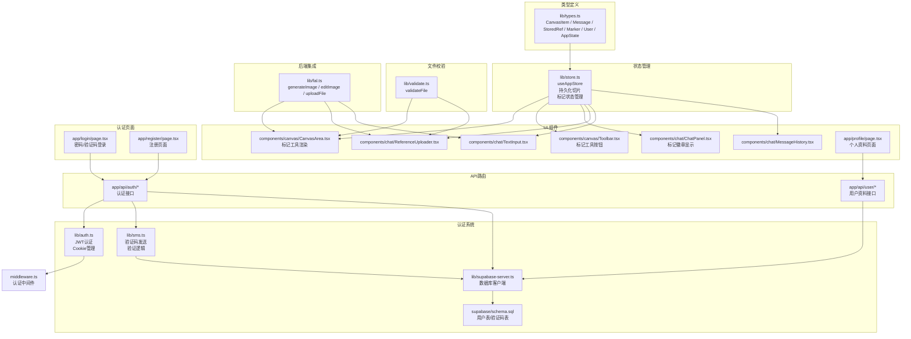
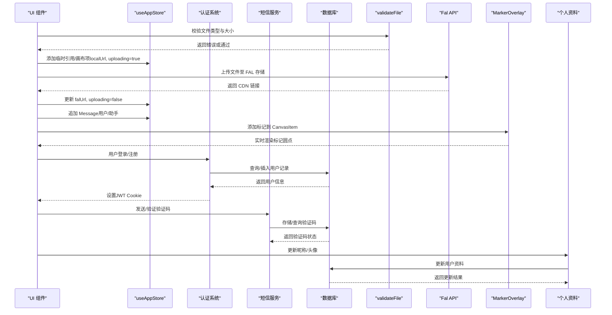
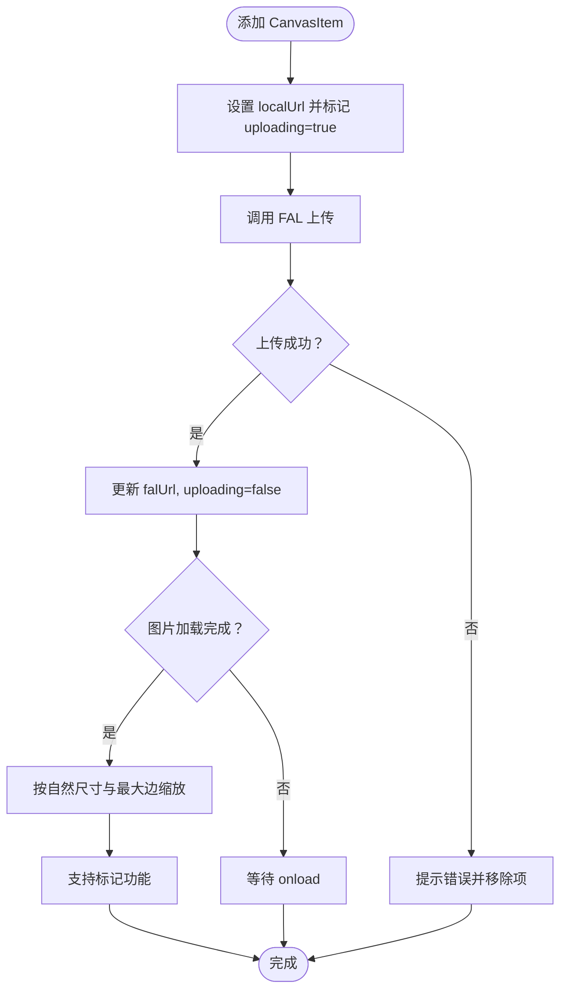
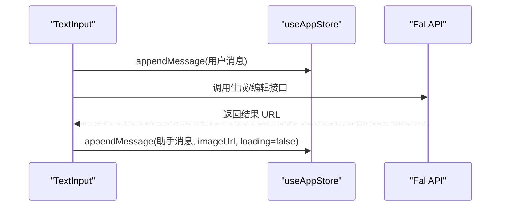
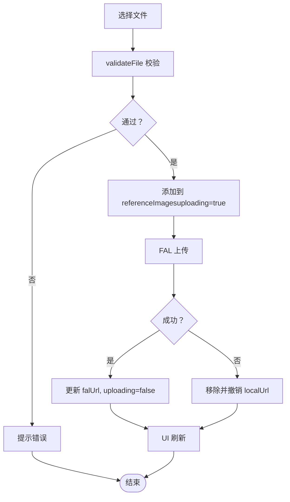
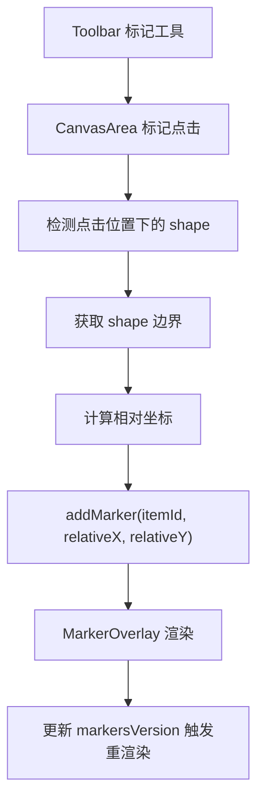
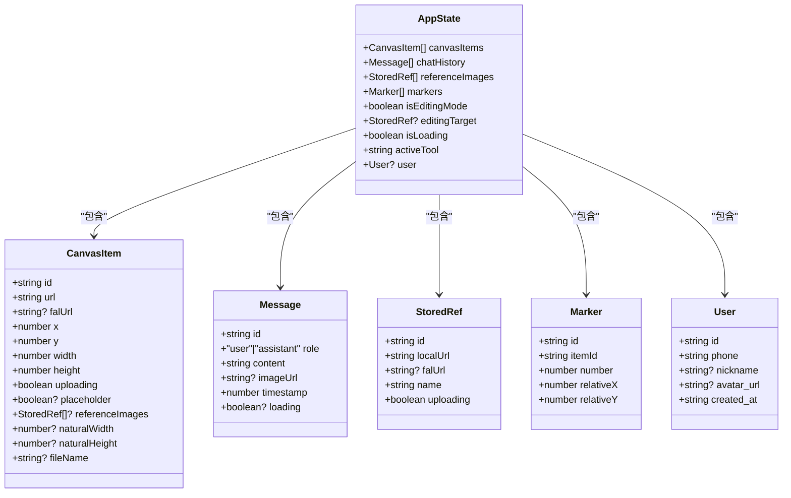
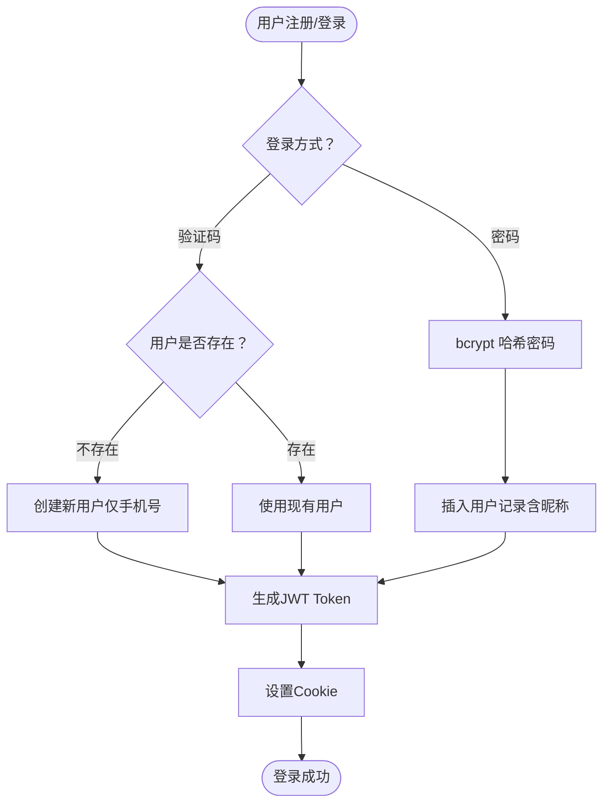
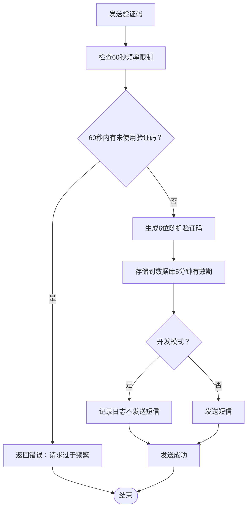
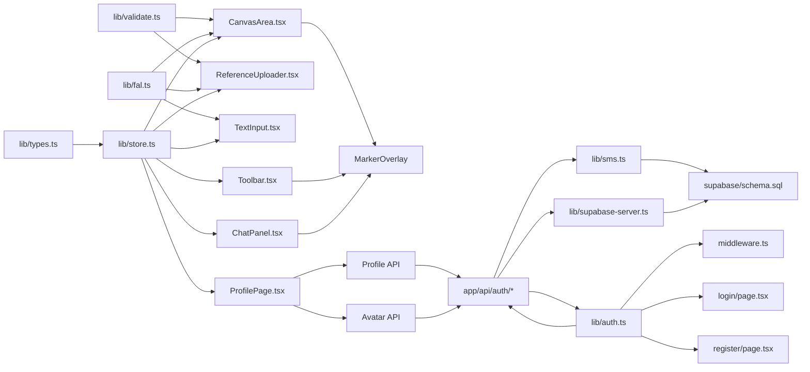

# 数据模型

<cite>
**本文档引用的文件**
- [lib/types.ts](file://lib/types.ts)
- [lib/store.ts](file://lib/store.ts)
- [lib/validate.ts](file://lib/validate.ts)
- [lib/fal.ts](file://lib/fal.ts)
- [lib/auth.ts](file://lib/auth.ts)
- [lib/sms.ts](file://lib/sms.ts)
- [lib/supabase-server.ts](file://lib/supabase-server.ts)
- [supabase/schema.sql](file://supabase/schema.sql)
- [components/canvas/CanvasArea.tsx](file://components/canvas/CanvasArea.tsx)
- [components/canvas/Toolbar.tsx](file://components/canvas/Toolbar.tsx)
- [components/chat/ChatPanel.tsx](file://components/chat/ChatPanel.tsx)
- [components/chat/ReferenceUploader.tsx](file://components/chat/ReferenceUploader.tsx)
- [components/chat/TextInput.tsx](file://components/chat/TextInput.tsx)
- [components/chat/MessageHistory.tsx](file://components/chat/MessageHistory.tsx)
- [app/page.tsx](file://app/page.tsx)
- [app/login/page.tsx](file://app/login/page.tsx)
- [app/register/page.tsx](file://app/register/page.tsx)
- [app/profile/page.tsx](file://app/profile/page.tsx)
- [app/api/auth/me/route.ts](file://app/api/auth/me/route.ts)
- [app/api/auth/signin/route.ts](file://app/api/auth/signin/route.ts)
- [app/api/auth/signin-sms/route.ts](file://app/api/auth/signin-sms/route.ts)
- [app/api/auth/signup/route.ts](file://app/api/auth/signup/route.ts)
- [app/api/auth/send-code/route.ts](file://app/api/auth/send-code/route.ts)
- [app/api/auth/signout/route.ts](file://app/api/auth/signout/route.ts)
- [app/api/user/profile/route.ts](file://app/api/user/profile/route.ts)
- [app/api/user/avatar/route.ts](file://app/api/user/avatar/route.ts)
- [middleware.ts](file://middleware.ts)
- [__tests__/validate.test.ts](file://__tests__/validate.test.ts)
- [__tests__/store.test.ts](file://__tests__/store.test.ts)
</cite>

## 更新摘要
**变更内容**
- 数据库模式扩展：users 表新增 nickname 和 avatar_url 字段
- 用户资料功能：支持用户昵称设置和头像上传
- 类型定义更新：User 接口包含新的可选字段
- API 接口扩展：新增用户资料和头像管理接口
- 前端界面更新：个人资料页面支持头像和昵称管理

## 目录
1. [简介](#简介)
2. [项目结构](#项目结构)
3. [核心组件](#核心组件)
4. [架构总览](#架构总览)
5. [详细组件分析](#详细组件分析)
6. [依赖分析](#依赖分析)
7. [性能考虑](#性能考虑)
8. [故障排除指南](#故障排除指南)
9. [结论](#结论)
10. [附录](#附录)

## 简介
本文件系统性梳理 Loveart 的核心数据模型与状态管理，重点覆盖以下数据类型：
- CanvasItem：画布元素，承载图片显示、上传状态、位置与尺寸信息，现支持标记功能
- Message：聊天消息，记录用户与 AI 的对话历史及结果图片链接
- StoredRef：参考图片，用于编辑时作为风格或内容参考
- Marker：标记系统，支持在画布元素上添加注释标记
- AppState：应用状态，聚合画布、聊天、参考图片和标记等全局状态，并提供编辑模式与加载状态
- User：用户实体，包含手机号、密码哈希、昵称和头像 URL 等认证相关信息
- VerificationCode：验证码实体，管理短信验证码的生成、验证和过期机制

同时，文档解释各数据类型之间的关系、业务规则、序列化/反序列化策略、验证规则与类型安全保障，并给出常见使用场景与最佳实践。

## 项目结构
数据模型主要分布在以下模块：
- 类型定义：lib/types.ts
- 全局状态：lib/store.ts（Zustand + 持久化）
- 认证系统：lib/auth.ts（JWT认证）、lib/sms.ts（短信验证码）、lib/supabase-server.ts（数据库客户端）
- 数据库模式：supabase/schema.sql（用户表和验证码表）
- 文件校验：lib/validate.ts
- 后端集成：lib/fal.ts（图像生成/编辑/上传）
- UI 使用：components/canvas/CanvasArea.tsx、components/canvas/Toolbar.tsx、components/chat/ChatPanel.tsx、components/chat/ReferenceUploader.tsx、components/chat/TextInput.tsx、components/chat/MessageHistory.tsx
- 页面布局：app/page.tsx、app/login/page.tsx、app/register/page.tsx、app/profile/page.tsx
- API路由：app/api/auth/*（认证相关接口）、app/api/user/*（用户资料和头像接口）
- 中间件：middleware.ts（认证中间件）

**图表来源**
- [lib/auth.ts:1-64](file://lib/auth.ts#L1-L64)
- [lib/sms.ts:1-115](file://lib/sms.ts#L1-L115)
- [lib/supabase-server.ts:1-16](file://lib/supabase-server.ts#L1-L16)
- [supabase/schema.sql:1-25](file://supabase/schema.sql#L1-L25)
- [lib/types.ts:1-57](file://lib/types.ts#L1-L57)
- [lib/store.ts:1-396](file://lib/store.ts#L1-L396)
- [lib/validate.ts:1-14](file://lib/validate.ts#L1-L14)
- [lib/fal.ts:1-62](file://lib/fal.ts#L1-L62)
- [components/canvas/CanvasArea.tsx:1-1621](file://components/canvas/CanvasArea.tsx#L1-L1621)
- [components/canvas/Toolbar.tsx:1-668](file://components/canvas/Toolbar.tsx#L1-L668)
- [components/chat/ChatPanel.tsx:1-200](file://components/chat/ChatPanel.tsx#L1-L200)
- [components/chat/ReferenceUploader.tsx:1-100](file://components/chat/ReferenceUploader.tsx#L1-L100)
- [components/chat/TextInput.tsx:1-140](file://components/chat/TextInput.tsx#L1-L140)
- [components/chat/MessageHistory.tsx:1-37](file://components/chat/MessageHistory.tsx#L1-L37)
- [app/page.tsx:1-59](file://app/page.tsx#L1-L59)
- [app/login/page.tsx:1-233](file://app/login/page.tsx#L1-L233)
- [app/register/page.tsx:1-199](file://app/register/page.tsx#L1-L199)
- [app/profile/page.tsx:1-284](file://app/profile/page.tsx#L1-L284)
- [app/api/auth/me/route.ts:1-54](file://app/api/auth/me/route.ts#L1-L54)
- [app/api/auth/signin/route.ts:1-93](file://app/api/auth/signin/route.ts#L1-L93)
- [app/api/auth/signin-sms/route.ts:1-94](file://app/api/auth/signin-sms/route.ts#L1-L94)
- [app/api/auth/signup/route.ts:1-134](file://app/api/auth/signup/route.ts#L1-L134)
- [app/api/auth/send-code/route.ts:1-48](file://app/api/auth/send-code/route.ts#L1-L48)
- [app/api/auth/signout/route.ts:1-20](file://app/api/auth/signout/route.ts#L1-L20)
- [app/api/user/profile/route.ts:1-75](file://app/api/user/profile/route.ts#L1-L75)
- [app/api/user/avatar/route.ts:1-122](file://app/api/user/avatar/route.ts#L1-L122)
- [middleware.ts:1-64](file://middleware.ts#L1-L64)

**章节来源**
- [lib/auth.ts:1-64](file://lib/auth.ts#L1-L64)
- [lib/sms.ts:1-115](file://lib/sms.ts#L1-L115)
- [lib/supabase-server.ts:1-16](file://lib/supabase-server.ts#L1-L16)
- [supabase/schema.sql:1-25](file://supabase/schema.sql#L1-L25)
- [lib/types.ts:1-57](file://lib/types.ts#L1-L57)
- [lib/store.ts:1-396](file://lib/store.ts#L1-L396)
- [lib/validate.ts:1-14](file://lib/validate.ts#L1-L14)
- [lib/fal.ts:1-62](file://lib/fal.ts#L1-L62)
- [components/canvas/CanvasArea.tsx:1-1621](file://components/canvas/CanvasArea.tsx#L1-L1621)
- [components/canvas/Toolbar.tsx:1-668](file://components/canvas/Toolbar.tsx#L1-L668)
- [components/chat/ChatPanel.tsx:1-200](file://components/chat/ChatPanel.tsx#L1-L200)
- [components/chat/ReferenceUploader.tsx:1-100](file://components/chat/ReferenceUploader.tsx#L1-L100)
- [components/chat/TextInput.tsx:1-140](file://components/chat/TextInput.tsx#L1-L140)
- [components/chat/MessageHistory.tsx:1-37](file://components/chat/MessageHistory.tsx#L1-L37)
- [app/page.tsx:1-59](file://app/page.tsx#L1-L59)
- [app/login/page.tsx:1-233](file://app/login/page.tsx#L1-L233)
- [app/register/page.tsx:1-199](file://app/register/page.tsx#L1-L199)
- [app/profile/page.tsx:1-284](file://app/profile/page.tsx#L1-L284)
- [app/api/auth/me/route.ts:1-54](file://app/api/auth/me/route.ts#L1-L54)
- [app/api/auth/signin/route.ts:1-93](file://app/api/auth/signin/route.ts#L1-L93)
- [app/api/auth/signin-sms/route.ts:1-94](file://app/api/auth/signin-sms/route.ts#L1-L94)
- [app/api/auth/signup/route.ts:1-134](file://app/api/auth/signup/route.ts#L1-L134)
- [app/api/auth/send-code/route.ts:1-48](file://app/api/auth/send-code/route.ts#L1-L48)
- [app/api/auth/signout/route.ts:1-20](file://app/api/auth/signout/route.ts#L1-L20)
- [app/api/user/profile/route.ts:1-75](file://app/api/user/profile/route.ts#L1-L75)
- [app/api/user/avatar/route.ts:1-122](file://app/api/user/avatar/route.ts#L1-L122)
- [middleware.ts:1-64](file://middleware.ts#L1-L64)

## 核心组件
本节对七个核心数据类型进行逐项说明，包括字段定义、类型约束、业务规则与典型用法。

- CanvasItem（画布元素）
  - 字段与约束
    - id：字符串，唯一标识
    - url：字符串，显示用 URL（本地 Blob 或远端 CDN）
    - falUrl：字符串或空，FAL CDN 地址；上传完成前为 null
    - x/y：数字，元素在画布上的坐标
    - width/height：数字，元素宽高；0 表示首次加载时自动计算
    - uploading：布尔，是否正在上传
    - placeholder：可选布尔，AI 生成过程中的占位状态
    - referenceImages：可选数组，每项参考图片集合
    - naturalWidth/naturalHeight：可选数字，原始图片尺寸
    - fileName：可选字符串，原始文件名
  - 业务规则
    - 当 width=0 且图片加载完成后，应根据自然宽高按最大边缩放以适配界面
    - placeholder=true 时，UI 展示"闪烁"占位动画，不可交互
    - 上传完成后，falUrl 应从 null 更新为实际 CDN 链接
    - 支持标记功能，可通过相对坐标系统在图片上添加注释标记
  - 使用示例路径
    - 添加元素：[components/canvas/CanvasArea.tsx:880-890](file://components/canvas/CanvasArea.tsx#L880-L890)
    - 更新上传状态：[components/canvas/CanvasArea.tsx:332-337](file://components/canvas/CanvasArea.tsx#L332-L337)
    - 自动尺寸调整：[components/canvas/CanvasArea.tsx:88-98](file://components/canvas/CanvasArea.tsx#L88-L98)

- Message（聊天消息）
  - 字段与约束
    - id：字符串，唯一标识
    - role：字面量联合类型 "user"|"assistant"
    - content：字符串，消息正文
    - imageUrl：可选字符串，仅 assistant 消息返回结果图片 URL
    - timestamp：数字，时间戳
    - loading：可选布尔，骨架屏加载状态
  - 业务规则
    - 用户消息由前端直接追加到历史
    - AI 响应消息包含生成结果 URL，用于展示与下载
    - 历史长度限制为 50 条，超出时丢弃最旧条目
    - 支持加载状态显示，提升用户体验
  - 使用示例路径
    - 追加用户消息：[components/chat/TextInput.tsx:39](file://components/chat/TextInput.tsx#L39)
    - 追加 AI 消息并设置结果图：[components/chat/TextInput.tsx:75-81](file://components/chat/TextInput.tsx#L75-L81)
    - 历史截断逻辑：[lib/store.ts:251-255](file://lib/store.ts#L251-L255)

- StoredRef（参考图片）
  - 字段与约束
    - id：字符串，唯一标识
    - localUrl：字符串，本地对象 URL，用于预览；清理时需撤销
    - falUrl：字符串或空，FAL 存储地址；上传完成前为 null
    - name：字符串，文件名
    - uploading：布尔，是否正在上传
  - 业务规则
    - 最多允许 6 张参考图
    - 上传成功后，falUrl 从 null 更新为 CDN 链接
    - 删除时需撤销本地对象 URL
  - 使用示例路径
    - 添加参考图并标记上传中：[components/chat/ReferenceUploader.tsx:27-29](file://components/chat/ReferenceUploader.tsx#L27-L29)
    - 上传成功更新 CDN 链接：[components/chat/ReferenceUploader.tsx:32-33](file://components/chat/ReferenceUploader.tsx#L32-L33)
    - 删除并撤销 URL：[components/chat/ReferenceUploader.tsx:70-73](file://components/chat/ReferenceUploader.tsx#L70-L73)

- Marker（标记）
  - 字段与约束
    - id：字符串，nanoid生成的唯一标识
    - itemId：字符串，所属 CanvasItem 的 id
    - number：数字，全局序号 1-8
    - relativeX：数字，相对图片的 X 位置 (0-1)
    - relativeY：数字，相对图片的 Y 位置 (0-1)
  - 业务规则
    - 每个画布元素最多支持 8 个标记
    - 相对坐标范围必须在 0-1 之间
    - 标记按添加顺序自动编号
    - 标记位置基于 tldraw 形状边界计算
  - 使用示例路径
    - 添加标记：[lib/store.ts:284-295](file://lib/store.ts#L284-L295)
    - 删除标记：[lib/store.ts:312-332](file://lib/store.ts#L312-L332)
    - 清空标记：[lib/store.ts:356-373](file://lib/store.ts#L356-L373)

- AppState（应用状态）
  - 字段与约束
    - canvasItems：CanvasItem 数组
    - chatHistory：Message 数组
    - isEditingMode：布尔，当前是否处于编辑模式
    - editingTarget：StoredRef 或空，当前编辑目标
    - isLoading：布尔，是否处于生成/编辑流程中
    - markers：Marker 数组，标记状态
    - activeTool：字符串，当前激活的工具
    - user：User 或空，当前登录用户
  - 业务规则
    - 编辑模式下，TextInput 将提示"描述你想如何编辑..."
    - 清空画布会同时重置编辑模式与目标
    - 上传中的资源会阻塞发送新请求
    - 支持标记工具的激活状态管理
    - 用户状态持久化到本地存储
  - 使用示例路径
    - 设置编辑模式与目标：[components/canvas/CanvasArea.tsx:283-289](file://components/canvas/CanvasArea.tsx#L283-L289)
    - 清空画布并重置编辑态：[lib/store.ts:163-190](file://lib/store.ts#L163-L190)
    - 读取状态并禁用发送按钮：[components/chat/TextInput.tsx:31](file://components/chat/TextInput.tsx#L31)
    - 设置用户状态：[lib/store.ts:375-377](file://lib/store.ts#L375-L377)

- User（用户实体）
  - 字段与约束
    - id：字符串，UUID，主键标识
    - phone：字符串，手机号，唯一约束，长度不超过20
    - nickname：字符串或空，昵称，长度不超过20
    - avatar_url：字符串或空，头像 URL，支持空值表示未设置头像
    - created_at：字符串，时间戳，默认当前时间
  - 业务规则
    - phone 字段具有唯一性约束，确保手机号不重复
    - nickname 字段可为空，支持用户未设置昵称的情况
    - avatar_url 字段可为空，支持用户未设置头像的情况
    - created_at 字段自动记录创建时间
  - 使用示例路径
    - 用户查询：[app/api/auth/signin/route.ts:38-42](file://app/api/auth/signin/route.ts#L38-L42)
    - 用户创建：[app/api/auth/signin-sms/route.ts:56-71](file://app/api/auth/signin-sms/route.ts#L56-L71)
    - 用户信息获取：[app/api/auth/me/route.ts:29-31](file://app/api/auth/me/route.ts#L29-L31)
    - 昵称更新：[app/api/user/profile/route.ts:47-50](file://app/api/user/profile/route.ts#L47-L50)
    - 头像上传：[app/api/user/avatar/route.ts:92-95](file://app/api/user/avatar/route.ts#L92-L95)

- VerificationCode（验证码实体）
  - 字段与约束
    - id：UUID，主键标识
    - phone：字符串，手机号，长度不超过20
    - code：字符串，验证码，长度6位
    - expires_at：时间戳，过期时间
    - used：布尔，默认false，是否已使用
    - created_at：时间戳，默认当前时间
  - 业务规则
    - 验证码长度固定为6位数字
    - 默认有效期5分钟（300秒）
    - used 字段用于防止重复使用
    - 支持按手机号和验证码组合查询
    - 支持按过期时间查询过期记录
  - 使用示例路径
    - 验证码发送：[lib/sms.ts:43-90](file://lib/sms.ts#L43-L90)
    - 验证码验证：[lib/sms.ts:92-115](file://lib/sms.ts#L92-L115)
    - 频率限制：[lib/sms.ts:44-58](file://lib/sms.ts#L44-L58)

**章节来源**
- [lib/types.ts:18-32](file://lib/types.ts#L18-L32)
- [lib/types.ts:9-16](file://lib/types.ts#L9-L16)
- [lib/types.ts:1-7](file://lib/types.ts#L1-L7)
- [lib/types.ts:34-40](file://lib/types.ts#L34-L40)
- [lib/types.ts:42-57](file://lib/types.ts#L42-L57)
- [supabase/schema.sql:1-25](file://supabase/schema.sql#L1-L25)
- [lib/sms.ts:43-115](file://lib/sms.ts#L43-L115)
- [app/api/auth/signin/route.ts:38-42](file://app/api/auth/signin/route.ts#L38-L42)
- [app/api/auth/signin-sms/route.ts:56-71](file://app/api/auth/signin-sms/route.ts#L56-L71)
- [app/api/auth/me/route.ts:29-31](file://app/api/auth/me/route.ts#L29-L31)
- [app/api/user/profile/route.ts:47-50](file://app/api/user/profile/route.ts#L47-L50)
- [app/api/user/avatar/route.ts:92-95](file://app/api/user/avatar/route.ts#L92-L95)
- [components/canvas/CanvasArea.tsx:88-98](file://components/canvas/CanvasArea.tsx#L88-L98)
- [components/canvas/CanvasArea.tsx:283-289](file://components/canvas/CanvasArea.tsx#L283-L289)
- [components/canvas/CanvasArea.tsx:880-890](file://components/canvas/CanvasArea.tsx#L880-L890)
- [components/canvas/CanvasArea.tsx:332-337](file://components/canvas/CanvasArea.tsx#L332-L337)
- [components/chat/ReferenceUploader.tsx:27-29](file://components/chat/ReferenceUploader.tsx#L27-L29)
- [components/chat/ReferenceUploader.tsx:32-33](file://components/chat/ReferenceUploader.tsx#L32-L33)
- [components/chat/ReferenceUploader.tsx:70-73](file://components/chat/ReferenceUploader.tsx#L70-L73)
- [components/chat/TextInput.tsx:31](file://components/chat/TextInput.tsx#L31)
- [components/chat/TextInput.tsx:39](file://components/chat/TextInput.tsx#L39)
- [components/chat/TextInput.tsx:75-81](file://components/chat/TextInput.tsx#L75-L81)
- [lib/store.ts:163-190](file://lib/store.ts#L163-L190)
- [lib/store.ts:251-255](file://lib/store.ts#L251-L255)
- [lib/store.ts:284-295](file://lib/store.ts#L284-L295)
- [lib/store.ts:312-332](file://lib/store.ts#L312-L332)
- [lib/store.ts:356-373](file://lib/store.ts#L356-L373)
- [lib/store.ts:375-377](file://lib/store.ts#L375-L377)

## 架构总览
数据流自上而下贯穿 UI、状态层、认证系统与后端服务：
- UI 组件通过 useAppStore 读写 AppState
- CanvasItem 与 StoredRef 通过本地 Blob 与 FAL CDN 双链路存储
- Message 仅在前端维护，上限 50 条
- Marker 系统通过 tldraw 集成，支持实时标记渲染
- 文件上传统一走 FAL 存储，生成 CDN 链接回填到对应字段
- 用户认证通过 JWT Cookie 机制管理会话状态
- 验证码系统支持短信发送和本地开发模式
- 用户资料功能支持昵称设置和头像上传管理

**图表来源**
- [lib/validate.ts:9-13](file://lib/validate.ts#L9-L13)
- [lib/fal.ts:59-61](file://lib/fal.ts#L59-L61)
- [components/chat/ReferenceUploader.tsx:27-33](file://components/chat/ReferenceUploader.tsx#L27-L33)
- [components/canvas/CanvasArea.tsx:880-890](file://components/canvas/CanvasArea.tsx#L880-L890)
- [components/chat/TextInput.tsx:75-81](file://components/chat/TextInput.tsx#L75-L81)
- [components/canvas/CanvasArea.tsx:194-253](file://components/canvas/CanvasArea.tsx#L194-L253)
- [lib/auth.ts:13-28](file://lib/auth.ts#L13-L28)
- [lib/sms.ts:43-115](file://lib/sms.ts#L43-L115)
- [lib/supabase-server.ts:5-15](file://lib/supabase-server.ts#L5-L15)
- [app/api/user/profile/route.ts:47-50](file://app/api/user/profile/route.ts#L47-L50)
- [app/api/user/avatar/route.ts:92-95](file://app/api/user/avatar/route.ts#L92-L95)

## 详细组件分析

### CanvasItem 数据模型
- 字段与含义
  - id/url/falUrl：元素标识与显示/存储链接
  - x/y/width/height：定位与尺寸，0 表示自动
  - uploading/placeholder：上传与生成状态
  - referenceImages：每项参考图片集合
  - naturalWidth/naturalHeight：原始图片尺寸
  - fileName：原始文件名
- 关键处理逻辑
  - 图片加载完成后自动计算尺寸并更新
  - 占位元素不参与交互，仅用于生成期间的视觉反馈
  - 支持标记功能，通过相对坐标系统实现精确定位
- 复杂度与性能
  - 更新操作为 O(n) 遍历数组映射
  - 自动尺寸计算为单张图片加载事件触发，开销可控
  - 标记渲染使用 tldraw 的高效渲染引擎

**图表来源**
- [components/canvas/CanvasArea.tsx:880-890](file://components/canvas/CanvasArea.tsx#L880-L890)
- [components/canvas/CanvasArea.tsx:88-98](file://components/canvas/CanvasArea.tsx#L88-L98)
- [components/canvas/CanvasArea.tsx:194-253](file://components/canvas/CanvasArea.tsx#L194-L253)

**章节来源**
- [lib/types.ts:18-32](file://lib/types.ts#L18-L32)
- [components/canvas/CanvasArea.tsx:88-98](file://components/canvas/CanvasArea.tsx#L88-L98)
- [components/canvas/CanvasArea.tsx:880-890](file://components/canvas/CanvasArea.tsx#L880-L890)
- [components/canvas/CanvasArea.tsx:194-253](file://components/canvas/CanvasArea.tsx#L194-L253)

### Message 数据模型
- 字段与含义
  - id/role/content/timestamp：标准消息字段
  - imageUrl：仅助手消息存在，指向生成结果
  - loading：骨架屏加载状态
- 历史管理
  - 追加时复制数组并在超长时截断至最近 50 条
- 业务规则
  - 用户消息即时可见
  - 助手消息携带结果图，便于下载与展示
  - 支持加载状态，提升用户体验

**图表来源**
- [components/chat/TextInput.tsx:39](file://components/chat/TextInput.tsx#L39)
- [components/chat/TextInput.tsx:75-81](file://components/chat/TextInput.tsx#L75-L81)
- [lib/store.ts:251-255](file://lib/store.ts#L251-L255)

**章节来源**
- [lib/types.ts:9-16](file://lib/types.ts#L9-L16)
- [lib/store.ts:251-255](file://lib/store.ts#L251-L255)
- [components/chat/TextInput.tsx:39](file://components/chat/TextInput.tsx#L39)
- [components/chat/TextInput.tsx:75-81](file://components/chat/TextInput.tsx#L75-L81)

### StoredRef 数据模型
- 字段与含义
  - id/localUrl/name：本地预览与元数据
  - falUrl/uploading：远端存储与上传状态
- 业务规则
  - 最多 6 张；上传成功后回填 CDN 链接
  - 删除时撤销本地对象 URL，避免内存泄漏
- UI 交互
  - 展示缩略图与上传指示器，支持移除

**图表来源**
- [lib/validate.ts:9-13](file://lib/validate.ts#L9-L13)
- [components/chat/ReferenceUploader.tsx:18-39](file://components/chat/ReferenceUploader.tsx#L18-L39)
- [components/chat/ReferenceUploader.tsx:70-73](file://components/chat/ReferenceUploader.tsx#L70-L73)

**章节来源**
- [lib/types.ts:1-7](file://lib/types.ts#L1-L7)
- [lib/validate.ts:9-13](file://lib/validate.ts#L9-L13)
- [components/chat/ReferenceUploader.tsx:18-39](file://components/chat/ReferenceUploader.tsx#L18-L39)
- [components/chat/ReferenceUploader.tsx:70-73](file://components/chat/ReferenceUploader.tsx#L70-L73)

### Marker 数据模型
- 字段与含义
  - id：nanoid生成的唯一标识
  - itemId：所属 CanvasItem 的 id
  - number：全局序号 1-8
  - relativeX/relativeY：相对坐标 (0-1)
- 标记系统架构
  - MarkerOverlay 组件负责实时渲染标记
  - 通过 tldraw 的 shape 边界计算绝对位置
  - 支持相机移动和形状变换的实时响应
- 业务规则
  - 每个画布元素最多 8 个标记
  - 相对坐标自动 clamping 到 0-1 范围
  - 标记按添加顺序自动编号
- UI 交互
  - Toolbar 中的标记工具按钮
  - CanvasArea 中的标记点击事件处理
  - ChatPanel 中的标记徽章显示

**图表来源**
- [components/canvas/Toolbar.tsx:569-576](file://components/canvas/Toolbar.tsx#L569-L576)
- [components/canvas/CanvasArea.tsx:805-838](file://components/canvas/CanvasArea.tsx#L805-L838)
- [lib/store.ts:284-295](file://lib/store.ts#L284-L295)
- [components/canvas/CanvasArea.tsx:194-253](file://components/canvas/CanvasArea.tsx#L194-L253)

**章节来源**
- [lib/types.ts:34-40](file://lib/types.ts#L34-L40)
- [lib/store.ts:284-295](file://lib/store.ts#L284-L295)
- [lib/store.ts:312-332](file://lib/store.ts#L312-L332)
- [lib/store.ts:356-373](file://lib/store.ts#L356-L373)
- [components/canvas/CanvasArea.tsx:194-253](file://components/canvas/CanvasArea.tsx#L194-L253)
- [components/canvas/CanvasArea.tsx:805-838](file://components/canvas/CanvasArea.tsx#L805-L838)
- [components/canvas/Toolbar.tsx:569-576](file://components/canvas/Toolbar.tsx#L569-L576)
- [components/chat/ChatPanel.tsx:111-119](file://components/chat/ChatPanel.tsx#L111-L119)

### AppState 数据模型
- 字段与含义
  - canvasItems/chatHistory/referenceImages/markers：四类核心集合
  - isEditingMode/editingTarget：编辑模式与目标
  - isLoading：生成/编辑流程状态
  - activeTool：当前激活的工具
  - user：User 或空，当前登录用户
- 状态变更
  - 清空画布会重置编辑模式与目标
  - 上传中或生成中会禁用发送按钮
  - 标记工具激活状态管理
  - 用户状态持久化到本地存储
- 与 UI 的耦合
  - TextInput 根据 isEditingMode 决定占位文案
  - CanvasArea 在选中元素时进入编辑模式
  - MarkerOverlay 响应 markersVersion 变化
  - 个人资料页面显示用户信息

**图表来源**
- [lib/types.ts:1-57](file://lib/types.ts#L1-L57)

**章节来源**
- [lib/types.ts:42-57](file://lib/types.ts#L42-L57)
- [lib/store.ts:163-190](file://lib/store.ts#L163-L190)
- [components/canvas/CanvasArea.tsx:283-289](file://components/canvas/CanvasArea.tsx#L283-L289)
- [components/chat/TextInput.tsx:31](file://components/chat/TextInput.tsx#L31)
- [lib/store.ts:375-377](file://lib/store.ts#L375-L377)

### User 数据模型
- 字段与含义
  - id：字符串，UUID，主键标识
  - phone：字符串，手机号，唯一约束，长度不超过20
  - nickname：字符串或空，昵称，长度不超过20
  - avatar_url：字符串或空，头像 URL，支持空值表示未设置头像
  - created_at：字符串，时间戳，默认当前时间
- 关键处理逻辑
  - phone 字段具有唯一性约束，确保手机号不重复
  - nickname 字段可为空，支持用户未设置昵称的情况
  - avatar_url 字段可为空，支持用户未设置头像的情况
  - created_at 字段自动记录创建时间
- 安全性考虑
  - 密码通过 bcrypt 进行哈希存储
  - 支持多种登录方式：密码登录和验证码登录
  - JWT Token 有效期7天
- 用户资料功能
  - 支持昵称设置，长度2-20字符
  - 支持头像上传，支持JPG、PNG、WebP、GIF格式，最大5MB
  - 头像文件按用户ID和时间戳命名存储

**图表来源**
- [app/api/auth/signin/route.ts:69-72](file://app/api/auth/signin/route.ts#L69-L72)
- [app/api/auth/signin-sms/route.ts:74-77](file://app/api/auth/signin-sms/route.ts#L74-L77)
- [lib/auth.ts:13-28](file://lib/auth.ts#L13-L28)

**章节来源**
- [supabase/schema.sql:6-7](file://supabase/schema.sql#L6-L7)
- [lib/sms.ts:76-89](file://lib/sms.ts#L76-L89)
- [app/api/auth/signin/route.ts:69-72](file://app/api/auth/signin/route.ts#L69-L72)
- [app/api/auth/signin-sms/route.ts:74-77](file://app/api/auth/signin-sms/route.ts#L74-L77)
- [lib/auth.ts:13-28](file://lib/auth.ts#L13-L28)

### VerificationCode 数据模型
- 字段与含义
  - id：UUID，主键标识
  - phone：字符串，手机号，长度不超过20
  - code：字符串，验证码，长度6位
  - expires_at：时间戳，过期时间
  - used：布尔，默认false，是否已使用
  - created_at：时间戳，默认当前时间
- 关键处理逻辑
  - 验证码长度固定为6位数字
  - 默认有效期5分钟（300秒）
  - used 字段用于防止重复使用
  - 支持按手机号和验证码组合查询
  - 支持按过期时间查询过期记录
- 频率控制
  - 60秒内同一手机号只能发送一次验证码
  - 验证码过期后自动失效
  - 验证成功后立即标记为已使用

**图表来源**
- [lib/sms.ts:43-90](file://lib/sms.ts#L43-L90)
- [lib/sms.ts:92-115](file://lib/sms.ts#L92-L115)

**章节来源**
- [supabase/schema.sql:12-19](file://supabase/schema.sql#L12-L19)
- [lib/sms.ts:43-115](file://lib/sms.ts#L43-L115)

## 依赖分析
- 类型依赖
  - CanvasItem/Message/StoredRef/Marker/User/State 定义于 lib/types.ts
  - VerificationCode 定义于 supabase/schema.sql
  - useAppStore 在 lib/store.ts 中消费上述类型
- 认证依赖
  - lib/auth.ts 提供 JWT 认证和 Cookie 管理
  - lib/sms.ts 提供验证码发送和验证逻辑
  - lib/supabase-server.ts 提供数据库客户端
  - supabase/schema.sql 定义数据库表结构
- UI 依赖
  - CanvasArea 依赖 CanvasItem 与上传/生成流程，现支持标记渲染
  - Toolbar 依赖 Marker 类型与标记工具状态
  - ReferenceUploader 依赖 StoredRef 与 validateFile
  - TextInput 依赖 Message、AppState 与 Fal API
  - ChatPanel 依赖 Marker 类型与标记徽章显示
  - 个人资料页面依赖 User 类型与用户资料接口
  - 登录/注册页面依赖认证 API 和表单验证
- 外部依赖
  - FAL SDK 提供生成/编辑/上传能力
  - tldraw 提供标记渲染与交互支持
  - localStorage 通过安全包装器实现持久化
  - bcryptjs 提供密码哈希功能
  - jose 提供 JWT 加解密功能

**图表来源**
- [lib/types.ts:1-57](file://lib/types.ts#L1-L57)
- [lib/store.ts:1-396](file://lib/store.ts#L1-L396)
- [lib/auth.ts:1-64](file://lib/auth.ts#L1-L64)
- [lib/sms.ts:1-115](file://lib/sms.ts#L1-L115)
- [lib/supabase-server.ts:1-16](file://lib/supabase-server.ts#L1-L16)
- [supabase/schema.sql:1-25](file://supabase/schema.sql#L1-L25)
- [lib/validate.ts:1-14](file://lib/validate.ts#L1-L14)
- [lib/fal.ts:1-62](file://lib/fal.ts#L1-L62)
- [components/canvas/CanvasArea.tsx:1-1621](file://components/canvas/CanvasArea.tsx#L1-L1621)
- [components/canvas/Toolbar.tsx:1-668](file://components/canvas/Toolbar.tsx#L1-L668)
- [components/chat/ChatPanel.tsx:1-200](file://components/chat/ChatPanel.tsx#L1-L200)
- [components/chat/ReferenceUploader.tsx:1-100](file://components/chat/ReferenceUploader.tsx#L1-L100)
- [components/chat/TextInput.tsx:1-140](file://components/chat/TextInput.tsx#L1-L140)
- [app/login/page.tsx:1-233](file://app/login/page.tsx#L1-L233)
- [app/register/page.tsx:1-199](file://app/register/page.tsx#L1-L199)
- [app/profile/page.tsx:1-284](file://app/profile/page.tsx#L1-L284)
- [app/api/auth/*:1-93](file://app/api/auth/signin/route.ts#L1-L93)
- [app/api/user/*:1-122](file://app/api/user/avatar/route.ts#L1-L122)

**章节来源**
- [lib/store.ts:1-396](file://lib/store.ts#L1-L396)
- [lib/auth.ts:1-64](file://lib/auth.ts#L1-L64)
- [lib/sms.ts:1-115](file://lib/sms.ts#L1-L115)
- [lib/supabase-server.ts:1-16](file://lib/supabase-server.ts#L1-L16)
- [supabase/schema.sql:1-25](file://supabase/schema.sql#L1-L25)
- [lib/validate.ts:1-14](file://lib/validate.ts#L1-L14)
- [lib/fal.ts:1-62](file://lib/fal.ts#L1-L62)
- [components/canvas/CanvasArea.tsx:1-1621](file://components/canvas/CanvasArea.tsx#L1-L1621)
- [components/canvas/Toolbar.tsx:1-668](file://components/canvas/Toolbar.tsx#L1-L668)
- [components/chat/ChatPanel.tsx:1-200](file://components/chat/ChatPanel.tsx#L1-L200)
- [components/chat/ReferenceUploader.tsx:1-100](file://components/chat/ReferenceUploader.tsx#L1-L100)
- [components/chat/TextInput.tsx:1-140](file://components/chat/TextInput.tsx#L1-L140)
- [app/login/page.tsx:1-233](file://app/login/page.tsx#L1-L233)
- [app/register/page.tsx:1-199](file://app/register/page.tsx#L1-L199)
- [app/profile/page.tsx:1-284](file://app/profile/page.tsx#L1-L284)
- [app/api/auth/signin/route.ts:1-93](file://app/api/auth/signin/route.ts#L1-L93)
- [app/api/user/avatar/route.ts:1-122](file://app/api/user/avatar/route.ts#L1-L122)

## 性能考虑
- 状态更新
  - 使用浅拷贝与不可变更新策略，避免深层遍历
  - 历史列表截断仅在追加时发生，复杂度 O(n)
  - 标记渲染使用 tldraw 的高效渲染引擎，支持相机移动和形状变换的实时响应
  - 用户状态持久化仅保存必要字段，减少存储开销
- 图像处理
  - 自动尺寸计算仅在首帧 onload 触发，避免重复计算
  - 占位元素采用渐变动画，渲染成本低
  - 标记位置计算基于 tldraw 的边界缓存，提升性能
- 存储与序列化
  - 仅持久化 chatHistory，其他会话状态不持久化，减少 IO
  - JSON 序列化失败时安全降级为 null
  - 标记状态通过 markersVersion 信号触发局部重渲染，避免全量更新
  - 用户状态通过 setUser 动作更新，避免不必要的重渲染
- 认证性能
  - JWT Token 缓存避免频繁解密
  - 数据库查询使用索引优化（users.phone、verification_codes.phone_code、verification_codes.expires_at）
  - 验证码发送频率限制减少数据库压力
  - 个人资料接口使用 select 指定字段，减少网络传输
- 数据库优化
  - 创建复合索引优化验证码查询性能
  - 使用 UUID 作为主键提升并发性能
  - 合理的时间戳字段设计支持高效的过期查询
  - 用户资料查询使用索引优化

## 故障排除指南
- 上传失败
  - 现象：toast 提示"上传失败，请检查 FAL_KEY 并重启服务"
  - 排查：确认环境变量与代理路由可用
  - 参考路径：[components/canvas/CanvasArea.tsx:334-337](file://components/canvas/CanvasArea.tsx#L334-L337)
- 网络异常
  - 现象：生成/编辑抛出 TypeError，toast 提示"网络连接失败"
  - 排查：检查网络连通性与代理配置
  - 参考路径：[components/chat/TextInput.tsx:82-85](file://components/chat/TextInput.tsx#L82-L85)
- 文件格式/大小不合法
  - 现象：toast 提示"仅支持 JPG/PNG/WebP 格式"或"文件不能超过 10MB"
  - 排查：确认文件类型与大小边界
  - 参考路径：[lib/validate.ts:2-4](file://lib/validate.ts#L2-L4)
  - 测试用例：[__tests__/validate.test.ts:23-41](file://__tests__/validate.test.ts#L23-L41)
- 历史溢出
  - 现象：超过 50 条后最旧消息被丢弃
  - 参考路径：[lib/store.ts:251-255](file://lib/store.ts#L251-L255)
- 标记数量限制
  - 现象：超过 8 个标记时提示"最多添加 8 个标记"
  - 排查：检查标记工具的限制逻辑
  - 参考路径：[components/canvas/CanvasArea.tsx:812-815](file://components/canvas/CanvasArea.tsx#L812-L815)
- 标记渲染异常
  - 现象：标记不显示或位置错误
  - 排查：确认 tldraw editor 正常运行，检查 shape 边界计算
  - 参考路径：[components/canvas/CanvasArea.tsx:224-237](file://components/canvas/CanvasArea.tsx#L224-L237)
- 验证码发送失败
  - 现象：发送验证码提示"短信发送失败"
  - 排查：检查阿里云短信配置或切换到开发模式
  - 参考路径：[lib/sms.ts:83-89](file://lib/sms.ts#L83-L89)
- 验证码过期或错误
  - 现象：登录时提示"验证码错误或已过期"
  - 排查：确认验证码是否在有效期内且未被使用
  - 参考路径：[lib/sms.ts:92-115](file://lib/sms.ts#L92-L115)
- 密码登录失败
  - 现象：密码错误或用户不存在
  - 排查：确认手机号格式和密码长度
  - 参考路径：[app/api/auth/signin/route.ts:44-66](file://app/api/auth/signin/route.ts#L44-L66)
- JWT 认证失败
  - 现象：401 未授权错误
  - 排查：检查 Cookie 是否正确设置和 Token 是否过期
  - 参考路径：[middleware.ts:32-38](file://middleware.ts#L32-L38)
- 昵称设置失败
  - 现象：保存昵称时提示"昵称长度应在2-20个字符之间"
  - 排查：确认昵称长度符合要求
  - 参考路径：[app/api/user/profile/route.ts:37-42](file://app/api/user/profile/route.ts#L37-L42)
- 头像上传失败
  - 现象：上传头像时提示"仅支持 JPG、PNG、WebP、GIF 格式"或"图片大小不能超过 5MB"
  - 排查：确认文件类型和大小符合要求
  - 参考路径：[app/api/user/avatar/route.ts:40-53](file://app/api/user/avatar/route.ts#L40-L53)
- 用户资料获取失败
  - 现象：个人资料页面无法显示用户信息
  - 排查：检查认证状态和 API 接口
  - 参考路径：[app/api/auth/me/route.ts:29-31](file://app/api/auth/me/route.ts#L29-L31)
- 测试验证
  - Canvas 动作测试：[__tests__/store.test.ts:17-45](file://__tests__/store.test.ts#L17-L45)
  - Reference 图更新测试：[__tests__/store.test.ts:47-73](file://__tests__/store.test.ts#L47-L73)

**章节来源**
- [components/canvas/CanvasArea.tsx:334-337](file://components/canvas/CanvasArea.tsx#L334-L337)
- [components/chat/TextInput.tsx:82-85](file://components/chat/TextInput.tsx#L82-L85)
- [lib/validate.ts:2-4](file://lib/validate.ts#L2-L4)
- [__tests__/validate.test.ts:23-41](file://__tests__/validate.test.ts#L23-L41)
- [lib/store.ts:251-255](file://lib/store.ts#L251-L255)
- [components/canvas/CanvasArea.tsx:812-815](file://components/canvas/CanvasArea.tsx#L812-L815)
- [components/canvas/CanvasArea.tsx:224-237](file://components/canvas/CanvasArea.tsx#L224-L237)
- [lib/sms.ts:83-89](file://lib/sms.ts#L83-L89)
- [lib/sms.ts:92-115](file://lib/sms.ts#L92-L115)
- [app/api/auth/signin/route.ts:44-66](file://app/api/auth/signin/route.ts#L44-L66)
- [middleware.ts:32-38](file://middleware.ts#L32-L38)
- [app/api/user/profile/route.ts:37-42](file://app/api/user/profile/route.ts#L37-L42)
- [app/api/user/avatar/route.ts:40-53](file://app/api/user/avatar/route.ts#L40-L53)
- [app/api/auth/me/route.ts:29-31](file://app/api/auth/me/route.ts#L29-L31)
- [__tests__/store.test.ts:17-45](file://__tests__/store.test.ts#L17-L45)
- [__tests__/store.test.ts:47-73](file://__tests__/store.test.ts#L47-L73)

## 结论
Loveart 的数据模型围绕 AppState 组织，通过 CanvasItem、Message、StoredRef、Marker、User 四类实体支撑"创作+编辑+标记+用户资料"的核心流程。新增的用户认证系统通过 JWT Cookie 机制实现了安全的会话管理，支持手机号唯一性约束、密码哈希存储和验证码索引优化。数据库模式扩展增加了 nickname 和 avatar_url 字段，为用户提供更丰富的身份标识和个性化设置。

类型定义清晰、状态更新可预期、持久化策略合理，配合严格的文件校验、友好的 UI 反馈和强大的标记系统，形成完整的端到端体验。新增的用户资料功能通过独立的 API 接口实现，支持昵称设置和头像上传，进一步增强了平台的社交化和个性化特性。

建议在扩展新功能时遵循现有模式：先定义类型与约束，再在 store 中提供动作，最后在 UI 中消费状态并处理副作用。对于认证相关的新功能，应特别注意安全性考虑和性能优化。用户资料功能的引入为平台增加了更多用户互动的可能性，建议后续可以考虑添加用户关注、作品分享等功能。

## 附录
- 类型安全与序列化
  - 类型来自 lib/types.ts 和 supabase/schema.sql，确保编译期约束
  - 持久化仅保存 chatHistory，其他会话状态不持久化，避免跨版本兼容问题
  - 标记状态通过 markersVersion 信号实现高效更新
  - JWT Token 自动处理过期和刷新
  - 用户状态通过 setUser 动作更新，支持细粒度的状态管理
- 使用示例索引
  - 生成/编辑流程：[components/chat/TextInput.tsx:64-88](file://components/chat/TextInput.tsx#L64-L88)
  - 画布拖拽上传：[components/canvas/CanvasArea.tsx:306-340](file://components/canvas/CanvasArea.tsx#L306-L340)
  - 参考图上传：[components/chat/ReferenceUploader.tsx:18-39](file://components/chat/ReferenceUploader.tsx#L18-L39)
  - 标记工具使用：[components/canvas/Toolbar.tsx:569-576](file://components/canvas/Toolbar.tsx#L569-L576)
  - 标记渲染：[components/canvas/CanvasArea.tsx:194-253](file://components/canvas/CanvasArea.tsx#L194-L253)
  - 用户登录：[app/login/page.tsx:66-94](file://app/login/page.tsx#L66-L94)
  - 用户注册：[app/register/page.tsx:90-115](file://app/register/page.tsx#L90-L115)
  - 验证码发送：[app/api/auth/send-code/route.ts:26-34](file://app/api/auth/send-code/route.ts#L26-L34)
  - 验证码验证：[lib/sms.ts:92-115](file://lib/sms.ts#L92-L115)
  - 昵称设置：[app/api/user/profile/route.ts:37-42](file://app/api/user/profile/route.ts#L37-L42)
  - 头像上传：[app/api/user/avatar/route.ts:40-53](file://app/api/user/avatar/route.ts#L40-L53)
  - 用户资料获取：[app/api/auth/me/route.ts:29-31](file://app/api/auth/me/route.ts#L29-L31)
- 页面布局与容器
  - 主页布局：[app/page.tsx:15-55](file://app/page.tsx#L15-L55)
  - 登录页面：[app/login/page.tsx:135-233](file://app/login/page.tsx#L135-L233)
  - 注册页面：[app/register/page.tsx:117-199](file://app/register/page.tsx#L117-L199)
  - 个人资料页面：[app/profile/page.tsx:162-284](file://app/profile/page.tsx#L162-L284)
- 数据库索引优化
  - users.phone：加速用户查询
  - verification_codes.phone_code：加速验证码验证
  - verification_codes.expires_at：加速过期记录清理
  - users.nickname：加速昵称搜索（如需）
  - users.avatar_url：支持头像字段查询（如需）