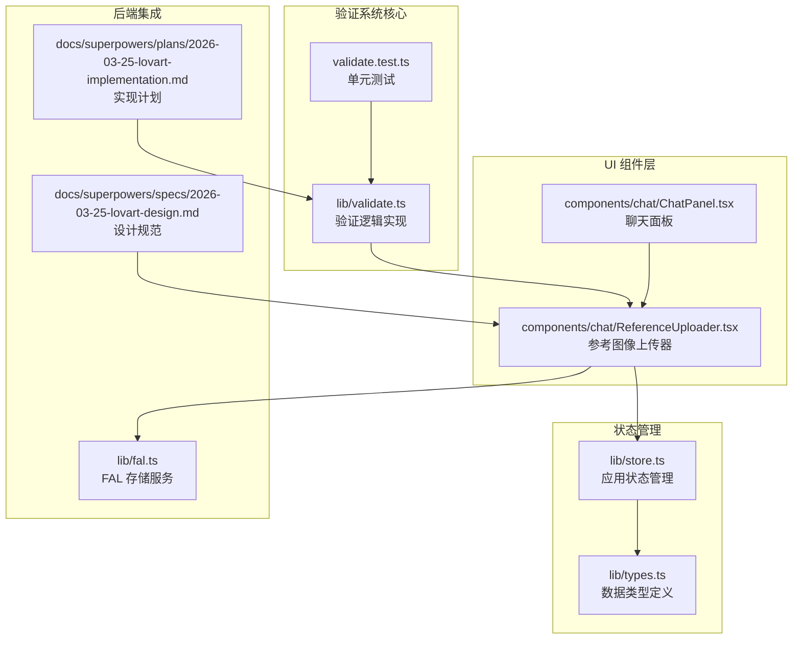
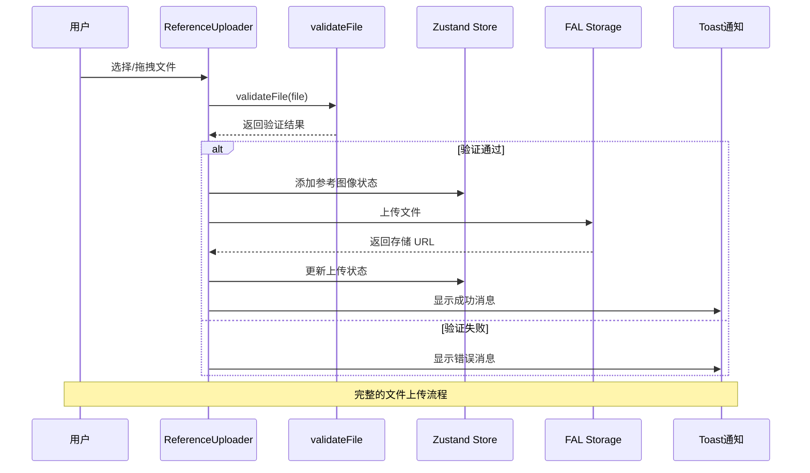
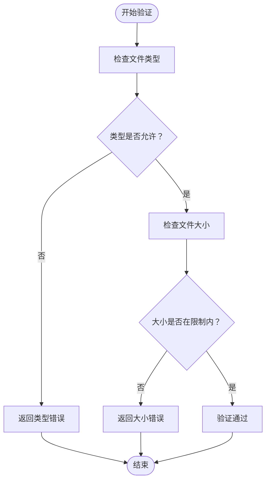
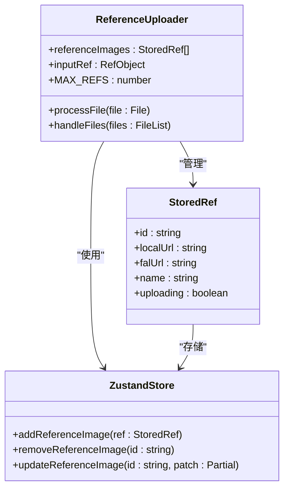

# 文件验证系统

<cite>
**本文档引用的文件**
- [validate.ts](file://lib/validate.ts)
- [validate.test.ts](file://__tests__/validate.test.ts)
- [ReferenceUploader.tsx](file://components/chat/ReferenceUploader.tsx)
- [store.ts](file://lib/store.ts)
- [types.ts](file://lib/types.ts)
- [fal.ts](file://lib/fal.ts)
- [ChatPanel.tsx](file://components/chat/ChatPanel.tsx)
- [2026-03-25-lovart-implementation.md](file://docs/superpowers/plans/2026-03-25-lovart-implementation.md)
- [2026-03-25-lovart-design.md](file://docs/superpowers/specs/2026-03-25-lovart-design.md)
</cite>

## 目录
1. [简介](#简介)
2. [项目结构](#项目结构)
3. [核心组件](#核心组件)
4. [架构概览](#架构概览)
5. [详细组件分析](#详细组件分析)
6. [依赖关系分析](#依赖关系分析)
7. [性能考虑](#性能考虑)
8. [故障排除指南](#故障排除指南)
9. [结论](#结论)
10. [附录](#附录)

## 简介

Loveart 文件验证系统是一个专门为图像上传功能设计的安全验证框架。该系统确保用户上传的文件符合预定义的格式要求和大小限制，同时提供了完整的错误处理和用户体验反馈机制。

该验证系统主要服务于 AI 创意设计平台的参考图像上传功能，支持 JPG、PNG 和 WebP 三种主流图像格式，单个文件最大尺寸限制为 10MB。系统通过前端实时验证、后端存储服务集成和完善的错误处理机制，为用户提供流畅且安全的文件上传体验。

## 项目结构

文件验证系统在项目中的组织结构如下：



**图表来源**
- [validate.ts:1-14](file://lib/validate.ts#L1-L14)
- [ReferenceUploader.tsx:1-100](file://components/chat/ReferenceUploader.tsx#L1-L100)
- [store.ts:1-119](file://lib/store.ts#L1-L119)

**章节来源**
- [validate.ts:1-14](file://lib/validate.ts#L1-L14)
- [ReferenceUploader.tsx:1-100](file://components/chat/ReferenceUploader.tsx#L1-L100)
- [store.ts:1-119](file://lib/store.ts#L1-L119)

## 核心组件

### 验证引擎 (validate.ts)

验证引擎是整个文件验证系统的核心，负责执行具体的验证逻辑。它定义了两种验证错误类型，并实现了高效的文件验证算法。

**验证规则实现：**
- **文件类型检查**：支持 JPG、PNG、WebP 三种格式
- **文件大小限制**：10MB 限制（包含边界值）
- **实时验证**：基于浏览器 File API 进行即时验证

**验证算法复杂度：**
- 时间复杂度：O(1) - 使用 Set 数据结构进行常数时间查找
- 空间复杂度：O(1) - 固定大小的允许类型集合

**章节来源**
- [validate.ts:1-14](file://lib/validate.ts#L1-L14)

### 参考图像上传器 (ReferenceUploader.tsx)

参考图像上传器是用户界面层的核心组件，负责处理用户的文件选择操作和验证结果展示。

**主要功能：**
- 文件选择和拖拽支持
- 实时验证和错误提示
- 最大文件数量限制（6张）
- 上传进度显示
- 错误恢复机制

**用户交互流程：**
1. 用户点击添加按钮或拖拽文件
2. 系统调用验证函数进行检查
3. 验证通过后显示本地预览
4. 异步上传到 FAL 存储服务
5. 更新状态并移除上传指示器

**章节来源**
- [ReferenceUploader.tsx:1-100](file://components/chat/ReferenceUploader.tsx#L1-L100)

### 应用状态管理 (store.ts)

应用状态管理模块负责维护文件上传相关的状态信息，包括参考图像列表、上传进度等。

**状态结构：**
- `referenceImages`: 存储已添加的参考图像信息
- `uploading`: 标识文件是否正在上传
- `falUrl`: FAL 存储服务返回的文件 URL
- `localUrl`: 本地对象 URL 用于预览

**章节来源**
- [store.ts:1-119](file://lib/store.ts#L1-L119)
- [types.ts:1-37](file://lib/types.ts#L1-L37)

## 架构概览

文件验证系统的整体架构采用分层设计，确保了良好的可维护性和扩展性：



**图表来源**
- [ReferenceUploader.tsx:18-41](file://components/chat/ReferenceUploader.tsx#L18-L41)
- [validate.ts:9-13](file://lib/validate.ts#L9-L13)
- [store.ts:81-92](file://lib/store.ts#L81-L92)

**章节来源**
- [ReferenceUploader.tsx:1-100](file://components/chat/ReferenceUploader.tsx#L1-L100)
- [validate.ts:1-14](file://lib/validate.ts#L1-L14)
- [store.ts:1-119](file://lib/store.ts#L1-L119)

## 详细组件分析

### 验证引擎深度分析

#### 验证规则实现

验证引擎通过两个核心检查确保文件安全性：



**图表来源**
- [validate.ts:9-13](file://lib/validate.ts#L9-L13)

#### 支持的文件格式

系统支持以下三种图像格式：
- **JPG/JPEG**: 适用于照片和复杂图像
- **PNG**: 适用于需要透明背景的图像
- **WebP**: 现代压缩格式，提供更好的压缩比

每种格式都有其特定的应用场景和优势，系统通过统一的验证接口简化了用户操作。

#### 文件大小限制

系统采用 10MB 的文件大小限制，这个限制经过精心设计：

- **技术考虑**：平衡图像质量与加载性能
- **用户体验**：避免过长的上传等待时间
- **服务器成本**：控制存储和带宽使用

**章节来源**
- [validate.ts:6-7](file://lib/validate.ts#L6-L7)

### 参考图像上传器详细分析

#### 用户界面设计

参考图像上传器采用了现代化的用户界面设计：



**图表来源**
- [ReferenceUploader.tsx:13-41](file://components/chat/ReferenceUploader.tsx#L13-L41)
- [types.ts:1-7](file://lib/types.ts#L1-L7)
- [store.ts:81-92](file://lib/store.ts#L81-L92)

#### 错误处理机制

系统实现了多层次的错误处理机制：

| 错误类型 | 触发条件 | 用户反馈 | 系统响应 |
|---------|---------|---------|---------|
| 类型错误 | 不支持的文件格式 | "仅支持 JPG/PNG/WebP" | 拒绝上传并显示错误 |
| 大小错误 | 超过 10MB 限制 | "文件不能超过 10MB" | 拒绝上传并显示错误 |
| 数量错误 | 超过 6 张限制 | "最多 6 张参考图" | 拒绝添加并显示错误 |
| 上传失败 | FAL 存储服务异常 | "上传失败" | 移除缩略图并清理资源 |

**章节来源**
- [ReferenceUploader.tsx:18-39](file://components/chat/ReferenceUploader.tsx#L18-L39)
- [2026-03-25-lovart-design.md:244-253](file://docs/superpowers/specs/2026-03-25-lovart-design.md#L244-L253)

### 状态管理系统分析

#### 数据结构设计

状态管理系统采用简洁高效的数据结构：

```mermaid
erDiagram
STORED_REF {
string id PK
string localUrl
string falUrl
string name
boolean uploading
}
CANVAS_ITEM {
string id PK
string url
string falUrl
number x
number y
number width
number height
boolean uploading
boolean placeholder
}
MESSAGE {
string id PK
string role
string content
string imageUrl
number timestamp
}
APP_STATE {
array canvasItems
array chatHistory
array referenceImages
boolean isEditingMode
object editingTarget
boolean isLoading
}
STORED_REF ||--o{ APP_STATE : "包含"
CANVAS_ITEM ||--o{ APP_STATE : "包含"
MESSAGE ||--o{ APP_STATE : "包含"
```



**图表来源**
- [types.ts:1-37](file://lib/types.ts#L1-L37)
- [store.ts:29-43](file://lib/store.ts#L29-L43)

#### 状态更新策略

系统采用不可变状态更新模式，确保状态变化的可预测性和可调试性：

- **批量更新**：通过单个状态对象管理多个子状态
- **持久化存储**：聊天历史自动持久化到本地存储
- **会话隔离**：Canvas 状态仅在当前会话中保持

**章节来源**
- [store.ts:45-118](file://lib/store.ts#L45-L118)
- [types.ts:1-37](file://lib/types.ts#L1-L37)

## 依赖关系分析

文件验证系统的依赖关系清晰明确，遵循单一职责原则：

```mermaid
graph TB
subgraph "外部依赖"
ZUSTAND[zustand<br/>状态管理库]
SONNER[sonner<br/>通知库]
FAL[@fal-ai/client<br/>AI 服务客户端]
LUCIDE[lucide-react<br/>图标库]
end
subgraph "内部模块"
VALIDATE[validate.ts<br/>验证逻辑]
UPLOADER[ReferenceUploader.tsx<br/>上传组件]
STORE[store.ts<br/>状态管理]
TYPES[types.ts<br/>类型定义]
FAL_SERVICE[fal.ts<br/>存储服务]
end
VALIDATE --> TYPES
UPLOADER --> VALIDATE
UPLOADER --> STORE
UPLOADER --> FAL_SERVICE
UPLOADER --> SONNER
UPLOADER --> LUCIDE
STORE --> ZUSTAND
FAL_SERVICE --> FAL
UPLOADER --> TYPES
```

**图表来源**
- [validate.ts:1-14](file://lib/validate.ts#L1-L14)
- [ReferenceUploader.tsx:1-10](file://components/chat/ReferenceUploader.tsx#L1-L10)
- [store.ts:1-3](file://lib/store.ts#L1-L3)

**章节来源**
- [validate.ts:1-14](file://lib/validate.ts#L1-L14)
- [ReferenceUploader.tsx:1-10](file://components/chat/ReferenceUploader.tsx#L1-L10)
- [store.ts:1-3](file://lib/store.ts#L1-L3)

## 性能考虑

### 验证性能优化

文件验证系统在性能方面采用了多项优化策略：

- **Set 数据结构**：使用 Set 进行 O(1) 时间复杂度的类型检查
- **内存效率**：避免不必要的文件内容读取，仅检查元数据
- **异步处理**：上传过程完全异步，不影响用户界面响应

### 内存管理

系统特别关注内存使用情况：

- **对象 URL 管理**：及时清理本地预览 URL，防止内存泄漏
- **状态清理**：上传失败时自动清理相关状态和资源
- **图片预览**：使用 Blob URL 提供快速预览，避免重复下载

### 网络优化

- **CDN 集成**：FAL 存储服务提供全球 CDN 加速
- **并发控制**：限制同时上传的文件数量（6 个）
- **断点续传**：支持网络中断后的重新上传

## 故障排除指南

### 常见问题及解决方案

#### 文件类型不被支持

**问题症状**：上传任何文件都显示 "仅支持 JPG/PNG/WebP"

**可能原因**：
- 浏览器报告的 MIME 类型不正确
- 文件扩展名与实际内容不匹配
- 系统配置问题

**解决步骤**：
1. 检查文件扩展名是否正确
2. 验证文件是否为真实图像格式
3. 尝试重新保存文件
4. 清除浏览器缓存后重试

#### 文件大小超限

**问题症状**：文件小于 10MB 但仍被拒绝

**可能原因**：
- 文件实际大小超过限制
- 边界值处理问题
- 缓冲区计算错误

**解决步骤**：
1. 使用文件管理器确认实际文件大小
2. 压缩图像文件
3. 转换为更高效的格式
4. 分割大文件（如适用）

#### 上传失败

**问题症状**：文件通过验证但上传过程中失败

**可能原因**：
- 网络连接不稳定
- FAL 服务暂时不可用
- 存储配额不足

**解决步骤**：
1. 检查网络连接状态
2. 稍后重试上传
3. 清理浏览器缓存
4. 联系技术支持

### 调试技巧

#### 开发者工具使用

1. **网络面板**：监控上传请求和响应
2. **控制台**：查看 JavaScript 错误和警告
3. **应用面板**：检查本地存储状态
4. **源码面板**：设置断点调试验证逻辑

#### 日志记录

系统会在关键节点输出调试信息：
- 验证开始和结束
- 状态更新事件
- 错误发生位置
- 性能指标收集

**章节来源**
- [2026-03-25-lovart-design.md:244-253](file://docs/superpowers/specs/2026-03-25-lovart-design.md#L244-L253)

## 结论

Loveart 文件验证系统是一个设计精良、实现优雅的文件上传安全保障框架。系统通过严格的验证规则、友好的用户界面和完善的错误处理机制，为用户提供了可靠的文件上传体验。

**系统优势总结：**
- **安全性**：双重验证（类型+大小）确保文件安全
- **性能**：高效的验证算法和异步处理
- **用户体验**：即时反馈和直观的操作界面
- **可维护性**：清晰的代码结构和完整的测试覆盖
- **可扩展性**：模块化设计便于功能扩展

该系统为 AI 创意设计平台的参考图像上传功能提供了坚实的技术基础，确保了平台的整体质量和用户体验。

## 附录

### 自定义验证规则实现指南

要扩展验证系统以支持新的文件类型或修改现有规则，可以按照以下步骤进行：

#### 步骤 1：修改验证规则

在 `validate.ts` 中修改允许的文件类型集合：

```typescript
// 示例：添加 HEIC 支持
const ALLOWED_TYPES = new Set([
  "image/jpeg", 
  "image/png", 
  "image/webp",
  "image/heic"  // 新增类型
])
```

#### 步骤 2：更新错误消息

在 `ValidationError` 枚举中添加相应的错误消息：

```typescript
export enum ValidationError {
  InvalidType = "仅支持 JPG/PNG/WebP/HEIC 格式",
  TooLarge = "文件不能超过 10MB",
}
```

#### 步骤 3：更新 UI 配置

修改 `ReferenceUploader.tsx` 中的 accept 属性：

```typescript
<input
  type="file"
  accept="image/jpeg,image/png,image/webp,image/heic"
  multiple
  className="hidden"
/>
```

#### 步骤 4：编写测试用例

在 `validate.test.ts` 中添加新的测试场景：

```typescript
it("accepts valid HEIC", () => {
  const file = makeFile("photo.heic", "image/heic", 500)
  expect(validateFile(file)).toBeNull()
})
```

### 最佳实践建议

#### 开发最佳实践

1. **输入验证**：始终在客户端和服务器端进行双重验证
2. **错误处理**：提供清晰的错误消息和恢复选项
3. **性能监控**：定期检查验证性能和用户体验
4. **安全审计**：定期审查验证规则和安全措施
5. **用户反馈**：及时提供上传进度和状态更新

#### 用户体验优化

1. **即时反馈**：验证结果应在用户操作后立即显示
2. **进度指示**：大文件上传时提供详细的进度信息
3. **错误指导**：提供具体的错误原因和解决建议
4. **离线支持**：在网络不佳时提供合理的降级方案
5. **无障碍访问**：确保所有用户都能正常使用验证功能