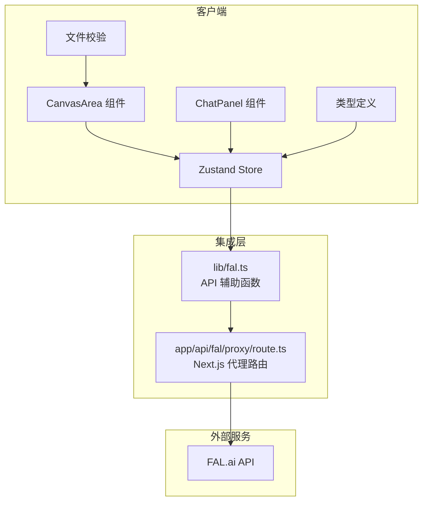
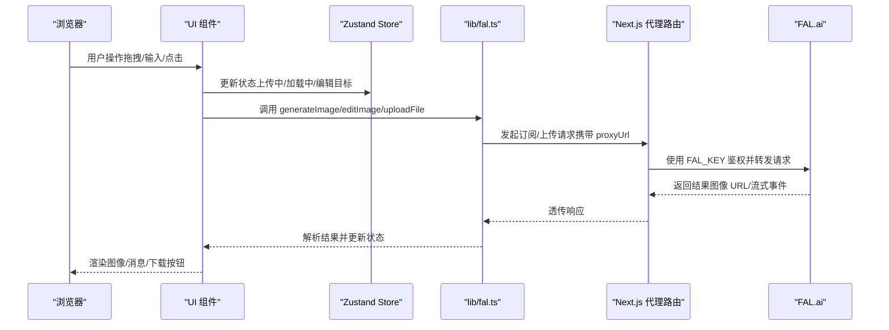
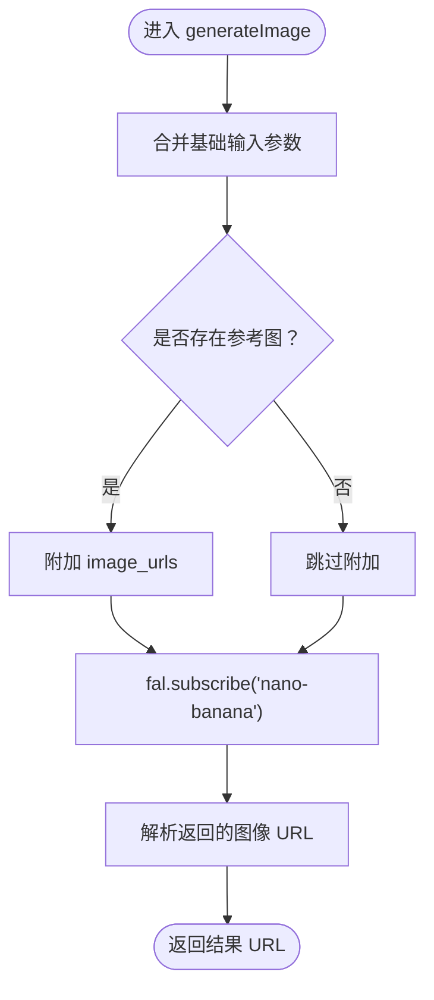
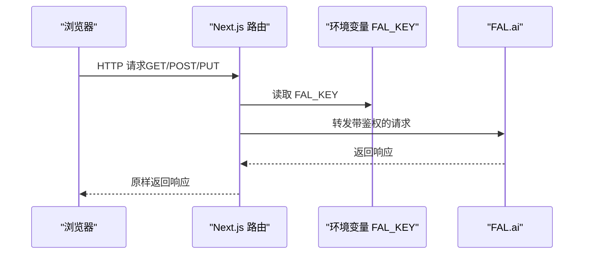
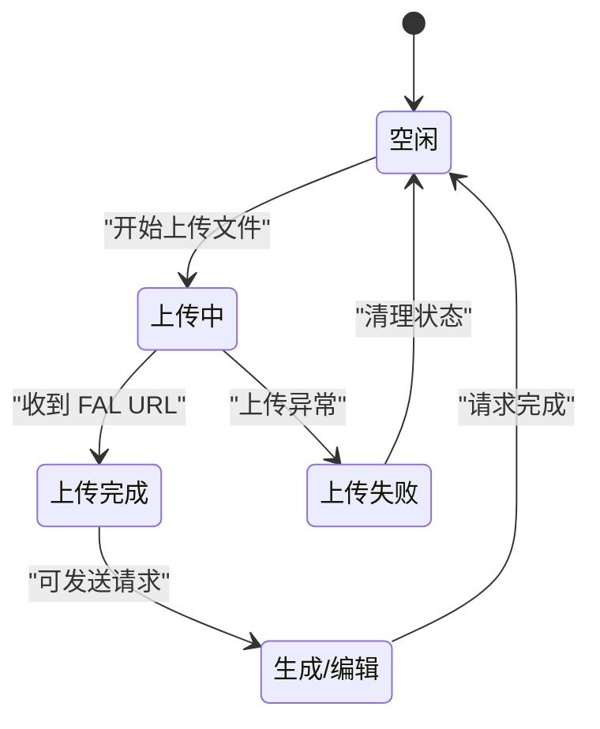
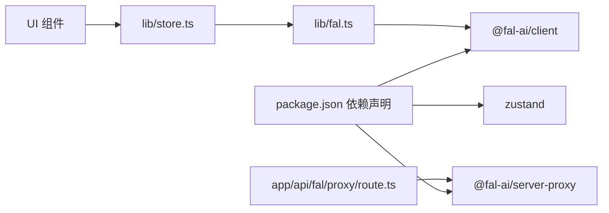

# API 集成架构

<cite>
**本文档引用的文件**
- [lib/fal.ts](file://lib/fal.ts)
- [app/api/fal/proxy/route.ts](file://app/api/fal/proxy/route.ts)
- [lib/store.ts](file://lib/store.ts)
- [lib/types.ts](file://lib/types.ts)
- [lib/validate.ts](file://lib/validate.ts)
- [components/canvas/CanvasArea.tsx](file://components/canvas/CanvasArea.tsx)
- [components/chat/ChatPanel.tsx](file://components/chat/ChatPanel.tsx)
- [package.json](file://package.json)
- [docs/superpowers/specs/2026-03-25-lovart-design.md](file://docs/superpowers/specs/2026-03-25-lovart-design.md)
- [docs/superpowers/plans/2026-03-25-lovart-implementation.md](file://docs/superpowers/plans/2026-03-25-lovart-implementation.md)
- [__tests__/fal.test.ts](file://__tests__/fal.test.ts)
</cite>

## 目录
1. [简介](#简介)
2. [项目结构](#项目结构)
3. [核心组件](#核心组件)
4. [架构总览](#架构总览)
5. [详细组件分析](#详细组件分析)
6. [依赖关系分析](#依赖关系分析)
7. [性能考量](#性能考量)
8. [故障排查指南](#故障排查指南)
9. [结论](#结论)
10. [附录](#附录)

## 简介
本文件系统性阐述 Loveart 项目基于 FAL.ai 的第三方 API 集成架构，重点覆盖以下方面：
- 基于 @fal-ai/client 的 API 客户端封装与调用流程
- Next.js API 路由作为代理（Proxy）的设计与实现
- 请求转发、密钥保护与错误处理机制
- 异步任务处理、轮询与实时通信的实现方式
- 重试策略、超时处理与并发控制
- 安全考虑：密钥管理、请求签名与访问控制
- 监控方案与故障排查指南

## 项目结构
Loveart 采用 Next.js App Router 架构，API 集成主要分布在以下模块：
- 客户端封装层：lib/fal.ts 提供 generateImage、editImage、uploadFile 等 API 辅助函数
- 代理路由层：app/api/fal/proxy/route.ts 将浏览器请求转发至 FAL.ai，并使用服务器端密钥进行鉴权
- 状态管理层：lib/store.ts 使用 Zustand 管理画布、聊天历史与上传状态
- 类型定义层：lib/types.ts 定义应用数据模型
- 文件校验层：lib/validate.ts 对上传文件类型与大小进行前端校验
- UI 展示层：components/canvas/CanvasArea.tsx 与 components/chat/ChatPanel.tsx 负责用户交互与状态驱动

图表来源
- [lib/fal.ts:1-62](file://lib/fal.ts#L1-L62)
- [app/api/fal/proxy/route.ts:1-4](file://app/api/fal/proxy/route.ts#L1-L4)
- [lib/store.ts:1-119](file://lib/store.ts#L1-L119)
- [lib/types.ts:1-37](file://lib/types.ts#L1-L37)
- [lib/validate.ts:1-14](file://lib/validate.ts#L1-L14)
- [components/canvas/CanvasArea.tsx:1-431](file://components/canvas/CanvasArea.tsx#L1-L431)
- [components/chat/ChatPanel.tsx:1-22](file://components/chat/ChatPanel.tsx#L1-L22)

章节来源
- [package.json:1-48](file://package.json#L1-L48)
- [docs/superpowers/specs/2026-03-25-lovart-design.md:1-295](file://docs/superpowers/specs/2026-03-25-lovart-design.md#L1-L295)

## 核心组件
- API 客户端封装（lib/fal.ts）
  - 通过 @fal-ai/client 的订阅接口发起异步生成与编辑请求
  - 统一封装生成与编辑的输入参数与默认值
  - 提供文件上传能力，返回可长期使用的存储 URL
- 代理路由（app/api/fal/proxy/route.ts）
  - 基于 @fal-ai/server-proxy/nextjs 创建 Next.js 路由处理器
  - 以服务器端环境变量 FAL_KEY 进行密钥鉴权
  - 暴露 GET/POST/PUT 方法，统一转发所有 FAL.ai 请求
- 状态管理（lib/store.ts）
  - 使用 Zustand + persist 中间件管理画布项、参考图、聊天历史等
  - 控制上传状态、加载状态与编辑模式，保障 UI 一致性
- 数据模型（lib/types.ts）
  - 定义 CanvasItem、StoredRef、Message 等核心类型
  - 明确字段含义与生命周期（如 falUrl 的可用性）
- 文件校验（lib/validate.ts）
  - 限制文件类型（JPG/PNG/WebP）与大小（≤10MB）
  - 在上传前进行快速校验，减少无效请求

章节来源
- [lib/fal.ts:1-62](file://lib/fal.ts#L1-L62)
- [app/api/fal/proxy/route.ts:1-4](file://app/api/fal/proxy/route.ts#L1-L4)
- [lib/store.ts:1-119](file://lib/store.ts#L1-L119)
- [lib/types.ts:1-37](file://lib/types.ts#L1-L37)
- [lib/validate.ts:1-14](file://lib/validate.ts#L1-L14)

## 架构总览
下图展示了从浏览器到 FAL.ai 的完整调用链路，以及各组件间的交互关系。

图表来源
- [lib/fal.ts:1-62](file://lib/fal.ts#L1-L62)
- [app/api/fal/proxy/route.ts:1-4](file://app/api/fal/proxy/route.ts#L1-L4)
- [lib/store.ts:1-119](file://lib/store.ts#L1-L119)
- [components/canvas/CanvasArea.tsx:1-431](file://components/canvas/CanvasArea.tsx#L1-L431)

## 详细组件分析

### API 客户端封装（lib/fal.ts）
- 客户端配置
  - 通过 proxyUrl 指向 /api/fal/proxy，使浏览器请求经由 Next.js 代理路由转发
- 生成图像（generateImage）
  - 合并基础输入参数与用户提示词
  - 可选地附加参考图 URL 数组
  - 通过 fal.subscribe 订阅模型输出，解析返回的图像 URL
- 编辑图像（editImage）
  - 固定目标图 URL 位于 image_urls 首位，确保编辑优先作用于目标图
  - 其余参考图按顺序附加
- 文件上传（uploadFile）
  - 使用 fal.storage.upload 将本地文件上传至 FAL 存储，返回可长期使用的 URL

图表来源
- [lib/fal.ts:21-38](file://lib/fal.ts#L21-L38)

章节来源
- [lib/fal.ts:1-62](file://lib/fal.ts#L1-L62)

### 代理路由（app/api/fal/proxy/route.ts）
- 路由处理器
  - 使用 @fal-ai/server-proxy/nextjs 的 createRouteHandler 创建统一的路由处理器
  - 暴露 GET/POST/PUT 方法，适配不同类型的请求
- 密钥保护
  - 通过环境变量 FAL_KEY 进行服务器端鉴权
  - 密钥不暴露给浏览器，避免泄露风险
- 请求转发
  - 接收来自客户端的请求，转发至 FAL.ai
  - 保持请求体与头部的完整性，确保流式响应正确传递

图表来源
- [app/api/fal/proxy/route.ts:1-4](file://app/api/fal/proxy/route.ts#L1-L4)
- [docs/superpowers/specs/2026-03-25-lovart-design.md:132-147](file://docs/superpowers/specs/2026-03-25-lovart-design.md#L132-L147)

章节来源
- [app/api/fal/proxy/route.ts:1-4](file://app/api/fal/proxy/route.ts#L1-L4)
- [docs/superpowers/specs/2026-03-25-lovart-design.md:132-147](file://docs/superpowers/specs/2026-03-25-lovart-design.md#L132-L147)

### 状态管理与 UI 协作（lib/store.ts、components/canvas/CanvasArea.tsx）
- 状态切片
  - 画布项、参考图、编辑目标、加载状态等
  - 使用 persist 中间件仅持久化聊天历史，避免存储短期有效的 FAL URL
- UI 协作
  - CanvasArea 在拖拽/上传后更新状态，触发上传流程
  - 上传成功后回填 falUrl，解除上传锁定，允许继续生成/编辑
- 错误处理
  - 上传失败时弹出提示并清理状态，防止后续调用使用空 URL

图表来源
- [lib/store.ts:1-119](file://lib/store.ts#L1-L119)
- [components/canvas/CanvasArea.tsx:306-340](file://components/canvas/CanvasArea.tsx#L306-L340)

章节来源
- [lib/store.ts:1-119](file://lib/store.ts#L1-L119)
- [components/canvas/CanvasArea.tsx:1-431](file://components/canvas/CanvasArea.tsx#L1-L431)

### 数据模型与文件校验（lib/types.ts、lib/validate.ts）
- 数据模型
  - CanvasItem：包含显示 URL、FAL CDN URL、尺寸、上传状态与占位标记
  - StoredRef：参考图的本地与远端 URL、名称与上传状态
  - Message：消息内容、角色与可选的图像 URL
- 文件校验
  - 限制类型与大小，提前拦截无效文件，降低后端压力

章节来源
- [lib/types.ts:1-37](file://lib/types.ts#L1-L37)
- [lib/validate.ts:1-14](file://lib/validate.ts#L1-L14)

### 测试验证（__tests__/fal.test.ts）
- 行为验证
  - generateImage 调用时正确拼接输入参数与可选的 image_urls
  - editImage 将目标图 URL 置于 image_urls 首位
- 模拟与断言
  - 通过 vi.mock 对 @fal-ai/client 进行模拟，确保测试稳定可靠

章节来源
- [__tests__/fal.test.ts:1-61](file://__tests__/fal.test.ts#L1-L61)

## 依赖关系分析
- 外部依赖
  - @fal-ai/client：提供订阅接口与存储上传能力
  - @fal-ai/server-proxy：提供 Next.js 代理路由能力
  - zustand：轻量状态管理，配合 persist 实现本地持久化
- 内部耦合
  - lib/fal.ts 依赖 @fal-ai/client 并通过代理路由进行转发
  - app/api/fal/proxy/route.ts 依赖 @fal-ai/server-proxy 并读取 FAL_KEY
  - UI 组件通过 Zustand 管理状态，间接依赖 lib/fal.ts 的 API 能力

图表来源
- [package.json:11-30](file://package.json#L11-L30)
- [lib/fal.ts:1](file://lib/fal.ts#L1)
- [app/api/fal/proxy/route.ts:1](file://app/api/fal/proxy/route.ts#L1)
- [lib/store.ts:1](file://lib/store.ts#L1)

章节来源
- [package.json:1-48](file://package.json#L1-L48)

## 性能考量
- 请求转发与代理
  - 通过 Next.js 代理路由集中处理鉴权与转发，减少浏览器直连外部 API 的复杂度
- 并发控制
  - 当前实现未显式设置并发上限；建议在业务层限制同时进行的生成/编辑请求数量，避免资源争用
- 超时与重试
  - 未实现显式的超时与重试逻辑；可在 lib/fal.ts 中引入超时控制与指数退避重试，提升稳定性
- 流式响应
  - FAL.ai 支持流式事件；当前实现通过订阅接口接收结果；若需更细粒度的进度反馈，可扩展事件解析与 UI 更新

## 故障排查指南
- 无法生成/编辑图像
  - 检查 FAL_KEY 是否正确配置且未暴露至浏览器
  - 确认代理路由已部署并可访问
  - 查看浏览器网络面板，确认请求是否被代理路由正确转发
- 上传失败
  - 校验文件类型与大小是否符合 lib/validate.ts 的限制
  - 观察 UI 是否显示“上传失败”提示并清理了对应状态
- 结果 URL 404 或失效
  - FAL CDN URL 通常有有效期；避免将短期 URL 持久化至本地存储
  - 重新上传获取新 URL，或在需要时重新生成
- 并发请求导致资源竞争
  - 通过 UI 状态（isLoading、uploading）进行防抖与互斥控制
  - 必要时在 lib/fal.ts 中增加队列与重试机制

章节来源
- [docs/superpowers/specs/2026-03-25-lovart-design.md:244-254](file://docs/superpowers/specs/2026-03-25-lovart-design.md#L244-L254)
- [lib/validate.ts:1-14](file://lib/validate.ts#L1-L14)
- [lib/store.ts:1-119](file://lib/store.ts#L1-L119)

## 结论
Loveart 的 API 集成采用“客户端封装 + Next.js 代理路由 + 服务器端密钥”的安全模式，既满足了浏览器侧的易用性，又通过服务器端鉴权避免了密钥泄露风险。当前实现具备清晰的职责分离与良好的可测试性。为进一步提升稳定性与用户体验，建议补充超时与重试策略、并发控制与更细粒度的流式事件处理。

## 附录
- 环境变量
  - FAL_KEY：FAL.ai API 密钥，服务器端使用，不暴露给浏览器
- 设计文档要点
  - 代理路由与客户端配置的对应关系
  - 状态持久化范围与上传 URL 生命周期
  - UI 交互与状态联动规则

章节来源
- [docs/superpowers/specs/2026-03-25-lovart-design.md:290-295](file://docs/superpowers/specs/2026-03-25-lovart-design.md#L290-L295)
- [docs/superpowers/plans/2026-03-25-lovart-implementation.md:295-324](file://docs/superpowers/plans/2026-03-25-lovart-implementation.md#L295-L324)