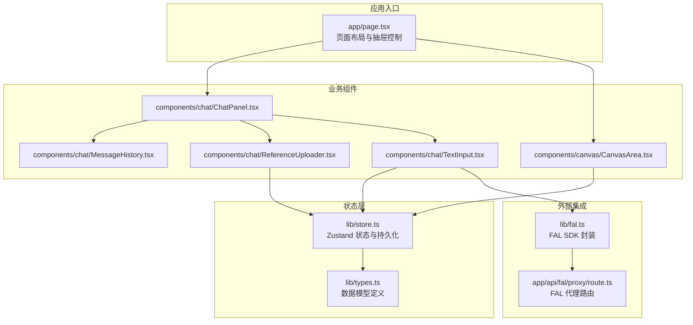
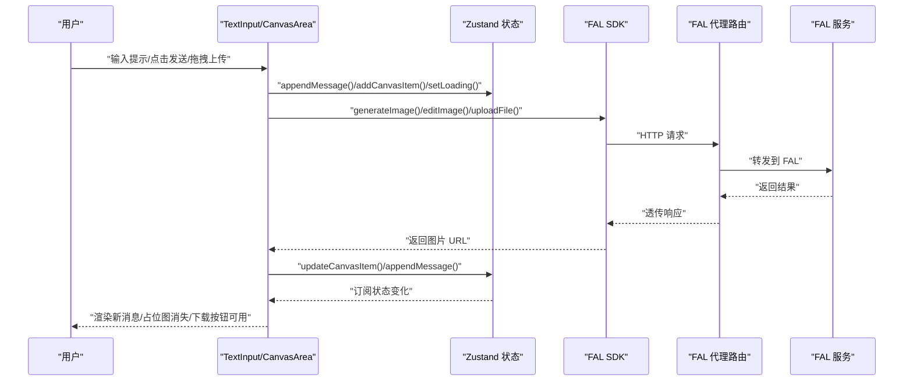
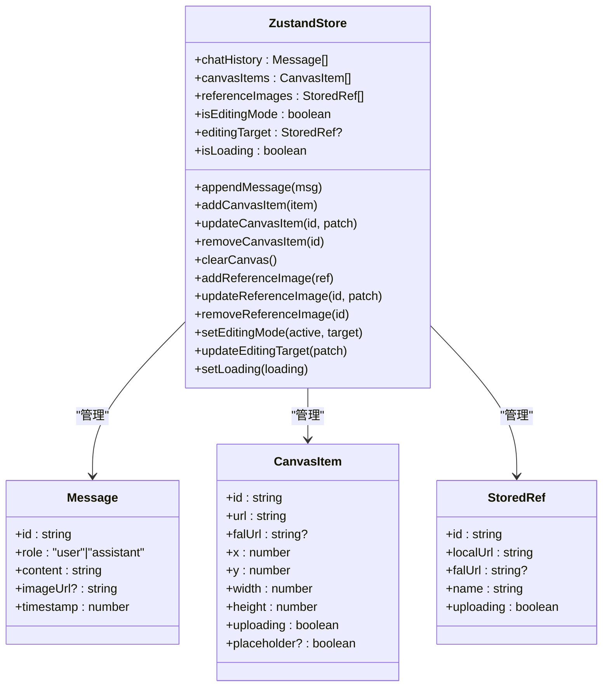
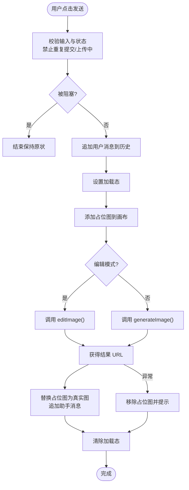
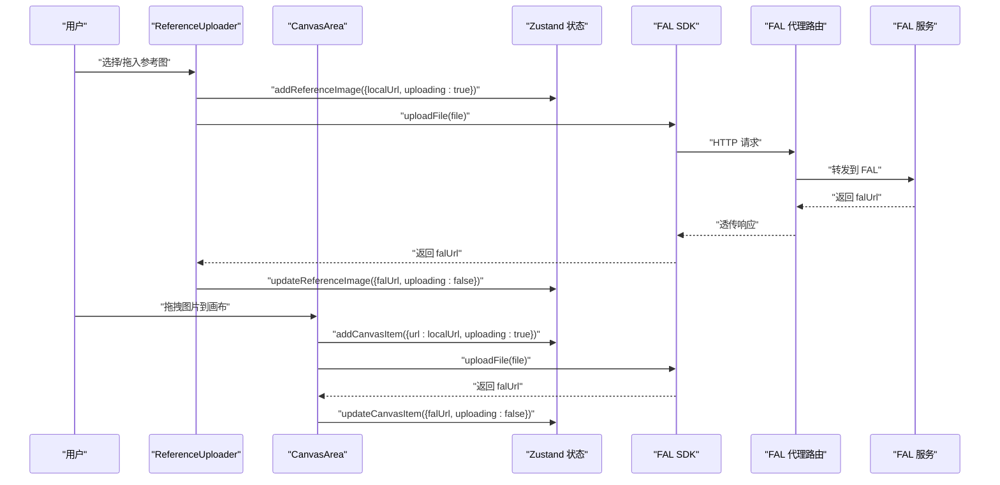
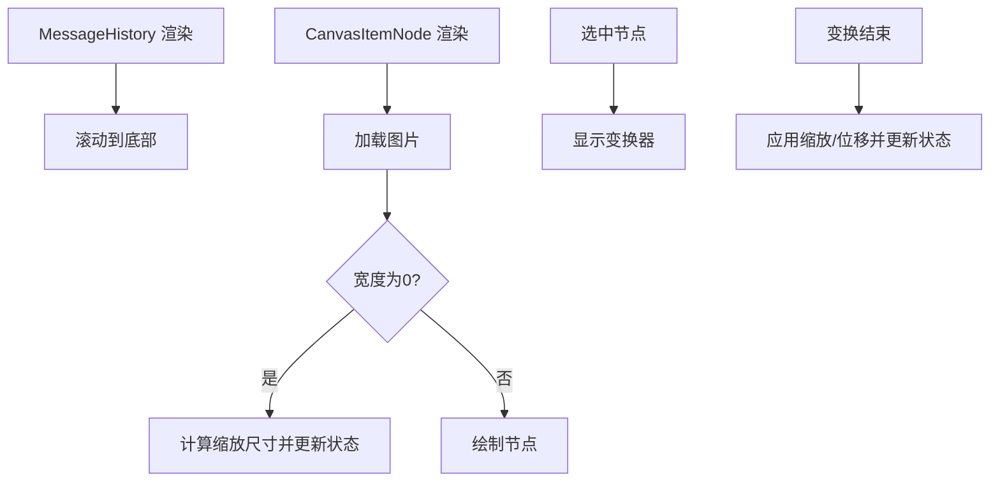
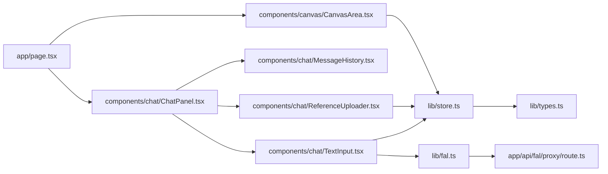

# 数据流架构

<cite>
**本文引用的文件**
- [README.md](file://README.md)
- [app/page.tsx](file://app/page.tsx)
- [app/api/fal/proxy/route.ts](file://app/api/fal/proxy/route.ts)
- [lib/types.ts](file://lib/types.ts)
- [lib/store.ts](file://lib/store.ts)
- [lib/fal.ts](file://lib/fal.ts)
- [lib/validate.ts](file://lib/validate.ts)
- [components/canvas/CanvasArea.tsx](file://components/canvas/CanvasArea.tsx)
- [components/chat/ChatPanel.tsx](file://components/chat/ChatPanel.tsx)
- [components/chat/MessageHistory.tsx](file://components/chat/MessageHistory.tsx)
- [components/chat/ReferenceUploader.tsx](file://components/chat/ReferenceUploader.tsx)
- [components/chat/TextInput.tsx](file://components/chat/TextInput.tsx)
- [__tests__/store.test.ts](file://__tests__/store.test.ts)
- [__tests__/validate.test.ts](file://__tests__/validate.test.ts)
</cite>

## 目录
1. [简介](#简介)
2. [项目结构](#项目结构)
3. [核心组件](#核心组件)
4. [架构总览](#架构总览)
5. [详细组件分析](#详细组件分析)
6. [依赖关系分析](#依赖关系分析)
7. [性能考量](#性能考量)
8. [故障排查指南](#故障排查指南)
9. [结论](#结论)
10. [附录](#附录)

## 简介
本文件系统化梳理 Loveart 项目的数据流架构，覆盖从用户输入到状态更新、再到 UI 渲染的完整路径；解释同步与异步数据流的协同机制（API 调用、状态更新、UI 响应）；阐述本地持久化与会话状态管理、上传与生成流程中的数据流转；说明错误处理与重试策略在数据流中的位置与作用；并给出性能监控、瓶颈识别与优化建议，以及可测试性与可观测性设计方案。

## 项目结构
项目采用 Next.js App Router 结构，前端以组件驱动状态与渲染，状态通过 Zustand 管理，图像生成与存储通过 FAL SDK 与代理路由对接后端服务。页面布局由主页面组件负责，聊天与画布两大功能区通过共享状态协同工作。

图表来源
- [app/page.tsx:1-59](file://app/page.tsx#L1-L59)
- [lib/store.ts:1-119](file://lib/store.ts#L1-L119)
- [lib/types.ts:1-37](file://lib/types.ts#L1-L37)
- [components/chat/ChatPanel.tsx:1-22](file://components/chat/ChatPanel.tsx#L1-L22)
- [components/chat/MessageHistory.tsx:1-37](file://components/chat/MessageHistory.tsx#L1-L37)
- [components/chat/ReferenceUploader.tsx:1-100](file://components/chat/ReferenceUploader.tsx#L1-L100)
- [components/chat/TextInput.tsx:1-140](file://components/chat/TextInput.tsx#L1-L140)
- [components/canvas/CanvasArea.tsx:1-431](file://components/canvas/CanvasArea.tsx#L1-L431)
- [lib/fal.ts:1-62](file://lib/fal.ts#L1-L62)
- [app/api/fal/proxy/route.ts:1-4](file://app/api/fal/proxy/route.ts#L1-L4)

章节来源
- [README.md:1-37](file://README.md#L1-L37)
- [app/page.tsx:1-59](file://app/page.tsx#L1-L59)

## 核心组件
- 状态存储：使用 Zustand 管理会话态与持久化态，提供画布项、参考图、消息历史、编辑模式与加载态等字段，并封装增删改查操作。
- 数据模型：定义 CanvasItem、StoredRef、Message 等类型，统一状态与 UI 的数据契约。
- 业务组件：
  - CanvasArea：画布交互、拖拽上传、占位图、缩放平移、选择与编辑。
  - ChatPanel：聊天容器，组合消息历史、参考图上传器与输入框。
  - MessageHistory：滚动至底部的消息列表展示。
  - ReferenceUploader：参考图上传与预览，限制数量与格式校验。
  - TextInput：根据是否处于编辑模式决定调用生成或编辑接口，维护占位图与最终结果。
- 外部集成：FAL SDK 封装生成与编辑接口，代理路由转发请求，避免客户端直连密钥。

章节来源
- [lib/store.ts:1-119](file://lib/store.ts#L1-L119)
- [lib/types.ts:1-37](file://lib/types.ts#L1-L37)
- [components/canvas/CanvasArea.tsx:1-431](file://components/canvas/CanvasArea.tsx#L1-L431)
- [components/chat/ChatPanel.tsx:1-22](file://components/chat/ChatPanel.tsx#L1-L22)
- [components/chat/MessageHistory.tsx:1-37](file://components/chat/MessageHistory.tsx#L1-L37)
- [components/chat/ReferenceUploader.tsx:1-100](file://components/chat/ReferenceUploader.tsx#L1-L100)
- [components/chat/TextInput.tsx:1-140](file://components/chat/TextInput.tsx#L1-L140)
- [lib/fal.ts:1-62](file://lib/fal.ts#L1-L62)
- [app/api/fal/proxy/route.ts:1-4](file://app/api/fal/proxy/route.ts#L1-L4)

## 架构总览
下图展示从用户输入到 UI 渲染的端到端数据流，包括同步状态更新与异步 API 调用的时序协调。

图表来源
- [components/chat/TextInput.tsx:34-89](file://components/chat/TextInput.tsx#L34-L89)
- [components/canvas/CanvasArea.tsx:306-340](file://components/canvas/CanvasArea.tsx#L306-L340)
- [lib/fal.ts:21-61](file://lib/fal.ts#L21-L61)
- [app/api/fal/proxy/route.ts:1-4](file://app/api/fal/proxy/route.ts#L1-L4)
- [lib/store.ts:94-100](file://lib/store.ts#L94-L100)

## 详细组件分析

### 状态层：Zustand Store
- 分片设计：将持久化（聊天历史）与会话态（画布、参考图、编辑模式、加载态）分离，减少不必要的持久化开销。
- 持久化策略：使用本地安全包装器与部分序列化，仅持久化必要字段，避免异常导致整个存储失效。
- 动作函数：提供对画布项、参考图、消息历史的原子级更新，保证 UI 可预测地响应状态变更。
- 性能要点：通过局部选择器订阅，降低无关组件重渲染频率。

图表来源
- [lib/store.ts:19-119](file://lib/store.ts#L19-L119)
- [lib/types.ts:9-37](file://lib/types.ts#L9-L37)

章节来源
- [lib/store.ts:1-119](file://lib/store.ts#L1-L119)
- [lib/types.ts:1-37](file://lib/types.ts#L1-L37)

### 输入到状态：聊天输入与占位图
- 用户输入触发：TextInput 订阅状态，阻止在上传或加载中提交；向消息历史追加用户消息并设置加载态。
- 占位图策略：在执行生成/编辑前插入占位图，确保 UI 及时反馈；成功后替换为真实 URL。
- 编辑/生成分支：根据是否处于编辑模式与是否存在目标图，选择编辑或生成接口。
- 错误处理：捕获网络与业务异常，清理占位图并提示用户。

图表来源
- [components/chat/TextInput.tsx:34-89](file://components/chat/TextInput.tsx#L34-L89)
- [lib/fal.ts:21-57](file://lib/fal.ts#L21-L57)
- [lib/store.ts:94-100](file://lib/store.ts#L94-L100)

章节来源
- [components/chat/TextInput.tsx:1-140](file://components/chat/TextInput.tsx#L1-L140)
- [lib/fal.ts:1-62](file://lib/fal.ts#L1-L62)

### 上传与预览：参考图与画布拖拽
- 参考图上传：ReferenceUploader 校验文件类型与大小，创建本地预览 URL，先写入状态再异步上传，成功后回填远端 URL。
- 画布拖拽上传：CanvasArea 支持拖拽图片到画布，创建本地 URL 与占位项，随后上传并更新状态。
- 错误处理：上传失败时撤销本地 URL、移除临时条目并提示。

图表来源
- [components/chat/ReferenceUploader.tsx:18-41](file://components/chat/ReferenceUploader.tsx#L18-L41)
- [components/canvas/CanvasArea.tsx:306-340](file://components/canvas/CanvasArea.tsx#L306-L340)
- [lib/fal.ts:59-61](file://lib/fal.ts#L59-L61)
- [app/api/fal/proxy/route.ts:1-4](file://app/api/fal/proxy/route.ts#L1-L4)

章节来源
- [components/chat/ReferenceUploader.tsx:1-100](file://components/chat/ReferenceUploader.tsx#L1-L100)
- [components/canvas/CanvasArea.tsx:1-431](file://components/canvas/CanvasArea.tsx#L1-L431)
- [lib/validate.ts:1-14](file://lib/validate.ts#L1-L14)

### UI 渲染与交互：消息历史与画布节点
- 消息历史：MessageHistory 自动滚动到底部，保证最新消息可见。
- 画布节点：CanvasItemNode 在图片加载完成后按比例计算尺寸并更新状态；选中时显示变换器，支持拖拽与等比缩放。
- 编辑模式：CanvasArea 根据编辑目标切换 UI 行为，禁用占位与上传中的元素交互。

图表来源
- [components/chat/MessageHistory.tsx:12-14](file://components/chat/MessageHistory.tsx#L12-L14)
- [components/canvas/CanvasArea.tsx:85-102](file://components/canvas/CanvasArea.tsx#L85-L102)
- [components/canvas/CanvasArea.tsx:141-155](file://components/canvas/CanvasArea.tsx#L141-L155)

章节来源
- [components/chat/MessageHistory.tsx:1-37](file://components/chat/MessageHistory.tsx#L1-L37)
- [components/canvas/CanvasArea.tsx:1-431](file://components/canvas/CanvasArea.tsx#L1-L431)

## 依赖关系分析
- 组件依赖：页面组件依赖聊天与画布组件；聊天组件内部进一步拆分消息历史、参考上传器与输入框；画布组件依赖状态与验证工具。
- 状态依赖：所有 UI 组件通过状态选择器订阅所需字段，避免全局重渲染。
- 外部依赖：FAL SDK 通过代理路由访问，避免前端直接暴露密钥；上传与生成接口在 lib/fal.ts 中统一封装。
- 类型依赖：lib/types.ts 提供强类型约束，确保状态与 UI 的一致性。

图表来源
- [app/page.tsx:1-59](file://app/page.tsx#L1-L59)
- [components/chat/ChatPanel.tsx:1-22](file://components/chat/ChatPanel.tsx#L1-L22)
- [components/chat/MessageHistory.tsx:1-37](file://components/chat/MessageHistory.tsx#L1-L37)
- [components/chat/ReferenceUploader.tsx:1-100](file://components/chat/ReferenceUploader.tsx#L1-L100)
- [components/chat/TextInput.tsx:1-140](file://components/chat/TextInput.tsx#L1-L140)
- [components/canvas/CanvasArea.tsx:1-431](file://components/canvas/CanvasArea.tsx#L1-L431)
- [lib/store.ts:1-119](file://lib/store.ts#L1-L119)
- [lib/types.ts:1-37](file://lib/types.ts#L1-L37)
- [lib/fal.ts:1-62](file://lib/fal.ts#L1-L62)
- [app/api/fal/proxy/route.ts:1-4](file://app/api/fal/proxy/route.ts#L1-L4)

章节来源
- [lib/store.ts:1-119](file://lib/store.ts#L1-L119)
- [lib/types.ts:1-37](file://lib/types.ts#L1-L37)
- [lib/fal.ts:1-62](file://lib/fal.ts#L1-L62)
- [app/api/fal/proxy/route.ts:1-4](file://app/api/fal/proxy/route.ts#L1-L4)

## 性能考量
- 同步更新的局部性：状态动作均为原子更新，配合选择器订阅，避免全量重渲染。
- 异步更新的节流：通过 isLoading 与上传中标志位阻断并发提交，减少无效请求与状态抖动。
- 图像加载优化：首次渲染时按比例计算尺寸并更新状态，避免后续重排；占位图使用动画提升感知性能。
- 代理路由：通过 Next.js 路由处理器转发请求，减少跨域与密钥泄露风险，同时便于日志与限流。
- 存储安全：本地存储包装器在异常时静默失败，避免影响主流程；仅持久化必要字段，降低体积与解析成本。
- 建议优化：
  - 对高频状态更新（如拖拽事件）增加节流/防抖。
  - 对消息历史与画布项引入分页或懒加载策略。
  - 对大图上传增加进度回调与断点续传（若 FAL 支持）。
  - 在代理层增加超时与重试配置，结合 UI 层的加载态与错误提示。

[本节为通用性能讨论，不直接分析具体文件]

## 故障排查指南
- 上传失败：
  - 现象：参考图或画布项上传后仍显示“上传中”或报错。
  - 排查：确认 FAL_KEY 配置与代理路由可达；查看网络面板与代理日志；检查本地存储异常包装器是否吞掉错误。
  - 处理：移除临时条目并提示用户重试。
- 生成失败：
  - 现象：发送后占位图未替换，消息历史无结果。
  - 排查：区分网络错误与业务错误；网络错误通常表现为 fetch 相关的 TypeError；业务错误提示具体原因。
  - 处理：清理占位图，恢复加载态，提示用户重试。
- 编辑不可用：
  - 现象：编辑模式按钮不可用或点击无反应。
  - 排查：确认当前是否有可编辑的目标图且已上传完成；检查 isEditingMode 与 editingTarget 状态。
- 测试验证：
  - 使用单元测试验证状态动作的正确性与边界行为（如消息历史截断、参考图数量上限、文件校验）。

章节来源
- [components/chat/ReferenceUploader.tsx:31-38](file://components/chat/ReferenceUploader.tsx#L31-L38)
- [components/canvas/CanvasArea.tsx:331-337](file://components/canvas/CanvasArea.tsx#L331-L337)
- [components/chat/TextInput.tsx:82-88](file://components/chat/TextInput.tsx#L82-L88)
- [lib/validate.ts:1-14](file://lib/validate.ts#L1-L14)
- [__tests__/store.test.ts:1-92](file://__tests__/store.test.ts#L1-L92)
- [__tests__/validate.test.ts:1-43](file://__tests__/validate.test.ts#L1-L43)

## 结论
Loveart 的数据流以 Zustand 为核心，围绕“同步状态更新 + 异步 API 调用”的模式组织，通过占位图与加载态提升交互感知，借助代理路由与本地存储包装器保障安全与稳定性。整体架构清晰、职责分明，具备良好的可扩展性与可测试性。建议在后续迭代中完善代理层的可观测性与重试策略，并对高频交互进行性能优化。

[本节为总结性内容，不直接分析具体文件]

## 附录
- 可测试性方案：
  - 状态动作：使用 Vitest 与 act 包裹状态更新，断言状态前后值与边界行为。
  - 文件校验：针对不同文件类型与大小边界进行单元测试。
  - UI 行为：通过组件快照与交互模拟验证消息历史滚动、占位图替换、上传状态切换等。
- 可观测性方案：
  - 代理路由埋点：记录请求耗时、成功率、错误码，聚合统计。
  - 前端埋点：记录用户关键行为（发送、上传、下载）、状态切换时间与错误信息。
  - 日志分级：区分业务错误与网络错误，便于定位问题。

[本节为通用指导，不直接分析具体文件]