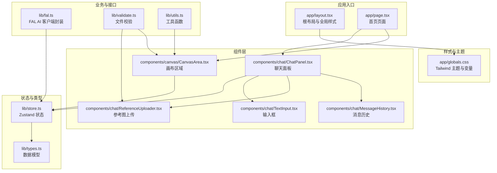
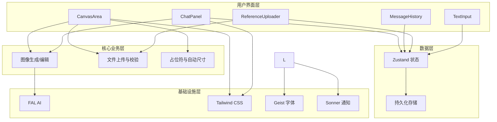
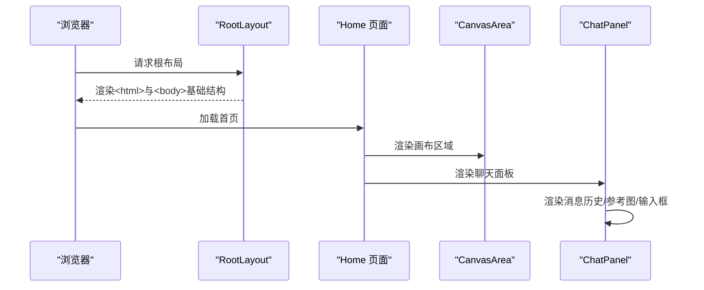
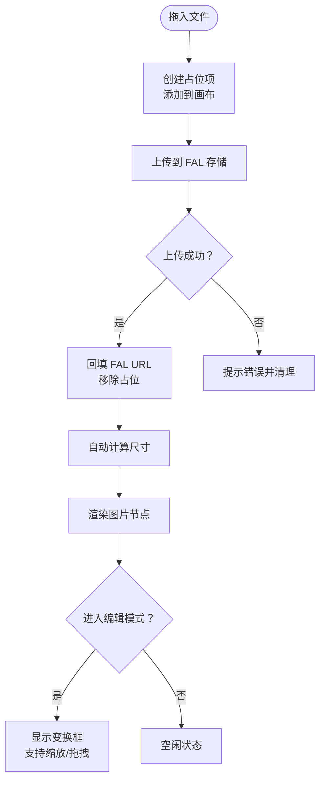
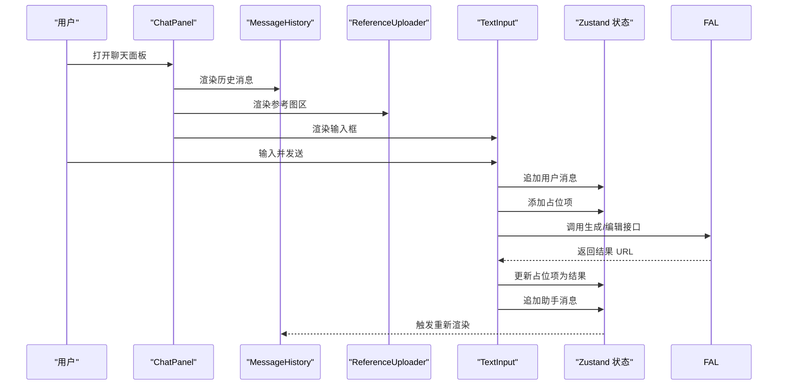
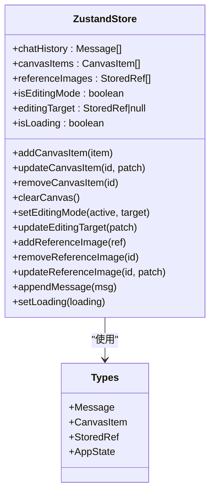
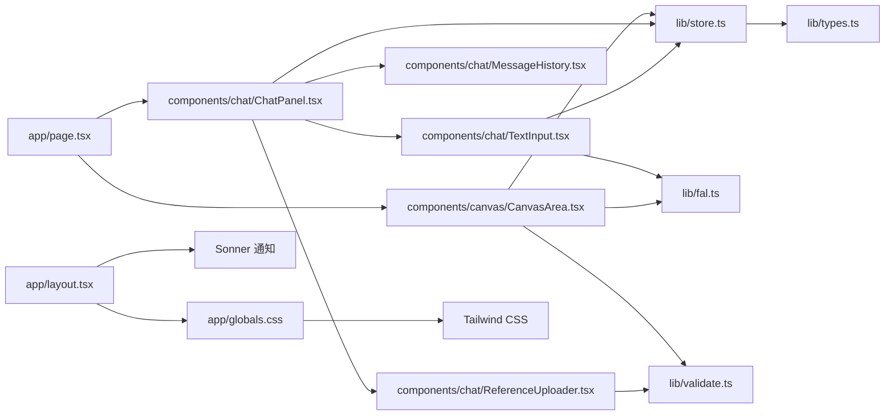

# 整体架构概览

<cite>
**本文档引用的文件**
- [README.md](file://README.md)
- [package.json](file://package.json)
- [app/layout.tsx](file://app/layout.tsx)
- [app/page.tsx](file://app/page.tsx)
- [app/globals.css](file://app/globals.css)
- [lib/types.ts](file://lib/types.ts)
- [lib/store.ts](file://lib/store.ts)
- [lib/fal.ts](file://lib/fal.ts)
- [lib/utils.ts](file://lib/utils.ts)
- [lib/validate.ts](file://lib/validate.ts)
- [components/canvas/CanvasArea.tsx](file://components/canvas/CanvasArea.tsx)
- [components/chat/ChatPanel.tsx](file://components/chat/ChatPanel.tsx)
- [components/chat/MessageHistory.tsx](file://components/chat/MessageHistory.tsx)
- [components/chat/ReferenceUploader.tsx](file://components/chat/ReferenceUploader.tsx)
- [components/chat/TextInput.tsx](file://components/chat/TextInput.tsx)
</cite>

## 目录
1. [引言](#引言)
2. [项目结构](#项目结构)
3. [核心组件](#核心组件)
4. [架构总览](#架构总览)
5. [详细组件分析](#详细组件分析)
6. [依赖关系分析](#依赖关系分析)
7. [性能考虑](#性能考虑)
8. [故障排除指南](#故障排除指南)
9. [结论](#结论)

## 引言
本项目是一个基于 Next.js 16 App Router 的 AI 创意设计平台，采用分层架构与组件化设计，结合 Zustand 状态管理、Tailwind CSS 样式体系以及 FAL AI 接口，提供「画布 + 聊天」双面板的创作工作流。系统通过「用户界面层、核心业务层、数据层、基础设施层」的职责划分，确保功能清晰、可维护性强，并在移动端与桌面端提供一致的交互体验。

## 项目结构
项目采用 Next.js 16 App Router 的目录约定，页面级入口位于 app 目录，全局样式与根布局在 app 内统一配置；业务逻辑与状态管理集中在 lib 目录，UI 组件按功能域拆分至 components 目录；工具函数与类型定义分别位于 lib/utils.ts 与 lib/types.ts。

**图表来源**
- [app/layout.tsx:1-38](file://app/layout.tsx#L1-L38)
- [app/page.tsx:1-59](file://app/page.tsx#L1-L59)
- [app/globals.css:1-128](file://app/globals.css#L1-L128)
- [lib/types.ts:1-37](file://lib/types.ts#L1-L37)
- [lib/store.ts:1-119](file://lib/store.ts#L1-L119)
- [lib/fal.ts:1-62](file://lib/fal.ts#L1-L62)
- [lib/validate.ts:1-14](file://lib/validate.ts#L1-L14)
- [lib/utils.ts:1-7](file://lib/utils.ts#L1-L7)
- [components/canvas/CanvasArea.tsx:1-431](file://components/canvas/CanvasArea.tsx#L1-L431)
- [components/chat/ChatPanel.tsx:1-22](file://components/chat/ChatPanel.tsx#L1-L22)
- [components/chat/MessageHistory.tsx:1-37](file://components/chat/MessageHistory.tsx#L1-L37)
- [components/chat/ReferenceUploader.tsx:1-100](file://components/chat/ReferenceUploader.tsx#L1-L100)
- [components/chat/TextInput.tsx:1-140](file://components/chat/TextInput.tsx#L1-L140)

**章节来源**
- [README.md:1-37](file://README.md#L1-L37)
- [package.json:1-48](file://package.json#L1-L48)
- [app/layout.tsx:1-38](file://app/layout.tsx#L1-L38)
- [app/page.tsx:1-59](file://app/page.tsx#L1-L59)
- [app/globals.css:1-128](file://app/globals.css#L1-L128)

## 核心组件
- 根布局与全局样式：在根布局中注入字体、全局样式与通知组件，统一暗色主题与响应式容器。
- 首页页面：根据屏幕尺寸采用「侧边栏 + 画布」或「底部抽屉 + 画布」的布局策略，实现多端适配。
- 状态管理：使用 Zustand 将持久化会话与临时状态分离，提供画布项、聊天历史、参考图等操作接口。
- 数据模型：定义 CanvasItem、Message、StoredRef、AppState 等核心类型，保证跨组件的数据一致性。
- 文件校验：限制图片格式与大小，保障上传质量与性能。
- 工具函数：提供类名合并与样式合并能力，简化 UI 组合。

**章节来源**
- [app/layout.tsx:16-37](file://app/layout.tsx#L16-L37)
- [app/page.tsx:8-58](file://app/page.tsx#L8-L58)
- [lib/store.ts:45-118](file://lib/store.ts#L45-L118)
- [lib/types.ts:1-37](file://lib/types.ts#L1-L37)
- [lib/validate.ts:1-14](file://lib/validate.ts#L1-L14)
- [lib/utils.ts:1-7](file://lib/utils.ts#L1-L7)

## 架构总览
系统采用四层架构设计：

- 用户界面层（UI Layer）
  - 负责页面与组件渲染、事件处理与用户交互反馈。
  - 示例：CanvasArea、ChatPanel、MessageHistory、ReferenceUploader、TextInput。
- 核心业务层（Domain Layer）
  - 负责业务规则与流程编排，如图像生成、编辑、上传与状态更新。
  - 示例：generateImage、editImage、文件上传、占位符与自动尺寸计算。
- 数据层（Data Layer）
  - 负责状态持久化与本地存储，确保会话恢复与历史记录保留。
  - 示例：Zustand 持久化切片、localStorage 包装器。
- 基础设施层（Infrastructure Layer）
  - 负责外部服务集成与工具链，如 FAL AI、Tailwind CSS、Geist 字体。
  - 示例：FAL 客户端配置、字体注入、通知组件。

**图表来源**
- [components/canvas/CanvasArea.tsx:163-431](file://components/canvas/CanvasArea.tsx#L163-L431)
- [components/chat/ChatPanel.tsx:9-21](file://components/chat/ChatPanel.tsx#L9-L21)
- [components/chat/MessageHistory.tsx:8-36](file://components/chat/MessageHistory.tsx#L8-L36)
- [components/chat/ReferenceUploader.tsx:13-99](file://components/chat/ReferenceUploader.tsx#L13-L99)
- [components/chat/TextInput.tsx:12-139](file://components/chat/TextInput.tsx#L12-L139)
- [lib/store.ts:45-118](file://lib/store.ts#L45-L118)
- [lib/fal.ts:1-62](file://lib/fal.ts#L1-L62)
- [app/layout.tsx:1-38](file://app/layout.tsx#L1-L38)

## 详细组件分析

### 页面与根布局
- 根布局负责注入字体变量、全局样式与通知组件，设置语言与主题类名，确保全站样式一致性。
- 首页页面根据断点采用不同布局：桌面端为「画布 60/70% + 聊天面板」，移动端以底部抽屉承载聊天面板，抽屉高度可切换。

**图表来源**
- [app/layout.tsx:21-37](file://app/layout.tsx#L21-L37)
- [app/page.tsx:11-55](file://app/page.tsx#L11-L55)
- [components/chat/ChatPanel.tsx:9-21](file://components/chat/ChatPanel.tsx#L9-L21)

**章节来源**
- [app/layout.tsx:1-38](file://app/layout.tsx#L1-L38)
- [app/page.tsx:1-59](file://app/page.tsx#L1-L59)

### 画布区域（CanvasArea）
- 功能职责
  - 图像拖拽与放置：支持文件拖入，计算落点坐标并创建本地预览。
  - 占位符动画：生成带渐变流动效果的占位矩形，提示生成中。
  - 编辑与变换：选择图片后显示变换框，支持等比缩放与拖拽定位。
  - 中键平移与滚轮缩放：提供专业绘图体验。
  - 下载与清理：支持下载当前选中项或批量清理。
- 关键流程
  - 拖入文件时创建占位项，随后异步上传至 FAL 并回填 URL。
  - 自动计算图片尺寸，避免超大图像导致渲染卡顿。
  - 与状态管理联动，更新画布项、编辑目标与加载状态。

**图表来源**
- [components/canvas/CanvasArea.tsx:306-340](file://components/canvas/CanvasArea.tsx#L306-L340)
- [lib/fal.ts:59-62](file://lib/fal.ts#L59-L62)
- [lib/store.ts:58-71](file://lib/store.ts#L58-L71)

**章节来源**
- [components/canvas/CanvasArea.tsx:1-431](file://components/canvas/CanvasArea.tsx#L1-L431)
- [lib/fal.ts:1-62](file://lib/fal.ts#L1-L62)
- [lib/store.ts:1-119](file://lib/store.ts#L1-L119)

### 聊天面板（ChatPanel）
- 组成结构
  - 标题区：品牌信息展示。
  - 消息历史：滚动展示对话历史，新消息自动滚动到底部。
  - 参考图上传：支持多图上传与进度指示，最多 6 张。
  - 输入框：支持多行自适应高度、快捷键发送、禁用态与加载态。
- 交互策略
  - 输入聚焦时可触发抽屉展开，提升移动端可用性。
  - 发送时根据是否处于编辑模式决定调用生成或编辑接口。

**图表来源**
- [components/chat/ChatPanel.tsx:9-21](file://components/chat/ChatPanel.tsx#L9-L21)
- [components/chat/MessageHistory.tsx:8-36](file://components/chat/MessageHistory.tsx#L8-L36)
- [components/chat/ReferenceUploader.tsx:13-99](file://components/chat/ReferenceUploader.tsx#L13-L99)
- [components/chat/TextInput.tsx:34-89](file://components/chat/TextInput.tsx#L34-L89)
- [lib/fal.ts:21-57](file://lib/fal.ts#L21-L57)

**章节来源**
- [components/chat/ChatPanel.tsx:1-22](file://components/chat/ChatPanel.tsx#L1-L22)
- [components/chat/MessageHistory.tsx:1-37](file://components/chat/MessageHistory.tsx#L1-L37)
- [components/chat/ReferenceUploader.tsx:1-100](file://components/chat/ReferenceUploader.tsx#L1-L100)
- [components/chat/TextInput.tsx:1-140](file://components/chat/TextInput.tsx#L1-L140)

### 状态管理（Zustand）
- 设计要点
  - 分离持久化切片与会话切片，减少不必要的持久化开销。
  - 提供增删改查与批量操作方法，降低组件耦合。
  - 通过 localStorage 包装器实现安全读写，避免异常中断。
- 典型操作
  - 画布项：添加、更新、删除、清空。
  - 编辑模式：切换与目标更新。
  - 参考图：增删与上传状态同步。
  - 聊天历史：追加消息并限制长度。

**图表来源**
- [lib/store.ts:45-118](file://lib/store.ts#L45-L118)
- [lib/types.ts:1-37](file://lib/types.ts#L1-L37)

**章节来源**
- [lib/store.ts:1-119](file://lib/store.ts#L1-L119)
- [lib/types.ts:1-37](file://lib/types.ts#L1-L37)

### 外部接口与工具
- FAL AI 客户端
  - 通过代理 URL 配置，屏蔽密钥暴露风险。
  - 提供生成与编辑两个接口，返回 CDN 图片地址。
- 文件校验
  - 限定格式与大小，减少无效请求与存储浪费。
- 工具函数
  - 类名合并与样式合并，简化条件样式拼接。

**章节来源**
- [lib/fal.ts:1-62](file://lib/fal.ts#L1-L62)
- [lib/validate.ts:1-14](file://lib/validate.ts#L1-L14)
- [lib/utils.ts:1-7](file://lib/utils.ts#L1-L7)

## 依赖关系分析
- 组件间依赖
  - 首页页面同时依赖画布与聊天面板；聊天面板内部再细分为消息历史、参考图上传与输入框。
  - 画布与聊天均依赖状态管理；输入框依赖 FAL 接口。
- 外部依赖
  - Next.js 16 App Router 提供路由与构建能力。
  - Tailwind CSS 与 shadcn 组件库提供样式与 UI 原子能力。
  - Zustand 管理全局状态，localStorage 实现持久化。
  - FAL AI 提供图像生成与编辑能力。

**图表来源**
- [app/page.tsx:1-59](file://app/page.tsx#L1-L59)
- [components/canvas/CanvasArea.tsx:1-431](file://components/canvas/CanvasArea.tsx#L1-L431)
- [components/chat/ChatPanel.tsx:1-22](file://components/chat/ChatPanel.tsx#L1-L22)
- [components/chat/MessageHistory.tsx:1-37](file://components/chat/MessageHistory.tsx#L1-L37)
- [components/chat/ReferenceUploader.tsx:1-100](file://components/chat/ReferenceUploader.tsx#L1-L100)
- [components/chat/TextInput.tsx:1-140](file://components/chat/TextInput.tsx#L1-L140)
- [lib/store.ts:1-119](file://lib/store.ts#L1-L119)
- [lib/fal.ts:1-62](file://lib/fal.ts#L1-L62)
- [lib/validate.ts:1-14](file://lib/validate.ts#L1-L14)
- [lib/types.ts:1-37](file://lib/types.ts#L1-L37)
- [app/layout.tsx:1-38](file://app/layout.tsx#L1-L38)
- [app/globals.css:1-128](file://app/globals.css#L1-L128)

**章节来源**
- [package.json:11-46](file://package.json#L11-L46)

## 性能考虑
- 渲染优化
  - 画布节点按需渲染，占位符使用 requestAnimationFrame 实现平滑动画。
  - 自动尺寸计算避免超大图片直接渲染，减少首屏压力。
- 状态与存储
  - 持久化切片仅保存必要字段，聊天历史限制长度，降低存储与序列化成本。
- 网络与资源
  - 通过 FAL 代理隐藏密钥，统一错误处理与降级提示。
  - 移动端抽屉模式减少重复渲染，提升交互流畅度。
- 样式与字体
  - 字体变量注入与暗色主题常驻，避免闪烁与重复计算。

[本节为通用性能建议，无需特定文件引用]

## 故障排除指南
- 上传失败
  - 现象：上传按钮显示错误提示，占位项未消失。
  - 排查：确认 FAL_KEY 配置与网络连通性；查看控制台错误信息。
  - 处理：重启服务后重试，或更换网络环境。
- 生成失败
  - 现象：输入发送后占位项被移除，无结果图片。
  - 排查：检查网络连接与 FAL 服务状态；确认提示内容是否为网络错误。
  - 处理：在网络稳定后重试，或减少参考图数量。
- 移动端抽屉无法展开
  - 现象：点击抽屉手柄无反应。
  - 排查：确认抽屉开关逻辑与按钮事件绑定正常。
  - 处理：刷新页面后重试，或调整窗口尺寸以触发断点。

**章节来源**
- [components/canvas/CanvasArea.tsx:332-337](file://components/canvas/CanvasArea.tsx#L332-L337)
- [components/chat/TextInput.tsx:82-88](file://components/chat/TextInput.tsx#L82-L88)
- [app/page.tsx:37-48](file://app/page.tsx#L37-L48)

## 结论
本项目以 Next.js 16 App Router 为基础，结合组件化与分层架构，实现了从 UI 到业务再到数据与基础设施的清晰分工。通过 Zustand 管理状态、Tailwind CSS 统一样式、FAL AI 提供生成能力，系统在保证开发效率的同时兼顾了用户体验与性能表现。未来可在错误监控、缓存策略与服务端渲染方面进一步增强，以适配更复杂的业务场景。