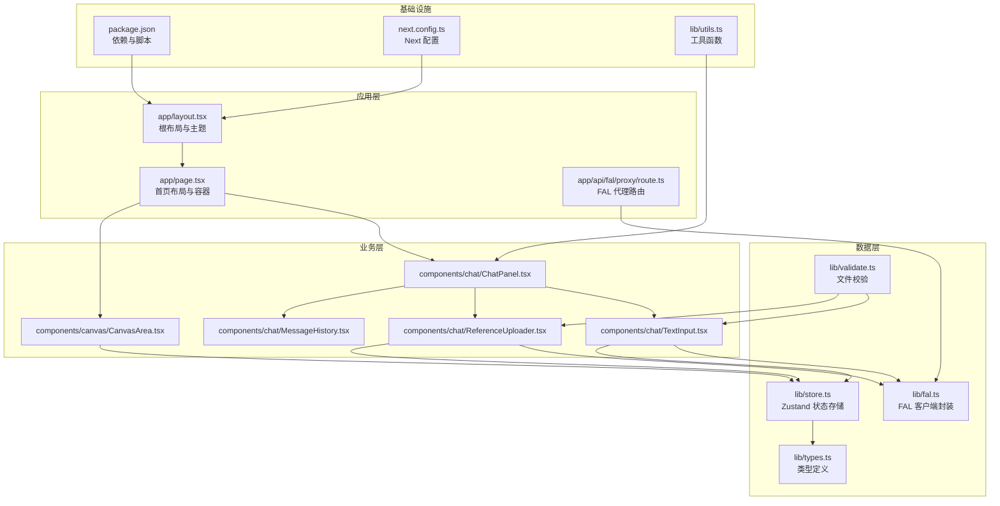
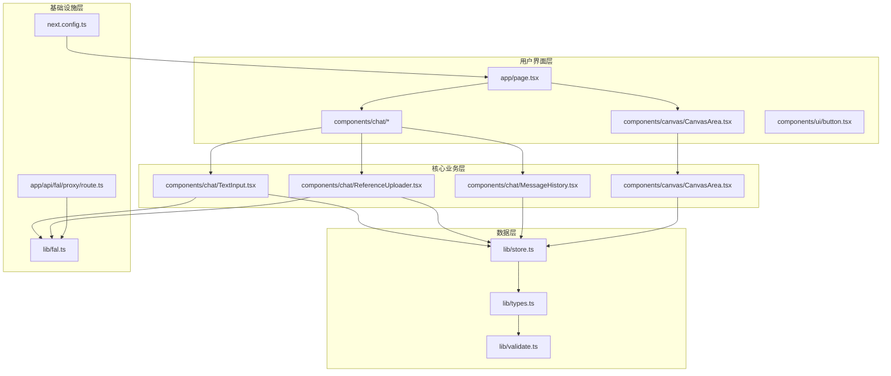
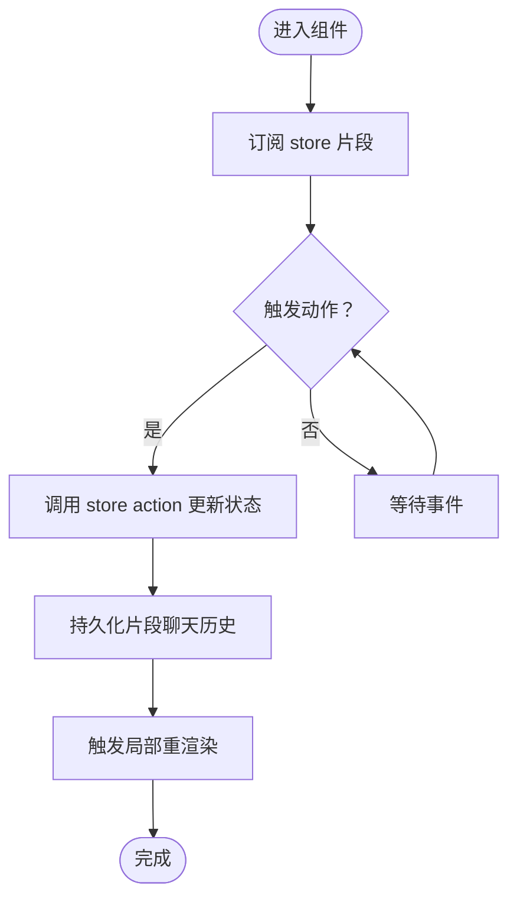
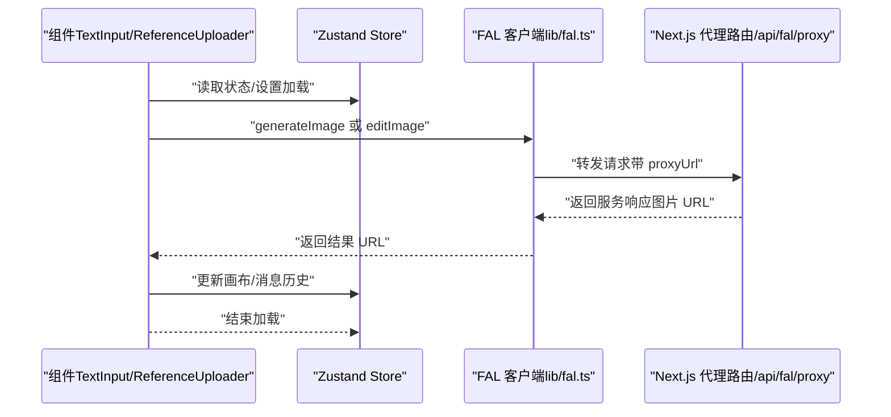
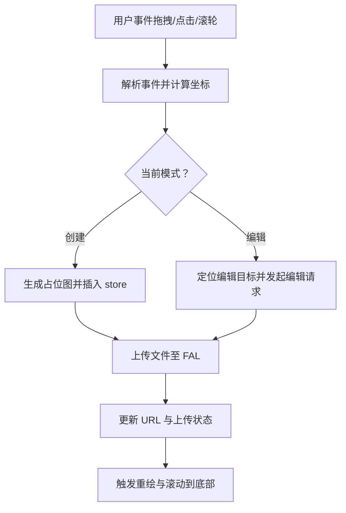
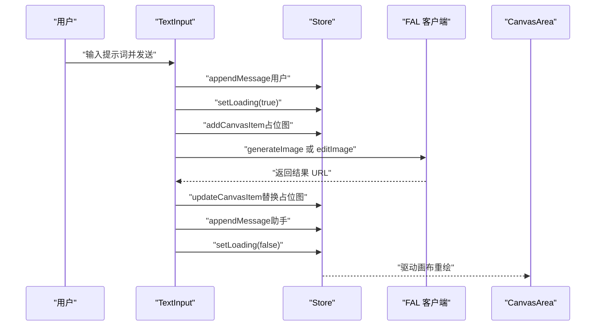
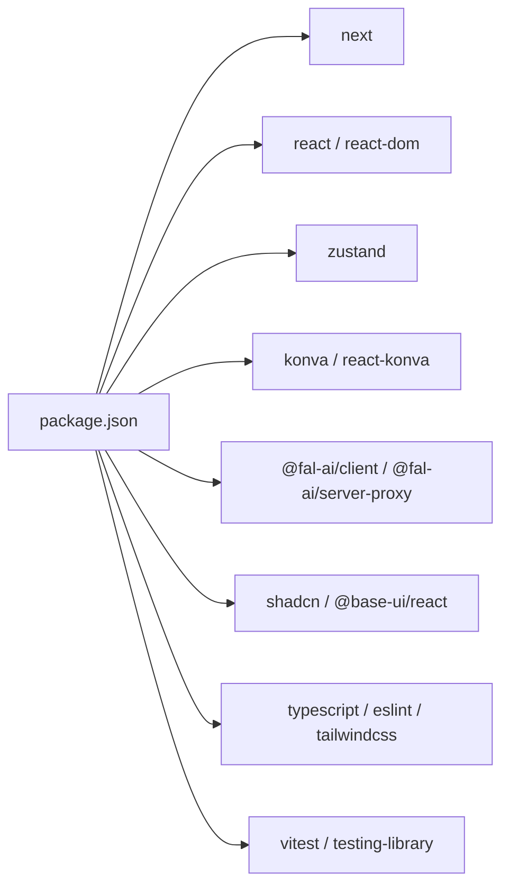

# 架构设计

<cite>
**本文引用的文件**
- [README.md](file://README.md)
- [package.json](file://package.json)
- [next.config.ts](file://next.config.ts)
- [app/layout.tsx](file://app/layout.tsx)
- [app/page.tsx](file://app/page.tsx)
- [app/api/fal/proxy/route.ts](file://app/api/fal/proxy/route.ts)
- [lib/store.ts](file://lib/store.ts)
- [lib/fal.ts](file://lib/fal.ts)
- [lib/types.ts](file://lib/types.ts)
- [lib/utils.ts](file://lib/utils.ts)
- [lib/validate.ts](file://lib/validate.ts)
- [components/canvas/CanvasArea.tsx](file://components/canvas/CanvasArea.tsx)
- [components/chat/ChatPanel.tsx](file://components/chat/ChatPanel.tsx)
- [components/chat/MessageHistory.tsx](file://components/chat/MessageHistory.tsx)
- [components/chat/TextInput.tsx](file://components/chat/TextInput.tsx)
- [components/chat/ReferenceUploader.tsx](file://components/chat/ReferenceUploader.tsx)
- [components/ui/button.tsx](file://components/ui/button.tsx)
- [__tests__/store.test.ts](file://__tests__/store.test.ts)
- [__tests__/validate.test.ts](file://__tests__/validate.test.ts)
</cite>

## 目录
1. [引言](#引言)
2. [项目结构](#项目结构)
3. [核心组件](#核心组件)
4. [架构总览](#架构总览)
5. [详细组件分析](#详细组件分析)
6. [依赖分析](#依赖分析)
7. [性能考量](#性能考量)
8. [故障排查指南](#故障排查指南)
9. [结论](#结论)
10. [附录](#附录)

## 引言
本项目为一个基于 Next.js App Router 的 AI 创意设计平台，提供“画布 + 聊天”的一体化工作流：用户可在左侧画布中拖拽/编辑图像，同时通过右侧聊天面板输入创作或编辑指令，借助后端代理与外部模型服务完成图像生成与编辑，并以响应式布局适配多端设备。系统采用分层架构设计，将用户界面层、核心业务层、数据层与基础设施层清晰分离；状态管理采用 Zustand（替代传统 Redux），以更轻量的方式实现跨组件共享状态；API 代理通过 Next.js 路由与 @fal-ai/server-proxy 实现，屏蔽客户端直接调用外部服务的风险与限制。

## 项目结构
项目遵循 Next.js App Router 的约定式路由与目录结构，核心入口位于 app 目录，页面级组件与全局样式、布局在此组织；业务逻辑与类型定义集中在 lib 目录；UI 组件按功能拆分为 components 子目录；测试位于 __tests__ 目录。

图表来源
- [app/layout.tsx:1-38](file://app/layout.tsx#L1-L38)
- [app/page.tsx:1-59](file://app/page.tsx#L1-L59)
- [app/api/fal/proxy/route.ts:1-4](file://app/api/fal/proxy/route.ts#L1-L4)
- [components/canvas/CanvasArea.tsx:1-431](file://components/canvas/CanvasArea.tsx#L1-L431)
- [components/chat/ChatPanel.tsx:1-22](file://components/chat/ChatPanel.tsx#L1-L22)
- [components/chat/MessageHistory.tsx:1-37](file://components/chat/MessageHistory.tsx#L1-L37)
- [components/chat/TextInput.tsx:1-140](file://components/chat/TextInput.tsx#L1-L140)
- [components/chat/ReferenceUploader.tsx:1-100](file://components/chat/ReferenceUploader.tsx#L1-L100)
- [lib/store.ts:1-119](file://lib/store.ts#L1-L119)
- [lib/fal.ts:1-62](file://lib/fal.ts#L1-L62)
- [lib/types.ts:1-37](file://lib/types.ts#L1-L37)
- [lib/validate.ts:1-14](file://lib/validate.ts#L1-L14)
- [lib/utils.ts:1-7](file://lib/utils.ts#L1-L7)
- [package.json:1-48](file://package.json#L1-L48)
- [next.config.ts:1-8](file://next.config.ts#L1-L8)

章节来源
- [README.md:1-37](file://README.md#L1-L37)
- [package.json:1-48](file://package.json#L1-L48)
- [next.config.ts:1-8](file://next.config.ts#L1-L8)

## 核心组件
- 页面与布局
  - 根布局负责注入字体、主题与全局通知组件，统一页面外观与交互体验。
  - 首页页面将画布与聊天面板按桌面/平板与移动端不同布局组织，实现响应式体验。
- 画布组件
  - CanvasArea 提供拖拽、缩放、平移、选择与变换等交互能力，集成 Konva/Konva 图形库，支持占位动画与占位节点渲染。
- 聊天组件
  - ChatPanel 作为聊天容器，组合消息历史、参考图上传器与文本输入框。
  - MessageHistory 负责滚动到最新消息与空态提示。
  - TextInput 处理发送逻辑、占位图生成、调用生成/编辑接口、错误处理与加载状态。
  - ReferenceUploader 支持本地文件预览、上传与数量限制。
- 状态与数据
  - Zustand store 将会话状态（画布项、参考图、编辑目标）、持久化聊天历史与加载状态集中管理。
  - 类型系统定义 CanvasItem、Message、StoredRef 等核心数据结构。
  - 文件校验模块确保上传资源符合格式与大小要求。
- 基础设施
  - FAL 客户端封装统一了生成与编辑流程，配置代理路径以避免跨域与密钥泄露。
  - UI 基础组件（如 Button）使用 Base UI 与 Tailwind 变体系统，保证一致的视觉与交互规范。

章节来源
- [app/layout.tsx:1-38](file://app/layout.tsx#L1-L38)
- [app/page.tsx:1-59](file://app/page.tsx#L1-L59)
- [components/canvas/CanvasArea.tsx:1-431](file://components/canvas/CanvasArea.tsx#L1-L431)
- [components/chat/ChatPanel.tsx:1-22](file://components/chat/ChatPanel.tsx#L1-L22)
- [components/chat/MessageHistory.tsx:1-37](file://components/chat/MessageHistory.tsx#L1-L37)
- [components/chat/TextInput.tsx:1-140](file://components/chat/TextInput.tsx#L1-L140)
- [components/chat/ReferenceUploader.tsx:1-100](file://components/chat/ReferenceUploader.tsx#L1-L100)
- [lib/store.ts:1-119](file://lib/store.ts#L1-L119)
- [lib/types.ts:1-37](file://lib/types.ts#L1-L37)
- [lib/validate.ts:1-14](file://lib/validate.ts#L1-L14)
- [lib/fal.ts:1-62](file://lib/fal.ts#L1-L62)
- [components/ui/button.tsx:1-61](file://components/ui/button.tsx#L1-L61)

## 架构总览
系统采用分层设计：
- 用户界面层：页面与组件负责交互与展示，按功能拆分，职责单一。
- 核心业务层：聊天与画布组件协调状态与流程，封装生成/编辑逻辑。
- 数据层：Zustand 管理应用状态，类型系统约束数据结构，文件校验保障输入质量。
- 基础设施层：Next.js 路由、FAL 代理与客户端 SDK 提供运行时环境与外部服务接入。

图表来源
- [app/page.tsx:1-59](file://app/page.tsx#L1-L59)
- [components/chat/TextInput.tsx:1-140](file://components/chat/TextInput.tsx#L1-L140)
- [components/chat/ReferenceUploader.tsx:1-100](file://components/chat/ReferenceUploader.tsx#L1-L100)
- [components/chat/MessageHistory.tsx:1-37](file://components/chat/MessageHistory.tsx#L1-L37)
- [components/canvas/CanvasArea.tsx:1-431](file://components/canvas/CanvasArea.tsx#L1-L431)
- [lib/store.ts:1-119](file://lib/store.ts#L1-L119)
- [lib/types.ts:1-37](file://lib/types.ts#L1-L37)
- [lib/validate.ts:1-14](file://lib/validate.ts#L1-L14)
- [app/api/fal/proxy/route.ts:1-4](file://app/api/fal/proxy/route.ts#L1-L4)
- [lib/fal.ts:1-62](file://lib/fal.ts#L1-L62)
- [next.config.ts:1-8](file://next.config.ts#L1-L8)

## 详细组件分析

### 状态管理与数据流（Zustand）
- 设计原则
  - 单一真相源：所有画布项、参考图、编辑目标与聊天历史集中于 Zustand store。
  - 分片切分：将持久化与会话状态分离，减少不必要的持久化开销。
  - 受控更新：通过 action 方法更新状态，避免直接修改共享对象。
- 关键行为
  - 画布操作：添加、更新、删除、清空画布项；切换编辑模式与更新编辑目标。
  - 参考图管理：添加、更新、删除参考图，自动同步上传状态。
  - 聊天历史：追加消息并限制长度，保持最近 50 条记录。
  - 加载状态：统一控制生成/编辑流程中的加载指示。
- 错误处理
  - 上传失败与网络异常通过 toast 提示，必要时回滚状态。
- 性能影响
  - 使用持久化中间件与局部订阅，降低渲染范围与存储压力。
  - 通过安全存储包装器规避浏览器异常导致的崩溃。

图表来源
- [lib/store.ts:19-119](file://lib/store.ts#L19-L119)

章节来源
- [lib/store.ts:1-119](file://lib/store.ts#L1-L119)
- [__tests__/store.test.ts:1-92](file://__tests__/store.test.ts#L1-L92)

### API 代理与外部服务集成
- 代理模式
  - Next.js 路由暴露 /api/fal/proxy，内部委托 @fal-ai/server-proxy 的 createRouteHandler，统一处理 GET/POST/PUT 请求。
  - 客户端通过 fal.config 指定 proxyUrl，避免直接暴露密钥与跨域问题。
- 服务调用
  - 生成图像：根据提示词与参考图调用生成模型，返回结果图链接。
  - 编辑图像：在目标图基础上进行编辑，同样返回结果图链接。
  - 文件上传：将本地文件上传至 FAL 存储，返回可访问 URL。
- 错误处理
  - 网络错误与服务异常统一转化为用户可感知的提示信息。

图表来源
- [components/chat/TextInput.tsx:34-89](file://components/chat/TextInput.tsx#L34-L89)
- [components/chat/ReferenceUploader.tsx:18-41](file://components/chat/ReferenceUploader.tsx#L18-L41)
- [lib/fal.ts:21-61](file://lib/fal.ts#L21-L61)
- [app/api/fal/proxy/route.ts:1-4](file://app/api/fal/proxy/route.ts#L1-L4)

章节来源
- [lib/fal.ts:1-62](file://lib/fal.ts#L1-L62)
- [app/api/fal/proxy/route.ts:1-4](file://app/api/fal/proxy/route.ts#L1-L4)

### 画布与交互（CanvasArea）
- 功能要点
  - 响应式尺寸：监听容器变化，动态调整 Stage 尺寸。
  - 中键平移：原生鼠标事件实现平移，避免与 Konva 拖拽冲突。
  - 滚轮缩放：以指针位置为中心进行缩放，并自动计算新位置。
  - 选择与变换：点击选中后显示 Transformer，支持等比缩放与拖拽。
  - 占位动画：生成过程使用渐变扫光动画提升反馈。
  - 拖拽上传：支持从外部拖入图片，生成本地预览并上传至 FAL。
- 状态联动
  - 选中项与编辑目标同步，触发右侧聊天面板的编辑模式提示。
  - 清除与下载按钮根据当前状态启用/禁用。

图表来源
- [components/canvas/CanvasArea.tsx:294-340](file://components/canvas/CanvasArea.tsx#L294-L340)
- [components/canvas/CanvasArea.tsx:238-251](file://components/canvas/CanvasArea.tsx#L238-L251)
- [components/canvas/CanvasArea.tsx:253-277](file://components/canvas/CanvasArea.tsx#L253-L277)

章节来源
- [components/canvas/CanvasArea.tsx:1-431](file://components/canvas/CanvasArea.tsx#L1-L431)

### 聊天与消息（ChatPanel/MessageHistory/TextInput/ReferenceUploader）
- 聊天面板
  - 组合标题、消息历史、参考图区与输入区，形成完整对话工作流。
- 消息历史
  - 自动滚动到底部，空态时显示引导文案。
- 文本输入
  - 支持多行自适应高度、快捷键发送、占位图生成与最终结果替换。
  - 根据是否处于编辑模式决定调用生成或编辑接口。
- 参考图上传
  - 限制数量与格式，支持预览、上传进度与移除。
- 状态与数据
  - 所有状态来自 store，输入区与上传区均通过 action 更新。

图表来源
- [components/chat/TextInput.tsx:34-89](file://components/chat/TextInput.tsx#L34-L89)
- [lib/fal.ts:21-61](file://lib/fal.ts#L21-L61)
- [lib/store.ts:45-101](file://lib/store.ts#L45-L101)

章节来源
- [components/chat/ChatPanel.tsx:1-22](file://components/chat/ChatPanel.tsx#L1-L22)
- [components/chat/MessageHistory.tsx:1-37](file://components/chat/MessageHistory.tsx#L1-L37)
- [components/chat/TextInput.tsx:1-140](file://components/chat/TextInput.tsx#L1-L140)
- [components/chat/ReferenceUploader.tsx:1-100](file://components/chat/ReferenceUploader.tsx#L1-L100)

### UI 组件与工具
- Button 组件
  - 基于 Base UI 与 class-variance-authority，提供多种变体与尺寸，结合 Tailwind 工具类实现一致风格。
- 工具函数
  - cn：合并与去重类名，简化条件样式拼接。

章节来源
- [components/ui/button.tsx:1-61](file://components/ui/button.tsx#L1-L61)
- [lib/utils.ts:1-7](file://lib/utils.ts#L1-L7)

## 依赖分析
- 运行时依赖
  - Next.js 16：App Router、SSR/CSR 能力与构建优化。
  - React 19：并发特性与 Hooks 生态。
  - @fal-ai/client 与 @fal-ai/server-proxy：统一外部模型服务调用与代理。
  - konva/react-konva：画布图形与交互。
  - zustand：轻量状态管理。
  - shadcn/base-ui：基础 UI 组件与样式系统。
- 开发依赖
  - Vitest、@testing-library：单元测试与组件测试。
  - TypeScript、ESLint、TailwindCSS：类型安全与代码质量保障。

图表来源
- [package.json:11-46](file://package.json#L11-L46)

章节来源
- [package.json:1-48](file://package.json#L1-L48)

## 性能考量
- 状态粒度与订阅
  - 使用局部订阅与分片状态，减少无关组件重渲染。
- 渲染优化
  - Konva 层批处理绘制，避免逐帧重复计算。
  - 占位动画使用 requestAnimationFrame，保持流畅度。
- I/O 与缓存
  - 通过代理路由与客户端 SDK 统一请求路径，减少跨域与鉴权问题。
  - 持久化仅保存必要片段，避免大对象频繁序列化。
- 可维护性
  - 明确的分层与职责划分，便于扩展与测试。
  - 测试覆盖 store 行为与文件校验逻辑，降低回归风险。

## 故障排查指南
- 上传失败
  - 现象：toast 提示上传失败。
  - 排查：确认 FAL_KEY 配置、网络连通性与文件格式/大小限制。
  - 参考：上传流程与错误分支。
- 生成失败
  - 现象：占位图未替换，toast 提示生成失败。
  - 排查：检查网络状态、代理路由可用性与模型服务状态。
  - 参考：生成/编辑调用与异常处理。
- 文件校验失败
  - 现象：toast 提示不支持的格式或过大。
  - 排查：核对文件类型与大小阈值。
  - 参考：校验逻辑与测试用例。

章节来源
- [components/chat/TextInput.tsx:82-88](file://components/chat/TextInput.tsx#L82-L88)
- [components/chat/ReferenceUploader.tsx:32-38](file://components/chat/ReferenceUploader.tsx#L32-L38)
- [lib/validate.ts:1-14](file://lib/validate.ts#L1-L14)
- [__tests__/validate.test.ts:1-43](file://__tests__/validate.test.ts#L1-L43)

## 结论
本项目以 Next.js App Router 为基础，采用组件化与分层架构，结合 Zustand 实现轻量高效的状态管理，通过 API 代理模式安全地对接外部模型服务。整体设计兼顾性能与可维护性：状态集中、职责清晰、测试完备；在画布与聊天两大核心场景下，提供了良好的用户体验与扩展空间。

## 附录
- 技术选型说明
  - Next.js App Router：现代路由与构建体系，利于 SSR/CSR 与增量更新。
  - Zustand：相比 Redux 更轻量，适合中小型应用的状态管理需求。
  - @fal-ai/server-proxy：统一代理，避免客户端直连带来的安全与跨域问题。
  - Konva：高性能 2D 图形库，满足画布编辑与交互需求。
- 架构决策影响
  - 性能：局部订阅与批处理绘制降低渲染成本；代理路由减少网络往返。
  - 可维护性：清晰的分层与测试用例降低耦合，提升可演进性。