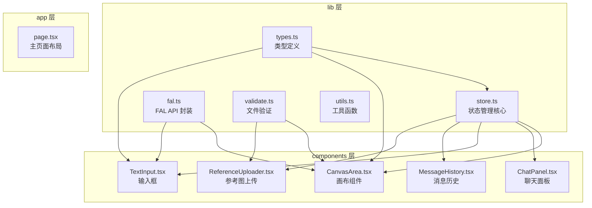
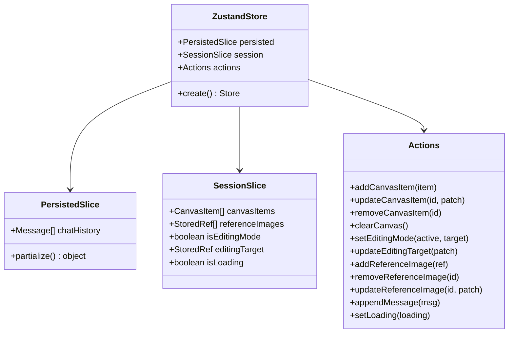
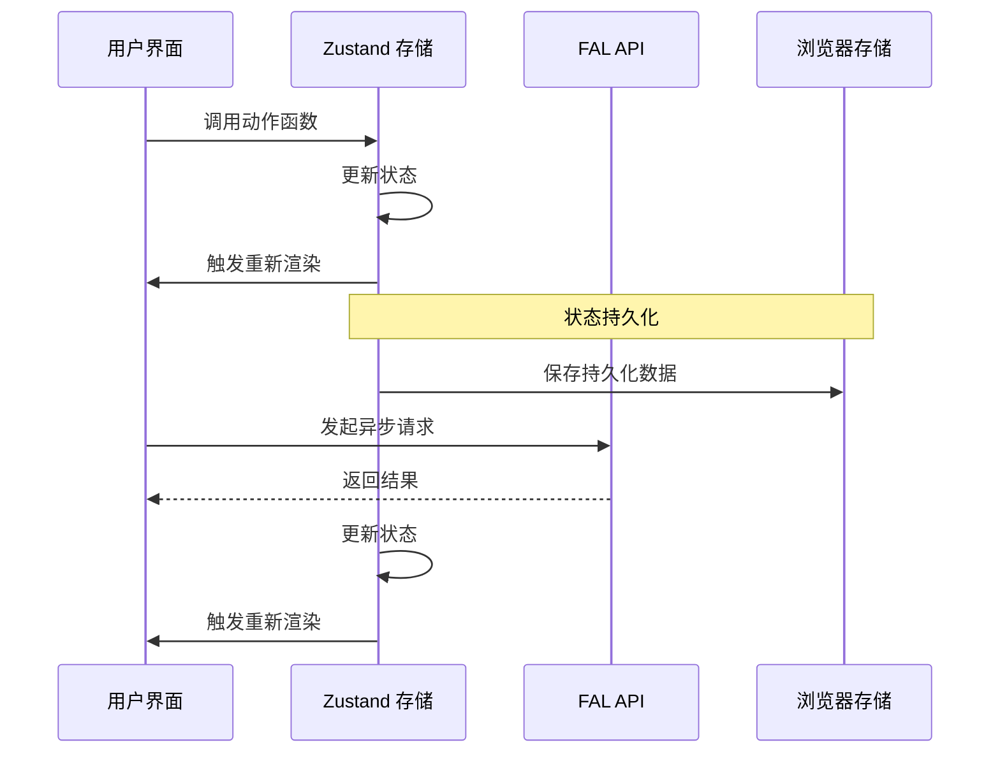
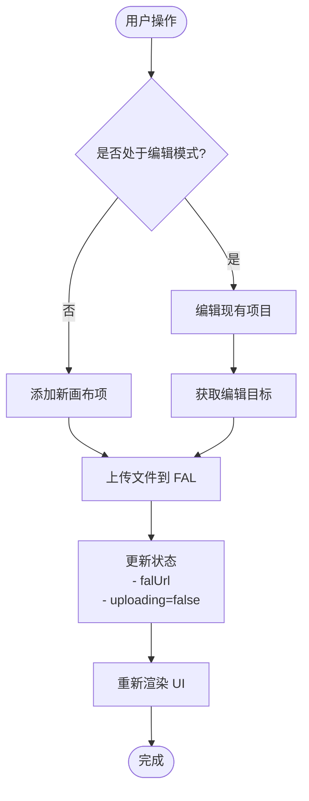
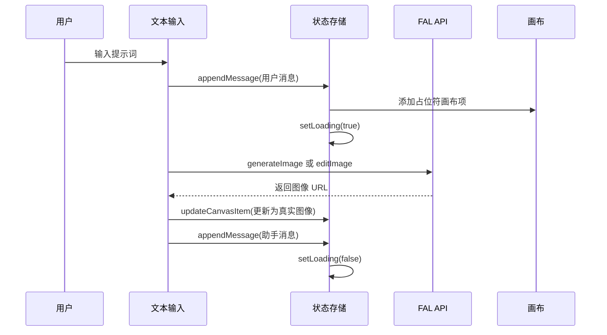
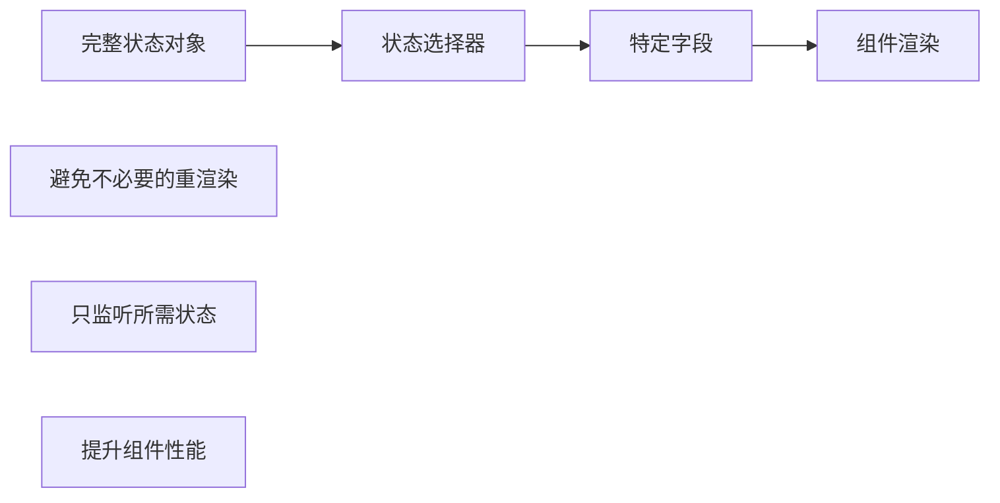
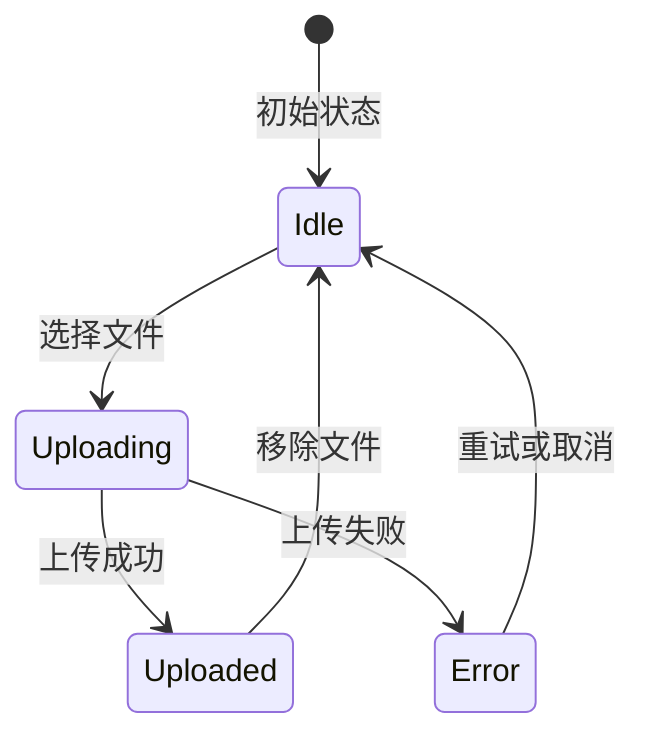
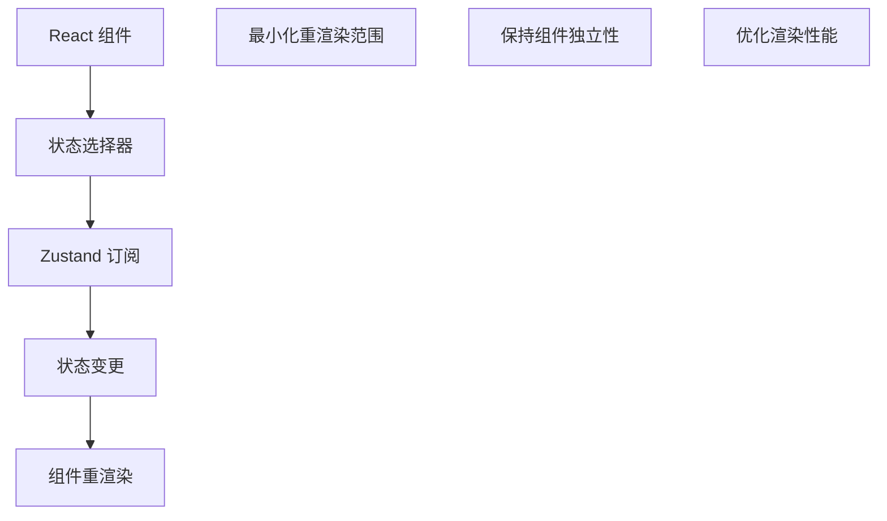

# 状态管理架构

<cite>
**本文档引用的文件**
- [lib/store.ts](file://lib/store.ts)
- [lib/types.ts](file://lib/types.ts)
- [lib/fal.ts](file://lib/fal.ts)
- [lib/validate.ts](file://lib/validate.ts)
- [components/canvas/CanvasArea.tsx](file://components/canvas/CanvasArea.tsx)
- [components/chat/TextInput.tsx](file://components/chat/TextInput.tsx)
- [components/chat/MessageHistory.tsx](file://components/chat/MessageHistory.tsx)
- [components/chat/ReferenceUploader.tsx](file://components/chat/ReferenceUploader.tsx)
- [app/page.tsx](file://app/page.tsx)
- __tests__/store.test.ts
- [package.json](file://package.json)
</cite>

## 目录
1. [简介](#简介)
2. [项目结构](#项目结构)
3. [核心组件](#核心组件)
4. [架构概览](#架构概览)
5. [详细组件分析](#详细组件分析)
6. [依赖关系分析](#依赖关系分析)
7. [性能考虑](#性能考虑)
8. [故障排除指南](#故障排除指南)
9. [结论](#结论)
10. [最佳实践](#最佳实践)

## 简介

Loveart 项目采用基于 Zustand 的现代状态管理架构，为 AI 图像生成和编辑应用提供了高效、可维护的状态管理解决方案。该架构通过状态切片划分实现了清晰的关注点分离，结合持久化中间件确保用户体验的一致性，同时通过严格的类型系统保证了代码的可靠性。

本项目的核心特性包括：
- 基于 Zustand 的轻量级状态管理
- 按功能域划分的状态切片
- 自动持久化机制
- 类型安全的状态访问
- 响应式 UI 更新
- 异步操作的优雅处理

## 项目结构

项目采用模块化组织方式，状态管理相关的文件主要集中在 `lib` 目录中，UI 组件分布在 `components` 目录下，页面布局在 `app` 目录中。



**图表来源**
- [lib/store.ts:1-119](file://lib/store.ts#L1-L119)
- [lib/types.ts:1-37](file://lib/types.ts#L1-L37)
- [components/canvas/CanvasArea.tsx:1-431](file://components/canvas/CanvasArea.tsx#L1-L431)

**章节来源**
- [lib/store.ts:1-119](file://lib/store.ts#L1-L119)
- [lib/types.ts:1-37](file://lib/types.ts#L1-L37)
- [app/page.tsx:1-59](file://app/page.tsx#L1-L59)

## 核心组件

### Zustand 状态存储

项目使用 Zustand 创建了一个单一的全局状态存储，通过状态切片模式将不同功能域的状态分离管理。



**图表来源**
- [lib/store.ts:19-118](file://lib/store.ts#L19-L118)

### 状态切片设计

项目采用两种状态切片模式：

1. **持久化切片 (PersistedSlice)**：包含需要跨会话保存的数据
2. **会话切片 (SessionSlice)**：包含临时的会话数据

这种设计确保了用户界面状态（如当前编辑模式）不会被持久化，而对话历史等重要数据会被保存。

**章节来源**
- [lib/store.ts:33-43](file://lib/store.ts#L33-L43)
- [lib/store.ts:45-118](file://lib/store.ts#L45-L118)

## 架构概览

Loveart 的状态管理架构遵循单向数据流原则，所有状态变更都通过明确的动作函数进行，确保了状态的可预测性和可追踪性。



**图表来源**
- [lib/store.ts:45-118](file://lib/store.ts#L45-L118)
- [lib/fal.ts:1-62](file://lib/fal.ts#L1-L62)

## 详细组件分析

### CanvasArea 组件状态管理

CanvasArea 组件是状态管理的核心消费者之一，负责管理画布元素、编辑模式和拖拽上传功能。



**图表来源**
- [components/canvas/CanvasArea.tsx:306-340](file://components/canvas/CanvasArea.tsx#L306-L340)
- [lib/fal.ts:59-61](file://lib/fal.ts#L59-L61)

#### 关键状态管理模式

1. **占位符模式**：在 AI 生成过程中显示加载动画
2. **异步状态管理**：处理文件上传和图像生成的异步过程
3. **编辑模式切换**：在创建模式和编辑模式之间切换

**章节来源**
- [components/canvas/CanvasArea.tsx:163-431](file://components/canvas/CanvasArea.tsx#L163-L431)

### ChatPanel 组件状态管理

ChatPanel 组件展示了如何在聊天界面中管理复杂的状态交互。



**图表来源**
- [components/chat/TextInput.tsx:34-89](file://components/chat/TextInput.tsx#L34-L89)
- [lib/fal.ts:21-57](file://lib/fal.ts#L21-L57)

#### 状态选择器优化

组件使用了状态选择器来优化渲染性能：



**图表来源**
- [components/chat/MessageHistory.tsx:9](file://components/chat/MessageHistory.tsx#L9)

**章节来源**
- [components/chat/TextInput.tsx:12-140](file://components/chat/TextInput.tsx#L12-L140)
- [components/chat/MessageHistory.tsx:1-37](file://components/chat/MessageHistory.tsx#L1-L37)

### ReferenceUploader 组件状态管理

ReferenceUploader 组件展示了如何管理多个相关状态的协调更新。



**图表来源**
- [components/chat/ReferenceUploader.tsx:18-41](file://components/chat/ReferenceUploader.tsx#L18-L41)

**章节来源**
- [components/chat/ReferenceUploader.tsx:1-100](file://components/chat/ReferenceUploader.tsx#L1-L100)

## 依赖关系分析

项目的状态管理依赖关系清晰明确，主要依赖包括：

```mermaid
graph TB
Zustand[zustand@^5.0.12] --> Store[store.ts]
FAL_AI["@fal-ai/client@^1.9.5"] --> Fal[fal.ts]
FAL_Server["@fal-ai/server-proxy@^1.2.1"] --> Fal
React[react@19.2.4] --> Components[React 组件]
React_Konva["react-konva@^19.2.3"] --> Canvas[CanvasArea]
Sonner["sonner@^2.0.7"] --> Toast[通知系统]
Store --> Types[types.ts]
Store --> Validate[validate.ts]
Components --> Store
Fal --> Components
```

**图表来源**
- [package.json:11-29](file://package.json#L11-L29)

**章节来源**
- [package.json:1-48](file://package.json#L1-L48)

## 性能考虑

### 状态选择器优化

项目广泛使用了状态选择器来减少不必要的组件重渲染：

1. **精确状态订阅**：组件只订阅需要的状态字段
2. **记忆化优化**：使用 `useCallback` 缓存回调函数
3. **条件渲染**：根据状态动态决定渲染内容

### 内存管理策略

1. **对象 URL 清理**：及时撤销本地创建的 Blob URL
2. **上传状态管理**：跟踪文件上传进度和状态
3. **占位符生命周期**：合理管理 AI 生成过程中的临时状态

### 订阅机制

Zustand 提供了高效的订阅机制，组件可以精确地监听状态变化：



**章节来源**
- [components/canvas/CanvasArea.tsx:85-102](file://components/canvas/CanvasArea.tsx#L85-L102)
- [components/chat/ReferenceUploader.tsx:72-77](file://components/chat/ReferenceUploader.tsx#L72-L77)

## 故障排除指南

### 常见问题及解决方案

1. **状态持久化失败**
   - 检查浏览器存储权限
   - 验证 JSON 序列化兼容性
   - 确认存储键名唯一性

2. **异步操作超时**
   - 实现适当的错误处理机制
   - 添加超时控制逻辑
   - 提供用户反馈和重试选项

3. **内存泄漏问题**
   - 及时清理事件监听器
   - 撤销对象 URL 和定时器
   - 监控组件卸载时的状态清理

**章节来源**
- [lib/store.ts:7-17](file://lib/store.ts#L7-L17)
- [components/canvas/CanvasArea.tsx:334-337](file://components/canvas/CanvasArea.tsx#L334-L337)

## 结论

Loveart 项目的状态管理架构展现了现代前端应用的最佳实践。通过合理的状态切片设计、严格的类型约束和高效的性能优化，该项目成功地平衡了功能复杂性和代码可维护性。

该架构的主要优势包括：
- **清晰的职责分离**：不同类型的状态被明确地划分到不同的切片中
- **强类型安全保障**：完整的 TypeScript 类型定义确保了开发时的类型安全
- **优秀的性能表现**：通过状态选择器和订阅机制优化了渲染性能
- **可靠的持久化机制**：确保用户数据在会话间的一致性

## 最佳实践

### 状态规范化策略

1. **实体标准化**：将相关联的数据结构标准化，便于缓存和更新
2. **状态归一化**：避免重复状态，确保数据一致性
3. **派生状态计算**：通过计算属性避免重复计算

### 异步状态处理

1. **加载状态管理**：为每个异步操作提供明确的加载状态
2. **错误边界设计**：为异步操作提供错误处理和恢复机制
3. **重试机制**：实现智能的重试逻辑和退避策略

### 错误状态管理

1. **统一错误处理**：建立统一的错误处理和用户反馈机制
2. **状态回滚**：在操作失败时能够回滚到之前的状态
3. **日志记录**：记录关键状态变更和错误信息

### 扩展性考虑

1. **模块化设计**：保持状态切片的独立性和可替换性
2. **插件化架构**：支持功能模块的动态加载和卸载
3. **版本兼容性**：确保状态结构变更的向后兼容性

### 未来演进方向

1. **状态快照和时间旅行**：实现更高级的调试功能
2. **分布式状态同步**：支持多设备间的实时状态同步
3. **AI 驱动的状态管理**：利用机器学习优化状态更新策略
4. **性能监控集成**：添加状态管理的性能指标和监控