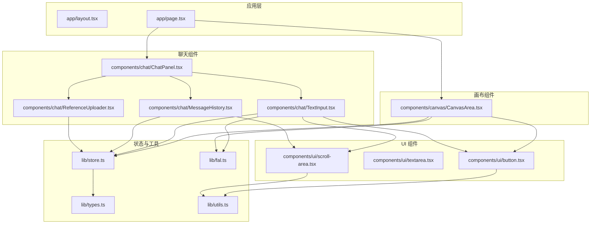
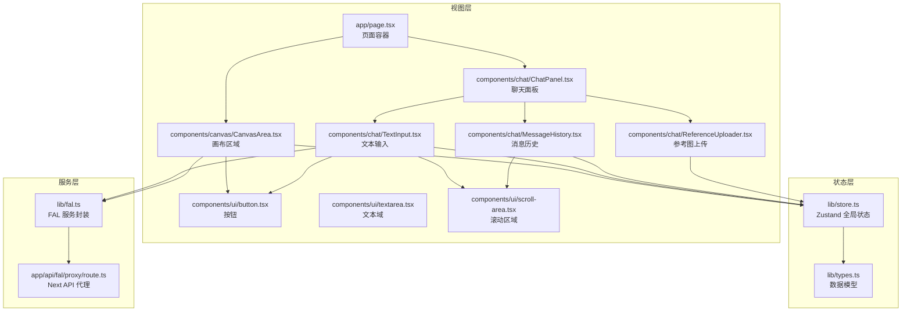
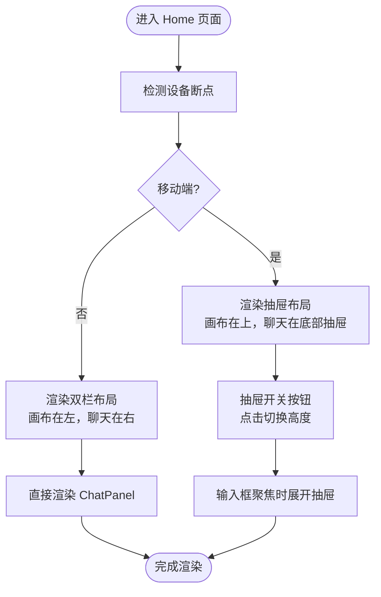
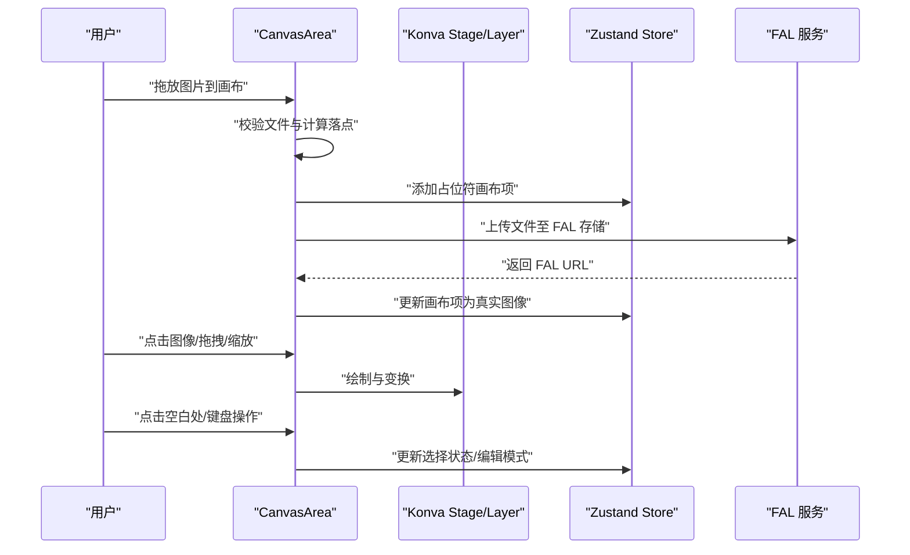
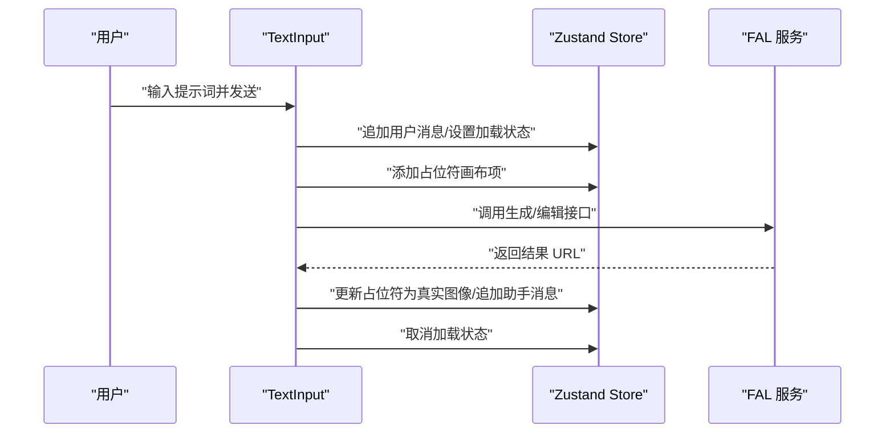
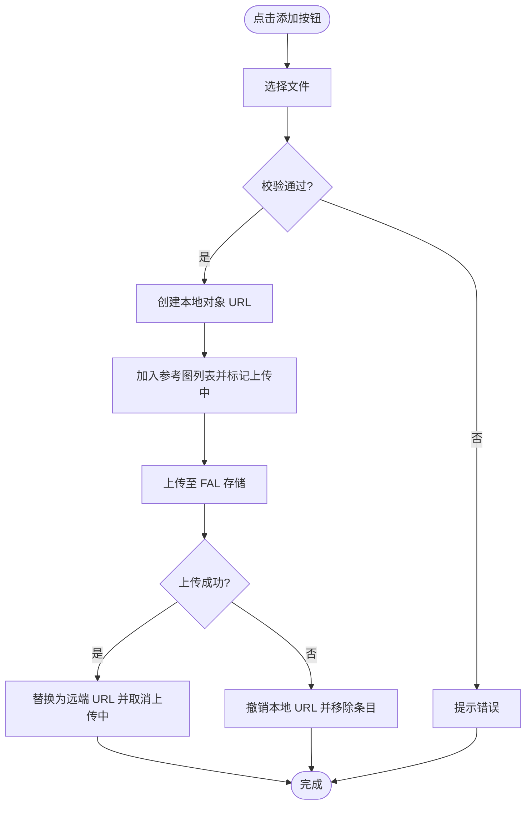
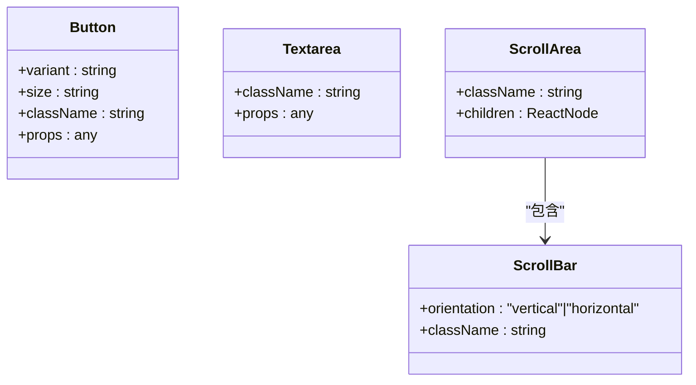
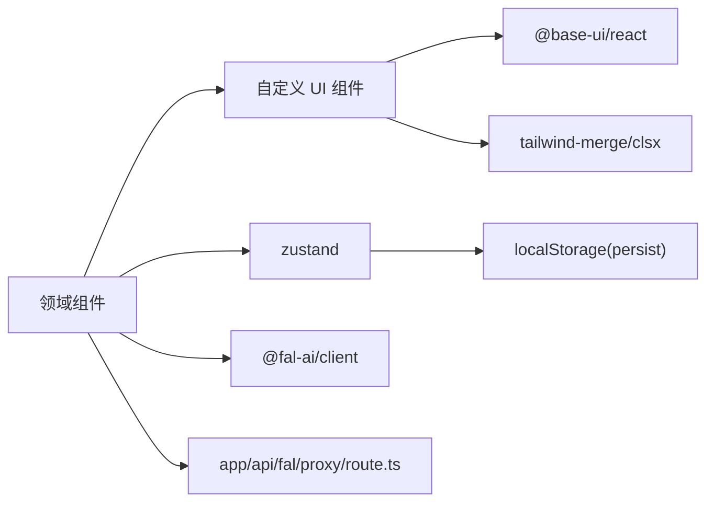

# 组件架构设计

<cite>
**本文档引用的文件**
- [app/layout.tsx](file://app/layout.tsx)
- [app/page.tsx](file://app/page.tsx)
- [components/canvas/CanvasArea.tsx](file://components/canvas/CanvasArea.tsx)
- [components/chat/ChatPanel.tsx](file://components/chat/ChatPanel.tsx)
- [components/chat/TextInput.tsx](file://components/chat/TextInput.tsx)
- [components/chat/MessageHistory.tsx](file://components/chat/MessageHistory.tsx)
- [components/chat/ReferenceUploader.tsx](file://components/chat/ReferenceUploader.tsx)
- [components/ui/button.tsx](file://components/ui/button.tsx)
- [components/ui/textarea.tsx](file://components/ui/textarea.tsx)
- [components/ui/scroll-area.tsx](file://components/ui/scroll-area.tsx)
- [lib/store.ts](file://lib/store.ts)
- [lib/types.ts](file://lib/types.ts)
- [lib/utils.ts](file://lib/utils.ts)
- [lib/fal.ts](file://lib/fal.ts)
- [package.json](file://package.json)
</cite>

## 目录
1. [简介](#简介)
2. [项目结构](#项目结构)
3. [核心组件](#核心组件)
4. [架构总览](#架构总览)
5. [详细组件分析](#详细组件分析)
6. [依赖关系分析](#依赖关系分析)
7. [性能考虑](#性能考虑)
8. [故障排除指南](#故障排除指南)
9. [结论](#结论)
10. [附录](#附录)

## 简介
本项目采用基于 React 函数组件的组件化架构，围绕“画布 + 聊天”的双栏布局构建，结合 Zustand 全局状态管理与 Base UI 原子组件库，形成可扩展、可维护的前端架构。系统通过自定义 UI 组件（按钮、文本域、滚动区域）统一风格与交互，利用组合模式实现复杂功能模块（画布编辑、消息历史、参考图上传），并通过全局状态驱动组件间通信。

## 项目结构
项目采用按功能域分层的目录组织方式：
- 应用入口与全局布局：app 目录负责根布局与页面级路由
- 功能组件：components 目录下按领域拆分，如 canvas 与 chat
- 自定义 UI 组件：components/ui 提供可复用的基础 UI
- 工具与状态：lib 目录封装类型、工具函数、全局状态与外部服务调用
- 构建与依赖：package.json 管理依赖与脚本

图表来源
- [app/page.tsx:1-59](file://app/page.tsx#L1-L59)
- [components/canvas/CanvasArea.tsx:1-431](file://components/canvas/CanvasArea.tsx#L1-L431)
- [components/chat/ChatPanel.tsx:1-22](file://components/chat/ChatPanel.tsx#L1-L22)
- [components/chat/MessageHistory.tsx:1-37](file://components/chat/MessageHistory.tsx#L1-L37)
- [components/chat/ReferenceUploader.tsx:1-100](file://components/chat/ReferenceUploader.tsx#L1-L100)
- [components/chat/TextInput.tsx:1-140](file://components/chat/TextInput.tsx#L1-L140)
- [components/ui/button.tsx:1-61](file://components/ui/button.tsx#L1-L61)
- [components/ui/textarea.tsx:1-19](file://components/ui/textarea.tsx#L1-L19)
- [components/ui/scroll-area.tsx:1-56](file://components/ui/scroll-area.tsx#L1-L56)
- [lib/store.ts:1-119](file://lib/store.ts#L1-L119)
- [lib/types.ts:1-37](file://lib/types.ts#L1-L37)
- [lib/utils.ts:1-7](file://lib/utils.ts#L1-L7)
- [lib/fal.ts:1-62](file://lib/fal.ts#L1-L62)

章节来源
- [app/layout.tsx:1-38](file://app/layout.tsx#L1-L38)
- [app/page.tsx:1-59](file://app/page.tsx#L1-L59)

## 核心组件
- 页面容器与布局：Home 组件负责移动端抽屉与桌面端双栏布局，协调画布与聊天面板的显示与交互
- 画布区域：CanvasArea 负责响应式尺寸、拖拽/滚轮缩放、中键平移、拖放图片、占位符动画与选择/变换逻辑
- 聊天面板：ChatPanel 汇聚消息历史、参考图上传与输入框，支持输入焦点回调
- 文本输入：TextInput 实现提示词发送、占位符生成、加载状态、错误提示与自动高度调整
- 参考图上传：ReferenceUploader 支持多图上传、进度指示、移除与本地对象 URL 管理
- 消息历史：MessageHistory 渲染消息列表并自动滚动到底部
- 自定义 UI：Button、Textarea、ScrollArea 提供一致的视觉与交互体验

章节来源
- [app/page.tsx:8-58](file://app/page.tsx#L8-L58)
- [components/canvas/CanvasArea.tsx:163-431](file://components/canvas/CanvasArea.tsx#L163-L431)
- [components/chat/ChatPanel.tsx:9-21](file://components/chat/ChatPanel.tsx#L9-L21)
- [components/chat/TextInput.tsx:12-139](file://components/chat/TextInput.tsx#L12-L139)
- [components/chat/ReferenceUploader.tsx:13-99](file://components/chat/ReferenceUploader.tsx#L13-L99)
- [components/chat/MessageHistory.tsx:8-36](file://components/chat/MessageHistory.tsx#L8-L36)
- [components/ui/button.tsx:45-60](file://components/ui/button.tsx#L45-L60)
- [components/ui/textarea.tsx:5-18](file://components/ui/textarea.tsx#L5-L18)
- [components/ui/scroll-area.tsx:8-55](file://components/ui/scroll-area.tsx#L8-L55)

## 架构总览
系统采用“页面容器 + 领域组件 + 自定义 UI + 全局状态 + 外部服务”的分层架构：
- 页面容器：负责布局与设备适配，协调画布与聊天面板
- 领域组件：画布与聊天两大功能域，内部组合多个子组件
- 自定义 UI：基于 Base UI 原子组件二次封装，统一变体与样式
- 全局状态：Zustand 管理画布项、聊天历史、编辑模式与加载状态
- 外部服务：FAL AI 生成/编辑与存储服务，Next API Proxy 代理请求

图表来源
- [app/page.tsx:8-58](file://app/page.tsx#L8-L58)
- [components/canvas/CanvasArea.tsx:163-431](file://components/canvas/CanvasArea.tsx#L163-L431)
- [components/chat/ChatPanel.tsx:9-21](file://components/chat/ChatPanel.tsx#L9-L21)
- [components/chat/MessageHistory.tsx:8-36](file://components/chat/MessageHistory.tsx#L8-L36)
- [components/chat/ReferenceUploader.tsx:13-99](file://components/chat/ReferenceUploader.tsx#L13-L99)
- [components/chat/TextInput.tsx:12-139](file://components/chat/TextInput.tsx#L12-L139)
- [components/ui/button.tsx:45-60](file://components/ui/button.tsx#L45-L60)
- [components/ui/textarea.tsx:5-18](file://components/ui/textarea.tsx#L5-L18)
- [components/ui/scroll-area.tsx:8-55](file://components/ui/scroll-area.tsx#L8-L55)
- [lib/store.ts:45-118](file://lib/store.ts#L45-L118)
- [lib/types.ts:17-37](file://lib/types.ts#L17-L37)
- [lib/fal.ts:1-62](file://lib/fal.ts#L1-L62)

## 详细组件分析

### 页面容器与布局（app/page.tsx）
- 职责：根据设备断点切换布局；移动端使用底部抽屉承载聊天面板；桌面端左右分栏
- 关键特性：抽屉开关状态管理、移动端抽屉高度控制、聊天输入焦点回调以自动展开抽屉
- 设计要点：条件渲染与样式类名动态拼接，确保在不同屏幕尺寸下的可用性

图表来源
- [app/page.tsx:8-58](file://app/page.tsx#L8-L58)

章节来源
- [app/page.tsx:8-58](file://app/page.tsx#L8-L58)

### 画布区域（components/canvas/CanvasArea.tsx）
- 职责：响应式画布、拖放图片、占位符动画、选择与变换、下载与清理
- 关键实现：
  - 占位符节点：使用渐变扫光动画提升等待体验
  - 图像节点：支持拖拽、选择、Transformer 缩放与比例锁定
  - 中键平移：原生鼠标事件绕过 Konva，实现平滑导航
  - 滚轮缩放：以指针位置为中心进行缩放并保持坐标一致性
  - 拖放上传：校验文件、计算落点坐标、创建占位符并异步替换结果
- 性能与安全：使用 requestAnimationFrame 控制动画帧；及时撤销本地对象 URL；对副作用进行清理

图表来源
- [components/canvas/CanvasArea.tsx:163-431](file://components/canvas/CanvasArea.tsx#L163-L431)
- [lib/store.ts:45-118](file://lib/store.ts#L45-L118)
- [lib/fal.ts:59-62](file://lib/fal.ts#L59-L62)

章节来源
- [components/canvas/CanvasArea.tsx:163-431](file://components/canvas/CanvasArea.tsx#L163-L431)

### 聊天面板与消息流（components/chat/ChatPanel.tsx、MessageHistory.tsx、TextInput.tsx）
- 职责：展示历史消息、接收用户输入、上传参考图、触发 AI 生成/编辑
- 关键实现：
  - MessageHistory：监听消息数组变化，自动滚动到底部
  - TextInput：支持多行自适应高度、回车发送、禁用条件判断、加载状态与错误提示
  - ChatPanel：聚合消息历史、参考图上传与输入框，暴露输入焦点回调
- 数据流：输入内容经 TextInput 触发生成/编辑流程，创建占位符，完成后替换为真实图像 URL

图表来源
- [components/chat/TextInput.tsx:12-139](file://components/chat/TextInput.tsx#L12-L139)
- [lib/store.ts:45-118](file://lib/store.ts#L45-L118)
- [lib/fal.ts:21-57](file://lib/fal.ts#L21-L57)

章节来源
- [components/chat/ChatPanel.tsx:9-21](file://components/chat/ChatPanel.tsx#L9-L21)
- [components/chat/MessageHistory.tsx:8-36](file://components/chat/MessageHistory.tsx#L8-L36)
- [components/chat/TextInput.tsx:12-139](file://components/chat/TextInput.tsx#L12-L139)

### 参考图上传（components/chat/ReferenceUploader.tsx）
- 职责：多图上传、进度指示、移除与本地对象 URL 管理
- 关键实现：限制数量、校验文件、创建本地预览、上传成功后替换为远端 URL、异常时回滚并撤销本地 URL

图表来源
- [components/chat/ReferenceUploader.tsx:13-99](file://components/chat/ReferenceUploader.tsx#L13-L99)
- [lib/fal.ts:59-62](file://lib/fal.ts#L59-L62)

章节来源
- [components/chat/ReferenceUploader.tsx:13-99](file://components/chat/ReferenceUploader.tsx#L13-L99)

### 自定义 UI 组件（components/ui/button.tsx、textarea.tsx、scroll-area.tsx）
- Button：基于 Base UI Button 封装，使用 class-variance-authority 定义变体与尺寸，统一焦点态与禁用态
- Textarea：标准化边框、圆角、内边距与占位符样式，支持最小/最大高度约束
- ScrollArea：封装滚动区域与滚动条，提供垂直/水平方向配置与焦点态环形高亮

图表来源
- [components/ui/button.tsx:45-60](file://components/ui/button.tsx#L45-L60)
- [components/ui/textarea.tsx:5-18](file://components/ui/textarea.tsx#L5-L18)
- [components/ui/scroll-area.tsx:8-55](file://components/ui/scroll-area.tsx#L8-L55)

章节来源
- [components/ui/button.tsx:45-60](file://components/ui/button.tsx#L45-L60)
- [components/ui/textarea.tsx:5-18](file://components/ui/textarea.tsx#L5-L18)
- [components/ui/scroll-area.tsx:8-55](file://components/ui/scroll-area.tsx#L8-L55)

## 依赖关系分析
- 组件耦合：页面容器仅负责布局与事件转发；领域组件内部组合子组件；自定义 UI 低耦合、高内聚
- 状态耦合：所有业务组件通过 Zustand 访问与更新状态，避免跨层级传递
- 外部依赖：Base UI 提供无障碍与可访问性；Zustand 管理全局状态；FAL 提供 AI 生成能力；Next API Proxy 解决跨域

图表来源
- [package.json:11-29](file://package.json#L11-L29)
- [lib/store.ts:102-118](file://lib/store.ts#L102-L118)
- [lib/fal.ts:3](file://lib/fal.ts#L3)

章节来源
- [package.json:11-29](file://package.json#L11-L29)
- [lib/store.ts:102-118](file://lib/store.ts#L102-L118)

## 性能考虑
- 动画与渲染
  - 使用 requestAnimationFrame 控制占位符动画，避免阻塞主线程
  - Konva 批量绘制（batchDraw）减少重绘次数
- 事件处理
  - 中键平移使用原生事件，绕过 Konva 事件系统，降低事件处理开销
  - 滚轮缩放通过指针坐标换算，避免不必要的重排
- 内存管理
  - 及时撤销本地对象 URL，防止内存泄漏
  - 清理 ResizeObserver、DOM 事件监听器与动画帧
- 状态与渲染
  - 使用 useCallback 包裹事件处理器，减少子组件不必要重渲染
  - 消息历史自动滚动使用防抖式副作用，避免频繁 DOM 操作

[本节为通用指导，无需特定文件引用]

## 故障排除指南
- 上传失败
  - 现象：上传后仍显示“上传中”或报错
  - 排查：确认 FAL_KEY 配置与网络连通性；查看控制台错误信息；检查本地对象 URL 是否被撤销
  - 处理：重试上传；若持续失败，移除条目并重新选择文件
- 画布无响应
  - 现象：拖拽/缩放无效
  - 排查：确认中键平移状态；检查事件监听是否被正确清理；验证 Konva 节点引用
- 占位符不消失
  - 现象：生成完成后占位符未替换
  - 排查：确认返回的图像 URL；检查状态更新逻辑；验证占位符 ID 与更新目标一致
- 移动端抽屉无法展开
  - 现象：输入框聚焦后抽屉未展开
  - 排查：确认回调函数传递与执行；检查抽屉高度样式与过渡动画

章节来源
- [components/canvas/CanvasArea.tsx:331-338](file://components/canvas/CanvasArea.tsx#L331-L338)
- [components/chat/ReferenceUploader.tsx:32-38](file://components/chat/ReferenceUploader.tsx#L32-L38)
- [components/chat/TextInput.tsx:82-88](file://components/chat/TextInput.tsx#L82-L88)

## 结论
该组件架构以函数组件为核心，通过清晰的分层与组合模式实现了画布与聊天两大功能域的解耦。自定义 UI 组件统一了交互与视觉标准，Zustand 全局状态简化了组件间通信，FAL 服务与 API 代理保障了外部能力接入。整体设计具备良好的可扩展性与可维护性，适合在后续迭代中引入更多功能模块与交互形态。

[本节为总结性内容，无需特定文件引用]

## 附录

### 组件复用策略与最佳实践
- 组合优于继承：通过 props 与 children 组合多个子组件，避免复杂的继承体系
- 变体与尺寸：使用 class-variance-authority 定义统一变体，保证组件风格一致性
- 禁用与状态：通过状态字段控制组件行为，避免在 UI 层做过多分支判断
- 无障碍与可访问性：遵循 Base UI 的语义化标签与数据槽命名，提升可访问性

### 生命周期管理与内存泄漏防护
- 在 useEffect 中注册的事件监听器需在返回函数中注销
- 对象 URL 需在组件卸载或错误回滚时撤销
- 动画帧需在组件卸载时取消，避免持续运行造成内存占用

### 代码规范建议
- 统一使用 data-slot 属性标识组件内部元素，便于主题与样式覆盖
- 使用 cn 辅助函数合并与合并类名，避免重复与冲突
- 将副作用封装为独立 Hook 或工具函数，提高可测试性与复用性

[本节为通用指导，无需特定文件引用]