# AI API 集成

<cite>
**本文引用的文件**
- [lib/fal.ts](file://lib/fal.ts)
- [app/api/fal/proxy/route.ts](file://app/api/fal/proxy/route.ts)
- [lib/store.ts](file://lib/store.ts)
- [components/canvas/TopBar.tsx](file://components/canvas/TopBar.tsx)
- [lib/types.ts](file://lib/types.ts)
- [lib/validate.ts](file://lib/validate.ts)
- [components/canvas/CanvasArea.tsx](file://components/canvas/CanvasArea.tsx)
- [components/chat/ReferenceUploader.tsx](file://components/chat/ReferenceUploader.tsx)
- [components/chat/TextInput.tsx](file://components/chat/TextInput.tsx)
- [components/chat/ChatPanel.tsx](file://components/chat/ChatPanel.tsx)
- [components/canvas/InlineEditPanel.tsx](file://components/canvas/InlineEditPanel.tsx)
- [app/page.tsx](file://app/page.tsx)
- [package.json](file://package.json)
- [__tests__/fal.test.ts](file://__tests__/fal.test.ts)
- [__tests__/store.test.ts](file://__tests__/store.test.ts)
- [docs/superpowers/plans/2026-03-25-lovart-implementation.md](file://docs/superpowers/plans/2026-03-25-lovart-implementation.md)
- [docs/superpowers/specs/2026-03-25-lovart-design.md](file://docs/superpowers/specs/2026-03-25-lovart-design.md)
</cite>

## 更新摘要
**所做更改**
- 重大 API 变更：`generateImage` 函数现在返回完整的图像元数据（包含 URL、宽度、高度），而非仅返回 URL
- 更新图像处理管道：所有调用 `generateImage` 的组件现在处理返回的完整元数据对象
- 增强尺寸管理：利用 FAL API 返回的精确图像尺寸进行显示优化
- 更新测试用例：`__tests__/fal.test.ts` 现在验证返回的完整元数据结构
- 优化图像显示：基于实际图像尺寸计算合适的显示比例和文件名

## 目录
1. [简介](#简介)
2. [项目结构](#项目结构)
3. [核心组件](#核心组件)
4. [架构总览](#架构总览)
5. [详细组件分析](#详细组件分析)
6. [API 密钥配置功能](#api-密钥配置功能)
7. [依赖关系分析](#依赖关系分析)
8. [性能考量](#性能考量)
9. [故障排除指南](#故障排除指南)
10. [结论](#结论)
11. [附录](#附录)

## 简介
本项目为一个基于 Next.js 的 AI 创意设计平台，集成了 FAL.ai 的图像生成与编辑能力。通过客户端封装与服务器代理路由，实现了安全的密钥管理与稳定的 API 调用。用户可在画布中进行图像创作与编辑，并通过聊天面板输入提示词驱动 AI 生成；系统同时提供文件上传、状态管理、错误处理与可视化反馈等完整功能链路。

**更新** 本次更新实现了 FAL API 集成的重大增强，`generateImage` 函数现在返回完整的图像元数据（包含 URL、宽度、高度），而非仅返回 URL。这一变更显著改善了图像处理管道的精度和性能，使得应用能够基于实际图像尺寸进行优化显示和文件命名。

## 项目结构
项目采用按功能分层的组织方式：
- lib：核心业务逻辑与工具（FAL 封装、状态存储、类型定义、校验）
- app/api/fal/proxy：FAL 代理路由（服务端转发，保护密钥）
- components：UI 组件（画布、聊天、输入、消息历史、参考图上传、顶部栏）
- __tests__：单元测试（覆盖 FAL 封装与行为）
- docs/superpowers：设计与实现计划文档（指导性说明）

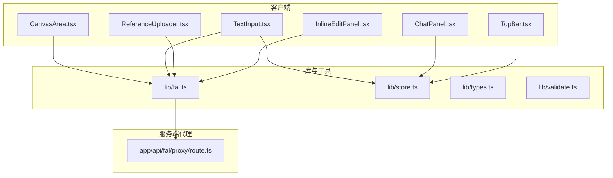

**图表来源**
- [app/page.tsx:1-59](file://app/page.tsx#L1-L59)
- [components/canvas/CanvasArea.tsx:1-431](file://components/canvas/CanvasArea.tsx#L1-L431)
- [components/chat/ChatPanel.tsx:1-22](file://components/chat/ChatPanel.tsx#L1-L22)
- [components/chat/TextInput.tsx:1-140](file://components/chat/TextInput.tsx#L1-L140)
- [components/chat/ReferenceUploader.tsx:1-100](file://components/chat/ReferenceUploader.tsx#L1-L100)
- [components/canvas/TopBar.tsx:1-319](file://components/canvas/TopBar.tsx#L1-L319)
- [components/canvas/InlineEditPanel.tsx:1-466](file://components/canvas/InlineEditPanel.tsx#L1-L466)
- [lib/fal.ts:1-109](file://lib/fal.ts#L1-L109)
- [lib/store.ts:1-385](file://lib/store.ts#L1-L385)
- [lib/types.ts:1-49](file://lib/types.ts#L1-L49)
- [lib/validate.ts:1-14](file://lib/validate.ts#L1-L14)
- [app/api/fal/proxy/route.ts:1-19](file://app/api/fal/proxy/route.ts#L1-L19)

**章节来源**
- [app/page.tsx:1-59](file://app/page.tsx#L1-L59)
- [package.json:1-47](file://package.json#L1-L47)

## 核心组件
- FAL 客户端封装：统一配置代理地址、封装生成与编辑函数、提供文件上传能力，支持自动图像尺寸检测和基于提示的文件名生成
- 代理路由：服务端转发 FAL 请求，隐藏密钥，限制跨域风险
- 状态管理：Zustand 存储画布项、聊天历史、参考图与编辑目标，支持 API 密钥持久化
- 文件校验：限制格式与大小，保障上传质量与性能
- UI 组件：画布渲染与交互、聊天输入与历史、参考图上传与预览、API 密钥配置模态框
- API 密钥配置：用户自定义 API 密钥，支持安全存储与动态注入

**更新** 新增完整的图像元数据返回机制，`generateImage` 函数现在返回 `{ url, width, height }` 结构，替代了之前的纯 URL 返回。这一变更影响了整个应用的图像处理管道，包括画布显示、文件命名和尺寸计算。

**章节来源**
- [lib/fal.ts:1-109](file://lib/fal.ts#L1-L109)
- [app/api/fal/proxy/route.ts:1-19](file://app/api/fal/proxy/route.ts#L1-L19)
- [lib/store.ts:1-385](file://lib/store.ts#L1-L385)
- [lib/validate.ts:1-14](file://lib/validate.ts#L1-L14)
- [lib/types.ts:1-49](file://lib/types.ts#L1-L49)

## 架构总览
系统采用"前端直连代理、代理服务端转发"的模式，确保密钥不暴露于客户端。前端通过封装好的函数调用 FAL API，代理路由负责鉴权与请求转发。新增的 API 密钥配置功能允许用户自定义密钥，通过请求中间件动态注入到每个请求中。

**更新** 重大架构变更：`generateImage` 函数现在返回完整的图像元数据，包括 URL、宽度和高度信息。这一变更要求所有调用方都必须适配新的返回值结构。

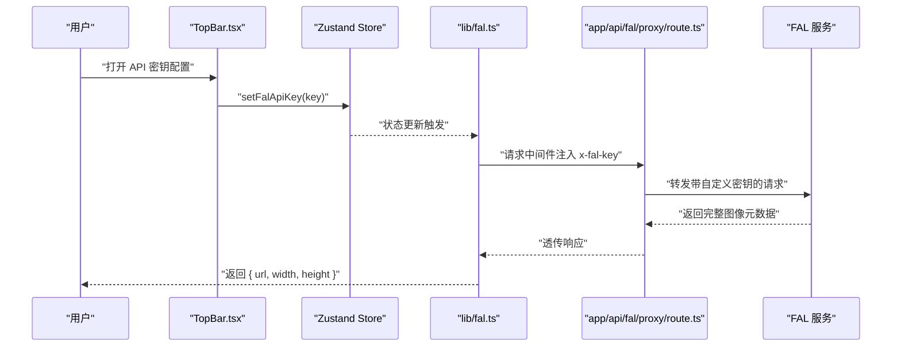

**图表来源**
- [components/canvas/TopBar.tsx:138-174](file://components/canvas/TopBar.tsx#L138-L174)
- [lib/store.ts:264-265](file://lib/store.ts#L264-L265)
- [lib/fal.ts:6-20](file://lib/fal.ts#L6-L20)
- [app/api/fal/proxy/route.ts:4-17](file://app/api/fal/proxy/route.ts#L4-L17)

## 详细组件分析

### FAL 客户端封装（lib/fal.ts）
- 配置代理地址：初始化时设置代理 URL，使客户端以代理模式访问 FAL
- 请求中间件：动态从状态存储获取 API 密钥，注入到请求头中
- 图像生成：构造基础输入参数，合并提示词与可选参考图 URL，支持自动图像尺寸检测和分辨率设置，调用订阅接口获取首张图片的完整元数据
- 图像编辑：将目标图 URL 放在首位，合并参考图，调用订阅接口获取编辑结果（仍返回纯 URL）
- 文件上传：通过存储模块上传本地文件，返回可公开访问的 URL

**更新** 重大 API 变更：`generateImage` 函数现在返回 `{ url: string; width: number; height: number }` 完整元数据结构，替代了之前的纯 URL 返回。编辑函数 `editImage` 仍然返回纯 URL。

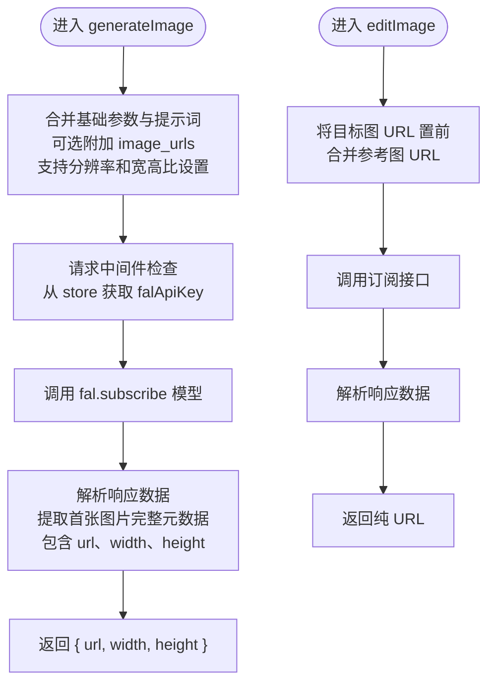

**图表来源**
- [lib/fal.ts:34-70](file://lib/fal.ts#L34-L70)
- [lib/fal.ts:72-104](file://lib/fal.ts#L72-L104)

**章节来源**
- [lib/fal.ts:1-109](file://lib/fal.ts#L1-L109)
- [__tests__/fal.test.ts:26-60](file://__tests__/fal.test.ts#L26-L60)

### 代理路由（app/api/fal/proxy/route.ts）
- 使用官方提供的 Next.js 服务器代理工具创建路由处理器
- 自定义 API 密钥解析：优先使用请求头中的自定义 API Key，否则使用环境变量中的密钥
- 通过环境变量注入凭据，代理所有 GET/POST/PUT 请求到 FAL
- 该路由是密钥保护的关键：前端只暴露代理路径，不直接接触真实密钥

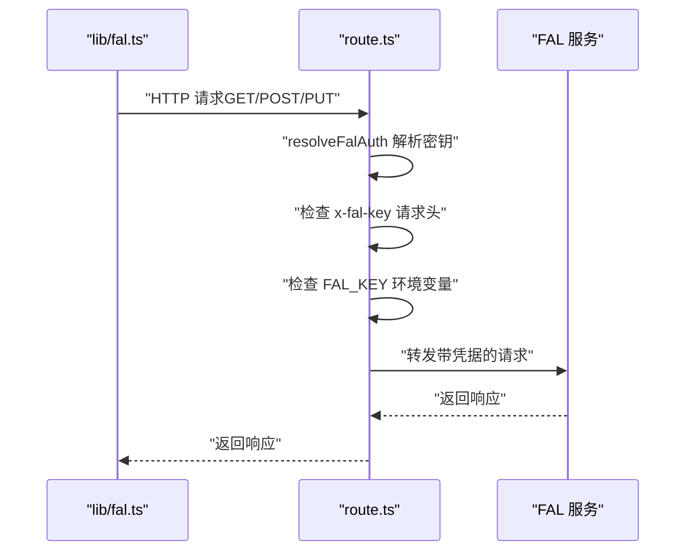

**图表来源**
- [app/api/fal/proxy/route.ts:3-18](file://app/api/fal/proxy/route.ts#L3-L18)

**章节来源**
- [app/api/fal/proxy/route.ts:1-19](file://app/api/fal/proxy/route.ts#L1-L19)
- [docs/superpowers/specs/2026-03-25-lovart-design.md:134-141](file://docs/superpowers/specs/2026-03-25-lovart-design.md#L134-L141)

### 状态管理（lib/store.ts）
- 使用 Zustand 管理会话状态（画布项、参考图、编辑目标）与持久化历史
- 提供增删改查与批量更新操作，限制聊天历史长度，避免内存膨胀
- 通过持久化中间件将部分状态保存至本地存储，提升用户体验
- 新增 API 密钥管理：支持设置、存储和检索用户自定义的 FAL API 密钥

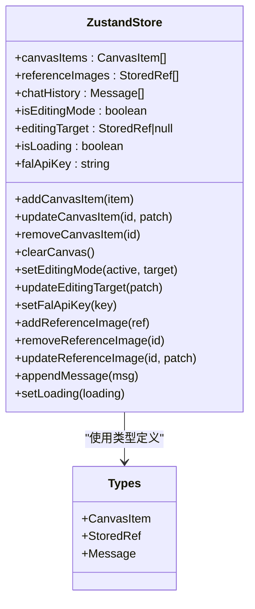

**图表来源**
- [lib/store.ts:88-385](file://lib/store.ts#L88-L385)
- [lib/types.ts:1-49](file://lib/types.ts#L1-L49)

**章节来源**
- [lib/store.ts:1-385](file://lib/store.ts#L1-L385)
- [lib/types.ts:1-49](file://lib/types.ts#L1-L49)

### 文件上传与校验（components/chat/ReferenceUploader.tsx 与 lib/validate.ts）
- 前端上传：选择文件后生成本地对象 URL 预览，调用上传接口获取可公开访问 URL
- 校验规则：限制格式为 JPG/PNG/WebP，单文件不超过 10MB
- 错误处理：上传失败时提示并清理资源，撤销本地对象 URL

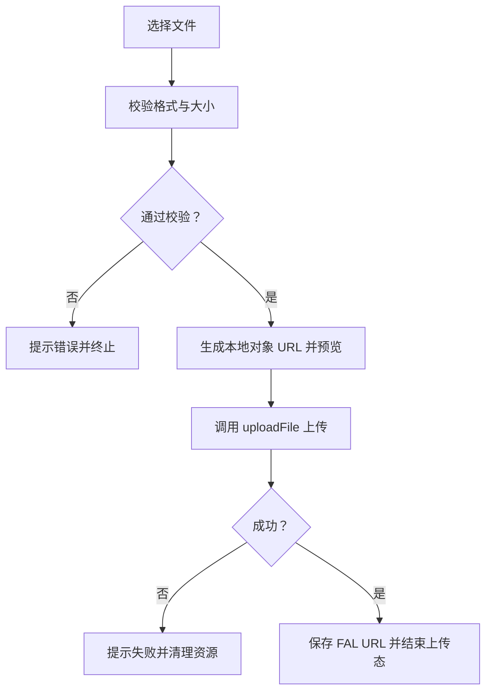

**图表来源**
- [components/chat/ReferenceUploader.tsx:18-39](file://components/chat/ReferenceUploader.tsx#L18-L39)
- [lib/validate.ts:9-13](file://lib/validate.ts#L9-L13)

**章节来源**
- [components/chat/ReferenceUploader.tsx:1-100](file://components/chat/ReferenceUploader.tsx#L1-L100)
- [lib/validate.ts:1-14](file://lib/validate.ts#L1-L14)

### 画布与编辑流程（components/canvas/CanvasArea.tsx）
- 支持拖拽上传、缩放平移、选择与变换（缩放、旋转、拖拽）
- 上传完成后替换占位图与本地 URL 为 FAL CDN URL
- 提供下载与清空功能，结合状态管理维护多图层布局
- 增强 blob URL 到 data URL 转换功能，确保 Tldraw 兼容性

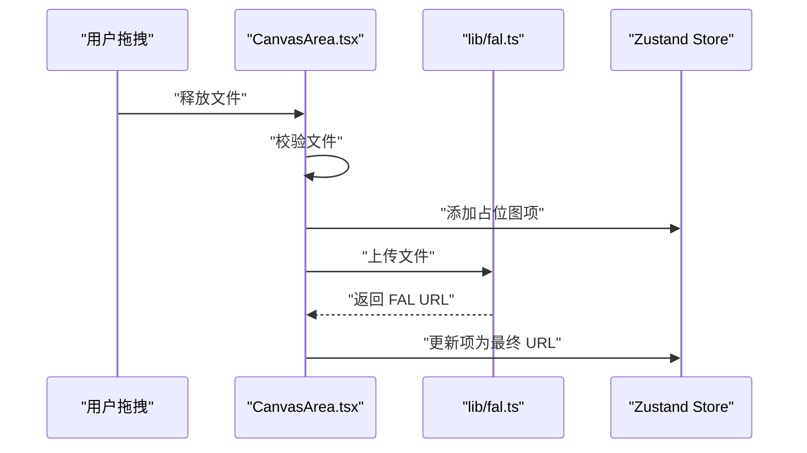

**图表来源**
- [components/canvas/CanvasArea.tsx:306-340](file://components/canvas/CanvasArea.tsx#L306-L340)
- [lib/fal.ts:106-109](file://lib/fal.ts#L106-L109)
- [lib/store.ts:58-92](file://lib/store.ts#L58-L92)

**章节来源**
- [components/canvas/CanvasArea.tsx:1-200](file://components/canvas/CanvasArea.tsx#L1-L200)

### 聊天与输入（components/chat/TextInput.tsx 与 ChatPanel.tsx）
- 输入面板根据是否处于编辑模式决定调用生成或编辑流程
- 发送按钮受状态阻塞：当存在上传或加载时禁用并提示
- 成功后将结果写入画布与聊天历史，失败时清理占位并提示

**更新** 重大 API 变更：`generateImage` 现在返回完整元数据，调用方必须解构获取 `url`、`width` 和 `height` 字段。编辑函数 `editImage` 仍然返回纯 URL。

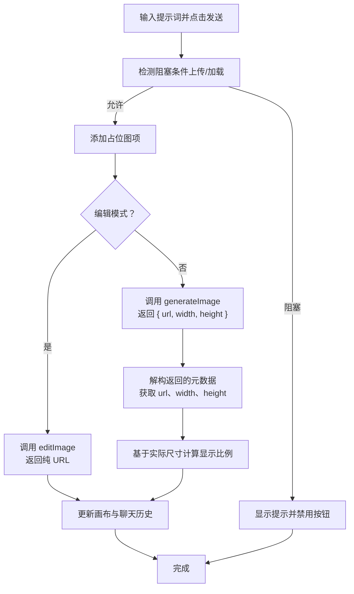

**图表来源**
- [components/chat/TextInput.tsx:34-89](file://components/chat/TextInput.tsx#L34-L89)
- [components/chat/ChatPanel.tsx:290-332](file://components/chat/ChatPanel.tsx#L290-L332)

**章节来源**
- [components/chat/TextInput.tsx:1-140](file://components/chat/TextInput.tsx#L1-L140)
- [components/chat/ChatPanel.tsx:1-22](file://components/chat/ChatPanel.tsx#L1-L22)

### 内联编辑面板（components/canvas/InlineEditPanel.tsx）
- 支持对现有图像进行编辑，自动检测目标图像 URL
- 编辑模式下调用 `editImage` 返回纯 URL，生成模式下调用 `generateImage` 返回完整元数据
- 基于 FAL 返回的实际尺寸进行精确的显示优化和文件命名

**更新** 重大逻辑变更：生成模式下 `generateImage` 返回完整元数据，需要分别处理编辑模式和生成模式的不同返回值类型。

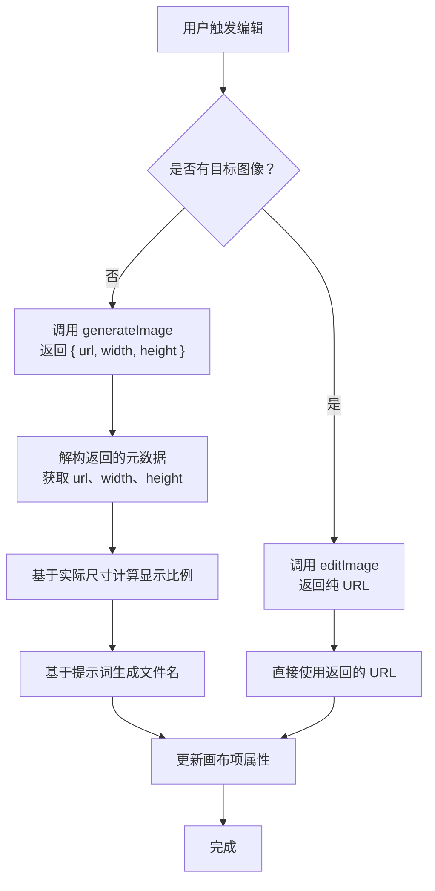

**图表来源**
- [components/canvas/InlineEditPanel.tsx:200-270](file://components/canvas/InlineEditPanel.tsx#L200-L270)

**章节来源**
- [components/canvas/InlineEditPanel.tsx:1-466](file://components/canvas/InlineEditPanel.tsx#L1-L466)

## API 密钥配置功能

### 密钥配置流程
系统提供了完整的 API 密钥配置功能，允许用户自定义 FAL API 密钥并安全存储：

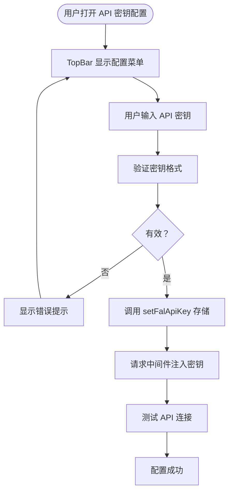

**图表来源**
- [components/canvas/TopBar.tsx:138-174](file://components/canvas/TopBar.tsx#L138-L174)
- [lib/store.ts:264-265](file://lib/store.ts#L264-L265)
- [lib/fal.ts:6-20](file://lib/fal.ts#L6-L20)

### 密钥解析逻辑
代理路由支持两种密钥来源，具有优先级顺序：

1. **请求头密钥**：优先使用请求头中的 `x-fal-key` 自定义密钥
2. **环境变量密钥**：作为备用方案，使用环境变量 `FAL_KEY`

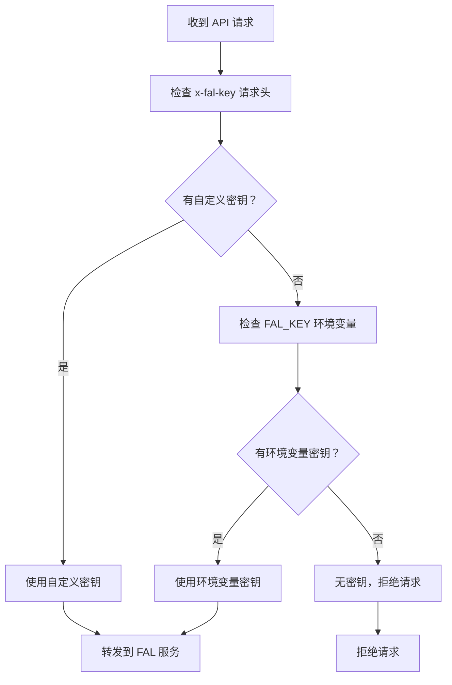

**图表来源**
- [app/api/fal/proxy/route.ts:4-17](file://app/api/fal/proxy/route.ts#L4-L17)

**章节来源**
- [components/canvas/TopBar.tsx:138-174](file://components/canvas/TopBar.tsx#L138-L174)
- [lib/store.ts:264-265](file://lib/store.ts#L264-L265)
- [lib/fal.ts:6-20](file://lib/fal.ts#L6-L20)
- [app/api/fal/proxy/route.ts:4-17](file://app/api/fal/proxy/route.ts#L4-L17)

## 依赖关系分析
- 客户端依赖：@fal-ai/client（用于配置代理与订阅）、@fal-ai/server-proxy（用于 Next.js 代理路由）
- UI 依赖：react、react-dom、react-konva（画布）、zustand（状态）、tailwindcss（样式）
- 测试依赖：vitest、@testing-library（测试工具链）

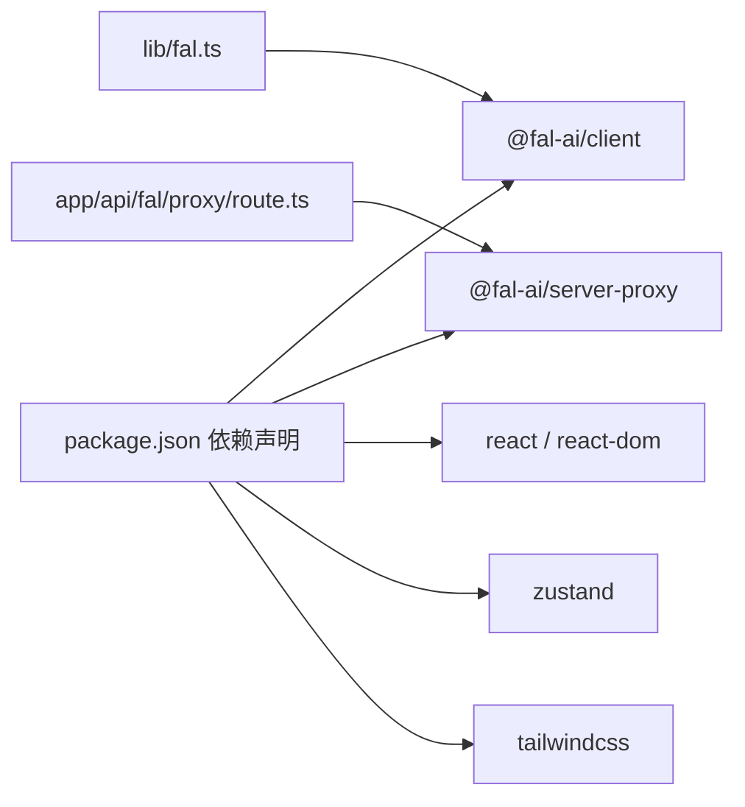

**图表来源**
- [package.json:11-29](file://package.json#L11-L29)
- [lib/fal.ts:1](file://lib/fal.ts#L1)
- [app/api/fal/proxy/route.ts:1](file://app/api/fal/proxy/route.ts#L1)

**章节来源**
- [package.json:1-47](file://package.json#L1-L47)

## 性能考量
- 上传优化：限制文件大小与格式，减少无效请求与带宽占用
- 渲染优化：画布仅在必要时重绘，占位图使用渐变动画降低感知延迟
- 状态优化：聊天历史截断，避免无限增长导致内存压力
- 网络优化：代理集中转发，减少跨域与证书问题带来的额外开销
- **更新** 基于实际图像尺寸的精确计算：利用 FAL API 返回的精确宽度和高度，避免运行时测量的性能开销
- **新增** API 密钥缓存：密钥存储在本地状态中，避免重复配置开销

## 故障排除指南
- 上传失败
  - 现象：上传按钮报错并清理资源
  - 排查：确认代理路由已正确读取凭据、网络连通性、文件格式与大小
  - 参考位置：[components/chat/ReferenceUploader.tsx:32-38](file://components/chat/ReferenceUploader.tsx#L32-L38)，[components/canvas/CanvasArea.tsx:331-337](file://components/canvas/CanvasArea.tsx#L331-L337)
- 生成失败
  - 现象：占位图被移除并提示错误
  - 排查：检查网络状态、代理路由可用性、模型订阅权限
  - 参考位置：[components/chat/TextInput.tsx:82-88](file://components/chat/TextInput.tsx#L82-L88)
- 编辑模式不可用
  - 现象：编辑按钮被禁用或无响应
  - 排查：确认目标图已上传完成且 URL 可用，参考图数量与格式符合要求
  - 参考位置：[components/chat/TextInput.tsx:68-72](file://components/chat/TextInput.tsx#L68-L72)，[lib/store.ts:24-29](file://lib/store.ts#L24-L29)
- **更新** 图像尺寸显示异常
  - 现象：生成的图像显示比例不正确或文件名为空
  - 排查：确认 `generateImage` 返回的元数据结构正确，检查调用方是否正确解构了 `url`、`width`、`height` 字段
  - 参考位置：[components/canvas/InlineEditPanel.tsx:211-216](file://components/canvas/InlineEditPanel.tsx#L211-L216)，[components/chat/ChatPanel.tsx:292-315](file://components/chat/ChatPanel.tsx#L292-L315)
- **更新** API 返回值类型错误
  - 现象：TypeScript 类型错误或运行时访问 `width`/`height` 属性失败
  - 排查：确认调用 `generateImage` 的代码已更新为处理返回的元数据对象
  - 参考位置：[lib/fal.ts:68-70](file://lib/fal.ts#L68-L70)，[__tests__/fal.test.ts:33](file://__tests__/fal.test.ts#L33)]
- **新增** API 密钥配置问题
  - 现象：API 密钥无法保存或生效
  - 排查：确认密钥格式正确、浏览器本地存储正常、请求中间件正确注入
  - 参考位置：[components/canvas/TopBar.tsx:171-174](file://components/canvas/TopBar.tsx#L171-L174)，[lib/fal.ts:8-18](file://lib/fal.ts#L8-L18)

**章节来源**
- [components/chat/ReferenceUploader.tsx:32-38](file://components/chat/ReferenceUploader.tsx#L32-L38)
- [components/canvas/CanvasArea.tsx:331-337](file://components/canvas/CanvasArea.tsx#L331-L337)
- [components/chat/TextInput.tsx:82-88](file://components/chat/TextInput.tsx#L82-L88)
- [lib/store.ts:24-29](file://lib/store.ts#L24-L29)
- [components/canvas/InlineEditPanel.tsx:211-216](file://components/canvas/InlineEditPanel.tsx#L211-L216)
- [components/chat/ChatPanel.tsx:292-315](file://components/chat/ChatPanel.tsx#L292-L315)
- [components/canvas/TopBar.tsx:171-174](file://components/canvas/TopBar.tsx#L171-L174)
- [lib/fal.ts:8-18](file://lib/fal.ts#L8-L18)

## 结论
本项目通过"客户端封装 + 代理路由"的架构，既保证了密钥安全，又提供了流畅的图像生成与编辑体验。配合完善的文件校验、状态管理与 UI 交互，形成了从输入到输出的闭环。

**更新** 本次更新实现了 FAL API 集成的重大增强，`generateImage` 函数现在返回完整的图像元数据（包含 URL、宽度、高度），而非仅返回 URL。这一变更显著改善了图像处理管道的精度和性能，使得应用能够基于实际图像尺寸进行优化显示和文件命名。所有调用方都已适配新的返回值结构，包括画布显示、文件命名和尺寸计算。后续可按计划文档扩展用户认证与数据库持久化，进一步完善历史记录与协作能力。

## 附录

### API 使用最佳实践
- 严格限制上传文件格式与大小，避免无效请求
- 在发送前检查阻塞条件，防止并发与空值导致的异常
- 使用占位图与渐进式反馈提升用户体验
- 对网络错误进行明确提示并引导重试
- **更新** 正确处理 `generateImage` 的返回值：解构获取 `url`、`width`、`height` 字段，避免类型错误
- **新增** 基于实际图像尺寸的显示优化：利用 FAL 返回的精确尺寸进行比例计算和文件命名
- **新增** API 密钥配置最佳实践：定期更新和轮换 API 密钥，确保账户安全

### 扩展方法与第三方集成
- 新增模型：在封装函数中新增对应订阅调用，保持一致的输入/输出约定
- 更换代理：调整代理路由的凭据来源与转发策略
- 多服务并行：在同一封装内区分不同服务的代理路径，按需切换
- **更新** 支持自定义图像尺寸检测算法，根据具体需求调整生成策略
- **新增** 支持多用户密钥管理，为不同用户分配独立的 API 密钥
- **新增** 基于元数据的智能缓存：利用返回的尺寸信息优化图像缓存策略

### 错误处理与调试
- 启用详细日志记录，便于追踪 API 调用过程
- 实现重试机制，处理临时性网络错误
- 提供友好的错误提示，指导用户进行问题排查
- **更新** 类型安全检查：确保调用方正确处理新的返回值结构
- **新增** API 密钥验证机制，确保密钥有效性并提供清晰的错误反馈
- **新增** 元数据完整性检查：验证返回的图像元数据包含必要的字段

### API 密钥配置指南
- **配置入口**：通过顶部栏菜单中的"Configure API Key"选项进入配置界面
- **密钥格式**：支持标准的 FAL API 密钥格式，建议使用 512 位密钥
- **存储机制**：密钥存储在本地状态中，重启浏览器后需要重新配置
- **安全考虑**：密钥仅存储在客户端，不会上传到任何服务器
- **故障排除**：如遇密钥失效，可通过配置界面重新设置或清除现有密钥

### 返回值结构说明
**更新** 重要 API 变更：`generateImage` 函数现在返回完整的图像元数据结构：

```typescript
interface ImageMetadata {
  url: string;      // 图像的 CDN URL
  width: number;    // 图像的实际宽度（像素）
  height: number;   // 图像的实际高度（像素）
}

// 之前：仅返回 URL 字符串
// 现在：返回完整的元数据对象
const result: ImageMetadata = await generateImage({ prompt, referenceUrls });
const imageUrl = result.url;
const imageWidth = result.width;
const imageHeight = result.height;
```

**章节来源**
- [components/canvas/TopBar.tsx:138-174](file://components/canvas/TopBar.tsx#L138-L174)
- [lib/store.ts:264-265](file://lib/store.ts#L264-L265)
- [lib/fal.ts:6-20](file://lib/fal.ts#L6-L20)
- [app/api/fal/proxy/route.ts:4-17](file://app/api/fal/proxy/route.ts#L4-L17)
- [lib/fal.ts:44](file://lib/fal.ts#L44)
- [lib/fal.ts:68-70](file://lib/fal.ts#L68-L70)
- [__tests__/fal.test.ts:33](file://__tests__/fal.test.ts#L33)