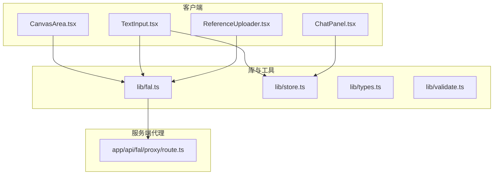
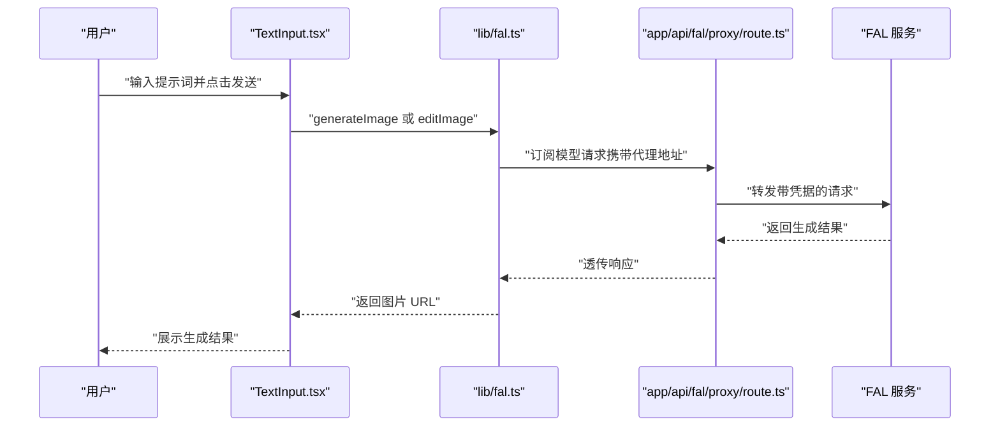
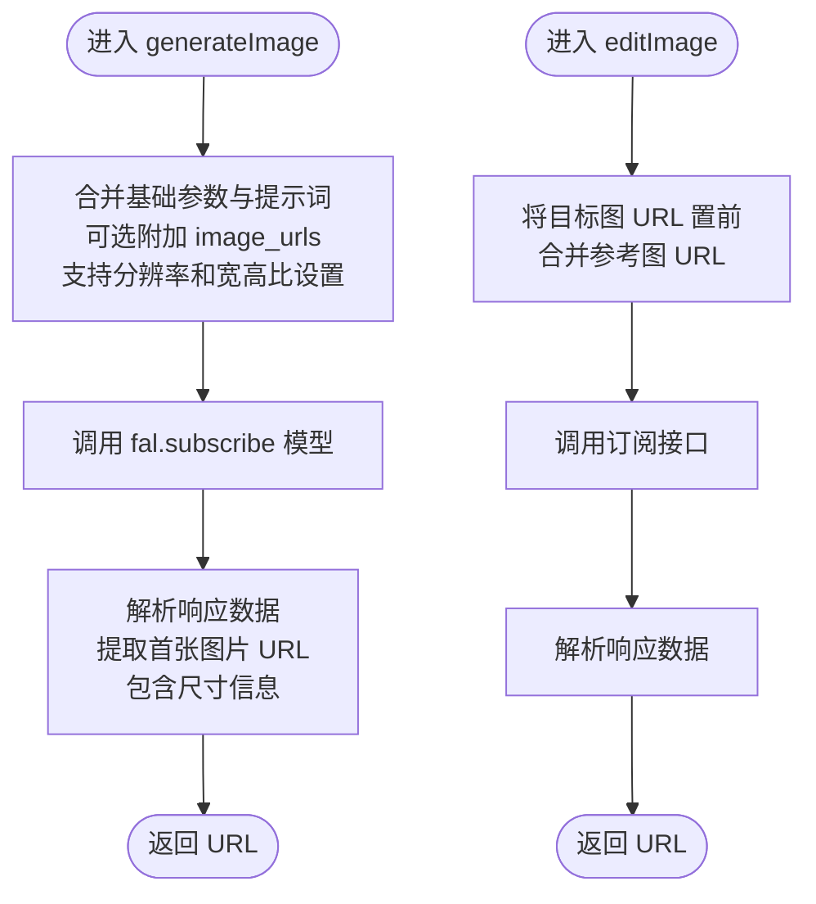
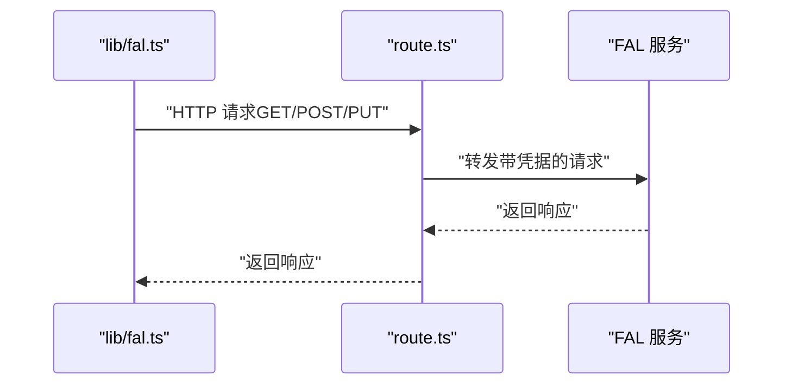
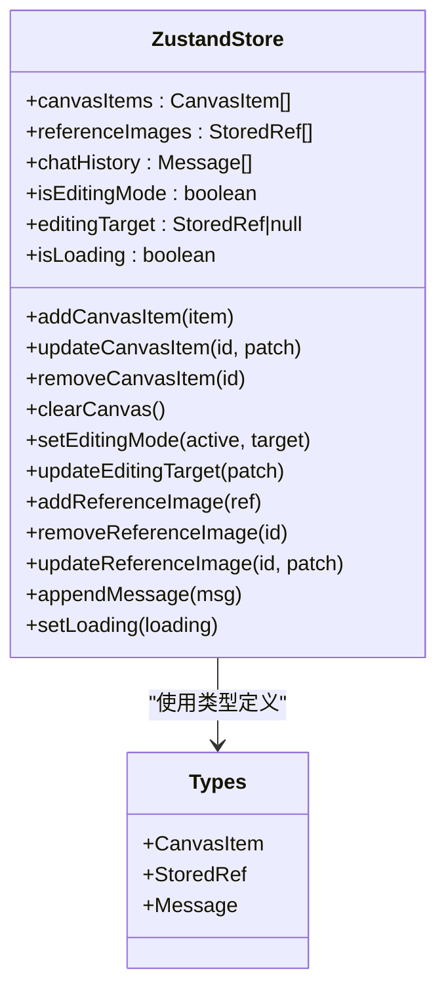
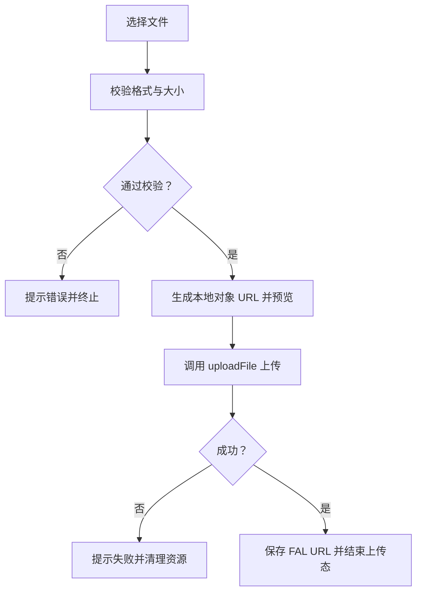
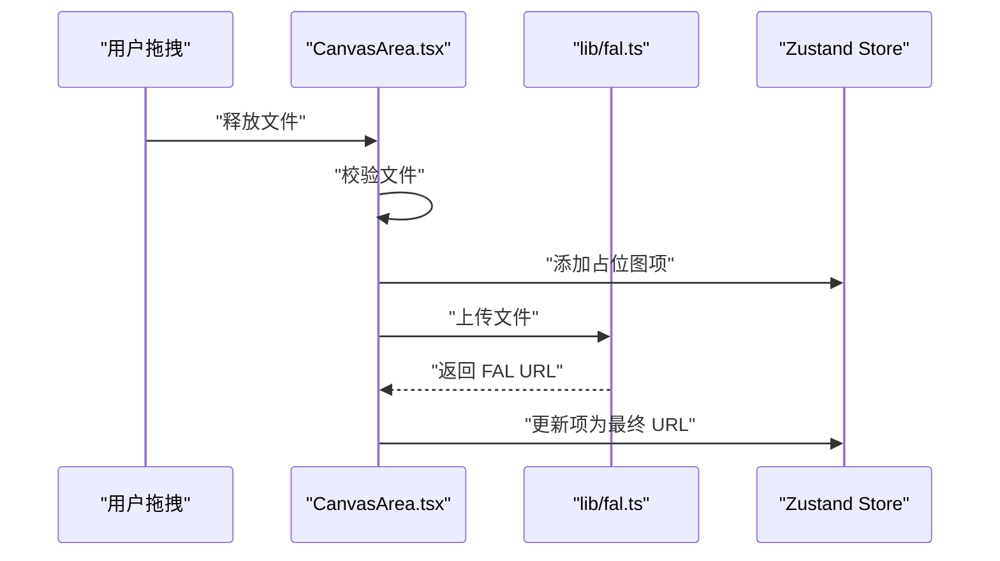
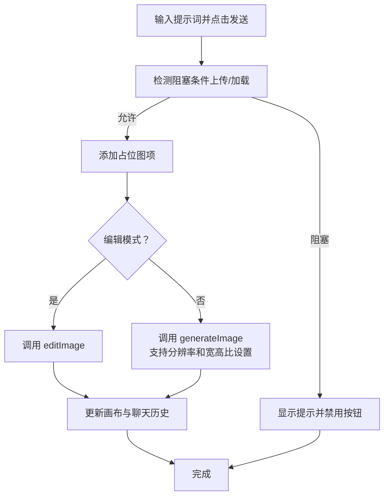
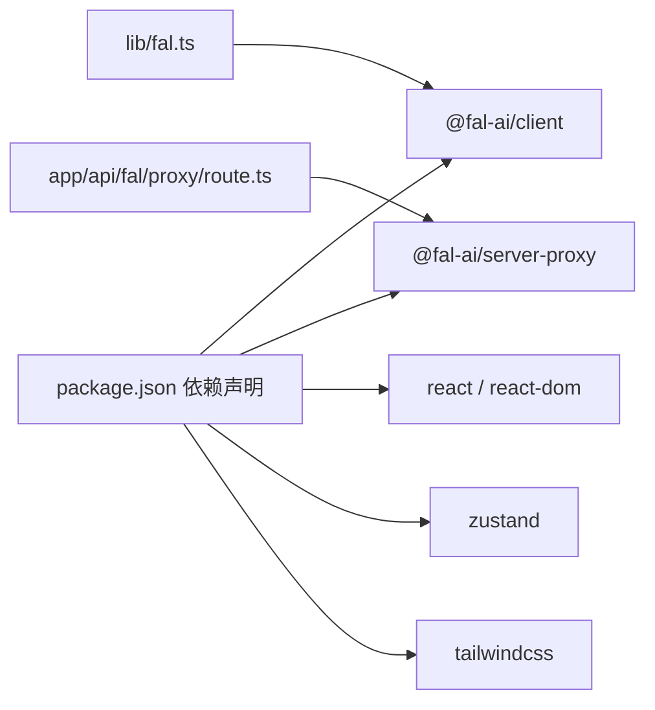

# AI API 集成

<cite>
**本文引用的文件**
- [lib/fal.ts](file://lib/fal.ts)
- [app/api/fal/proxy/route.ts](file://app/api/fal/proxy/route.ts)
- [lib/types.ts](file://lib/types.ts)
- [lib/store.ts](file://lib/store.ts)
- [lib/validate.ts](file://lib/validate.ts)
- [components/canvas/CanvasArea.tsx](file://components/canvas/CanvasArea.tsx)
- [components/chat/ReferenceUploader.tsx](file://components/chat/ReferenceUploader.tsx)
- [components/chat/TextInput.tsx](file://components/chat/TextInput.tsx)
- [components/chat/ChatPanel.tsx](file://components/chat/ChatPanel.tsx)
- [app/page.tsx](file://app/page.tsx)
- [package.json](file://package.json)
- [__tests__/fal.test.ts](file://__tests__/fal.test.ts)
- [docs/superpowers/plans/2026-03-25-lovart-implementation.md](file://docs/superpowers/plans/2026-03-25-lovart-implementation.md)
- [docs/superpowers/specs/2026-03-25-lovart-design.md](file://docs/superpowers/specs/2026-03-25-lovart-design.md)
</cite>

## 更新摘要
**所做更改**
- 更新 FAL 客户端封装以支持自动图像尺寸检测和基于提示的文件名生成
- 增强 blob URL 到 data URL 转换功能，确保 Tldraw 兼容性
- 新增分辨率和宽高比参数支持，提升图像生成灵活性
- 改进错误处理机制，提供更详细的调试日志

## 目录
1. [简介](#简介)
2. [项目结构](#项目结构)
3. [核心组件](#核心组件)
4. [架构总览](#架构总览)
5. [详细组件分析](#详细组件分析)
6. [依赖关系分析](#依赖关系分析)
7. [性能考量](#性能考量)
8. [故障排除指南](#故障排除指南)
9. [结论](#结论)
10. [附录](#附录)

## 简介
本项目为一个基于 Next.js 的 AI 创意设计平台，集成了 FAL.ai 的图像生成与编辑能力。通过客户端封装与服务器代理路由，实现了安全的密钥管理与稳定的 API 调用。用户可在画布中进行图像创作与编辑，并通过聊天面板输入提示词驱动 AI 生成；系统同时提供文件上传、状态管理、错误处理与可视化反馈等完整功能链路。

**更新** 本次更新增强了后端集成能力，包括自动图像尺寸检测、基于提示的文件名生成以及改进的 blob URL 到 data URL 转换，确保与 Tldraw 的完全兼容性。

## 项目结构
项目采用按功能分层的组织方式：
- lib：核心业务逻辑与工具（FAL 封装、状态存储、类型定义、校验）
- app/api/fal/proxy：FAL 代理路由（服务端转发，保护密钥）
- components：UI 组件（画布、聊天、输入、消息历史、参考图上传）
- __tests__：单元测试（覆盖 FAL 封装与行为）
- docs/superpowers：设计与实现计划文档（指导性说明）

**图表来源**
- [app/page.tsx:1-59](file://app/page.tsx#L1-L59)
- [components/canvas/CanvasArea.tsx:1-431](file://components/canvas/CanvasArea.tsx#L1-L431)
- [components/chat/ChatPanel.tsx:1-22](file://components/chat/ChatPanel.tsx#L1-L22)
- [components/chat/TextInput.tsx:1-140](file://components/chat/TextInput.tsx#L1-L140)
- [components/chat/ReferenceUploader.tsx:1-100](file://components/chat/ReferenceUploader.tsx#L1-L100)
- [lib/fal.ts:1-90](file://lib/fal.ts#L1-L90)
- [lib/store.ts:1-119](file://lib/store.ts#L1-L119)
- [lib/types.ts:1-37](file://lib/types.ts#L1-L37)
- [lib/validate.ts:1-14](file://lib/validate.ts#L1-L14)
- [app/api/fal/proxy/route.ts:1-4](file://app/api/fal/proxy/route.ts#L1-L4)

**章节来源**
- [app/page.tsx:1-59](file://app/page.tsx#L1-L59)
- [package.json:1-48](file://package.json#L1-L48)

## 核心组件
- FAL 客户端封装：统一配置代理地址、封装生成与编辑函数、提供文件上传能力，支持自动图像尺寸检测和基于提示的文件名生成
- 代理路由：服务端转发 FAL 请求，隐藏密钥，限制跨域风险
- 状态管理：Zustand 存储画布项、聊天历史、参考图与编辑目标
- 文件校验：限制格式与大小，保障上传质量与性能
- UI 组件：画布渲染与交互、聊天输入与历史、参考图上传与预览

**更新** 新增分辨率和宽高比参数支持，增强错误处理和调试日志功能。

**章节来源**
- [lib/fal.ts:1-90](file://lib/fal.ts#L1-L90)
- [app/api/fal/proxy/route.ts:1-4](file://app/api/fal/proxy/route.ts#L1-L4)
- [lib/store.ts:1-119](file://lib/store.ts#L1-L119)
- [lib/validate.ts:1-14](file://lib/validate.ts#L1-L14)
- [lib/types.ts:1-37](file://lib/types.ts#L1-L37)

## 架构总览
系统采用"前端直连代理、代理服务端转发"的模式，确保密钥不暴露于客户端。前端通过封装好的函数调用 FAL API，代理路由负责鉴权与请求转发。

**图表来源**
- [components/chat/TextInput.tsx:34-89](file://components/chat/TextInput.tsx#L34-L89)
- [lib/fal.ts:21-57](file://lib/fal.ts#L21-L57)
- [app/api/fal/proxy/route.ts:1-4](file://app/api/fal/proxy/route.ts#L1-L4)

## 详细组件分析

### FAL 客户端封装（lib/fal.ts）
- 配置代理地址：初始化时设置代理 URL，使客户端以代理模式访问 FAL
- 图像生成：构造基础输入参数，合并提示词与可选参考图 URL，支持自动图像尺寸检测和分辨率设置，调用订阅接口获取首张图片 URL
- 图像编辑：将目标图 URL 放在首位，合并参考图，调用订阅接口获取编辑结果
- 文件上传：通过存储模块上传本地文件，返回可公开访问的 URL

**更新** 新增分辨率和宽高比参数支持，增强错误处理和调试日志功能。

**图表来源**
- [lib/fal.ts:17-85](file://lib/fal.ts#L17-L85)

**章节来源**
- [lib/fal.ts:1-90](file://lib/fal.ts#L1-L90)
- [__tests__/fal.test.ts:26-60](file://__tests__/fal.test.ts#L26-L60)

### 代理路由（app/api/fal/proxy/route.ts）
- 使用官方提供的 Next.js 服务器代理工具创建路由处理器
- 通过环境变量注入凭据，代理所有 GET/POST/PUT 请求到 FAL
- 该路由是密钥保护的关键：前端只暴露代理路径，不直接接触真实密钥

**图表来源**
- [app/api/fal/proxy/route.ts:1-4](file://app/api/fal/proxy/route.ts#L1-L4)

**章节来源**
- [app/api/fal/proxy/route.ts:1-4](file://app/api/fal/proxy/route.ts#L1-L4)
- [docs/superpowers/specs/2026-03-25-lovart-design.md:134-141](file://docs/superpowers/specs/2026-03-25-lovart-design.md#L134-L141)

### 状态管理（lib/store.ts）
- 使用 Zustand 管理会话状态（画布项、参考图、编辑目标）与持久化历史
- 提供增删改查与批量更新操作，限制聊天历史长度，避免内存膨胀
- 通过持久化中间件将部分状态保存至本地存储，提升用户体验

**图表来源**
- [lib/store.ts:19-119](file://lib/store.ts#L19-L119)
- [lib/types.ts:1-37](file://lib/types.ts#L1-L37)

**章节来源**
- [lib/store.ts:1-119](file://lib/store.ts#L1-L119)
- [lib/types.ts:1-37](file://lib/types.ts#L1-L37)

### 文件上传与校验（components/chat/ReferenceUploader.tsx 与 lib/validate.ts）
- 前端上传：选择文件后生成本地对象 URL 预览，调用上传接口获取可公开访问 URL
- 校验规则：限制格式为 JPG/PNG/WebP，单文件不超过 10MB
- 错误处理：上传失败时提示并清理资源，撤销本地对象 URL

**图表来源**
- [components/chat/ReferenceUploader.tsx:18-39](file://components/chat/ReferenceUploader.tsx#L18-L39)
- [lib/validate.ts:9-13](file://lib/validate.ts#L9-L13)

**章节来源**
- [components/chat/ReferenceUploader.tsx:1-100](file://components/chat/ReferenceUploader.tsx#L1-L100)
- [lib/validate.ts:1-14](file://lib/validate.ts#L1-L14)

### 画布与编辑流程（components/canvas/CanvasArea.tsx）
- 支持拖拽上传、缩放平移、选择与变换（缩放、旋转、拖拽）
- 上传完成后替换占位图与本地 URL 为 FAL CDN URL
- 提供下载与清空功能，结合状态管理维护多图层布局

**更新** 增强 blob URL 到 data URL 转换功能，确保 Tldraw 兼容性，支持自动图像尺寸检测。

**图表来源**
- [components/canvas/CanvasArea.tsx:306-340](file://components/canvas/CanvasArea.tsx#L306-L340)
- [lib/fal.ts:87-90](file://lib/fal.ts#L87-L90)
- [lib/store.ts:58-92](file://lib/store.ts#L58-L92)

**章节来源**
- [components/canvas/CanvasArea.tsx:1-431](file://components/canvas/CanvasArea.tsx#L1-L431)

### 聊天与输入（components/chat/TextInput.tsx 与 ChatPanel.tsx）
- 输入面板根据是否处于编辑模式决定调用生成或编辑流程
- 发送按钮受状态阻塞：当存在上传或加载时禁用并提示
- 成功后将结果写入画布与聊天历史，失败时清理占位并提示

**更新** 新增分辨率和宽高比选择器，支持自动图像尺寸检测和基于提示的文件名生成。

**图表来源**
- [components/chat/TextInput.tsx:34-89](file://components/chat/TextInput.tsx#L34-L89)
- [components/chat/ChatPanel.tsx:1-22](file://components/chat/ChatPanel.tsx#L1-L22)

**章节来源**
- [components/chat/TextInput.tsx:1-140](file://components/chat/TextInput.tsx#L1-L140)
- [components/chat/ChatPanel.tsx:1-22](file://components/chat/ChatPanel.tsx#L1-L22)

## 依赖关系分析
- 客户端依赖：@fal-ai/client（用于配置代理与订阅）、@fal-ai/server-proxy（用于 Next.js 代理路由）
- UI 依赖：react、react-dom、react-konva（画布）、zustand（状态）、tailwindcss（样式）
- 测试依赖：vitest、@testing-library（测试工具链）

**图表来源**
- [package.json:11-29](file://package.json#L11-L29)
- [lib/fal.ts:1](file://lib/fal.ts#L1)
- [app/api/fal/proxy/route.ts:1](file://app/api/fal/proxy/route.ts#L1)

**章节来源**
- [package.json:1-48](file://package.json#L1-L48)

## 性能考量
- 上传优化：限制文件大小与格式，减少无效请求与带宽占用
- 渲染优化：画布仅在必要时重绘，占位图使用渐变动画降低感知延迟
- 状态优化：聊天历史截断，避免无限增长导致内存压力
- 网络优化：代理集中转发，减少跨域与证书问题带来的额外开销
- **更新** 增加自动图像尺寸检测功能，根据分辨率和宽高比动态计算生成尺寸，优化内存使用

## 故障排除指南
- 上传失败
  - 现象：上传按钮报错并清理资源
  - 排查：确认代理路由已正确读取凭据、网络连通性、文件格式与大小
  - 参考位置：[components/chat/ReferenceUploader.tsx:32-38](file://components/chat/ReferenceUploader.tsx#L32-L38)，[components/canvas/CanvasArea.tsx:331-337](file://components/canvas/CanvasArea.tsx#L331-L337)
- 生成失败
  - 现象：占位图被移除并提示错误
  - 排查：检查网络状态、代理路由可用性、模型订阅权限
  - 参考位置：[components/chat/TextInput.tsx:82-88](file://components/chat/TextInput.tsx#L82-L88)
- 编辑模式不可用
  - 现象：编辑按钮被禁用或无响应
  - 排查：确认目标图已上传完成且 URL 可用，参考图数量与格式符合要求
  - 参考位置：[components/chat/TextInput.tsx:68-72](file://components/chat/TextInput.tsx#L68-L72)，[lib/store.ts:24-29](file://lib/store.ts#L24-L29)
- **更新** Tldraw 兼容性问题
  - 现象：Tldraw 无法显示生成的图片
  - 排查：检查 blob URL 到 data URL 转换功能，确认图片预加载成功
  - 参考位置：[components/canvas/CanvasArea.tsx:60-84](file://components/canvas/CanvasArea.tsx#L60-L84)

**章节来源**
- [components/chat/ReferenceUploader.tsx:32-38](file://components/chat/ReferenceUploader.tsx#L32-L38)
- [components/canvas/CanvasArea.tsx:331-337](file://components/canvas/CanvasArea.tsx#L331-L337)
- [components/chat/TextInput.tsx:82-88](file://components/chat/TextInput.tsx#L82-L88)
- [lib/store.ts:24-29](file://lib/store.ts#L24-L29)

## 结论
本项目通过"客户端封装 + 代理路由"的架构，既保证了密钥安全，又提供了流畅的图像生成与编辑体验。配合完善的文件校验、状态管理与 UI 交互，形成了从输入到输出的闭环。后续可按计划文档扩展用户认证与数据库持久化，进一步完善历史记录与协作能力。

**更新** 本次更新显著增强了后端集成能力，包括自动图像尺寸检测、基于提示的文件名生成以及改进的 blob URL 到 data URL 转换，确保与 Tldraw 的完全兼容性，提升了整体用户体验和系统稳定性。

## 附录

### API 使用最佳实践
- 严格限制上传文件格式与大小，避免无效请求
- 在发送前检查阻塞条件，防止并发与空值导致的异常
- 使用占位图与渐进式反馈提升用户体验
- 对网络错误进行明确提示并引导重试
- **更新** 合理设置分辨率和宽高比参数，平衡生成质量和性能

### 扩展方法与第三方集成
- 新增模型：在封装函数中新增对应订阅调用，保持一致的输入/输出约定
- 更换代理：调整代理路由的凭据来源与转发策略
- 多服务并行：在同一封装内区分不同服务的代理路径，按需切换
- **更新** 支持自定义图像尺寸检测算法，根据具体需求调整生成策略

### 错误处理与调试
- 启用详细日志记录，便于追踪 API 调用过程
- 实现重试机制，处理临时性网络错误
- 提供友好的错误提示，指导用户进行问题排查
- **更新** 增加 blob URL 转换失败的降级处理，确保系统稳定性