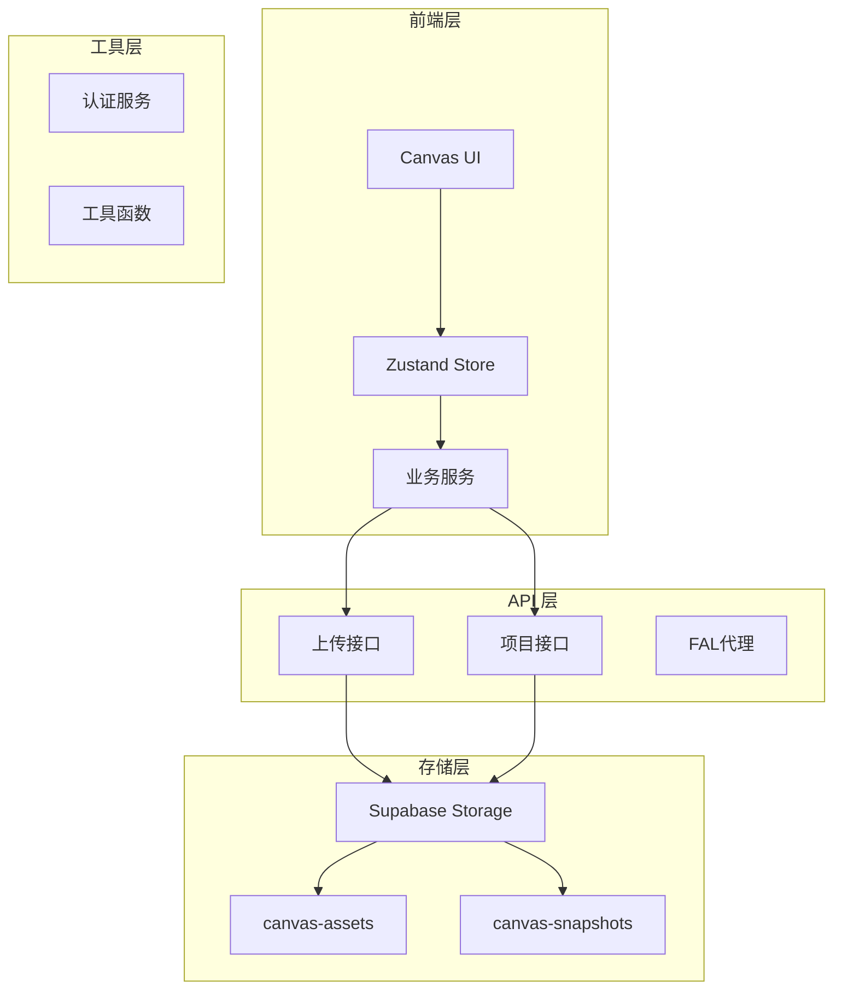
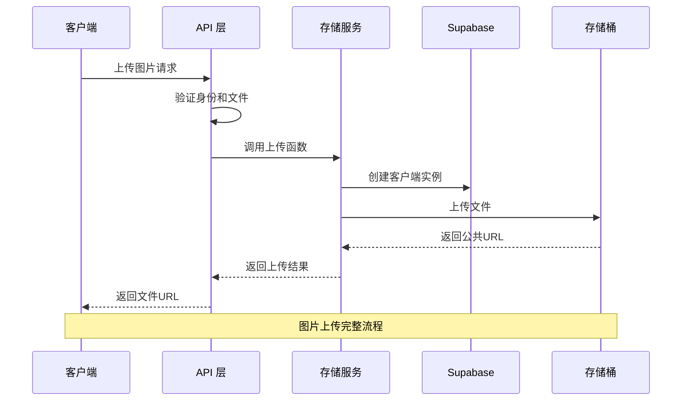
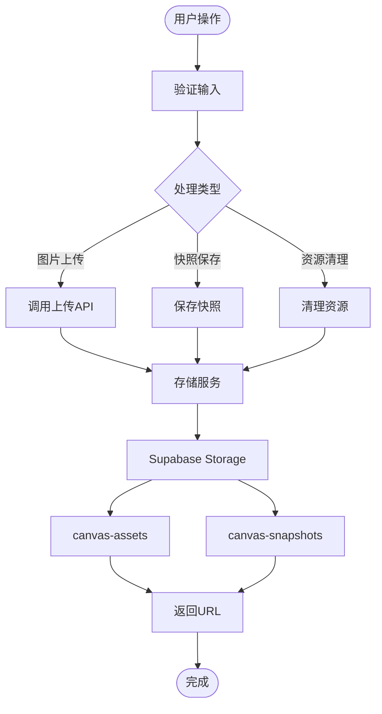
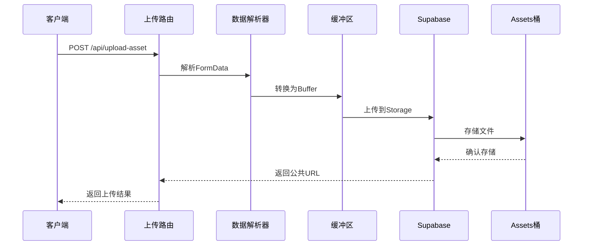
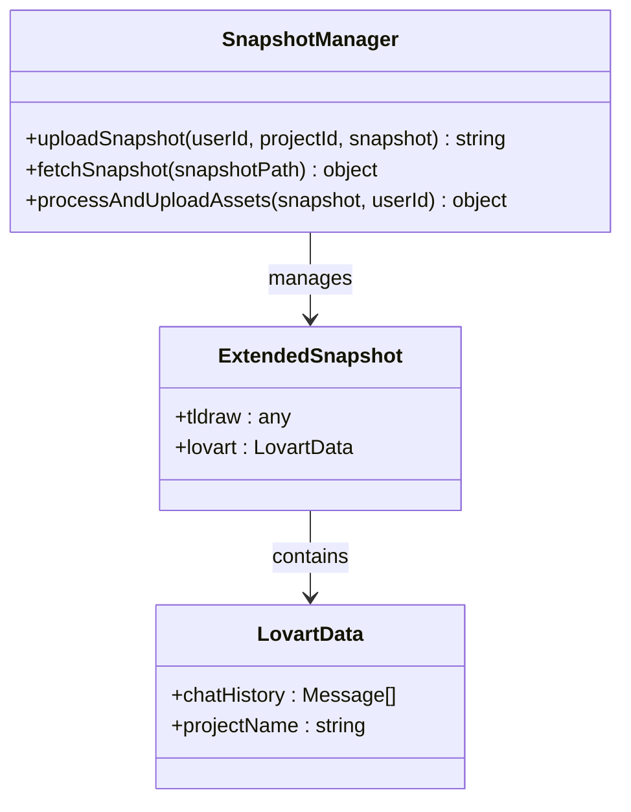
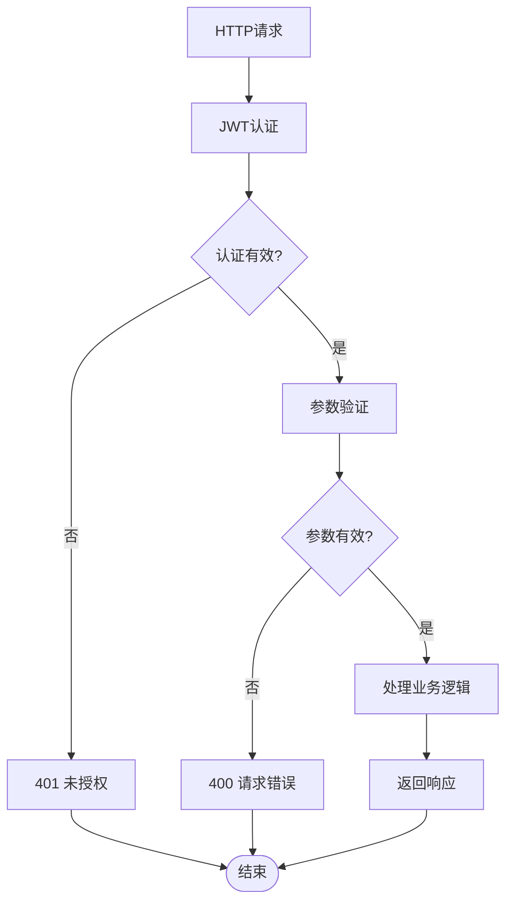
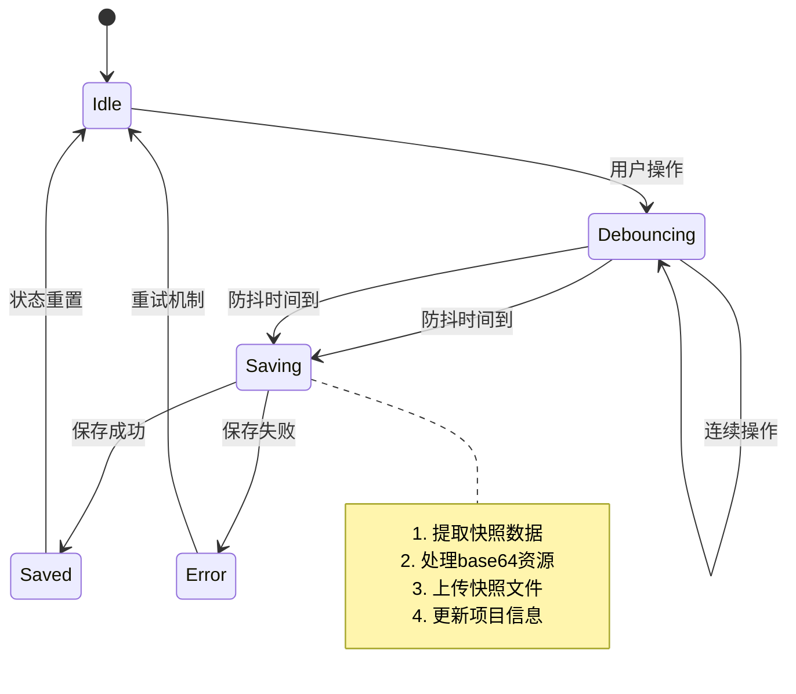
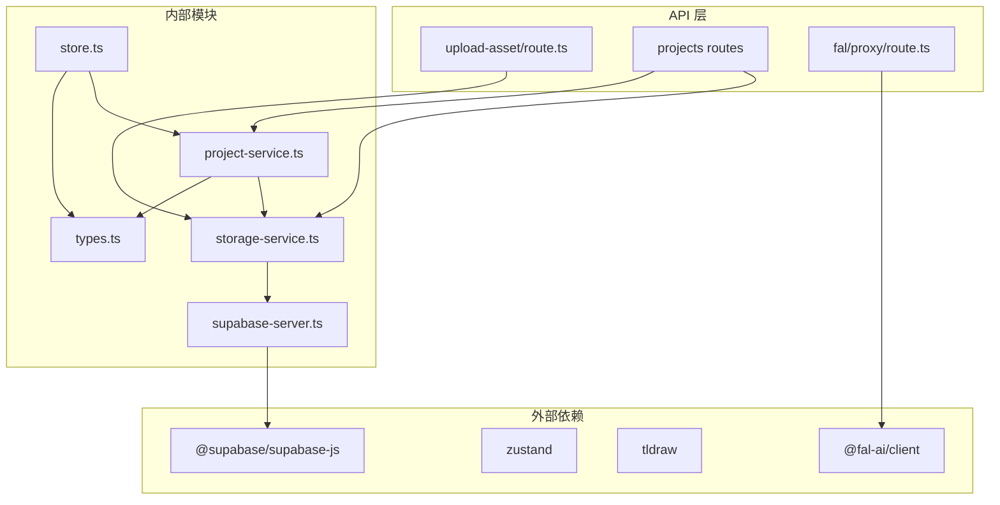
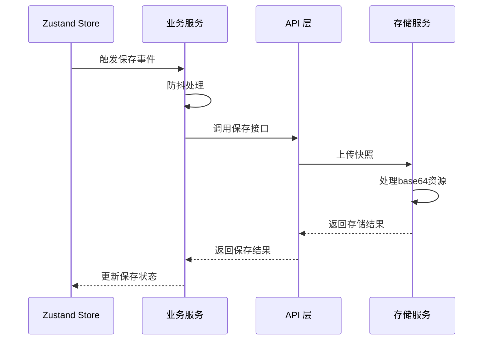

# 存储服务系统

<cite>
**本文档中引用的文件**
- [storage-service.ts](file://lib/storage-service.ts)
- [store.ts](file://lib/store.ts)
- [upload-asset/route.ts](file://app/api/upload-asset/route.ts)
- [supabase-server.ts](file://lib/supabase-server.ts)
- [projects/save/route.ts](file://app/api/projects/[id]/save/route.ts)
- [projects/[id]/route.ts](file://app/api/projects/[id]/route.ts)
- [types.ts](file://lib/types.ts)
- [project-service.ts](file://lib/project-service.ts)
- [projects/route.ts](file://app/api/projects/route.ts)
- [fal.ts](file://lib/fal.ts)
- [CanvasArea.tsx](file://components/canvas/CanvasArea.tsx)
- [store.test.ts](file://__tests__/store.test.ts)
</cite>

## 目录
1. [简介](#简介)
2. [项目结构](#项目结构)
3. [核心组件](#核心组件)
4. [架构概览](#架构概览)
5. [详细组件分析](#详细组件分析)
6. [依赖关系分析](#依赖关系分析)
7. [性能考虑](#性能考虑)
8. [故障排除指南](#故障排除指南)
9. [结论](#结论)

## 简介

存储服务系统是 Loveart 项目的核心基础设施，负责管理 Canvas 相关的数据存储、文件上传、快照管理和状态持久化。该系统基于 Supabase Storage 构建，采用分层架构设计，实现了高效的资源管理和数据同步机制。

系统主要功能包括：
- **即时图片上传**：支持用户创建 Canvas 时的实时图片上传
- **项目快照存储**：管理项目的完整状态快照
- **资源文件管理**：处理用户上传的图片资源文件
- **状态持久化**：通过 Zustand 管理前端应用状态
- **自动保存机制**：提供智能的防抖保存策略

## 项目结构

存储服务系统采用模块化设计，主要分为以下几个层次：

**图表来源**
- [storage-service.ts:1-324](file://lib/storage-service.ts#L1-L324)
- [store.ts:1-427](file://lib/store.ts#L1-L427)
- [upload-asset/route.ts:1-145](file://app/api/upload-asset/route.ts#L1-L145)

**章节来源**
- [storage-service.ts:1-324](file://lib/storage-service.ts#L1-L324)
- [store.ts:1-427](file://lib/store.ts#L1-L427)

## 核心组件

### 存储服务核心模块

存储服务系统的核心是 `storage-service.ts`，它提供了完整的文件存储管理功能：

#### 主要功能特性
- **双桶架构**：使用 `canvas-assets` 和 `canvas-snapshots` 两个独立的存储桶
- **类型安全**：完整的 TypeScript 接口定义
- **错误处理**：完善的异常捕获和错误报告机制
- **日志记录**：详细的调试日志输出

#### 关键常量定义
- `ASSETS_BUCKET`: `canvas-assets` - 公共存储桶，用于用户上传的图片资源
- `SNAPSHOTS_BUCKET`: `canvas-snapshots` - 私有存储桶，用于项目快照 JSON 文件

**章节来源**
- [storage-service.ts:21-23](file://lib/storage-service.ts#L21-L23)
- [storage-service.ts:65-113](file://lib/storage-service.ts#L65-L113)
- [storage-service.ts:122-157](file://lib/storage-service.ts#L122-L157)

### 状态管理系统

Zustand 状态管理提供了前端应用的状态持久化能力：

#### 状态切片设计
- **持久化状态**：聊天历史、项目名称、FAL API 密钥等
- **会话状态**：画布元素、编辑模式、用户信息等
- **动作方法**：丰富的状态更新和操作方法

#### 关键状态特性
- **本地存储**：使用 localStorage 进行状态持久化
- **安全包装**：包含异常处理的存储操作
- **部分序列化**：只持久化必要的状态数据

**章节来源**
- [store.ts:107-427](file://lib/store.ts#L107-L427)
- [store.ts:70-105](file://lib/store.ts#L70-L105)

## 架构概览

存储服务系统采用分层架构，确保了清晰的职责分离和良好的可维护性：

**图表来源**
- [upload-asset/route.ts:31-145](file://app/api/upload-asset/route.ts#L31-L145)
- [storage-service.ts:65-113](file://lib/storage-service.ts#L65-L113)

### 数据流架构

系统采用事件驱动的数据流架构：

**图表来源**
- [storage-service.ts:198-265](file://lib/storage-service.ts#L198-L265)
- [projects/save/route.ts:55-194](file://app/api/projects/[id]/save/route.ts#L55-L194)

## 详细组件分析

### 存储服务实现

存储服务模块提供了完整的文件管理功能，包括上传、下载、删除等操作。

#### 图片上传流程

**图表来源**
- [upload-asset/route.ts:31-145](file://app/api/upload-asset/route.ts#L31-L145)
- [storage-service.ts:47-56](file://lib/storage-service.ts#L47-L56)

#### 快照管理机制

快照管理提供了项目状态的完整备份和恢复能力：

**图表来源**
- [storage-service.ts:122-195](file://lib/storage-service.ts#L122-L195)
- [types.ts:77-85](file://lib/types.ts#L77-L85)

**章节来源**
- [storage-service.ts:122-195](file://lib/storage-service.ts#L122-L195)
- [projects/save/route.ts:18-53](file://app/api/projects/[id]/save/route.ts#L18-L53)

### API 接口设计

系统提供了 RESTful API 接口，支持完整的 CRUD 操作：

#### 项目管理接口

| 接口 | 方法 | 描述 | 权限要求 |
|------|------|------|----------|
| `/api/projects` | GET | 获取项目列表 | 需登录 |
| `/api/projects` | POST | 创建新项目 | 需登录 |
| `/api/projects/[id]` | GET | 获取项目详情 | 需登录 |
| `/api/projects/[id]` | DELETE | 删除项目 | 需登录 |
| `/api/projects/[id]/save` | POST | 保存项目快照 | 需登录 |
| `/api/upload-asset` | POST | 上传图片资源 | 需登录 |

#### 接口验证流程

**图表来源**
- [projects/route.ts:9-133](file://app/api/projects/route.ts#L9-L133)
- [upload-asset/route.ts:31-145](file://app/api/upload-asset/route.ts#L31-L145)

**章节来源**
- [projects/route.ts:9-133](file://app/api/projects/route.ts#L9-L133)
- [upload-asset/route.ts:31-145](file://app/api/upload-asset/route.ts#L31-L145)

### 自动保存机制

系统实现了智能的自动保存功能，确保用户数据的安全性和完整性：

#### 防抖保存策略

**图表来源**
- [project-service.ts:97-225](file://lib/project-service.ts#L97-L225)

#### 保存状态管理

| 状态 | 描述 | 持续时间 |
|------|------|----------|
| `idle` | 空闲状态 | 永久 |
| `saving` | 正在保存 | 短暂 |
| `saved` | 保存成功 | 3秒 |
| `error` | 保存失败 | 永久直到修复 |

**章节来源**
- [project-service.ts:97-225](file://lib/project-service.ts#L97-L225)
- [store.ts:78](file://lib/store.ts#L78)

## 依赖关系分析

存储服务系统具有清晰的依赖关系，确保了模块间的松耦合和高内聚：

**图表来源**
- [package.json:11-35](file://package.json#L11-L35)
- [storage-service.ts:19](file://lib/storage-service.ts#L19)
- [store.ts:1-6](file://lib/store.ts#L1-L6)

### 模块间交互

系统采用事件驱动的模块间通信方式：

#### 数据传递流程

**图表来源**
- [project-service.ts:145-174](file://lib/project-service.ts#L145-L174)
- [projects/save/route.ts:133-150](file://app/api/projects/[id]/save/route.ts#L133-L150)

**章节来源**
- [project-service.ts:145-174](file://lib/project-service.ts#L145-L174)
- [storage-service.ts:18-195](file://lib/storage-service.ts#L18-L195)

## 性能考虑

存储服务系统在设计时充分考虑了性能优化，采用了多种策略来提升系统效率：

### 缓存策略

- **本地缓存**：使用 localStorage 缓存持久化状态
- **CDN 加速**：图片资源通过 Supabase CDN 分发
- **防抖机制**：自动保存采用 1.5 秒防抖，减少不必要的网络请求

### 存储优化

- **文件大小限制**：图片文件最大 10MB，快照文件最大 50MB
- **MIME 类型验证**：严格限制允许的文件类型
- **路径优化**：使用用户 ID + 资源 ID 的层级结构

### 并发控制

- **单次保存保护**：防止并发保存导致的数据冲突
- **队列管理**：多个保存请求按顺序处理
- **超时机制**：网络请求设置合理的超时时间

## 故障排除指南

### 常见问题及解决方案

#### 环境变量配置问题

**问题症状**：初始化 Supabase 客户端时抛出异常

**可能原因**：
- 缺少 `NEXT_PUBLIC_SUPABASE_URL`
- 缺少 `SUPABASE_SERVICE_ROLE_KEY`

**解决步骤**：
1. 检查 `.env` 文件中的环境变量配置
2. 确认 Supabase 项目设置正确
3. 重启应用服务

#### 文件上传失败

**问题症状**：图片上传返回 500 错误

**可能原因**：
- 文件大小超过限制
- MIME 类型不被允许
- 存储桶权限配置错误

**解决步骤**：
1. 检查文件大小是否超过 10MB 限制
2. 验证文件扩展名是否在允许列表中
3. 确认 `canvas-assets` 桶的权限设置

#### 快照加载失败

**问题症状**：项目详情页面无法加载快照数据

**可能原因**：
- Storage 文件损坏
- 权限不足
- 网络连接问题

**解决步骤**：
1. 检查 Storage 中的快照文件是否存在
2. 验证用户权限是否正确
3. 查看浏览器开发者工具中的网络请求

**章节来源**
- [supabase-server.ts:19-28](file://lib/supabase-server.ts#L19-L28)
- [upload-asset/route.ts:72-85](file://app/api/upload-asset/route.ts#L72-L85)
- [projects/[id]/route.ts:64-96](file://app/api/projects/[id]/route.ts#L64-L96)

### 调试技巧

#### 日志分析

系统提供了详细的日志输出，有助于问题诊断：

- **上传流程日志**：包含文件路径、大小、MIME 类型等信息
- **错误日志**：详细的错误堆栈和错误消息
- **性能日志**：保存耗时统计和网络请求信息

#### 测试策略

单元测试覆盖了关键功能：

- **状态管理测试**：验证 Zustand store 的各种操作
- **API 接口测试**：模拟各种请求场景
- **边界条件测试**：测试文件大小、类型等边界情况

**章节来源**
- [store.test.ts:1-112](file://__tests__/store.test.ts#L1-L112)

## 结论

存储服务系统通过精心设计的架构和实现，为 Loveart 项目提供了可靠的数据存储解决方案。系统的主要优势包括：

### 技术优势

- **模块化设计**：清晰的职责分离和良好的可维护性
- **类型安全**：完整的 TypeScript 类型定义
- **错误处理**：完善的异常捕获和错误恢复机制
- **性能优化**：智能的缓存策略和防抖机制

### 架构特点

- **分层架构**：前端、API、存储三层清晰分离
- **事件驱动**：基于事件的状态管理和数据流
- **异步处理**：充分利用现代 JavaScript 的异步特性
- **容错设计**：具备良好的错误恢复和降级机制

### 未来改进方向

- **监控集成**：添加更完善的性能监控和错误追踪
- **缓存优化**：实现多级缓存策略提升加载速度
- **扩展性增强**：支持更多类型的文件和更大的存储需求
- **安全性加强**：增强文件访问控制和数据加密

该存储服务系统为 Loveart 项目奠定了坚实的技术基础，能够满足当前和未来的业务需求。