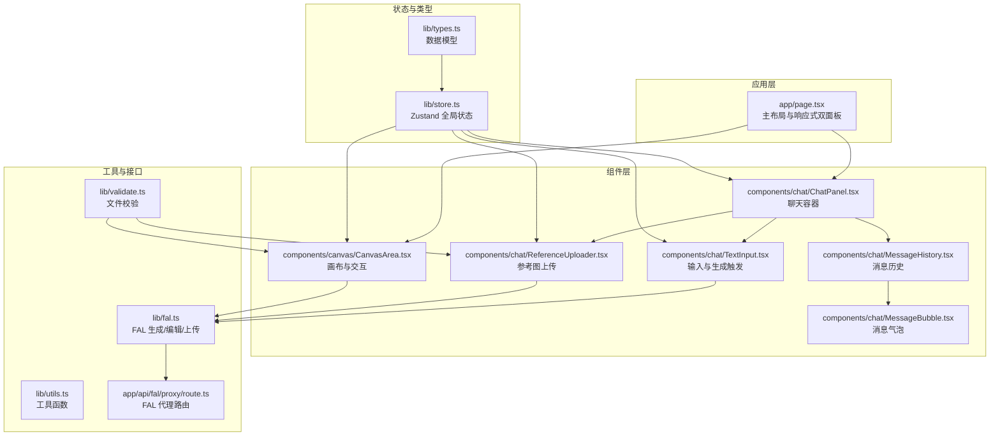
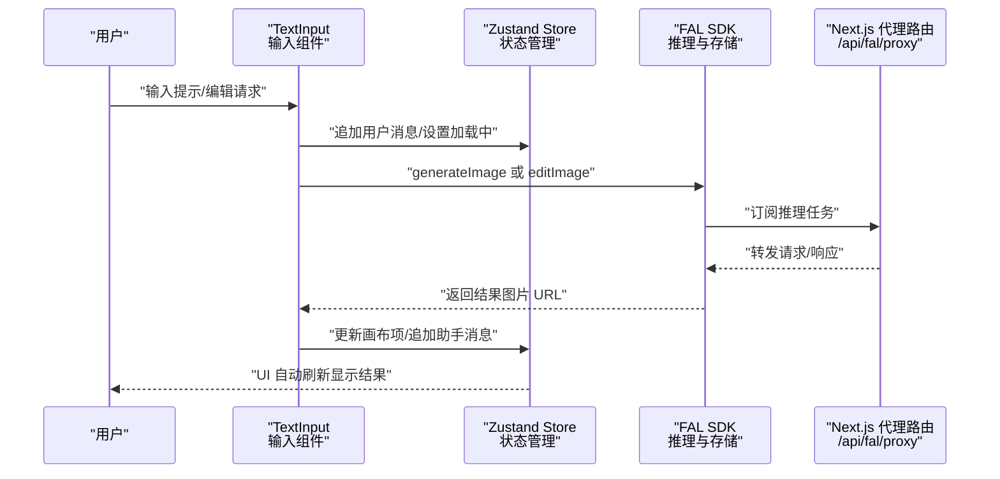
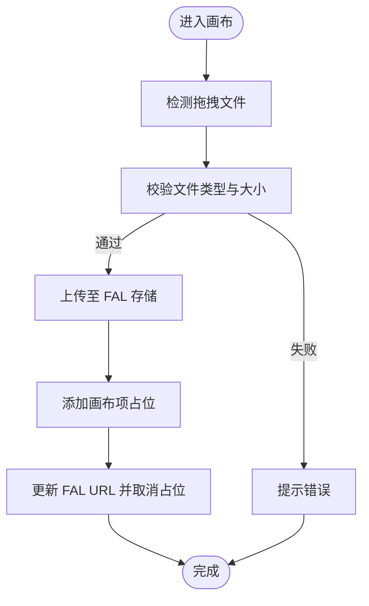
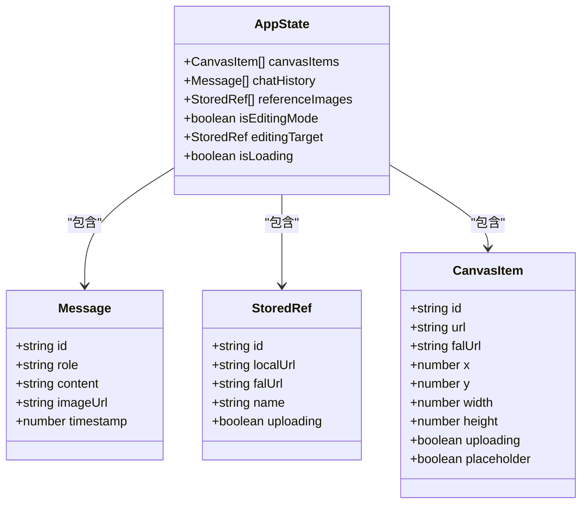
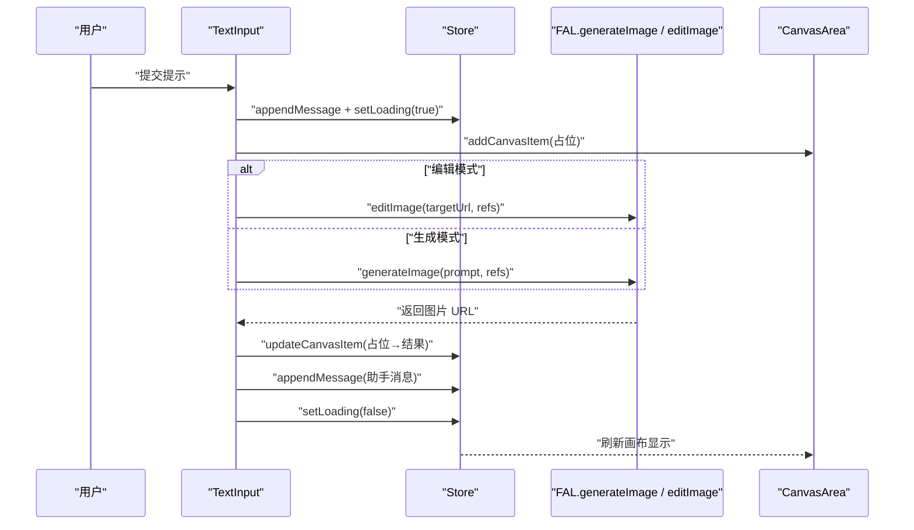
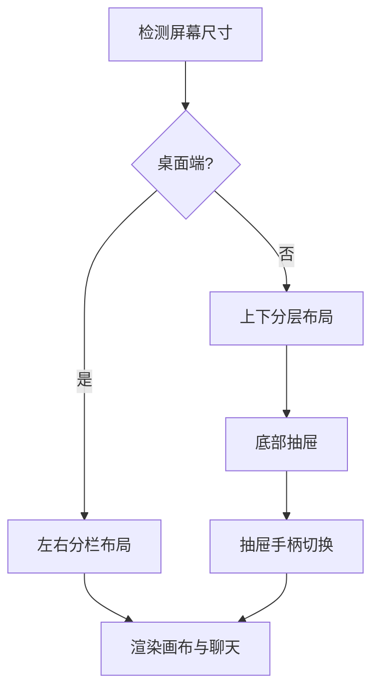
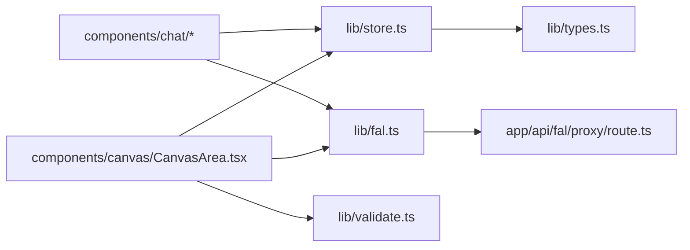

# 核心功能模块

<cite>
**本文档引用的文件**
- [README.md](file://README.md)
- [package.json](file://package.json)
- [app/page.tsx](file://app/page.tsx)
- [app/api/fal/proxy/route.ts](file://app/api/fal/proxy/route.ts)
- [lib/types.ts](file://lib/types.ts)
- [lib/store.ts](file://lib/store.ts)
- [lib/fal.ts](file://lib/fal.ts)
- [lib/validate.ts](file://lib/validate.ts)
- [lib/utils.ts](file://lib/utils.ts)
- [components/canvas/CanvasArea.tsx](file://components/canvas/CanvasArea.tsx)
- [components/chat/ChatPanel.tsx](file://components/chat/ChatPanel.tsx)
- [components/chat/MessageHistory.tsx](file://components/chat/MessageHistory.tsx)
- [components/chat/MessageBubble.tsx](file://components/chat/MessageBubble.tsx)
- [components/chat/ReferenceUploader.tsx](file://components/chat/ReferenceUploader.tsx)
- [components/chat/TextInput.tsx](file://components/chat/TextInput.tsx)
</cite>

## 目录
1. [简介](#简介)
2. [项目结构](#项目结构)
3. [核心组件](#核心组件)
4. [架构总览](#架构总览)
5. [详细组件分析](#详细组件分析)
6. [依赖关系分析](#依赖关系分析)
7. [性能考虑](#性能考虑)
8. [故障排除指南](#故障排除指南)
9. [结论](#结论)
10. [附录](#附录)

## 简介
本项目是一个基于 Next.js 的 AI 图像生成与编辑应用，提供响应式双面板界面（画布区与聊天区）、可交互的画布系统、聊天与状态管理能力，并通过 FAL 平台实现云端推理与存储。用户可通过自然语言提示生成图像，或将本地图片作为参考进行编辑；系统采用 Zustand 进行全局状态管理，结合 FAL SDK 完成图像生成、编辑与上传。

## 项目结构
项目采用按功能分层的组织方式：
- 应用入口与布局：app/page.tsx 负责页面布局与移动端/桌面端响应式切换
- 组件层：components 下分为 canvas 与 chat 两大功能域，分别处理画布与聊天交互
- 工具与类型：lib 下存放类型定义、状态管理、FAL 接口封装、校验与工具函数
- API 代理：app/api/fal/proxy/route.ts 提供 FAL 服务代理路由

**图表来源**
- [app/page.tsx:1-59](file://app/page.tsx#L1-L59)
- [components/canvas/CanvasArea.tsx:1-431](file://components/canvas/CanvasArea.tsx#L1-L431)
- [components/chat/ChatPanel.tsx:1-22](file://components/chat/ChatPanel.tsx#L1-L22)
- [components/chat/MessageHistory.tsx:1-37](file://components/chat/MessageHistory.tsx#L1-L37)
- [components/chat/MessageBubble.tsx:1-33](file://components/chat/MessageBubble.tsx#L1-L33)
- [components/chat/ReferenceUploader.tsx:1-100](file://components/chat/ReferenceUploader.tsx#L1-L100)
- [components/chat/TextInput.tsx:1-140](file://components/chat/TextInput.tsx#L1-L140)
- [lib/store.ts:1-119](file://lib/store.ts#L1-L119)
- [lib/types.ts:1-37](file://lib/types.ts#L1-L37)
- [lib/fal.ts:1-62](file://lib/fal.ts#L1-L62)
- [lib/validate.ts:1-14](file://lib/validate.ts#L1-L14)
- [lib/utils.ts:1-7](file://lib/utils.ts#L1-L7)
- [app/api/fal/proxy/route.ts:1-4](file://app/api/fal/proxy/route.ts#L1-L4)

**章节来源**
- [README.md:1-37](file://README.md#L1-L37)
- [package.json:1-48](file://package.json#L1-L48)
- [app/page.tsx:1-59](file://app/page.tsx#L1-L59)

## 核心组件
- 数据模型与状态
  - 类型定义：CanvasItem、Message、StoredRef、AppState，用于统一画布元素、消息与参考图的数据结构
  - 全局状态：Zustand store 将持久化与会话状态分离，支持画布项、参考图、聊天历史、编辑模式与加载状态
- 画布系统
  - 基于 Konva/Konva React 实现的可拖拽、缩放、变换的画布，支持占位符动画、中间键平移、滚轮缩放、拖拽上传等
- 聊天与状态管理
  - 聊天面板包含消息历史、参考图上传器与文本输入框；输入框根据是否处于编辑模式决定调用生成或编辑流程
- FAL 集成
  - 通过 @fal-ai/client 订阅推理任务，使用 Next.js 路由代理处理跨域与鉴权

**章节来源**
- [lib/types.ts:1-37](file://lib/types.ts#L1-L37)
- [lib/store.ts:1-119](file://lib/store.ts#L1-L119)
- [components/canvas/CanvasArea.tsx:1-431](file://components/canvas/CanvasArea.tsx#L1-L431)
- [components/chat/ChatPanel.tsx:1-22](file://components/chat/ChatPanel.tsx#L1-L22)
- [components/chat/TextInput.tsx:1-140](file://components/chat/TextInput.tsx#L1-L140)
- [lib/fal.ts:1-62](file://lib/fal.ts#L1-L62)

## 架构总览
系统采用“组件驱动 + 状态集中 + 外部服务代理”的架构：
- 前端组件负责用户交互与视图渲染
- Zustand store 统一管理应用状态，支持持久化与会话状态
- FAL 服务通过 Next.js 路由代理访问，避免浏览器直接调用导致的安全与跨域问题
- 画布与聊天通过共享状态协同，形成“提示/编辑 → 生成/编辑 → 结果展示”的闭环

**图表来源**
- [components/chat/TextInput.tsx:34-89](file://components/chat/TextInput.tsx#L34-L89)
- [lib/fal.ts:21-57](file://lib/fal.ts#L21-L57)
- [lib/store.ts:94-98](file://lib/store.ts#L94-L98)
- [app/api/fal/proxy/route.ts:1-4](file://app/api/fal/proxy/route.ts#L1-L4)

## 详细组件分析

### 画布交互系统（CanvasArea）
- 占位符动画：在生成过程中以渐变扫描效果提示进度
- 选择与变换：选中后显示变换框，保持宽高比进行缩放
- 中键平移与滚轮缩放：原生事件绕过 Konva，确保流畅体验
- 拖拽上传：支持拖入本地图片，自动计算投放位置并上传至 FAL 存储
- 清除与下载：支持单张删除与一键清空，下载当前选中或最新非占位图

**图表来源**
- [components/canvas/CanvasArea.tsx:294-340](file://components/canvas/CanvasArea.tsx#L294-L340)
- [lib/validate.ts:9-13](file://lib/validate.ts#L9-L13)
- [lib/fal.ts:59-61](file://lib/fal.ts#L59-L61)

**章节来源**
- [components/canvas/CanvasArea.tsx:1-431](file://components/canvas/CanvasArea.tsx#L1-L431)
- [lib/validate.ts:1-14](file://lib/validate.ts#L1-L14)
- [lib/fal.ts:1-62](file://lib/fal.ts#L1-L62)

### 聊天界面与状态管理
- 聊天面板：顶部标题、消息历史、参考图上传区、输入框
- 消息历史：自动滚动到底部，支持空态提示
- 参考图上传：限制数量与格式，上传中显示加载指示，支持移除
- 文本输入：区分“创作”与“编辑”模式，发送时创建占位画布项，完成后替换为真实结果

**图表来源**
- [lib/types.ts:1-37](file://lib/types.ts#L1-L37)
- [lib/store.ts:45-118](file://lib/store.ts#L45-L118)

**章节来源**
- [components/chat/ChatPanel.tsx:1-22](file://components/chat/ChatPanel.tsx#L1-L22)
- [components/chat/MessageHistory.tsx:1-37](file://components/chat/MessageHistory.tsx#L1-L37)
- [components/chat/ReferenceUploader.tsx:1-100](file://components/chat/ReferenceUploader.tsx#L1-L100)
- [components/chat/TextInput.tsx:1-140](file://components/chat/TextInput.tsx#L1-L140)
- [lib/types.ts:1-37](file://lib/types.ts#L1-L37)
- [lib/store.ts:1-119](file://lib/store.ts#L1-L119)

### AI 图像生成与编辑流程
- 生成流程：用户输入提示 → 创建占位画布项 → 调用生成接口 → 更新结果 URL → 追加助手消息
- 编辑流程：在编辑模式下，使用当前选中项作为目标图 → 合并参考图 → 调用编辑接口 → 更新结果
- 错误处理：网络异常与生成失败统一提示，占位项回滚

**图表来源**
- [components/chat/TextInput.tsx:34-89](file://components/chat/TextInput.tsx#L34-L89)
- [lib/fal.ts:21-57](file://lib/fal.ts#L21-L57)
- [lib/store.ts:58-98](file://lib/store.ts#L58-L98)

**章节来源**
- [components/chat/TextInput.tsx:1-140](file://components/chat/TextInput.tsx#L1-L140)
- [lib/fal.ts:1-62](file://lib/fal.ts#L1-L62)
- [lib/store.ts:1-119](file://lib/store.ts#L1-L119)

### 响应式双面板界面
- 桌面端：左侧 60%/70% 画布区，右侧聊天区并排显示
- 移动端：画布占上半区，底部抽屉承载聊天内容，支持展开/收起
- 抽屉切换：点击抽屉手柄切换高度，输入聚焦时自动展开

**图表来源**
- [app/page.tsx:12-55](file://app/page.tsx#L12-L55)

**章节来源**
- [app/page.tsx:1-59](file://app/page.tsx#L1-L59)

## 依赖关系分析
- 外部依赖
  - @fal-ai/client：调用 FAL 推理与存储服务
  - konva/react-konva：画布渲染与交互
  - zustand：轻量级状态管理，支持持久化
  - lucide-react、sonner：图标与通知
- 内部依赖
  - store 依赖 types 定义数据结构
  - chat 组件依赖 store 与 fal 接口
  - canvas 依赖 store、validate、fal
  - fal 代理路由依赖 @fal-ai/server-proxy/nextjs

**图表来源**
- [lib/store.ts:1-119](file://lib/store.ts#L1-L119)
- [lib/types.ts:1-37](file://lib/types.ts#L1-L37)
- [lib/fal.ts:1-62](file://lib/fal.ts#L1-L62)
- [lib/validate.ts:1-14](file://lib/validate.ts#L1-L14)
- [components/canvas/CanvasArea.tsx:1-431](file://components/canvas/CanvasArea.tsx#L1-L431)
- [components/chat/ChatPanel.tsx:1-22](file://components/chat/ChatPanel.tsx#L1-L22)
- [app/api/fal/proxy/route.ts:1-4](file://app/api/fal/proxy/route.ts#L1-L4)

**章节来源**
- [package.json:11-29](file://package.json#L11-L29)
- [lib/store.ts:1-119](file://lib/store.ts#L1-L119)
- [lib/fal.ts:1-62](file://lib/fal.ts#L1-L62)

## 性能考虑
- 画布渲染优化
  - 使用 requestAnimationFrame 控制占位符动画，避免阻塞主线程
  - 批量绘制（batchDraw）减少重绘次数
  - 自适应缩放：首次加载时按最大宽度缩放，避免超大图片占用过多内存
- 状态与存储
  - 会话状态与持久化状态分离，避免不必要的持久化开销
  - 聊天历史截断，控制内存占用
- 网络与上传
  - 上传失败回滚并清理对象 URL，防止内存泄漏
  - 上传中禁用输入按钮，避免并发请求
- 用户体验
  - 中键平移与滚轮缩放采用原生事件，降低 Konva 事件处理压力
  - 自动滚动到底部，保证消息连续性

**章节来源**
- [components/canvas/CanvasArea.tsx:17-67](file://components/canvas/CanvasArea.tsx#L17-L67)
- [components/canvas/CanvasArea.tsx:202-236](file://components/canvas/CanvasArea.tsx#L202-L236)
- [lib/store.ts:5-17](file://lib/store.ts#L5-L17)
- [lib/store.ts:94-98](file://lib/store.ts#L94-L98)
- [components/chat/ReferenceUploader.tsx:18-39](file://components/chat/ReferenceUploader.tsx#L18-L39)

## 故障排除指南
- 生成失败
  - 现象：占位项被移除并弹出错误提示
  - 可能原因：网络异常、FAL 服务不可达、配额不足
  - 处理建议：检查网络连接、确认 FAL_KEY 配置、重试请求
- 上传失败
  - 现象：参考图或本地拖入图片上传失败，提示错误并清理资源
  - 可能原因：文件类型不支持、文件过大、存储服务异常
  - 处理建议：确认文件格式与大小限制，检查存储服务可用性
- 编辑模式无法操作
  - 现象：编辑按钮禁用或提示正在上传
  - 可能原因：存在未完成的上传任务
  - 处理建议：等待上传完成后再进行编辑

**章节来源**
- [components/chat/TextInput.tsx:82-88](file://components/chat/TextInput.tsx#L82-L88)
- [components/chat/ReferenceUploader.tsx:32-38](file://components/chat/ReferenceUploader.tsx#L32-L38)
- [components/canvas/CanvasArea.tsx:331-337](file://components/canvas/CanvasArea.tsx#L331-L337)

## 结论
本项目通过清晰的功能分层与状态管理，实现了从自然语言提示到图像结果的完整工作流。画布与聊天模块通过共享状态紧密协作，FAL 代理路由保障了安全与稳定的外部服务集成。整体架构具备良好的扩展性与可维护性，适合进一步引入更多 AI 能力与交互特性。

## 附录
- 使用示例与最佳实践
  - 创作模式：在右侧输入框输入创作提示，点击发送或按回车；系统会在画布上创建占位项，完成后自动替换为结果
  - 编辑模式：先在画布中选择一张图片，再在右侧输入框描述修改需求；系统会以该图为基准进行编辑
  - 参考图：最多可添加 6 张参考图，支持拖拽或点击添加；上传完成后可在编辑时自动合并使用
  - 移动端：通过底部抽屉展开聊天，输入聚焦时自动展开，避免遮挡画布
- 开发者建议
  - 在 store 中新增字段时，注意区分持久化与会话状态，避免无谓的持久化
  - 对于长耗时操作，务必设置加载状态并在 finally 中恢复，保证 UI 一致性
  - 上传与生成流程中，统一错误处理与资源清理，提升稳定性