# 状态管理系统

<cite>
**本文档引用的文件**
- [lib/store.ts](file://lib/store.ts)
- [lib/types.ts](file://lib/types.ts)
- [lib/fal.ts](file://lib/fal.ts)
- [lib/validate.ts](file://lib/validate.ts)
- [components/canvas/CanvasArea.tsx](file://components/canvas/CanvasArea.tsx)
- [components/chat/ChatPanel.tsx](file://components/chat/ChatPanel.tsx)
- [components/chat/MessageHistory.tsx](file://components/chat/MessageHistory.tsx)
- [components/chat/ReferenceUploader.tsx](file://components/chat/ReferenceUploader.tsx)
- [components/chat/TextInput.tsx](file://components/chat/TextInput.tsx)
- [app/api/fal/proxy/route.ts](file://app/api/fal/proxy/route.ts)
- [app/page.tsx](file://app/page.tsx)
- [__tests__/store.test.ts](file://__tests__/store.test.ts)
- [package.json](file://package.json)
</cite>

## 目录
1. [简介](#简介)
2. [项目结构](#项目结构)
3. [核心组件](#核心组件)
4. [架构总览](#架构总览)
5. [详细组件分析](#详细组件分析)
6. [依赖关系分析](#依赖关系分析)
7. [性能考虑](#性能考虑)
8. [故障排查指南](#故障排查指南)
9. [结论](#结论)
10. [附录](#附录)

## 简介
本项目采用 Zustand 构建全局状态管理，围绕 CanvasItem、Message、StoredRef 三大核心数据类型组织状态切片，结合持久化中间件实现会话与历史的分层存储。状态通过动作函数驱动，UI 组件以订阅方式绑定状态，异步操作（如图像生成与上传）通过状态动作进行副作用管理。本文档系统阐述状态架构、数据模型、更新机制、持久化策略、性能优化与最佳实践。

## 项目结构
状态管理相关代码集中在 lib 目录，UI 组件通过 hooks 订阅状态；FAL AI 服务通过 Next.js 路由代理访问；测试覆盖核心状态行为。

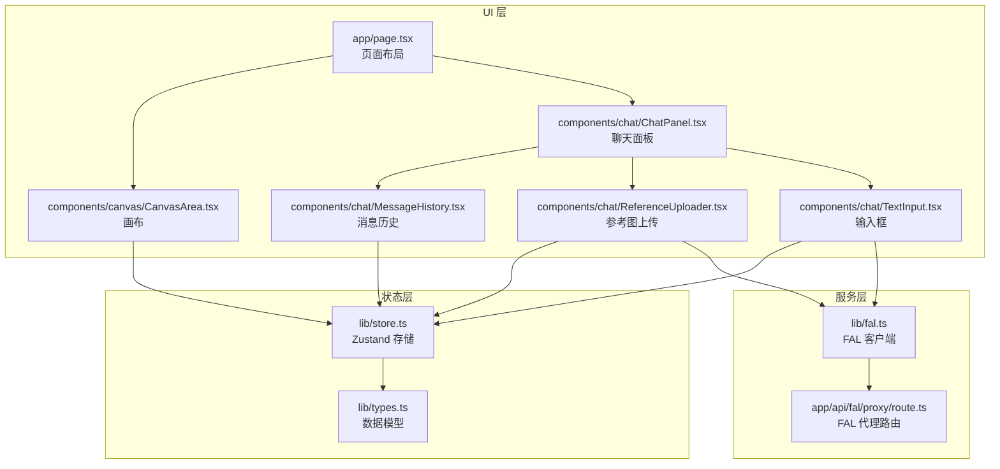

**图表来源**
- [lib/store.ts:1-119](file://lib/store.ts#L1-L119)
- [lib/types.ts:1-37](file://lib/types.ts#L1-L37)
- [app/page.tsx:1-59](file://app/page.tsx#L1-L59)
- [components/canvas/CanvasArea.tsx:1-431](file://components/canvas/CanvasArea.tsx#L1-L431)
- [components/chat/ChatPanel.tsx:1-22](file://components/chat/ChatPanel.tsx#L1-L22)
- [components/chat/MessageHistory.tsx:1-37](file://components/chat/MessageHistory.tsx#L1-L37)
- [components/chat/ReferenceUploader.tsx:1-100](file://components/chat/ReferenceUploader.tsx#L1-L100)
- [components/chat/TextInput.tsx:1-140](file://components/chat/TextInput.tsx#L1-L140)
- [lib/fal.ts:1-62](file://lib/fal.ts#L1-L62)
- [app/api/fal/proxy/route.ts:1-4](file://app/api/fal/proxy/route.ts#L1-L4)

**章节来源**
- [lib/store.ts:1-119](file://lib/store.ts#L1-L119)
- [lib/types.ts:1-37](file://lib/types.ts#L1-L37)
- [app/page.tsx:1-59](file://app/page.tsx#L1-L59)

## 核心组件
- Zustand 存储：定义状态切片与动作，集成持久化中间件，限制聊天历史长度，提供安全本地存储包装器。
- 数据模型：CanvasItem（画布元素）、Message（对话消息）、StoredRef（参考资源）。
- UI 绑定：各组件通过 useAppStore 订阅状态，调用动作函数更新状态。
- 异步服务：FAL 客户端封装生成与编辑接口，Next.js 路由作为代理转发请求。

**章节来源**
- [lib/store.ts:19-119](file://lib/store.ts#L19-L119)
- [lib/types.ts:1-37](file://lib/types.ts#L1-L37)
- [lib/fal.ts:1-62](file://lib/fal.ts#L1-L62)

## 架构总览
Zustand 以函数式 Store 暴露状态与动作，持久化中间件按切片选择性序列化/反序列化，避免将会话内状态写入持久化存储。UI 组件通过选择器订阅所需字段，减少不必要重渲染。

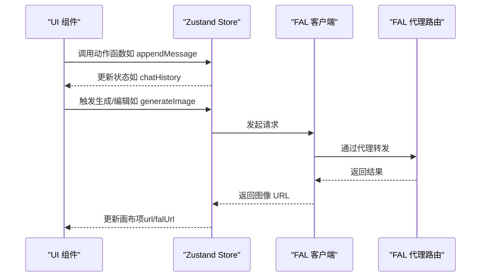

**图表来源**
- [lib/store.ts:45-119](file://lib/store.ts#L45-L119)
- [lib/fal.ts:21-61](file://lib/fal.ts#L21-L61)
- [app/api/fal/proxy/route.ts:1-4](file://app/api/fal/proxy/route.ts#L1-L4)

## 详细组件分析

### 状态切片与组织
- 已持久化切片（PersistedSlice）
  - chatHistory：消息历史数组，最大长度限制，超出时丢弃最旧条目。
- 会话切片（SessionSlice）
  - canvasItems：画布元素列表（含占位符、上传中状态）。
  - referenceImages：参考图片列表（本地预览与远端地址）。
  - isEditingMode / editingTarget：编辑模式与当前目标。
  - isLoading：全局加载状态。
- 动作（Actions）
  - 画布：添加/更新/移除/清空；编辑模式切换与目标更新。
  - 参考图：添加/更新/移除；上传成功后回填远端地址。
  - 聊天：追加消息并裁剪历史。
  - 加载：设置加载状态。

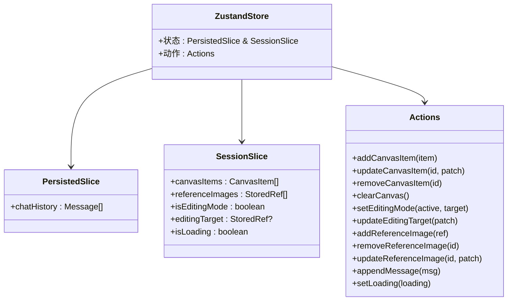

**图表来源**
- [lib/store.ts:33-101](file://lib/store.ts#L33-L101)

**章节来源**
- [lib/store.ts:33-119](file://lib/store.ts#L33-L119)

### 数据模型详解
- CanvasItem
  - 字段：id、显示 URL、FAL CDN URL、坐标、尺寸、上传状态、占位符标记。
  - 使用场景：画布元素渲染、拖拽、缩放、下载、清理。
- Message
  - 字段：id、角色（用户/助手）、内容、可选结果图 URL、时间戳。
  - 使用场景：消息历史展示、结果反馈。
- StoredRef
  - 字段：id、本地对象 URL、FAL 远端 URL、名称、上传状态。
  - 使用场景：参考图上传预览、上传完成后的远端回填。

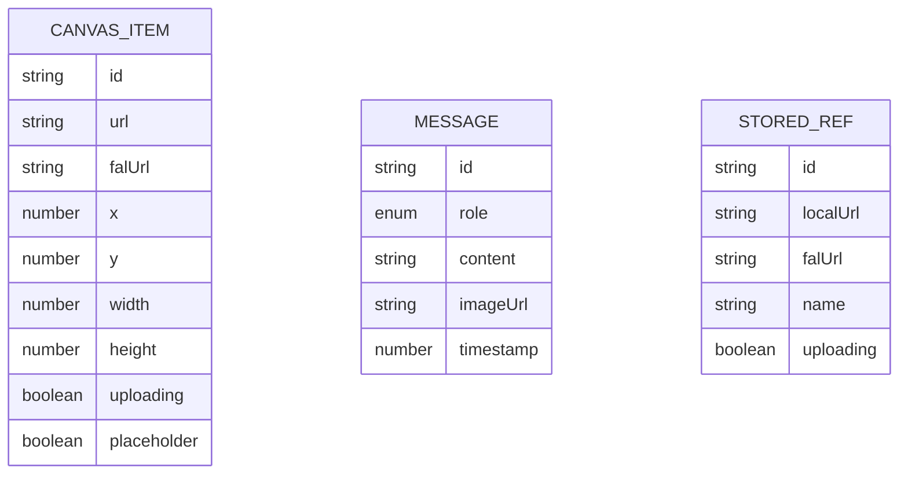

**图表来源**
- [lib/types.ts:9-27](file://lib/types.ts#L9-L27)

**章节来源**
- [lib/types.ts:1-37](file://lib/types.ts#L1-L37)

### 状态持久化机制
- 中间件配置
  - 存储键名：lovart-storage。
  - 自定义存储：safeStorage 包装 localStorage，异常兜底。
  - 序列化策略：partialize 仅持久化 chatHistory。
- 行为特征
  - 启动时从持久化恢复聊天历史。
  - 会话内状态（画布、参考图、编辑态、加载态）不写入持久化，保持纯净会话体验。

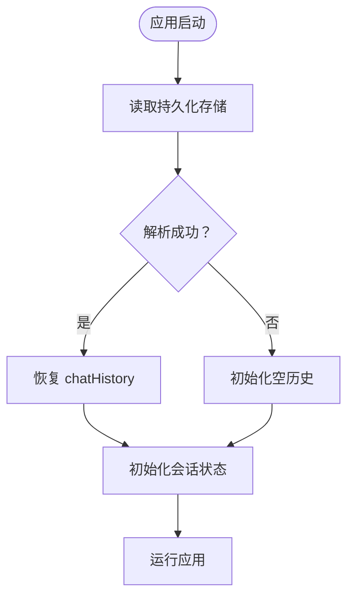

**图表来源**
- [lib/store.ts:102-118](file://lib/store.ts#L102-L118)

**章节来源**
- [lib/store.ts:7-17](file://lib/store.ts#L7-L17)
- [lib/store.ts:102-118](file://lib/store.ts#L102-L118)

### CanvasItem 的使用与生命周期
- 创建与上传
  - 拖拽文件到画布：生成本地对象 URL，添加到 canvasItems 并标记上传中。
  - 上传成功：回填 FAL CDN 地址，取消上传中状态。
  - 失败：提示错误并清理。
- 编辑与选择
  - 选择元素进入编辑模式，复制当前元素信息到 editingTarget。
  - 支持拖拽移动、等比缩放、中键平移、滚轮缩放。
- 清理与下载
  - 删除单个或清空画布；下载当前选中或最新非占位元素。

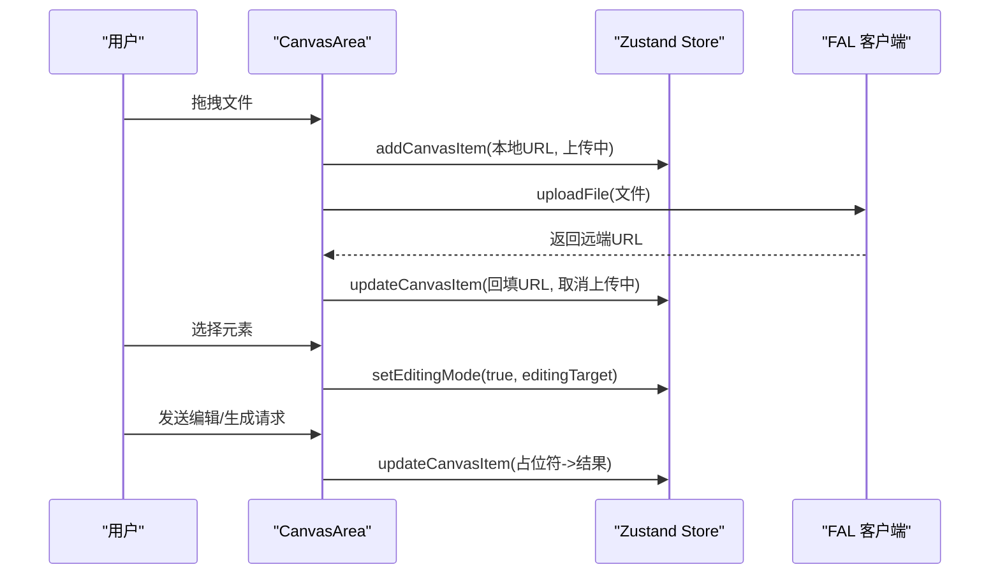

**图表来源**
- [components/canvas/CanvasArea.tsx:306-340](file://components/canvas/CanvasArea.tsx#L306-L340)
- [lib/store.ts:58-92](file://lib/store.ts#L58-L92)
- [lib/fal.ts:59-61](file://lib/fal.ts#L59-L61)

**章节来源**
- [components/canvas/CanvasArea.tsx:163-431](file://components/canvas/CanvasArea.tsx#L163-L431)
- [lib/store.ts:58-101](file://lib/store.ts#L58-L101)

### Message 的管理与展示
- 追加与裁剪
  - appendMessage 将新消息加入队尾，超过上限则丢弃最旧部分。
- 展示逻辑
  - MessageHistory 基于选择器订阅 chatHistory，自动滚动到底部。
  - MessageBubble 根据角色渲染不同样式，支持显示结果图。

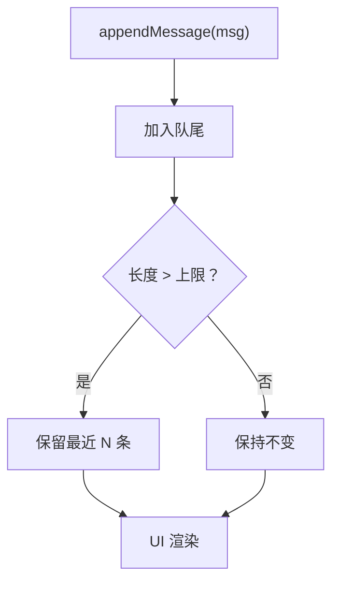

**图表来源**
- [lib/store.ts:94-98](file://lib/store.ts#L94-L98)
- [components/chat/MessageHistory.tsx:8-36](file://components/chat/MessageHistory.tsx#L8-L36)
- [lib/types.ts:9-15](file://lib/types.ts#L9-L15)

**章节来源**
- [lib/store.ts:94-98](file://lib/store.ts#L94-L98)
- [components/chat/MessageHistory.tsx:1-37](file://components/chat/MessageHistory.tsx#L1-L37)
- [lib/types.ts:9-15](file://lib/types.ts#L9-L15)

### StoredRef 的上传与引用
- 添加
  - ReferenceUploader 校验文件类型与大小，生成本地预览 URL，添加到 referenceImages。
- 上传
  - 调用 FAL 上传，成功后回填远端 URL 并关闭上传中。
- 移除
  - 删除引用并撤销本地对象 URL，防止内存泄漏。

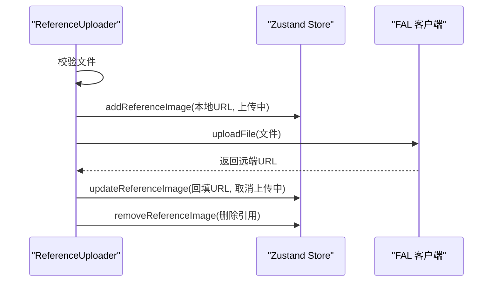

**图表来源**
- [components/chat/ReferenceUploader.tsx:18-41](file://components/chat/ReferenceUploader.tsx#L18-L41)
- [lib/store.ts:81-92](file://lib/store.ts#L81-L92)
- [lib/fal.ts:59-61](file://lib/fal.ts#L59-L61)

**章节来源**
- [components/chat/ReferenceUploader.tsx:1-100](file://components/chat/ReferenceUploader.tsx#L1-L100)
- [lib/store.ts:81-92](file://lib/store.ts#L81-L92)

### 状态更新触发机制与副作用
- 触发源
  - 用户交互：拖拽、点击、输入、键盘事件。
  - 异步完成：文件上传、图像生成/编辑。
- 副作用处理
  - 上传与生成均通过动作函数更新状态，失败时统一提示并清理。
  - 编辑模式切换与目标更新通过动作集中管理，避免分散更新。

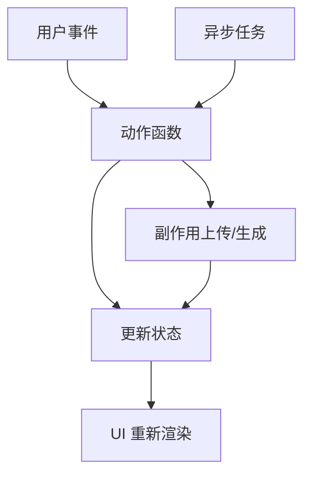

**图表来源**
- [components/chat/TextInput.tsx:34-89](file://components/chat/TextInput.tsx#L34-L89)
- [components/canvas/CanvasArea.tsx:331-338](file://components/canvas/CanvasArea.tsx#L331-L338)

**章节来源**
- [components/chat/TextInput.tsx:1-140](file://components/chat/TextInput.tsx#L1-L140)
- [components/canvas/CanvasArea.tsx:306-340](file://components/canvas/CanvasArea.tsx#L306-L340)

### 状态与 UI 组件绑定
- 订阅方式
  - 选择器订阅：如 MessageHistory 订阅 chatHistory，减少无关重渲染。
  - 全量订阅：如 CanvasArea 订阅多个字段，确保编辑态与画布联动。
- 绑定点
  - 页面布局：app/page.tsx 组合画布与聊天面板。
  - 面板组件：ChatPanel 汇聚消息历史、参考图上传与输入框。

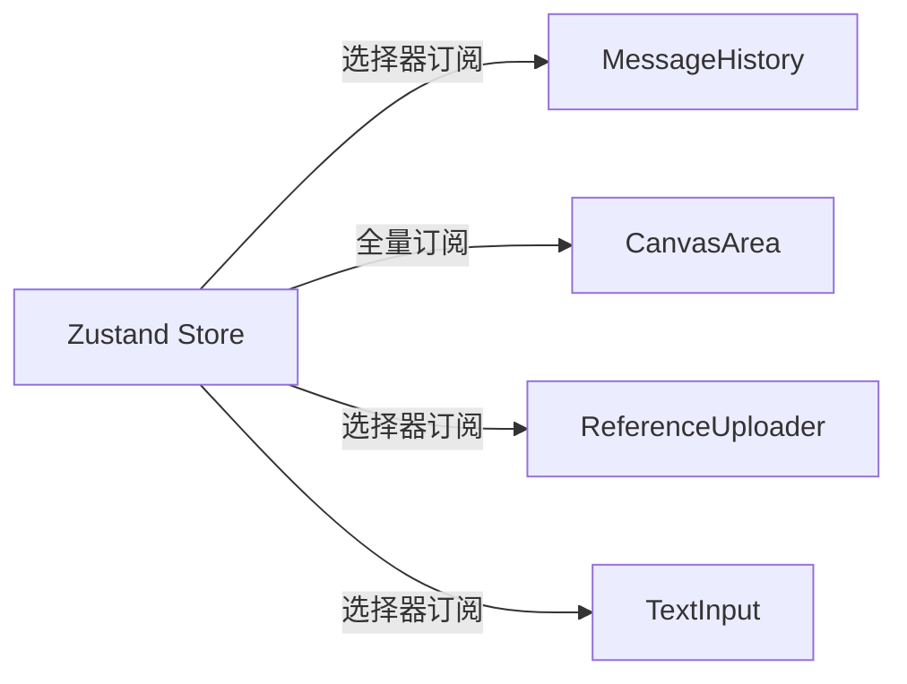

**图表来源**
- [components/chat/MessageHistory.tsx:9](file://components/chat/MessageHistory.tsx#L9)
- [components/canvas/CanvasArea.tsx:163-172](file://components/canvas/CanvasArea.tsx#L163-L172)
- [components/chat/ReferenceUploader.tsx:14](file://components/chat/ReferenceUploader.tsx#L14)
- [components/chat/TextInput.tsx:14-25](file://components/chat/TextInput.tsx#L14-L25)

**章节来源**
- [app/page.tsx:1-59](file://app/page.tsx#L1-L59)
- [components/chat/ChatPanel.tsx:1-22](file://components/chat/ChatPanel.tsx#L1-L22)

### 性能优化策略
- 状态粒度控制
  - 使用选择器订阅，避免全量状态变更导致的过度重渲染。
- 本地存储安全
  - safeStorage 包装 localStorage，异常时降级为空状态，保证稳定性。
- 历史长度限制
  - 聊天历史上限裁剪，降低内存占用。
- 上传与生成的阻塞
  - 在上传或生成期间禁用输入，避免并发状态竞争。

**章节来源**
- [lib/store.ts:7-17](file://lib/store.ts#L7-L17)
- [lib/store.ts:5-5](file://lib/store.ts#L5)
- [components/chat/TextInput.tsx:31-31](file://components/chat/TextInput.tsx#L31)

### 内存管理
- 对象 URL 回收
  - 参考图与画布元素的本地对象 URL 在移除时及时撤销，防止内存泄漏。
- 占位符与上传状态
  - 生成/编辑流程使用占位符，完成后替换真实 URL，避免同时持有两份大图。

**章节来源**
- [components/canvas/CanvasArea.tsx:331-338](file://components/canvas/CanvasArea.tsx#L331-L338)
- [components/chat/ReferenceUploader.tsx:72-72](file://components/chat/ReferenceUploader.tsx#L72-L72)

### 最佳实践
- 将“会话内”与“持久化”状态分离，明确边界。
- 使用动作函数集中处理副作用，便于测试与追踪。
- 通过选择器订阅最小化渲染范围。
- 对外部服务调用进行统一错误处理与回退。

**章节来源**
- [lib/store.ts:45-119](file://lib/store.ts#L45-L119)
- [components/chat/TextInput.tsx:82-88](file://components/chat/TextInput.tsx#L82-L88)

### 调试技巧
- 测试用例验证核心行为：添加/移除画布项、清空画布、参考图上传回填、消息历史裁剪。
- 开发环境可直接查看浏览器存储中的持久化键值。
- 通过动作函数日志定位异步流程问题。

**章节来源**
- [__tests__/store.test.ts:1-92](file://__tests__/store.test.ts#L1-L92)

### 扩展方法
- 新增状态切片：在现有 Store 中新增切片与动作，注意持久化策略。
- 新增数据类型：在 types.ts 中定义接口，配套动作与 UI 组件。
- 新增异步服务：在 lib/fal.ts 中扩展接口，路由代理保持一致。

**章节来源**
- [lib/types.ts:1-37](file://lib/types.ts#L1-L37)
- [lib/fal.ts:1-62](file://lib/fal.ts#L1-L62)

### 状态迁移与版本兼容
- 当前实现未显式处理版本迁移，建议后续引入版本号字段与迁移函数，在初始化时检测并升级历史数据。
- 持久化键名 lovart-storage 作为版本锚点，变更时可考虑重命名以触发全新初始化。

**章节来源**
- [lib/store.ts:102-118](file://lib/store.ts#L102-L118)

## 依赖关系分析
- Zustand：状态管理核心，提供 create/persist。
- FAL 客户端与代理：负责图像生成/编辑与存储上传。
- UI 依赖：各组件通过 hooks 访问 Store，形成单向数据流。

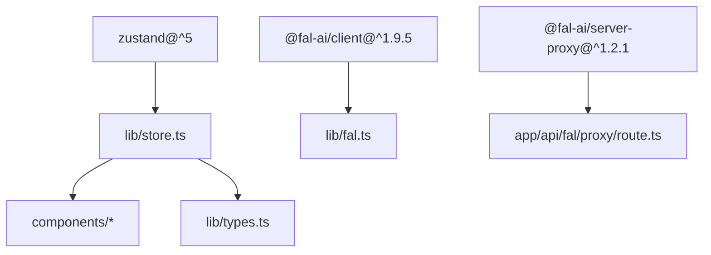

**图表来源**
- [package.json:11-29](file://package.json#L11-L29)
- [lib/store.ts:1-3](file://lib/store.ts#L1-L3)
- [lib/fal.ts:1-3](file://lib/fal.ts#L1-L3)
- [app/api/fal/proxy/route.ts:1-3](file://app/api/fal/proxy/route.ts#L1-L3)

**章节来源**
- [package.json:11-48](file://package.json#L11-L48)

## 性能考虑
- 选择器订阅：减少不必要的渲染。
- 本地存储异常兜底：避免因存储异常影响应用启动。
- 历史长度限制：控制内存增长。
- 上传/生成阻塞：避免并发状态竞争导致的重复请求。

[本节为通用指导，无需特定文件来源]

## 故障排查指南
- 上传失败
  - 现象：上传中状态未结束或出现错误提示。
  - 排查：确认 FAL_KEY 配置与网络连通性；检查代理路由是否可用。
- 生成失败
  - 现象：占位符未替换且弹出错误提示。
  - 排查：检查网络错误与服务端返回；确认参考图 URL 有效。
- 本地存储异常
  - 现象：应用启动时历史为空或报错。
  - 排查：safeStorage 包装器会吞异常，确认浏览器隐私模式或存储权限。

**章节来源**
- [components/canvas/CanvasArea.tsx:334-337](file://components/canvas/CanvasArea.tsx#L334-L337)
- [components/chat/TextInput.tsx:82-88](file://components/chat/TextInput.tsx#L82-L88)
- [lib/store.ts:7-17](file://lib/store.ts#L7-L17)

## 结论
本状态管理系统以 Zustand 为核心，清晰划分持久化与会话状态，围绕 CanvasItem、Message、StoredRef 构建完整的数据模型。通过动作函数统一管理副作用，UI 组件以选择器订阅实现高效渲染。配合持久化中间件与安全存储包装，系统在功能完整性与运行稳定性之间取得平衡。建议后续引入版本迁移与更细粒度的性能监控，持续提升可维护性与用户体验。

## 附录
- 文件清单与用途概览
  - lib/store.ts：Zustand Store 定义与持久化配置。
  - lib/types.ts：CanvasItem、Message、StoredRef 数据模型。
  - lib/fal.ts：FAL 图像生成/编辑/上传客户端。
  - lib/validate.ts：文件校验工具。
  - components/canvas/CanvasArea.tsx：画布主组件，包含拖拽、上传、编辑、下载等逻辑。
  - components/chat/ChatPanel.tsx：聊天面板容器。
  - components/chat/MessageHistory.tsx：消息历史展示。
  - components/chat/ReferenceUploader.tsx：参考图上传与管理。
  - components/chat/TextInput.tsx：输入与生成/编辑触发。
  - app/api/fal/proxy/route.ts：FAL 服务代理路由。
  - app/page.tsx：页面布局与设备适配。
  - __tests__/store.test.ts：状态行为测试。

[本节为概览性汇总，无需特定文件来源]