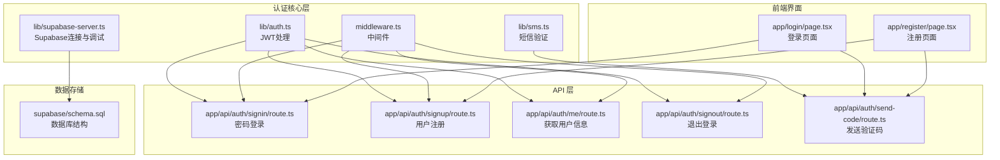
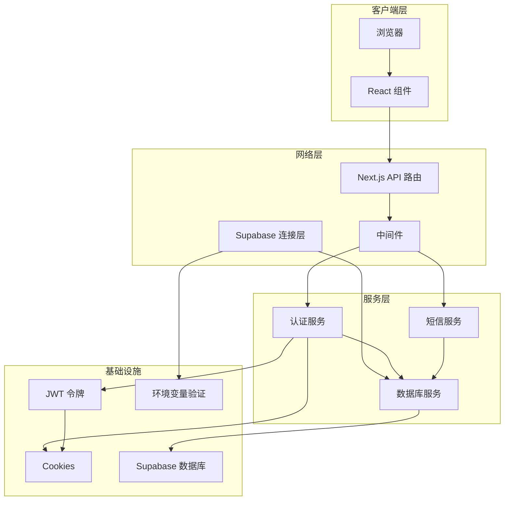
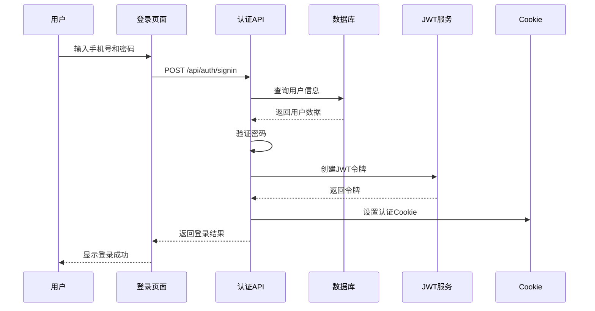
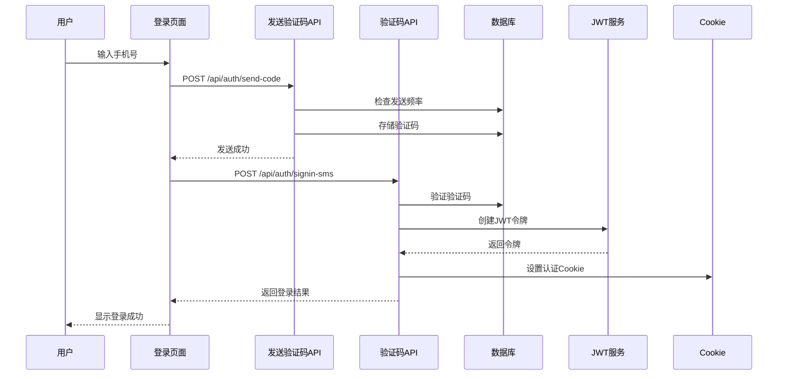
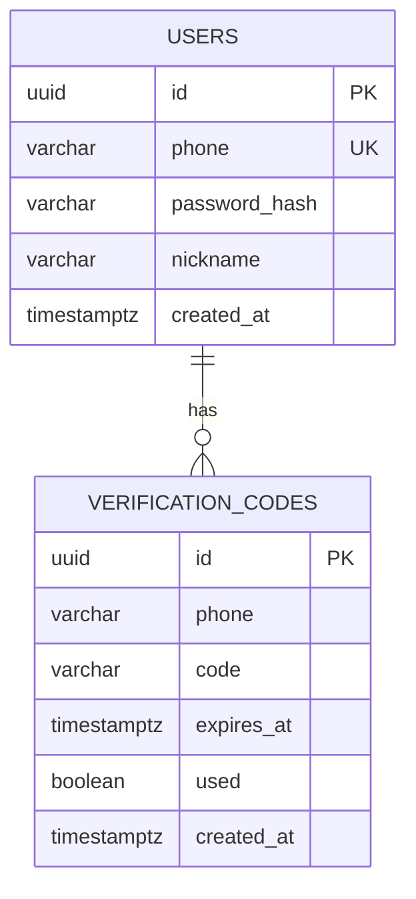

# 用户认证系统

<cite>
**本文档引用的文件**
- [lib/auth.ts](file://lib/auth.ts)
- [app/api/auth/signin/route.ts](file://app/api/auth/signin/route.ts)
- [app/api/auth/signup/route.ts](file://app/api/auth/signup/route.ts)
- [app/api/auth/me/route.ts](file://app/api/auth/me/route.ts)
- [app/api/auth/signout/route.ts](file://app/api/auth/signout/route.ts)
- [app/api/auth/send-code/route.ts](file://app/api/auth/send-code/route.ts)
- [lib/sms.ts](file://lib/sms.ts)
- [middleware.ts](file://middleware.ts)
- [lib/supabase-server.ts](file://lib/supabase-server.ts)
- [lib/types.ts](file://lib/types.ts)
- [app/login/page.tsx](file://app/login/page.tsx)
- [app/register/page.tsx](file://app/register/page.tsx)
- [supabase/schema.sql](file://supabase/schema.sql)
- [package.json](file://package.json)
</cite>

## 更新摘要
**变更内容**
- 增强了Supabase集成调试能力，在`lib/supabase-server.ts`中添加了详细的环境变量验证日志系统
- 改进了错误消息以明确指出缺少的环境变量，提升了开发和部署时的故障排除体验
- 新增了环境变量检查和详细日志记录功能，帮助开发者快速定位配置问题

## 目录
1. [简介](#简介)
2. [项目结构](#项目结构)
3. [核心组件](#核心组件)
4. [架构概览](#架构概览)
5. [详细组件分析](#详细组件分析)
6. [依赖关系分析](#依赖关系分析)
7. [性能考虑](#性能考虑)
8. [故障排除指南](#故障排除指南)
9. [结论](#结论)

## 简介

这是一个基于 Next.js 构建的用户认证系统，采用手机号+密码和手机号+验证码两种登录方式。系统使用 JWT 令牌进行身份验证，并通过 Cookie 存储认证状态。整个认证流程包括用户注册、登录、会话管理和权限控制等功能。

**更新** 系统现已增强Supabase集成调试能力，提供了更详细的环境变量验证和错误诊断功能。

## 项目结构

该项目采用 Next.js 应用程序结构，认证相关的文件主要分布在以下目录：



**图表来源**
- [lib/auth.ts:1-64](file://lib/auth.ts#L1-L64)
- [app/api/auth/signin/route.ts:1-93](file://app/api/auth/signin/route.ts#L1-L93)
- [app/api/auth/signup/route.ts:1-118](file://app/api/auth/signup/route.ts#L1-L118)
- [middleware.ts:1-64](file://middleware.ts#L1-L64)
- [lib/supabase-server.ts:1-29](file://lib/supabase-server.ts#L1-L29)

**章节来源**
- [lib/auth.ts:1-64](file://lib/auth.ts#L1-L64)
- [app/api/auth/signin/route.ts:1-93](file://app/api/auth/signin/route.ts#L1-L93)
- [app/api/auth/signup/route.ts:1-118](file://app/api/auth/signup/route.ts#L1-L118)
- [middleware.ts:1-64](file://middleware.ts#L1-L64)
- [lib/supabase-server.ts:1-29](file://lib/supabase-server.ts#L1-L29)

## 核心组件

### JWT 认证模块

JWT 认证模块负责处理令牌的创建、验证和 Cookie 管理：

- **令牌签名**: 使用 HS256 算法创建 7 天有效期的 JWT
- **令牌验证**: 验证 JWT 的完整性和有效性
- **Cookie 管理**: 设置安全的 HttpOnly Cookie，包含认证令牌
- **边缘兼容**: 支持在边缘环境中读取请求头中的 Cookie

### 短信验证模块

短信验证模块提供验证码生成功能和发送机制：

- **验证码生成**: 6 位数字随机验证码
- **频率限制**: 60 秒内同一手机号只能发送一次验证码
- **过期管理**: 验证码 5 分钟后自动过期
- **开发模式**: 无配置时自动进入开发模式，直接输出验证码到控制台

### 中间件认证

中间件提供全局的访问控制：

- **路由匹配**: 区分认证 API 和普通 API 路由
- **用户重定向**: 已登录用户访问登录页时自动跳转首页
- **权限控制**: 对受保护的 API 和页面进行认证检查
- **错误处理**: 统一的 401 错误响应

### Supabase 连接与调试模块

**更新** Supabase 连接模块现在包含增强的调试功能：

- **环境变量验证**: 在初始化时检查所有必需的 Supabase 环境变量
- **详细日志记录**: 输出环境变量状态、长度和运行环境信息
- **智能错误报告**: 明确指出缺失的具体环境变量名称
- **开发友好**: 在开发环境中提供详细的诊断信息

**章节来源**
- [lib/auth.ts:8-64](file://lib/auth.ts#L8-L64)
- [lib/sms.ts:43-115](file://lib/sms.ts#L43-L115)
- [middleware.ts:11-50](file://middleware.ts#L11-L50)
- [lib/supabase-server.ts:5-29](file://lib/supabase-server.ts#L5-L29)

## 架构概览

系统采用分层架构设计，确保认证逻辑的清晰分离和可维护性：



**图表来源**
- [lib/auth.ts:13-55](file://lib/auth.ts#L13-L55)
- [lib/sms.ts:43-90](file://lib/sms.ts#L43-L90)
- [lib/supabase-server.ts:5-29](file://lib/supabase-server.ts#L5-L29)
- [middleware.ts:11-50](file://middleware.ts#L11-L50)

## 详细组件分析

### 登录流程分析

#### 密码登录流程



**图表来源**
- [app/login/page.tsx:66-94](file://app/login/page.tsx#L66-L94)
- [app/api/auth/signin/route.ts:8-84](file://app/api/auth/signin/route.ts#L8-L84)
- [lib/auth.ts:13-39](file://lib/auth.ts#L13-L39)

#### 验证码登录流程



**图表来源**
- [app/login/page.tsx:33-64](file://app/login/page.tsx#L33-L64)
- [app/api/auth/send-code/route.ts:6-40](file://app/api/auth/send-code/route.ts#L6-L40)
- [lib/sms.ts:92-114](file://lib/sms.ts#L92-L114)

### 注册流程分析

```mermaid
flowchart TD
Start([开始注册]) --> ValidatePhone["验证手机号格式"]
ValidatePhone --> PhoneValid{"手机号有效?"}
PhoneValid --> |否| ShowPhoneError["显示手机号错误"]
PhoneValid --> |是| ValidatePassword["验证密码长度"]
ValidatePassword --> PassValid{"密码有效?"}
PassValid --> |否| ShowPassError["显示密码错误"]
PassValid --> |是| ValidateCode["验证验证码"]
ValidateCode --> CodeValid{"验证码有效?"}
CodeValid --> |否| ShowCodeError["显示验证码错误"]
CodeValid --> |是| CheckDuplicate["检查手机号重复"]
CheckDuplicate --> Duplicate{"手机号已存在?"}
Duplicate --> |是| ShowDupError["显示已注册错误"]
Duplicate --> |否| HashPassword["加密密码"]
HashPassword --> CreateUser["创建用户记录]
CreateUser --> CreateSuccess{"创建成功?"}
CreateSuccess --> |否| ShowCreateError["显示创建失败"]
CreateSuccess --> |是| CreateToken["创建JWT令牌"]
CreateToken --> SetCookie["设置认证Cookie"]
SetCookie --> Complete([注册完成])
ShowPhoneError --> End([结束])
ShowPassError --> End
ShowCodeError --> End
ShowDupError --> End
ShowCreateError --> End
```

**图表来源**
- [app/register/page.tsx:90-115](file://app/register/page.tsx#L90-L115)
- [app/api/auth/signup/route.ts:9-110](file://app/api/auth/signup/route.ts#L9-L110)

**章节来源**
- [app/login/page.tsx:66-133](file://app/login/page.tsx#L66-L133)
- [app/register/page.tsx:90-115](file://app/register/page.tsx#L90-L115)
- [app/api/auth/signin/route.ts:8-84](file://app/api/auth/signin/route.ts#L8-L84)
- [app/api/auth/signup/route.ts:9-110](file://app/api/auth/signup/route.ts#L9-L110)

### 数据模型分析

系统使用以下核心数据模型：



**图表来源**
- [supabase/schema.sql:1-24](file://supabase/schema.sql#L1-L24)

**章节来源**
- [supabase/schema.sql:1-24](file://supabase/schema.sql#L1-L24)
- [lib/types.ts:50-56](file://lib/types.ts#L50-L56)

## 依赖关系分析

系统的关键依赖关系如下：

```mermaid
graph LR
subgraph "外部依赖"
A[jose<br/>JWT处理]
B[bcryptjs<br/>密码加密]
C[@alicloud/dysmsapi20170525<br/>短信服务]
D[@supabase/supabase-js<br/>数据库客户端]
E[console.log<br/>调试输出]
end
subgraph "内部模块"
F[lib/auth.ts]
G[lib/sms.ts]
H[lib/supabase-server.ts]
I[middleware.ts]
end
subgraph "API路由"
J[signin/route.ts]
K[signup/route.ts]
L[send-code/route.ts]
M[me/route.ts]
N[signout/route.ts]
end
A --> F
B --> J
B --> K
C --> G
D --> H
E --> H
F --> J
F --> K
F --> M
F --> N
G --> L
H --> J
H --> K
H --> L
H --> M
I --> J
I --> K
I --> M
I --> N
```

**图表来源**
- [package.json:11-35](file://package.json#L11-L35)
- [lib/auth.ts:1](file://lib/auth.ts#L1)
- [lib/sms.ts:1](file://lib/sms.ts#L1)
- [lib/supabase-server.ts:10-24](file://lib/supabase-server.ts#L10-L24)

**章节来源**
- [package.json:11-35](file://package.json#L11-L35)
- [lib/auth.ts:1-64](file://lib/auth.ts#L1-L64)
- [lib/sms.ts:1-115](file://lib/sms.ts#L1-L115)
- [lib/supabase-server.ts:1-29](file://lib/supabase-server.ts#L1-L29)

## 性能考虑

### 缓存策略
- **JWT 令牌缓存**: 7 天有效期减少频繁认证开销
- **数据库查询优化**: 为常用查询字段建立索引
- **前端状态管理**: 使用 Zustand 进行本地状态缓存

### 安全优化
- **密码哈希**: 使用 bcryptjs 进行安全的密码存储
- **Cookie 安全**: HttpOnly、Secure、SameSite 属性保护
- **请求频率限制**: 验证码发送频率限制防止滥用

### 网络优化
- **边缘计算**: 中间件支持边缘部署
- **异步处理**: 异步短信发送避免阻塞主线程
- **错误降级**: 开发模式下的验证码直通机制

### 调试优化

**更新** 增强的调试功能提升了开发体验：

- **环境变量监控**: 实时监控 Supabase 连接所需的环境变量状态
- **详细日志输出**: 提供环境变量长度、存在性检查和运行环境信息
- **智能错误诊断**: 当环境变量缺失时，明确指出具体缺少的变量名称
- **开发友好提示**: 在开发环境中提供详细的配置指导信息

## 故障排除指南

### 常见问题及解决方案

#### 认证失败
**症状**: 登录后立即被重定向到登录页
**原因**: JWT 令牌验证失败或过期
**解决**: 检查 JWT_SECRET 环境变量配置，确认令牌有效期设置

#### 短信发送失败
**症状**: 验证码无法接收
**原因**: 阿里云短信配置缺失或网络问题
**解决**: 配置 ALIYUN_SMS_* 环境变量，检查网络连接

#### 数据库连接错误
**症状**: 用户注册/登录时报数据库错误
**原因**: Supabase 连接参数配置错误
**解决**: 检查 NEXT_PUBLIC_SUPABASE_URL 和 SUPABASE_SERVICE_ROLE_KEY

#### 权限访问被拒绝
**症状**: 访问受保护资源返回 401 错误
**原因**: 用户未登录或会话过期
**解决**: 确认用户已登录，检查 Cookie 设置

#### Supabase 连接配置问题

**更新** 新增的Supabase调试功能帮助解决连接问题：

**症状**: 应用启动时出现 Supabase 连接错误
**原因**: 环境变量配置不完整或错误
**解决**: 查看控制台输出的环境变量检查日志，确认以下变量都已正确配置：
- NEXT_PUBLIC_SUPABASE_URL：Supabase 项目 URL
- SUPABASE_SERVICE_ROLE_KEY：Supabase 服务角色密钥

**诊断步骤**：
1. 查看应用启动时的控制台输出，寻找 `[Supabase] Environment check:` 日志
2. 检查日志中显示的变量存在性状态
3. 根据错误消息确认具体缺少的环境变量
4. 在 `.env.local` 或部署平台的环境变量配置中添加缺失的变量

**章节来源**
- [lib/auth.ts:21-28](file://lib/auth.ts#L21-L28)
- [lib/sms.ts:8-10](file://lib/sms.ts#L8-L10)
- [lib/supabase-server.ts:9-24](file://lib/supabase-server.ts#L9-L24)
- [middleware.ts:32-40](file://middleware.ts#L32-L40)

## 结论

这个用户认证系统采用了现代化的架构设计，具有以下特点：

**安全性**: 使用 JWT 令牌和 HttpOnly Cookie 提供安全的认证机制；密码采用 bcryptjs 加密存储；验证码具有时间限制和频率控制。

**易用性**: 支持两种登录方式（密码和验证码），界面简洁直观；中间件提供自动重定向和权限控制。

**可扩展性**: 模块化设计便于功能扩展；支持边缘部署；数据库结构清晰。

**可靠性**: 完善的错误处理机制；开发模式下的调试支持；环境变量配置灵活。

**更新** 增强的Supabase集成调试能力显著提升了开发和部署体验：

- **详细的环境变量验证**: 在应用启动时自动检查所有必需的 Supabase 配置
- **智能错误诊断**: 当配置缺失时，明确指出具体缺少的变量名称
- **开发友好**: 提供详细的日志输出，帮助开发者快速定位配置问题
- **生产环境安全**: 调试日志仅在开发环境中启用，不影响生产环境性能

系统整体设计合理，能够满足大多数 Web 应用的认证需求，同时保持了良好的性能和安全性平衡。新增的调试功能进一步提升了系统的可维护性和开发效率。