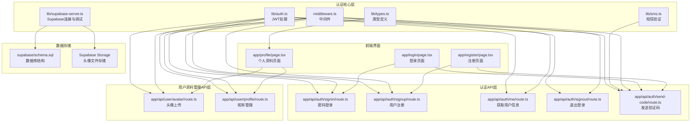
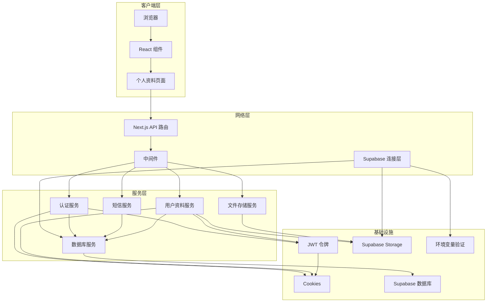
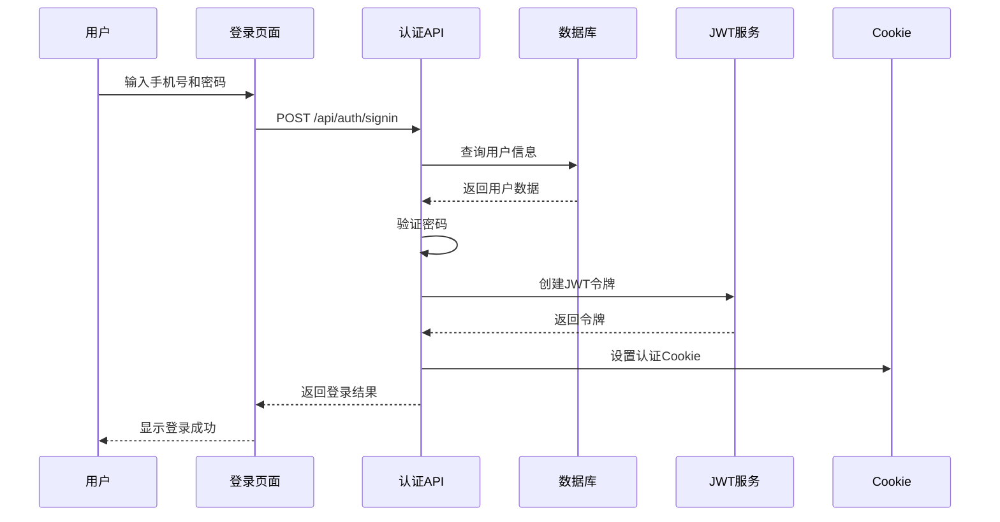
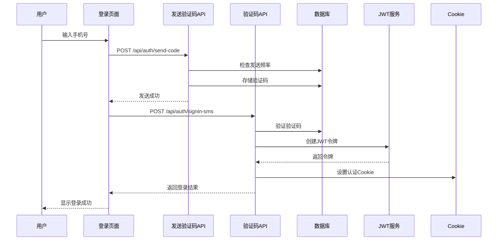
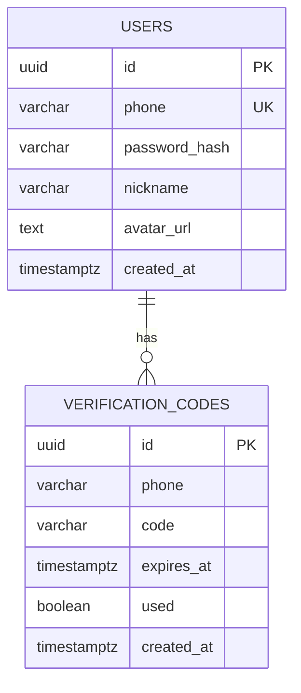
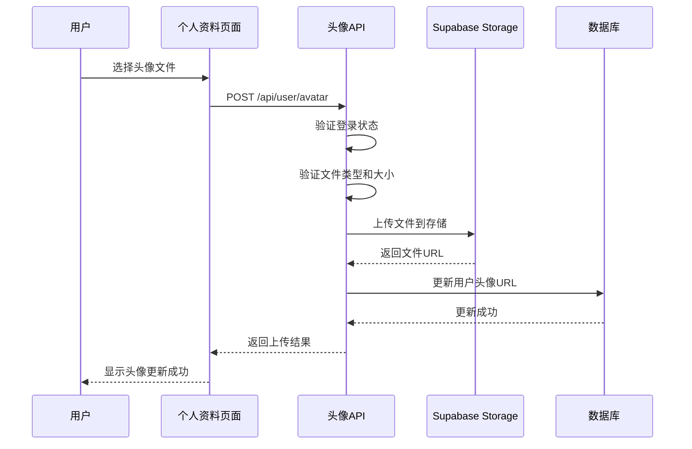
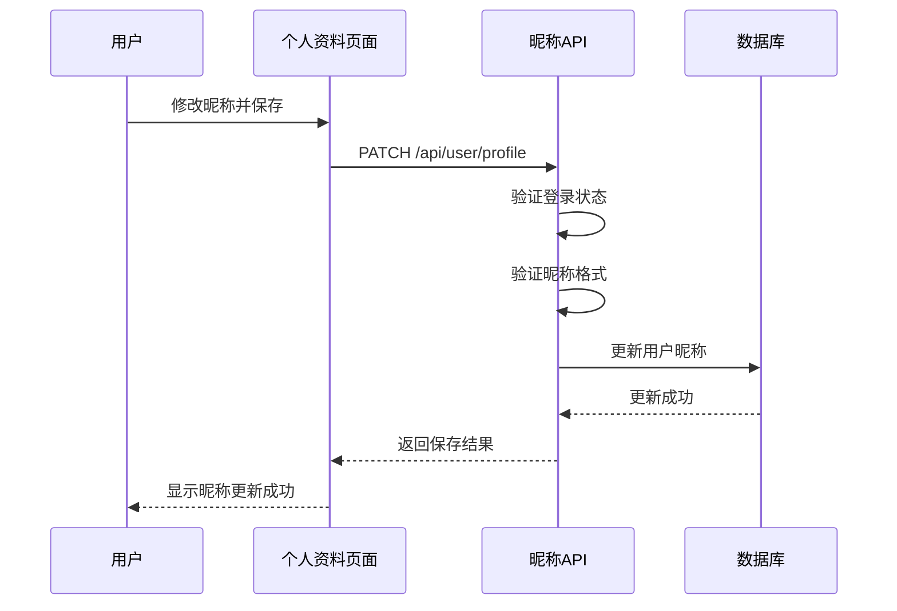

# 用户认证系统

<cite>
**本文档引用的文件**
- [lib/auth.ts](file://lib/auth.ts)
- [app/api/auth/signin/route.ts](file://app/api/auth/signin/route.ts)
- [app/api/auth/signup/route.ts](file://app/api/auth/signup/route.ts)
- [app/api/auth/me/route.ts](file://app/api/auth/me/route.ts)
- [app/api/auth/signout/route.ts](file://app/api/auth/signout/route.ts)
- [app/api/auth/send-code/route.ts](file://app/api/auth/send-code/route.ts)
- [app/api/user/avatar/route.ts](file://app/api/user/avatar/route.ts)
- [app/api/user/profile/route.ts](file://app/api/user/profile/route.ts)
- [lib/sms.ts](file://lib/sms.ts)
- [middleware.ts](file://middleware.ts)
- [lib/supabase-server.ts](file://lib/supabase-server.ts)
- [lib/types.ts](file://lib/types.ts)
- [app/login/page.tsx](file://app/login/page.tsx)
- [app/register/page.tsx](file://app/register/page.tsx)
- [app/profile/page.tsx](file://app/profile/page.tsx)
- [supabase/schema.sql](file://supabase/schema.sql)
- [package.json](file://package.json)
</cite>

## 更新摘要
**变更内容**
- 增强了Supabase集成调试能力，在`lib/supabase-server.ts`中添加了详细的环境变量验证日志系统
- 改进了错误消息以明确指出缺少的环境变量，提升了开发和部署时的故障排除体验
- 新增了环境变量检查和详细日志记录功能，帮助开发者快速定位配置问题
- **重大扩展**：新增用户头像上传和昵称管理功能，完善用户资料管理能力
- **新增API端点**：`/api/user/avatar` 和 `/api/user/profile` 支持头像上传和昵称更新
- **数据库schema扩展**：新增 `nickname` 和 `avatar_url` 字段支持用户资料存储

## 目录
1. [简介](#简介)
2. [项目结构](#项目结构)
3. [核心组件](#核心组件)
4. [架构概览](#架构概览)
5. [详细组件分析](#详细组件分析)
6. [用户资料管理功能](#用户资料管理功能)
7. [依赖关系分析](#依赖关系分析)
8. [性能考虑](#性能考虑)
9. [故障排除指南](#故障排除指南)
10. [结论](#结论)

## 简介

这是一个基于 Next.js 构建的用户认证系统，采用手机号+密码和手机号+验证码两种登录方式。系统使用 JWT 令牌进行身份验证，并通过 Cookie 存储认证状态。整个认证流程包括用户注册、登录、会话管理和权限控制等功能。

**更新** 系统现已增强Supabase集成调试能力，提供了更详细的环境变量验证和错误诊断功能。**重大扩展**：新增了完整的用户资料管理功能，包括头像上传和昵称管理，为用户提供更丰富的个人资料定制能力。

## 项目结构

该项目采用 Next.js 应用程序结构，认证相关的文件主要分布在以下目录：



**图表来源**
- [lib/auth.ts:1-64](file://lib/auth.ts#L1-L64)
- [app/api/auth/signin/route.ts:1-93](file://app/api/auth/signin/route.ts#L1-L93)
- [app/api/auth/signup/route.ts:1-118](file://app/api/auth/signup/route.ts#L1-L118)
- [app/api/user/avatar/route.ts:1-122](file://app/api/user/avatar/route.ts#L1-L122)
- [app/api/user/profile/route.ts:1-75](file://app/api/user/profile/route.ts#L1-L75)
- [middleware.ts:1-64](file://middleware.ts#L1-L64)
- [lib/supabase-server.ts:1-29](file://lib/supabase-server.ts#L1-L29)

**章节来源**
- [lib/auth.ts:1-64](file://lib/auth.ts#L1-L64)
- [app/api/auth/signin/route.ts:1-93](file://app/api/auth/signin/route.ts#L1-L93)
- [app/api/auth/signup/route.ts:1-118](file://app/api/auth/signup/route.ts#L1-L118)
- [app/api/user/avatar/route.ts:1-122](file://app/api/user/avatar/route.ts#L1-L122)
- [app/api/user/profile/route.ts:1-75](file://app/api/user/profile/route.ts#L1-L75)
- [middleware.ts:1-64](file://middleware.ts#L1-L64)
- [lib/supabase-server.ts:1-29](file://lib/supabase-server.ts#L1-L29)

## 核心组件

### JWT 认证模块

JWT 认证模块负责处理令牌的创建、验证和 Cookie 管理：

- **令牌签名**: 使用 HS256 算法创建 7 天有效期的 JWT
- **令牌验证**: 验证 JWT 的完整性和有效性
- **Cookie 管理**: 设置安全的 HttpOnly Cookie，包含认证令牌
- **边缘兼容**: 支持在边缘环境中读取请求头中的 Cookie

### 短信验证模块

短信验证模块提供验证码生成功能和发送机制：

- **验证码生成**: 6 位数字随机验证码
- **频率限制**: 60 秒内同一手机号只能发送一次验证码
- **过期管理**: 验证码 5 分钟后自动过期
- **开发模式**: 无配置时自动进入开发模式，直接输出验证码到控制台

### 中间件认证

中间件提供全局的访问控制：

- **路由匹配**: 区分认证 API 和普通 API 路由
- **用户重定向**: 已登录用户访问登录页时自动跳转首页
- **权限控制**: 对受保护的 API 和页面进行认证检查
- **错误处理**: 统一的 401 错误响应

### Supabase 连接与调试模块

**更新** Supabase 连接模块现在包含增强的调试功能：

- **环境变量验证**: 在初始化时检查所有必需的 Supabase 环境变量
- **详细日志记录**: 输出环境变量状态、长度和运行环境信息
- **智能错误报告**: 明确指出缺失的具体环境变量名称
- **开发友好**: 在开发环境中提供详细的诊断信息

### 用户资料管理模块

**新增** 用户资料管理模块提供完整的用户信息管理功能：

- **头像上传**: 支持 JPG、PNG、WebP、GIF 格式的头像上传，最大 5MB
- **昵称管理**: 支持 2-20 字符长度的昵称设置和更新
- **文件存储**: 使用 Supabase Storage 进行头像文件存储
- **数据同步**: 自动更新用户表中的 `avatar_url` 和 `nickname` 字段

**章节来源**
- [lib/auth.ts:8-64](file://lib/auth.ts#L8-L64)
- [lib/sms.ts:43-115](file://lib/sms.ts#L43-L115)
- [middleware.ts:11-50](file://middleware.ts#L11-L50)
- [lib/supabase-server.ts:5-29](file://lib/supabase-server.ts#L5-L29)
- [app/api/user/avatar/route.ts:5-8](file://app/api/user/avatar/route.ts#L5-L8)
- [app/api/user/profile/route.ts:28-42](file://app/api/user/profile/route.ts#L28-L42)

## 架构概览

系统采用分层架构设计，确保认证逻辑的清晰分离和可维护性：



**图表来源**
- [lib/auth.ts:13-55](file://lib/auth.ts#L13-L55)
- [lib/sms.ts:43-90](file://lib/sms.ts#L43-L90)
- [lib/supabase-server.ts:5-29](file://lib/supabase-server.ts#L5-L29)
- [middleware.ts:11-50](file://middleware.ts#L11-L50)
- [app/api/user/avatar/route.ts:64-81](file://app/api/user/avatar/route.ts#L64-L81)
- [app/api/user/profile/route.ts:44-58](file://app/api/user/profile/route.ts#L44-L58)

## 详细组件分析

### 登录流程分析

#### 密码登录流程



**图表来源**
- [app/login/page.tsx:66-94](file://app/login/page.tsx#L66-L94)
- [app/api/auth/signin/route.ts:8-84](file://app/api/auth/signin/route.ts#L8-L84)
- [lib/auth.ts:13-39](file://lib/auth.ts#L13-L39)

#### 验证码登录流程



**图表来源**
- [app/login/page.tsx:33-64](file://app/login/page.tsx#L33-L64)
- [app/api/auth/send-code/route.ts:6-40](file://app/api/auth/send-code/route.ts#L6-L40)
- [lib/sms.ts:92-114](file://lib/sms.ts#L92-L114)

### 注册流程分析

```mermaid
flowchart TD
Start([开始注册]) --> ValidatePhone["验证手机号格式"]
ValidatePhone --> PhoneValid{"手机号有效?"}
PhoneValid --> |否| ShowPhoneError["显示手机号错误"]
PhoneValid --> |是| ValidatePassword["验证密码长度"]
ValidatePassword --> PassValid{"密码有效?"}
PassValid --> |否| ShowPassError["显示密码错误"]
PassValid --> |是| ValidateCode["验证验证码"]
ValidateCode --> CodeValid{"验证码有效?"}
CodeValid --> |否| ShowCodeError["显示验证码错误"]
CodeValid --> |是| CheckDuplicate["检查手机号重复"]
CheckDuplicate --> Duplicate{"手机号已存在?"}
Duplicate --> |是| ShowDupError["显示已注册错误"]
Duplicate --> |否| HashPassword["加密密码"]
HashPassword --> CreateUser["创建用户记录]
CreateUser --> CreateSuccess{"创建成功?"}
CreateSuccess --> |否| ShowCreateError["显示创建失败"]
CreateSuccess --> |是| CreateToken["创建JWT令牌"]
CreateToken --> SetCookie["设置认证Cookie"]
SetCookie --> Complete([注册完成])
ShowPhoneError --> End([结束])
ShowPassError --> End
ShowCodeError --> End
ShowDupError --> End
ShowCreateError --> End
```

**图表来源**
- [app/register/page.tsx:90-115](file://app/register/page.tsx#L90-L115)
- [app/api/auth/signup/route.ts:9-110](file://app/api/auth/signup/route.ts#L9-L110)

**章节来源**
- [app/login/page.tsx:66-133](file://app/login/page.tsx#L66-L133)
- [app/register/page.tsx:90-115](file://app/register/page.tsx#L90-L115)
- [app/api/auth/signin/route.ts:8-84](file://app/api/auth/signin/route.ts#L8-L84)
- [app/api/auth/signup/route.ts:9-110](file://app/api/auth/signup/route.ts#L9-L110)

### 数据模型分析

系统使用以下核心数据模型：



**图表来源**
- [supabase/schema.sql:1-24](file://supabase/schema.sql#L1-L24)

**章节来源**
- [supabase/schema.sql:1-24](file://supabase/schema.sql#L1-L24)
- [lib/types.ts:50-56](file://lib/types.ts#L50-L56)

## 用户资料管理功能

**新增** 用户资料管理功能提供了完整的用户信息定制能力：

### 头像上传流程



**图表来源**
- [app/profile/page.tsx:65-115](file://app/profile/page.tsx#L65-L115)
- [app/api/user/avatar/route.ts:9-121](file://app/api/user/avatar/route.ts#L9-L121)

### 昵称管理流程



**图表来源**
- [app/profile/page.tsx:118-158](file://app/profile/page.tsx#L118-L158)
- [app/api/user/profile/route.ts:5-74](file://app/api/user/profile/route.ts#L5-L74)

### 前端实现细节

个人资料页面实现了完整的用户交互体验：

- **头像预览**: 支持图片头像、昵称首字母、默认头像三种显示模式
- **文件验证**: 前端和后端双重验证，确保文件类型和大小符合要求
- **实时更新**: 成功上传后立即更新本地状态和显示效果
- **错误处理**: 完善的错误提示和回滚机制

**章节来源**
- [app/api/user/avatar/route.ts:1-122](file://app/api/user/avatar/route.ts#L1-L122)
- [app/api/user/profile/route.ts:1-75](file://app/api/user/profile/route.ts#L1-L75)
- [app/profile/page.tsx:1-284](file://app/profile/page.tsx#L1-L284)

## 依赖关系分析

系统的关键依赖关系如下：

```mermaid
graph LR
subgraph "外部依赖"
A[jose<br/>JWT处理]
B[bcryptjs<br/>密码加密]
C[@alicloud/dysmsapi20170525<br/>短信服务]
D[@supabase/supabase-js<br/>数据库客户端]
E[console.log<br/>调试输出]
F[lucide-react<br/>图标库]
G[sonner<br/>通知组件]
H[zustand<br/>状态管理]
end
subgraph "内部模块"
I[lib/auth.ts]
J[lib/sms.ts]
K[lib/supabase-server.ts]
L[middleware.ts]
M[lib/types.ts]
N[lib/store.ts]
end
subgraph "认证API路由"
O[signin/route.ts]
P[signup/route.ts]
Q[send-code/route.ts]
R[me/route.ts]
S[signout/route.ts]
end
subgraph "用户资料API路由"
T[user/avatar/route.ts]
U[user/profile/route.ts]
end
A --> I
B --> O
B --> P
C --> J
D --> K
E --> K
I --> O
I --> P
I --> R
I --> S
I --> T
I --> U
J --> Q
K --> O
K --> P
K --> Q
K --> R
K --> S
K --> T
K --> U
L --> O
L --> P
L --> R
L --> S
L --> T
L --> U
M --> N
N --> T
N --> U
F --> T
G --> T
H --> T
```

**图表来源**
- [package.json:11-35](file://package.json#L11-L35)
- [lib/auth.ts:1](file://lib/auth.ts#L1)
- [lib/sms.ts:1](file://lib/sms.ts#L1)
- [lib/supabase-server.ts:10-24](file://lib/supabase-server.ts#L10-L24)
- [lib/types.ts:50-56](file://lib/types.ts#L50-L56)
- [lib/store.ts:376-377](file://lib/store.ts#L376-L377)

**章节来源**
- [package.json:11-35](file://package.json#L11-L35)
- [lib/auth.ts:1-64](file://lib/auth.ts#L1-L64)
- [lib/sms.ts:1-115](file://lib/sms.ts#L1-L115)
- [lib/supabase-server.ts:1-29](file://lib/supabase-server.ts#L1-L29)
- [lib/types.ts:50-56](file://lib/types.ts#L50-L56)
- [lib/store.ts:376-377](file://lib/store.ts#L376-L377)

## 性能考虑

### 缓存策略
- **JWT 令牌缓存**: 7 天有效期减少频繁认证开销
- **数据库查询优化**: 为常用查询字段建立索引
- **前端状态管理**: 使用 Zustand 进行本地状态缓存

### 安全优化
- **密码哈希**: 使用 bcryptjs 进行安全的密码存储
- **Cookie 安全**: HttpOnly、Secure、SameSite 属性保护
- **请求频率限制**: 验证码发送频率限制防止滥用
- **文件上传安全**: 严格的文件类型和大小验证

### 网络优化
- **边缘计算**: 中间件支持边缘部署
- **异步处理**: 异步短信发送避免阻塞主线程
- **错误降级**: 开发模式下的验证码直通机制
- **文件存储优化**: 使用 CDN 加速头像加载

### 调试优化

**更新** 增强的调试功能提升了开发体验：

- **环境变量监控**: 实时监控 Supabase 连接所需的环境变量状态
- **详细日志输出**: 提供环境变量长度、存在性检查和运行环境信息
- **智能错误诊断**: 当环境变量缺失时，明确指出具体缺少的变量名称
- **开发友好提示**: 在开发环境中提供详细的配置指导信息

### 用户体验优化

**新增** 用户资料管理功能的性能优化：

- **文件上传进度**: 实时显示上传进度和状态
- **头像预览**: 支持即时预览上传的头像
- **错误回滚**: 上传失败时自动回滚，保持数据一致性
- **响应式设计**: 适配各种设备和屏幕尺寸

## 故障排除指南

### 常见问题及解决方案

#### 认证失败
**症状**: 登录后立即被重定向到登录页
**原因**: JWT 令牌验证失败或过期
**解决**: 检查 JWT_SECRET 环境变量配置，确认令牌有效期设置

#### 短信发送失败
**症状**: 验证码无法接收
**原因**: 阿里云短信配置缺失或网络问题
**解决**: 配置 ALIYUN_SMS_* 环境变量，检查网络连接

#### 数据库连接错误
**症状**: 用户注册/登录时报数据库错误
**原因**: Supabase 连接参数配置错误
**解决**: 检查 NEXT_PUBLIC_SUPABASE_URL 和 SUPABASE_SERVICE_ROLE_KEY

#### 权限访问被拒绝
**症状**: 访问受保护资源返回 401 错误
**原因**: 用户未登录或会话过期
**解决**: 确认用户已登录，检查 Cookie 设置

#### Supabase 连接配置问题

**更新** 新增的Supabase调试功能帮助解决连接问题：

**症状**: 应用启动时出现 Supabase 连接错误
**原因**: 环境变量配置不完整或错误
**解决**: 查看控制台输出的环境变量检查日志，确认以下变量都已正确配置：
- NEXT_PUBLIC_SUPABASE_URL：Supabase 项目 URL
- SUPABASE_SERVICE_ROLE_KEY：Supabase 服务角色密钥

**诊断步骤**：
1. 查看应用启动时的控制台输出，寻找 `[Supabase] Environment check:` 日志
2. 检查日志中显示的变量存在性状态
3. 根据错误消息确认具体缺少的环境变量
4. 在 `.env.local` 或部署平台的环境变量配置中添加缺失的变量

#### 用户资料管理问题

**新增** 用户资料管理功能的故障排除：

**症状**: 头像上传失败
**原因**: 文件类型不支持、文件过大、存储空间不足
**解决**: 
1. 确认文件类型为 JPG、PNG、WebP、GIF
2. 确认文件大小不超过 5MB
3. 检查 Supabase Storage 配额和权限
4. 查看控制台错误日志获取详细信息

**症状**: 昵称更新失败
**原因**: 昵称格式不符合要求、数据库更新错误
**解决**:
1. 确认昵称长度在 2-20 个字符之间
2. 检查数据库连接和权限
3. 查看控制台错误日志获取详细信息

**章节来源**
- [lib/auth.ts:21-28](file://lib/auth.ts#L21-L28)
- [lib/sms.ts:8-10](file://lib/sms.ts#L8-L10)
- [lib/supabase-server.ts:9-24](file://lib/supabase-server.ts#L9-L24)
- [middleware.ts:32-40](file://middleware.ts#L32-L40)
- [app/api/user/avatar/route.ts:39-53](file://app/api/user/avatar/route.ts#L39-L53)
- [app/api/user/profile/route.ts:28-42](file://app/api/user/profile/route.ts#L28-L42)

## 结论

这个用户认证系统采用了现代化的架构设计，具有以下特点：

**安全性**: 使用 JWT 令牌和 HttpOnly Cookie 提供安全的认证机制；密码采用 bcryptjs 加密存储；验证码具有时间限制和频率控制；文件上传具备严格的安全验证。

**易用性**: 支持两种登录方式（密码和验证码），界面简洁直观；中间件提供自动重定向和权限控制；**新增**：个人资料页面提供直观的头像上传和昵称管理功能。

**可扩展性**: 模块化设计便于功能扩展；支持边缘部署；数据库结构清晰；**新增**：用户资料管理功能为未来功能扩展奠定基础。

**可靠性**: 完善的错误处理机制；开发模式下的调试支持；环境变量配置灵活；**新增**：头像上传的错误回滚和数据一致性保障。

**更新** 增强的Supabase集成调试能力和**重大扩展**的用户资料管理功能显著提升了系统价值：

- **详细的环境变量验证**: 在应用启动时自动检查所有必需的 Supabase 配置
- **智能错误诊断**: 当配置缺失时，明确指出具体缺少的变量名称
- **开发友好**: 提供详细的日志输出，帮助开发者快速定位配置问题
- **生产环境安全**: 调试日志仅在开发环境中启用，不影响生产环境性能
- **完整的用户资料管理**: 支持头像上传和昵称管理，提升用户体验
- **文件存储优化**: 使用 Supabase Storage 提供可靠的文件存储服务
- **前后端协同**: 前端提供直观的用户界面，后端确保数据安全和一致性

系统整体设计合理，能够满足大多数 Web 应用的认证需求，同时保持了良好的性能和安全性平衡。新增的用户资料管理功能进一步增强了系统的实用性和用户体验，为构建完整的用户管理系统奠定了坚实基础。