# 画布交互系统

<cite>
**本文档引用的文件**
- [CanvasArea.tsx](file://components/canvas/CanvasArea.tsx)
- [InlineEditPanel.tsx](file://components/canvas/InlineEditPanel.tsx)
- [Toolbar.tsx](file://components/canvas/Toolbar.tsx)
- [TopBar.tsx](file://components/canvas/TopBar.tsx)
- [types.ts](file://lib/types.ts)
- [store.ts](file://lib/store.ts)
- [validate.ts](file://lib/validate.ts)
- [fal.ts](file://lib/fal.ts)
- [page.tsx](file://app/canvas/page.tsx)
- [project-service.ts](file://lib/project-service.ts)
- [route.ts](file://app/api/projects/route.ts)
- [route.ts](file://app/api/projects/[id]/route.ts)
- [route.ts](file://app/api/projects/[id]/save/route.ts)
- [globals.css](file://app/globals.css)
- [button.tsx](file://components/ui/button.tsx)
- [tooltip.tsx](file://components/ui/tooltip.tsx)
- [package.json](file://package.json)
</cite>

## 更新摘要
**变更内容**
- CanvasArea组件大幅重构，实现单源数据架构
- 新增项目管理功能，支持项目创建、加载、保存
- 实现自动保存系统，包含防抖机制和恢复保护
- 新增编辑器实例协调机制，确保多实例一致性
- 增强占位符闪烁加载动画系统
- 优化tldraw编辑器集成和实时同步
- 改进拖拽上传和文件处理流程

## 目录
1. [简介](#简介)
2. [项目结构](#项目结构)
3. [核心组件](#核心组件)
4. [架构概览](#架构概览)
5. [详细组件分析](#详细组件分析)
6. [依赖关系分析](#依赖关系分析)
7. [性能考虑](#性能考虑)
8. [故障排除指南](#故障排除指南)
9. [最佳实践](#最佳实践)
10. [结论](#结论)

## 简介

画布交互系统是一个基于 React 和 tldraw 2D 图形库构建的现代化图像编辑平台。该系统提供了丰富的交互功能，包括拖拽上传、选择编辑、实时同步和 AI 图像生成等核心特性。系统采用响应式设计，支持桌面端和移动端设备，并集成了 AI 图像生成和编辑功能。

**更新** 系统现已完全迁移至 tldraw 画布系统，这是一个重大的架构升级，提供了更强大的图形编辑能力和更好的用户体验。新的系统不再依赖于 Konva，而是直接使用 tldraw 的原生功能，包括实时同步、形状管理、选择控制等。

**更新** CanvasArea组件经过大幅重构，实现了单源数据架构，确保 CanvasItem 状态与 tldraw 形状的双向实时同步。系统现在包含完整的项目管理功能，支持项目创建、加载、保存和自动恢复。

**新增** 自动保存系统：实现了智能的防抖保存机制，支持项目快照的自动保存和恢复，包含恢复保护和双重检查机制，确保数据安全。

**新增** 编辑器实例协调：通过 editorRef 和 lastEditorRef 管理编辑器实例，解决闭包捕获旧实例的问题，确保项目加载和保存时的实例一致性。

**新增** 增强的占位符管理：实现了保护机制，防止占位符到图像转换过程中的尺寸覆盖问题，确保从 FAL API 获取的精确尺寸值得到正确应用。

**新增** 项目管理API：完整的项目创建、加载、保存和删除功能，支持快照存储和恢复，提供用户友好的项目管理体验。

该系统的核心目标是为用户提供直观、流畅的图像编辑体验，通过可视化的方式让用户能够轻松地管理、编辑和导出图像内容。

## 项目结构

画布交互系统采用模块化的项目结构，主要分为以下几个核心部分：

```mermaid
graph TB
subgraph "应用层"
CanvasPage[app/canvas/page.tsx]
Layout[app/layout.tsx]
Styles[app/globals.css]
end
subgraph "组件层"
Canvas[components/canvas/CanvasArea.tsx]
InlineEdit[components/canvas/InlineEditPanel.tsx]
Toolbar[components/canvas/Toolbar.tsx]
TopBar[components/canvas/TopBar.tsx]
UI[components/ui/]
end
subgraph "逻辑层"
Store[lib/store.ts]
Types[lib/types.ts]
Utils[lib/utils.ts]
Validate[lib/validate.ts]
FAL[lib/fal.ts]
ProjectService[lib/project-service.ts]
end
subgraph "API层"
ProjectAPI[app/api/projects/]
ProjectDetailAPI[app/api/projects/[id]/]
ProjectSaveAPI[app/api/projects/[id]/save/]
end
subgraph "外部依赖"
React[React 19]
Tldraw[tldraw 4.5.3]
Zustand[Zustand 5.0.12]
Tailwind[Tailwind CSS]
end
CanvasPage --> Canvas
Canvas --> InlineEdit
Canvas --> Toolbar
Canvas --> TopBar
Canvas --> Store
Canvas --> Types
Canvas --> Validate
Canvas --> FAL
Canvas --> ProjectService
InlineEdit --> Store
InlineEdit --> Types
InlineEdit --> Validate
InlineEdit --> FAL
Toolbar --> Store
Toolbar --> Types
Toolbar --> Validate
Toolbar --> FAL
TopBar --> Store
TopBar --> Types
Store --> Types
ProjectService --> ProjectAPI
ProjectService --> ProjectDetailAPI
ProjectService --> ProjectSaveAPI
UI --> Button[components/ui/button.tsx]
UI --> Tooltip[components/ui/tooltip.tsx]
```

**图表来源**
- [page.tsx:1-225](file://app/canvas/page.tsx#L1-L225)
- [CanvasArea.tsx:1-2063](file://components/canvas/CanvasArea.tsx#L1-L2063)
- [InlineEditPanel.tsx:1-466](file://components/canvas/InlineEditPanel.tsx#L1-L466)
- [Toolbar.tsx:1-668](file://components/canvas/Toolbar.tsx#L1-L668)
- [TopBar.tsx:1-222](file://components/canvas/TopBar.tsx#L1-L222)
- [store.ts:1-427](file://lib/store.ts#L1-L427)
- [project-service.ts:1-225](file://lib/project-service.ts#L1-L225)

**章节来源**
- [page.tsx:1-225](file://app/canvas/page.tsx#L1-L225)
- [globals.css:136-139](file://app/globals.css#L136-L139)

## 核心组件

### CanvasArea 主组件

CanvasArea 是整个画布系统的核心组件，负责管理 tldraw 画布的渲染、交互和状态管理。该组件实现了完整的画布功能，包括拖拽上传、实时同步、图片选择和编辑等特性。

**更新** 完全重构以支持 tldraw 画布系统，移除了原有的 Konva 实现，实现了单源数据架构。

**更新** 新增项目管理功能：支持项目创建、加载、保存和删除，包含完整的快照管理和恢复机制。

**新增** 自动保存系统：实现了智能的防抖保存机制，支持项目快照的自动保存和恢复，包含恢复保护和双重检查机制。

**新增** 编辑器实例协调：通过 editorRef 和 lastEditorRef 管理编辑器实例，解决闭包捕获旧实例的问题。

**新增** 增强的占位符管理功能：实现保护机制，通过 `recentlyTransitionedRef` 和 `placeholderIdsRef` 状态管理，防止占位符到图像的转换过程中出现尺寸覆盖问题。

#### 主要功能特性

1. **tldraw 编辑器集成**：使用 Tldraw 组件作为画布容器
2. **实时状态同步**：双向同步 CanvasItem 状态与 tldraw 形状
3. **拖拽上传**：支持文件拖拽到画布进行图片上传
4. **占位符节点管理**：AI 生成过程中的临时显示节点，支持闪烁加载动画
5. **下载和清除功能**：支持单个或批量操作
6. **空状态显示**：无图片时的引导界面
7. **注释覆盖层**：实时显示图像尺寸和文件名标注
8. **标记系统**：用户可在画布项目上放置视觉标记
9. **背景颜色管理**：支持 HSV 色彩空间的背景颜色选择
10. **缩放控制**：提供完整的缩放控制功能
11. **许可证支持**：通过 `licenseKey` 属性启用高级功能
12. **智能定位算法**：精确计算覆盖层和标记的位置
13. **项目管理**：支持项目创建、加载、保存和删除
14. **自动保存**：智能防抖保存机制
15. **编辑器协调**：确保编辑器实例一致性

#### 状态管理

组件内部维护了多个关键状态：
- `selectedShapeIds`: 当前选中的形状 ID 数组
- `isEditingMode`: 编辑模式状态
- `editingTarget`: 当前编辑目标
- `processedItemsRef`: 已处理项目的跟踪集合
- `syncingRef`: 同步状态防止无限循环
- `editor`: tldraw 编辑器实例
- `markers`: 标记数组，支持最多8个标记
- `bgColor`: 背景颜色状态
- `zoomLevel`: 缩放级别状态
- `placeholderIdsRef`: 占位符状态追踪集合
- `recentlyTransitionedRef`: 最近转换的项目保护集合
- `isRestoringRef`: 项目恢复状态追踪

**章节来源**
- [CanvasArea.tsx:657-2063](file://components/canvas/CanvasArea.tsx#L657-L2063)

### Toolbar 工具栏组件

**新增** Toolbar 组件提供了完整的画布操作功能，包括背景颜色选择、缩放控制、网格切换等高级功能。

#### 主要功能特性

1. **工具选择**：支持选择、标记、上传、框架、形状、画笔、文本等多种工具
2. **背景颜色选择**：使用 HSV 色彩空间提供精确的颜色选择
3. **缩放控制**：提供缩放级别控制和缩放菜单
4. **网格切换**：支持网格显示的开启和关闭
5. **快捷键支持**：支持键盘快捷键操作
6. **悬停菜单**：提供工具的子菜单和设置选项

#### 工具栏布局

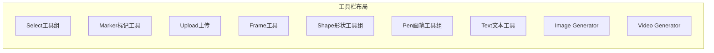

**章节来源**
- [Toolbar.tsx:194-668](file://components/canvas/Toolbar.tsx#L194-L668)

### AnnotationOverlay 注释覆盖层

**新增** AnnotationOverlay 组件实现了注释覆盖层系统，支持实时显示图像尺寸和文件名标注。

#### 主要功能特性

1. **实时尺寸显示**：显示选中图片的实时尺寸
2. **文件名标注**：显示图片文件名，支持双击编辑
3. **框架尺寸标注**：显示框架的尺寸信息
4. **缓存优化**：使用缓存机制优化性能
5. **缩放适配**：根据缩放级别动态调整标注大小

#### 标注系统

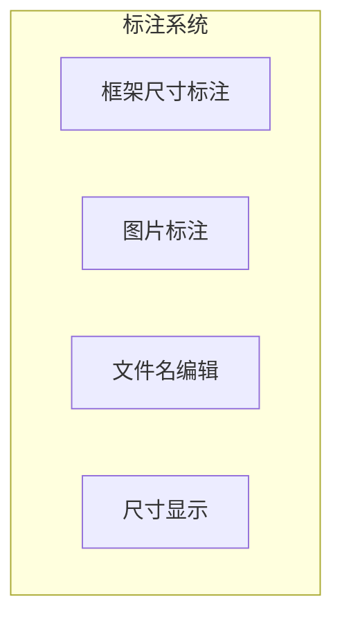

**章节来源**
- [CanvasArea.tsx:279-589](file://components/canvas/CanvasArea.tsx#L279-L589)

### MarkerOverlay 标记覆盖层

**新增** MarkerOverlay 组件实现了标记系统，允许用户在画布项目上放置视觉标记。

#### 主要功能特性

1. **标记放置**：用户可在图片上点击放置标记
2. **标记管理**：支持最多8个标记，自动编号
3. **标记删除**：支持删除单个或全部标记
4. **标记定位**：基于相对坐标的精确定位
5. **标记重渲染**：标记变化时自动重渲染

#### 标记系统

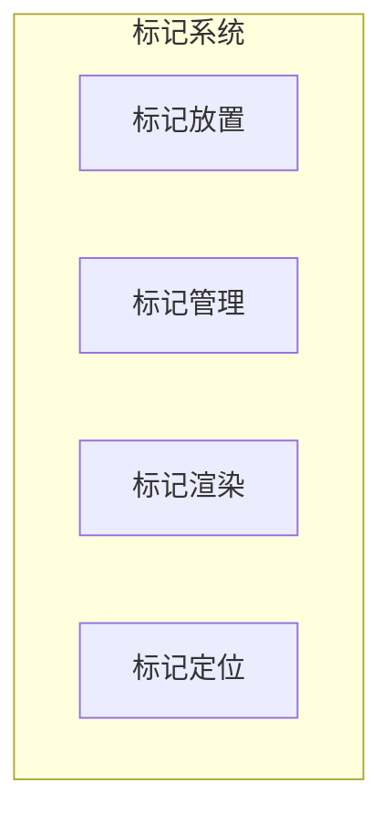

**章节来源**
- [CanvasArea.tsx:204-277](file://components/canvas/CanvasArea.tsx#L204-L277)

### PlaceholderShimmerOverlay 占位符闪烁覆盖层

**新增** PlaceholderShimmerOverlay 组件实现了占位符闪烁加载动画系统，为占位符节点提供视觉反馈的加载状态。

#### 主要功能特性

1. **闪烁动画效果**：使用 CSS `@keyframes shimmer` 实现平滑的闪烁动画
2. **精确坐标转换**：将页面坐标转换为视口坐标，确保动画位置准确
3. **缩放适配**：根据缩放级别动态调整动画尺寸
4. **响应式更新**：监听形状变化和相机变化自动重渲染
5. **性能优化**：只渲染当前存在的占位符节点

#### 占位符闪烁动画系统

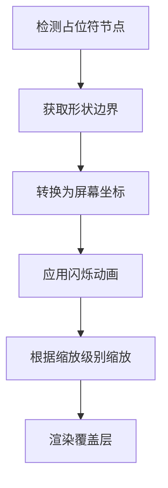

**图表来源**
- [CanvasArea.tsx:591-653](file://components/canvas/CanvasArea.tsx#L591-L653)
- [globals.css:181-189](file://app/globals.css#L181-L189)

#### 占位符闪烁动画实现

- **CSS 动画**：使用 `@keyframes shimmer` 创建水平移动的渐变效果
- **坐标转换**：通过 `pageToViewport` 方法将页面坐标转换为视口坐标
- **缩放适配**：根据相机缩放级别调整动画尺寸和边框粗细
- **性能优化**：只渲染当前存在的占位符节点，避免不必要的重渲染

**章节来源**
- [CanvasArea.tsx:591-653](file://components/canvas/CanvasArea.tsx#L591-L653)
- [globals.css:181-189](file://app/globals.css#L181-L189)

### InlineEditPanel 内联编辑面板

**更新** 重构以支持 tldraw 画布的内联编辑功能，完全适配新的编辑器架构。**重大改进**：现在能够处理新的图像元数据返回类型，支持更精确的图像尺寸管理和显示缩放。

**新增** 智能定位算法：实现了精确的坐标转换和位置计算，确保编辑面板在不同缩放级别下都能准确定位。

#### 主要功能特性

1. **tldraw 集成**：与 tldraw 编辑器实时同步位置
2. **参考图片管理**：支持上传和管理最多6张参考图片
3. **实时图像生成**：基于 AI 模型的实时图像生成和编辑
4. **拖拽排序**：支持参考图片的拖拽重新排序
5. **占位符节点**：AI 生成过程中的临时显示节点，支持闪烁动画
6. **智能定位**：根据选中形状自动计算面板位置
7. **智能尺寸管理**：支持从 API 获取精确的图像尺寸信息
8. **增强错误处理**：改进网络错误和加载失败的处理机制

#### 智能定位算法实现

**新增** InlineEditPanel 实现了精确的坐标转换算法：

- **页面坐标到屏幕坐标**：使用 `pageToScreen` 方法转换底部左角点
- **缩放级别适配**：根据缩放级别调整面板宽度
- **相机变化监听**：监听编辑器相机变化自动更新位置
- **RAF 节流**：使用 requestAnimationFrame 节流更新位置

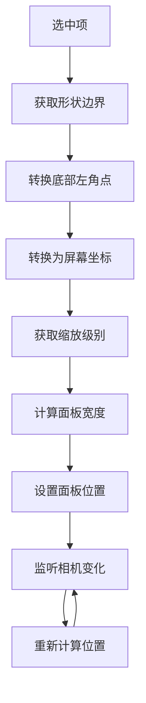

**图表来源**
- [InlineEditPanel.tsx:65-108](file://components/canvas/InlineEditPanel.tsx#L65-L108)

#### 编辑工作流程

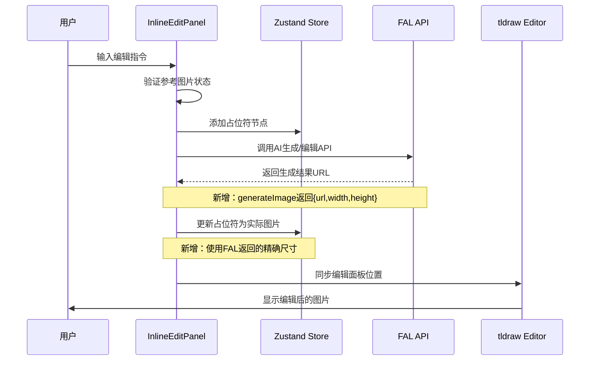

**图表来源**
- [InlineEditPanel.tsx:209-216](file://components/canvas/InlineEditPanel.tsx#L209-L216)
- [InlineEditPanel.tsx:218-270](file://components/canvas/InlineEditPanel.tsx#L218-L270)

#### 智能尺寸管理

**更新** 组件现在支持两种不同的图像生成模式，分别处理不同的返回数据类型：

- **编辑模式** (`editImage`): 返回纯 URL 字符串
- **生成模式** (`generateImage`): 返回 `{ url, width, height }` 对象

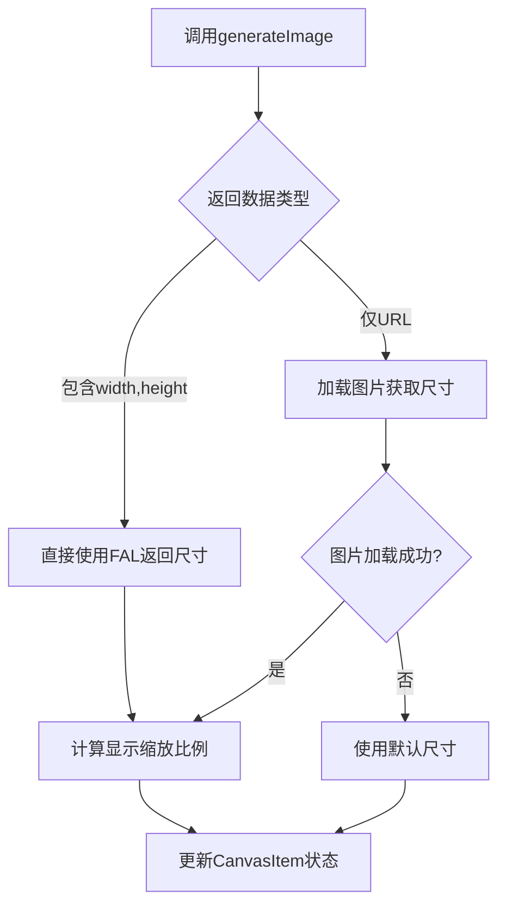

**图表来源**
- [InlineEditPanel.tsx:203-270](file://components/canvas/InlineEditPanel.tsx#L203-L270)

#### 增强错误处理机制

**更新** 新增了更完善的错误处理机制：

- **网络错误检测**：识别网络连接失败并提供友好提示
- **图片加载失败**：当无法获取图片自然尺寸时使用回退方案
- **上传失败处理**：及时清理临时资源和显示错误提示
- **状态清理**：错误发生时正确清理占位符节点

**章节来源**
- [InlineEditPanel.tsx:20-466](file://components/canvas/InlineEditPanel.tsx#L20-L466)

### CanvasItem 数据模型

CanvasItem 是画布系统的核心数据结构，定义了画布上每个元素的完整信息：

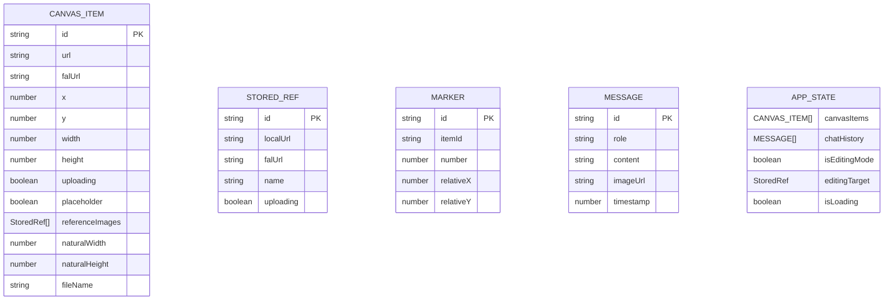

**图表来源**
- [types.ts:17-49](file://lib/types.ts#L17-L49)

**更新** 新增了 `referenceImages` 字段，支持每张图片的独立参考图片管理；新增了 `Marker` 接口，支持标记系统。

#### 占位符节点 vs 实际图片节点

系统通过 `placeholder` 字段区分两种节点类型：

- **占位符节点**：用于 AI 生成过程中的临时显示，具有闪烁的渐变效果
- **实际图片节点**：用户上传的真实图片，支持完整的编辑和变换功能

**章节来源**
- [types.ts:17-37](file://lib/types.ts#L17-L37)

## 架构概览

画布交互系统采用分层架构设计，确保了良好的可维护性和扩展性：

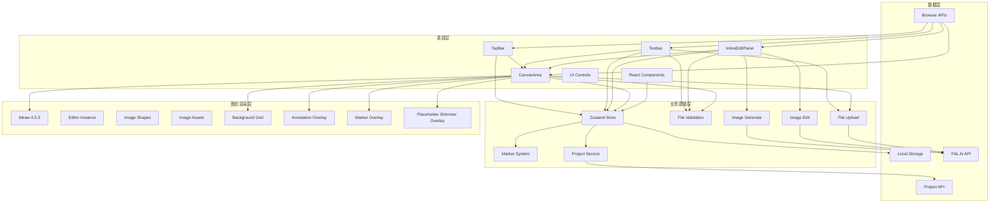

**图表来源**
- [CanvasArea.tsx:1-2063](file://components/canvas/CanvasArea.tsx#L1-L2063)
- [InlineEditPanel.tsx:1-466](file://components/canvas/InlineEditPanel.tsx#L1-L466)
- [Toolbar.tsx:1-668](file://components/canvas/Toolbar.tsx#L1-L668)
- [TopBar.tsx:1-222](file://components/canvas/TopBar.tsx#L1-L222)
- [store.ts:62-427](file://lib/store.ts#L62-L427)
- [project-service.ts:97-225](file://lib/project-service.ts#L97-L225)

### 交互流程

系统的关键交互流程包括拖拽上传、实时同步、图片选择、内联编辑和标记系统等：

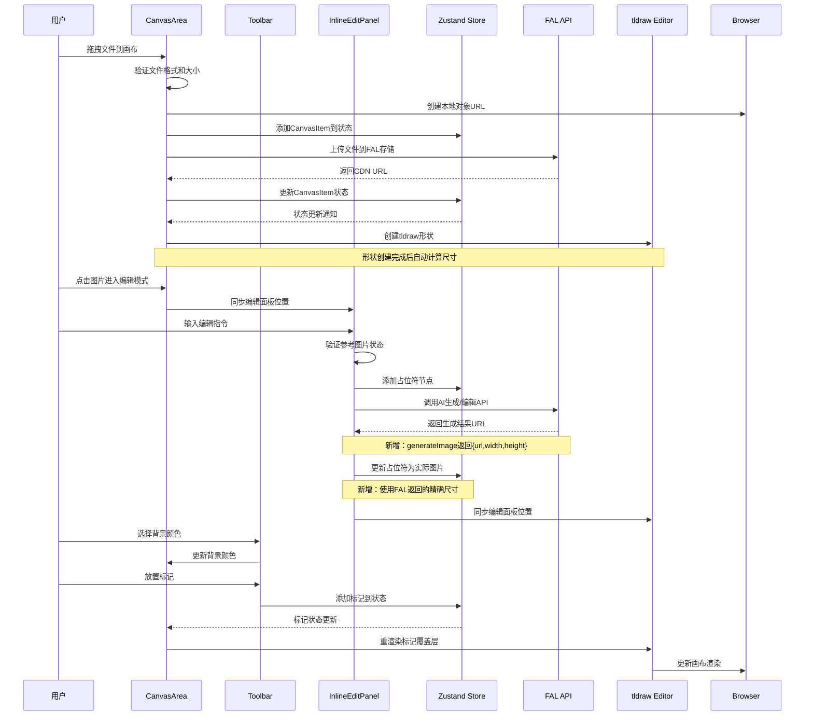

**图表来源**
- [CanvasArea.tsx:263-319](file://components/canvas/CanvasArea.tsx#L263-L319)
- [InlineEditPanel.tsx:209-270](file://components/canvas/InlineEditPanel.tsx#L209-L270)
- [Toolbar.tsx:285-355](file://components/canvas/Toolbar.tsx#L285-L355)

## 详细组件分析

### tldraw 编辑器集成

**新增** CanvasArea 组件实现了与 tldraw 编辑器的深度集成：

#### 编辑器生命周期管理

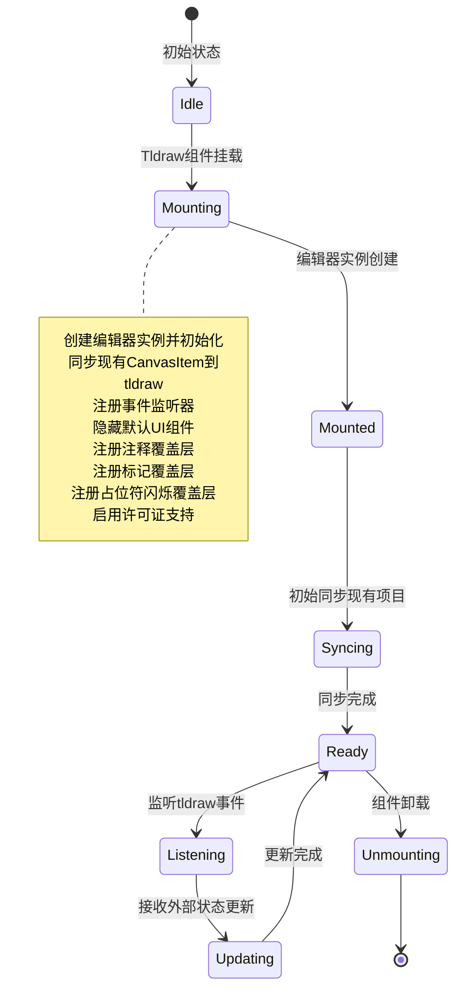

**图表来源**
- [CanvasArea.tsx:857-867](file://components/canvas/CanvasArea.tsx#L857-L867)

#### 实时同步机制

系统实现了 CanvasItem 与 tldraw 形状的双向实时同步：

- **外部到内部**：tldraw 形状变化 → CanvasItem 状态更新
- **内部到外部**：CanvasItem 状态变化 → tldraw 形状更新
- **选择同步**：选中形状 → 编辑面板位置更新
- **删除同步**：删除形状 → CanvasItem 移除

**章节来源**
- [CanvasArea.tsx:1055-1369](file://components/canvas/CanvasArea.tsx#L1055-L1369)
- [store.ts:144-186](file://lib/store.ts#L144-L186)

### 项目管理系统

**新增** 实现了完整的项目管理功能，支持项目创建、加载、保存和删除：

#### 项目管理架构

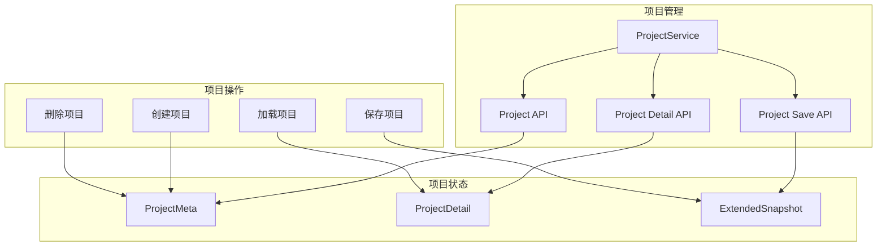

#### 项目创建流程

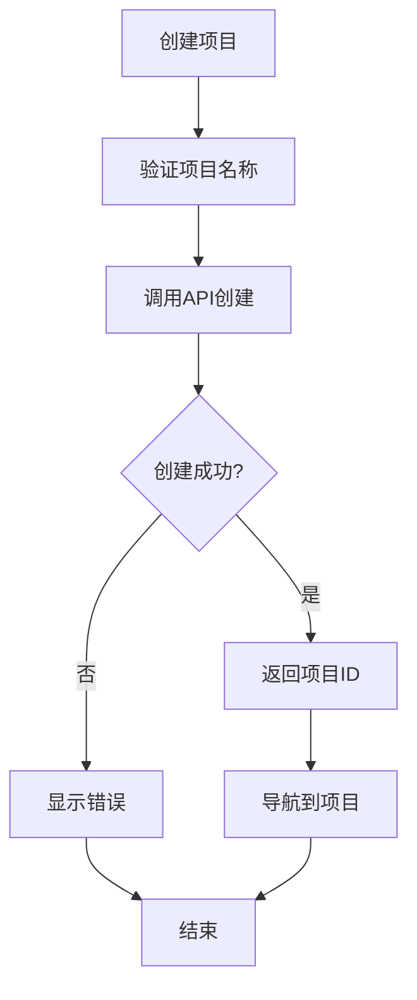

**图表来源**
- [project-service.ts:14-24](file://lib/project-service.ts#L14-L24)

#### 项目加载流程

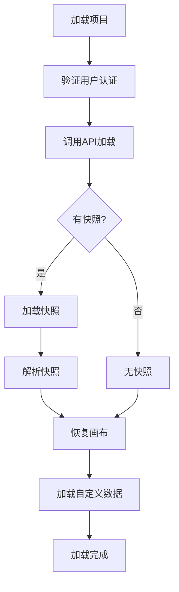

**图表来源**
- [project-service.ts:26-32](file://lib/project-service.ts#L26-L32)

#### 项目保存流程

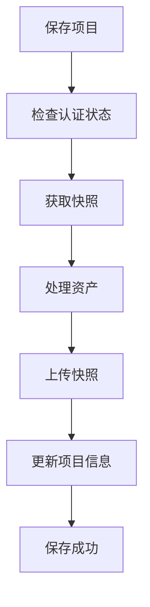

**图表来源**
- [project-service.ts:34-49](file://lib/project-service.ts#L34-L49)

#### 项目API接口

- **GET /api/projects**：获取用户项目列表
- **POST /api/projects**：创建新项目
- **GET /api/projects/[id]**：获取项目详情
- **DELETE /api/projects/[id]**：删除项目
- **PATCH /api/projects/[id]**：更新项目名称
- **POST /api/projects/[id]/save**：保存项目快照

**章节来源**
- [project-service.ts:6-225](file://lib/project-service.ts#L6-L225)
- [route.ts:1-133](file://app/api/projects/route.ts#L1-L133)
- [route.ts:1-275](file://app/api/projects/[id]/route.ts#L1-L275)
- [route.ts:1-194](file://app/api/projects/[id]/save/route.ts#L1-L194)

### 自动保存系统

**新增** 实现了智能的自动保存系统，包含防抖机制和恢复保护：

#### 自动保存架构

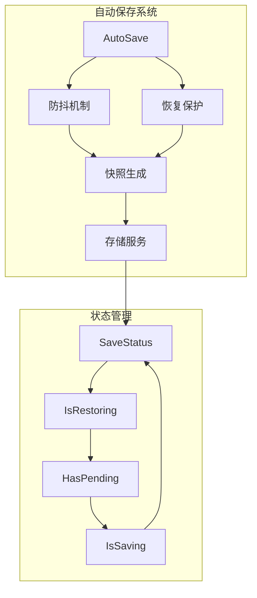

#### 自动保存流程

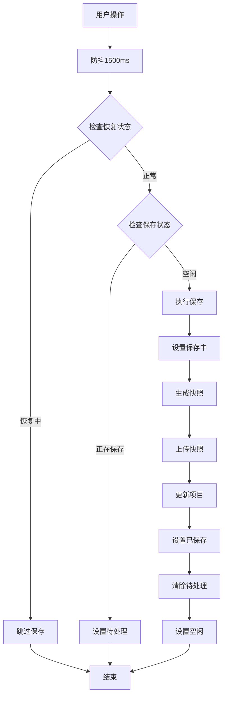

**图表来源**
- [project-service.ts:97-186](file://lib/project-service.ts#L97-L186)

#### 自动保存状态管理

- **SaveStatus**：保存状态枚举（idle/saving/saved/error）
- **IsRestoring**：项目恢复状态标志
- **HasPending**：待处理变更标志
- **IsSaving**：保存中标志
- **SavedStatusTimer**：保存状态定时器

#### 恢复保护机制

- **双重检查**：在执行保存前再次检查 `isRestoringProject` 状态
- **闭包保护**：确保 `projectId` 与 store 中当前项目一致
- **防抖保护**：在恢复期间不启动防抖，防止清空画布操作被保存

**章节来源**
- [project-service.ts:97-225](file://lib/project-service.ts#L97-L225)
- [page.tsx:144-155](file://app/canvas/page.tsx#L144-L155)

### 编辑器实例协调

**新增** 实现了编辑器实例协调机制，确保多实例一致性：

#### 编辑器实例管理

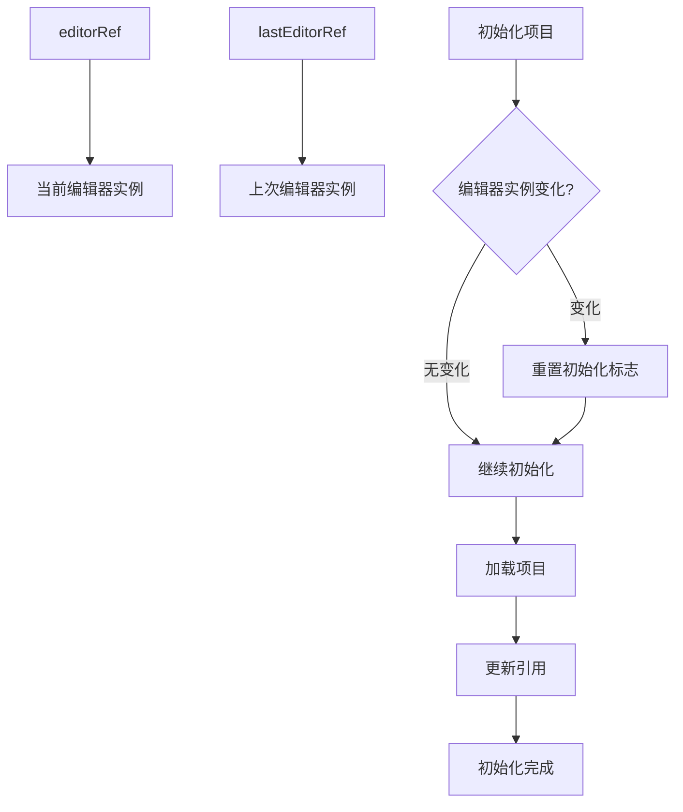

#### 实例协调机制

- **editorRef**：始终指向最新的编辑器实例，每次渲染时更新
- **lastEditorRef**：跟踪上次使用的编辑器实例
- **initializingRef**：防止 initProject 重复执行
- **lastProjectIdRef**：跟踪最后一次初始化的项目ID

#### 闭包问题解决

- **动态引用**：通过 editorRef.current 获取最新编辑器实例
- **实例检查**：在异步操作期间重新获取最新的 editor 实例
- **状态同步**：确保项目加载和保存时使用正确的编辑器实例

**章节来源**
- [page.tsx:27-53](file://app/canvas/page.tsx#L27-L53)
- [page.tsx:83-88](file://app/canvas/page.tsx#L83-L88)

### ID 映射机制

**新增** 实现了 CanvasItem ID 与 tldraw 形状 ID 的双向映射：

#### ID 映射规则

```mermaid
flowchart TD
CanvasItemID[CanvasItem.id] --> ShapeID[TLShapeId]
ShapeID --> CanvasItemID[CanvasItem.id]
CanvasItemID --> ShapeID2[shape:{id}]
ShapeID2 --> CanvasItemID2[{id}]
note right of CanvasItemID
canvasItemIdToShapeId()
shapeIdToCanvasItemId()
end note
```

**图表来源**
- [store.ts:62-68](file://lib/store.ts#L62-L68)

#### 映射函数实现

- `canvasItemIdToShapeId()`: 将 CanvasItem ID 转换为 tldraw 形状 ID
- `shapeIdToCanvasItemId()`: 将 tldraw 形状 ID 转换回 CanvasItem ID

**章节来源**
- [store.ts:62-68](file://lib/store.ts#L62-L68)

### 占位符节点管理

占位符节点用于显示 AI 生成过程中的临时状态，具有独特的视觉效果：

#### 占位符转换流程

```mermaid
stateDiagram-v2
[*] --> Placeholder : 创建占位符节点
Placeholder --> Image : AI生成完成
Image --> [*]
note right of Placeholder
使用geo形状作为占位符
灰色矩形显示
自动转换为image形状
新增：闪烁加载动画
end note
```

**图表来源**
- [CanvasArea.tsx:88-170](file://components/canvas/CanvasArea.tsx#L88-L170)

#### 转换逻辑实现

- **创建占位符**：使用 geo 形状类型创建灰色矩形
- **检测转换时机**：当占位符变为非上传状态且有 URL 时
- **执行转换**：删除 geo 形状并创建对应的 image 形状

**更新** **占位符到图像转换逻辑得到重大修复**，确保从 FAL API 获取正确的宽高值：

```mermaid
flowchart TD
PlaceholderDetection[检测占位符到图像转换] --> CheckState{占位符状态变化?}
CheckState --> |是| AddProtection[添加保护机制]
AddProtection --> GetOldShape[获取旧的geo形状]
GetOldShape --> SavePosition[保存旧位置信息]
SavePosition --> DeleteGeo[删除geo形状]
DeleteGeo --> CreateImage[创建image形状]
CreateImage --> UseNewDimensions[使用新尺寸值]
UseNewDimensions --> UpdateCanvasItem[更新CanvasItem状态]
UpdateCanvasItem --> RemoveProtection[移除保护]
RemoveProtection --> Success[转换成功]
CheckState --> |否| NormalSync[正常同步]
```

**图表来源**
- [CanvasArea.tsx:1458-1498](file://components/canvas/CanvasArea.tsx#L1458-L1498)

**新增** 增强的占位符管理功能：

- **保护机制**：`recentlyTransitionedRef` 防止 tldraw store listener 覆盖尺寸
- **状态追踪**：`placeholderIdsRef` 跟踪当前占位符状态
- **转换保护**：在转换完成前 1000ms 内保护项目不被同步覆盖
- **尺寸精度**：使用 CanvasItem 的最新尺寸值而非 tldraw 形状的旧尺寸

**章节来源**
- [CanvasArea.tsx:88-170](file://components/canvas/CanvasArea.tsx#L88-L170)

### CanvasItemNode 替代实现

**更新** 由于使用 tldraw，CanvasItemNode 的功能由 tldraw 的原生形状系统实现：

#### tldraw 形状创建

```mermaid
flowchart TD
Item[CanvasItem] --> CheckPlaceholder{占位符?}
CheckPlaceholder --> |是| GeoShape[创建geo形状]
CheckPlaceholder --> |否| Asset[创建image资产]
Asset --> ImageShape[创建image形状]
GeoShape --> ShimmerOverlay[注册闪烁覆盖层]
ImageShape --> Done[完成]
```

**图表来源**
- [CanvasArea.tsx:88-170](file://components/canvas/CanvasArea.tsx#L88-L170)

#### 形状类型选择

- **占位符节点**：使用 `geo` 形状类型，设置为灰色矩形，配合 `PlaceholderShimmerOverlay`
- **实际图片**：使用 `image` 形状类型，关联对应的图像资产

**章节来源**
- [CanvasArea.tsx:88-170](file://components/canvas/CanvasArea.tsx#L88-L170)

### 拖拽上传功能

拖拽上传功能提供了直观的文件导入方式：

#### 文件验证流程

```mermaid
flowchart TD
DragEnter[拖拽进入] --> ValidateType["验证文件类型<br/>JPG/PNG/WebP"]
ValidateType --> TypeValid{"类型有效?"}
TypeValid --> |否| ShowError1["显示类型错误"]
TypeValid --> |是| ValidateSize["验证文件大小<br/>≤ 10MB"]
ValidateSize --> SizeValid{"大小有效?"}
SizeValid --> |否| ShowError2["显示大小错误"]
SizeValid --> |是| CreateItem["创建CanvasItem"]
CreateItem --> UploadFile["上传到FAL存储"]
UploadFile --> UpdateItem["更新CanvasItem状态"]
UpdateItem --> RenderImage["渲染tldraw形状"]
ShowError1 --> End[结束]
ShowError2 --> End
RenderImage --> End
```

**图表来源**
- [CanvasArea.tsx:1255-1317](file://components/canvas/CanvasArea.tsx#L1255-L1317)
- [validate.ts:9-13](file://lib/validate.ts#L9-L13)

#### 上传状态管理

- **本地预览**：使用 `URL.createObjectURL()` 创建临时预览
- **云端存储**：通过 FAL API 将文件上传到 CDN
- **状态同步**：实时更新上传进度和最终 URL

**章节来源**
- [CanvasArea.tsx:1255-1317](file://components/canvas/CanvasArea.tsx#L1255-L1317)

### 内联编辑面板功能

**更新** InlineEditPanel 完全重构以支持 tldraw 画布的内联编辑功能，**重大改进**：现在能够处理新的图像元数据返回类型。

**新增** 智能定位算法：实现了精确的坐标转换和位置计算。

#### 参考图片管理系统

```mermaid
flowchart TD
Upload[上传参考图片] --> Validate[验证文件格式]
Validate --> Valid{格式有效?}
Valid --> |否| Error[显示错误]
Valid --> |是| CreateLocal[创建本地预览URL]
CreateLocal --> UploadToCloud[上传到云端存储]
UploadToCloud --> UpdateState[更新状态]
UpdateState --> ShowThumbnail[显示缩略图]
ShowThumbnail --> DragReorder[拖拽重新排序]
DragReorder --> Delete[删除参考图片]
Delete --> MaxLimit{达到最大数量?}
MaxLimit --> |是| DisableAdd[禁用添加按钮]
MaxLimit --> |否| EnableAdd[启用添加按钮]
DisableAdd --> Edit[开始编辑]
EnableAdd --> Edit
Error --> End[结束]
Edit --> Generate[AI生成/编辑]
Generate --> PlaceHolder[显示占位符节点]
PlaceHolder --> UpdateResult[更新为实际图片]
Note over Generate,UpdateResult : 新增：智能尺寸管理
UpdateResult --> End
```

**图表来源**
- [InlineEditPanel.tsx:111-144](file://components/canvas/InlineEditPanel.tsx#L111-L144)
- [InlineEditPanel.tsx:209-270](file://components/canvas/InlineEditPanel.tsx#L209-L270)

#### 智能定位算法实现

**新增** InlineEditPanel 实现了精确的坐标转换：

- **底部左角点**：使用 `bounds.x, bounds.maxY` 获取底部左角点
- **页面到屏幕**：使用 `editor.pageToScreen()` 转换为屏幕坐标
- **缩放适配**：根据缩放级别调整面板宽度
- **RAF 节流**：使用 requestAnimationFrame 节流更新位置

```mermaid
flowchart TD
SelectedItem[选中项] --> GetBounds[获取形状边界]
GetBounds --> ConvertPoint[转换底部左角点]
ConvertPoint --> ScreenCoords[转换为屏幕坐标]
ScreenCoords --> ZoomLevel[获取缩放级别]
ZoomLevel --> CalculateWidth[计算面板宽度]
CalculateWidth --> SetPosition[设置面板位置]
SetPosition --> UpdateOnCamera[监听相机变化]
UpdateOnCamera --> Recalculate[重新计算位置]
Recalculate --> UpdateOnCamera
```

**图表来源**
- [InlineEditPanel.tsx:64-108](file://components/canvas/InlineEditPanel.tsx#L64-L108)

#### 智能尺寸管理实现

**更新** 组件现在支持两种不同的图像生成模式：

- **编辑模式** (`editImage`): 直接返回 URL 字符串
- **生成模式** (`generateImage`): 返回 `{ url, width, height }` 对象

```mermaid
flowchart TD
TargetCheck{是否有目标图片?}
TargetCheck --> |是| EditMode[editImage模式]
TargetCheck --> |否| GenerateMode[generateImage模式]
EditMode --> EditCall[调用editImage]
EditCall --> EditResult[返回URL字符串]
EditResult --> UpdateItem[更新CanvasItem]
GenerateMode --> GenCall[调用generateImage]
GenCall --> GenResult{返回数据包含尺寸?}
GenResult --> |是| DirectUpdate[直接使用FAL返回尺寸]
GenResult --> |否| LoadImage[加载图片获取尺寸]
DirectUpdate --> CalculateScale[计算显示缩放比例]
LoadImage --> ImageLoaded{图片加载成功?}
ImageLoaded --> |是| CalculateScale
ImageLoaded --> |否| FallbackUpdate[使用默认尺寸]
CalculateScale --> UpdateItem
FallbackUpdate --> UpdateItem
UpdateItem --> End[完成]
```

**图表来源**
- [InlineEditPanel.tsx:207-270](file://components/canvas/InlineEditPanel.tsx#L207-L270)

#### 增强错误处理机制

**更新** 新增了更完善的错误处理：

- **网络错误检测**：识别 `TypeError` 类型的网络连接失败
- **图片加载失败**：当 `onerror` 触发时使用回退方案
- **状态清理**：错误发生时移除占位符节点
- **用户反馈**：使用 `toast` 提供友好的错误提示

**章节来源**
- [InlineEditPanel.tsx:209-286](file://components/canvas/InlineEditPanel.tsx#L209-L286)

### 自适应定位系统

**新增** InlineEditPanel 实现了与 tldraw 编辑器的自适应定位：

#### 位置计算流程

```mermaid
flowchart TD
SelectedItem[选中项] --> GetBounds[获取形状边界]
GetBounds --> ConvertPoint[转换底部左角点]
ConvertPoint --> ScreenCoords[转换为屏幕坐标]
ScreenCoords --> ZoomLevel[获取缩放级别]
ZoomLevel --> CalculateWidth[计算面板宽度]
CalculateWidth --> SetPosition[设置面板位置]
SetPosition --> UpdateOnCamera[监听相机变化]
UpdateOnCamera --> Recalculate[重新计算位置]
Recalculate --> UpdateOnCamera
```

**图表来源**
- [InlineEditPanel.tsx:64-108](file://components/canvas/InlineEditPanel.tsx#L64-L108)

#### 定位同步机制

- **边界获取**：使用 `getShapePageBounds()` 获取形状边界
- **坐标转换**：使用 `pageToScreen()` 转换为屏幕坐标
- **缩放适配**：根据缩放级别调整面板宽度
- **实时更新**：监听编辑器相机变化自动更新位置

**章节来源**
- [InlineEditPanel.tsx:64-108](file://components/canvas/InlineEditPanel.tsx#L64-L108)

### 注释覆盖层系统

**新增** 实现了完整的注释覆盖层系统，支持实时图像尺寸显示和文件名标注：

#### 注释覆盖层架构

```mermaid
graph TB
subgraph "注释覆盖层"
AnnotationOverlay[AnnotationOverlay组件]
MarkerOverlay[MarkerOverlay组件]
PlaceholderShimmerOverlay[PlaceholderShimmerOverlay组件]
BackgroundColor[背景颜色管理]
ZoomControl[缩放控制]
GridToggle[网格切换]
end
```

#### 注释渲染流程

```mermaid
flowchart TD
SelectImage[选择图片] --> GetBounds[获取图片边界]
GetBounds --> ConvertCoords[转换坐标]
ConvertCoords --> RenderAnnotation[渲染注释]
RenderAnnotation --> UpdateOnResize[监听尺寸变化]
UpdateOnResize --> ReRender[重新渲染]
```

**图表来源**
- [CanvasArea.tsx:279-589](file://components/canvas/CanvasArea.tsx#L279-L589)

#### 注释系统特性

- **实时尺寸显示**：显示选中图片的实时尺寸
- **文件名标注**：支持双击编辑文件名
- **框架尺寸标注**：显示框架的尺寸信息
- **缓存优化**：使用缓存机制提升性能
- **缩放适配**：根据缩放级别动态调整

**章节来源**
- [CanvasArea.tsx:279-589](file://components/canvas/CanvasArea.tsx#L279-L589)

### 标记系统

**新增** 实现了完整的标记系统，允许用户在画布项目上放置视觉标记：

#### 标记系统架构

```mermaid
graph TB
subgraph "标记系统"
MarkerOverlay[MarkerOverlay组件]
MarkerActions[标记操作]
MarkerState[标记状态]
MarkerRendering[标记渲染]
end
```

#### 标记放置流程

```mermaid
flowchart TD
UserClick[用户点击图片] --> DetectShape[检测图片形状]
DetectShape --> CalcRelative[计算相对坐标]
CalcRelative --> AddMarker[添加标记到状态]
AddMarker --> UpdateOverlay[更新覆盖层]
UpdateOverlay --> RenderMarker[渲染标记]
```

**图表来源**
- [CanvasArea.tsx:805-838](file://components/canvas/CanvasArea.tsx#L805-L838)

#### 标记系统特性

- **最多8个标记**：限制标记数量确保性能
- **自动编号**：标记自动分配序号
- **相对定位**：基于相对坐标的精确定位
- **删除管理**：支持删除单个或全部标记
- **重渲染机制**：标记变化时自动重渲染

**章节来源**
- [CanvasArea.tsx:805-838](file://components/canvas/CanvasArea.tsx#L805-L838)
- [store.ts:310-399](file://lib/store.ts#L310-L399)

### 背景颜色选择系统

**新增** 实现了完整的背景颜色选择系统，支持 HSV 色彩空间：

#### HSV 色彩空间转换

```mermaid
flowchart TD
HSVInput[HSV输入] --> ConvertRGB[转换为RGB]
ConvertRGB --> HexOutput[转换为HEX]
HexOutput --> ApplyColor[应用到背景]
ApplyColor --> UpdatePicker[更新颜色选择器]
```

#### 背景颜色管理

- **HSV色彩空间**：使用 H(0-360) S(0-100) V(0-100)
- **HEX转换**：支持HEX颜色输入和转换
- **预设颜色**：提供常用颜色预设
- **透明度支持**：支持透明背景

**章节来源**
- [CanvasArea.tsx:21-58](file://components/canvas/CanvasArea.tsx#L21-L58)
- [CanvasArea.tsx:647-710](file://components/canvas/CanvasArea.tsx#L647-L710)

### 缩放控制系统

**新增** 实现了完整的缩放控制系统：

#### 缩放控制架构

```mermaid
graph TB
ZoomMenu[缩放菜单]
ZoomButtons[缩放按钮]
ZoomLevel[缩放级别显示]
ZoomActions[缩放操作]
end
```

#### 缩放控制特性

- **缩放级别**：支持50%到200%的缩放范围
- **缩放菜单**：提供快捷缩放选项
- **缩放动画**：支持平滑的缩放动画
- **适配屏幕**：支持自适应屏幕缩放

**章节来源**
- [CanvasArea.tsx:711-742](file://components/canvas/CanvasArea.tsx#L711-L742)
- [CanvasArea.tsx:1440-1515](file://components/canvas/CanvasArea.tsx#L1440-L1515)

## 依赖关系分析

画布交互系统的依赖关系体现了清晰的分层架构：

```mermaid
graph TB
subgraph "外部依赖"
React[react@19.2.4]
ReactDOM[react-dom@19.2.4]
Tldraw[tldraw@4.5.3]
ReactTldraw[react-tldraw@19.2.3]
Zustand[zustand@5.0.12]
Tailwind[tailwindcss@4]
Sonner[sonner@2.0.7]
Lucide[lucide-react@1.6.0]
Nanoid[nanoid@5.1.7]
FAL[@fal-ai/client@1.9.5]
end
subgraph "内部模块"
CanvasArea[components/canvas/CanvasArea.tsx]
InlineEditPanel[components/canvas/InlineEditPanel.tsx]
Toolbar[components/canvas/Toolbar.tsx]
TopBar[components/canvas/TopBar.tsx]
Store[lib/store.ts]
Types[lib/types.ts]
Validate[lib/validate.ts]
FAL_API[lib/fal.ts]
ProjectService[lib/project-service.ts]
Button[components/ui/button.tsx]
Tooltip[components/ui/tooltip.tsx]
end
CanvasArea --> React
CanvasArea --> Tldraw
CanvasArea --> Zustand
CanvasArea --> FAL
CanvasArea --> Validate
CanvasArea --> Types
CanvasArea --> ProjectService
InlineEditPanel --> React
InlineEditPanel --> Zustand
InlineEditPanel --> FAL
InlineEditPanel --> Validate
InlineEditPanel --> Types
Toolbar --> React
Toolbar --> Zustand
Toolbar --> FAL
Toolbar --> Validate
Toolbar --> Types
TopBar --> React
TopBar --> Zustand
TopBar --> Types
Store --> Zustand
Store --> Types
ProjectService --> ProjectAPI
Button --> React
Button --> Tailwind
Tooltip --> React
FAL_API --> FAL
FAL_API --> Types
```

**图表来源**
- [package.json:11-29](file://package.json#L11-L29)
- [CanvasArea.tsx:3-17](file://components/canvas/CanvasArea.tsx#L3-L17)
- [InlineEditPanel.tsx:3-11](file://components/canvas/InlineEditPanel.tsx#L3-L11)
- [Toolbar.tsx:3-16](file://components/canvas/Toolbar.tsx#L3-L16)
- [TopBar.tsx:3-7](file://components/canvas/TopBar.tsx#L3-L7)
- [store.ts:1-5](file://lib/store.ts#L1-L5)
- [project-service.ts:1-4](file://lib/project-service.ts#L1-L4)

### 核心依赖分析

#### 状态管理依赖

Zustand 提供了轻量级的状态管理解决方案，相比 Redux 更加简洁易用：

- **持久化存储**：使用 `persist` 中间件实现本地存储
- **类型安全**：完整的 TypeScript 支持
- **动作分离**：清晰的动作定义和状态更新逻辑
- **多切片管理**：支持会话状态和持久化状态分离
- **标记系统**：新增完整的标记状态管理
- **项目状态**：新增项目ID和恢复状态管理

#### tldraw 依赖分析

tldraw 作为新一代 2D 图形库，提供了丰富的功能：

- **实时协作**：内置的实时同步和协作功能
- **高性能渲染**：基于 Canvas API 的高效渲染
- **事件系统**：完整的形状和画布事件支持
- **资产管理系统**：内置的图像和媒体资产管理
- **网格背景**：支持自定义背景网格
- **覆盖层系统**：支持 OnTheCanvas 和 InFrontOfTheCanvas 覆盖层
- **许可证支持**：通过 `licenseKey` 属性启用高级功能

#### FAL API 依赖分析

**更新** FAL API 现在支持两种不同的返回数据类型：

- **编辑模式**：`editImage` 返回纯 URL 字符串
- **生成模式**：`generateImage` 返回 `{ url, width, height }` 对象

这要求前端组件必须具备智能的数据类型检测和处理能力。

#### 项目服务依赖分析

**新增** 项目服务提供了完整的项目管理功能：

- **项目API**：RESTful API 接口
- **快照管理**：JSON快照存储和恢复
- **自动保存**：智能防抖保存机制
- **恢复保护**：项目恢复期间的保护机制
- **实例协调**：多编辑器实例管理

**章节来源**
- [store.ts:62-427](file://lib/store.ts#L62-L427)
- [package.json:26](file://package.json#L26)

## 性能考虑

### 渲染性能优化

#### 批量更新优化

系统采用了多种批量更新技术来提升渲染性能：

- **同步状态控制**：使用 `syncingRef` 防止无限同步循环
- **处理项目跟踪**：使用 `processedItemsRef` 避免重复创建形状
- **条件渲染**：只在必要时重新渲染特定形状
- **事件监听优化**：合理使用 tldraw 事件监听器
- **RAF 节流**：使用 requestAnimationFrame 节流批量同步
- **缓存机制**：注释覆盖层使用缓存优化性能
- **占位符闪烁动画**：只渲染当前存在的占位符节点
- **自动保存防抖**：1500ms防抖延迟减少保存频率
- **编辑器实例管理**：通过 editorRef 避免闭包问题

#### 内存管理

- **URL 对象清理**：及时撤销 `createObjectURL()` 创建的临时 URL
- **编辑器实例管理**：组件卸载时正确清理编辑器资源
- **事件监听器清理**：组件卸载时移除所有事件监听器
- **引用图片清理**：CanvasItem移除时清理所有关联的引用图片URL
- **标记清理**：CanvasItem移除时清理关联的所有标记
- **自动保存清理**：清理防抖定时器和保存状态

#### 智能尺寸管理性能

**更新** 新的图像元数据处理机制提升了性能：

- **直接尺寸使用**：当 FAL API 返回精确尺寸时，避免额外的图片加载
- **回退机制优化**：图片加载失败时的快速回退，避免长时间等待
- **缩放计算缓存**：显示缩放比例的计算结果缓存
- **文件名生成优化**：使用正则表达式过滤特殊字符，减少字符串处理开销

#### 内联编辑性能

- **占位符节点**：AI生成过程中的临时节点，避免复杂渲染
- **面板同步**：编辑面板位置与图片位置实时同步
- **拖拽优化**：拖拽过程中只更新面板位置，不重新渲染整个画布
- **智能定位**：面板位置计算使用 tldraw 原生方法
- **错误处理优化**：快速的错误检测和处理，避免长时间阻塞

#### 标记系统性能

- **标记数量限制**：最多8个标记确保性能
- **相对坐标缓存**：标记相对坐标使用缓存
- **重渲染优化**：标记变化时只重渲染覆盖层
- **自动编号**：标记自动编号避免重复计算

#### 许可证系统性能

- **环境变量访问**：通过 `process.env.NEXT_PUBLIC_TLDRAW_LICENSE_KEY` 访问许可证
- **许可证验证**：在编辑器初始化时进行许可证验证
- **功能启用**：根据许可证状态启用相应功能
- **错误处理**：许可证无效时提供降级功能

#### **占位符到图像转换性能优化**

**更新** 占位符到图像转换逻辑得到重大优化：

- **精确尺寸使用**：使用 CanvasItem 的最新尺寸值而非 tldraw 形状的旧尺寸
- **位置信息保存**：在删除 geo 形状前保存旧位置信息
- **转换过程优化**：避免不必要的尺寸计算和形状重建
- **错误处理增强**：转换失败时的快速回退和错误日志记录
- **保护机制**：`recentlyTransitionedRef` 防止 tldraw store listener 覆盖尺寸
- **RAF 节流**：使用 requestAnimationFrame 节流批量处理转换
- **实例协调**：通过 editorRef 确保使用正确的编辑器实例

#### **占位符闪烁动画性能优化**

**新增** 占位符闪烁动画系统实现了多项性能优化：

- **CSS 动画**：使用硬件加速的 CSS `@keyframes` 实现平滑动画
- **坐标转换优化**：使用 `pageToViewport` 方法避免重复计算
- **缩放适配**：根据相机缩放级别动态调整动画尺寸
- **响应式更新**：只监听必要的状态变化，避免不必要的重渲染
- **内存管理**：组件卸载时自动清理动画资源

#### **自动保存性能优化**

**新增** 自动保存系统实现了多项性能优化：

- **防抖机制**：1500ms防抖延迟减少保存频率
- **恢复保护**：在项目恢复期间跳过保存操作
- **双重检查**：确保项目ID一致性，避免错误保存
- **状态管理**：使用 SaveStatus 枚举管理保存状态
- **定时器清理**：正确清理防抖和保存状态定时器
- **实例检查**：在异步操作期间重新获取编辑器实例

**章节来源**
- [CanvasArea.tsx:743-771](file://components/canvas/CanvasArea.tsx#L743-L771)
- [CanvasArea.tsx:279-337](file://components/canvas/CanvasArea.tsx#L279-L337)
- [CanvasArea.tsx:805-838](file://components/canvas/CanvasArea.tsx#L805-L838)
- [InlineEditPanel.tsx:218-270](file://components/canvas/InlineEditPanel.tsx#L218-L270)
- [project-service.ts:114-174](file://lib/project-service.ts#L114-L174)

## 故障排除指南

### 常见问题及解决方案

#### tldraw 编辑器无法加载

**问题症状**：页面空白或编辑器不显示

**可能原因**：
1. tldraw 依赖未正确安装
2. 编辑器实例创建失败
3. 样式文件加载问题
4. 浏览器兼容性问题
5. **许可证配置错误**：`NEXT_PUBLIC_TLDRAW_LICENSE_KEY` 环境变量未正确设置
6. **编辑器实例问题**：editorRef 捕获了旧的编辑器实例

**解决方案**：
- 确认 `tldraw` 依赖版本正确
- 检查 `onMount` 回调是否正确执行
- 验证 tldraw CSS 文件是否正确引入
- 测试不同浏览器的兼容性
- **检查许可证配置**：确认 `NEXT_PUBLIC_TLDRAW_LICENSE_KEY` 环境变量已正确设置
- **检查编辑器实例**：确认 editorRef.current 指向正确的编辑器实例

#### 形状同步异常

**问题症状**：CanvasItem 状态更新但 tldraw 形状不变化

**可能原因**：
1. ID 映射机制异常
2. 同步状态控制失效
3. 编辑器实例未正确初始化
4. 形状类型转换失败
5. **保护机制干扰**：`recentlyTransitionedRef` 导致同步被阻止
6. **实例协调问题**：lastEditorRef 与 editorRef 不一致

**解决方案**：
- 检查 `canvasItemIdToShapeId()` 函数
- 验证 `syncingRef` 状态
- 确认编辑器实例存在
- 验证形状类型和属性
- **检查保护机制**：确认 `recentlyTransitionedRef` 中的项目已正确移除
- **检查实例协调**：确认 editorRef.current 与 lastEditorRef.current 一致

#### 占位符节点转换失败

**问题症状**：占位符节点无法转换为实际图片

**可能原因**：
1. 占位符状态未正确更新
2. URL 未正确设置
3. 同步状态控制失效
4. 形状删除和创建顺序错误
5. **尺寸信息丢失**：从 FAL API 获取的尺寸未正确应用
6. **保护机制问题**：`recentlyTransitionedRef` 未正确移除
7. **实例问题**：使用了错误的编辑器实例

**解决方案**：
- 检查 CanvasItem 的 `placeholder` 状态
- 验证 `falUrl` 是否正确设置
- 确认同步状态控制逻辑
- 验证形状删除和创建的顺序
- **检查尺寸处理**：确保使用 CanvasItem 的最新尺寸值
- **检查保护机制**：确认转换完成后正确移除保护
- **检查实例**：确认使用的是最新的 editor 实例

#### 内联编辑面板定位错误

**问题症状**：编辑面板位置与选中图片不匹配

**可能原因**：
1. 选中形状边界获取失败
2. 坐标转换函数调用错误
3. 缩放级别计算错误
4. 相机变化监听失效
5. **智能定位算法问题**：坐标转换不准确
6. **编辑器实例问题**：editorRef 捕获了旧实例

**解决方案**：
- 检查 `getShapePageBounds()` 调用
- 验证 `pageToScreen()` 函数使用
- 确认缩放级别获取
- 重新注册相机变化监听
- **检查坐标转换**：验证 `bounds.maxY` 的使用
- **检查编辑器实例**：确认 editorRef.current 指向最新实例

#### 注释覆盖层显示异常

**问题症状**：注释覆盖层不显示或显示错误

**可能原因**：
1. 注释覆盖层未正确注册
2. 缓存数据过期
3. 缩放级别计算错误
4. 选中状态变化监听失效
5. **占位符闪烁动画问题**：闪烁覆盖层未正确渲染
6. **编辑器实例问题**：覆盖层使用了错误的编辑器实例

**解决方案**：
- 检查 `OnTheCanvas` 组件注册
- 验证缓存数据更新
- 确认缩放级别计算
- 重新注册状态监听
- **检查占位符闪烁**：验证 `PlaceholderShimmerOverlay` 组件
- **检查编辑器实例**：确认覆盖层使用的是正确的编辑器实例

#### 标记系统故障

**问题症状**：标记无法放置或显示异常

**可能原因**：
1. 标记工具状态异常
2. 形状检测失败
3. 相对坐标计算错误
4. 标记状态同步失败
5. **标记重渲染问题**：`markersVersion` 未正确更新
6. **编辑器实例问题**：标记系统使用了错误的编辑器实例

**解决方案**：
- 检查 `activeTool` 状态
- 验证 `getShapeAtPoint()` 调用
- 确认相对坐标计算
- 验证标记状态同步
- **检查重渲染机制**：确认 `markersVersion` 正确更新
- **检查编辑器实例**：确认标记系统使用的是正确的编辑器实例

#### 许可证相关问题

**问题症状**：编辑器功能受限或显示许可证错误

**可能原因**：
1. 许可证密钥未正确设置
2. 许可证验证失败
3. 生产环境许可证过期
4. 许可证类型不匹配

**解决方案**：
- 检查 `NEXT_PUBLIC_TLDRAW_LICENSE_KEY` 环境变量
- 验证许可证密钥格式
- 确认许可证类型与使用场景匹配
- 检查许可证有效期

#### **新增** 自动保存系统问题

**问题症状**：项目无法自动保存或保存异常

**可能原因**：
1. **防抖机制问题**：debounceTimer 未正确清理
2. **恢复保护问题**：isRestoringProject 状态异常
3. **实例检查失败**：projectId 与 store 不一致
4. **保存状态管理问题**：SaveStatus 状态异常
5. **编辑器实例问题**：editorRef 捕获了旧实例

**解决方案**：
- **检查防抖机制**：确认 debounceTimer 和 savedStatusTimer 正确清理
- **检查恢复保护**：确认 isRestoringProject 状态正确设置
- **检查实例检查**：确认 projectId 与 store 中 currentProjectId 一致
- **检查保存状态**：确认 SaveStatus 状态枚举正确使用
- **检查编辑器实例**：确认 editorRef.current 指向最新实例

#### **新增** 项目管理问题

**问题症状**：项目创建、加载或保存失败

**可能原因**：
1. **认证问题**：JWT 令牌验证失败
2. **权限问题**：用户无权访问项目
3. **快照加载失败**：Storage 或 JSONB 加载异常
4. **存储清理问题**：项目删除时存储文件清理失败
5. **实例协调问题**：项目加载时编辑器实例不一致

**解决方案**：
- **检查认证**：确认 JWT 令牌有效且用户已登录
- **检查权限**：确认项目归属当前用户
- **检查快照加载**：确认 Storage 或 JSONB 加载成功
- **检查存储清理**：确认项目删除时存储文件正确清理
- **检查实例协调**：确认项目加载时使用正确的编辑器实例

#### **新增** 占位符闪烁动画问题

**问题症状**：占位符闪烁动画不显示或显示异常

**可能原因**：
1. **CSS 动画未正确加载**：`@keyframes shimmer` 未正确引入
2. **坐标转换错误**：页面坐标未正确转换为视口坐标
3. **缩放级别问题**：相机缩放级别计算错误
4. **响应式更新失效**：形状变化监听未正确触发
5. **占位符状态问题**：`placeholder` 状态未正确设置
6. **编辑器实例问题**：闪烁覆盖层使用了错误的编辑器实例

**解决方案**：
- **检查 CSS 动画**：确认 `@keyframes shimmer` 正确引入
- **验证坐标转换**：检查 `pageToViewport` 方法使用
- **确认缩放适配**：验证相机缩放级别的使用
- **检查响应式更新**：确认 `editor.getCurrentPageShapes()` 和 `editor.getCamera()` 的监听
- **验证占位符状态**：确认 `placeholder` 状态正确设置
- **检查编辑器实例**：确认闪烁覆盖层使用的是正确的编辑器实例

#### **新增** 智能定位算法问题

**问题症状**：编辑面板或标记位置不准确

**可能原因**：
1. **坐标转换函数调用错误**：`pageToScreen` 或 `pageToViewport` 使用不当
2. **边界获取失败**：`getShapePageBounds()` 返回 null
3. **缩放级别计算错误**：`getZoomLevel()` 调用时机不对
4. **相机变化监听失效**：RAF 节流机制未正确工作
5. **RAF 节流问题**：requestAnimationFrame 未正确使用
6. **编辑器实例问题**：定位算法使用了错误的编辑器实例

**解决方案**：
- **检查坐标转换**：验证 `pageToScreen` 和 `pageToViewport` 的正确使用
- **验证边界获取**：确认 `getShapePageBounds()` 返回有效边界
- **确认缩放级别**：验证 `getZoomLevel()` 的调用时机
- **检查相机监听**：确认 RAF 节流机制正确工作
- **验证 RAF 使用**：确认 requestAnimationFrame 的正确使用
- **检查编辑器实例**：确认定位算法使用的是正确的编辑器实例

### 调试技巧

#### 开发者工具使用

- **React DevTools**：监控组件状态变化
- **tldraw Inspector**：调试图形元素和事件
- **Network Monitor**：跟踪文件上传和 API 请求
- **Console Logging**：添加关键操作的日志输出
- **Performance Profiler**：监控性能瓶颈

#### 日志记录

系统使用 `sonner` 库提供友好的用户反馈：

- **成功操作**：显示确认消息
- **错误处理**：显示错误提示
- **进度反馈**：显示上传进度
- **编辑状态**：显示编辑模式切换
- **保存状态**：显示自动保存状态

**章节来源**
- [CanvasArea.tsx:310-317](file://components/canvas/CanvasArea.tsx#L310-L317)
- [InlineEditPanel.tsx:156-162](file://components/canvas/InlineEditPanel.tsx#L156-L162)

## 最佳实践

### 代码组织最佳实践

#### 组件拆分原则

1. **单一职责**：每个组件只负责一个特定功能
2. **可复用性**：组件设计应考虑通用性
3. **清晰接口**：明确的 props 和回调定义
4. **状态封装**：内部状态与外部状态分离

#### 状态管理最佳实践

- **局部状态优先**：只在需要共享的地方使用全局状态
- **状态最小化**：避免存储冗余状态
- **不可变更新**：使用不可变更新模式
- **状态切片**：合理划分持久化和会话状态
- **实例管理**：通过 editorRef 管理编辑器实例引用

### 性能优化最佳实践

#### 渲染优化

- **虚拟化长列表**：对于大量元素使用虚拟化技术
- **懒加载**：按需加载和渲染组件
- **缓存策略**：合理使用缓存减少重复计算
- **批量更新**：合并多个状态更新操作
- **RAF 节流**：使用 requestAnimationFrame 节流更新
- **防抖机制**：使用防抖减少频繁操作
- **实例协调**：通过 editorRef 避免闭包问题

#### 事件处理优化

- **事件防抖**：对高频事件使用防抖处理
- **节流控制**：限制事件处理频率
- **内存泄漏防护**：及时清理事件监听器
- **原生事件优化**：在必要时使用原生事件
- **自动保存清理**：正确清理防抖和保存状态

#### 图像处理优化

- **异步加载**：图片加载使用异步方式
- **自动尺寸计算**：首次加载时计算合适的显示尺寸
- **跨域处理**：正确设置 `crossOrigin` 属性
- **URL清理**：及时撤销临时URL对象
- **占位符管理**：使用保护机制防止尺寸覆盖

#### 智能尺寸管理优化

**更新** 新的图像元数据处理机制的优化：

- **数据类型检测**：使用 `typeof` 和 `in` 操作符检测返回数据类型
- **条件分支优化**：根据数据类型选择不同的处理路径
- **回退机制**：当 API 返回不完整数据时使用回退方案
- **缓存策略**：缓存计算结果避免重复计算

#### 内联编辑性能优化

- **占位符节点**：AI生成过程中的临时节点，避免复杂渲染
- **面板同步**：编辑面板位置与图片位置实时同步
- **拖拽优化**：拖拽过程中只更新面板位置，不重新渲染整个画布
- **智能定位**：面板位置计算使用 tldraw 原生方法
- **错误处理优化**：快速的错误检测和处理，避免长时间阻塞

#### 注释覆盖层优化

- **缓存机制**：使用缓存避免重复计算
- **缩放适配**：根据缩放级别动态调整
- **批量更新**：使用 RAF 节流批量更新
- **选择状态优化**：只在选中状态变化时更新
- **实例检查**：确保覆盖层使用正确的编辑器实例

#### 标记系统优化

- **数量限制**：控制标记数量确保性能
- **相对坐标缓存**：缓存相对坐标计算
- **重渲染优化**：只重渲染必要的部分
- **自动编号**：避免重复计算编号
- **状态同步**：使用 markersVersion 触发重渲染

#### 许可证系统优化

- **环境变量管理**：通过环境变量管理许可证密钥
- **运行时验证**：在编辑器初始化时验证许可证
- **降级策略**：许可证无效时提供基础功能
- **错误处理**：优雅处理许可证相关错误

#### **占位符转换性能优化**

**更新** 占位符到图像转换逻辑的优化：

- **精确尺寸应用**：使用 CanvasItem 的最新尺寸值而非 tldraw 形状的旧尺寸
- **位置信息保存**：在删除 geo 形状前保存旧位置信息
- **转换过程优化**：避免不必要的尺寸计算和形状重建
- **错误处理增强**：转换失败时的快速回退和错误日志记录
- **RAF 节流**：使用 requestAnimationFrame 节流批量处理转换
- **保护机制优化**：1000ms 保护时间确保 tldraw 内部异步更新完成
- **实例协调**：通过 editorRef 确保使用正确的编辑器实例

#### **占位符闪烁动画性能优化**

**新增** 占位符闪烁动画系统的优化：

- **CSS 动画优化**：使用硬件加速的 CSS `@keyframes` 实现
- **坐标转换优化**：使用 `pageToViewport` 方法避免重复计算
- **缩放适配优化**：根据相机缩放级别动态调整动画尺寸
- **响应式更新优化**：只监听必要的状态变化，避免不必要的重渲染
- **内存管理优化**：组件卸载时自动清理动画资源
- **性能监控**：使用浏览器开发者工具监控动画性能

#### **自动保存性能优化**

**新增** 自动保存系统的优化：

- **防抖机制优化**：1500ms防抖延迟平衡性能和用户体验
- **恢复保护优化**：在项目恢复期间跳过保存操作
- **双重检查优化**：确保项目ID一致性，避免错误保存
- **状态管理优化**：使用 SaveStatus 枚举管理保存状态
- **定时器清理优化**：正确清理防抖和保存状态定时器
- **实例检查优化**：在异步操作期间重新获取编辑器实例

### 用户体验最佳实践

#### 交互设计

- **即时反馈**：用户操作应有即时的视觉反馈
- **一致性**：保持交互模式的一致性
- **可预测性**：用户应该能够预测操作结果
- **无障碍访问**：支持键盘导航和屏幕阅读器
- **自动保存反馈**：通过 SaveStatus 提供保存状态反馈

#### 错误处理

- **优雅降级**：在错误情况下提供替代方案
- **清晰提示**：错误信息应该清晰易懂
- **恢复机制**：提供错误恢复的可能性
- **用户引导**：提供操作指导和帮助信息
- **项目恢复**：在项目加载失败时提供恢复选项

#### 性能优化

- **渐进式加载**：先显示基本功能，再加载高级功能
- **预加载策略**：预测用户行为提前加载资源
- **离线支持**：提供基本功能的离线使用
- **性能监控**：持续监控和优化性能指标
- **实例管理**：通过 editorRef 管理编辑器实例引用

## 结论

画布交互系统是一个功能完整、性能优异的现代图像编辑平台。通过精心设计的架构和实现，系统成功地结合了强大的 tldraw 图形编辑能力、流畅的用户交互体验和可靠的 AI 集成。

**更新** 系统现已完全迁移至 tldraw 画布系统，这是一个重大的架构升级，提供了更强大的图形编辑能力和更好的用户体验。新的系统不再依赖于 Konva，而是直接使用 tldraw 的原生功能，包括实时同步、形状管理、选择控制等。

**更新** CanvasArea组件经过大幅重构，实现了单源数据架构，确保 CanvasItem 状态与 tldraw 形状的双向实时同步。系统现在包含完整的项目管理功能，支持项目创建、加载、保存和删除，以及智能的自动保存系统。

**新增** 自动保存系统：实现了智能的防抖保存机制，支持项目快照的自动保存和恢复，包含恢复保护和双重检查机制，确保数据安全。这一系统通过 `setupAutoSave` 函数实现，包含 SaveStatus 状态管理和实例协调机制。

**新增** 编辑器实例协调：通过 editorRef 和 lastEditorRef 管理编辑器实例，解决闭包捕获旧实例的问题，确保项目加载和保存时的实例一致性。这一机制在 `page.tsx` 中实现，通过 `editorRef.current = editor` 每次渲染时更新引用。

**新增** 增强的占位符管理功能：系统实现了保护机制，通过 `recentlyTransitionedRef` 和 `placeholderIdsRef` 状态管理，防止占位符到图像的转换过程中出现尺寸覆盖问题，确保了系统的稳定性和可靠性。

**新增** 项目管理API：完整的项目创建、加载、保存和删除功能，支持快照存储和恢复，提供用户友好的项目管理体验。项目API通过 RESTful 接口实现，支持快照的 JSON 存储和恢复。

### 系统优势

1. **技术栈先进**：采用最新的 React 19、tldraw 4.5.3 和 TypeScript 技术
2. **用户体验优秀**：提供直观、流畅的交互体验
3. **性能优化到位**：通过多种技术手段确保系统性能
4. **可扩展性强**：模块化设计便于功能扩展和维护
5. **专业图像编辑**：专注于图像编辑领域的完整解决方案
6. **实时协作支持**：tldraw 原生的实时协作功能
7. **资产管理系统**：内置的图像和媒体资产管理
8. **网格背景支持**：tldraw 原生的网格背景功能
9. **注释覆盖层**：实时显示图像尺寸和文件名标注
10. **标记系统**：用户可在画布项目上放置视觉标记
11. **高级工具栏**：提供完整的画布操作功能
12. **HSV色彩空间**：支持精确的背景颜色选择
13. **许可证支持**：通过 `licenseKey` 属性启用高级功能
14. **智能尺寸管理**：支持从 API 获取精确的图像尺寸信息
15. **增强错误处理**：改进的网络错误和加载失败处理
16. **精确占位符转换**：修复了占位符到图像转换中的尺寸处理问题
17. **占位符闪烁动画**：新增视觉反馈的加载状态指示
18. **智能定位算法**：精确计算编辑面板和标记的位置
19. **增强的占位符管理**：保护机制防止尺寸覆盖问题
20. **项目管理功能**：完整的项目创建、加载、保存和删除
21. **自动保存系统**：智能防抖保存机制
22. **编辑器实例协调**：确保多实例一致性
23. **恢复保护机制**：项目恢复期间的保护机制

### 技术亮点

- **实时同步机制**：CanvasItem 与 tldraw 形状的双向实时同步
- **ID 映射系统**：CanvasItem ID 与 tldraw 形状 ID 的双向映射
- **占位符转换**：AI 生成过程中的智能节点转换，确保尺寸准确性
- **智能定位**：编辑面板与选中形状的自动定位
- **拖拽上传**：直观的文件导入体验
- **内联编辑**：实时的图像编辑和生成功能
- **参考图片管理**：支持多张参考图片的管理和编辑
- **注释覆盖层**：实时显示图像尺寸和文件名标注
- **标记系统**：用户可在画布项目上放置视觉标记
- **背景颜色选择**：支持 HSV 色彩空间的颜色选择
- **缩放控制**：完整的缩放控制功能
- **网格切换**：支持网格显示的开启和关闭
- **许可证集成**：通过 `licenseKey` 属性启用高级功能
- **智能尺寸管理**：支持从 API 获取精确的图像尺寸信息
- **增强错误处理**：改进的网络错误和加载失败处理
- **精确尺寸应用**：占位符转换时使用 CanvasItem 的最新尺寸值
- **占位符闪烁动画**：CSS 动画提供视觉反馈的加载状态
- **智能定位算法**：精确的坐标转换和位置计算
- **增强的占位符管理**：保护机制防止尺寸覆盖问题
- **项目管理API**：完整的项目生命周期管理
- **自动保存系统**：智能防抖保存机制
- **编辑器实例协调**：多实例一致性管理
- **恢复保护机制**：项目恢复期间的保护

### 发展方向

未来可以考虑的功能扩展包括：
- 多图层支持和图层管理
- 更丰富的图片编辑工具
- 云端协作功能
- 更多的 AI 生成选项
- 导出和分享功能
- 插件系统支持
- 更多的注释类型和标记样式
- 高级颜色调整工具
- 更精细的缩放控制
- **许可证管理增强**：更灵活的许可证配置和管理
- **性能监控**：更完善的性能监控和优化
- **智能缓存策略**：基于用户行为的智能缓存管理
- **多语言支持**：国际化和本地化功能扩展
- **占位符动画优化**：进一步优化闪烁动画的性能和效果
- **定位算法优化**：提升坐标转换的精度和性能
- **占位符管理增强**：更完善的保护机制和状态管理
- **项目管理增强**：更丰富的项目模板和分类功能
- **自动保存优化**：更智能的保存策略和冲突解决
- **编辑器实例管理**：更完善的实例生命周期管理

该系统为图像编辑领域提供了一个优秀的技术基础，为后续的功能扩展和性能优化奠定了坚实的基础。