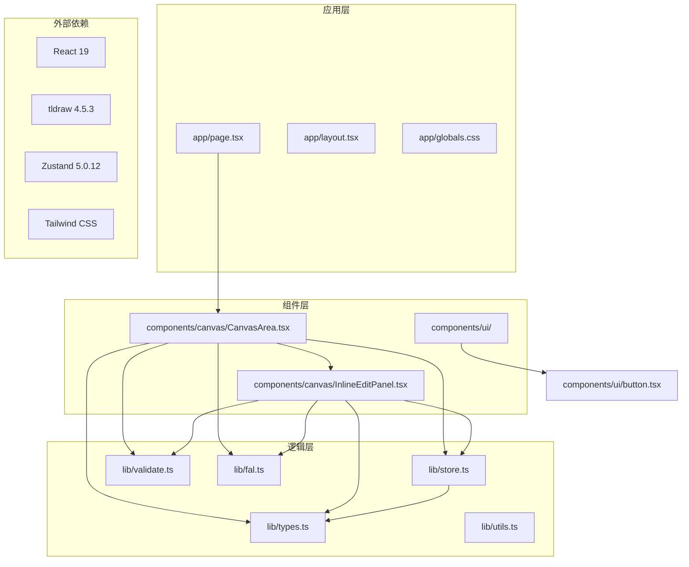
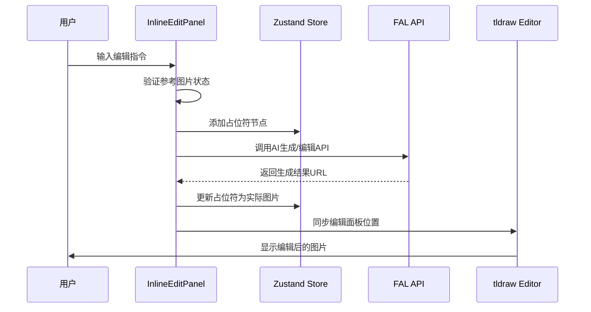
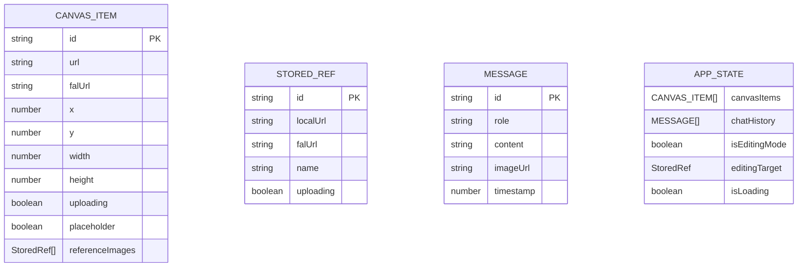
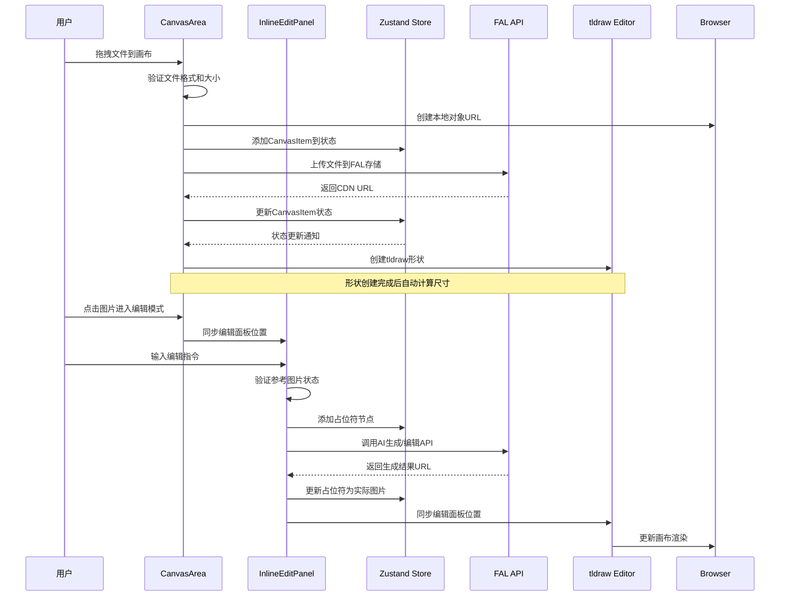
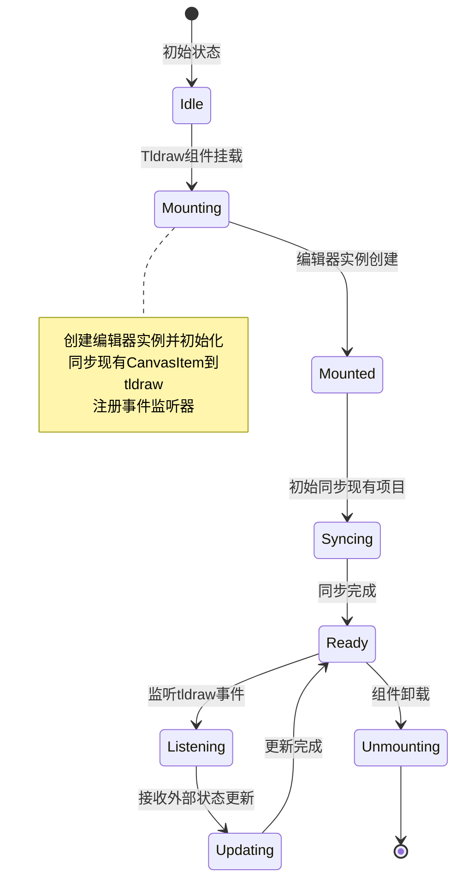
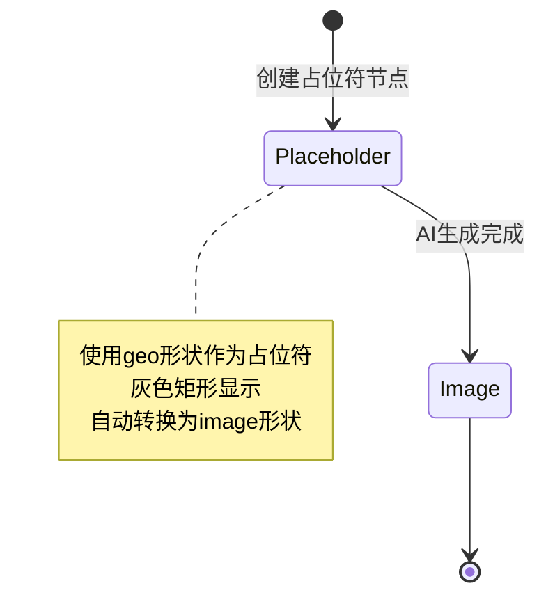
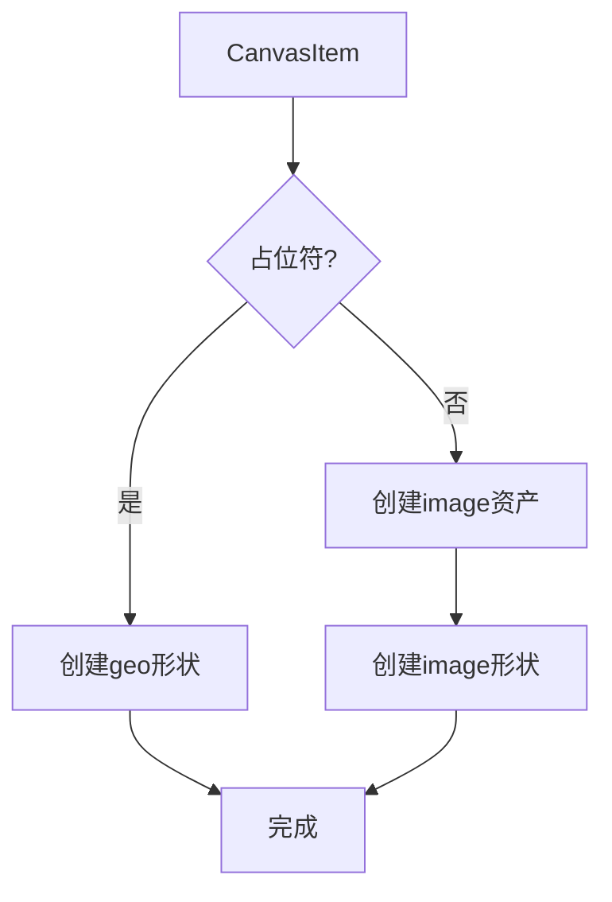
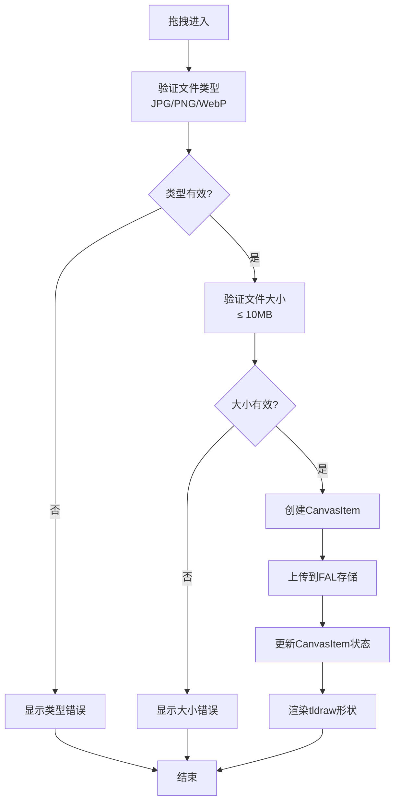
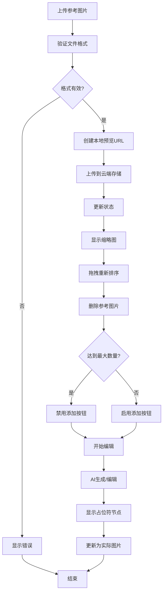
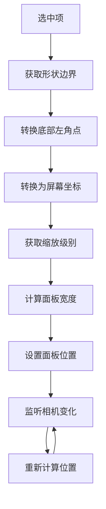

# 画布交互系统

<cite>
**本文档引用的文件**
- [CanvasArea.tsx](file://components/canvas/CanvasArea.tsx)
- [InlineEditPanel.tsx](file://components/canvas/InlineEditPanel.tsx)
- [types.ts](file://lib/types.ts)
- [store.ts](file://lib/store.ts)
- [validate.ts](file://lib/validate.ts)
- [fal.ts](file://lib/fal.ts)
- [page.tsx](file://app/page.tsx)
- [globals.css](file://app/globals.css)
- [button.tsx](file://components/ui/button.tsx)
</cite>

## 更新摘要
**变更内容**
- 完全迁移至 tldraw 画布系统，替换原有的 Konva 实现
- 新增 tldraw 编辑器集成和实时同步功能
- 实现 CanvasItem 与 tldraw 形状的双向 ID 映射机制
- 重构 InlineEditPanel 以支持 tldraw 画布的内联编辑功能
- 移除背景网格系统，采用 tldraw 原生网格背景
- 新增 tldraw 事件监听和状态同步机制

## 目录
1. [简介](#简介)
2. [项目结构](#项目结构)
3. [核心组件](#核心组件)
4. [架构概览](#架构概览)
5. [详细组件分析](#详细组件分析)
6. [依赖关系分析](#依赖关系分析)
7. [性能考虑](#性能考虑)
8. [故障排除指南](#故障排除指南)
9. [最佳实践](#最佳实践)
10. [结论](#结论)

## 简介

画布交互系统是一个基于 React 和 tldraw 2D 图形库构建的现代化图像编辑平台。该系统提供了丰富的交互功能，包括拖拽上传、选择编辑、实时同步和 AI 图像生成等核心特性。系统采用响应式设计，支持桌面端和移动端设备，并集成了 AI 图像生成和编辑功能。

**更新** 系统现已完全迁移至 tldraw 画布系统，这是一个重大的架构升级，提供了更强大的图形编辑能力和更好的用户体验。新的系统不再依赖于 Konva，而是直接使用 tldraw 的原生功能，包括实时同步、形状管理、选择控制等。

该系统的核心目标是为用户提供直观、流畅的图像编辑体验，通过可视化的方式让用户能够轻松地管理、编辑和导出图像内容。

## 项目结构

画布交互系统采用模块化的项目结构，主要分为以下几个核心部分：



**图表来源**
- [page.tsx:1-10](file://app/page.tsx#L1-L10)
- [CanvasArea.tsx:1-402](file://components/canvas/CanvasArea.tsx#L1-L402)
- [InlineEditPanel.tsx:1-402](file://components/canvas/InlineEditPanel.tsx#L1-L402)
- [store.ts:1-199](file://lib/store.ts#L1-L199)

**章节来源**
- [page.tsx:1-10](file://app/page.tsx#L1-L10)
- [globals.css:136-139](file://app/globals.css#L136-L139)

## 核心组件

### CanvasArea 主组件

CanvasArea 是整个画布系统的核心组件，负责管理 tldraw 画布的渲染、交互和状态管理。该组件实现了完整的画布功能，包括拖拽上传、实时同步、图片选择和编辑等特性。

**更新** 完全重构以支持 tldraw 画布系统，移除了原有的 Konva 实现。

#### 主要功能特性

1. **tldraw 编辑器集成**：使用 Tldraw 组件作为画布容器
2. **实时状态同步**：双向同步 CanvasItem 状态与 tldraw 形状
3. **拖拽上传**：支持文件拖拽到画布进行图片上传
4. **占位符节点管理**：AI 生成过程中的临时显示节点
5. **下载和清除功能**：支持单个或批量操作
6. **空状态显示**：无图片时的引导界面

#### 状态管理

组件内部维护了多个关键状态：
- `selectedShapeIds`: 当前选中的形状 ID 数组
- `isEditingMode`: 编辑模式状态
- `editingTarget`: 当前编辑目标
- `processedItemsRef`: 已处理项目的跟踪集合
- `syncingRef`: 同步状态防止无限循环
- `editor`: tldraw 编辑器实例

**章节来源**
- [CanvasArea.tsx:73-402](file://components/canvas/CanvasArea.tsx#L73-L402)

### InlineEditPanel 内联编辑面板

**更新** 重构以支持 tldraw 画布的内联编辑功能，完全适配新的编辑器架构。

#### 主要功能特性

1. **tldraw 集成**：与 tldraw 编辑器实时同步位置
2. **参考图片管理**：支持上传和管理最多6张参考图片
3. **实时图像生成**：基于 AI 模型的实时图像生成和编辑
4. **拖拽排序**：支持参考图片的拖拽重新排序
5. **占位符节点**：AI 生成过程中的临时显示节点
6. **自适应定位**：根据选中形状自动计算面板位置

#### 编辑工作流程



**图表来源**
- [InlineEditPanel.tsx:156-222](file://components/canvas/InlineEditPanel.tsx#L156-L222)
- [CanvasArea.tsx:244-260](file://components/canvas/CanvasArea.tsx#L244-L260)

**章节来源**
- [InlineEditPanel.tsx:20-402](file://components/canvas/InlineEditPanel.tsx#L20-L402)

### CanvasItem 数据模型

CanvasItem 是画布系统的核心数据结构，定义了画布上每个元素的完整信息：



**图表来源**
- [types.ts:17-37](file://lib/types.ts#L17-L37)

**更新** 新增了 `referenceImages` 字段，支持每张图片的独立参考图片管理。

#### 占位符节点 vs 实际图片节点

系统通过 `placeholder` 字段区分两种节点类型：

- **占位符节点**：用于 AI 生成过程中的临时显示，具有闪烁的渐变效果
- **实际图片节点**：用户上传的真实图片，支持完整的编辑和变换功能

**章节来源**
- [types.ts:17-28](file://lib/types.ts#L17-L28)

## 架构概览

画布交互系统采用分层架构设计，确保了良好的可维护性和扩展性：

```mermaid
graph TB
subgraph "表现层"
UI[React Components]
Canvas[CanvasArea]
InlineEdit[InlineEditPanel]
Controls[UI Controls]
end
subgraph "业务逻辑层"
Store[Zustand Store]
Validation[File Validation]
Upload[File Upload]
Edit[Image Edit]
Generate[Image Generate]
end
subgraph "数据层"
LocalStorage[Local Storage]
FAL_API[FAL AI API]
Browser[Browser APIs]
End
subgraph "图形渲染层"
Tldraw[tldraw 4.5.3]
Editor[Editor Instance]
Shapes[Image Shapes]
Assets[Image Assets]
Grid[Background Grid]
end
UI --> Store
Canvas --> Store
InlineEdit --> Store
Canvas --> Validation
Canvas --> Upload
InlineEdit --> Validation
InlineEdit --> Edit
InlineEdit --> Generate
Upload --> FAL_API
Edit --> FAL_API
Generate --> FAL_API
Canvas --> Grid
Canvas --> Tldraw
InlineEdit --> Canvas
Store --> LocalStorage
Browser --> Canvas
Browser --> InlineEdit
```

**图表来源**
- [CanvasArea.tsx:1-402](file://components/canvas/CanvasArea.tsx#L1-L402)
- [InlineEditPanel.tsx:1-402](file://components/canvas/InlineEditPanel.tsx#L1-L402)
- [store.ts:62-199](file://lib/store.ts#L62-L199)

### 交互流程

系统的关键交互流程包括拖拽上传、实时同步、图片选择和内联编辑等：



**图表来源**
- [CanvasArea.tsx:263-319](file://components/canvas/CanvasArea.tsx#L263-L319)
- [InlineEditPanel.tsx:156-222](file://components/canvas/InlineEditPanel.tsx#L156-L222)

## 详细组件分析

### tldraw 编辑器集成

**新增** CanvasArea 组件实现了与 tldraw 编辑器的深度集成：

#### 编辑器生命周期管理



**图表来源**
- [CanvasArea.tsx:95-159](file://components/canvas/CanvasArea.tsx#L95-L159)

#### 实时同步机制

系统实现了 CanvasItem 与 tldraw 形状的双向实时同步：

- **外部到内部**：tldraw 形状变化 → CanvasItem 状态更新
- **内部到外部**：CanvasItem 状态变化 → tldraw 形状更新
- **选择同步**：选中形状 → 编辑面板位置更新
- **删除同步**：删除形状 → CanvasItem 移除

**章节来源**
- [CanvasArea.tsx:109-159](file://components/canvas/CanvasArea.tsx#L109-L159)
- [store.ts:39-46](file://lib/store.ts#L39-L46)

### ID 映射机制

**新增** 实现了 CanvasItem ID 与 tldraw 形状 ID 的双向映射：

#### ID 映射规则

```mermaid
flowchart TD
CanvasItemID[CanvasItem.id] --> ShapeID[TLShapeId]
ShapeID --> CanvasItemID[CanvasItem.id]
CanvasItemID --> ShapeID2[shape:{id}]
ShapeID2 --> CanvasItemID2[{id}]
note right of CanvasItemID
canvasItemIdToShapeId()
shapeIdToCanvasItemId()
end note
```

**图表来源**
- [store.ts:39-46](file://lib/store.ts#L39-L46)

#### 映射函数实现

- `canvasItemIdToShapeId()`: 将 CanvasItem ID 转换为 tldraw 形状 ID
- `shapeIdToCanvasItemId()`: 将 tldraw 形状 ID 转换回 CanvasItem ID

**章节来源**
- [store.ts:39-46](file://lib/store.ts#L39-L46)

### 占位符节点管理

占位符节点用于显示 AI 生成过程中的临时状态，具有独特的视觉效果：

#### 占位符转换流程



**图表来源**
- [CanvasArea.tsx:17-69](file://components/canvas/CanvasArea.tsx#L17-L69)

#### 转换逻辑实现

- **创建占位符**：使用 geo 形状类型创建灰色矩形
- **检测转换时机**：当占位符变为非上传状态且有 URL 时
- **执行转换**：删除 geo 形状并创建对应的 image 形状

**章节来源**
- [CanvasArea.tsx:17-69](file://components/canvas/CanvasArea.tsx#L17-L69)

### CanvasItemNode 替代实现

**更新** 由于使用 tldraw，CanvasItemNode 的功能由 tldraw 的原生形状系统实现：

#### tldraw 形状创建



**图表来源**
- [CanvasArea.tsx:17-69](file://components/canvas/CanvasArea.tsx#L17-L69)

#### 形状类型选择

- **占位符节点**：使用 `geo` 形状类型，设置为灰色矩形
- **实际图片**：使用 `image` 形状类型，关联对应的图像资产

**章节来源**
- [CanvasArea.tsx:17-69](file://components/canvas/CanvasArea.tsx#L17-L69)

### 拖拽上传功能

拖拽上传功能提供了直观的文件导入方式：

#### 文件验证流程



**图表来源**
- [CanvasArea.tsx:263-319](file://components/canvas/CanvasArea.tsx#L263-L319)
- [validate.ts:9-13](file://lib/validate.ts#L9-L13)

#### 上传状态管理

- **本地预览**：使用 `URL.createObjectURL()` 创建临时预览
- **云端存储**：通过 FAL API 将文件上传到 CDN
- **状态同步**：实时更新上传进度和最终 URL

**章节来源**
- [CanvasArea.tsx:263-319](file://components/canvas/CanvasArea.tsx#L263-L319)

### 内联编辑面板功能

**更新** InlineEditPanel 完全重构以支持 tldraw 画布的内联编辑功能：

#### 参考图片管理系统



**图表来源**
- [InlineEditPanel.tsx:111-144](file://components/canvas/InlineEditPanel.tsx#L111-L144)
- [InlineEditPanel.tsx:156-222](file://components/canvas/InlineEditPanel.tsx#L156-L222)

#### 编辑工作流程

- **输入验证**：检查参考图片上传状态和输入内容
- **占位符管理**：在编辑区域右侧添加占位符节点
- **AI调用**：根据是否有目标图片决定生成或编辑模式
- **结果处理**：更新占位符为实际生成的图片

**章节来源**
- [InlineEditPanel.tsx:111-222](file://components/canvas/InlineEditPanel.tsx#L111-L222)

### 自适应定位系统

**新增** InlineEditPanel 实现了与 tldraw 编辑器的自适应定位：

#### 位置计算流程



**图表来源**
- [InlineEditPanel.tsx:64-108](file://components/canvas/InlineEditPanel.tsx#L64-L108)

#### 定位同步机制

- **边界获取**：使用 `getShapePageBounds()` 获取形状边界
- **坐标转换**：使用 `pageToScreen()` 转换为屏幕坐标
- **缩放适配**：根据缩放级别调整面板宽度
- **实时更新**：监听编辑器相机变化自动更新位置

**章节来源**
- [InlineEditPanel.tsx:64-108](file://components/canvas/InlineEditPanel.tsx#L64-L108)

## 依赖关系分析

画布交互系统的依赖关系体现了清晰的分层架构：

```mermaid
graph TB
subgraph "外部依赖"
React[react@19.2.4]
ReactDOM[react-dom@19.2.4]
Tldraw[tldraw@4.5.3]
ReactTldraw[react-tldraw@19.2.3]
Zustand[zustand@5.0.12]
Tailwind[tailwindcss@4]
Sonner[sonner@2.0.7]
Lucide[lucide-react@1.6.0]
Nanoid[nanoid@5.1.7]
FAL[@fal-ai/client@1.9.5]
end
subgraph "内部模块"
CanvasArea[components/canvas/CanvasArea.tsx]
InlineEditPanel[components/canvas/InlineEditPanel.tsx]
Store[lib/store.ts]
Types[lib/types.ts]
Validate[lib/validate.ts]
FAL_API[lib/fal.ts]
Button[components/ui/button.tsx]
end
CanvasArea --> React
CanvasArea --> Tldraw
CanvasArea --> Zustand
CanvasArea --> FAL
CanvasArea --> Validate
CanvasArea --> Types
InlineEditPanel --> React
InlineEditPanel --> Zustand
InlineEditPanel --> FAL
InlineEditPanel --> Validate
InlineEditPanel --> Types
Store --> Zustand
Store --> Types
Button --> React
Button --> Tailwind
FAL_API --> FAL
FAL_API --> Types
```

**图表来源**
- [package.json:11-29](file://package.json#L11-L29)
- [CanvasArea.tsx:3-14](file://components/canvas/CanvasArea.tsx#L3-L14)
- [InlineEditPanel.tsx:3-11](file://components/canvas/InlineEditPanel.tsx#L3-L11)
- [store.ts:1-4](file://lib/store.ts#L1-L4)

### 核心依赖分析

#### 状态管理依赖

Zustand 提供了轻量级的状态管理解决方案，相比 Redux 更加简洁易用：

- **持久化存储**：使用 `persist` 中间件实现本地存储
- **类型安全**：完整的 TypeScript 支持
- **动作分离**：清晰的动作定义和状态更新逻辑
- **多切片管理**：支持会话状态和持久化状态分离

#### tldraw 依赖分析

tldraw 作为新一代 2D 图形库，提供了丰富的功能：

- **实时协作**：内置的实时同步和协作功能
- **高性能渲染**：基于 Canvas API 的高效渲染
- **事件系统**：完整的形状和画布事件支持
- **资产管理系统**：内置的图像和媒体资产管理
- **网格背景**：支持自定义背景网格

**章节来源**
- [store.ts:62-199](file://lib/store.ts#L62-L199)
- [package.json:26](file://package.json#L26)

## 性能考虑

### 渲染性能优化

#### 批量更新优化

系统采用了多种批量更新技术来提升渲染性能：

- **同步状态控制**：使用 `syncingRef` 防止无限同步循环
- **处理项目跟踪**：使用 `processedItemsRef` 避免重复创建形状
- **条件渲染**：只在必要时重新渲染特定形状
- **事件监听优化**：合理使用 tldraw 事件监听器

#### 内存管理

- **URL 对象清理**：及时撤销 `createObjectURL()` 创建的临时 URL
- **编辑器实例管理**：组件卸载时正确清理编辑器资源
- **事件监听器清理**：组件卸载时移除所有事件监听器
- **引用图片清理**：CanvasItem移除时清理所有关联的引用图片URL

### 交互性能优化

#### 事件处理优化

- **防抖处理**：tldraw 事件监听使用节流避免频繁触发
- **事件委托**：合理使用事件委托减少监听器数量
- **选择同步优化**：选中状态变化时避免不必要的面板更新
- **拖拽优化**：拖拽过程中避免不必要的状态更新

#### 图片处理优化

- **异步加载**：图片加载使用异步方式避免阻塞主线程
- **自动尺寸计算**：首次加载时计算合适的显示尺寸
- **跨域处理**：正确设置 `crossOrigin` 属性避免安全问题
- **占位符优化**：占位符节点使用高效的渐变动画

#### 内联编辑性能

- **占位符节点**：AI生成过程中的临时节点，避免复杂渲染
- **面板同步**：编辑面板位置与图片位置实时同步
- **拖拽优化**：拖拽过程中只更新面板位置，不重新渲染整个画布
- **自适应定位**：面板位置计算使用 tldraw 原生方法

**章节来源**
- [CanvasArea.tsx:90-94](file://components/canvas/CanvasArea.tsx#L90-L94)
- [CanvasArea.tsx:162-241](file://components/canvas/CanvasArea.tsx#L162-L241)
- [InlineEditPanel.tsx:111-144](file://components/canvas/InlineEditPanel.tsx#L111-L144)

## 故障排除指南

### 常见问题及解决方案

#### tldraw 编辑器无法加载

**问题症状**：页面空白或编辑器不显示

**可能原因**：
1. tldraw 依赖未正确安装
2. 编辑器实例创建失败
3. 样式文件加载问题
4. 浏览器兼容性问题

**解决方案**：
- 确认 `tldraw` 依赖版本正确
- 检查 `onMount` 回调是否正确执行
- 验证 tldraw CSS 文件是否正确引入
- 测试不同浏览器的兼容性

#### 形状同步异常

**问题症状**：CanvasItem 状态更新但 tldraw 形状不变化

**可能原因**：
1. ID 映射机制异常
2. 同步状态控制失效
3. 编辑器实例未正确初始化
4. 形状类型转换失败

**解决方案**：
- 检查 `canvasItemIdToShapeId()` 函数
- 验证 `syncingRef` 状态
- 确认编辑器实例存在
- 验证形状类型和属性

#### 占位符节点转换失败

**问题症状**：占位符节点无法转换为实际图片

**可能原因**：
1. 占位符状态未正确更新
2. URL 未正确设置
3. 同步状态控制失效
4. 形状删除和创建顺序错误

**解决方案**：
- 检查 CanvasItem 的 `placeholder` 状态
- 验证 `falUrl` 是否正确设置
- 确认同步状态控制逻辑
- 验证形状删除和创建的顺序

#### 内联编辑面板定位错误

**问题症状**：编辑面板位置与选中图片不匹配

**可能原因**：
1. 选中形状边界获取失败
2. 坐标转换函数调用错误
3. 缩放级别计算错误
4. 相机变化监听失效

**解决方案**：
- 检查 `getShapePageBounds()` 调用
- 验证 `pageToScreen()` 函数使用
- 确认缩放级别获取
- 重新注册相机变化监听

### 调试技巧

#### 开发者工具使用

- **React DevTools**：监控组件状态变化
- **tldraw Inspector**：调试图形元素和事件
- **Network Monitor**：跟踪文件上传和 API 请求
- **Console Logging**：添加关键操作的日志输出

#### 日志记录

系统使用 `sonner` 库提供友好的用户反馈：

- **成功操作**：显示确认消息
- **错误处理**：显示错误提示
- **进度反馈**：显示上传进度
- **编辑状态**：显示编辑模式切换

**章节来源**
- [CanvasArea.tsx:310-317](file://components/canvas/CanvasArea.tsx#L310-L317)
- [InlineEditPanel.tsx:156-162](file://components/canvas/InlineEditPanel.tsx#L156-L162)

## 最佳实践

### 代码组织最佳实践

#### 组件拆分原则

1. **单一职责**：每个组件只负责一个特定功能
2. **可复用性**：组件设计应考虑通用性
3. **清晰接口**：明确的 props 和回调定义
4. **状态封装**：内部状态与外部状态分离

#### 状态管理最佳实践

- **局部状态优先**：只在需要共享的地方使用全局状态
- **状态最小化**：避免存储冗余状态
- **不可变更新**：使用不可变更新模式
- **状态切片**：合理划分持久化和会话状态

### 性能优化最佳实践

#### 渲染优化

- **虚拟化长列表**：对于大量元素使用虚拟化技术
- **懒加载**：按需加载和渲染组件
- **缓存策略**：合理使用缓存减少重复计算
- **批量更新**：合并多个状态更新操作

#### 事件处理优化

- **事件防抖**：对高频事件使用防抖处理
- **节流控制**：限制事件处理频率
- **内存泄漏防护**：及时清理事件监听器
- **原生事件优化**：在必要时使用原生事件

#### 图像处理优化

- **异步加载**：图片加载使用异步方式
- **自动尺寸计算**：首次加载时计算合适的显示尺寸
- **跨域处理**：正确设置 `crossOrigin` 属性
- **URL清理**：及时撤销临时URL对象

### 用户体验最佳实践

#### 交互设计

- **即时反馈**：用户操作应有即时的视觉反馈
- **一致性**：保持交互模式的一致性
- **可预测性**：用户应该能够预测操作结果
- **无障碍访问**：支持键盘导航和屏幕阅读器

#### 错误处理

- **优雅降级**：在错误情况下提供替代方案
- **清晰提示**：错误信息应该清晰易懂
- **恢复机制**：提供错误恢复的可能性
- **用户引导**：提供操作指导和帮助信息

#### 性能优化

- **渐进式加载**：先显示基本功能，再加载高级功能
- **预加载策略**：预测用户行为提前加载资源
- **离线支持**：提供基本功能的离线使用
- **性能监控**：持续监控和优化性能指标

## 结论

画布交互系统是一个功能完整、性能优异的现代图像编辑平台。通过精心设计的架构和实现，系统成功地结合了强大的 tldraw 图形编辑能力、流畅的用户交互体验和可靠的 AI 集成。

**更新** 系统现已完全迁移至 tldraw 画布系统，这是一个重大的架构升级，提供了更强大的图形编辑能力和更好的用户体验。新的系统不再依赖于 Konva，而是直接使用 tldraw 的原生功能，包括实时同步、形状管理、选择控制等。

### 系统优势

1. **技术栈先进**：采用最新的 React 19、tldraw 4.5.3 和 TypeScript 技术
2. **用户体验优秀**：提供直观、流畅的交互体验
3. **性能优化到位**：通过多种技术手段确保系统性能
4. **可扩展性强**：模块化设计便于功能扩展和维护
5. **专业图像编辑**：专注于图像编辑领域的完整解决方案
6. **实时协作支持**：tldraw 原生的实时协作功能
7. **资产管理系统**：内置的图像和媒体资产管理
8. **网格背景支持**：tldraw 原生的网格背景功能

### 技术亮点

- **实时同步机制**：CanvasItem 与 tldraw 形状的双向实时同步
- **ID 映射系统**：CanvasItem ID 与 tldraw 形状 ID 的双向映射
- **占位符转换**：AI 生成过程中的智能节点转换
- **自适应定位**：编辑面板与选中形状的自动定位
- **拖拽上传**：直观的文件导入体验
- **内联编辑**：实时的图像编辑和生成功能
- **参考图片管理**：支持多张参考图片的管理和编辑

### 发展方向

未来可以考虑的功能扩展包括：
- 多图层支持和图层管理
- 更丰富的图片编辑工具
- 云端协作功能
- 更多的 AI 生成选项
- 导出和分享功能
- 插件系统支持
- 更强大的实时协作功能

该系统为图像编辑领域提供了一个优秀的技术基础，为后续的功能扩展和性能优化奠定了坚实的基础。