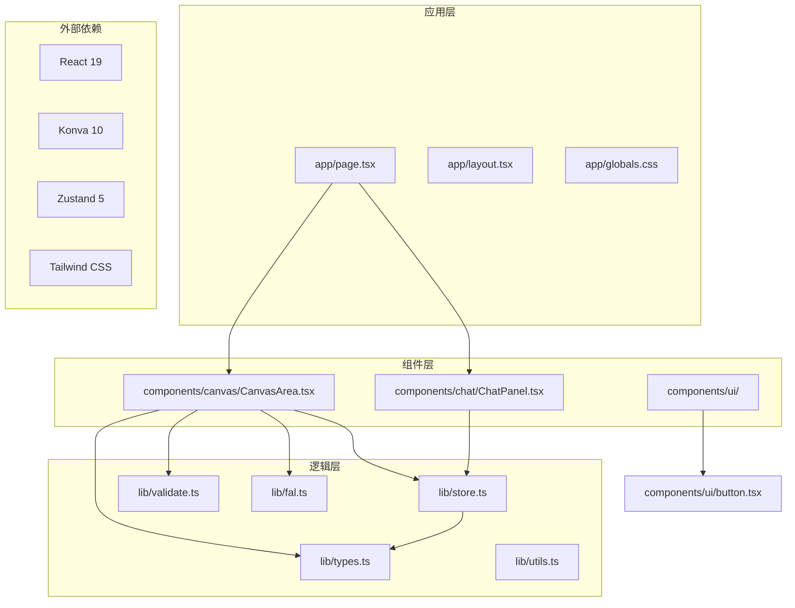
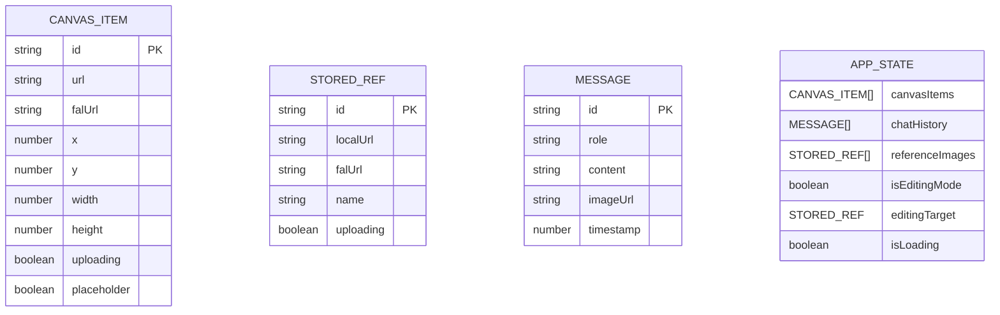
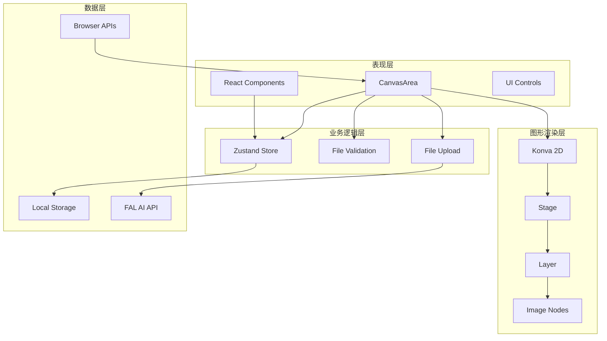
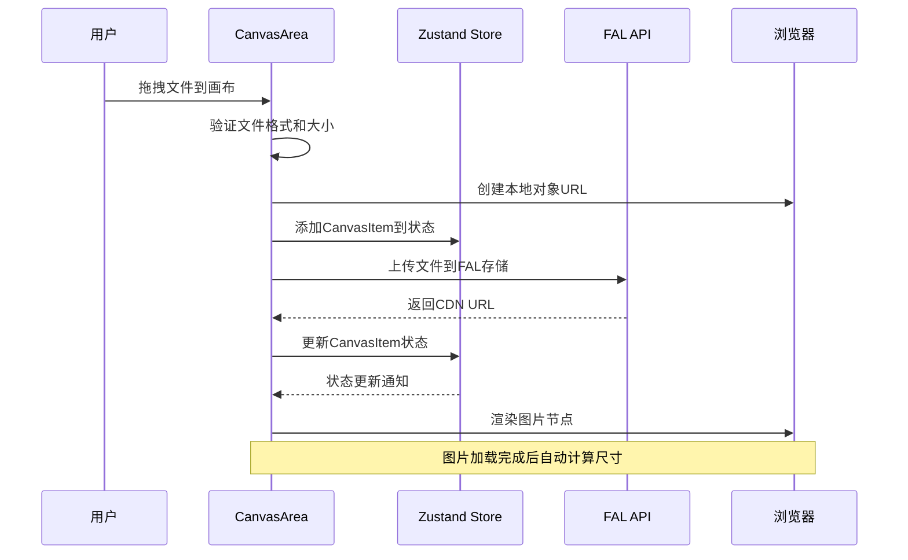
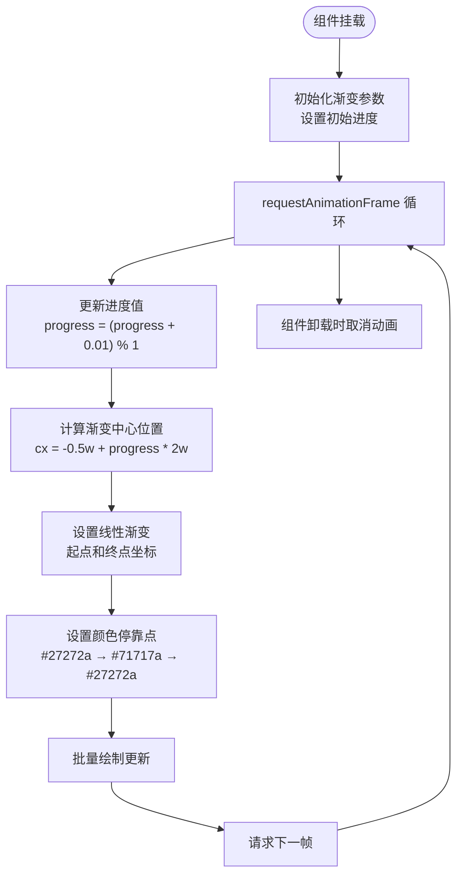
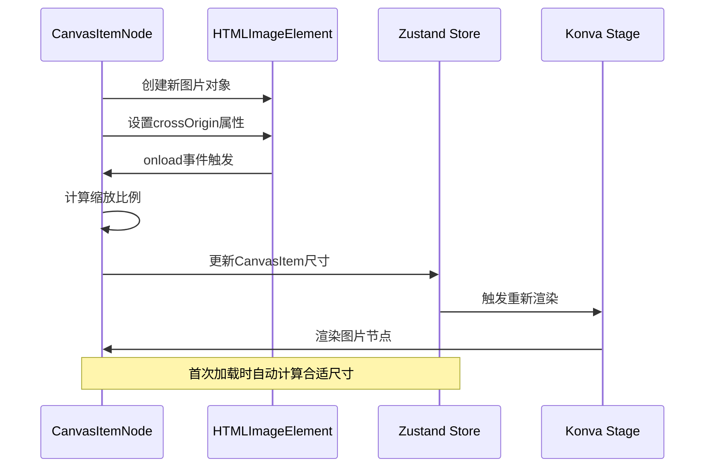
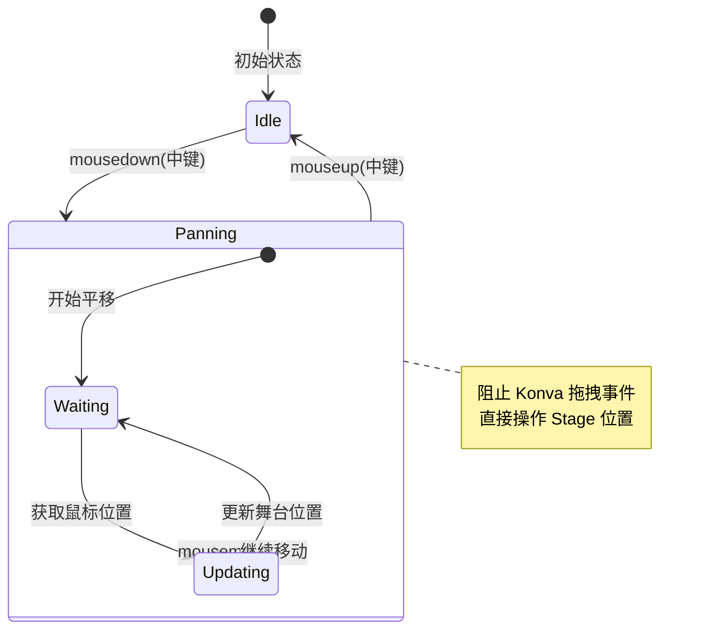
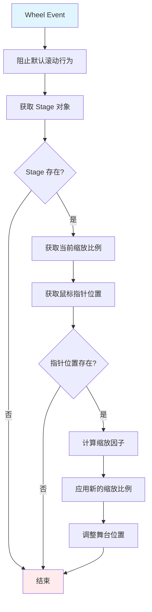
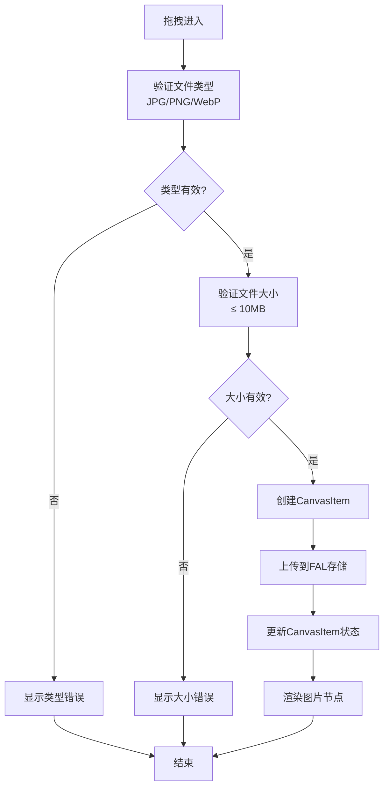

# 画布交互系统

<cite>
**本文档引用的文件**
- [CanvasArea.tsx](file://components/canvas/CanvasArea.tsx)
- [types.ts](file://lib/types.ts)
- [store.ts](file://lib/store.ts)
- [validate.ts](file://lib/validate.ts)
- [fal.ts](file://lib/fal.ts)
- [page.tsx](file://app/page.tsx)
- [globals.css](file://app/globals.css)
- [button.tsx](file://components/ui/button.tsx)
- [ReferenceUploader.tsx](file://components/chat/ReferenceUploader.tsx)
</cite>

## 目录
1. [简介](#简介)
2. [项目结构](#项目结构)
3. [核心组件](#核心组件)
4. [架构概览](#架构概览)
5. [详细组件分析](#详细组件分析)
6. [依赖关系分析](#依赖关系分析)
7. [性能考虑](#性能考虑)
8. [故障排除指南](#故障排除指南)
9. [最佳实践](#最佳实践)
10. [结论](#结论)

## 简介

画布交互系统是一个基于 React 和 Konva 2D 图形库构建的现代化图像编辑平台。该系统提供了丰富的交互功能，包括拖拽上传、中间鼠标按键平移、滚轮缩放、图片选择和变换等核心特性。系统采用响应式设计，支持桌面端和移动端设备，并集成了 AI 图像生成和编辑功能。

该系统的核心目标是为用户提供直观、流畅的图像编辑体验，通过可视化的方式让用户能够轻松地管理、编辑和导出图像内容。

## 项目结构

画布交互系统采用模块化的项目结构，主要分为以下几个核心部分：



**图表来源**
- [page.tsx:1-59](file://app/page.tsx#L1-L59)
- [CanvasArea.tsx:1-431](file://components/canvas/CanvasArea.tsx#L1-L431)
- [store.ts:1-119](file://lib/store.ts#L1-L119)

**章节来源**
- [page.tsx:1-59](file://app/page.tsx#L1-L59)
- [globals.css:1-128](file://app/globals.css#L1-L128)

## 核心组件

### CanvasArea 主组件

CanvasArea 是整个画布系统的核心组件，负责管理画布的渲染、交互和状态管理。该组件实现了完整的画布功能，包括拖拽上传、平移缩放、图片选择和变换等特性。

#### 主要功能特性

1. **响应式尺寸调整**：使用 ResizeObserver 监听容器尺寸变化，动态调整画布大小
2. **中间鼠标按键平移**：支持中键拖拽进行画布平移操作
3. **滚轮缩放**：实现以鼠标指针为中心的缩放功能
4. **拖拽上传**：支持文件拖拽到画布进行图片上传
5. **图片选择和变换**：提供选中状态管理和变换控制

#### 状态管理

组件内部维护了多个关键状态：
- `selectedId`: 当前选中的图片 ID
- `isDraggingFile`: 拖拽状态标识
- `size`: 画布当前尺寸
- `midPanRef`: 中键平移状态
- `canvasItems`: 画布上的所有项目

**章节来源**
- [CanvasArea.tsx:163-431](file://components/canvas/CanvasArea.tsx#L163-L431)

### CanvasItem 数据模型

CanvasItem 是画布系统的核心数据结构，定义了画布上每个元素的完整信息：



**图表来源**
- [types.ts:17-37](file://lib/types.ts#L17-L37)

#### 占位符节点 vs 实际图片节点

系统通过 `placeholder` 字段区分两种节点类型：

- **占位符节点**：用于 AI 生成过程中的临时显示，具有闪烁的渐变效果
- **实际图片节点**：用户上传的真实图片，支持完整的编辑和变换功能

**章节来源**
- [types.ts:17-27](file://lib/types.ts#L17-L27)

## 架构概览

画布交互系统采用分层架构设计，确保了良好的可维护性和扩展性：



**图表来源**
- [CanvasArea.tsx:1-431](file://components/canvas/CanvasArea.tsx#L1-L431)
- [store.ts:45-119](file://lib/store.ts#L45-L119)

### 交互流程

系统的关键交互流程包括拖拽上传、平移缩放和图片选择等：



**图表来源**
- [CanvasArea.tsx:294-340](file://components/canvas/CanvasArea.tsx#L294-L340)
- [validate.ts:9-13](file://lib/validate.ts#L9-L13)
- [fal.ts:59-61](file://lib/fal.ts#L59-L61)

## 详细组件分析

### PlaceholderNode 占位符节点

占位符节点用于显示 AI 生成过程中的临时状态，具有独特的视觉效果：

#### 渐变动画实现



**图表来源**
- [CanvasArea.tsx:17-67](file://components/canvas/CanvasArea.tsx#L17-L67)

#### 性能优化策略

- 使用 `requestAnimationFrame` 进行高效的动画渲染
- 通过 `batchDraw()` 减少不必要的重绘操作
- 动画循环在组件卸载时自动清理

**章节来源**
- [CanvasArea.tsx:17-67](file://components/canvas/CanvasArea.tsx#L17-L67)

### CanvasItemNode 图片节点

CanvasItemNode 负责渲染和管理实际的图片节点，提供完整的编辑功能：

#### 图片加载和尺寸处理



**图表来源**
- [CanvasArea.tsx:80-102](file://components/canvas/CanvasArea.tsx#L80-L102)

#### 变换控制实现

CanvasItemNode 集成了 Konva 的 Transformer 组件，提供以下变换功能：

- **拖拽移动**：支持图片的自由拖拽
- **等比缩放**：保持宽高比的缩放操作
- **选中状态**：通过边框和锚点显示选中状态

**章节来源**
- [CanvasArea.tsx:71-159](file://components/canvas/CanvasArea.tsx#L71-L159)

### 中间鼠标按键平移

系统实现了原生的中键平移功能，绕过 Konva 的事件系统：

#### 平移状态管理



**图表来源**
- [CanvasArea.tsx:203-236](file://components/canvas/CanvasArea.tsx#L203-L236)

#### 事件处理机制

- 使用原生 `mousedown`、`mousemove`、`mouseup` 事件
- 通过 `stageRef.current` 直接修改舞台位置
- 避免与 Konva 的拖拽事件冲突

**章节来源**
- [CanvasArea.tsx:181-236](file://components/canvas/CanvasArea.tsx#L181-L236)

### 滚轮缩放功能

滚轮缩放功能实现了以鼠标指针为中心的精确缩放：

#### 缩放算法实现



**图表来源**
- [CanvasArea.tsx:238-251](file://components/canvas/CanvasArea.tsx#L238-L251)

#### 缩放约束

- 最小缩放：0.05x（约 5%）
- 最大缩放：10x（1000%）
- 缩放步进：1.08 倍（约 8%）

**章节来源**
- [CanvasArea.tsx:238-251](file://components/canvas/CanvasArea.tsx#L238-L251)

### 拖拽上传功能

拖拽上传功能提供了直观的文件导入方式：

#### 文件验证流程



**图表来源**
- [CanvasArea.tsx:294-340](file://components/canvas/CanvasArea.tsx#L294-L340)
- [validate.ts:9-13](file://lib/validate.ts#L9-L13)

#### 上传状态管理

- **本地预览**：使用 `URL.createObjectURL()` 创建临时预览
- **云端存储**：通过 FAL API 将文件上传到 CDN
- **状态同步**：实时更新上传进度和最终 URL

**章节来源**
- [CanvasArea.tsx:294-340](file://components/canvas/CanvasArea.tsx#L294-L340)

## 依赖关系分析

画布交互系统的依赖关系体现了清晰的分层架构：

```mermaid
graph TB
subgraph "外部依赖"
React[react@19.2.4]
ReactDOM[react-dom@19.2.4]
Konva[konva@10.2.3]
ReactKonva[react-konva@19.2.3]
Zustand[zustand@5.0.12]
Tailwind[tailwindcss@4]
Sonner[sonner@2.0.7]
Lucide[lucide-react@1.6.0]
Nanoid[nanoid@5.1.7]
FAL[@fal-ai/client@1.9.5]
end
subgraph "内部模块"
CanvasArea[components/canvas/CanvasArea.tsx]
Store[lib/store.ts]
Types[lib/types.ts]
Validate[lib/validate.ts]
FAL_API[lib/fal.ts]
Button[components/ui/button.tsx]
end
CanvasArea --> React
CanvasArea --> ReactKonva
CanvasArea --> Konva
CanvasArea --> Zustand
CanvasArea --> FAL
CanvasArea --> Validate
CanvasArea --> Types
Store --> Zustand
Store --> Types
Button --> React
Button --> Tailwind
FAL_API --> FAL
FAL_API --> Types
```

**图表来源**
- [package.json:11-29](file://package.json#L11-L29)
- [CanvasArea.tsx:3-13](file://components/canvas/CanvasArea.tsx#L3-L13)
- [store.ts:1-3](file://lib/store.ts#L1-L3)

### 核心依赖分析

#### 状态管理依赖

Zustand 提供了轻量级的状态管理解决方案，相比 Redux 更加简洁易用：

- **持久化存储**：使用 `persist` 中间件实现本地存储
- **类型安全**：完整的 TypeScript 支持
- **动作分离**：清晰的动作定义和状态更新逻辑

#### 图形渲染依赖

Konva 作为 2D 图形库，提供了丰富的功能：

- **高性能渲染**：基于 Canvas API 的高效渲染
- **事件系统**：完整的鼠标和触摸事件支持
- **变换能力**：内置的缩放、旋转、拖拽等功能

**章节来源**
- [store.ts:45-119](file://lib/store.ts#L45-L119)
- [package.json:18-24](file://package.json#L18-L24)

## 性能考虑

### 渲染性能优化

#### 批量绘制优化

系统采用了多种批量绘制技术来提升渲染性能：

- **batchDraw() 调用**：在动画循环中使用批量绘制减少重绘次数
- **条件渲染**：只在必要时重新渲染特定节点
- **尺寸缓存**：避免重复计算元素尺寸

#### 内存管理

- **URL 对象清理**：及时撤销 `createObjectURL()` 创建的临时 URL
- **动画资源清理**：组件卸载时取消 `requestAnimationFrame` 回调
- **事件监听器清理**：组件卸载时移除所有事件监听器

### 交互性能优化

#### 事件处理优化

- **防抖处理**：ResizeObserver 使用节流避免频繁触发
- **事件委托**：合理使用事件委托减少监听器数量
- **原生事件优先**：中键平移使用原生事件绕过 Konva 事件系统

#### 图片处理优化

- **异步加载**：图片加载使用异步方式避免阻塞主线程
- **自动尺寸计算**：首次加载时计算合适的显示尺寸
- **跨域处理**：正确设置 `crossOrigin` 属性避免安全问题

**章节来源**
- [CanvasArea.tsx:22-53](file://components/canvas/CanvasArea.tsx#L22-L53)
- [CanvasArea.tsx:85-102](file://components/canvas/CanvasArea.tsx#L85-L102)

## 故障排除指南

### 常见问题及解决方案

#### 图片无法显示

**问题症状**：图片节点显示为占位符但不显示实际图片

**可能原因**：
1. CORS 问题导致图片加载失败
2. 图片 URL 已过期或失效
3. 浏览器安全策略限制

**解决方案**：
- 检查图片 URL 的有效性
- 确认服务器的 CORS 配置
- 重新上传图片文件

#### 缩放功能异常

**问题症状**：滚轮缩放不生效或缩放方向相反

**可能原因**：
1. 事件监听器未正确绑定
2. Stage 对象未正确初始化
3. 浏览器兼容性问题

**解决方案**：
- 检查 `stageRef` 是否正确初始化
- 确认 `handleWheel` 函数是否被正确绑定
- 测试不同浏览器的兼容性

#### 拖拽上传失败

**问题症状**：拖拽文件后无响应或出现错误提示

**可能原因**：
1. 文件格式不支持
2. 文件大小超出限制
3. FAL API 上传失败

**解决方案**：
- 验证文件格式为 JPG/PNG/WebP
- 检查文件大小是否小于 10MB
- 确认网络连接和 API 密钥配置

### 调试技巧

#### 开发者工具使用

- **React DevTools**：监控组件状态变化
- **Konva Inspector**：调试图形元素和事件
- **Network Monitor**：跟踪文件上传和 API 请求

#### 日志记录

系统使用 `sonner` 库提供友好的用户反馈：

- **成功操作**：显示确认消息
- **错误处理**：显示错误提示
- **进度反馈**：显示上传进度

**章节来源**
- [CanvasArea.tsx:331-337](file://components/canvas/CanvasArea.tsx#L331-L337)

## 最佳实践

### 代码组织最佳实践

#### 组件拆分原则

1. **单一职责**：每个组件只负责一个特定功能
2. **可复用性**：组件设计应考虑通用性
3. **清晰接口**：明确的 props 和回调定义

#### 状态管理最佳实践

- **局部状态优先**：只在需要共享的地方使用全局状态
- **状态最小化**：避免存储冗余状态
- **不可变更新**：使用不可变更新模式

### 性能优化最佳实践

#### 渲染优化

- **虚拟化长列表**：对于大量元素使用虚拟化技术
- **懒加载**：按需加载和渲染组件
- **缓存策略**：合理使用缓存减少重复计算

#### 事件处理优化

- **事件防抖**：对高频事件使用防抖处理
- **节流控制**：限制事件处理频率
- **内存泄漏防护**：及时清理事件监听器

### 用户体验最佳实践

#### 交互设计

- **即时反馈**：用户操作应有即时的视觉反馈
- **一致性**：保持交互模式的一致性
- **可预测性**：用户应该能够预测操作结果

#### 错误处理

- **优雅降级**：在错误情况下提供替代方案
- **清晰提示**：错误信息应该清晰易懂
- **恢复机制**：提供错误恢复的可能性

## 结论

画布交互系统是一个功能完整、性能优异的现代图像编辑平台。通过精心设计的架构和实现，系统成功地结合了强大的图形渲染能力、流畅的用户交互体验和可靠的 AI 集成。

### 系统优势

1. **技术栈先进**：采用最新的 React 19、Konva 10 和 TypeScript 技术
2. **用户体验优秀**：提供直观、流畅的交互体验
3. **性能优化到位**：通过多种技术手段确保系统性能
4. **可扩展性强**：模块化设计便于功能扩展和维护

### 技术亮点

- **原生事件集成**：中键平移绕过 Konva 事件系统，提供更流畅的体验
- **智能尺寸计算**：自动计算合适的图片显示尺寸
- **渐进式增强**：从占位符到完整图片的渐进式加载体验
- **响应式设计**：适配桌面端和移动端的不同需求

### 发展方向

未来可以考虑的功能扩展包括：
- 多图层支持和图层管理
- 更丰富的图片编辑工具
- 云端协作功能
- 更多的 AI 生成选项

该系统为图像编辑领域提供了一个优秀的技术基础，为后续的功能扩展和性能优化奠定了坚实的基础。