# 画布交互系统

<cite>
**本文档引用的文件**
- [CanvasArea.tsx](file://components/canvas/CanvasArea.tsx)
- [InlineEditPanel.tsx](file://components/canvas/InlineEditPanel.tsx)
- [Toolbar.tsx](file://components/canvas/Toolbar.tsx)
- [TopBar.tsx](file://components/canvas/TopBar.tsx)
- [types.ts](file://lib/types.ts)
- [store.ts](file://lib/store.ts)
- [validate.ts](file://lib/validate.ts)
- [fal.ts](file://lib/fal.ts)
- [page.tsx](file://app/page.tsx)
- [globals.css](file://app/globals.css)
- [button.tsx](file://components/ui/button.tsx)
- [package.json](file://package.json)
</cite>

## 更新摘要
**变更内容**
- 新增完整的Toolbar组件，提供高级画布操作功能
- CanvasArea组件新增注释覆盖层系统，支持实时图像尺寸显示和文件名标注
- 实现标记系统，允许用户在画布项目上放置视觉标记
- 新增Marker数据模型和完整的标记管理功能
- 增强背景颜色选择功能，支持HSV色彩空间
- 新增缩放控制和网格切换功能
- **新增** CanvasArea组件中集成Tldraw许可证支持，通过licenseKey属性启用高级功能
- **更新** InlineEditPanel组件重大改进：支持新的图像元数据返回类型，增强图像尺寸管理和显示缩放，更新错误处理机制

## 目录
1. [简介](#简介)
2. [项目结构](#项目结构)
3. [核心组件](#核心组件)
4. [架构概览](#架构概览)
5. [详细组件分析](#详细组件分析)
6. [依赖关系分析](#依赖关系分析)
7. [性能考虑](#性能考虑)
8. [故障排除指南](#故障排除指南)
9. [最佳实践](#最佳实践)
10. [结论](#结论)

## 简介

画布交互系统是一个基于 React 和 tldraw 2D 图形库构建的现代化图像编辑平台。该系统提供了丰富的交互功能，包括拖拽上传、选择编辑、实时同步和 AI 图像生成等核心特性。系统采用响应式设计，支持桌面端和移动端设备，并集成了 AI 图像生成和编辑功能。

**更新** 系统现已完全迁移至 tldraw 画布系统，这是一个重大的架构升级，提供了更强大的图形编辑能力和更好的用户体验。新的系统不再依赖于 Konva，而是直接使用 tldraw 的原生功能，包括实时同步、形状管理、选择控制等。

**新增** 系统现在包含完整的工具栏功能，提供高级画布操作能力，包括背景颜色选择、缩放控制、网格切换等。CanvasArea组件还新增了注释覆盖层系统，支持实时显示图像尺寸和文件名标注，以及标记系统，允许用户在画布项目上放置视觉标记。

**新增** CanvasArea组件现已集成 Tldraw 许可证支持，通过 `licenseKey` 属性启用高级功能。该许可证支持确保系统能够正确使用 tldraw 的高级功能，包括实时协作、高级形状工具和专业版特性。

**更新** InlineEditPanel 组件经过重大改进，现在能够处理新的图像元数据返回类型，支持更精确的图像尺寸管理和显示缩放。组件实现了智能的尺寸检测和缩放算法，能够在生成图像时直接获取原始尺寸信息，从而提供更准确的显示效果。

该系统的核心目标是为用户提供直观、流畅的图像编辑体验，通过可视化的方式让用户能够轻松地管理、编辑和导出图像内容。

## 项目结构

画布交互系统采用模块化的项目结构，主要分为以下几个核心部分：

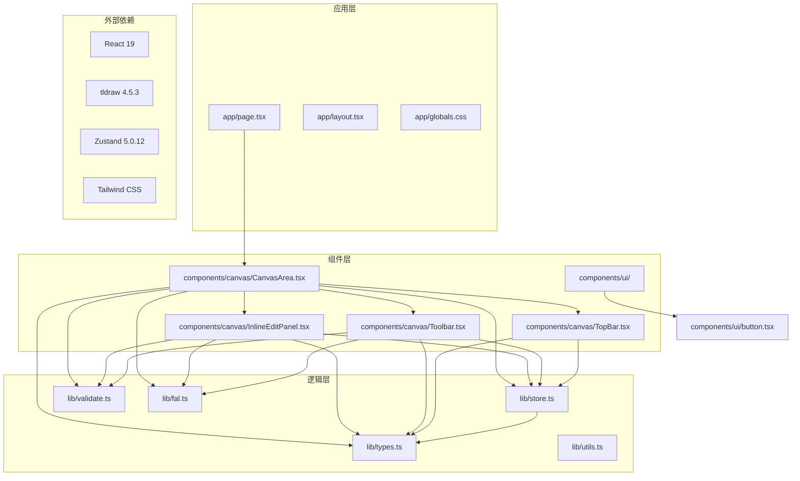

**图表来源**
- [page.tsx:1-10](file://app/page.tsx#L1-L10)
- [CanvasArea.tsx:1-1624](file://components/canvas/CanvasArea.tsx#L1-L1624)
- [InlineEditPanel.tsx:1-466](file://components/canvas/InlineEditPanel.tsx#L1-L466)
- [Toolbar.tsx:1-668](file://components/canvas/Toolbar.tsx#L1-L668)
- [TopBar.tsx:1-222](file://components/canvas/TopBar.tsx#L1-L222)
- [store.ts:1-385](file://lib/store.ts#L1-L385)

**章节来源**
- [page.tsx:1-10](file://app/page.tsx#L1-L10)
- [globals.css:136-139](file://app/globals.css#L136-L139)

## 核心组件

### CanvasArea 主组件

CanvasArea 是整个画布系统的核心组件，负责管理 tldraw 画布的渲染、交互和状态管理。该组件实现了完整的画布功能，包括拖拽上传、实时同步、图片选择和编辑等特性。

**更新** 完全重构以支持 tldraw 画布系统，移除了原有的 Konva 实现。

**新增** 新增注释覆盖层系统，支持实时图像尺寸显示和文件名标注；实现标记系统，允许用户在画布项目上放置视觉标记；**新增** 集成 Tldraw 许可证支持，通过 `licenseKey` 属性启用高级功能。

#### 主要功能特性

1. **tldraw 编辑器集成**：使用 Tldraw 组件作为画布容器
2. **实时状态同步**：双向同步 CanvasItem 状态与 tldraw 形状
3. **拖拽上传**：支持文件拖拽到画布进行图片上传
4. **占位符节点管理**：AI 生成过程中的临时显示节点
5. **下载和清除功能**：支持单个或批量操作
6. **空状态显示**：无图片时的引导界面
7. **注释覆盖层**：实时显示图像尺寸和文件名标注
8. **标记系统**：用户可在画布项目上放置视觉标记
9. **背景颜色管理**：支持 HSV 色彩空间的背景颜色选择
10. **缩放控制**：提供完整的缩放控制功能
11. **许可证支持**：通过 `licenseKey` 属性启用高级功能

#### 状态管理

组件内部维护了多个关键状态：
- `selectedShapeIds`: 当前选中的形状 ID 数组
- `isEditingMode`: 编辑模式状态
- `editingTarget`: 当前编辑目标
- `processedItemsRef`: 已处理项目的跟踪集合
- `syncingRef`: 同步状态防止无限循环
- `editor`: tldraw 编辑器实例
- `markers`: 标记数组，支持最多8个标记
- `bgColor`: 背景颜色状态
- `zoomLevel`: 缩放级别状态

**章节来源**
- [CanvasArea.tsx:584-1624](file://components/canvas/CanvasArea.tsx#L584-L1624)

### Toolbar 工具栏组件

**新增** Toolbar 组件提供了完整的画布操作功能，包括背景颜色选择、缩放控制、网格切换等高级功能。

#### 主要功能特性

1. **工具选择**：支持选择、标记、上传、框架、形状、画笔、文本等多种工具
2. **背景颜色选择**：使用 HSV 色彩空间提供精确的颜色选择
3. **缩放控制**：提供缩放级别控制和缩放菜单
4. **网格切换**：支持网格显示的开启和关闭
5. **快捷键支持**：支持键盘快捷键操作
6. **悬停菜单**：提供工具的子菜单和设置选项

#### 工具栏布局

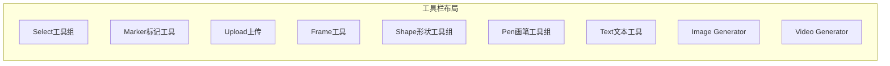

**章节来源**
- [Toolbar.tsx:194-668](file://components/canvas/Toolbar.tsx#L194-L668)

### AnnotationOverlay 注释覆盖层

**新增** AnnotationOverlay 组件实现了注释覆盖层系统，支持实时显示图像尺寸和文件名标注。

#### 主要功能特性

1. **实时尺寸显示**：显示选中图片的实时尺寸
2. **文件名标注**：显示图片文件名，支持双击编辑
3. **框架尺寸标注**：显示框架的尺寸信息
4. **缓存优化**：使用缓存机制优化性能
5. **缩放适配**：根据缩放级别动态调整标注大小

#### 标注系统

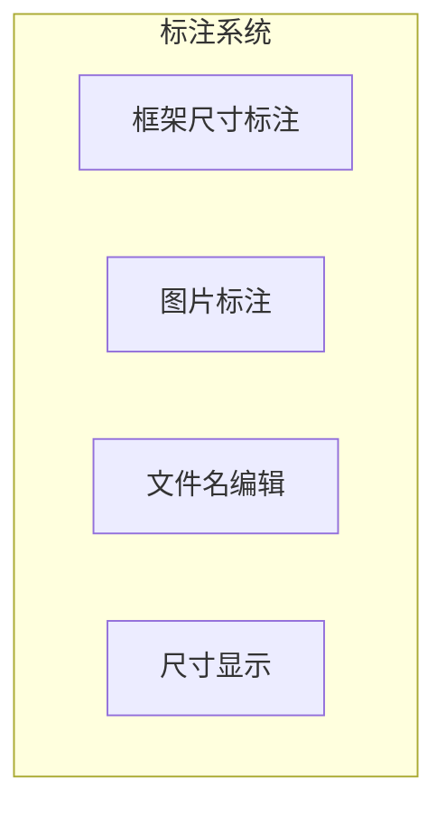

**章节来源**
- [CanvasArea.tsx:271-580](file://components/canvas/CanvasArea.tsx#L271-L580)

### MarkerOverlay 标记覆盖层

**新增** MarkerOverlay 组件实现了标记系统，允许用户在画布项目上放置视觉标记。

#### 主要功能特性

1. **标记放置**：用户可在图片上点击放置标记
2. **标记管理**：支持最多8个标记，自动编号
3. **标记删除**：支持删除单个或全部标记
4. **标记定位**：基于相对坐标的精确定位
5. **标记重渲染**：标记变化时自动重渲染

#### 标记系统

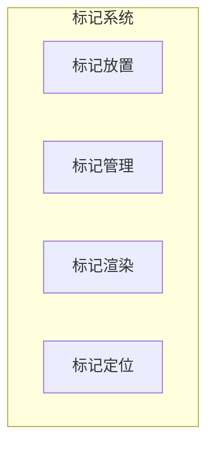

**章节来源**
- [CanvasArea.tsx:194-270](file://components/canvas/CanvasArea.tsx#L194-L270)

### InlineEditPanel 内联编辑面板

**更新** 重构以支持 tldraw 画布的内联编辑功能，完全适配新的编辑器架构。**重大改进**：现在能够处理新的图像元数据返回类型，支持更精确的图像尺寸管理和显示缩放。

#### 主要功能特性

1. **tldraw 集成**：与 tldraw 编辑器实时同步位置
2. **参考图片管理**：支持上传和管理最多6张参考图片
3. **实时图像生成**：基于 AI 模型的实时图像生成和编辑
4. **拖拽排序**：支持参考图片的拖拽重新排序
5. **占位符节点**：AI 生成过程中的临时显示节点
6. **自适应定位**：根据选中形状自动计算面板位置
7. **智能尺寸管理**：支持从 API 获取精确的图像尺寸信息
8. **增强错误处理**：改进网络错误和加载失败的处理机制

#### 编辑工作流程

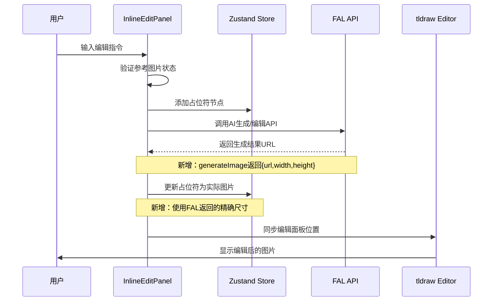

**图表来源**
- [InlineEditPanel.tsx:209-216](file://components/canvas/InlineEditPanel.tsx#L209-L216)
- [InlineEditPanel.tsx:218-270](file://components/canvas/InlineEditPanel.tsx#L218-L270)

#### 智能尺寸管理

**更新** 组件现在支持两种不同的图像生成模式，分别处理不同的返回数据类型：

- **编辑模式** (`editImage`): 返回纯 URL 字符串
- **生成模式** (`generateImage`): 返回 `{ url, width, height }` 对象

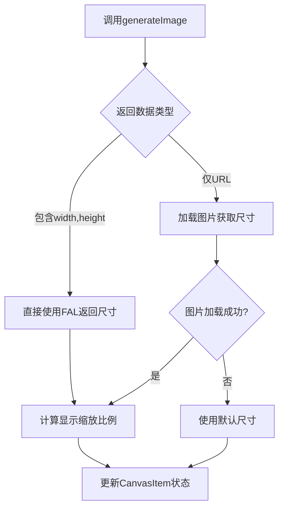

**图表来源**
- [InlineEditPanel.tsx:203-270](file://components/canvas/InlineEditPanel.tsx#L203-L270)

#### 增强错误处理机制

**更新** 新增了更完善的错误处理机制：

- **网络错误检测**：识别网络连接失败并提供友好提示
- **图片加载失败**：当无法获取图片自然尺寸时使用回退方案
- **上传失败处理**：及时清理临时资源和显示错误提示
- **状态清理**：错误发生时正确清理占位符节点

**章节来源**
- [InlineEditPanel.tsx:20-466](file://components/canvas/InlineEditPanel.tsx#L20-L466)

### CanvasItem 数据模型

CanvasItem 是画布系统的核心数据结构，定义了画布上每个元素的完整信息：

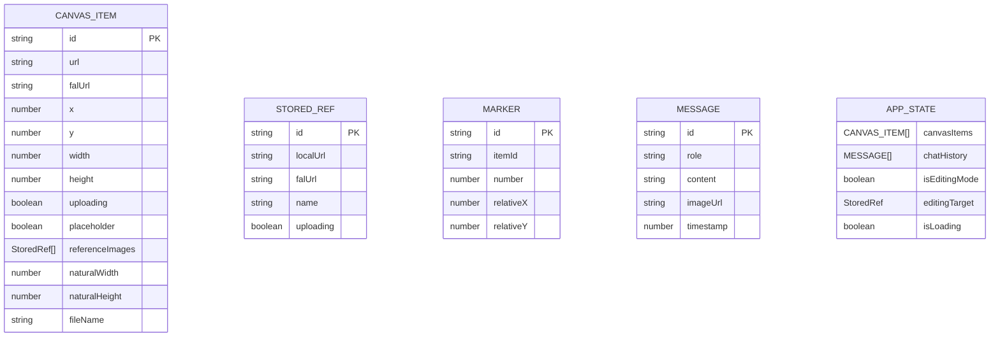

**图表来源**
- [types.ts:17-49](file://lib/types.ts#L17-L49)

**更新** 新增了 `referenceImages` 字段，支持每张图片的独立参考图片管理；新增了 `Marker` 接口，支持标记系统。

#### 占位符节点 vs 实际图片节点

系统通过 `placeholder` 字段区分两种节点类型：

- **占位符节点**：用于 AI 生成过程中的临时显示，具有闪烁的渐变效果
- **实际图片节点**：用户上传的真实图片，支持完整的编辑和变换功能

**章节来源**
- [types.ts:17-37](file://lib/types.ts#L17-L37)

## 架构概览

画布交互系统采用分层架构设计，确保了良好的可维护性和扩展性：

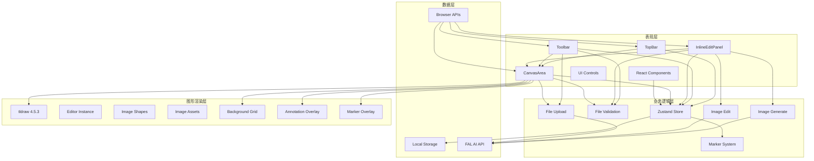

**图表来源**
- [CanvasArea.tsx:1-1624](file://components/canvas/CanvasArea.tsx#L1-L1624)
- [InlineEditPanel.tsx:1-466](file://components/canvas/InlineEditPanel.tsx#L1-L466)
- [Toolbar.tsx:1-668](file://components/canvas/Toolbar.tsx#L1-L668)
- [TopBar.tsx:1-222](file://components/canvas/TopBar.tsx#L1-L222)
- [store.ts:62-385](file://lib/store.ts#L62-L385)

### 交互流程

系统的关键交互流程包括拖拽上传、实时同步、图片选择、内联编辑和标记系统等：

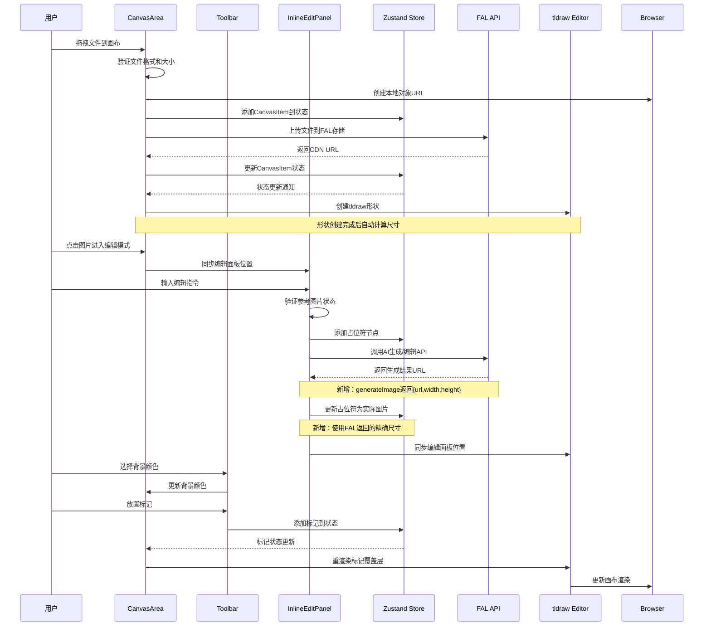

**图表来源**
- [CanvasArea.tsx:263-319](file://components/canvas/CanvasArea.tsx#L263-L319)
- [InlineEditPanel.tsx:209-270](file://components/canvas/InlineEditPanel.tsx#L209-L270)
- [Toolbar.tsx:285-355](file://components/canvas/Toolbar.tsx#L285-L355)

## 详细组件分析

### tldraw 编辑器集成

**新增** CanvasArea 组件实现了与 tldraw 编辑器的深度集成：

#### 编辑器生命周期管理

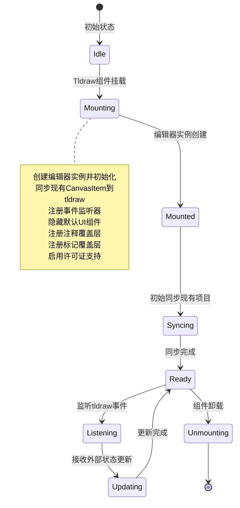

**图表来源**
- [CanvasArea.tsx:774-856](file://components/canvas/CanvasArea.tsx#L774-L856)

#### 实时同步机制

系统实现了 CanvasItem 与 tldraw 形状的双向实时同步：

- **外部到内部**：tldraw 形状变化 → CanvasItem 状态更新
- **内部到外部**：CanvasItem 状态变化 → tldraw 形状更新
- **选择同步**：选中形状 → 编辑面板位置更新
- **删除同步**：删除形状 → CanvasItem 移除

**章节来源**
- [CanvasArea.tsx:857-1038](file://components/canvas/CanvasArea.tsx#L857-L1038)
- [store.ts:107-150](file://lib/store.ts#L107-L150)

### Tldraw 许可证支持

**新增** CanvasArea 组件现已集成 Tldraw 许可证支持，通过 `licenseKey` 属性启用高级功能：

#### 许可证配置

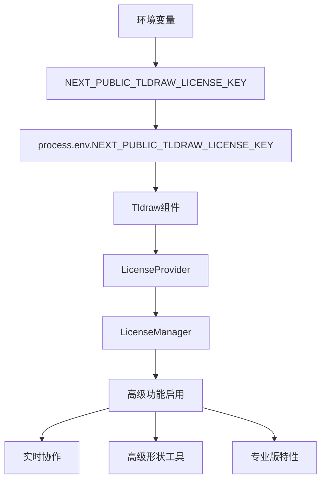

**图表来源**
- [CanvasArea.tsx:1399-1404](file://components/canvas/CanvasArea.tsx#L1399-L1404)

#### 许可证支持特性

- **实时协作**：支持多用户同时编辑
- **高级形状工具**：提供更丰富的图形编辑功能
- **专业版特性**：解锁专业级画布功能
- **生产环境保护**：在生产环境中提供许可证验证

**章节来源**
- [CanvasArea.tsx:1399-1404](file://components/canvas/CanvasArea.tsx#L1399-L1404)

### ID 映射机制

**新增** 实现了 CanvasItem ID 与 tldraw 形状 ID 的双向映射：

#### ID 映射规则

```mermaid
flowchart TD
CanvasItemID[CanvasItem.id] --> ShapeID[TLShapeId]
ShapeID --> CanvasItemID[CanvasItem.id]
CanvasItemID --> ShapeID2[shape:{id}]
ShapeID2 --> CanvasItemID2[{id}]
note right of CanvasItemID
canvasItemIdToShapeId()
shapeIdToCanvasItemId()
end note
```

**图表来源**
- [store.ts:55-62](file://lib/store.ts#L55-L62)

#### 映射函数实现

- `canvasItemIdToShapeId()`: 将 CanvasItem ID 转换为 tldraw 形状 ID
- `shapeIdToCanvasItemId()`: 将 tldraw 形状 ID 转换回 CanvasItem ID

**章节来源**
- [store.ts:55-62](file://lib/store.ts#L55-L62)

### 占位符节点管理

占位符节点用于显示 AI 生成过程中的临时状态，具有独特的视觉效果：

#### 占位符转换流程

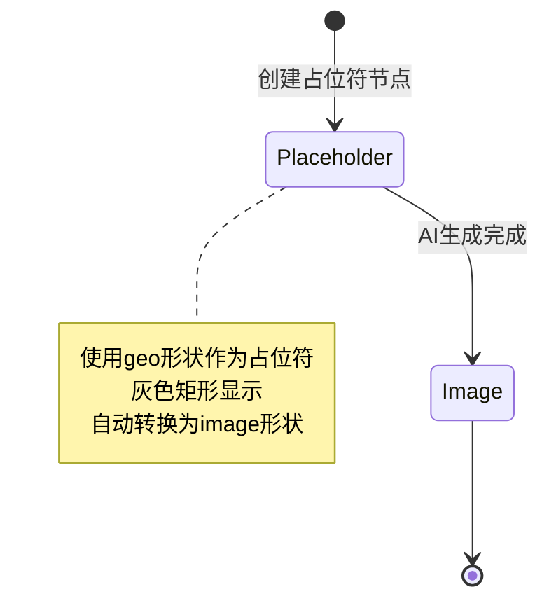

**图表来源**
- [CanvasArea.tsx:88-170](file://components/canvas/CanvasArea.tsx#L88-L170)

#### 转换逻辑实现

- **创建占位符**：使用 geo 形状类型创建灰色矩形
- **检测转换时机**：当占位符变为非上传状态且有 URL 时
- **执行转换**：删除 geo 形状并创建对应的 image 形状

**章节来源**
- [CanvasArea.tsx:88-170](file://components/canvas/CanvasArea.tsx#L88-L170)

### CanvasItemNode 替代实现

**更新** 由于使用 tldraw，CanvasItemNode 的功能由 tldraw 的原生形状系统实现：

#### tldraw 形状创建

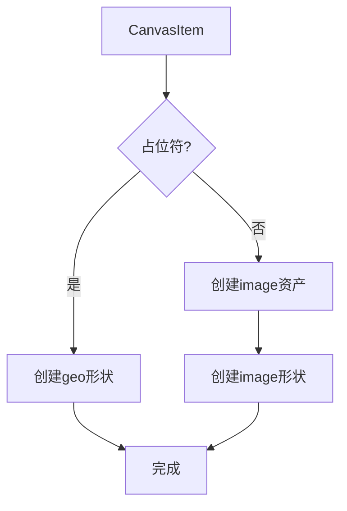

**图表来源**
- [CanvasArea.tsx:88-170](file://components/canvas/CanvasArea.tsx#L88-L170)

#### 形状类型选择

- **占位符节点**：使用 `geo` 形状类型，设置为灰色矩形
- **实际图片**：使用 `image` 形状类型，关联对应的图像资产

**章节来源**
- [CanvasArea.tsx:88-170](file://components/canvas/CanvasArea.tsx#L88-L170)

### 拖拽上传功能

拖拽上传功能提供了直观的文件导入方式：

#### 文件验证流程

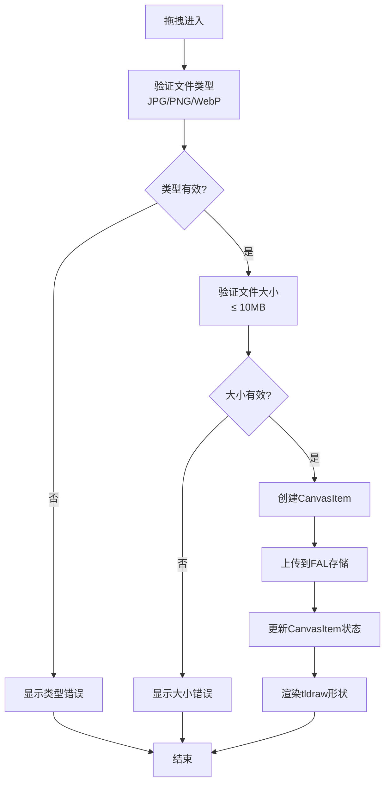

**图表来源**
- [CanvasArea.tsx:1255-1317](file://components/canvas/CanvasArea.tsx#L1255-L1317)
- [validate.ts:9-13](file://lib/validate.ts#L9-L13)

#### 上传状态管理

- **本地预览**：使用 `URL.createObjectURL()` 创建临时预览
- **云端存储**：通过 FAL API 将文件上传到 CDN
- **状态同步**：实时更新上传进度和最终 URL

**章节来源**
- [CanvasArea.tsx:1255-1317](file://components/canvas/CanvasArea.tsx#L1255-L1317)

### 内联编辑面板功能

**更新** InlineEditPanel 完全重构以支持 tldraw 画布的内联编辑功能，**重大改进**：现在能够处理新的图像元数据返回类型。

#### 参考图片管理系统

```mermaid
flowchart TD
Upload[上传参考图片] --> Validate[验证文件格式]
Validate --> Valid{格式有效?}
Valid --> |否| Error[显示错误]
Valid --> |是| CreateLocal[创建本地预览URL]
CreateLocal --> UploadToCloud[上传到云端存储]
UploadToCloud --> UpdateState[更新状态]
UpdateState --> ShowThumbnail[显示缩略图]
ShowThumbnail --> DragReorder[拖拽重新排序]
DragReorder --> Delete[删除参考图片]
Delete --> MaxLimit{达到最大数量?}
MaxLimit --> |是| DisableAdd[禁用添加按钮]
MaxLimit --> |否| EnableAdd[启用添加按钮]
DisableAdd --> Edit[开始编辑]
EnableAdd --> Edit
Error --> End[结束]
Edit --> Generate[AI生成/编辑]
Generate --> PlaceHolder[显示占位符节点]
PlaceHolder --> UpdateResult[更新为实际图片]
Note over Generate,UpdateResult : 新增：智能尺寸管理
UpdateResult --> End
```

**图表来源**
- [InlineEditPanel.tsx:111-144](file://components/canvas/InlineEditPanel.tsx#L111-L144)
- [InlineEditPanel.tsx:209-270](file://components/canvas/InlineEditPanel.tsx#L209-L270)

#### 智能尺寸管理实现

**更新** 组件现在支持两种不同的图像生成模式：

- **编辑模式** (`editImage`): 直接返回 URL 字符串
- **生成模式** (`generateImage`): 返回 `{ url, width, height }` 对象

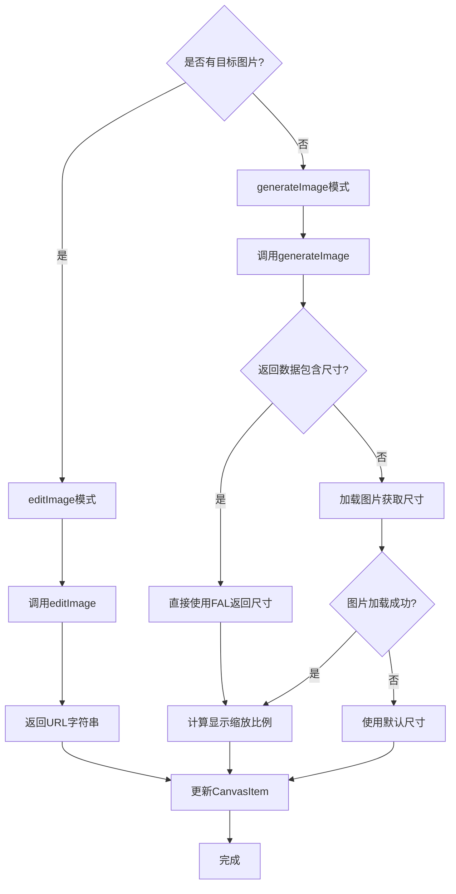

**图表来源**
- [InlineEditPanel.tsx:207-270](file://components/canvas/InlineEditPanel.tsx#L207-L270)

#### 增强错误处理机制

**更新** 新增了更完善的错误处理：

- **网络错误检测**：识别 `TypeError` 类型的网络连接失败
- **图片加载失败**：当 `onerror` 触发时使用回退方案
- **状态清理**：错误发生时移除占位符节点
- **用户反馈**：使用 `toast` 提供友好的错误提示

**章节来源**
- [InlineEditPanel.tsx:209-286](file://components/canvas/InlineEditPanel.tsx#L209-L286)

### 自适应定位系统

**新增** InlineEditPanel 实现了与 tldraw 编辑器的自适应定位：

#### 位置计算流程

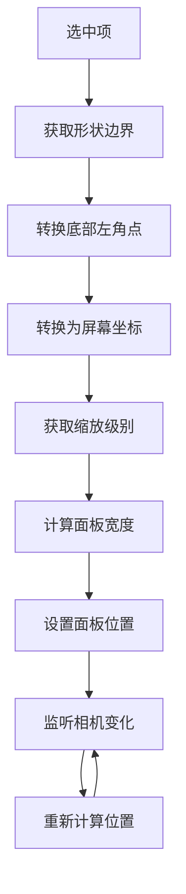

**图表来源**
- [InlineEditPanel.tsx:64-108](file://components/canvas/InlineEditPanel.tsx#L64-L108)

#### 定位同步机制

- **边界获取**：使用 `getShapePageBounds()` 获取形状边界
- **坐标转换**：使用 `pageToScreen()` 转换为屏幕坐标
- **缩放适配**：根据缩放级别调整面板宽度
- **实时更新**：监听编辑器相机变化自动更新位置

**章节来源**
- [InlineEditPanel.tsx:64-108](file://components/canvas/InlineEditPanel.tsx#L64-L108)

### 注释覆盖层系统

**新增** 实现了完整的注释覆盖层系统，支持实时图像尺寸显示和文件名标注：

#### 注释覆盖层架构

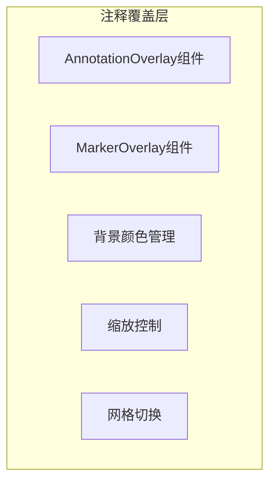

#### 注释渲染流程

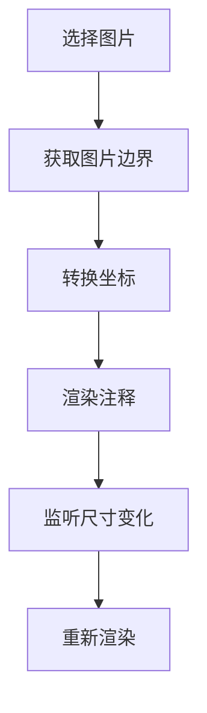

**图表来源**
- [CanvasArea.tsx:271-580](file://components/canvas/CanvasArea.tsx#L271-L580)

#### 注释系统特性

- **实时尺寸显示**：显示选中图片的实时尺寸
- **文件名标注**：支持双击编辑文件名
- **框架尺寸标注**：显示框架的尺寸信息
- **缓存优化**：使用缓存机制提升性能
- **缩放适配**：根据缩放级别动态调整

**章节来源**
- [CanvasArea.tsx:271-580](file://components/canvas/CanvasArea.tsx#L271-L580)

### 标记系统

**新增** 实现了完整的标记系统，允许用户在画布项目上放置视觉标记：

#### 标记系统架构

```mermaid
graph TB
subgraph "标记系统"
MarkerOverlay[MarkerOverlay组件]
MarkerActions[标记操作]
MarkerState[标记状态]
MarkerRendering[标记渲染]
end
```

#### 标记放置流程

```mermaid
flowchart TD
UserClick[用户点击图片] --> DetectShape[检测图片形状]
DetectShape --> CalcRelative[计算相对坐标]
CalcRelative --> AddMarker[添加标记到状态]
AddMarker --> UpdateOverlay[更新覆盖层]
UpdateOverlay --> RenderMarker[渲染标记]
```

**图表来源**
- [CanvasArea.tsx:805-838](file://components/canvas/CanvasArea.tsx#L805-L838)

#### 标记系统特性

- **最多8个标记**：限制标记数量确保性能
- **自动编号**：标记自动分配序号
- **相对定位**：基于相对坐标的精确定位
- **删除管理**：支持删除单个或全部标记
- **重渲染机制**：标记变化时自动重渲染

**章节来源**
- [CanvasArea.tsx:805-838](file://components/canvas/CanvasArea.tsx#L805-L838)
- [store.ts:270-359](file://lib/store.ts#L270-L359)

### 背景颜色选择系统

**新增** 实现了完整的背景颜色选择系统，支持 HSV 色彩空间：

#### HSV 色彩空间转换

```mermaid
flowchart TD
HSVInput[HSV输入] --> ConvertRGB[转换为RGB]
ConvertRGB --> HexOutput[转换为HEX]
HexOutput --> ApplyColor[应用到背景]
ApplyColor --> UpdatePicker[更新颜色选择器]
```

#### 背景颜色管理

- **HSV色彩空间**：使用 H(0-360) S(0-100) V(0-100)
- **HEX转换**：支持HEX颜色输入和转换
- **预设颜色**：提供常用颜色预设
- **透明度支持**：支持透明背景

**章节来源**
- [CanvasArea.tsx:21-58](file://components/canvas/CanvasArea.tsx#L21-L58)
- [CanvasArea.tsx:647-710](file://components/canvas/CanvasArea.tsx#L647-L710)

### 缩放控制系统

**新增** 实现了完整的缩放控制系统：

#### 缩放控制架构

```mermaid
graph TB
ZoomMenu[缩放菜单]
ZoomButtons[缩放按钮]
ZoomLevel[缩放级别显示]
ZoomActions[缩放操作]
end
```

#### 缩放控制特性

- **缩放级别**：支持50%到200%的缩放范围
- **缩放菜单**：提供快捷缩放选项
- **缩放动画**：支持平滑的缩放动画
- **适配屏幕**：支持自适应屏幕缩放

**章节来源**
- [CanvasArea.tsx:711-742](file://components/canvas/CanvasArea.tsx#L711-L742)
- [CanvasArea.tsx:1440-1515](file://components/canvas/CanvasArea.tsx#L1440-L1515)

## 依赖关系分析

画布交互系统的依赖关系体现了清晰的分层架构：

```mermaid
graph TB
subgraph "外部依赖"
React[react@19.2.4]
ReactDOM[react-dom@19.2.4]
Tldraw[tldraw@4.5.3]
ReactTldraw[react-tldraw@19.2.3]
Zustand[zustand@5.0.12]
Tailwind[tailwindcss@4]
Sonner[sonner@2.0.7]
Lucide[lucide-react@1.6.0]
Nanoid[nanoid@5.1.7]
FAL[@fal-ai/client@1.9.5]
end
subgraph "内部模块"
CanvasArea[components/canvas/CanvasArea.tsx]
InlineEditPanel[components/canvas/InlineEditPanel.tsx]
Toolbar[components/canvas/Toolbar.tsx]
TopBar[components/canvas/TopBar.tsx]
Store[lib/store.ts]
Types[lib/types.ts]
Validate[lib/validate.ts]
FAL_API[lib/fal.ts]
Button[components/ui/button.tsx]
Tooltip[components/ui/tooltip.tsx]
end
CanvasArea --> React
CanvasArea --> Tldraw
CanvasArea --> Zustand
CanvasArea --> FAL
CanvasArea --> Validate
CanvasArea --> Types
InlineEditPanel --> React
InlineEditPanel --> Zustand
InlineEditPanel --> FAL
InlineEditPanel --> Validate
InlineEditPanel --> Types
Toolbar --> React
Toolbar --> Zustand
Toolbar --> FAL
Toolbar --> Validate
Toolbar --> Types
TopBar --> React
TopBar --> Zustand
TopBar --> Types
Store --> Zustand
Store --> Types
Button --> React
Button --> Tailwind
Tooltip --> React
FAL_API --> FAL
FAL_API --> Types
```

**图表来源**
- [package.json:11-29](file://package.json#L11-L29)
- [CanvasArea.tsx:3-17](file://components/canvas/CanvasArea.tsx#L3-L17)
- [InlineEditPanel.tsx:3-11](file://components/canvas/InlineEditPanel.tsx#L3-L11)
- [Toolbar.tsx:3-16](file://components/canvas/Toolbar.tsx#L3-L16)
- [TopBar.tsx:3-7](file://components/canvas/TopBar.tsx#L3-L7)
- [store.ts:1-5](file://lib/store.ts#L1-L5)

### 核心依赖分析

#### 状态管理依赖

Zustand 提供了轻量级的状态管理解决方案，相比 Redux 更加简洁易用：

- **持久化存储**：使用 `persist` 中间件实现本地存储
- **类型安全**：完整的 TypeScript 支持
- **动作分离**：清晰的动作定义和状态更新逻辑
- **多切片管理**：支持会话状态和持久化状态分离
- **标记系统**：新增完整的标记状态管理

#### tldraw 依赖分析

tldraw 作为新一代 2D 图形库，提供了丰富的功能：

- **实时协作**：内置的实时同步和协作功能
- **高性能渲染**：基于 Canvas API 的高效渲染
- **事件系统**：完整的形状和画布事件支持
- **资产管理系统**：内置的图像和媒体资产管理
- **网格背景**：支持自定义背景网格
- **覆盖层系统**：支持 OnTheCanvas 和 InFrontOfTheCanvas 覆盖层
- **许可证支持**：通过 `licenseKey` 属性启用高级功能

#### FAL API 依赖分析

**更新** FAL API 现在支持两种不同的返回数据类型：

- **编辑模式**：`editImage` 返回纯 URL 字符串
- **生成模式**：`generateImage` 返回 `{ url, width, height }` 对象

这要求前端组件必须具备智能的数据类型检测和处理能力。

**章节来源**
- [store.ts:62-385](file://lib/store.ts#L62-L385)
- [package.json:26](file://package.json#L26)

## 性能考虑

### 渲染性能优化

#### 批量更新优化

系统采用了多种批量更新技术来提升渲染性能：

- **同步状态控制**：使用 `syncingRef` 防止无限同步循环
- **处理项目跟踪**：使用 `processedItemsRef` 避免重复创建形状
- **条件渲染**：只在必要时重新渲染特定形状
- **事件监听优化**：合理使用 tldraw 事件监听器
- **RAF 节流**：使用 requestAnimationFrame 节流批量同步
- **缓存机制**：注释覆盖层使用缓存优化性能

#### 内存管理

- **URL 对象清理**：及时撤销 `createObjectURL()` 创建的临时 URL
- **编辑器实例管理**：组件卸载时正确清理编辑器资源
- **事件监听器清理**：组件卸载时移除所有事件监听器
- **引用图片清理**：CanvasItem移除时清理所有关联的引用图片URL
- **标记清理**：CanvasItem移除时清理关联的所有标记

#### 智能尺寸管理性能

**更新** 新的图像元数据处理机制提升了性能：

- **直接尺寸使用**：当 FAL API 返回精确尺寸时，避免额外的图片加载
- **回退机制优化**：图片加载失败时的快速回退，避免长时间等待
- **缩放计算缓存**：显示缩放比例的计算结果缓存
- **文件名生成优化**：使用正则表达式过滤特殊字符，减少字符串处理开销

#### 内联编辑性能

- **占位符节点**：AI生成过程中的临时节点，避免复杂渲染
- **面板同步**：编辑面板位置与图片位置实时同步
- **拖拽优化**：拖拽过程中只更新面板位置，不重新渲染整个画布
- **自适应定位**：面板位置计算使用 tldraw 原生方法
- **错误处理优化**：快速的错误检测和处理，避免长时间阻塞

#### 标记系统性能

- **标记数量限制**：最多8个标记确保性能
- **相对坐标缓存**：标记相对坐标使用缓存
- **重渲染优化**：标记变化时只重渲染覆盖层
- **自动编号**：标记自动编号避免重复计算

#### 许可证系统性能

- **环境变量访问**：通过 `process.env.NEXT_PUBLIC_TLDRAW_LICENSE_KEY` 访问许可证
- **许可证验证**：在编辑器初始化时进行许可证验证
- **功能启用**：根据许可证状态启用相应功能
- **错误处理**：许可证无效时提供降级功能

**章节来源**
- [CanvasArea.tsx:743-771](file://components/canvas/CanvasArea.tsx#L743-L771)
- [CanvasArea.tsx:279-337](file://components/canvas/CanvasArea.tsx#L279-L337)
- [CanvasArea.tsx:805-838](file://components/canvas/CanvasArea.tsx#L805-L838)
- [InlineEditPanel.tsx:218-270](file://components/canvas/InlineEditPanel.tsx#L218-L270)

## 故障排除指南

### 常见问题及解决方案

#### tldraw 编辑器无法加载

**问题症状**：页面空白或编辑器不显示

**可能原因**：
1. tldraw 依赖未正确安装
2. 编辑器实例创建失败
3. 样式文件加载问题
4. 浏览器兼容性问题
5. **许可证配置错误**：`NEXT_PUBLIC_TLDRAW_LICENSE_KEY` 环境变量未正确设置

**解决方案**：
- 确认 `tldraw` 依赖版本正确
- 检查 `onMount` 回调是否正确执行
- 验证 tldraw CSS 文件是否正确引入
- 测试不同浏览器的兼容性
- **检查许可证配置**：确认 `NEXT_PUBLIC_TLDRAW_LICENSE_KEY` 环境变量已正确设置

#### 形状同步异常

**问题症状**：CanvasItem 状态更新但 tldraw 形状不变化

**可能原因**：
1. ID 映射机制异常
2. 同步状态控制失效
3. 编辑器实例未正确初始化
4. 形状类型转换失败

**解决方案**：
- 检查 `canvasItemIdToShapeId()` 函数
- 验证 `syncingRef` 状态
- 确认编辑器实例存在
- 验证形状类型和属性

#### 占位符节点转换失败

**问题症状**：占位符节点无法转换为实际图片

**可能原因**：
1. 占位符状态未正确更新
2. URL 未正确设置
3. 同步状态控制失效
4. 形状删除和创建顺序错误

**解决方案**：
- 检查 CanvasItem 的 `placeholder` 状态
- 验证 `falUrl` 是否正确设置
- 确认同步状态控制逻辑
- 验证形状删除和创建的顺序

#### 内联编辑面板定位错误

**问题症状**：编辑面板位置与选中图片不匹配

**可能原因**：
1. 选中形状边界获取失败
2. 坐标转换函数调用错误
3. 缩放级别计算错误
4. 相机变化监听失效

**解决方案**：
- 检查 `getShapePageBounds()` 调用
- 验证 `pageToScreen()` 函数使用
- 确认缩放级别获取
- 重新注册相机变化监听

#### 注释覆盖层显示异常

**问题症状**：注释覆盖层不显示或显示错误

**可能原因**：
1. 注释覆盖层未正确注册
2. 缓存数据过期
3. 缩放级别计算错误
4. 选中状态变化监听失效

**解决方案**：
- 检查 `OnTheCanvas` 组件注册
- 验证缓存数据更新
- 确认缩放级别计算
- 重新注册状态监听

#### 标记系统故障

**问题症状**：标记无法放置或显示异常

**可能原因**：
1. 标记工具状态异常
2. 形状检测失败
3. 相对坐标计算错误
4. 标记状态同步失败

**解决方案**：
- 检查 `activeTool` 状态
- 验证 `getShapeAtPoint()` 调用
- 确认相对坐标计算
- 验证标记状态同步

#### 许可证相关问题

**问题症状**：编辑器功能受限或显示许可证错误

**可能原因**：
1. 许可证密钥未正确设置
2. 许可证验证失败
3. 生产环境许可证过期
4. 许可证类型不匹配

**解决方案**：
- 检查 `NEXT_PUBLIC_TLDRAW_LICENSE_KEY` 环境变量
- 验证许可证密钥格式
- 确认许可证类型与使用场景匹配
- 检查许可证有效期

#### **新增** 图像元数据处理问题

**问题症状**：图像尺寸显示不正确或生成失败

**可能原因**：
1. **FAL API 返回数据类型不匹配**：`generateImage` 返回对象但前端期望字符串
2. **网络连接失败**：`TypeError` 类型的网络错误未正确识别
3. **图片加载超时**：`preloadImageUrl` 超时导致的性能问题
4. **尺寸计算错误**：自然尺寸与显示尺寸的比例计算问题

**解决方案**：
- **检查 API 调用**：验证 `editImage` 和 `generateImage` 的返回数据类型
- **网络错误处理**：使用 `instanceof TypeError` 检测网络连接失败
- **超时处理**：优化 `preloadImageUrl` 的超时时间
- **尺寸验证**：确保 `naturalWidth` 和 `naturalHeight` 存在且有效

### 调试技巧

#### 开发者工具使用

- **React DevTools**：监控组件状态变化
- **tldraw Inspector**：调试图形元素和事件
- **Network Monitor**：跟踪文件上传和 API 请求
- **Console Logging**：添加关键操作的日志输出

#### 日志记录

系统使用 `sonner` 库提供友好的用户反馈：

- **成功操作**：显示确认消息
- **错误处理**：显示错误提示
- **进度反馈**：显示上传进度
- **编辑状态**：显示编辑模式切换

**章节来源**
- [CanvasArea.tsx:310-317](file://components/canvas/CanvasArea.tsx#L310-L317)
- [InlineEditPanel.tsx:156-162](file://components/canvas/InlineEditPanel.tsx#L156-L162)

## 最佳实践

### 代码组织最佳实践

#### 组件拆分原则

1. **单一职责**：每个组件只负责一个特定功能
2. **可复用性**：组件设计应考虑通用性
3. **清晰接口**：明确的 props 和回调定义
4. **状态封装**：内部状态与外部状态分离

#### 状态管理最佳实践

- **局部状态优先**：只在需要共享的地方使用全局状态
- **状态最小化**：避免存储冗余状态
- **不可变更新**：使用不可变更新模式
- **状态切片**：合理划分持久化和会话状态

### 性能优化最佳实践

#### 渲染优化

- **虚拟化长列表**：对于大量元素使用虚拟化技术
- **懒加载**：按需加载和渲染组件
- **缓存策略**：合理使用缓存减少重复计算
- **批量更新**：合并多个状态更新操作
- **RAF 节流**：使用 requestAnimationFrame 节流更新

#### 事件处理优化

- **事件防抖**：对高频事件使用防抖处理
- **节流控制**：限制事件处理频率
- **内存泄漏防护**：及时清理事件监听器
- **原生事件优化**：在必要时使用原生事件

#### 图像处理优化

- **异步加载**：图片加载使用异步方式
- **自动尺寸计算**：首次加载时计算合适的显示尺寸
- **跨域处理**：正确设置 `crossOrigin` 属性
- **URL清理**：及时撤销临时URL对象

#### 智能尺寸管理优化

**更新** 新的图像元数据处理机制的优化：

- **数据类型检测**：使用 `typeof` 和 `in` 操作符检测返回数据类型
- **条件分支优化**：根据数据类型选择不同的处理路径
- **回退机制**：当 API 返回不完整数据时使用回退方案
- **缓存策略**：缓存计算结果避免重复计算

#### 内联编辑性能优化

- **占位符节点**：AI生成过程中的临时节点，避免复杂渲染
- **面板同步**：编辑面板位置与图片位置实时同步
- **拖拽优化**：拖拽过程中只更新面板位置，不重新渲染整个画布
- **自适应定位**：面板位置计算使用 tldraw 原生方法
- **错误处理优化**：快速的错误检测和处理，避免长时间阻塞

#### 注释覆盖层优化

- **缓存机制**：使用缓存避免重复计算
- **缩放适配**：根据缩放级别动态调整
- **批量更新**：使用 RAF 节流批量更新
- **选择状态优化**：只在选中状态变化时更新

#### 标记系统优化

- **数量限制**：控制标记数量确保性能
- **相对坐标缓存**：缓存相对坐标计算
- **重渲染优化**：只重渲染必要的部分
- **自动编号**：避免重复计算编号

#### 许可证系统优化

- **环境变量管理**：通过环境变量管理许可证密钥
- **运行时验证**：在编辑器初始化时验证许可证
- **降级策略**：许可证无效时提供基础功能
- **错误处理**：优雅处理许可证相关错误

### 用户体验最佳实践

#### 交互设计

- **即时反馈**：用户操作应有即时的视觉反馈
- **一致性**：保持交互模式的一致性
- **可预测性**：用户应该能够预测操作结果
- **无障碍访问**：支持键盘导航和屏幕阅读器

#### 错误处理

- **优雅降级**：在错误情况下提供替代方案
- **清晰提示**：错误信息应该清晰易懂
- **恢复机制**：提供错误恢复的可能性
- **用户引导**：提供操作指导和帮助信息

#### 性能优化

- **渐进式加载**：先显示基本功能，再加载高级功能
- **预加载策略**：预测用户行为提前加载资源
- **离线支持**：提供基本功能的离线使用
- **性能监控**：持续监控和优化性能指标

## 结论

画布交互系统是一个功能完整、性能优异的现代图像编辑平台。通过精心设计的架构和实现，系统成功地结合了强大的 tldraw 图形编辑能力、流畅的用户交互体验和可靠的 AI 集成。

**更新** 系统现已完全迁移至 tldraw 画布系统，这是一个重大的架构升级，提供了更强大的图形编辑能力和更好的用户体验。新的系统不再依赖于 Konva，而是直接使用 tldraw 的原生功能，包括实时同步、形状管理、选择控制等。

**新增** 系统现在包含完整的工具栏功能，提供高级画布操作能力，包括背景颜色选择、缩放控制、网格切换等。CanvasArea组件还新增了注释覆盖层系统，支持实时显示图像尺寸和文件名标注，以及标记系统，允许用户在画布项目上放置视觉标记。

**新增** CanvasArea组件现已集成 Tldraw 许可证支持，通过 `licenseKey` 属性启用高级功能。这一集成确保系统能够正确使用 tldraw 的高级功能，包括实时协作、高级形状工具和专业版特性，为用户提供完整的专业级画布编辑体验。

**更新** InlineEditPanel 组件经过重大改进，现在能够处理新的图像元数据返回类型，支持更精确的图像尺寸管理和显示缩放。组件实现了智能的数据类型检测、增强的错误处理机制和优化的性能表现，为用户提供更稳定和高效的图像编辑体验。

### 系统优势

1. **技术栈先进**：采用最新的 React 19、tldraw 4.5.3 和 TypeScript 技术
2. **用户体验优秀**：提供直观、流畅的交互体验
3. **性能优化到位**：通过多种技术手段确保系统性能
4. **可扩展性强**：模块化设计便于功能扩展和维护
5. **专业图像编辑**：专注于图像编辑领域的完整解决方案
6. **实时协作支持**：tldraw 原生的实时协作功能
7. **资产管理系统**：内置的图像和媒体资产管理
8. **网格背景支持**：tldraw 原生的网格背景功能
9. **注释覆盖层**：实时显示图像尺寸和文件名标注
10. **标记系统**：用户可在画布项目上放置视觉标记
11. **高级工具栏**：提供完整的画布操作功能
12. **HSV色彩空间**：支持精确的背景颜色选择
13. **许可证支持**：通过 `licenseKey` 属性启用高级功能
14. **智能尺寸管理**：支持从 API 获取精确的图像尺寸信息
15. **增强错误处理**：改进的网络错误和加载失败处理

### 技术亮点

- **实时同步机制**：CanvasItem 与 tldraw 形状的双向实时同步
- **ID 映射系统**：CanvasItem ID 与 tldraw 形状 ID 的双向映射
- **占位符转换**：AI 生成过程中的智能节点转换
- **自适应定位**：编辑面板与选中形状的自动定位
- **拖拽上传**：直观的文件导入体验
- **内联编辑**：实时的图像编辑和生成功能
- **参考图片管理**：支持多张参考图片的管理和编辑
- **注释覆盖层**：实时显示图像尺寸和文件名标注
- **标记系统**：用户可在画布项目上放置视觉标记
- **背景颜色选择**：支持 HSV 色彩空间的颜色选择
- **缩放控制**：完整的缩放控制功能
- **网格切换**：支持网格显示的开启和关闭
- **许可证集成**：通过 `licenseKey` 属性启用高级功能
- **智能尺寸管理**：支持从 API 获取精确的图像尺寸信息
- **增强错误处理**：改进的网络错误和加载失败处理

### 发展方向

未来可以考虑的功能扩展包括：
- 多图层支持和图层管理
- 更丰富的图片编辑工具
- 云端协作功能
- 更多的 AI 生成选项
- 导出和分享功能
- 插件系统支持
- 更强大的实时协作功能
- 更多的注释类型和标记样式
- 高级颜色调整工具
- 更精细的缩放控制
- **许可证管理增强**：更灵活的许可证配置和管理
- **性能监控**：更完善的性能监控和优化
- **智能缓存策略**：基于用户行为的智能缓存管理
- **多语言支持**：国际化和本地化功能扩展

该系统为图像编辑领域提供了一个优秀的技术基础，为后续的功能扩展和性能优化奠定了坚实的基础。