# 画布图像加载机制

<cite>
**本文档引用的文件**
- [app/canvas/page.tsx](file://app/canvas/page.tsx)
- [components/canvas/CanvasArea.tsx](file://components/canvas/CanvasArea.tsx)
- [lib/storage-service.ts](file://lib/storage-service.ts)
- [lib/project-service.ts](file://lib/project-service.ts)
- [app/api/upload-asset/route.ts](file://app/api/upload-asset/route.ts)
- [lib/store.ts](file://lib/store.ts)
- [lib/types.ts](file://lib/types.ts)
- [components/canvas/InlineEditPanel.tsx](file://components/canvas/InlineEditPanel.tsx)
- [lib/fal.ts](file://lib/fal.ts)
- [app/api/fal/proxy/route.ts](file://app/api/fal/proxy/route.ts)
- [components/canvas/Toolbar.tsx](file://components/canvas/Toolbar.tsx)
- [lib/validate.ts](file://lib/validate.ts)
</cite>

## 更新摘要
**变更内容**
- 新增项目加载验证机制，防止无效项目ID触发自动保存
- 实现项目恢复机制，包含自动创建新项目和错误恢复流程
- 增强自动保存的安全性，双重保护防止恢复期间的数据丢失
- 优化画布初始化流程，避免重复初始化和状态冲突
- 改进错误处理和容错机制，提升系统稳定性

## 目录
1. [简介](#简介)
2. [项目结构概览](#项目结构概览)
3. [核心组件架构](#核心组件架构)
4. [图像加载流程详解](#图像加载流程详解)
5. [存储与缓存机制](#存储与缓存机制)
6. [性能优化策略](#性能优化策略)
7. [错误处理与容错机制](#错误处理与容错机制)
8. [安全与权限控制](#安全与权限控制)
9. [故障排除指南](#故障排除指南)
10. [总结](#总结)

## 简介

画布图像加载机制是 LoveArt 项目的核心功能模块，负责管理用户在画布上添加、加载、显示和管理各种类型的图像资源。该机制结合了本地存储、云端存储、实时预览和智能缓存策略，为用户提供流畅的图像处理体验。

系统采用 React + Next.js 技术栈，基于 Zustand 状态管理，集成 Tldraw 画布引擎，实现了从图像上传到最终显示的完整生命周期管理。最新版本增强了项目加载验证和恢复机制，有效防止无效项目ID导致的自动保存问题。

## 项目结构概览

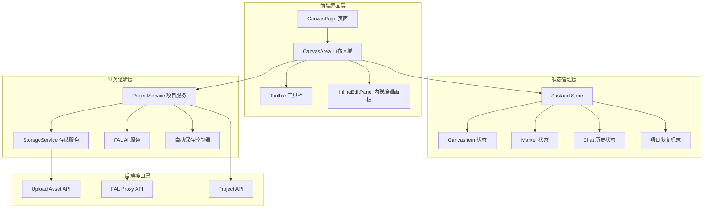

**图表来源**
- [app/canvas/page.tsx:1-290](file://app/canvas/page.tsx#L1-L290)
- [components/canvas/CanvasArea.tsx:668-800](file://components/canvas/CanvasArea.tsx#L668-L800)
- [lib/store.ts:107-427](file://lib/store.ts#L107-L427)

## 核心组件架构

### 状态管理系统

系统采用 Zustand 进行状态管理，实现了跨组件的状态共享和响应式更新。新增的项目恢复标志确保了在项目加载过程中的状态一致性。

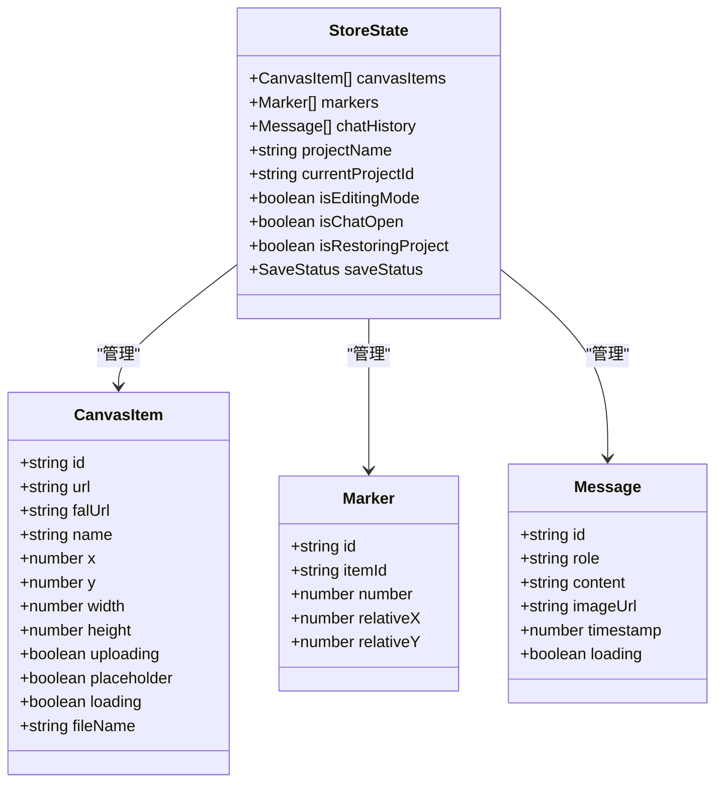

**图表来源**
- [lib/types.ts:18-42](file://lib/types.ts#L18-L42)
- [lib/store.ts:107-141](file://lib/store.ts#L107-L141)

### 画布渲染架构

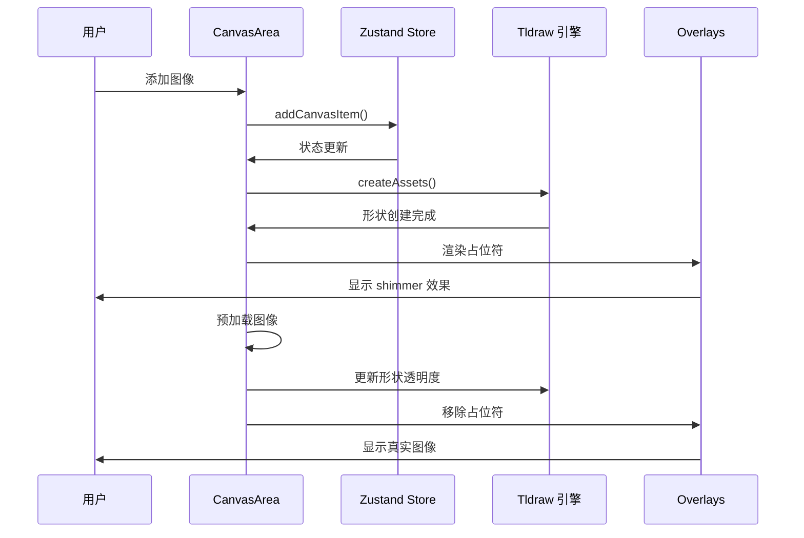

**图表来源**
- [components/canvas/CanvasArea.tsx:87-178](file://components/canvas/CanvasArea.tsx#L87-L178)
- [lib/store.ts:144-150](file://lib/store.ts#L144-L150)

**章节来源**
- [lib/store.ts:107-427](file://lib/store.ts#L107-L427)
- [lib/types.ts:18-86](file://lib/types.ts#L18-L86)

## 图像加载流程详解

### 1. 项目加载阶段

当用户打开画布页面时，系统会执行完整的项目加载流程，包含严格的验证和恢复机制：

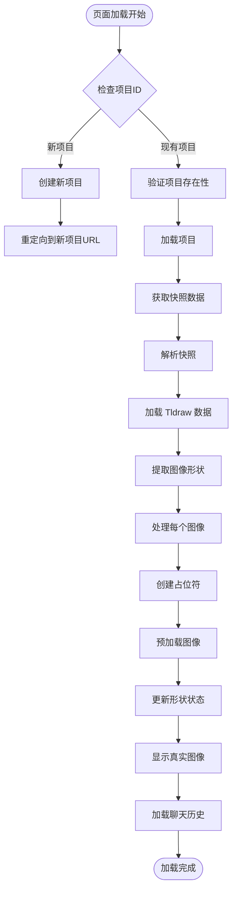

**更新** 新增项目验证步骤，防止无效项目ID触发自动保存

**图表来源**
- [app/canvas/page.tsx:38-177](file://app/canvas/page.tsx#L38-L177)
- [components/canvas/CanvasArea.tsx:87-178](file://components/canvas/CanvasArea.tsx#L87-L178)

### 2. 图像创建与上传流程

系统支持多种图像来源和处理方式，所有操作都经过严格的验证和状态管理。

#### 本地文件上传流程

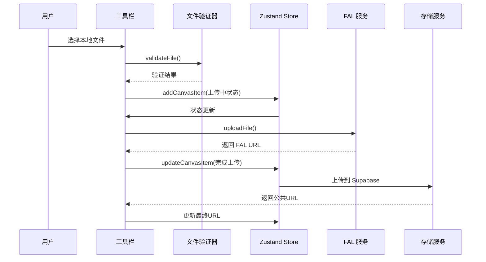

**图表来源**
- [components/canvas/Toolbar.tsx:284-342](file://components/canvas/Toolbar.tsx#L284-L342)
- [lib/fal.ts:155-169](file://lib/fal.ts#L155-L169)

#### AI 生成图像流程

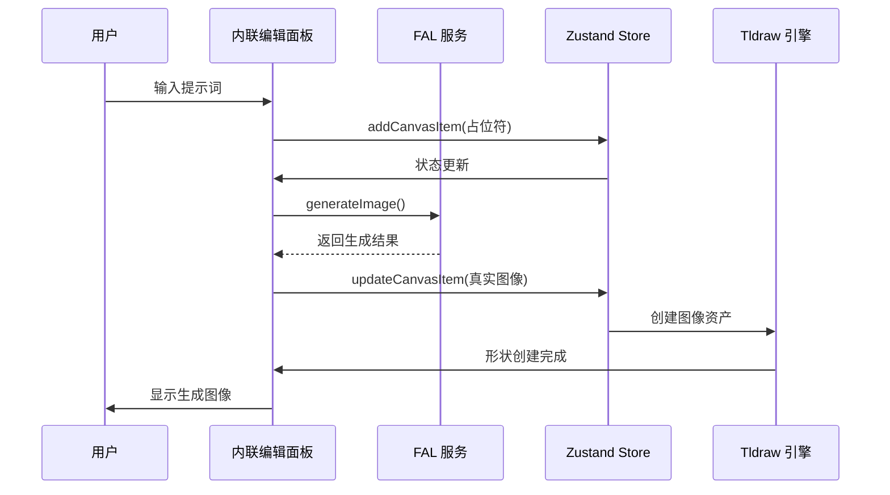

**图表来源**
- [components/canvas/InlineEditPanel.tsx:198-286](file://components/canvas/InlineEditPanel.tsx#L198-L286)
- [lib/fal.ts:45-109](file://lib/fal.ts#L45-L109)

### 3. 图像预加载与缓存策略

系统实现了多层次的图像缓存和预加载机制，确保最佳的用户体验。

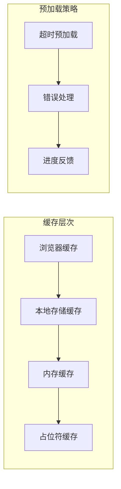

**图表来源**
- [app/canvas/page.tsx:130-155](file://app/canvas/page.tsx#L130-L155)
- [components/canvas/CanvasArea.tsx:73-85](file://components/canvas/CanvasArea.tsx#L73-L85)

**章节来源**
- [app/canvas/page.tsx:38-177](file://app/canvas/page.tsx#L38-L177)
- [components/canvas/CanvasArea.tsx:87-178](file://components/canvas/CanvasArea.tsx#L87-L178)
- [components/canvas/Toolbar.tsx:284-342](file://components/canvas/Toolbar.tsx#L284-L342)

## 存储与缓存机制

### 1. 存储架构设计

系统采用分层存储策略，结合本地存储和云端存储，确保数据的安全性和可靠性。

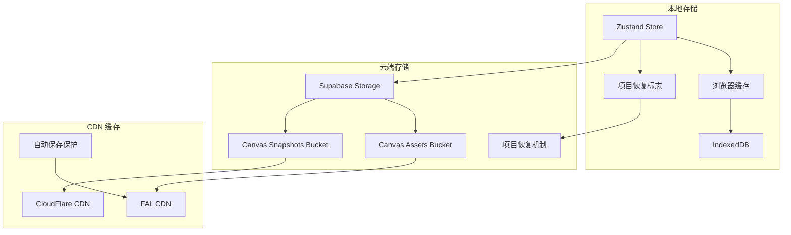

**图表来源**
- [lib/storage-service.ts:19-24](file://lib/storage-service.ts#L19-L24)
- [lib/store.ts:405-425](file://lib/store.ts#L405-L425)

### 2. 数据流管理

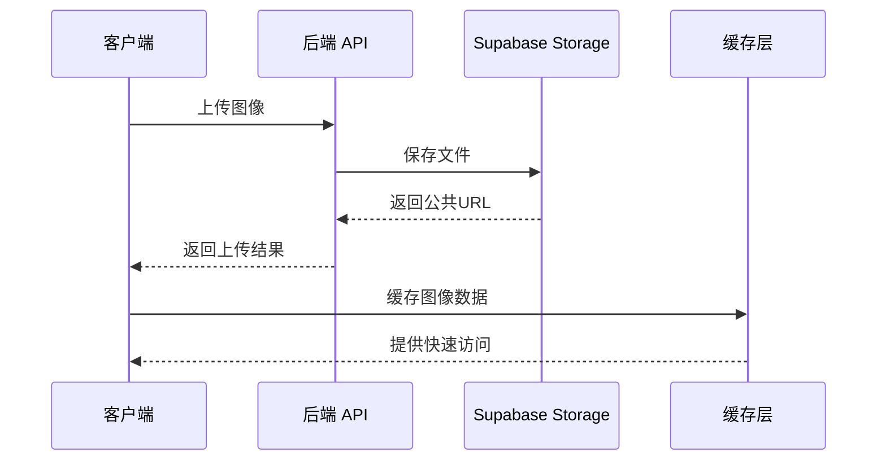

**图表来源**
- [app/api/upload-asset/route.ts:31-144](file://app/api/upload-asset/route.ts#L31-L144)
- [lib/storage-service.ts:65-113](file://lib/storage-service.ts#L65-L113)

### 3. 自动保存机制

系统实现了智能的自动保存功能，包含多重保护机制，确保数据安全和一致性。

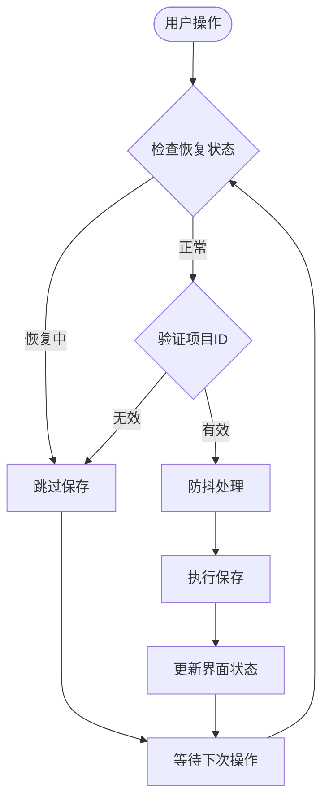

**更新** 新增项目ID验证和恢复状态检查，双重保护防止无效保存

**图表来源**
- [lib/project-service.ts:97-224](file://lib/project-service.ts#L97-L224)

**章节来源**
- [lib/storage-service.ts:19-324](file://lib/storage-service.ts#L19-L324)
- [app/api/upload-asset/route.ts:31-144](file://app/api/upload-asset/route.ts#L31-L144)
- [lib/project-service.ts:97-224](file://lib/project-service.ts#L97-L224)

## 性能优化策略

### 1. 图像加载优化

系统采用了多种性能优化技术，包括智能的初始化流程和状态管理。

#### 懒加载与预加载结合

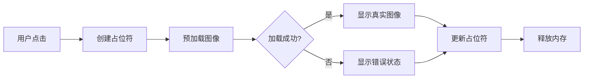

#### 内存管理优化

系统实现了智能的内存管理策略：

- **对象 URL 管理**：自动清理不再使用的 `blob:` URL
- **缓存淘汰机制**：定期清理过期的图像缓存
- **批量更新策略**：使用 `requestAnimationFrame` 进行批量状态更新
- **初始化去重**：防止重复初始化和状态冲突

### 2. 网络优化

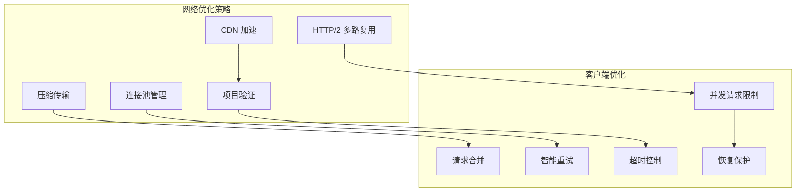

**更新** 新增项目验证和恢复保护机制

**章节来源**
- [app/canvas/page.tsx:130-155](file://app/canvas/page.tsx#L130-L155)
- [components/canvas/CanvasArea.tsx:685-715](file://components/canvas/CanvasArea.tsx#L685-L715)

## 错误处理与容错机制

### 1. 多层次错误处理

系统实现了从底层到用户界面的多层错误处理机制，特别增强了项目加载和恢复过程中的容错能力。

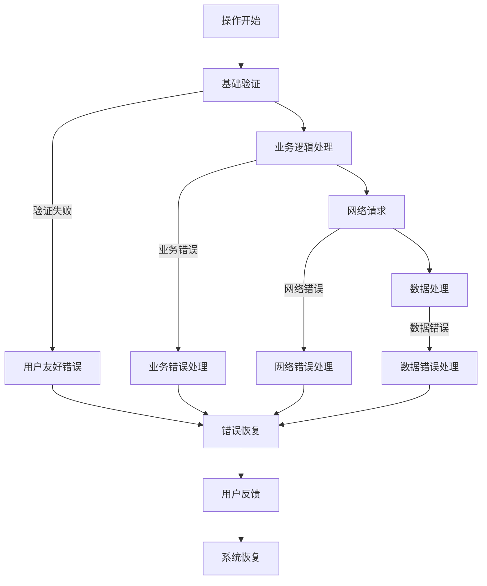

**更新** 新增项目加载验证和自动恢复机制

### 2. 容错机制

#### 自动重试机制

系统为关键操作实现了智能的自动重试：

- **指数退避算法**：重试间隔按指数增长
- **最大重试次数**：防止无限重试
- **条件判断**：仅对可恢复的错误进行重试

#### 状态回滚

对于可能失败的操作，系统提供了状态回滚机制：

- **事务性操作**：确保操作的原子性
- **状态备份**：在操作前备份当前状态
- **失败恢复**：自动恢复到备份状态

#### 项目恢复机制

**新增功能** 系统实现了智能的项目恢复机制：

- **项目验证**：加载前验证项目存在性
- **自动创建**：项目不存在时自动创建新项目
- **URL 重定向**：将用户重定向到有效的项目URL
- **错误降级**：加载失败时提供降级方案

**章节来源**
- [app/canvas/page.tsx:167-173](file://app/canvas/page.tsx#L167-L173)
- [lib/project-service.ts:114-173](file://lib/project-service.ts#L114-L173)

## 安全与权限控制

### 1. 身份验证

系统实现了多层身份验证机制，确保只有授权用户才能访问项目数据。

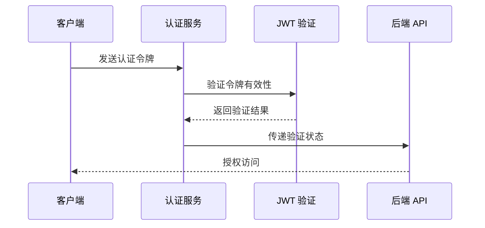

**图表来源**
- [app/api/upload-asset/route.ts:31-48](file://app/api/upload-asset/route.ts#L31-L48)

### 2. 权限控制

系统实现了细粒度的权限控制：

- **文件类型限制**：仅允许特定的图像格式
- **文件大小限制**：防止大文件上传
- **存储配额管理**：限制用户的存储使用量
- **访问权限控制**：区分公共资源和私有资源

### 3. 数据安全

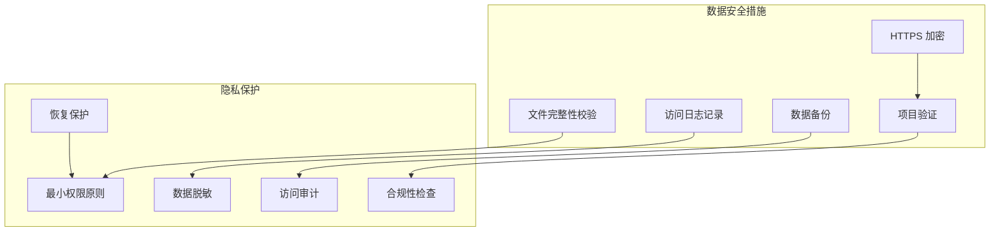

**更新** 新增项目验证和恢复保护机制

**章节来源**
- [app/api/upload-asset/route.ts:71-85](file://app/api/upload-asset/route.ts#L71-L85)
- [lib/validate.ts:1-14](file://lib/validate.ts#L1-L14)

## 故障排除指南

### 1. 常见问题诊断

#### 图像加载失败

**症状**：图像显示为占位符且无法加载

**可能原因**：
- 网络连接问题
- CDN 缓存异常
- 文件权限问题
- 浏览器缓存问题

**解决方案**：
1. 检查网络连接状态
2. 清除浏览器缓存
3. 验证文件权限设置
4. 重新上传文件

#### 自动保存失败

**症状**：项目更改未保存

**可能原因**：
- 网络连接中断
- 服务器错误
- 存储空间不足
- 权限问题
- **项目ID无效**：这是新增的问题

**解决方案**：
1. 检查网络连接
2. 查看服务器状态
3. 清理存储空间
4. 验证用户权限
5. **验证项目ID有效性**：确保项目URL中的ID正确

#### 项目加载失败

**症状**：画布无法正常加载项目

**可能原因**：
- 无效的项目ID
- 项目不存在
- 网络连接问题
- 权限不足

**解决方案**：
1. 检查项目URL是否正确
2. 验证项目是否存在
3. 确认用户权限
4. 尝试重新登录
5. 系统会自动创建新项目作为恢复方案

### 2. 性能问题排查

#### 内存泄漏

**症状**：应用运行时间越长越慢

**排查步骤**：
1. 检查 `blob:` URL 是否正确清理
2. 验证缓存策略是否合理
3. 监控内存使用情况
4. 查找未释放的事件监听器

#### 加载缓慢

**症状**：图像加载时间过长

**优化建议**：
1. 启用 CDN 加速
2. 优化图像压缩
3. 实现懒加载
4. 减少并发请求数

**章节来源**
- [app/canvas/page.tsx:167-173](file://app/canvas/page.tsx#L167-L173)
- [components/canvas/CanvasArea.tsx:130-137](file://components/canvas/CanvasArea.tsx#L130-L137)

## 总结

画布图像加载机制是一个复杂而精良的系统，通过最新的更新实现了更强大的数据保护和恢复能力。以下是该系统的最新优势：

### 核心优势

1. **增强的项目验证**：防止无效项目ID触发自动保存操作
2. **智能恢复机制**：项目不存在时自动创建新项目
3. **多重安全保护**：双重检查防止数据丢失
4. **稳定的初始化流程**：避免重复初始化和状态冲突
5. **可靠的错误处理**：完善的降级和恢复策略

### 技术亮点

- **智能缓存策略**：结合本地缓存、云端缓存和 CDN 加速
- **实时预览功能**：支持图像上传过程中的实时预览
- **自动保存机制**：防止数据丢失的智能保存策略
- **错误恢复能力**：完善的错误处理和自动恢复机制
- **项目恢复保护**：防止无效项目ID导致的数据安全问题

### 未来发展

该系统为未来的功能扩展奠定了良好的基础，包括：
- 更高级的图像处理功能
- AI 驱动的图像生成和编辑
- 更丰富的协作功能
- 增强的性能监控和优化
- 更智能的项目管理和恢复机制

通过持续的优化和改进，该图像加载机制将继续为用户提供卓越的图像处理体验，同时确保数据的安全性和系统的稳定性。