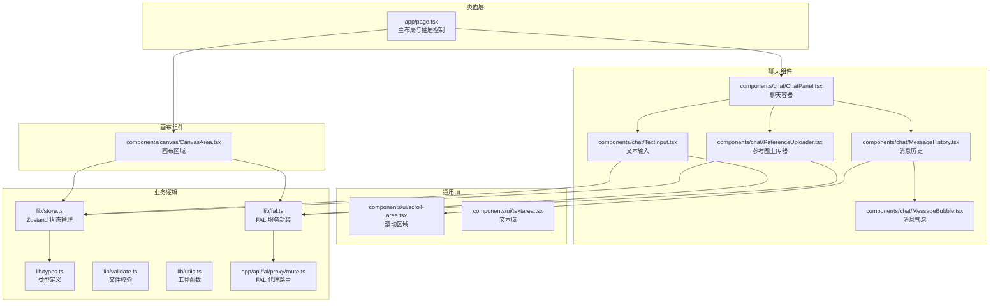
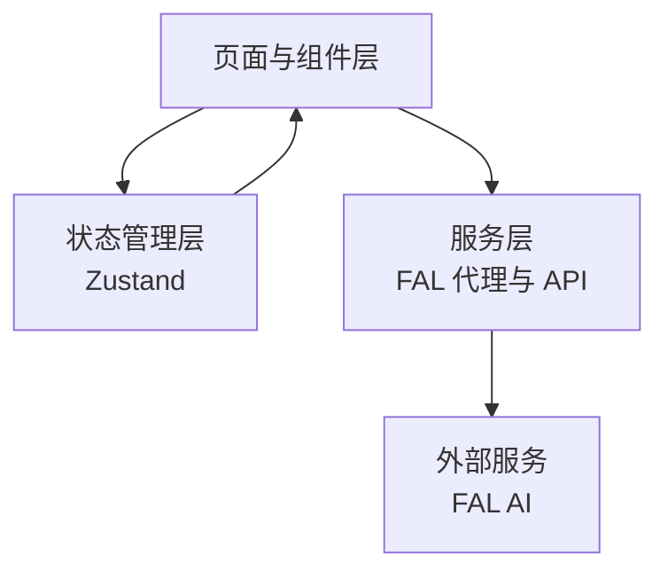
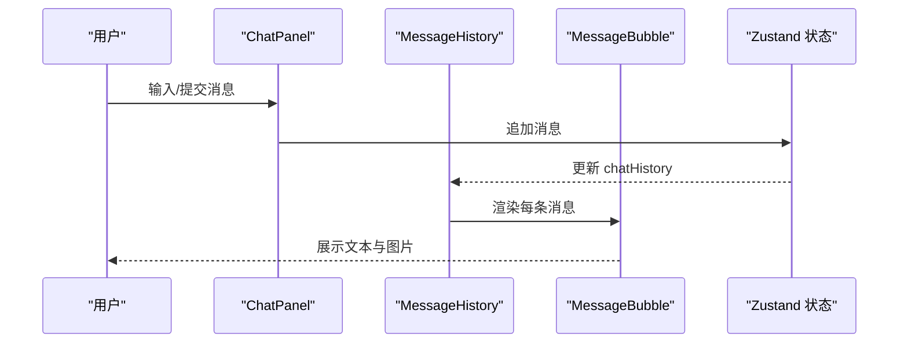
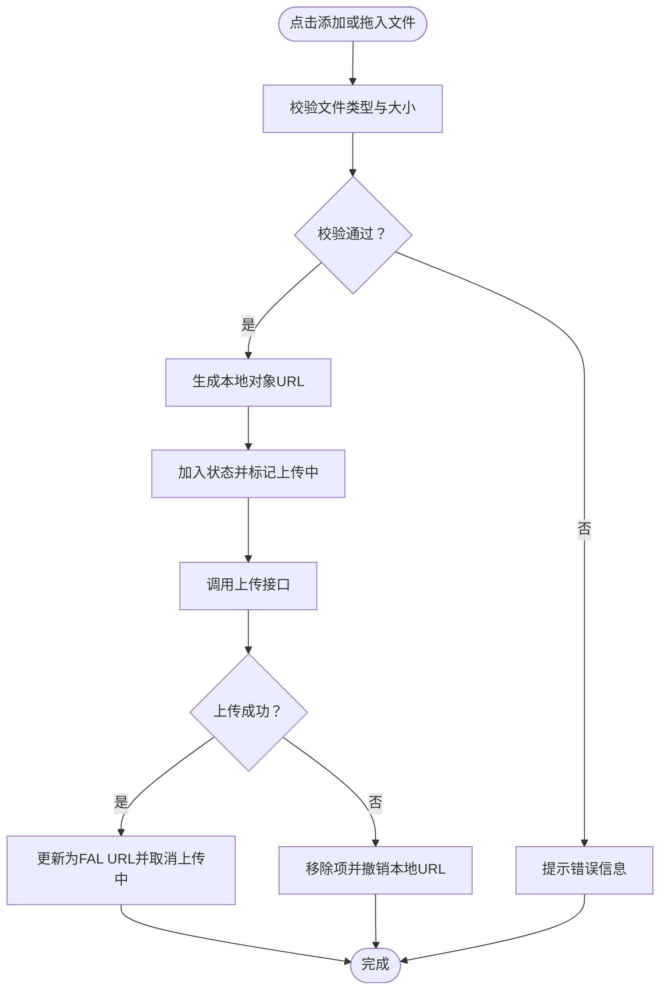
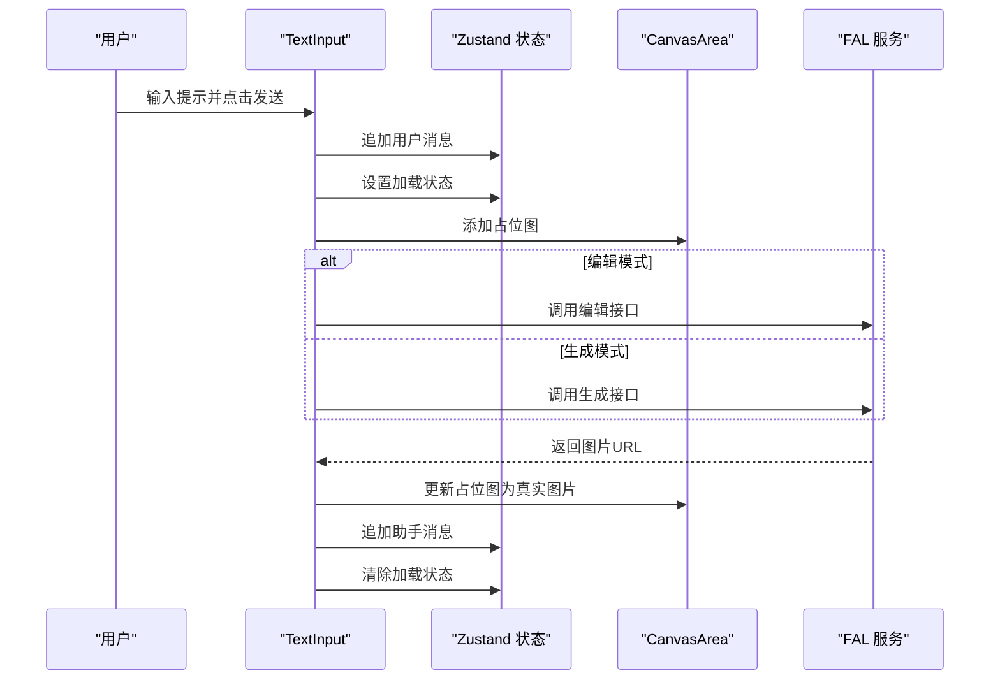
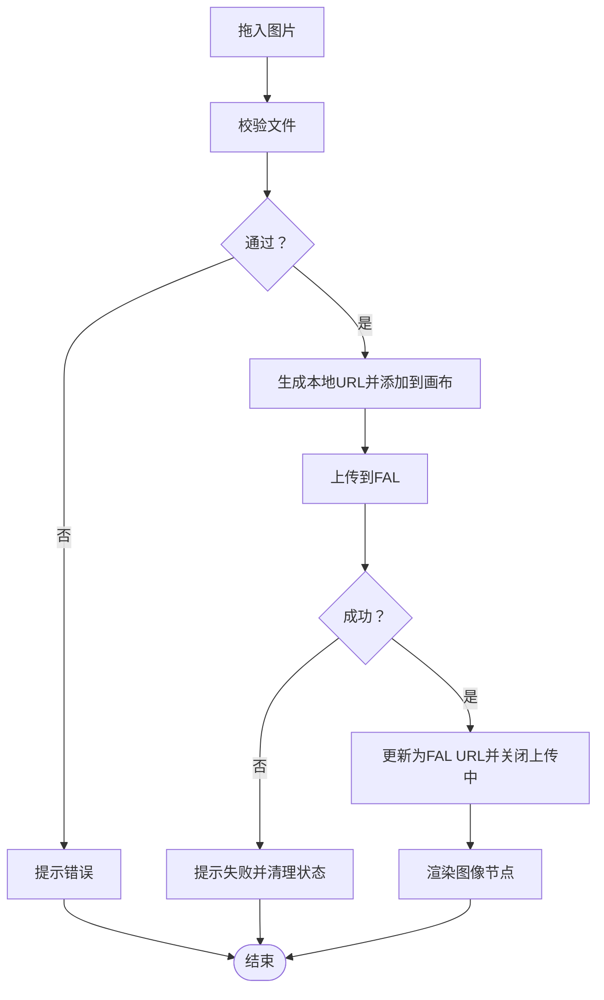
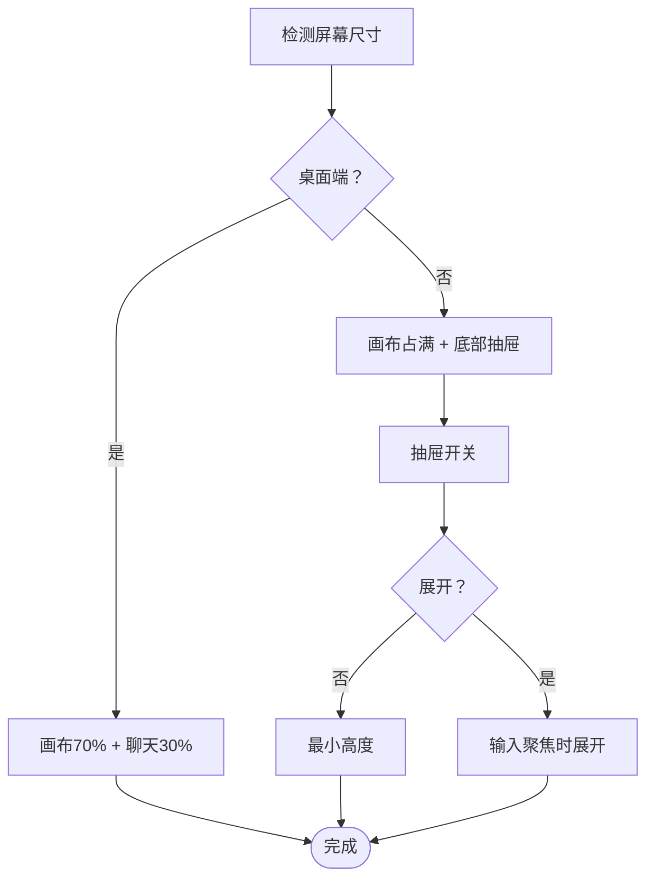
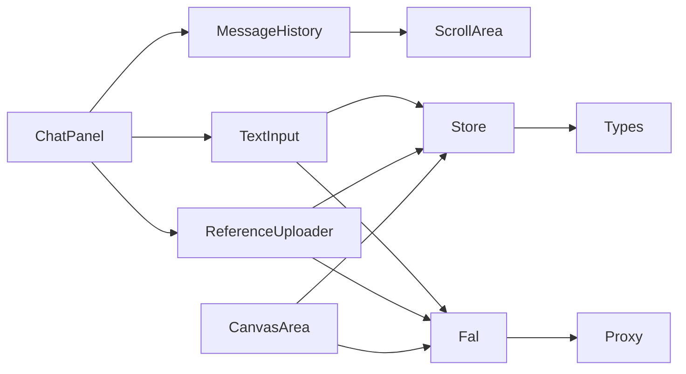

# 聊天界面系统

<cite>
**本文档引用的文件**
- [app/page.tsx](file://app/page.tsx)
- [components/chat/ChatPanel.tsx](file://components/chat/ChatPanel.tsx)
- [components/chat/MessageHistory.tsx](file://components/chat/MessageHistory.tsx)
- [components/chat/MessageBubble.tsx](file://components/chat/MessageBubble.tsx)
- [components/chat/ReferenceUploader.tsx](file://components/chat/ReferenceUploader.tsx)
- [components/chat/TextInput.tsx](file://components/chat/TextInput.tsx)
- [components/canvas/CanvasArea.tsx](file://components/canvas/CanvasArea.tsx)
- [components/ui/scroll-area.tsx](file://components/ui/scroll-area.tsx)
- [components/ui/textarea.tsx](file://components/ui/textarea.tsx)
- [lib/store.ts](file://lib/store.ts)
- [lib/types.ts](file://lib/types.ts)
- [lib/fal.ts](file://lib/fal.ts)
- [lib/validate.ts](file://lib/validate.ts)
- [lib/utils.ts](file://lib/utils.ts)
- [app/api/fal/proxy/route.ts](file://app/api/fal/proxy/route.ts)
- [README.md](file://README.md)
</cite>

## 目录
1. [简介](#简介)
2. [项目结构](#项目结构)
3. [核心组件](#核心组件)
4. [架构总览](#架构总览)
5. [详细组件分析](#详细组件分析)
6. [依赖关系分析](#依赖关系分析)
7. [性能考虑](#性能考虑)
8. [故障排除指南](#故障排除指南)
9. [结论](#结论)
10. [附录](#附录)

## 简介
本项目是一个基于 Next.js 的 AI 创意设计平台，提供聊天驱动的图像生成与编辑体验。聊天界面系统负责接收用户输入、管理消息历史、渲染消息气泡、处理参考图片上传，并与画布系统协同完成从自然语言提示到图像生成的完整工作流程。系统采用 Zustand 状态管理，结合 FAL AI 服务与本地存储，确保跨会话的消息持久化与流畅的用户体验。

## 项目结构
应用采用按功能模块划分的组织方式：页面级布局位于 app 目录，聊天组件位于 components/chat，画布组件位于 components/canvas，通用 UI 组件位于 components/ui，业务逻辑与类型定义位于 lib 目录。

**图表来源**
- [app/page.tsx:1-59](file://app/page.tsx#L1-L59)
- [components/chat/ChatPanel.tsx:1-22](file://components/chat/ChatPanel.tsx#L1-L22)
- [components/chat/MessageHistory.tsx:1-37](file://components/chat/MessageHistory.tsx#L1-L37)
- [components/chat/MessageBubble.tsx:1-33](file://components/chat/MessageBubble.tsx#L1-L33)
- [components/chat/ReferenceUploader.tsx:1-100](file://components/chat/ReferenceUploader.tsx#L1-L100)
- [components/chat/TextInput.tsx:1-140](file://components/chat/TextInput.tsx#L1-L140)
- [components/canvas/CanvasArea.tsx:1-431](file://components/canvas/CanvasArea.tsx#L1-L431)
- [components/ui/scroll-area.tsx:1-56](file://components/ui/scroll-area.tsx#L1-L56)
- [components/ui/textarea.tsx:1-19](file://components/ui/textarea.tsx#L1-L19)
- [lib/store.ts:1-119](file://lib/store.ts#L1-L119)
- [lib/types.ts:1-37](file://lib/types.ts#L1-L37)
- [lib/fal.ts:1-62](file://lib/fal.ts#L1-L62)
- [lib/validate.ts:1-14](file://lib/validate.ts#L1-L14)
- [lib/utils.ts:1-7](file://lib/utils.ts#L1-L7)
- [app/api/fal/proxy/route.ts:1-4](file://app/api/fal/proxy/route.ts#L1-L4)

**章节来源**
- [app/page.tsx:1-59](file://app/page.tsx#L1-L59)
- [README.md:1-37](file://README.md#L1-L37)

## 核心组件
- 聊天面板容器：整合标题、消息历史、参考图上传器与文本输入组件，提供统一的聊天入口。
- 消息历史：基于 Zustand 状态管理渲染消息列表，自动滚动至最新消息；空状态时显示引导文案。
- 消息气泡：根据消息角色（用户/助手）渲染不同样式，支持显示生成结果图片。
- 参考图上传器：限制数量与格式，本地预览与云端上传并行，上传中显示加载指示。
- 文本输入：支持多行自适应高度、回车发送、禁用态与提示文案切换；集成编辑模式与占位图生成。
- 画布区域：基于 Konva 的可拖拽缩放画布，支持占位图动画、选择与变换、下载与清理操作。
- 状态管理：Zustand 提供持久化存储（仅聊天历史）与会话状态（画布、参考图、编辑模式等）。
- 服务封装：FAL 服务封装生成、编辑与上传接口，通过 Next.js API 路由代理避免 CORS 问题。

**章节来源**
- [components/chat/ChatPanel.tsx:1-22](file://components/chat/ChatPanel.tsx#L1-L22)
- [components/chat/MessageHistory.tsx:1-37](file://components/chat/MessageHistory.tsx#L1-L37)
- [components/chat/MessageBubble.tsx:1-33](file://components/chat/MessageBubble.tsx#L1-L33)
- [components/chat/ReferenceUploader.tsx:1-100](file://components/chat/ReferenceUploader.tsx#L1-L100)
- [components/chat/TextInput.tsx:1-140](file://components/chat/TextInput.tsx#L1-L140)
- [components/canvas/CanvasArea.tsx:1-431](file://components/canvas/CanvasArea.tsx#L1-L431)
- [lib/store.ts:1-119](file://lib/store.ts#L1-L119)
- [lib/fal.ts:1-62](file://lib/fal.ts#L1-L62)

## 架构总览
聊天界面系统采用“页面布局 + 组件分层 + 状态管理 + 服务代理”的架构。页面层负责响应式布局与移动端抽屉控制；聊天层负责消息与输入；画布层负责图像展示与编辑；状态层统一管理数据与行为；服务层通过代理路由对接外部 AI 服务。

**图表来源**
- [app/page.tsx:1-59](file://app/page.tsx#L1-L59)
- [lib/store.ts:1-119](file://lib/store.ts#L1-L119)
- [lib/fal.ts:1-62](file://lib/fal.ts#L1-L62)
- [app/api/fal/proxy/route.ts:1-4](file://app/api/fal/proxy/route.ts#L1-L4)

## 详细组件分析

### 聊天面板与消息历史
- 消息历史组件监听状态中的聊天记录，使用滚动区域组件实现垂直滚动；每次新增消息自动滚动到底部。
- 当无消息时显示引导文案，提升首次使用体验。
- 消息气泡根据角色渲染不同的背景色与边框，支持在助手消息中显示生成的图片链接。

**图表来源**
- [components/chat/ChatPanel.tsx:1-22](file://components/chat/ChatPanel.tsx#L1-L22)
- [components/chat/MessageHistory.tsx:1-37](file://components/chat/MessageHistory.tsx#L1-L37)
- [components/chat/MessageBubble.tsx:1-33](file://components/chat/MessageBubble.tsx#L1-L33)
- [lib/store.ts:1-119](file://lib/store.ts#L1-L119)

**章节来源**
- [components/chat/MessageHistory.tsx:1-37](file://components/chat/MessageHistory.tsx#L1-L37)
- [components/chat/MessageBubble.tsx:1-33](file://components/chat/MessageBubble.tsx#L1-L33)

### 参考图片上传器
- 功能要点：
  - 文件类型与大小限制，超出限制即时提示。
  - 本地生成对象 URL 预览，同时异步上传至 FAL 存储。
  - 上传中显示旋转指示器，成功后更新状态；失败则移除并撤销本地 URL。
  - 最大数量限制，按钮动态显示以控制添加行为。
- 错误处理：网络异常与上传失败均通过全局提示反馈。

**图表来源**
- [components/chat/ReferenceUploader.tsx:1-100](file://components/chat/ReferenceUploader.tsx#L1-L100)
- [lib/validate.ts:1-14](file://lib/validate.ts#L1-L14)
- [lib/fal.ts:59-62](file://lib/fal.ts#L59-L62)

**章节来源**
- [components/chat/ReferenceUploader.tsx:1-100](file://components/chat/ReferenceUploader.tsx#L1-L100)
- [lib/validate.ts:1-14](file://lib/validate.ts#L1-L14)

### 文本输入与消息状态管理
- 交互设计：
  - 多行自适应高度，最大高度限制，输入时自动调整。
  - 支持回车发送，Ctrl/Cmd+Enter 换行。
  - 禁用态：当处于加载或存在未完成上传时禁用发送。
  - 占位符：根据是否处于编辑模式显示不同提示。
- 状态管理：
  - 发送前追加用户消息，设置加载状态。
  - 在画布上添加占位图，计算位置与尺寸。
  - 调用生成或编辑接口，成功后更新占位图为真实图片并追加助手消息。
  - 失败时移除占位图并提示错误。
- 实时反馈：加载指示器、上传中提示、错误提示。

**图表来源**
- [components/chat/TextInput.tsx:1-140](file://components/chat/TextInput.tsx#L1-L140)
- [lib/store.ts:1-119](file://lib/store.ts#L1-L119)
- [lib/fal.ts:21-61](file://lib/fal.ts#L21-L61)
- [components/canvas/CanvasArea.tsx:1-431](file://components/canvas/CanvasArea.tsx#L1-L431)

**章节来源**
- [components/chat/TextInput.tsx:1-140](file://components/chat/TextInput.tsx#L1-L140)
- [lib/store.ts:1-119](file://lib/store.ts#L1-L119)

### 画布系统与数据流转
- 占位图动画：使用 Konva 渐变矩形实现“呼吸”效果，提升生成等待体验。
- 图像节点：支持拖拽、缩放与变换，自动计算最佳尺寸，保持比例。
- 选择与编辑：选中图像进入编辑模式，启用编辑目标状态。
- 文件拖放：支持拖入本地图片，生成本地预览并上传至 FAL，完成后更新状态。
- 下载与清理：一键下载当前选中或最后生成的图片，支持清空画布或删除单个元素。

**图表来源**
- [components/canvas/CanvasArea.tsx:1-431](file://components/canvas/CanvasArea.tsx#L1-L431)
- [lib/validate.ts:1-14](file://lib/validate.ts#L1-L14)
- [lib/fal.ts:59-62](file://lib/fal.ts#L59-L62)

**章节来源**
- [components/canvas/CanvasArea.tsx:1-431](file://components/canvas/CanvasArea.tsx#L1-L431)

### 页面布局与移动端适配
- 桌面端：画布与聊天侧栏并排显示，按屏幕宽度分配比例。
- 移动端：画布占满上方空间，聊天以底部抽屉形式呈现，支持展开/收起。
- 抽屉切换：点击按钮切换高度，输入聚焦时自动展开抽屉。

**图表来源**
- [app/page.tsx:1-59](file://app/page.tsx#L1-L59)

**章节来源**
- [app/page.tsx:1-59](file://app/page.tsx#L1-L59)

## 依赖关系分析
- 组件耦合：
  - ChatPanel 作为容器聚合其他聊天子组件，低耦合高内聚。
  - MessageHistory 依赖 ScrollArea 与 Zustand，职责单一。
  - TextInput 与 ReferenceUploader 均依赖 Zustand 状态与 FAL 服务。
  - CanvasArea 与 TextInput/ReferenceUploader 共享状态，形成跨组件协作。
- 外部依赖：
  - FAL 服务通过 Next.js API 路由代理，避免浏览器 CORS 限制。
  - Base UI 的 ScrollArea 提供可访问性友好的滚动区域。
  - Tailwind CSS 与 clsx/twMerge 提升样式组合效率与一致性。

**图表来源**
- [components/chat/ChatPanel.tsx:1-22](file://components/chat/ChatPanel.tsx#L1-L22)
- [components/chat/MessageHistory.tsx:1-37](file://components/chat/MessageHistory.tsx#L1-L37)
- [components/chat/ReferenceUploader.tsx:1-100](file://components/chat/ReferenceUploader.tsx#L1-L100)
- [components/chat/TextInput.tsx:1-140](file://components/chat/TextInput.tsx#L1-L140)
- [components/canvas/CanvasArea.tsx:1-431](file://components/canvas/CanvasArea.tsx#L1-L431)
- [lib/store.ts:1-119](file://lib/store.ts#L1-L119)
- [lib/fal.ts:1-62](file://lib/fal.ts#L1-L62)
- [app/api/fal/proxy/route.ts:1-4](file://app/api/fal/proxy/route.ts#L1-L4)

**章节来源**
- [lib/store.ts:1-119](file://lib/store.ts#L1-L119)
- [lib/types.ts:1-37](file://lib/types.ts#L1-L37)
- [lib/fal.ts:1-62](file://lib/fal.ts#L1-L62)

## 性能考虑
- 状态持久化：聊天历史使用持久化存储，减少重复加载成本。
- 滚动优化：消息历史仅在新消息到达时触发平滑滚动，避免频繁重排。
- 图片尺寸：占位图在首张图片加载完成后按比例计算尺寸，避免布局抖动。
- 上传并发：参考图上传独立于消息发送，避免阻塞主流程。
- 代理路由：通过 Next.js API 路由代理 FAL 请求，减少跨域与证书问题带来的性能损耗。

## 故障排除指南
- 上传失败：
  - 现象：上传中指示器持续显示或提示失败。
  - 排查：检查网络连接与 FAL 凭据配置；确认代理路由正常。
  - 处理：移除失败项并重新尝试上传。
- 无法生成：
  - 现象：发送后无响应或报错。
  - 排查：确认提示词与参考图符合要求；检查编辑模式下的目标图是否有效。
  - 处理：清理占位图并重试；查看网络错误提示。
- 拖入图片无效：
  - 现象：拖入后无反应。
  - 排查：检查文件类型与大小限制；确认画布处于可用状态。
  - 处理：更换文件格式或尺寸后重试。

**章节来源**
- [components/chat/ReferenceUploader.tsx:1-100](file://components/chat/ReferenceUploader.tsx#L1-L100)
- [components/chat/TextInput.tsx:1-140](file://components/chat/TextInput.tsx#L1-L140)
- [components/canvas/CanvasArea.tsx:1-431](file://components/canvas/CanvasArea.tsx#L1-L431)
- [lib/validate.ts:1-14](file://lib/validate.ts#L1-L14)

## 结论
聊天界面系统通过清晰的组件分层与状态管理，实现了从消息输入到图像生成的完整闭环。参考图上传器与文本输入组件的协作，配合画布的可视化编辑能力，为用户提供直观高效的创意工作流。系统在可访问性、移动端适配与错误处理方面均有良好实践，具备良好的扩展性与维护性。

## 附录
- 自定义选项与扩展建议：
  - 主题与样式：通过 Tailwind 类名与 cn 工具函数扩展主题变量。
  - 新增消息类型：在类型定义中扩展消息结构，组件层按需渲染。
  - 扩展上传协议：替换或扩展上传函数以支持更多存储后端。
  - 增强编辑能力：在编辑模式下增加更多参数与预设。
- 无障碍访问：
  - 使用语义化标签与 aria 属性，如抽屉按钮的 aria-label。
  - 保证键盘导航与焦点可见性，如文本域的聚焦与禁用态。
  - 滚动区域提供可访问性增强，确保屏幕阅读器友好。

**章节来源**
- [lib/utils.ts:1-7](file://lib/utils.ts#L1-L7)
- [app/page.tsx:1-59](file://app/page.tsx#L1-L59)
- [components/ui/scroll-area.tsx:1-56](file://components/ui/scroll-area.tsx#L1-L56)
- [components/ui/textarea.tsx:1-19](file://components/ui/textarea.tsx#L1-L19)