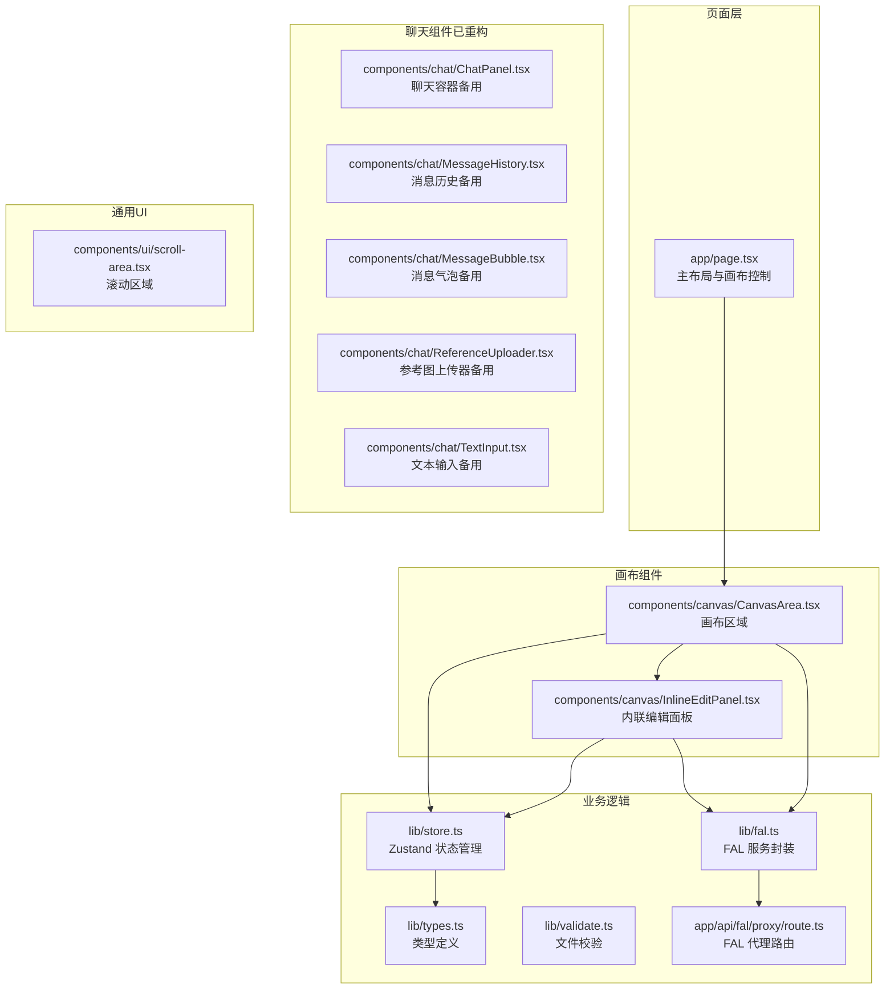
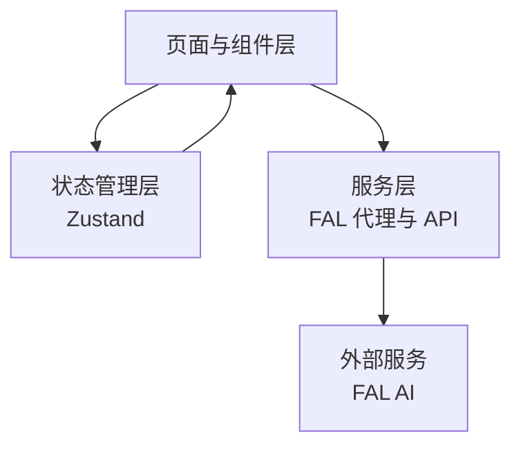
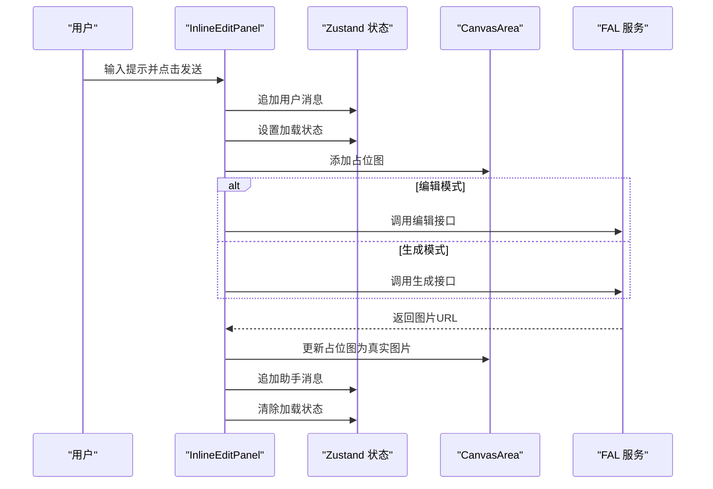
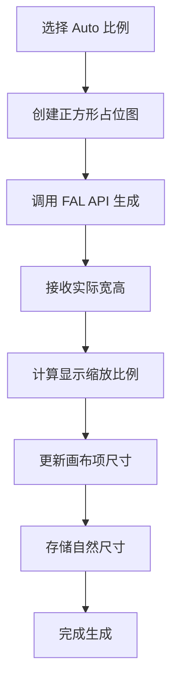
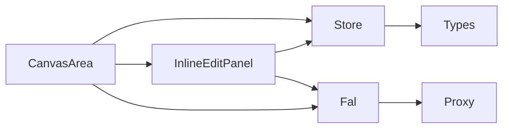

# 聊天界面系统

<cite>
**本文档引用的文件**
- [app/page.tsx](file://app/page.tsx)
- [components/canvas/CanvasArea.tsx](file://components/canvas/CanvasArea.tsx)
- [components/canvas/InlineEditPanel.tsx](file://components/canvas/InlineEditPanel.tsx)
- [components/chat/ChatPanel.tsx](file://components/chat/ChatPanel.tsx)
- [components/chat/MessageHistory.tsx](file://components/chat/MessageHistory.tsx)
- [components/chat/MessageBubble.tsx](file://components/chat/MessageBubble.tsx)
- [components/chat/ReferenceUploader.tsx](file://components/chat/ReferenceUploader.tsx)
- [components/chat/TextInput.tsx](file://components/chat/TextInput.tsx)
- [components/ui/scroll-area.tsx](file://components/ui/scroll-area.tsx)
- [lib/store.ts](file://lib/store.ts)
- [lib/types.ts](file://lib/types.ts)
- [lib/fal.ts](file://lib/fal.ts)
- [lib/validate.ts](file://lib/validate.ts)
- [app/api/fal/proxy/route.ts](file://app/api/fal/proxy/route.ts)
</cite>

## 更新摘要
**变更内容**
- 重构了架构概述，反映应用从聊天驱动转向画布编辑主导的设计
- 更新了核心组件部分，重点介绍内联编辑面板替代聊天功能的新架构
- 修改了详细组件分析，删除聊天相关组件的分析，新增内联编辑面板的详细说明
- 更新了依赖关系分析，反映新的组件协作模式
- 修正了页面布局与移动端适配章节，移除抽屉控制相关内容
- 更新了故障排除指南，针对新的画布编辑工作流

## 目录
1. [简介](#简介)
2. [项目结构](#项目结构)
3. [核心组件](#核心组件)
4. [架构总览](#架构总览)
5. [详细组件分析](#详细组件分析)
6. [依赖关系分析](#依赖关系分析)
7. [性能考虑](#性能考虑)
8. [故障排除指南](#故障排除指南)
9. [结论](#结论)
10. [附录](#附录)

## 简介
本项目是一个基于 Next.js 的 AI 创意设计平台，现已演进为以画布编辑为核心的图像生成与编辑体验。应用采用内联编辑面板替代传统的聊天界面，提供更直接的图像编辑工作流。系统通过内联编辑面板实现从自然语言提示到图像生成的无缝编辑体验，结合画布的可视化编辑能力，为用户提供直观高效的创意工作流。系统采用 Zustand 状态管理，结合 FAL AI 服务与本地存储，确保跨会话的消息持久化与流畅的用户体验。

## 项目结构
应用采用按功能模块划分的组织方式：页面级布局位于 app 目录，画布组件位于 components/canvas，聊天组件仍保留在 components/chat 中但不再使用，通用 UI 组件位于 components/ui，业务逻辑与类型定义位于 lib 目录。

**图表来源**
- [app/page.tsx:1-10](file://app/page.tsx#L1-L10)
- [components/canvas/CanvasArea.tsx:1-508](file://components/canvas/CanvasArea.tsx#L1-L508)
- [components/canvas/InlineEditPanel.tsx:1-333](file://components/canvas/InlineEditPanel.tsx#L1-L333)
- [components/chat/ChatPanel.tsx:1-22](file://components/chat/ChatPanel.tsx#L1-L22)
- [components/chat/MessageHistory.tsx:1-37](file://components/chat/MessageHistory.tsx#L1-L37)
- [components/chat/MessageBubble.tsx:1-33](file://components/chat/MessageBubble.tsx#L1-L33)
- [components/chat/ReferenceUploader.tsx:1-100](file://components/chat/ReferenceUploader.tsx#L1-L100)
- [components/chat/TextInput.tsx:1-140](file://components/chat/TextInput.tsx#L1-L140)
- [lib/store.ts:1-176](file://lib/store.ts#L1-L176)
- [lib/types.ts:1-37](file://lib/types.ts#L1-L37)
- [lib/fal.ts:1-62](file://lib/fal.ts#L1-L62)
- [lib/validate.ts:1-14](file://lib/validate.ts#L1-L14)
- [app/api/fal/proxy/route.ts:1-4](file://app/api/fal/proxy/route.ts#L1-L4)

**章节来源**
- [app/page.tsx:1-10](file://app/page.tsx#L1-L10)
- [README.md:1-37](file://README.md#L1-L37)

## 核心组件
- **内联编辑面板**：作为聊天功能的替代方案，提供内联的文本输入、参考图上传和图像生成/编辑功能，与选中的画布元素紧密集成。
- **画布区域**：基于 Konva 的可拖拽缩放画布，支持占位图动画、选择与变换、下载与清理操作，以及内联编辑面板的同步显示。
- **状态管理**：Zustand 提供持久化存储（聊天历史）与会话状态（画布、编辑模式等），支持跨组件的状态共享。
- **服务封装**：FAL 服务封装生成、编辑与上传接口，通过 Next.js API 路由代理避免 CORS 问题。
- **文件验证**：统一的文件类型和大小验证，支持 JPG/PNG/WebP 格式，最大 10MB。
- **占位图动画**：使用 Konva 渐变矩形实现"呼吸"效果，提升生成等待体验。

**章节来源**
- [components/canvas/InlineEditPanel.tsx:1-333](file://components/canvas/InlineEditPanel.tsx#L1-L333)
- [components/canvas/CanvasArea.tsx:1-508](file://components/canvas/CanvasArea.tsx#L1-L508)
- [lib/store.ts:1-176](file://lib/store.ts#L1-L176)
- [lib/fal.ts:1-62](file://lib/fal.ts#L1-L62)
- [lib/validate.ts:1-14](file://lib/validate.ts#L1-L14)

## 架构总览
应用架构已从传统的聊天驱动模式转变为画布编辑主导模式。内联编辑面板作为聊天功能的替代方案，与画布系统深度集成，提供更直接的图像编辑体验。页面层负责简单的画布展示，画布层提供编辑功能，状态层统一管理数据，服务层通过代理路由对接外部 AI 服务。

**图表来源**
- [app/page.tsx:1-10](file://app/page.tsx#L1-L10)
- [lib/store.ts:1-176](file://lib/store.ts#L1-L176)
- [lib/fal.ts:1-62](file://lib/fal.ts#L1-L62)
- [app/api/fal/proxy/route.ts:1-4](file://app/api/fal/proxy/route.ts#L1-L4)

## 详细组件分析

### 内联编辑面板
内联编辑面板作为聊天功能的替代方案，提供与选中画布元素紧密集成的编辑体验。该组件支持内联文本输入、参考图上传、图像生成和编辑功能。

- **交互设计**：
  - 多行自适应高度，最大高度限制，输入时自动调整。
  - 支持回车发送，Shift+Enter 换行。
  - 禁用态：当处于加载或存在未完成上传时禁用发送。
  - 占位符：显示"描述你想如何编辑..."提示。
- **参考图管理**：
  - 支持最多 6 张参考图，本地预览与云端上传并行。
  - 上传中显示旋转指示器，成功后更新状态；失败则移除并撤销本地 URL。
  - 支持拖拽排序和拖拽到文本框的功能。
- **状态管理**：
  - 发送前追加用户消息，设置加载状态。
  - 在画布上添加占位图，计算位置与尺寸。
  - 调用生成或编辑接口，成功后更新占位图为真实图片并追加助手消息。
  - 失败时移除占位图并提示错误。

**图表来源**
- [components/canvas/InlineEditPanel.tsx:98-163](file://components/canvas/InlineEditPanel.tsx#L98-L163)
- [lib/store.ts:151-157](file://lib/store.ts#L151-L157)
- [lib/fal.ts:21-61](file://lib/fal.ts#L21-L61)
- [components/canvas/CanvasArea.tsx:427-443](file://components/canvas/CanvasArea.tsx#L427-L443)

**章节来源**
- [components/canvas/InlineEditPanel.tsx:1-333](file://components/canvas/InlineEditPanel.tsx#L1-L333)

### 聊天面板与维度计算优化
聊天面板经过重大优化，特别是在 aspect ratio 'auto' 模式的处理上。系统现在能够正确处理 FAL API 返回的实际宽度和高度值，提供更精确的图像尺寸管理。

- **aspect ratio 'auto' 模式增强**：
  - 占位阶段使用正方形作为默认占位，因为 'auto' 比例下实际尺寸未知
  - 生成完成后使用 FAL 返回的实际宽高进行精确计算
  - 保持显示尺寸的一致性，避免比例失真
- **维度计算逻辑改进**：
  - 占位图阶段：使用 1:1 比例的正方形作为临时占位
  - 实际生成阶段：根据 FAL 返回的精确宽高计算显示尺寸
  - 最大显示尺寸限制为 480px，确保界面响应性
- **自然尺寸支持**：
  - 新增 naturalWidth 和 naturalHeight 字段存储原始图像尺寸
  - 支持后续编辑和导出时使用原始分辨率
  - 与占位图的显示尺寸分离，提供更灵活的尺寸管理

**图表来源**
- [components/chat/ChatPanel.tsx:219-240](file://components/chat/ChatPanel.tsx#L219-L240)
- [components/chat/ChatPanel.tsx:290-332](file://components/chat/ChatPanel.tsx#L290-L332)
- [lib/fal.ts:34-70](file://lib/fal.ts#L34-L70)

**章节来源**
- [components/chat/ChatPanel.tsx:1-680](file://components/chat/ChatPanel.tsx#L1-L680)
- [lib/fal.ts:1-109](file://lib/fal.ts#L1-L109)
- [lib/types.ts:18-32](file://lib/types.ts#L18-L32)

### 画布系统与数据流转
画布系统提供完整的图像编辑体验，支持拖拽、缩放、变换和下载功能。内联编辑面板与画布元素同步显示，提供无缝的编辑工作流。

- **占位图动画**：使用 Konva 渐变矩形实现"呼吸"效果，提升生成等待体验。
- **图像节点**：支持拖拽、缩放与变换，自动计算最佳尺寸，保持比例。
- **选择与编辑**：选中图像进入编辑模式，启用编辑目标状态。
- **文件拖放**：支持拖入本地图片，生成本地预览并上传至 FAL，完成后更新状态。
- **下载与清理**：一键下载当前选中或最后生成的图片，支持清空画布或删除单个元素。
- **内联面板同步**：编辑面板随画布缩放和平移同步移动，保持视觉一致性。

**图表来源**
- [components/canvas/CanvasArea.tsx:335-369](file://components/canvas/CanvasArea.tsx#L335-L369)
- [lib/validate.ts:9-13](file://lib/validate.ts#L9-L13)
- [lib/fal.ts:59-61](file://lib/fal.ts#L59-L61)

**章节来源**
- [components/canvas/CanvasArea.tsx:1-508](file://components/canvas/CanvasArea.tsx#L1-L508)

### 状态管理与消息历史
状态管理继续支持聊天历史的持久化存储，即使聊天功能被内联编辑面板替代，消息历史仍可用于跟踪用户的编辑操作和生成历史。

- **持久化存储**：聊天历史使用持久化存储，减少重复加载成本。
- **会话状态**：管理画布项目、编辑模式、编辑目标和加载状态。
- **消息管理**：支持消息的追加、截断和时间戳管理。
- **引用图片管理**：支持每个画布项目的独立引用图片集合。

**章节来源**
- [lib/store.ts:1-176](file://lib/store.ts#L1-L176)
- [lib/types.ts:1-37](file://lib/types.ts#L1-L37)

## 依赖关系分析
- **组件耦合**：
  - CanvasArea 作为主容器，内联编辑面板作为其子组件，形成清晰的层次结构。
  - InlineEditPanel 依赖 Zustand 状态与 FAL 服务，实现完整的编辑功能。
  - 画布系统与状态管理深度集成，形成跨组件协作。
- **外部依赖**：
  - FAL 服务通过 Next.js API 路由代理，避免浏览器 CORS 限制。
  - Base UI 的 ScrollArea 提供可访问性友好的滚动区域。
  - Tailwind CSS 与 clsx/twMerge 提升样式组合效率与一致性。

**图表来源**
- [components/canvas/CanvasArea.tsx:14](file://components/canvas/CanvasArea.tsx#L14)
- [components/canvas/InlineEditPanel.tsx:4](file://components/canvas/InlineEditPanel.tsx#L4)
- [lib/store.ts:1-176](file://lib/store.ts#L1-L176)
- [lib/fal.ts:1-62](file://lib/fal.ts#L1-L62)
- [app/api/fal/proxy/route.ts:1-4](file://app/api/fal/proxy/route.ts#L1-L4)

**章节来源**
- [lib/store.ts:1-176](file://lib/store.ts#L1-L176)
- [lib/types.ts:1-37](file://lib/types.ts#L1-L37)
- [lib/fal.ts:1-62](file://lib/fal.ts#L1-L62)

## 性能考虑
- **状态持久化**：聊天历史使用持久化存储，减少重复加载成本。
- **占位图优化**：使用渐变动画而非复杂动画，减少渲染开销。
- **内存管理**：及时撤销 Object URLs，避免内存泄漏。
- **上传并发**：参考图上传独立于消息发送，避免阻塞主流程。
- **代理路由**：通过 Next.js API 路由代理 FAL 请求，减少跨域与证书问题带来的性能损耗。

## 故障排除指南
- **上传失败**：
  - 现象：上传中指示器持续显示或提示失败。
  - 排查：检查网络连接与 FAL 凭据配置；确认代理路由正常。
  - 处理：移除失败项并重新尝试上传。
- **无法生成**：
  - 现象：发送后无响应或报错。
  - 排查：确认提示词与参考图符合要求；检查编辑模式下的目标图是否有效。
  - 处理：清理占位图并重试；查看网络错误提示。
- **拖入图片无效**：
  - 现象：拖入后无反应。
  - 排查：检查文件类型与大小限制；确认画布处于可用状态。
  - 处理：更换文件格式或尺寸后重试。
- **内联面板不显示**：
  - 现象：选中图像后编辑面板不出现。
  - 排查：确认画布元素不是占位图；检查编辑模式状态。
  - 处理：重新选中图像或检查画布状态。

**章节来源**
- [components/canvas/InlineEditPanel.tsx:54-86](file://components/canvas/InlineEditPanel.tsx#L54-L86)
- [components/canvas/CanvasArea.tsx:335-369](file://components/canvas/CanvasArea.tsx#L335-L369)
- [lib/validate.ts:1-14](file://lib/validate.ts#L1-L14)

## 结论
应用已成功从传统的聊天驱动模式重构为以画布编辑为核心的创意设计平台。内联编辑面板作为聊天功能的替代方案，提供了更直接、更高效的图像编辑体验。系统通过清晰的组件分层与状态管理，实现了从图像选择到编辑生成的完整闭环。占位图动画、内联面板同步显示和文件拖放等功能，为用户提供了直观高效的创意工作流。系统在可访问性、性能优化与错误处理方面均有良好实践，具备良好的扩展性与维护性。

## 附录
- **自定义选项与扩展建议**：
  - 主题与样式：通过 Tailwind 类名与 cn 工具函数扩展主题变量。
  - 新增编辑能力：在内联编辑面板中增加更多参数与预设。
  - 扩展上传协议：替换或扩展上传函数以支持更多存储后端。
  - 增强占位图效果：改进渐变动画或添加更多视觉效果。
- **无障碍访问**：
  - 使用语义化标签与 aria 属性，如按钮的 aria-label。
  - 保证键盘导航与焦点可见性，如文本域的聚焦与禁用态。
  - 滚动区域提供可访问性增强，确保屏幕阅读器友好。
- **架构迁移说明**：
  - 聊天组件仍保留但不再使用，可作为未来功能扩展的基础。
  - 内联编辑面板与画布系统的集成提供了更好的用户体验。
  - 状态管理保持向后兼容，支持聊天历史的持久化。

**章节来源**
- [lib/store.ts:1-176](file://lib/store.ts#L1-L176)
- [components/canvas/InlineEditPanel.tsx:1-333](file://components/canvas/InlineEditPanel.tsx#L1-L333)
- [components/canvas/CanvasArea.tsx:1-508](file://components/canvas/CanvasArea.tsx#L1-L508)
- [components/ui/scroll-area.tsx:1-56](file://components/ui/scroll-area.tsx#L1-L56)