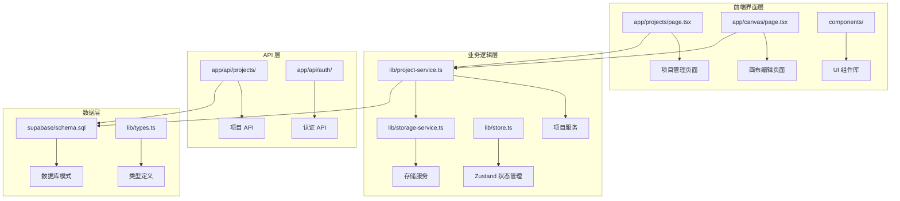
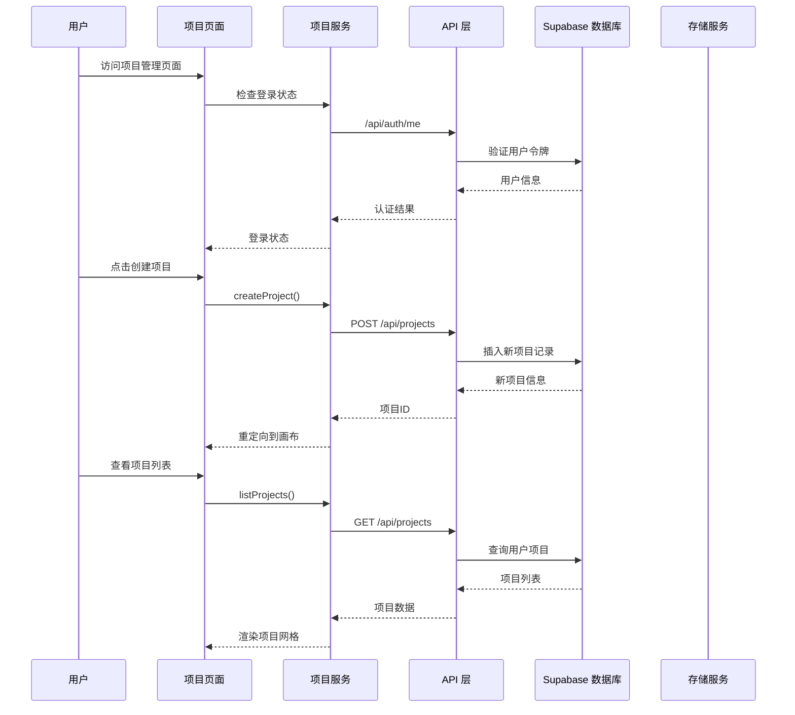
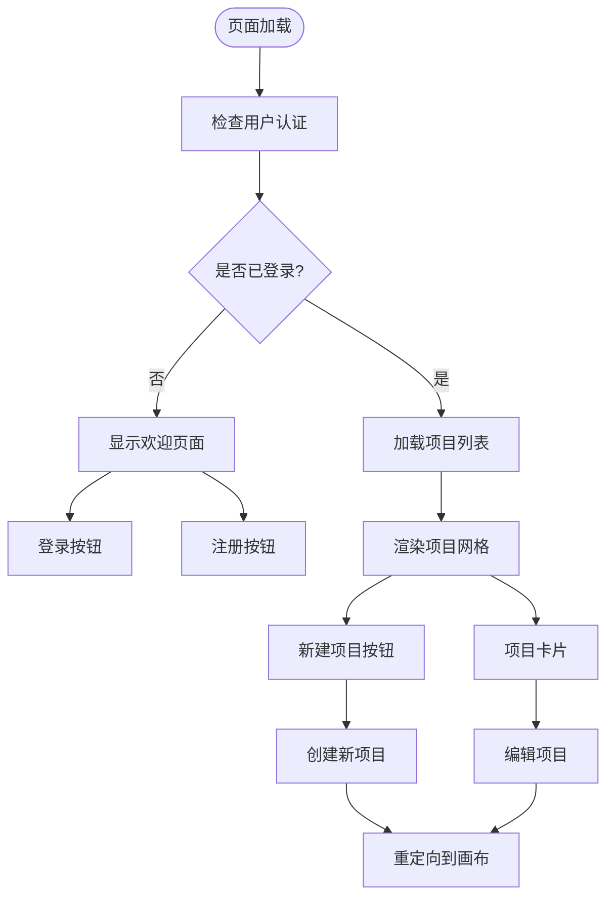
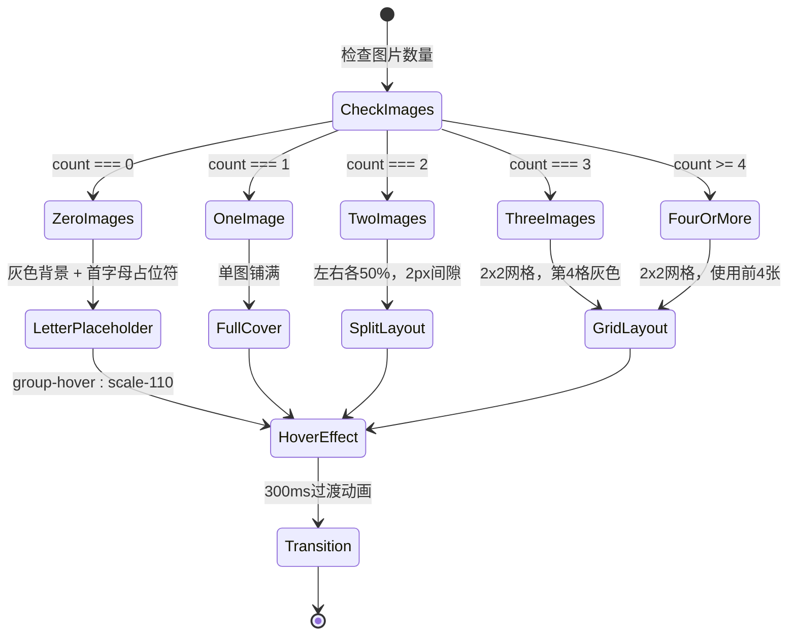
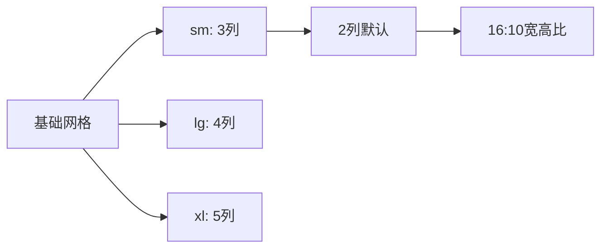
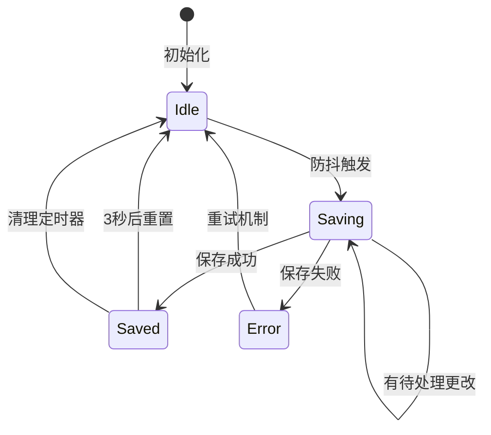
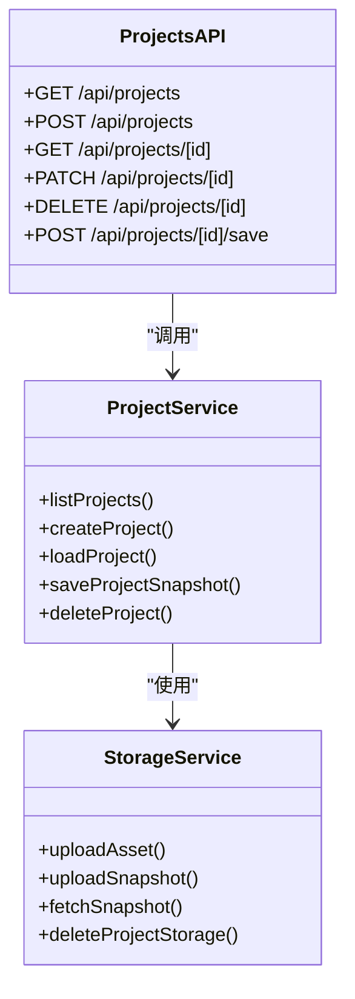
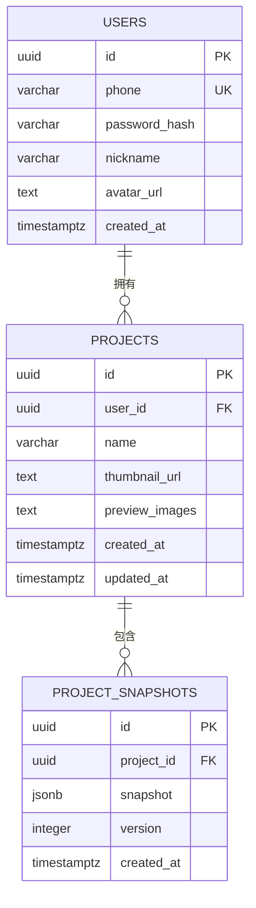
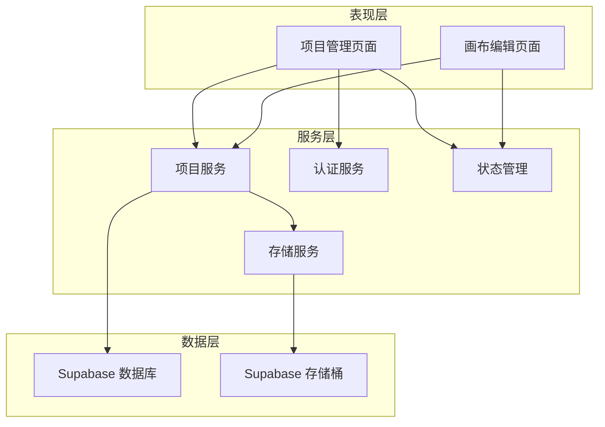

# 项目管理页面

<cite>
**本文档引用的文件**
- [app/projects/page.tsx](file://app/projects/page.tsx)
- [lib/project-service.ts](file://lib/project-service.ts)
- [app/api/projects/route.ts](file://app/api/projects/route.ts)
- [app/api/projects/[id]/route.ts](file://app/api/projects/[id]/route.ts)
- [app/api/projects/[id]/save/route.ts](file://app/api/projects/[id]/save/route.ts)
- [lib/storage-service.ts](file://lib/storage-service.ts)
- [lib/store.ts](file://lib/store.ts)
- [lib/types.ts](file://lib/types.ts)
- [supabase/schema.sql](file://supabase/schema.sql)
- [lib/auth.ts](file://lib/auth.ts)
- [app/canvas/page.tsx](file://app/canvas/page.tsx)
- [app/globals.css](file://app/globals.css)
</cite>

## 更新摘要
**变更内容**
- 更新了项目列表页面的响应式网格布局实现
- 新增了智能预览缩略图系统的详细分析
- 增强了交互式功能的UI改进说明
- 更新了项目卡片组件的视觉设计描述
- 完善了删除确认弹窗的交互设计分析

## 目录
1. [简介](#简介)
2. [项目结构](#项目结构)
3. [核心组件](#核心组件)
4. [架构概览](#架构概览)
5. [详细组件分析](#详细组件分析)
6. [依赖关系分析](#依赖关系分析)
7. [性能考虑](#性能考虑)
8. [故障排除指南](#故障排除指南)
9. [结论](#结论)

## 简介

Loveart 项目管理页面是一个基于 Next.js 构建的 AI 创意画布应用，主要功能是让用户管理和组织他们的设计项目。该页面提供了完整的项目生命周期管理，包括项目创建、列表展示、项目详情加载和自动保存等功能。

项目管理页面采用现代化的前端技术栈，结合 Supabase 数据库和存储服务，实现了云端项目数据的持久化存储。系统支持实时协作、AI 辅助设计和智能资源管理等高级功能。

**重大UI改进**：项目列表页面经过重大UI重构，引入了响应式网格布局、智能预览缩略图系统和增强的交互式功能，显著提升了用户体验和视觉效果。

## 项目结构

项目采用模块化的文件组织方式，主要分为以下几个层次：

**图表来源**
- [app/projects/page.tsx:1-500](file://app/projects/page.tsx#L1-L500)
- [lib/project-service.ts:1-225](file://lib/project-service.ts#L1-L225)
- [supabase/schema.sql:1-51](file://supabase/schema.sql#L1-L51)

**章节来源**
- [app/projects/page.tsx:1-500](file://app/projects/page.tsx#L1-L500)
- [lib/project-service.ts:1-225](file://lib/project-service.ts#L1-L225)
- [supabase/schema.sql:1-51](file://supabase/schema.sql#L1-L51)

## 核心组件

### 项目管理页面组件

项目管理页面主要由以下核心组件构成：

1. **认证状态管理** - 处理用户登录状态检查和权限验证
2. **智能预览缩略图组件** - 根据图片数量动态渲染不同布局的缩略图
3. **响应式项目网格** - 支持多屏幕尺寸的自适应网格布局
4. **交互式项目卡片** - 包含悬停效果、删除按钮和编辑功能
5. **项目创建功能** - 提供一键创建新项目的能力
6. **删除确认弹窗** - 安全的项目删除确认机制

### 项目服务组件

项目服务层提供了完整的项目生命周期管理功能：

1. **项目 CRUD 操作** - 创建、读取、更新、删除项目
2. **快照管理** - 处理项目状态的序列化和反序列化
3. **自动保存机制** - 实现智能防抖保存策略
4. **资源上传** - 管理项目相关的媒体资源上传

**章节来源**
- [app/projects/page.tsx:19-120](file://app/projects/page.tsx#L19-L120)
- [lib/project-service.ts:6-225](file://lib/project-service.ts#L6-L225)

## 架构概览

系统采用分层架构设计，确保了良好的可维护性和扩展性：

**图表来源**
- [app/projects/page.tsx:170-189](file://app/projects/page.tsx#L170-L189)
- [lib/project-service.ts:7-32](file://lib/project-service.ts#L7-L32)
- [app/api/projects/route.ts:9-58](file://app/api/projects/route.ts#L9-L58)

## 详细组件分析

### 项目管理页面组件分析

#### 页面状态管理

项目管理页面使用 React Hooks 进行状态管理，实现了完整的用户交互体验：

**图表来源**
- [app/projects/page.tsx:122-271](file://app/projects/page.tsx#L122-L271)

#### 智能预览缩略图系统

项目列表采用智能预览缩略图系统，根据图片数量动态渲染不同的布局：

**图表来源**
- [app/projects/page.tsx:19-120](file://app/projects/page.tsx#L19-L120)

**缩略图系统特性**：

| 图片数量 | 布局方式 | 视觉效果 | 交互行为 |
|----------|----------|----------|----------|
| 0张 | 首字母占位符 | 灰色背景 + 大号首字母 | 无图片时显示项目首字母 |
| 1张 | 单图铺满 | 完全覆盖容器 | 缩略图放大110% |
| 2张 | 左右分割 | 50%宽度，2px间距 | 缩略图放大110% |
| 3张 | 2x2网格 | 第4格灰色占位 | 缩略图放大110% |
| 4张及以上 | 2x2网格 | 使用前4张图片 | 缩略图放大110% |

#### 响应式项目网格布局

项目网格采用 Tailwind CSS 的响应式设计，支持从移动端到桌面端的自适应布局：

**网格布局配置**：
- `grid grid-cols-2` - 基础2列布局
- `sm:grid-cols-3` - 小屏设备3列
- `lg:grid-cols-4` - 中等屏设备4列
- `xl:grid-cols-5` - 大屏设备5列
- `gap-4` - 项目间间距

**章节来源**
- [app/projects/page.tsx:379-456](file://app/projects/page.tsx#L379-L456)

### 项目服务组件分析

#### 自动保存机制

项目服务实现了智能的自动保存机制，确保用户数据的安全性和完整性：

**图表来源**
- [lib/project-service.ts:97-225](file://lib/project-service.ts#L97-L225)

#### 快照序列化流程

项目快照包含了完整的画布状态和自定义数据：

| 数据类型 | 存储位置 | 描述 |
|----------|----------|------|
| tldraw | 快照文件 | tldraw 编辑器的完整状态 |
| chatHistory | 快照文件 | 聊天历史记录 |
| projectName | 快照文件 | 项目名称 |
| 用户头像 | 数据库 | 用户个人资料 |
| 项目缩略图 | 数据库 | 项目预览图像 |

**章节来源**
- [lib/project-service.ts:145-156](file://lib/project-service.ts#L145-L156)
- [lib/types.ts:77-84](file://lib/types.ts#L77-L84)

### API 层组件分析

#### 项目 API 设计

项目 API 采用了 RESTful 设计原则，提供了完整的 CRUD 操作：

**图表来源**
- [app/api/projects/route.ts:1-133](file://app/api/projects/route.ts#L1-L133)
- [app/api/projects/[id]/route.ts:1-275](file://app/api/projects/[id]/route.ts#L1-L275)
- [app/api/projects/[id]/save/route.ts:1-194](file://app/api/projects/[id]/save/route.ts#L1-L194)

#### 数据库模式设计

项目数据库采用了规范化的设计，确保了数据的一致性和完整性：

**图表来源**
- [supabase/schema.sql:26-51](file://supabase/schema.sql#L26-L51)

**章节来源**
- [supabase/schema.sql:1-51](file://supabase/schema.sql#L1-L51)
- [app/api/projects/route.ts:63-132](file://app/api/projects/route.ts#L63-L132)

## 依赖关系分析

系统各组件之间的依赖关系体现了清晰的分层架构：

**图表来源**
- [lib/project-service.ts:1-225](file://lib/project-service.ts#L1-L225)
- [lib/storage-service.ts:1-324](file://lib/storage-service.ts#L1-L324)
- [lib/store.ts:1-427](file://lib/store.ts#L1-L427)

### 关键依赖关系

1. **项目页面依赖项目服务** - 项目页面通过项目服务进行所有数据操作
2. **项目服务依赖存储服务** - 项目服务负责协调存储服务进行数据持久化
3. **存储服务依赖 Supabase** - 存储服务通过 Supabase SDK 进行云存储操作
4. **状态管理依赖外部库** - 使用 Zustand 进行全局状态管理

**章节来源**
- [lib/project-service.ts:1-225](file://lib/project-service.ts#L1-L225)
- [lib/store.ts:107-427](file://lib/store.ts#L107-L427)

## 性能考虑

### 自动保存优化

系统实现了智能的自动保存机制，平衡了数据安全性和性能开销：

- **防抖机制** - 1500ms 防抖延迟，减少不必要的网络请求
- **并发控制** - 保存过程中防止重复触发，避免竞态条件
- **增量更新** - 仅保存发生变化的数据，减少传输量
- **错误恢复** - 保存失败时自动重试，确保数据一致性

### 内存管理

项目管理系统了大量图像资源和画布数据：

- **对象 URL 回收** - 及时释放不再使用的 Blob URL
- **引用图像管理** - 支持多项目共享引用图像资源
- **状态清理** - 项目切换时自动清理相关状态和资源

### 缓存策略

系统采用了多层次的缓存策略：

- **本地存储** - 使用 localStorage 缓存用户偏好设置
- **浏览器缓存** - 利用浏览器缓存机制提升静态资源加载速度
- **CDN 加速** - 通过 Supabase Storage CDN 加速媒体资源访问

### UI性能优化

**智能预览缩略图优化**：
- 使用 `group-hover:scale-110` 实现平滑的缩放动画
- 通过 `transition-transform duration-300` 实现300ms过渡效果
- 采用 `overflow-hidden` 防止缩略图溢出
- 使用 `object-cover` 确保图片填充效果

**响应式网格优化**：
- 使用 Tailwind CSS 的响应式断点系统
- 通过 `aspect-[16/10]` 保持统一的宽高比
- 采用 `gap-4` 实现一致的间距控制

## 故障排除指南

### 常见问题及解决方案

#### 项目加载失败

**症状**：项目列表显示为空或加载超时

**可能原因**：
1. 用户未登录或会话过期
2. 网络连接异常
3. 数据库查询超时

**解决方案**：
1. 检查用户认证状态，重新登录
2. 确认网络连接稳定
3. 查看服务器日志了解具体错误

#### 自动保存失败

**症状**：项目更改未保存或保存状态显示错误

**可能原因**：
1. 网络中断导致保存请求失败
2. 服务器端验证失败
3. 存储空间不足

**解决方案**：
1. 检查网络连接状态
2. 查看控制台错误信息
3. 确认有足够的存储空间

#### 项目删除异常

**症状**：项目删除后仍能在列表中看到

**可能原因**：
1. 数据库事务未提交
2. 前端状态未及时更新
3. 存储清理失败

**解决方案**：
1. 强制刷新页面
2. 检查数据库状态
3. 手动清理存储资源

#### 缩略图显示问题

**症状**：项目缩略图无法正确显示

**可能原因**：
1. 图片URL无效或过期
2. 存储桶权限问题
3. 图片格式不支持

**解决方案**：
1. 检查图片URL的有效性
2. 验证存储桶访问权限
3. 确认图片格式兼容性

**章节来源**
- [lib/project-service.ts:114-174](file://lib/project-service.ts#L114-L174)
- [app/api/projects/[id]/route.ts:178-211](file://app/api/projects/[id]/route.ts#L178-L211)

## 结论

Loveart 项目管理页面展现了现代 Web 应用的最佳实践，通过合理的架构设计和完善的错误处理机制，为用户提供了流畅的项目管理体验。

### 主要优势

1. **用户体验优秀** - 响应式设计和直观的界面布局
2. **数据安全可靠** - 完善的认证授权和数据备份机制
3. **性能优化到位** - 智能缓存和自动保存策略
4. **扩展性强** - 模块化的架构便于功能扩展
5. **视觉效果出色** - 智能预览缩略图和流畅的动画效果

### 技术亮点

1. **智能自动保存** - 通过防抖机制平衡性能和数据安全
2. **云端存储集成** - 利用 Supabase 提供的完整云服务
3. **状态管理优化** - 使用 Zustand 实现高效的状态管理
4. **类型安全保证** - 完整的 TypeScript 类型定义
5. **响应式设计** - Tailwind CSS 提供的自适应布局系统
6. **交互式UI** - 平滑的悬停效果和过渡动画

### UI改进总结

**重大UI改进包括**：
- **响应式网格布局**：支持从2列到5列的自适应网格
- **智能预览缩略图系统**：根据图片数量动态选择最佳布局
- **增强的交互效果**：缩略图悬停放大、删除按钮渐隐渐显
- **现代化的视觉设计**：统一的圆角、阴影和色彩方案
- **流畅的动画过渡**：300ms的平滑过渡效果

该系统为类似创意工具类应用提供了一个优秀的参考实现，展示了如何在保证用户体验的同时实现数据的可靠存储和高效的性能表现。