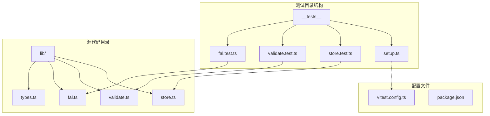
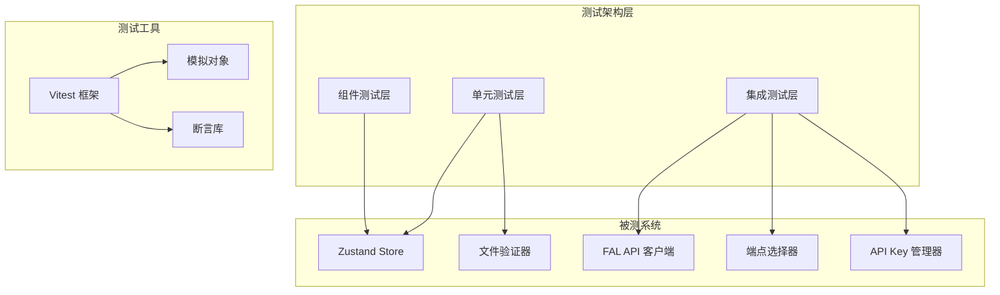
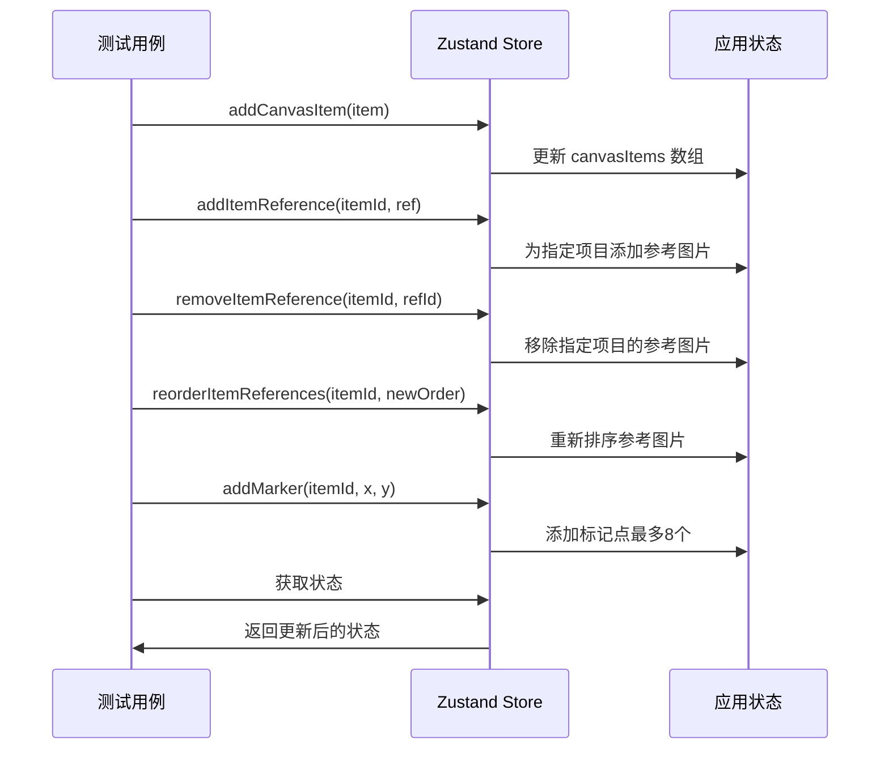
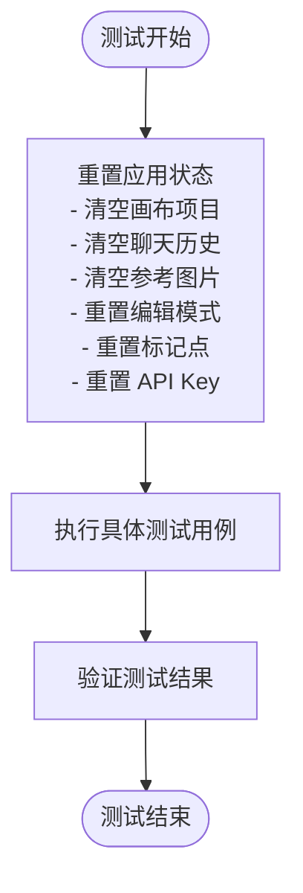
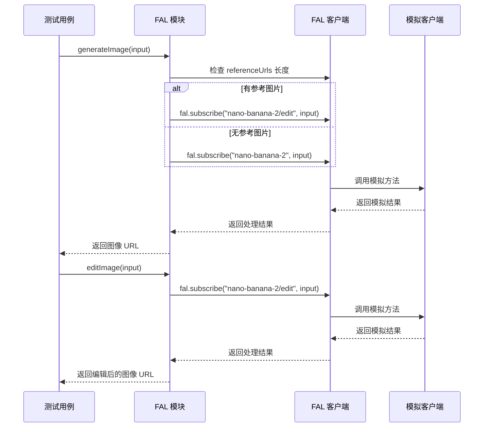

# 测试策略

<cite>
**本文档引用的文件**
- [vitest.config.ts](file://vitest.config.ts)
- [__tests__/setup.ts](file://__tests__/setup.ts)
- [__tests__/store.test.ts](file://__tests__/store.test.ts)
- [__tests__/validate.test.ts](file://__tests__/validate.test.ts)
- [__tests__/fal.test.ts](file://__tests__/fal.test.ts)
- [lib/store.ts](file://lib/store.ts)
- [lib/validate.ts](file://lib/validate.ts)
- [lib/fal.ts](file://lib/fal.ts)
- [lib/types.ts](file://lib/types.ts)
- [package.json](file://package.json)
</cite>

## 更新摘要
**变更内容**
- 扩展了 FAL API 测试覆盖范围，新增端点选择逻辑测试
- 增强了状态管理测试，新增 per-item reference images 和标记工具测试
- 新增 editImage 函数的测试用例
- 扩展了 API Key 配置和代理功能的测试覆盖

## 目录
1. [简介](#简介)
2. [项目结构](#项目结构)
3. [核心组件](#核心组件)
4. [架构概览](#架构概览)
5. [详细组件分析](#详细组件分析)
6. [依赖关系分析](#依赖关系分析)
7. [性能考虑](#性能考虑)
8. [故障排除指南](#故障排除指南)
9. [结论](#结论)
10. [附录](#附录)

## 简介

Loveart 项目采用 Vitest 作为主要的测试框架，实现了全面的单元测试策略。该项目专注于图像生成和编辑功能，通过 Zustand 状态管理库实现应用状态控制，使用 FAL AI 服务进行图像处理，并提供了完整的测试覆盖。

测试策略涵盖了四个主要类别：
- **状态管理测试**：针对 Zustand store 的行为验证，包括画布项目管理、参考图片管理和标记工具
- **文件验证测试**：对上传文件格式和大小的验证逻辑
- **API 集成测试**：对外部 FAL AI 服务的集成测试，包括端点选择逻辑和 API 功能
- **端点选择逻辑测试**：验证基于输入参数的模型端点自动选择机制

## 项目结构

项目采用模块化的测试组织结构，所有测试文件位于 `__tests__` 目录下，与源代码保持清晰的分离。



**图表来源**
- [vitest.config.ts:1-16](file://vitest.config.ts#L1-L16)
- [__tests__/setup.ts:1-2](file://__tests__/setup.ts#L1-L2)
- [lib/store.ts:1-385](file://lib/store.ts#L1-L385)

**章节来源**
- [vitest.config.ts:1-16](file://vitest.config.ts#L1-L16)
- [__tests__/setup.ts:1-2](file://__tests__/setup.ts#L1-L2)
- [package.json:1-47](file://package.json#L1-L47)

## 核心组件

### 测试框架配置

项目使用 Vitest 作为测试框架，配置了 jsdom 环境以支持 DOM 操作测试。配置文件包含了以下关键设置：

- **环境配置**：使用 jsdom 运行环境，支持浏览器 API
- **全局设置**：启用全局测试函数，无需导入
- **插件集成**：集成 React 插件支持 JSX 测试
- **路径别名**：配置 `@` 别名指向项目根目录
- **设置文件**：集成 @testing-library/jest-dom 扩展

### 测试工具集

项目集成了多个测试相关的依赖包：

- **Testing Library**：提供 DOM 操作和查询的测试工具
- **Jest DOM**：扩展 Jest 的 DOM 断言能力
- **React Testing Library**：专门用于 React 组件测试
- **User Event**：模拟用户交互事件

**章节来源**
- [vitest.config.ts:5-15](file://vitest.config.ts#L5-L15)
- [package.json:30-44](file://package.json#L30-L44)

## 架构概览

测试架构采用分层设计，每个测试文件专注于特定的功能模块：



**图表来源**
- [__tests__/store.test.ts:1-112](file://__tests__/store.test.ts#L1-L112)
- [__tests__/validate.test.ts:1-43](file://__tests__/validate.test.ts#L1-L43)
- [__tests__/fal.test.ts:1-69](file://__tests__/fal.test.ts#L1-L69)

## 详细组件分析

### 状态管理测试策略

#### Zustand Store 行为验证

状态管理测试重点关注 Zustand store 的各种操作行为，现已扩展到包括 per-item reference images 和标记工具功能：



**图表来源**
- [__tests__/store.test.ts:16-93](file://__tests__/store.test.ts#L16-L93)
- [lib/store.ts:112-366](file://lib/store.ts#L112-L366)

测试覆盖的核心功能包括：

1. **画布项目管理**：添加、删除和清理画布项目
2. **参考图片管理**：per-item reference images 的增删改查和重新排序
3. **聊天历史管理**：消息追加和历史记录限制（最多50条）
4. **编辑模式控制**：编辑状态切换和目标设置
5. **标记工具管理**：最多8个标记点的添加、删除和重新编号
6. **API Key 管理**：FAL API Key 的存储和检索

#### 状态重置机制

每个测试用例都包含 `beforeEach` 钩子，确保测试之间的状态隔离：



**图表来源**
- [__tests__/store.test.ts:5-14](file://__tests__/store.test.ts#L5-L14)

**章节来源**
- [__tests__/store.test.ts:1-112](file://__tests__/store.test.ts#L1-L112)
- [lib/store.ts:88-384](file://lib/store.ts#L88-L384)

### 文件验证测试策略

#### 文件格式和大小验证

文件验证测试确保只接受支持的文件格式和合理的文件大小：

```mermaid
flowchart TD
FileInput[文件输入] --> CheckType{检查文件类型}
CheckType --> |不支持的类型| InvalidType[返回 InvalidType 错误]
CheckType --> |支持的类型| CheckSize{检查文件大小}
CheckSize --> |超过 10MB| TooLarge[返回 TooLarge 错误]
CheckSize --> |10MB 或更小| Valid[返回 null (验证通过)]
InvalidType --> End([测试结束])
TooLarge --> End
Valid --> End
```

**图表来源**
- [__tests__/validate.test.ts:7-42](file://__tests__/validate.test.ts#L7-L42)
- [lib/validate.ts:6-13](file://lib/validate.ts#L6-L13)

测试用例覆盖的关键场景：

1. **支持的文件格式**：JPG、PNG、WebP
2. **文件大小边界**：10MB 上限的精确测试
3. **错误处理**：不支持格式和超大文件的处理

**章节来源**
- [__tests__/validate.test.ts:1-43](file://__tests__/validate.test.ts#L1-L43)
- [lib/validate.ts:1-14](file://lib/validate.ts#L1-L14)

### API 集成测试策略

#### FAL AI 服务集成测试

FAL AI 服务测试通过模拟外部 API 调用来验证集成逻辑，现已扩展到包括端点选择和编辑功能：



**图表来源**
- [__tests__/fal.test.ts:26-68](file://__tests__/fal.test.ts#L26-L68)
- [lib/fal.ts:45-153](file://lib/fal.ts#L45-L153)

测试关注的核心功能：

1. **端点选择逻辑**：根据是否有参考图片自动选择合适的模型端点
2. **参数构建**：根据输入动态构建请求参数，包括 image_urls 的处理
3. **响应处理**：正确解析 API 响应数据，包括宽高的获取
4. **编辑功能**：支持图像编辑模式，确保目标图片在 image_urls 的首位
5. **API Key 配置**：通过 store 中的 API Key 自动配置请求头
6. **代理功能**：使用 Next.js API 路由作为代理服务器

**章节来源**
- [__tests__/fal.test.ts:1-69](file://__tests__/fal.test.ts#L1-L69)
- [lib/fal.ts:1-170](file://lib/fal.ts#L1-L170)

## 依赖关系分析

测试系统的依赖关系展现了清晰的分层架构：

```mermaid
graph TB
subgraph "测试层"
StoreTest[store.test.ts]
ValidateTest[validate.test.ts]
FalTest[fal.test.ts]
Setup[setup.ts]
end
subgraph "业务逻辑层"
Store[store.ts]
Validate[validate.ts]
Fal[fal.ts]
Types[types.ts]
end
subgraph "测试框架层"
Vitest[vitest]
JSDOM[jsdom]
TestingLib[testing-library]
End
StoreTest --> Store
ValidateTest --> Validate
FalTest --> Fal
Setup --> TestingLib
Store --> Types
Validate --> Types
Fal --> Types
Vitest --> JSDOM
StoreTest --> Vitest
ValidateTest --> Vitest
FalTest --> Vitest
```

**图表来源**
- [__tests__/store.test.ts:1-3](file://__tests__/store.test.ts#L1-L3)
- [__tests__/validate.test.ts:1-2](file://__tests__/validate.test.ts#L1-L2)
- [__tests__/fal.test.ts:1-2](file://__tests__/fal.test.ts#L1-L2)

**章节来源**
- [vitest.config.ts:1-16](file://vitest.config.ts#L1-L16)
- [lib/types.ts:1-49](file://lib/types.ts#L1-L49)

## 性能考虑

### 测试执行优化

当前测试配置在性能方面有以下特点：

1. **异步测试处理**：使用 `async/await` 处理异步操作
2. **模拟对象使用**：避免真实 API 调用，提高测试速度
3. **状态隔离**：每个测试独立运行，避免相互影响
4. **批量测试执行**：Vitest 支持并行测试执行

### 内存管理

测试中需要注意的内存管理问题：

- **文件对象清理**：测试后及时清理 File 对象
- **DOM 元素销毁**：React 组件测试后清理 DOM
- **模拟对象重置**：测试前重置模拟状态
- **对象 URL 回收**：确保 blob URL 正确回收，避免内存泄漏

## 故障排除指南

### 常见测试问题

#### 状态管理测试失败

**问题症状**：状态测试间相互影响
**解决方案**：确保使用 `beforeEach` 重置状态

#### 文件验证测试异常

**问题症状**：文件类型判断错误
**解决方案**：检查 MIME 类型字符串格式

#### API 集成测试失败

**问题症状**：模拟对象调用失败或端点选择错误
**解决方案**：
1. 验证模拟配置和调用参数
2. 检查 referenceUrls 的长度判断逻辑
3. 确认 image_urls 的构建顺序

#### 端点选择逻辑错误

**问题症状**：generateImage 使用了错误的模型端点
**解决方案**：
1. 验证 referenceUrls.length > 0 的判断
2. 检查端点字符串是否正确
3. 确认 editImage 函数始终使用 "nano-banana-2/edit" 端点

**章节来源**
- [__tests__/store.test.ts:5-14](file://__tests__/store.test.ts#L5-L14)
- [__tests__/fal.test.ts:21-24](file://__tests__/fal.test.ts#L21-L24)

## 结论

Loveart 项目的测试策略展现了良好的软件工程实践：

1. **全面的测试覆盖**：涵盖了核心业务逻辑的各个方面，包括新增的端点选择逻辑和标记工具
2. **清晰的架构设计**：测试与实现代码分离，便于维护
3. **高效的测试执行**：通过模拟对象避免外部依赖，支持并行执行
4. **可扩展的测试结构**：易于添加新的测试用例和功能测试

**更新** 项目已扩展到支持更复杂的图像编辑功能，包括：
- 端点自动选择逻辑的测试覆盖
- per-item reference images 的完整测试
- 标记工具功能的测试
- API Key 配置和代理功能的测试

建议的改进方向：
- 添加更多边界条件测试，特别是端点选择的边界情况
- 实现测试覆盖率报告
- 增加集成测试套件，特别是端到端测试
- 完善错误处理测试，包括网络异常和 API 错误

## 附录

### 测试编写指南

#### 测试用例设计原则

1. **单一职责**：每个测试用例只验证一个功能点
2. **可读性**：测试命名清晰表达预期行为
3. **独立性**：测试之间不应相互依赖
4. **可重复性**：测试结果应该稳定可靠
5. **完整性**：覆盖正常流程和异常流程

#### 模拟对象使用最佳实践

1. **精确模拟**：只模拟必要的方法和属性
2. **清晰断言**：验证模拟调用的参数和次数
3. **状态重置**：测试前后清理模拟状态
4. **类型安全**：使用 TypeScript 类型确保模拟对象的正确性

#### 断言策略

1. **明确断言**：使用具体的断言方法
2. **完整覆盖**：验证所有相关状态变化
3. **边界测试**：包含边界条件和异常情况
4. **时序测试**：验证异步操作的正确时序

### 测试运行命令

项目目前的测试脚本配置相对简单，建议添加以下命令：

```json
{
  "scripts": {
    "test": "vitest",
    "test:watch": "vitest --watch",
    "test:coverage": "vitest --coverage",
    "test:ui": "vitest --ui"
  }
}
```

### 持续集成配置

建议的 CI 配置要点：

1. **测试环境**：使用 Node.js LTS 版本
2. **依赖安装**：缓存 npm/yarn/pnpm 包
3. **测试执行**：运行所有测试用例，包括新增的端点选择逻辑测试
4. **覆盖率报告**：生成覆盖率报告
5. **缓存策略**：缓存测试结果以提高效率
6. **并行执行**：利用 Vitest 的并行测试能力提高执行效率

### 新增功能测试指导

#### 端点选择逻辑测试

1. **文本到图像模式**：验证 referenceUrls 为空时使用 "nano-banana-2" 端点
2. **图像编辑模式**：验证 referenceUrls 非空时使用 "nano-banana-2/edit" 端点
3. **参数构建**：验证 image_urls 的正确构建和顺序
4. **API Key 集成**：验证 API Key 的正确传递

#### 标记工具测试

1. **标记添加**：验证最多8个标记点的限制
2. **标记删除**：验证标记的正确删除和重新编号
3. **标记定位**：验证相对坐标的正确性
4. **编辑器集成**：验证标记变化时的编辑器重渲染

#### per-item reference images 测试

1. **添加引用**：验证引用图片的正确添加
2. **删除引用**：验证引用图片的正确删除和 URL 回收
3. **更新引用**：验证引用状态的正确更新
4. **重新排序**：验证引用图片的正确重新排序