# 状态管理系统

<cite>
**本文档引用的文件**
- [lib/store.ts](file://lib/store.ts)
- [lib/types.ts](file://lib/types.ts)
- [lib/auth.ts](file://lib/auth.ts)
- [lib/project-service.ts](file://lib/project-service.ts)
- [middleware.ts](file://middleware.ts)
- [app/canvas/page.tsx](file://app/canvas/page.tsx)
- [components/canvas/TopBar.tsx](file://components/canvas/TopBar.tsx)
- [app/api/auth/signin/route.ts](file://app/api/auth/signin/route.ts)
- [app/api/auth/signup/route.ts](file://app/api/auth/signup/route.ts)
- [app/api/auth/signout/route.ts](file://app/api/auth/signout/route.ts)
- [app/api/auth/me/route.ts](file://app/api/auth/me/route.ts)
- [lib/fal.ts](file://lib/fal.ts)
- [lib/validate.ts](file://lib/validate.ts)
- [components/canvas/CanvasArea.tsx](file://components/canvas/CanvasArea.tsx)
- [components/canvas/InlineEditPanel.tsx](file://components/canvas/InlineEditPanel.tsx)
- [components/chat/ChatPanel.tsx](file://components/chat/ChatPanel.tsx)
- [components/chat/MessageHistory.tsx](file://components/chat/MessageHistory.tsx)
- [components/chat/TextInput.tsx](file://components/chat/TextInput.tsx)
- [components/chat/ReferenceUploader.tsx](file://components/chat/ReferenceUploader.tsx)
- [app/api/fal/proxy/route.ts](file://app/api/fal/proxy/route.ts)
- [app/page.tsx](file://app/page.tsx)
- [__tests__/store.test.ts](file://__tests__/store.test.ts)
- [package.json](file://package.json)
</cite>

## 更新摘要
**变更内容**
- 新增项目ID跟踪功能，支持当前项目状态的精确控制
- 新增项目恢复状态标志，确保项目加载过程中的状态一致性
- 新增保存状态指示器，提供实时的保存进度反馈
- 新增FAL API密钥管理功能，支持用户自定义API密钥配置
- 新增最近项目列表功能，提供项目历史访问能力
- 扩展自动保存机制，集成保存状态管理和项目恢复保护
- 深化项目状态管理，支持完整的项目生命周期管理

## 目录
1. [简介](#简介)
2. [项目结构](#项目结构)
3. [核心组件](#核心组件)
4. [架构概览](#架构概览)
5. [详细组件分析](#详细组件分析)
6. [依赖关系分析](#依赖关系分析)
7. [性能考虑](#性能考虑)
8. [故障排除指南](#故障排除指南)
9. [最佳实践](#最佳实践)
10. [结论](#结论)

## 简介

Loveart 是一个基于 Next.js 和 Zustand 的 AI 创意设计平台，采用现代化的状态管理模式。该系统通过 Zustand 实现轻量级、类型安全的状态管理，支持状态持久化、副作用处理和组件间通信。系统主要包含画布编辑功能和 AI 聊天交互两大核心模块，为用户提供直观的图像生成和编辑体验。

**重大更新**：状态管理架构已从全局参考图片管理迁移到每项参考处理模式，并新增了完整的标记跟踪系统。新的架构支持每画布项目的参考图片集合，包括添加、删除、更新和重新排序功能，同时增强了画布项目属性管理，支持自然尺寸和文件名跟踪。

**新增功能**：系统现已集成完整的用户认证状态管理，包括用户数据持久化、登录状态跟踪、登出功能集成，以及JWT认证机制的深度集成。**新增**：项目ID跟踪、恢复状态标志、保存状态指示器等新状态切片，为项目生命周期管理提供了完整的状态支持。

## 项目结构

Loveart 项目采用清晰的分层架构，状态管理位于应用的核心层，为各个功能模块提供统一的状态访问接口。

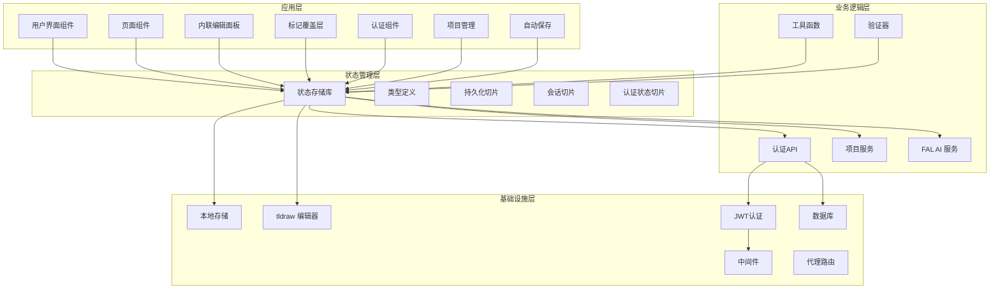
```mermaid
graph TB
subgraph "应用层"
UI[用户界面组件]
Pages[页面组件]
InlineEdit[内联编辑面板]
MarkerOverlay[标记覆盖层]
Auth[认证组件]
Projects[项目管理]
AutoSave[自动保存]
end
subgraph "状态管理层"
Store[状态存储库]
Types[类型定义]
PersistedSlice[持久化切片]
SessionSlice[会话切片]
AuthSlice[认证状态切片]
end
subgraph "业务逻辑层"
AuthAPI[认证API]
ProjectService[项目服务]
FAL[FAL AI 服务]
Utils[工具函数]
Validation[验证器]
end
subgraph "基础设施层"
Middleware[中间件]
Proxy[代理路由]
Storage[本地存储]
Tldraw[tldraw 编辑器]
JWT[JWT认证]
Supabase[数据库]
end
UI --> Store
Pages --> Store
InlineEdit --> Store
MarkerOverlay --> Store
Auth --> Store
Projects --> Store
AutoSave --> Store
Store --> AuthAPI
Store --> ProjectService
Store --> FAL
Store --> Storage
Store --> Tldraw
AuthAPI --> JWT
AuthAPI --> Supabase
JWT --> Middleware
Utils --> Store
Validation --> Store
```

**图表来源**
- [lib/store.ts:1-427](file://lib/store.ts#L1-L427)
- [lib/types.ts:1-85](file://lib/types.ts#L1-L85)
- [lib/auth.ts:1-64](file://lib/auth.ts#L1-L64)
- [lib/project-service.ts:1-225](file://lib/project-service.ts#L1-L225)
- [middleware.ts:1-64](file://middleware.ts#L1-L64)

**章节来源**
- [lib/store.ts:1-427](file://lib/store.ts#L1-L427)
- [lib/types.ts:1-85](file://lib/types.ts#L1-L85)
- [lib/auth.ts:1-64](file://lib/auth.ts#L1-L64)
- [lib/project-service.ts:1-225](file://lib/project-service.ts#L1-L225)
- [middleware.ts:1-64](file://middleware.ts#L1-L64)
- [package.json:1-48](file://package.json#L1-L48)

## 核心组件

### Zustand 状态存储库

Loveart 使用 Zustand 作为状态管理核心，实现了类型安全的状态存储和操作接口。

#### 状态切片设计

系统采用多切片架构，将不同功能域的状态分离管理，新增了每项参考图片管理功能、标记跟踪系统、用户认证状态管理、项目ID跟踪、恢复状态标志和保存状态指示器：

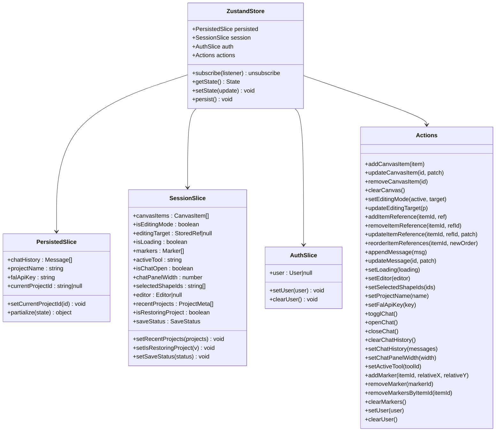
```mermaid
classDiagram
class ZustandStore {
+PersistedSlice persisted
+SessionSlice session
+AuthSlice auth
+Actions actions
+subscribe(listener) unsubscribe
+getState() State
+setState(update) void
+persist() void
}
class PersistedSlice {
+chatHistory : Message[]
+projectName : string
+falApiKey : string
+currentProjectId : string|null
+setCurrentProjectId(id) void
+partialize(state) object
}
class SessionSlice {
+canvasItems : CanvasItem[]
+isEditingMode : boolean
+editingTarget : StoredRef|null
+isLoading : boolean
+markers : Marker[]
+activeTool : string
+isChatOpen : boolean
+chatPanelWidth : number
+selectedShapeIds : string[]
+editor : Editor|null
+recentProjects : ProjectMeta[]
+setRecentProjects(projects) void
+isRestoringProject : boolean
+setIsRestoringProject(v) void
+saveStatus : SaveStatus
+setSaveStatus(status) void
}
class AuthSlice {
+user : User|null
+setUser(user) void
+clearUser() void
}
class Actions {
+addCanvasItem(item)
+updateCanvasItem(id, patch)
+removeCanvasItem(id)
+clearCanvas()
+setEditingMode(active, target)
+updateEditingTarget(p)
+addItemReference(itemId, ref)
+removeItemReference(itemId, refId)
+updateItemReference(itemId, refId, patch)
+reorderItemReferences(itemId, newOrder)
+appendMessage(msg)
+updateMessage(id, patch)
+setLoading(loading)
+setEditor(editor)
+setSelectedShapeIds(ids)
+setProjectName(name)
+setFalApiKey(key)
+togglChat()
+openChat()
+closeChat()
+clearChatHistory()
+setChatHistory(messages)
+setChatPanelWidth(width)
+setActiveTool(toolId)
+addMarker(itemId, relativeX, relativeY)
+removeMarker(markerId)
+removeMarkersByItemId(itemId)
+clearMarkers()
+setUser(user)
+clearUser()
}
ZustandStore --> PersistedSlice
ZustandStore --> SessionSlice
ZustandStore --> AuthSlice
ZustandStore --> Actions
```

**图表来源**
- [lib/store.ts:21-105](file://lib/store.ts#L21-L105)

#### 数据结构定义

系统定义了完整的数据模型，确保类型安全和运行时验证，新增了每项参考图片集合支持、标记跟踪功能、用户认证状态管理、项目ID跟踪、恢复状态标志和保存状态指示器：

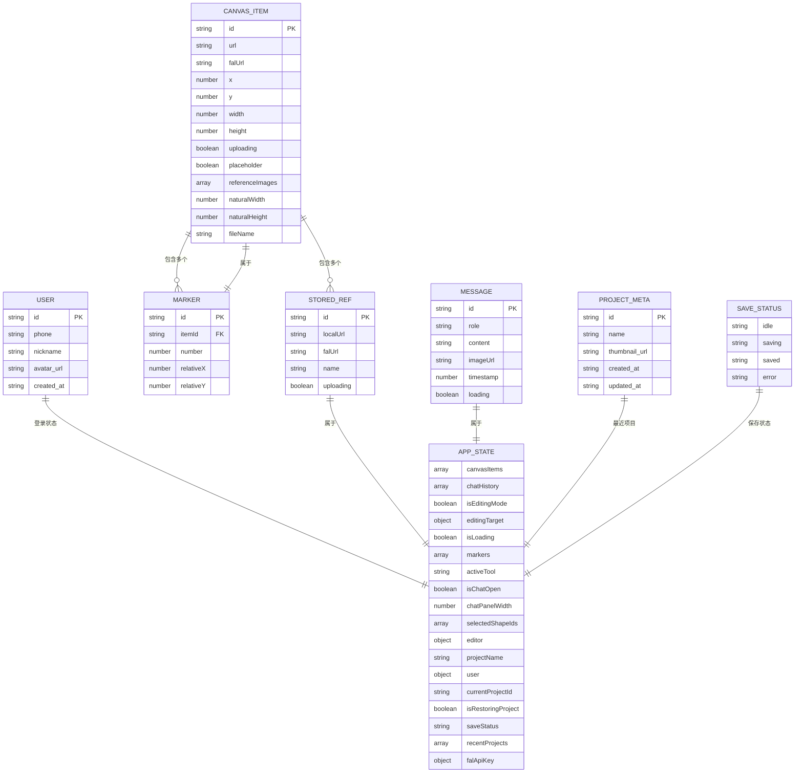
```mermaid
erDiagram
USER {
string id PK
string phone
string nickname
string avatar_url
string created_at
}
CANVAS_ITEM {
string id PK
string url
string falUrl
number x
number y
number width
number height
boolean uploading
boolean placeholder
array referenceImages
number naturalWidth
number naturalHeight
string fileName
}
MARKER {
string id PK
string itemId FK
number number
number relativeX
number relativeY
}
PROJECT_META {
string id PK
string name
string thumbnail_url
string created_at
string updated_at
}
STORED_REF {
string id PK
string localUrl
string falUrl
string name
boolean uploading
}
MESSAGE {
string id PK
string role
string content
string imageUrl
number timestamp
boolean loading
}
SAVE_STATUS {
string idle
string saving
string saved
string error
}
APP_STATE {
array canvasItems
array chatHistory
boolean isEditingMode
object editingTarget
boolean isLoading
array markers
string activeTool
boolean isChatOpen
number chatPanelWidth
array selectedShapeIds
object editor
string projectName
object user
string currentProjectId
boolean isRestoringProject
string saveStatus
array recentProjects
object falApiKey
}
USER ||--|| APP_STATE : "登录状态"
CANVAS_ITEM ||--o{ STORED_REF : "包含多个"
CANVAS_ITEM ||--o{ MARKER : "包含多个"
MARKER ||--|| CANVAS_ITEM : "属于"
STORED_REF ||--|| APP_STATE : "属于"
MESSAGE ||--|| APP_STATE : "属于"
PROJECT_META ||--|| APP_STATE : "最近项目"
SAVE_STATUS ||--|| APP_STATE : "保存状态"
```

**图表来源**
- [lib/types.ts:18-85](file://lib/types.ts#L18-L85)

**章节来源**
- [lib/store.ts:70-105](file://lib/store.ts#L70-L105)
- [lib/types.ts:1-85](file://lib/types.ts#L1-L85)

## 架构概览

Loveart 的状态管理架构采用单向数据流模式，确保状态更新的可预测性和可追踪性，支持每项参考图片的细粒度管理、标记跟踪系统、用户认证状态管理、项目ID跟踪、恢复状态标志和保存状态指示器。

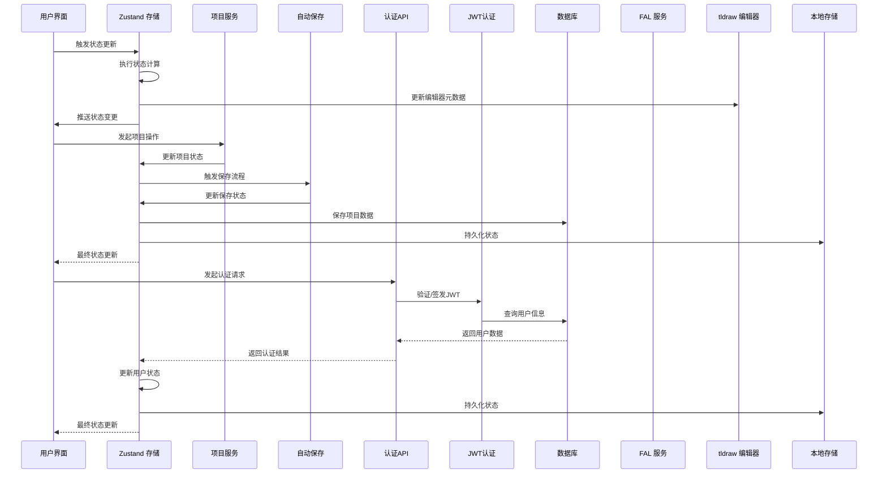
```mermaid
sequenceDiagram
participant UI as 用户界面
participant Store as Zustand 存储
participant ProjectService as 项目服务
participant AutoSave as 自动保存
participant AuthAPI as 认证API
participant JWT as JWT认证
participant Supabase as 数据库
participant FAL as FAL 服务
participant Tldraw as tldraw 编辑器
participant LocalStorage as 本地存储
UI->>Store : 触发状态更新
Store->>Store : 执行状态计算
Store->>Tldraw : 更新编辑器元数据
Store->>UI : 推送状态变更
UI->>ProjectService : 发起项目操作
ProjectService->>Store : 更新项目状态
Store->>AutoSave : 触发保存流程
AutoSave->>Store : 更新保存状态
Store->>Supabase : 保存项目数据
Store->>LocalStorage : 持久化状态
Store-->>UI : 最终状态更新
UI->>AuthAPI : 发起认证请求
AuthAPI->>JWT : 验证/签发JWT
JWT->>Supabase : 查询用户信息
Supabase-->>AuthAPI : 返回用户数据
AuthAPI-->>Store : 返回认证结果
Store->>Store : 更新用户状态
Store->>LocalStorage : 持久化状态
Store-->>UI : 最终状态更新
```

**图表来源**
- [lib/store.ts:401-403](file://lib/store.ts#L401-L403)
- [lib/project-service.ts:97-224](file://lib/project-service.ts#L97-L224)
- [lib/auth.ts:13-28](file://lib/auth.ts#L13-L28)
- [middleware.ts:11-49](file://middleware.ts#L11-L49)

### 状态更新机制

系统实现了原子性的状态更新机制，确保状态变更的完整性和一致性，支持每项参考图片的独立管理、标记跟踪功能、用户认证状态管理、项目ID跟踪、恢复状态标志和保存状态指示器：

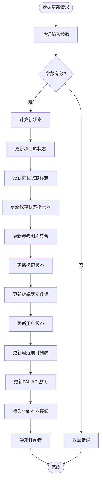
```mermaid
flowchart TD
Start([状态更新请求]) --> Validate["验证输入参数"]
Validate --> Valid{"参数有效?"}
Valid --> |否| Error["返回错误"]
Valid --> |是| Compute["计算新状态"]
Compute --> UpdateProjectId["更新项目ID状态"]
UpdateProjectId --> UpdateRestoreFlag["更新恢复状态标志"]
UpdateRestoreFlag --> UpdateSaveStatus["更新保存状态指示器"]
UpdateSaveStatus --> UpdateRefs["更新参考图片集合"]
UpdateRefs --> UpdateMarkers["更新标记状态"]
UpdateMarkers --> UpdateEditor["更新编辑器元数据"]
UpdateEditor --> UpdateUser["更新用户状态"]
UpdateUser --> UpdateRecentProjects["更新最近项目列表"]
UpdateRecentProjects --> UpdateFALKey["更新FAL API密钥"]
UpdateFALKey --> Persist["持久化到本地存储"]
Persist --> Notify["通知订阅者"]
Notify --> End([完成])
Error --> End
```

**图表来源**
- [lib/store.ts:107-426](file://lib/store.ts#L107-L426)

**章节来源**
- [lib/store.ts:85-427](file://lib/store.ts#L85-L427)

## 详细组件分析

### 项目ID跟踪系统

**新增功能**：系统集成了完整的项目ID跟踪功能，支持当前项目状态的精确控制和URL参数驱动的项目管理。

#### 项目ID生命周期管理

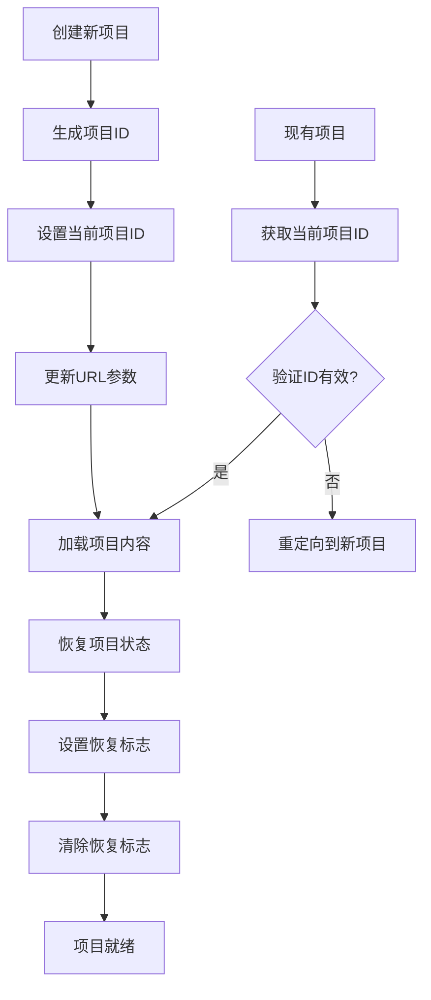
```mermaid
flowchart TD
NewProject[创建新项目] --> GenerateId[生成项目ID]
GenerateId --> SetCurrentId[设置当前项目ID]
SetCurrentId --> UpdateURL[更新URL参数]
UpdateURL --> LoadProject[加载项目内容]
LoadProject --> RestoreState[恢复项目状态]
RestoreState --> SetRestoreFlag[设置恢复标志]
SetRestoreFlag --> ClearRestoreFlag[清除恢复标志]
ClearRestoreFlag --> Ready[项目就绪]
ExistingProject[现有项目] --> GetCurrentId[获取当前项目ID]
GetCurrentId --> ValidateId{验证ID有效?}
ValidateId --> |否| RedirectNew[重定向到新项目]
ValidateId --> |是| LoadProject
```

**图表来源**
- [lib/store.ts:114-115](file://lib/store.ts#L114-L115)
- [app/canvas/page.tsx:62-71](file://app/canvas/page.tsx#L62-L71)
- [lib/project-service.ts:15-24](file://lib/project-service.ts#L15-L24)

#### 项目恢复状态标志

**新增功能**：系统实现了项目恢复状态标志，确保项目加载过程中的状态一致性，防止并发操作冲突。

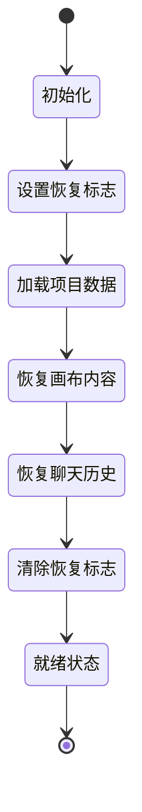
```mermaid
stateDiagram-v2
[*] --> 初始化
初始化 --> 设置恢复标志
设置恢复标志 --> 加载项目数据
加载项目数据 --> 恢复画布内容
恢复画布内容 --> 恢复聊天历史
恢复聊天历史 --> 清除恢复标志
清除恢复标志 --> 就绪状态
就绪状态 --> [*]
```

**图表来源**
- [lib/store.ts:137-138](file://lib/store.ts#L137-L138)
- [app/canvas/page.tsx:56-58](file://app/canvas/page.tsx#L56-L58)
- [app/canvas/page.tsx:135](file://app/canvas/page.tsx#L135)

**章节来源**
- [lib/store.ts:74-115](file://lib/store.ts#L74-L115)
- [app/canvas/page.tsx:1-200](file://app/canvas/page.tsx#L1-L200)
- [lib/project-service.ts:1-225](file://lib/project-service.ts#L1-L225)

### 保存状态指示器

**新增功能**：系统集成了完整的保存状态指示器，提供实时的保存进度反馈，包括保存中、已保存、保存失败等状态。

#### 保存状态生命周期管理

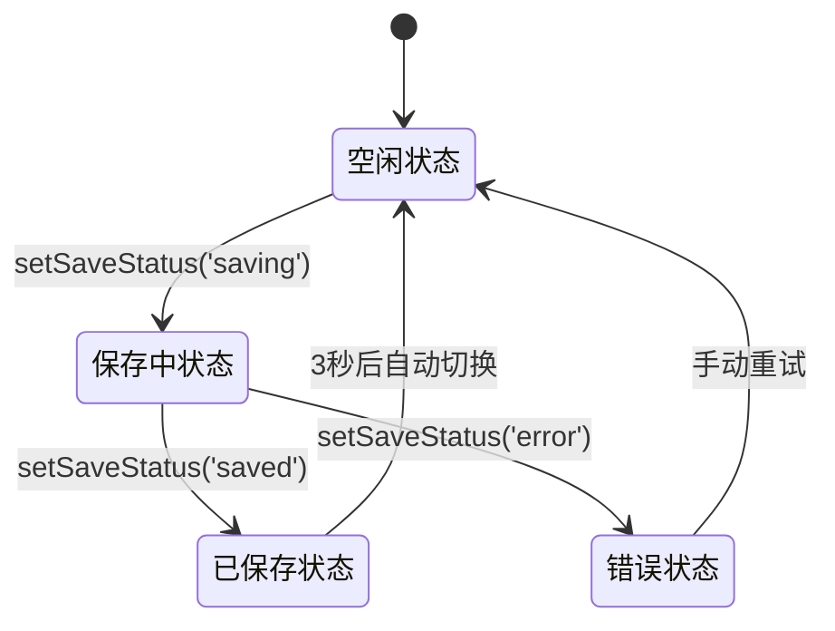
```mermaid
stateDiagram-v2
[*] --> 空闲状态
空闲状态 --> 保存中状态 : setSaveStatus('saving')
保存中状态 --> 已保存状态 : setSaveStatus('saved')
保存中状态 --> 错误状态 : setSaveStatus('error')
已保存状态 --> 空闲状态 : 3秒后自动切换
错误状态 --> 空闲状态 : 手动重试
```

**图表来源**
- [lib/store.ts:78](file://lib/store.ts#L78)
- [lib/store.ts:140-141](file://lib/store.ts#L140-L141)
- [lib/project-service.ts:137-163](file://lib/project-service.ts#L137-L163)

#### 自动保存机制

**已增强**：自动保存机制现在集成了保存状态指示器，提供完整的保存流程管理。

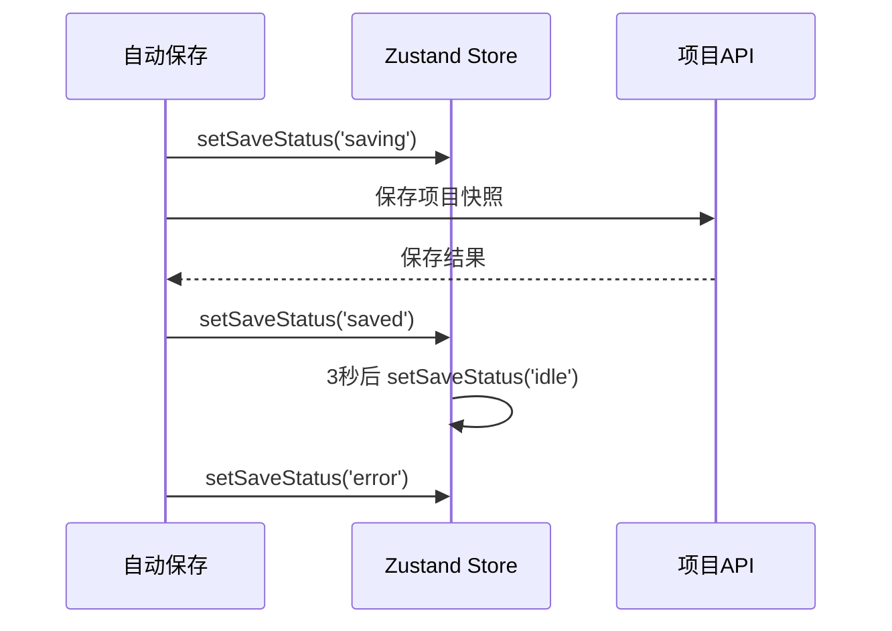
```mermaid
sequenceDiagram
participant AutoSave as 自动保存
participant Store as Zustand Store
participant API as 项目API
AutoSave->>Store : setSaveStatus('saving')
AutoSave->>API : 保存项目快照
API-->>AutoSave : 保存结果
AutoSave->>Store : setSaveStatus('saved')
Store->>Store : 3秒后 setSaveStatus('idle')
AutoSave->>Store : setSaveStatus('error')
```

**图表来源**
- [lib/project-service.ts:114-173](file://lib/project-service.ts#L114-L173)
- [lib/store.ts:137-141](file://lib/store.ts#L137-L141)

**章节来源**
- [lib/store.ts:78-141](file://lib/store.ts#L78-L141)
- [lib/project-service.ts:97-224](file://lib/project-service.ts#L97-L224)
- [components/canvas/TopBar.tsx:32-59](file://components/canvas/TopBar.tsx#L32-L59)

### FAL API密钥管理

**新增功能**：系统集成了FAL API密钥管理功能，支持用户自定义API密钥配置，提供安全的密钥存储和使用机制。

#### API密钥生命周期管理

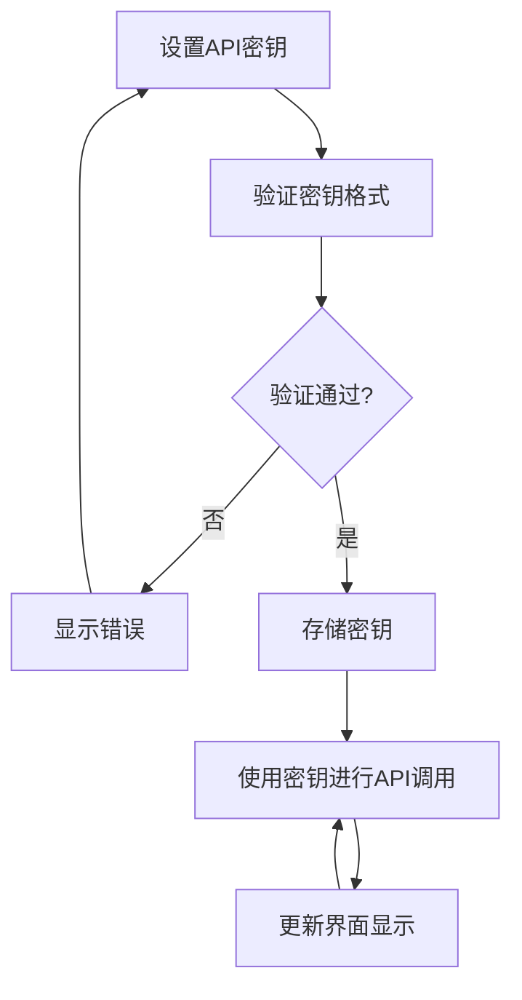
```mermaid
flowchart TD
SetKey[设置API密钥] --> ValidateKey[验证密钥格式]
ValidateKey --> Valid{验证通过?}
Valid --> |否| ShowError[显示错误]
Valid --> |是| StoreKey[存储密钥]
StoreKey --> UseKey[使用密钥进行API调用]
UseKey --> UpdateUI[更新界面显示]
ShowError --> SetKey
UpdateUI --> UseKey
```

**图表来源**
- [lib/store.ts:296](file://lib/store.ts#L296)
- [components/canvas/TopBar.tsx:156-157](file://components/canvas/TopBar.tsx#L156-L157)
- [components/canvas/TopBar.tsx:285-294](file://components/canvas/TopBar.tsx#L285-L294)

#### 密钥安全存储

**已增强**：API密钥现在通过状态管理器进行安全存储，支持用户界面的密钥配置和验证。

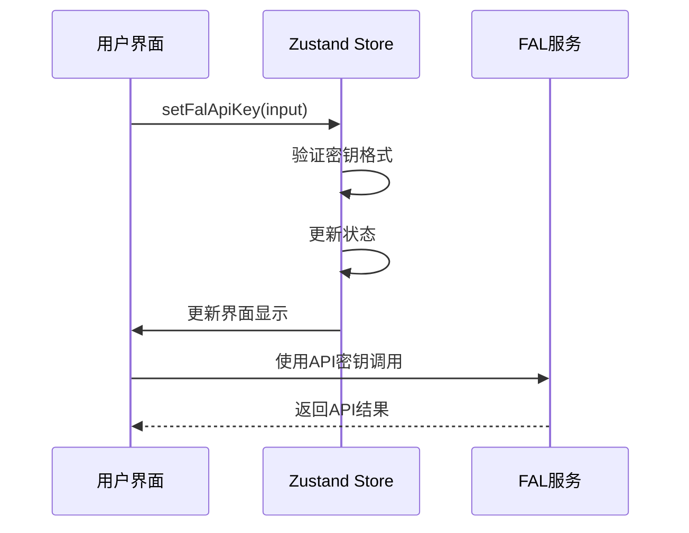
```mermaid
sequenceDiagram
participant UI as 用户界面
participant Store as Zustand Store
participant FAL as FAL服务
UI->>Store : setFalApiKey(input)
Store->>Store : 验证密钥格式
Store->>Store : 更新状态
Store->>UI : 更新界面显示
UI->>FAL : 使用API密钥调用
FAL-->>UI : 返回API结果
```

**图表来源**
- [lib/store.ts:296](file://lib/store.ts#L296)
- [components/canvas/TopBar.tsx:285-311](file://components/canvas/TopBar.tsx#L285-L311)

**章节来源**
- [lib/store.ts:296](file://lib/store.ts#L296)
- [components/canvas/TopBar.tsx:147-318](file://components/canvas/TopBar.tsx#L147-L318)

### 最近项目列表

**新增功能**：系统集成了最近项目列表功能，提供项目历史访问能力，支持用户快速访问最近使用的项目。

#### 项目历史管理

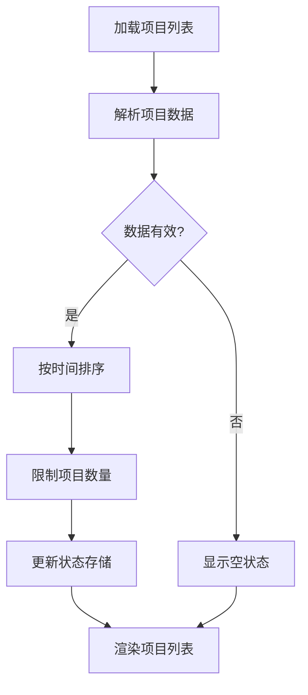
```mermaid
flowchart TD
LoadProjects[加载项目列表] --> ParseData[解析项目数据]
ParseData --> ValidateData{数据有效?}
ValidateData --> |否| ShowEmpty[显示空状态]
ValidateData --> |是| SortProjects[按时间排序]
SortProjects --> LimitCount[限制项目数量]
LimitCount --> UpdateStore[更新状态存储]
UpdateStore --> RenderList[渲染项目列表]
ShowEmpty --> RenderList
```

**图表来源**
- [lib/store.ts:98](file://lib/store.ts#L98)
- [lib/store.ts:134-135](file://lib/store.ts#L134-L135)
- [app/projects/page.tsx:34-42](file://app/projects/page.tsx#L34-L42)

#### 项目列表状态管理

**已增强**：项目列表现在通过状态管理器进行集中管理，支持项目创建、删除、更新等操作的状态同步。

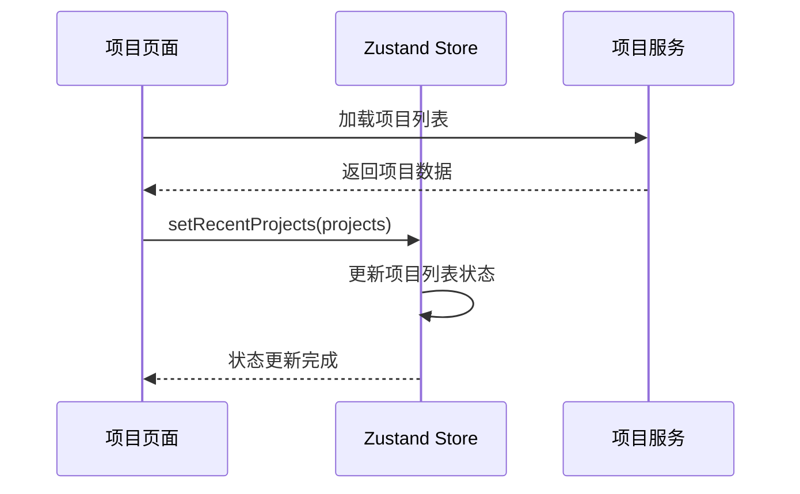
```mermaid
sequenceDiagram
participant ProjectsPage as 项目页面
participant Store as Zustand Store
participant ProjectService as 项目服务
ProjectsPage->>ProjectService : 加载项目列表
ProjectService-->>ProjectsPage : 返回项目数据
ProjectsPage->>Store : setRecentProjects(projects)
Store->>Store : 更新项目列表状态
Store-->>ProjectsPage : 状态更新完成
```

**图表来源**
- [lib/store.ts:98](file://lib/store.ts#L98)
- [lib/store.ts:134-135](file://lib/store.ts#L134-L135)
- [app/projects/page.tsx:34-42](file://app/projects/page.tsx#L34-L42)

**章节来源**
- [lib/store.ts:98-135](file://lib/store.ts#L98-L135)
- [app/projects/page.tsx:1-277](file://app/projects/page.tsx#L1-L277)

### 用户认证状态管理

**新增功能**：系统集成了完整的用户认证状态管理，支持用户数据持久化、登录状态跟踪和登出功能集成。

#### 用户状态生命周期管理

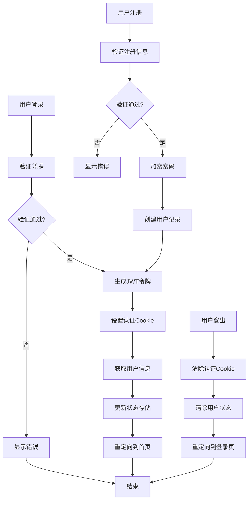
```mermaid
flowchart TD
Login[用户登录] --> Validate[验证凭据]
Validate --> Valid{验证通过?}
Valid --> |否| LoginError[显示错误]
Valid --> |是| GenerateToken[生成JWT令牌]
GenerateToken --> SetCookie[设置认证Cookie]
SetCookie --> FetchUserInfo[获取用户信息]
FetchUserInfo --> UpdateStore[更新状态存储]
UpdateStore --> RedirectHome[重定向到首页]
LoginError --> End[结束]
RedirectHome --> End
Logout[用户登出] --> ClearCookie[清除认证Cookie]
ClearCookie --> ClearStore[清除用户状态]
ClearStore --> RedirectLogin[重定向到登录页]
RedirectLogin --> End
Register[用户注册] --> ValidateInput[验证注册信息]
ValidateInput --> ValidReg{验证通过?}
ValidReg --> |否| RegError[显示错误]
ValidReg --> |是| HashPassword[加密密码]
HashPassword --> CreateUser[创建用户记录]
CreateUser --> GenerateToken
```

**图表来源**
- [lib/store.ts:401-403](file://lib/store.ts#L401-L403)
- [lib/auth.ts:30-50](file://lib/auth.ts#L30-L50)
- [app/api/auth/signin/route.ts:68-84](file://app/api/auth/signin/route.ts#L68-L84)
- [app/api/auth/signup/route.ts:97-109](file://app/api/auth/signup/route.ts#L97-L109)

#### JWT认证机制

系统实现了基于JWT的认证机制，支持密码登录和验证码登录两种方式：

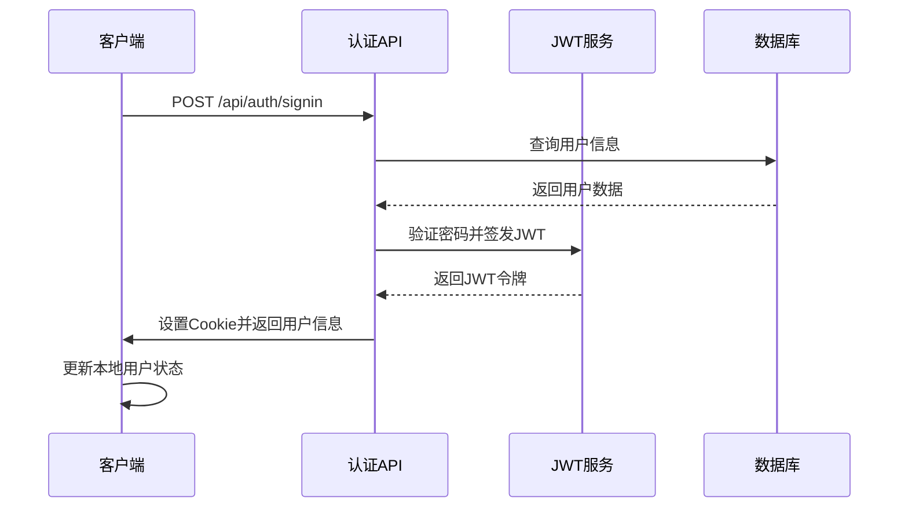
```mermaid
sequenceDiagram
participant Client as 客户端
participant AuthAPI as 认证API
participant JWT as JWT服务
participant Supabase as 数据库
Client->>AuthAPI : POST /api/auth/signin
AuthAPI->>Supabase : 查询用户信息
Supabase-->>AuthAPI : 返回用户数据
AuthAPI->>JWT : 验证密码并签发JWT
JWT-->>AuthAPI : 返回JWT令牌
AuthAPI->>Client : 设置Cookie并返回用户信息
Client->>Client : 更新本地用户状态
```

**图表来源**
- [lib/auth.ts:13-28](file://lib/auth.ts#L13-L28)
- [app/api/auth/signin/route.ts:68-84](file://app/api/auth/signin/route.ts#L68-L84)

**章节来源**
- [lib/store.ts:401-403](file://lib/store.ts#L401-L403)
- [lib/auth.ts:1-64](file://lib/auth.ts#L1-L64)
- [app/api/auth/signin/route.ts:1-93](file://app/api/auth/signin/route.ts#L1-L93)
- [app/api/auth/signup/route.ts:1-118](file://app/api/auth/signup/route.ts#L1-L118)
- [app/api/auth/signout/route.ts:1-20](file://app/api/auth/signout/route.ts#L1-L20)
- [app/api/auth/me/route.ts:1-54](file://app/api/auth/me/route.ts#L1-L54)

### CanvasArea 组件状态管理

CanvasArea 组件展示了复杂的状态管理场景，包括画布元素管理、编辑模式切换、文件上传处理、标记跟踪功能、用户认证状态管理、项目ID跟踪和保存状态指示器。

#### 状态同步机制

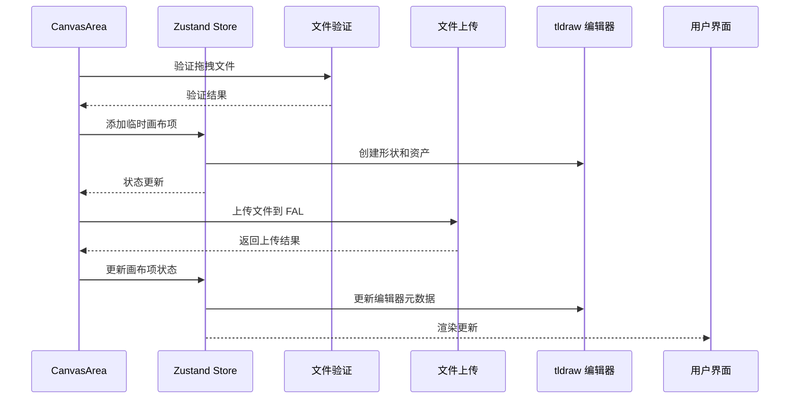
```mermaid
sequenceDiagram
participant Canvas as CanvasArea
participant Store as Zustand Store
participant Validation as 文件验证
participant Upload as 文件上传
participant Tldraw as tldraw 编辑器
participant UI as 用户界面
Canvas->>Validation : 验证拖拽文件
Validation-->>Canvas : 验证结果
Canvas->>Store : 添加临时画布项
Store->>Tldraw : 创建形状和资产
Store-->>Canvas : 状态更新
Canvas->>Upload : 上传文件到 FAL
Upload-->>Canvas : 返回上传结果
Canvas->>Store : 更新画布项状态
Store->>Tldraw : 更新编辑器元数据
Store-->>UI : 渲染更新
```

**图表来源**
- [components/canvas/CanvasArea.tsx:1284-1317](file://components/canvas/CanvasArea.tsx#L1284-L1317)
- [lib/validate.ts:9-13](file://lib/validate.ts#L9-L13)
- [lib/fal.ts:59-61](file://lib/fal.ts#L59-L61)

#### 编辑模式状态管理

CanvasArea 实现了复杂的编辑模式状态管理，支持选择、拖拽、缩放等操作，并集成了标记工具、用户认证状态、项目ID跟踪和保存状态指示器：

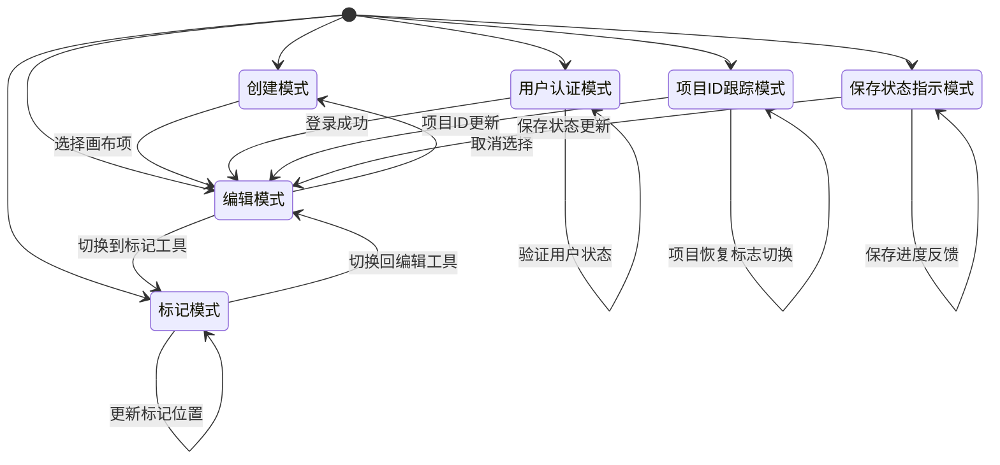
```mermaid
stateDiagram-v2
[*] --> 创建模式
[*] --> 编辑模式
[*] --> 标记模式
[*] --> 用户认证模式
[*] --> 项目ID跟踪模式
[*] --> 保存状态指示模式
创建模式 --> 编辑模式 : 选择画布项
编辑模式 --> 创建模式 : 取消选择
编辑模式 --> 标记模式 : 切换到标记工具
标记模式 --> 编辑模式 : 切换回编辑工具
标记模式 --> 标记模式 : 添加/删除标记
标记模式 --> 标记模式 : 更新标记位置
用户认证模式 --> 编辑模式 : 登录成功
用户认证模式 --> 用户认证模式 : 验证用户状态
项目ID跟踪模式 --> 编辑模式 : 项目ID更新
项目ID跟踪模式 --> 项目ID跟踪模式 : 项目恢复标志切换
保存状态指示模式 --> 编辑模式 : 保存状态更新
保存状态指示模式 --> 保存状态指示模式 : 保存进度反馈
```

**图表来源**
- [components/canvas/CanvasArea.tsx:791-843](file://components/canvas/CanvasArea.tsx#L791-L843)
- [lib/store.ts:267-296](file://lib/store.ts#L267-L296)
- [lib/store.ts:114](file://lib/store.ts#L114)
- [lib/store.ts:137-141](file://lib/store.ts#L137-L141)

**章节来源**
- [components/canvas/CanvasArea.tsx:163-1042](file://components/canvas/CanvasArea.tsx#L163-L1042)

### InlineEditPanel 组件状态管理

InlineEditPanel 组件展示了新的每项参考图片管理功能，包括参考图片的添加、删除、更新和重新排序，以及用户认证状态、项目ID跟踪和保存状态指示器的集成。

#### 参考图片生命周期管理

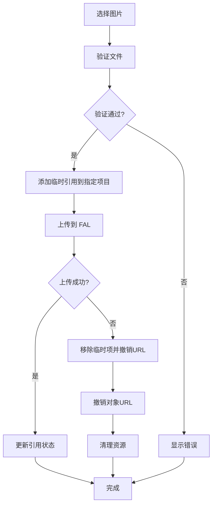
```mermaid
flowchart TD
Select[选择图片] --> Validate[验证文件]
Validate --> Valid{验证通过?}
Valid --> |否| Error[显示错误]
Valid --> |是| AddTemp[添加临时引用到指定项目]
AddTemp --> Upload[上传到 FAL]
Upload --> UploadSuccess{上传成功?}
UploadSuccess --> |否| RemoveTemp[移除临时项并撤销URL]
UploadSuccess --> |是| UpdateRef[更新引用状态]
UpdateRef --> Done[完成]
RemoveTemp --> RevokeURL[撤销对象URL]
RevokeURL --> Cleanup[清理资源]
Cleanup --> Done
Error --> Done
```

**图表来源**
- [components/canvas/InlineEditPanel.tsx:54-86](file://components/canvas/InlineEditPanel.tsx#L54-L86)

#### 参考图片重新排序功能

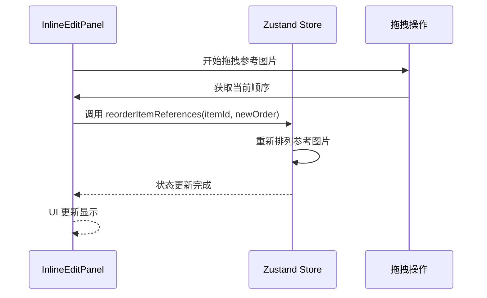
```mermaid
sequenceDiagram
participant Panel as InlineEditPanel
participant Store as Zustand Store
participant Drag as 拖拽操作
Panel->>Drag : 开始拖拽参考图片
Drag->>Panel : 获取当前顺序
Panel->>Store : 调用 reorderItemReferences(itemId, newOrder)
Store->>Store : 重新排列参考图片
Store-->>Panel : 状态更新完成
Panel-->>Panel : UI 更新显示
```

**图表来源**
- [components/canvas/InlineEditPanel.tsx:173-211](file://components/canvas/InlineEditPanel.tsx#L173-L211)

**章节来源**
- [components/canvas/InlineEditPanel.tsx:1-333](file://components/canvas/InlineEditPanel.tsx#L1-L333)

### ChatPanel 组件状态管理

ChatPanel 展示了聊天历史管理和 AI 生成流程的状态处理，新增了项目名称管理、聊天面板控制、用户认证状态管理、项目ID跟踪和保存状态指示器功能。

#### 聊天历史状态管理

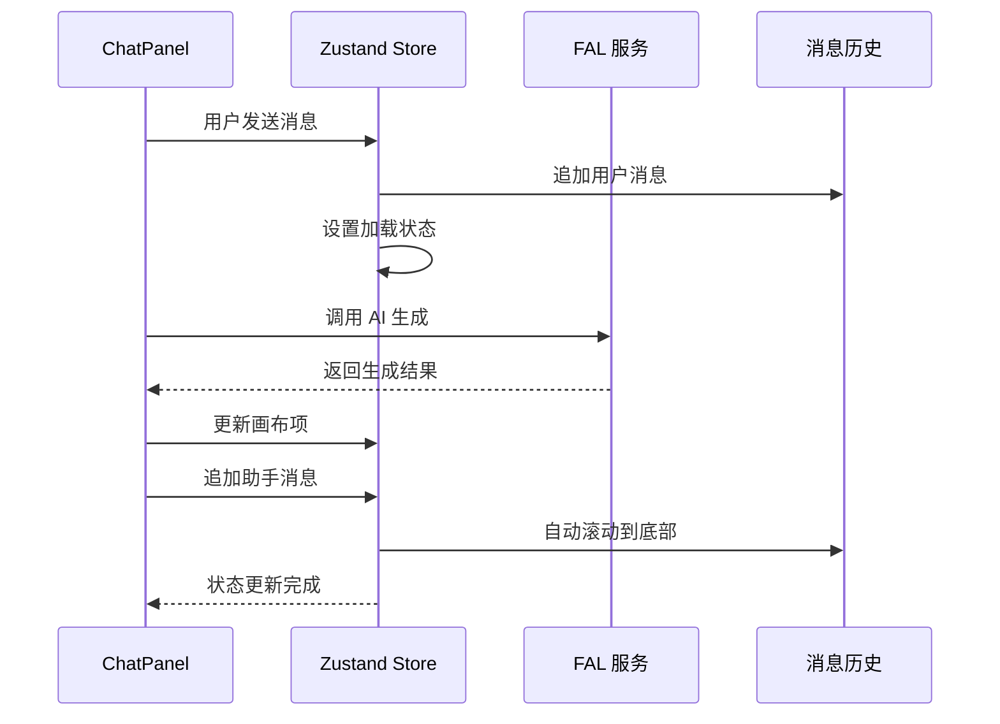
```mermaid
sequenceDiagram
participant Chat as ChatPanel
participant Store as Zustand Store
participant FAL as FAL 服务
participant History as 消息历史
Chat->>Store : 用户发送消息
Store->>History : 追加用户消息
Store->>Store : 设置加载状态
Chat->>FAL : 调用 AI 生成
FAL-->>Chat : 返回生成结果
Chat->>Store : 更新画布项
Chat->>Store : 追加助手消息
Store->>History : 自动滚动到底部
Store-->>Chat : 状态更新完成
```

**图表来源**
- [components/chat/TextInput.tsx:34-89](file://components/chat/TextInput.tsx#L34-L89)
- [components/chat/MessageHistory.tsx:12-14](file://components/chat/MessageHistory.tsx#L12-L14)

#### 项目名称和面板控制

**已增强**：聊天面板现在支持项目名称管理、面板开关控制、宽度调节、用户认证状态管理、项目ID跟踪和保存状态指示器功能。

```mermaid
flowchart TD
ProjectName[项目名称管理] --> SetName[setProjectName]
SetName --> PersistName[持久化项目名称]
PersistName --> UIUpdate[UI 更新显示]
ChatPanel[聊天面板控制] --> Toggle[toggleChat]
Toggle --> Open[openChat]
Toggle --> Close[closeChat]
Open --> Resize[setChatPanelWidth]
Close --> Resize
Resize --> Validate[验证宽度范围]
Validate --> PersistWidth[持久化面板宽度]
PersistWidth --> UIUpdate
UserAuth[用户认证状态] --> SetUser[setUser]
SetUser --> UpdateUI[更新用户界面]
UpdateUI --> PersistUser[持久化用户状态]
PersistUser --> UIUpdate
ProjectTracking[项目ID跟踪] --> SetCurrentId[setCurrentProjectId]
SetCurrentId --> UpdateURL[更新URL参数]
UpdateURL --> LoadProject[加载项目内容]
LoadProject --> SetRestoreFlag[设置恢复标志]
SetRestoreFlag --> ClearRestoreFlag[清除恢复标志]
SaveStatus[保存状态指示] --> SetSaveStatus[setSaveStatus]
SetSaveStatus --> UpdateUI[更新界面显示]
UpdateUI --> PersistSaveStatus[持久化保存状态]
PersistSaveStatus --> UIUpdate
```

**图表来源**
- [lib/store.ts:294](file://lib/store.ts#L294)
- [lib/store.ts:401-403](file://lib/store.ts#L401-L403)
- [lib/store.ts:114](file://lib/store.ts#L114)
- [lib/store.ts:137-141](file://lib/store.ts#L137-L141)

#### 参考图片状态管理

**已迁移**：参考图片上传功能已完全迁移到 InlineEditPanel 组件，ChatPanel 中的 ReferenceUploader 组件仅保留占位功能。

```mermaid
flowchart TD
Migration[架构迁移] --> NewLocation[InlineEditPanel.tsx]
NewLocation --> FullFunctionality[完整参考图片管理]
NewLocation --> PerItemSupport[每项参考处理]
FullFunctionality --> AddRemove[添加/删除]
FullFunctionality --> UpdateOrder[更新/排序]
PerItemSupport --> ScopedState[作用域状态]
```

**图表来源**
- [components/chat/ReferenceUploader.tsx:1-9](file://components/chat/ReferenceUploader.tsx#L1-L9)

**章节来源**
- [components/chat/ChatPanel.tsx:1-22](file://components/chat/ChatPanel.tsx#L1-L22)
- [components/chat/MessageHistory.tsx:1-37](file://components/chat/MessageHistory.tsx#L1-L37)
- [components/chat/TextInput.tsx:1-10](file://components/chat/TextInput.tsx#L1-L10)
- [components/chat/ReferenceUploader.tsx:1-9](file://components/chat/ReferenceUploader.tsx#L1-L9)

### 标记跟踪系统

**新增功能**：系统集成了完整的标记跟踪功能，支持在画布项目上添加、删除和管理标记。

#### 标记生命周期管理

```mermaid
flowchart TD
AddMarker[添加标记] --> CheckLimit{检查数量限制}
CheckLimit --> |超过8个| LimitError[显示错误]
CheckLimit --> |≤8个| CreateMarker[创建新标记]
CreateMarker --> UpdateMarkers[更新标记列表]
UpdateMarkers --> UpdateEditor[更新编辑器元数据]
UpdateEditor --> TriggerRender[触发重渲染]
TriggerRender --> Success[添加成功]
RemoveMarker[删除标记] --> FilterMarkers[过滤标记]
FilterMarkers --> Renumber[重新编号]
Renumber --> UpdateEditor
UpdateEditor --> TriggerRender
ClearMarkers[清空标记] --> UpdateEditor
UpdateEditor --> TriggerRender
```

**图表来源**
- [lib/store.ts:310-399](file://lib/store.ts#L310-L399)

#### 标记渲染机制

**新增功能**：MarkerOverlay 组件使用 tldraw 的 track() 函数响应标记状态变化，通过 markersVersion 确保正确重渲染。

```mermaid
sequenceDiagram
participant Store as Zustand Store
participant Editor as tldraw 编辑器
participant MarkerOverlay as MarkerOverlay
participant UI as 用户界面
Store->>Editor : updateInstanceState(meta.markersVersion)
Editor->>MarkerOverlay : 触发 track() 重新渲染
MarkerOverlay->>MarkerOverlay : 读取 markersVersion
MarkerOverlay->>UI : 渲染标记圆圈
UI->>UI : 更新标记编号和位置
```

**图表来源**
- [components/canvas/CanvasArea.tsx:196-269](file://components/canvas/CanvasArea.tsx#L196-L269)

**章节来源**
- [lib/store.ts:310-399](file://lib/store.ts#L310-L399)
- [components/canvas/CanvasArea.tsx:196-269](file://components/canvas/CanvasArea.tsx#L196-L269)

### 状态持久化策略

系统实现了智能的状态持久化机制，确保用户体验的一致性，仅持久化聊天历史、项目名称、FAL API密钥和用户认证状态：

```mermaid
classDiagram
class PersistMiddleware {
+name : string
+storage : Storage
+partialize(state) object
+getItem(key) string|null
+setItem(key, value) void
+removeItem(key) void
}
class SafeStorage {
+getItem(key) string|null
+setItem(key, value) void
+removeItem(key) void
}
class PersistedSlice {
+chatHistory : Message[]
+projectName : string
+falApiKey : string
+currentProjectId : string|null
+setCurrentProjectId(id) void
+MAX_HISTORY : number
+appendMessage(msg) void
}
class SessionSlice {
+canvasItems : CanvasItem[]
+isEditingMode : boolean
+editingTarget : StoredRef|null
+isLoading : boolean
+markers : Marker[]
+activeTool : string
+isChatOpen : boolean
+chatPanelWidth : number
+selectedShapeIds : string[]
+editor : Editor|null
+recentProjects : ProjectMeta[]
+setRecentProjects(projects) void
+isRestoringProject : boolean
+setIsRestoringProject(v) void
+saveStatus : SaveStatus
+setSaveStatus(status) void
}
class AuthSlice {
+user : User|null
+setUser(user) void
+clearUser() void
}
PersistMiddleware --> SafeStorage
PersistMiddleware --> PersistedSlice
PersistMiddleware --> SessionSlice
PersistMiddleware --> AuthSlice
```

**图表来源**
- [lib/store.ts:405-426](file://lib/store.ts#L405-L426)

**章节来源**
- [lib/store.ts:405-427](file://lib/store.ts#L405-L427)

## 依赖关系分析

### 外部依赖关系

Loveart 的状态管理系统依赖于多个外部库，形成了清晰的依赖层次：

```mermaid
graph TB
subgraph "核心依赖"
Zustand[zustand]
ZustandMiddleware[zustand/middleware]
Tldraw[tldraw]
JWT[jose]
Bcrypt[bcryptjs]
Supabase[supabase]
end
subgraph "业务依赖"
FAL[@fal-ai/client]
FALProxy[@fal-ai/server-proxy]
end
subgraph "UI 依赖"
React[react]
Lucide[lucide-react]
Sonner[sonner]
end
subgraph "开发依赖"
Vitest[vitest]
TestingLib[@testing-library/react]
end
Zustand --> ZustandMiddleware
Zustand --> React
Tldraw --> Zustand
JWT --> ZustandMiddleware
Bcrypt --> Supabase
Supabase --> ZustandMiddleware
FAL --> FALProxy
Lucide --> React
Sonner --> React
Vitest --> TestingLib
```

**图表来源**
- [package.json:11-29](file://package.json#L11-L29)

### 内部模块依赖

系统内部模块之间的依赖关系清晰明确，遵循单一职责原则，新增了认证状态管理与状态存储的紧密集成、JWT认证机制的深度集成、项目服务与状态管理的协同工作：

```mermaid
graph LR
Store[lib/store.ts] --> Types[lib/types.ts]
Store --> Auth[lib/auth.ts]
Store --> ProjectService[lib/project-service.ts]
Store --> FAL[lib/fal.ts]
Store --> Validate[lib/validate.ts]
Canvas[components/canvas/CanvasArea.tsx] --> Store
Canvas --> Validate
Canvas --> FAL
InlineEdit[components/canvas/InlineEditPanel.tsx] --> Store
InlineEdit --> Validate
InlineEdit --> FAL
ChatPanel[components/chat/ChatPanel.tsx] --> Store
MessageHistory[components/chat/MessageHistory.tsx] --> Store
TextInput[components/chat/TextInput.tsx] --> Store
ReferenceUploader[components/chat/ReferenceUploader.tsx] --> Store
MarkerOverlay[components/canvas/CanvasArea.tsx] --> Store
TopBar[components/canvas/TopBar.tsx] --> Store
AuthAPI[app/api/auth/*] --> Auth
AuthAPI --> Supabase[lib/supabase-server.ts]
JWT[lib/auth.ts] --> Middleware[middleware.ts]
Proxy[app/api/fal/proxy/route.ts] --> FAL
ProjectPage[app/projects/page.tsx] --> ProjectService
CanvasPage[app/canvas/page.tsx] --> ProjectService
CanvasPage --> Store
```

**图表来源**
- [lib/store.ts:1-3](file://lib/store.ts#L1-L3)
- [lib/auth.ts:1-64](file://lib/auth.ts#L1-L64)
- [lib/project-service.ts:1-225](file://lib/project-service.ts#L1-L225)
- [middleware.ts:1-64](file://middleware.ts#L1-L64)
- [components/canvas/CanvasArea.tsx:3-17](file://components/canvas/CanvasArea.tsx#L3-L17)
- [components/canvas/InlineEditPanel.tsx:1-11](file://components/canvas/InlineEditPanel.tsx#L1-L11)

**章节来源**
- [package.json:1-48](file://package.json#L1-L48)

## 性能考虑

### 状态更新优化

系统采用了多种性能优化策略来确保状态管理的高效性：

1. **原子性更新**: 所有状态更新都是原子性的，避免中间状态导致的渲染问题
2. **选择性订阅**: 组件只订阅需要的状态片段，减少不必要的重新渲染
3. **批量更新**: 对于相关的状态更新，系统会自动合并以提高性能
4. **内存管理优化**: 新增的每项参考图片管理包含自动 URL 撤销机制
5. **标记版本跟踪**: 通过 markersVersion 确保标记系统高效重渲染
6. **用户状态缓存**: 用户认证状态通过JWT令牌和本地存储实现高效管理
7. **项目ID跟踪优化**: 通过URL参数驱动的项目ID管理，避免状态冗余
8. **保存状态指示器**: 通过状态机管理保存状态，避免频繁的UI更新
9. **自动保存防抖**: 通过防抖机制减少不必要的保存操作
10. **恢复状态保护**: 通过恢复标志防止并发操作冲突

### 内存管理

```mermaid
flowchart TD
Upload[文件上传] --> CreateURL[创建对象URL]
CreateURL --> AddToStore[添加到指定项目状态]
AddToStore --> UseInUI[在UI中使用]
UseInUI --> RemoveFromStore[从状态移除]
RemoveFromStore --> RevokeURL[撤销对象URL]
EditMode[编辑模式] --> UpdateTarget[更新编辑目标]
UpdateTarget --> CleanupTarget[清理旧目标]
CleanupTarget --> MemorySafe[内存安全]
CanvasClear[清空画布] --> RevokeAllRefs[撤销所有参考图片URL]
RevokeAllRefs --> CleanupComplete[清理完成]
MarkerClear[清空标记] --> UpdateEditorMeta[更新编辑器元数据]
UpdateEditorMeta --> TriggerRender[触发重渲染]
TriggerRender --> MemorySafe
UserLogin[用户登录] --> SetCookie[设置认证Cookie]
SetCookie --> UpdateUserState[更新用户状态]
UpdateUserState --> MemorySafe
ProjectRestore[项目恢复] --> SetRestoreFlag[设置恢复标志]
SetRestoreFlag --> ClearRestoreFlag[清除恢复标志]
ClearRestoreFlag --> MemorySafe
SaveProcess[保存过程] --> SetSaveStatus[设置保存状态]
SetSaveStatus --> ClearSavedTimer[清除保存计时器]
ClearSavedTimer --> MemorySafe
```

**图表来源**
- [components/canvas/CanvasArea.tsx:327-338](file://components/canvas/CanvasArea.tsx#L327-L338)
- [components/canvas/InlineEditPanel.tsx:70-83](file://components/canvas/InlineEditPanel.tsx#L70-L83)
- [lib/store.ts:119-126](file://lib/store.ts#L119-L126)
- [lib/auth.ts:30-50](file://lib/auth.ts#L30-L50)
- [lib/store.ts:137-141](file://lib/store.ts#L137-L141)

### 渲染优化

系统通过以下方式优化渲染性能：
- 使用 React.memo 包装纯组件
- 实现自定义比较函数避免不必要的重渲染
- 采用虚拟滚动处理大量消息的历史记录
- 每项参考图片的细粒度更新减少不必要的重渲染
- 标记系统的版本跟踪确保高效重渲染
- tldraw 编辑器的元数据更新机制优化渲染性能
- 用户认证状态的高效缓存机制
- 项目ID跟踪的URL参数驱动优化
- 保存状态指示器的状态机管理
- 自动保存的防抖机制减少UI更新频率

**章节来源**
- [components/canvas/CanvasArea.tsx:163-1042](file://components/canvas/CanvasArea.tsx#L163-L1042)
- [components/canvas/InlineEditPanel.tsx:1-333](file://components/canvas/InlineEditPanel.tsx#L1-L333)
- [components/chat/MessageHistory.tsx:1-37](file://components/chat/MessageHistory.tsx#L1-L37)

## 故障排除指南

### 常见问题及解决方案

#### 状态持久化失败

**问题**: 浏览器不支持本地存储或存储空间不足

**解决方案**: 
- 系统使用安全包装器处理存储异常
- 自动降级到内存存储模式
- 提供错误提示和恢复选项

#### AI 生成超时

**问题**: FAL 服务响应超时或网络连接失败

**解决方案**:
- 实现重试机制和超时处理
- 显示友好的错误提示
- 自动回滚状态变更

#### 文件上传失败

**问题**: 图片格式不支持或文件过大

**解决方案**:
- 实时文件验证和错误提示
- 支持多种图片格式（JPG/PNG/WebP）
- 文件大小限制（10MB）

#### 参考图片管理问题

**问题**: 每项参考图片状态不同步

**解决方案**:
- 确保使用正确的 itemId 参数
- 检查参考图片 ID 的唯一性
- 验证状态更新函数的调用时机

#### 标记系统问题

**问题**: 标记无法正确显示或重渲染

**解决方案**:
- 检查 markersVersion 是否正确更新
- 确认 tldraw 编辑器元数据更新
- 验证标记工具是否正确切换
- 检查标记数量限制（最多8个）

#### 用户认证问题

**问题**: 用户登录状态异常或JWT验证失败

**解决方案**:
- 检查JWT令牌的有效性和过期时间
- 确认认证Cookie的设置和清除
- 验证用户信息查询的数据库连接
- 检查中间件的认证逻辑
- 确认用户状态更新的原子性

#### 项目ID跟踪问题

**问题**: 项目ID状态不同步或URL参数不匹配

**解决方案**:
- 检查 setCurrentProjectId 函数调用
- 验证 URL 参数与状态的一致性
- 确认项目ID的唯一性和有效性
- 检查项目恢复标志的状态切换

#### 保存状态指示器问题

**问题**: 保存状态显示异常或状态机错误

**解决方案**:
- 检查 setSaveStatus 函数调用顺序
- 验证保存状态的转换逻辑
- 确认自动保存机制的防抖设置
- 检查保存状态的计时器管理

#### 自动保存机制问题

**问题**: 自动保存触发异常或保存冲突

**解决方案**:
- 检查 isRestoringProject 标志的状态
- 验证项目ID与闭包状态的一致性
- 确认保存状态的原子性更新
- 检查 beforeunload 事件的处理

#### FAL API密钥问题

**问题**: API密钥验证失败或使用异常

**解决方案**:
- 检查 API密钥的格式和有效性
- 验证密钥存储和使用的安全性
- 确认代理路由的配置正确性
- 检查环境变量的设置

#### 最近项目列表问题

**问题**: 项目列表显示异常或状态不同步

**解决方案**:
- 检查 setRecentProjects 函数调用
- 验证项目数据的解析和验证
- 确认项目列表的排序和限制逻辑
- 检查项目服务的API调用

**章节来源**
- [lib/store.ts:405-426](file://lib/store.ts#L405-L426)
- [lib/validate.ts:1-14](file://lib/validate.ts#L1-L14)
- [components/chat/TextInput.tsx:82-88](file://components/chat/TextInput.tsx#L82-L88)
- [lib/auth.ts:21-28](file://lib/auth.ts#L21-L28)
- [lib/project-service.ts:114-173](file://lib/project-service.ts#L114-L173)

### 调试技巧

1. **状态监控**: 使用浏览器开发者工具观察状态变化
2. **日志记录**: 在关键状态更新点添加日志
3. **单元测试**: 编写全面的测试用例验证状态行为
4. **性能分析**: 使用 React DevTools 分析渲染性能
5. **参考图片调试**: 使用测试套件验证每项参考管理功能
6. **标记系统调试**: 监控 markersVersion 变化确保正确重渲染
7. **tldraw 集成调试**: 检查编辑器元数据更新状态
8. **用户认证调试**: 监控JWT令牌和Cookie状态
9. **中间件调试**: 检查认证中间件的执行流程
10. **项目ID跟踪调试**: 监控URL参数与状态的一致性
11. **保存状态指示器调试**: 验证状态机的转换逻辑
12. **自动保存调试**: 检查防抖机制和恢复标志的状态
13. **FAL API密钥调试**: 验证密钥存储和代理路由配置
14. **最近项目列表调试**: 监控项目数据的同步和更新

**章节来源**
- [__tests__/store.test.ts:1-112](file://__tests__/store.test.ts#L1-L112)

## 最佳实践

### 状态设计原则

1. **单一真相源**: 每个状态只在一个地方修改
2. **不可变性**: 状态更新总是创建新的对象实例
3. **类型安全**: 使用 TypeScript 确保编译时类型检查
4. **模块化**: 将相关状态组织在同一个切片中
5. **作用域隔离**: 每项参考图片状态与项目 ID 绑定，避免全局污染
6. **版本跟踪**: 使用 markersVersion 确保标记系统的正确重渲染
7. **认证安全**: 用户状态管理遵循最小权限原则
8. **JWT最佳实践**: 安全的令牌存储和验证机制
9. **项目ID跟踪**: 通过URL参数驱动的项目状态管理
10. **保存状态指示**: 通过状态机管理保存进度反馈
11. **自动保存保护**: 通过恢复标志防止并发操作冲突
12. **API密钥安全**: 通过状态管理器进行安全的密钥存储

### 组件通信模式

```mermaid
sequenceDiagram
participant Parent as 父组件
participant Store as Zustand Store
participant Child as 子组件
Parent->>Store : 订阅状态
Store-->>Parent : 初始状态
Parent->>Child : 传递状态和回调
Child->>Store : 触发状态更新
Store->>Store : 计算新状态
Store->>Store : 更新编辑器元数据
Store-->>Parent : 状态更新通知
Store-->>Child : 状态更新通知
```

**图表来源**
- [components/canvas/CanvasArea.tsx:163-172](file://components/canvas/CanvasArea.tsx#L163-L172)

### 避免常见陷阱

1. **避免直接修改状态**: 始终使用状态更新函数
2. **防止无限循环**: 注意状态更新中的副作用
3. **正确处理异步操作**: 确保异步操作的错误处理
4. **内存泄漏防护**: 及时清理事件监听器和定时器
5. **参考图片管理陷阱**: 确保每个项目都有独立的参考图片集合
6. **URL 管理**: 始终撤销不再使用的对象 URL
7. **标记系统陷阱**: 确保 markersVersion 正确更新以触发重渲染
8. **tldraw 集成陷阱**: 避免在 track() 内直接依赖 zustand 状态
9. **认证状态陷阱**: 确保用户状态更新的原子性和一致性
10. **JWT 安全陷阱**: 遵循安全的令牌存储和验证最佳实践
11. **项目ID跟踪陷阱**: 确保URL参数与状态的一致性
12. **保存状态指示陷阱**: 避免状态机的竞态条件
13. **自动保存陷阱**: 确保恢复标志的正确状态管理
14. **API密钥陷阱**: 避免密钥的明文存储和传输
15. **最近项目列表陷阱**: 确保项目数据的及时更新和同步

### 使用示例

#### 基本状态读取

```typescript
// 从状态存储中读取特定状态
const canvasItems = useAppStore(state => state.canvasItems)
const isLoading = useAppStore(state => state.isLoading)
const markers = useAppStore(state => state.markers)
const projectName = useAppStore(state => state.projectName)
const user = useAppStore(state => state.user)
const currentProjectId = useAppStore(state => state.currentProjectId)
const isRestoringProject = useAppStore(state => state.isRestoringProject)
const saveStatus = useAppStore(state => state.saveStatus)
const recentProjects = useAppStore(state => state.recentProjects)
const falApiKey = useAppStore(state => state.falApiKey)
```

#### 状态更新操作

```typescript
// 添加画布项
useAppStore.getState().addCanvasItem(newItem)

// 更新编辑模式
useAppStore.getState().setEditingMode(true, targetItem)

// 追加聊天消息
useAppStore.getState().appendMessage(message)

// 每项参考图片管理
useAppStore.getState().addItemReference("itemId", reference)
useAppStore.getState().removeItemReference("itemId", "refId")
useAppStore.getState().updateItemReference("itemId", "refId", patch)
useAppStore.getState().reorderItemReferences("itemId", ["ref3", "ref1", "ref2"])

// 标记管理
useAppStore.getState().setActiveTool("marker")
useAppStore.getState().addMarker("itemId", 0.5, 0.5)
useAppStore.getState().removeMarker("markerId")
useAppStore.getState().removeMarkersByItemId("itemId")
useAppStore.getState().clearMarkers()

// 项目名称管理
useAppStore.getState().setProjectName("My Project")

// 项目ID跟踪
useAppStore.getState().setCurrentProjectId("projectId")

// 聊天面板控制
useAppStore.getState().toggleChat()
useAppStore.getState().openChat()
useAppStore.getState().closeChat()
useAppStore.getState().setChatPanelWidth(400)

// 保存状态指示器
useAppStore.getState().setSaveStatus('saving')
useAppStore.getState().setSaveStatus('saved')
useAppStore.getState().setSaveStatus('error')

// 恢复状态标志
useAppStore.getState().setIsRestoringProject(true)
useAppStore.getState().setIsRestoringProject(false)

// 最近项目列表
useAppStore.getState().setRecentProjects(projects)

// FAL API密钥
useAppStore.getState().setFalApiKey("your-api-key")

// 用户状态管理
useAppStore.getState().setUser(userData)
useAppStore.getState().clearUser()
```

#### 异步状态处理

```typescript
// 处理文件上传
try {
  const falUrl = await uploadFile(file)
  useAppStore.getState().updateItemReference(itemId, id, { falUrl, uploading: false })
} catch (error) {
  useAppStore.getState().removeItemReference(itemId, id)
}

// 处理标记添加
if (useAppStore.getState().addMarker("itemId", 0.3, 0.7)) {
  console.log("标记添加成功")
} else {
  console.log("标记数量已达上限")
}

// 处理用户登录
try {
  const response = await fetch('/api/auth/signin', {
    method: 'POST',
    headers: { 'Content-Type': 'application/json' },
    body: JSON.stringify({ phone, password }),
  })
  const data = await response.json()
  if (data.success && data.data?.user) {
    useAppStore.getState().setUser(data.data.user)
  }
} catch (error) {
  console.error('登录失败:', error)
}

// 处理项目保存
try {
  useAppStore.getState().setSaveStatus('saving')
  await saveProjectSnapshot(projectId, snapshot, projectName)
  useAppStore.getState().setSaveStatus('saved')
  setTimeout(() => {
    useAppStore.getState().setSaveStatus('idle')
  }, 3000)
} catch (error) {
  useAppStore.getState().setSaveStatus('error')
}

// 处理项目恢复
useAppStore.getState().setIsRestoringProject(true)
try {
  const project = await loadProject(projectId)
  // 恢复项目内容
} finally {
  useAppStore.getState().setIsRestoringProject(false)
}
```

**章节来源**
- [lib/store.ts:85-427](file://lib/store.ts#L85-L427)
- [components/canvas/CanvasArea.tsx:331-338](file://components/canvas/CanvasArea.tsx#L331-L338)
- [components/canvas/InlineEditPanel.tsx:54-86](file://components/canvas/InlineEditPanel.tsx#L54-L86)
- [components/chat/TextInput.tsx:64-89](file://components/chat/TextInput.tsx#L64-L89)
- [lib/project-service.ts:114-173](file://lib/project-service.ts#L114-L173)

## 结论

Loveart 的状态管理系统展现了现代前端应用的最佳实践。通过采用 Zustand 的轻量级架构、严格的类型安全设计、智能的持久化策略和完整的用户认证状态管理，系统实现了高性能、可维护、安全的状态管理方案。

**重大更新总结**：
- 成功从全局参考图片管理迁移到每项参考处理模式
- 新增了完整的每项参考图片生命周期管理功能
- 实现了参考图片的添加、删除、更新和重新排序能力
- 优化了内存管理，自动处理对象 URL 的撤销
- 新增了完整的标记跟踪系统，支持在画布项目上添加、删除和管理标记
- 增强了画布项目属性管理，支持自然尺寸和文件名跟踪
- 扩展了聊天面板功能，新增项目名称管理和面板控制
- 实现了基于版本跟踪的标记重渲染机制
- 深度集成了 tldraw 编辑器，支持标记工具与编辑器的协作
- **新增**：完整的用户认证状态管理系统，包括JWT认证、用户状态持久化、登录状态跟踪和登出功能集成
- **新增**：项目ID跟踪功能，支持当前项目状态的精确控制和URL参数驱动的项目管理
- **新增**：恢复状态标志，确保项目加载过程中的状态一致性，防止并发操作冲突
- **新增**：保存状态指示器，提供实时的保存进度反馈，包括保存中、已保存、保存失败等状态
- **新增**：FAL API密钥管理功能，支持用户自定义API密钥配置，提供安全的密钥存储和使用机制
- **新增**：最近项目列表功能，提供项目历史访问能力，支持用户快速访问最近使用的项目
- **新增**：中间件认证保护，确保受保护路由的安全访问
- **新增**：用户信息获取API，支持客户端实时获取用户状态
- **新增**：自动保存机制，集成保存状态管理和项目恢复保护

### 主要优势

1. **简洁高效**: Zustand 的简单 API 减少了样板代码
2. **类型安全**: 完整的 TypeScript 类型定义确保运行时安全
3. **持久化支持**: 智能的本地存储机制提升用户体验
4. **模块化设计**: 清晰的状态切片分离便于维护
5. **性能优化**: 原子性更新和选择性订阅确保高效渲染
6. **内存安全**: 自动化的对象 URL 管理防止内存泄漏
7. **细粒度控制**: 每项参考图片管理提供更好的用户体验
8. **标记系统**: 完整的标记跟踪功能增强用户交互体验
9. **版本跟踪**: 基于 markersVersion 的高效重渲染机制
10. **tldraw 集成**: 深度集成的编辑器协作功能
11. **认证安全**: 基于JWT的用户认证机制确保系统安全
12. **中间件保护**: 全面的路由认证保护机制
13. **状态隔离**: 用户状态与业务状态的清晰分离
14. **项目管理**: 完整的项目生命周期管理支持
15. **保存反馈**: 实时的保存状态指示器提升用户体验
16. **API密钥管理**: 安全的FAL API密钥配置和使用机制
17. **历史访问**: 最近项目列表提供便捷的项目导航

### 技术亮点

- **原子性状态更新**: 确保状态变更的完整性和一致性
- **智能持久化**: 只持久化必要的状态数据
- **异步操作处理**: 完善的错误处理和状态回滚机制
- **内存管理**: 自动清理临时资源，防止内存泄漏
- **测试友好**: 完善的单元测试覆盖关键状态逻辑
- **架构演进**: 平滑的从全局到每项管理的迁移
- **标记系统**: 基于版本跟踪的高效重渲染机制
- **tldraw 集成**: 深度协作的编辑器集成方案
- **用户认证**: 完整的JWT认证和状态管理机制
- **中间件安全**: 全面的路由保护和认证中间件
- **状态隔离**: 用户状态与业务状态的清晰分离
- **项目ID跟踪**: URL参数驱动的项目状态管理
- **保存状态指示**: 状态机管理的保存进度反馈
- **自动保存保护**: 恢复标志防止并发操作冲突
- **API密钥安全**: 状态管理器的密钥存储和使用
- **最近项目列表**: 项目历史访问的便捷导航

该状态管理系统为 Loveart 提供了坚实的技术基础，支持复杂的画布编辑、AI 交互、标记跟踪、用户认证、项目管理和保存状态指示等功能，同时保持了良好的可扩展性和可维护性。新的每项参考图片管理功能、标记跟踪系统、增强的 tldraw 集成功能、完整的用户认证状态管理、项目ID跟踪、恢复状态标志、保存状态指示器、FAL API密钥管理和最近项目列表为用户提供了更丰富的交互体验，开发者可以基于此架构快速扩展新的功能模块，而无需担心状态管理的复杂性。

**新增功能的特别优势**：
- **用户认证状态管理**：提供安全可靠的用户身份验证和状态管理
- **JWT认证机制**：基于标准协议的安全令牌管理
- **中间件保护**：自动化的路由认证和访问控制
- **实时用户状态**：客户端与服务端的用户状态同步
- **安全的Cookie管理**：符合安全最佳实践的认证令牌存储
- **灵活的认证方式**：支持密码登录和验证码登录两种认证方式
- **完整的认证API**：RESTful的认证接口设计
- **用户信息管理**：完整的用户数据查询和管理功能
- **项目ID跟踪**：精确的项目状态控制和URL参数驱动管理
- **恢复状态标志**：确保项目加载过程中的状态一致性
- **保存状态指示器**：实时的保存进度反馈和状态管理
- **自动保存保护**：防止并发操作冲突的恢复标志机制
- **FAL API密钥管理**：安全的用户自定义API密钥配置
- **最近项目列表**：便捷的项目历史访问和导航功能
- **项目生命周期管理**：完整的项目创建、加载、保存、删除支持
- **保存状态机**：通过状态机管理保存进度的可靠机制
- **防抖保存机制**：减少不必要的保存操作的性能优化
- **URL参数同步**：确保项目ID与URL参数的一致性