# 状态管理系统

<cite>
**本文档引用的文件**
- [lib/store.ts](file://lib/store.ts)
- [lib/types.ts](file://lib/types.ts)
- [lib/fal.ts](file://lib/fal.ts)
- [lib/validate.ts](file://lib/validate.ts)
- [components/canvas/CanvasArea.tsx](file://components/canvas/CanvasArea.tsx)
- [components/canvas/InlineEditPanel.tsx](file://components/canvas/InlineEditPanel.tsx)
- [components/chat/ChatPanel.tsx](file://components/chat/ChatPanel.tsx)
- [components/chat/MessageHistory.tsx](file://components/chat/MessageHistory.tsx)
- [components/chat/TextInput.tsx](file://components/chat/TextInput.tsx)
- [components/chat/ReferenceUploader.tsx](file://components/chat/ReferenceUploader.tsx)
- [app/api/fal/proxy/route.ts](file://app/api/fal/proxy/route.ts)
- [app/page.tsx](file://app/page.tsx)
- [__tests__/store.test.ts](file://__tests__/store.test.ts)
- [package.json](file://package.json)
</cite>

## 目录
1. [简介](#简介)
2. [项目结构](#项目结构)
3. [核心组件](#核心组件)
4. [架构概览](#架构概览)
5. [详细组件分析](#详细组件分析)
6. [依赖关系分析](#依赖关系分析)
7. [性能考虑](#性能考虑)
8. [故障排除指南](#故障排除指南)
9. [最佳实践](#最佳实践)
10. [结论](#结论)

## 简介

Loveart 是一个基于 Next.js 和 Zustand 的 AI 创意设计平台，采用现代化的状态管理模式。该系统通过 Zustand 实现轻量级、类型安全的状态管理，支持状态持久化、副作用处理和组件间通信。系统主要包含画布编辑功能和 AI 聊天交互两大核心模块，为用户提供直观的图像生成和编辑体验。

**重大更新**：状态管理架构已从全局参考图片管理迁移到每项参考处理模式。新的架构支持每画布项目的参考图片集合，包括添加、删除、更新和重新排序功能。

## 项目结构

Loveart 项目采用清晰的分层架构，状态管理位于应用的核心层，为各个功能模块提供统一的状态访问接口。

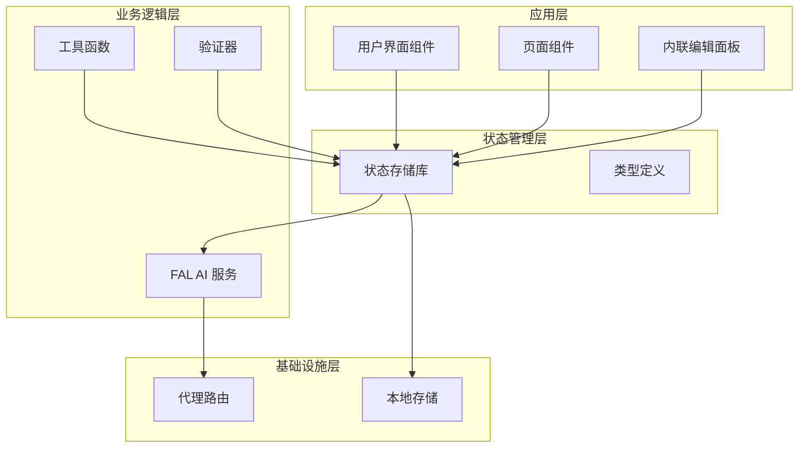

**图表来源**
- [lib/store.ts:1-176](file://lib/store.ts#L1-L176)
- [lib/types.ts:1-37](file://lib/types.ts#L1-L37)
- [lib/fal.ts:1-62](file://lib/fal.ts#L1-L62)

**章节来源**
- [lib/store.ts:1-176](file://lib/store.ts#L1-L176)
- [lib/types.ts:1-37](file://lib/types.ts#L1-L37)
- [package.json:1-48](file://package.json#L1-L48)

## 核心组件

### Zustand 状态存储库

Loveart 使用 Zustand 作为状态管理核心，实现了类型安全的状态存储和操作接口。

#### 状态切片设计

系统采用多切片架构，将不同功能域的状态分离管理，新增了每项参考图片管理功能：

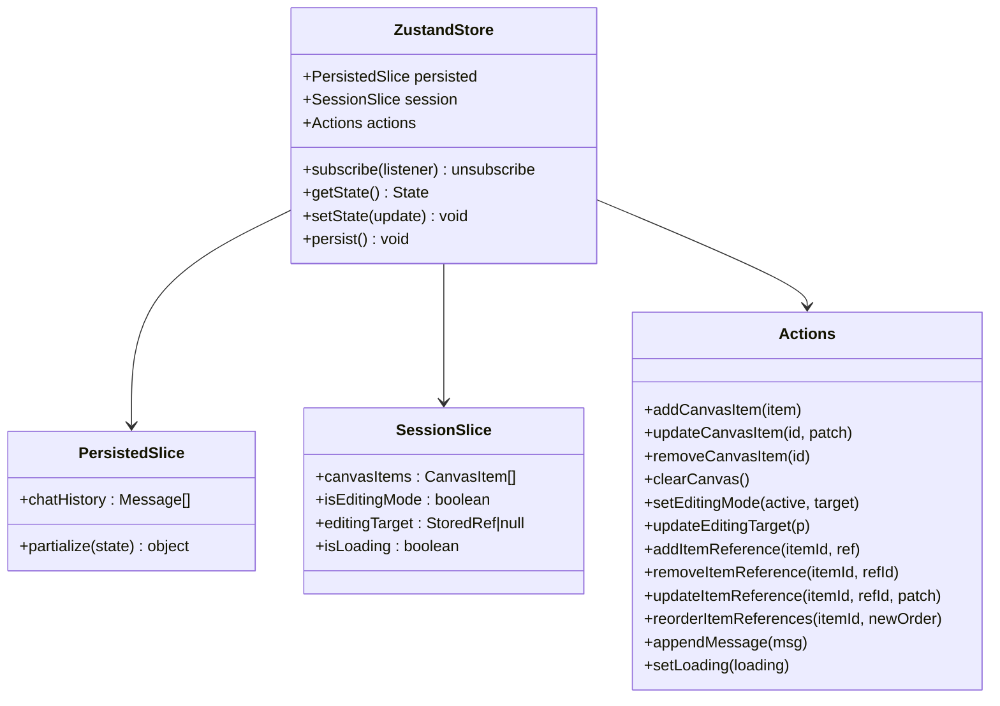

**图表来源**
- [lib/store.ts:19-33](file://lib/store.ts#L19-L33)

#### 数据结构定义

系统定义了完整的数据模型，确保类型安全和运行时验证，新增了每项参考图片集合支持：

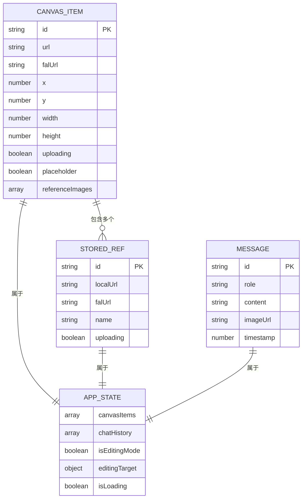

**图表来源**
- [lib/types.ts:17-36](file://lib/types.ts#L17-L36)

**章节来源**
- [lib/store.ts:46-175](file://lib/store.ts#L46-L175)
- [lib/types.ts:1-37](file://lib/types.ts#L1-L37)

## 架构概览

Loveart 的状态管理架构采用单向数据流模式，确保状态更新的可预测性和可追踪性，支持每项参考图片的细粒度管理。

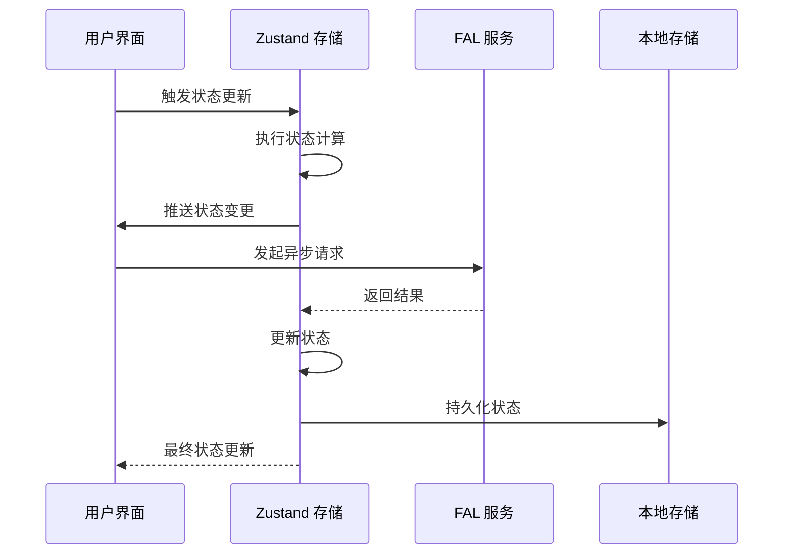

**图表来源**
- [lib/store.ts:46-175](file://lib/store.ts#L46-L175)
- [lib/fal.ts:21-61](file://lib/fal.ts#L21-L61)

### 状态更新机制

系统实现了原子性的状态更新机制，确保状态变更的完整性和一致性，支持每项参考图片的独立管理：

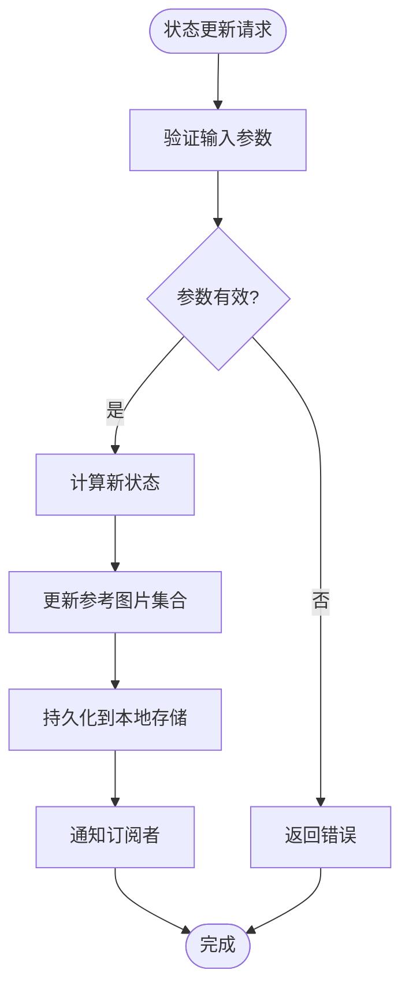

**图表来源**
- [lib/store.ts:58-157](file://lib/store.ts#L58-L157)

**章节来源**
- [lib/store.ts:46-175](file://lib/store.ts#L46-L175)

## 详细组件分析

### CanvasArea 组件状态管理

CanvasArea 组件展示了复杂的状态管理场景，包括画布元素管理、编辑模式切换和文件上传处理。

#### 状态同步机制

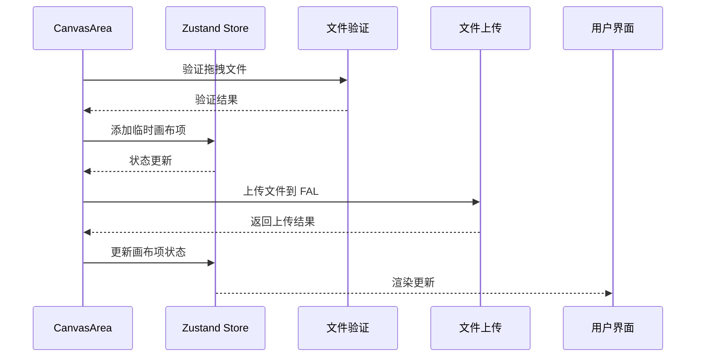

**图表来源**
- [components/canvas/CanvasArea.tsx:306-340](file://components/canvas/CanvasArea.tsx#L306-L340)
- [lib/validate.ts:9-13](file://lib/validate.ts#L9-L13)
- [lib/fal.ts:59-61](file://lib/fal.ts#L59-L61)

#### 编辑模式状态管理

CanvasArea 实现了复杂的编辑模式状态管理，支持选择、拖拽、缩放等操作：

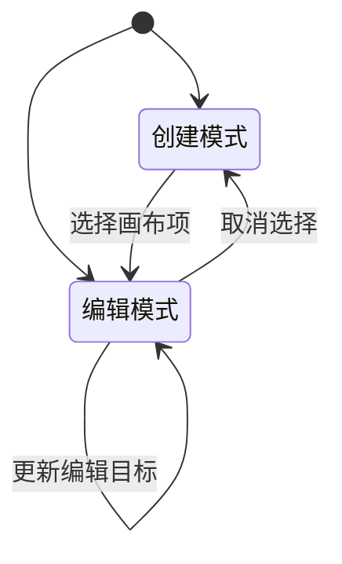

**图表来源**
- [components/canvas/CanvasArea.tsx:279-292](file://components/canvas/CanvasArea.tsx#L279-L292)
- [lib/store.ts:92-98](file://lib/store.ts#L92-L98)

**章节来源**
- [components/canvas/CanvasArea.tsx:163-431](file://components/canvas/CanvasArea.tsx#L163-L431)

### InlineEditPanel 组件状态管理

InlineEditPanel 组件展示了新的每项参考图片管理功能，包括参考图片的添加、删除、更新和重新排序。

#### 参考图片生命周期管理

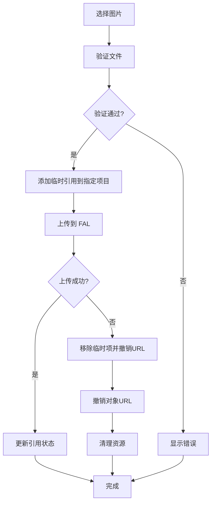

**图表来源**
- [components/canvas/InlineEditPanel.tsx:54-86](file://components/canvas/InlineEditPanel.tsx#L54-L86)

#### 参考图片重新排序功能

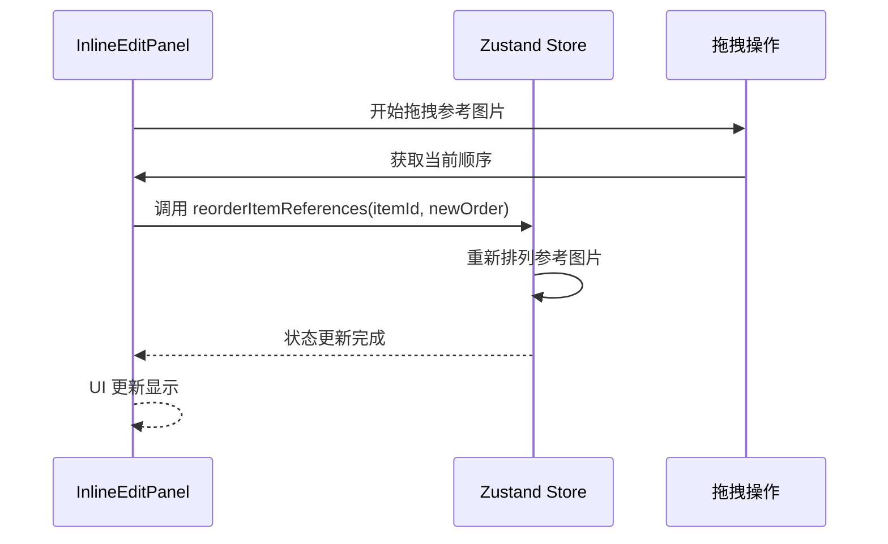

**图表来源**
- [components/canvas/InlineEditPanel.tsx:173-211](file://components/canvas/InlineEditPanel.tsx#L173-L211)

**章节来源**
- [components/canvas/InlineEditPanel.tsx:1-333](file://components/canvas/InlineEditPanel.tsx#L1-L333)

### ChatPanel 组件状态管理

ChatPanel 展示了聊天历史管理和 AI 生成流程的状态处理。

#### 聊天历史状态管理

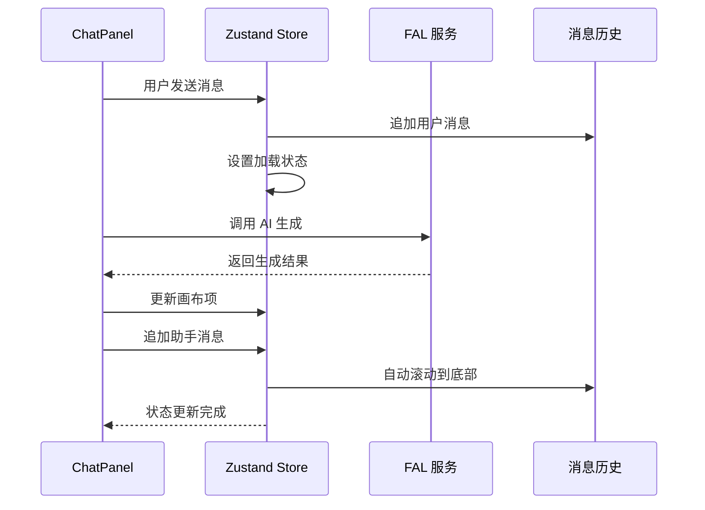

**图表来源**
- [components/chat/TextInput.tsx:34-89](file://components/chat/TextInput.tsx#L34-L89)
- [components/chat/MessageHistory.tsx:12-14](file://components/chat/MessageHistory.tsx#L12-L14)

#### 参考图片状态管理

**已迁移**：参考图片上传功能已完全迁移到 InlineEditPanel 组件，ChatPanel 中的 ReferenceUploader 组件仅保留占位功能。

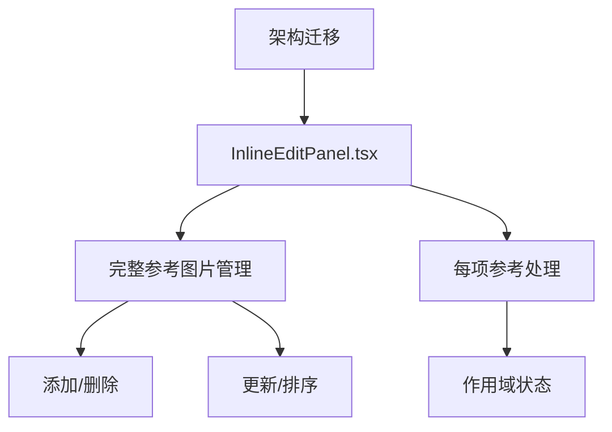

**图表来源**
- [components/chat/ReferenceUploader.tsx:1-9](file://components/chat/ReferenceUploader.tsx#L1-L9)

**章节来源**
- [components/chat/ChatPanel.tsx:1-22](file://components/chat/ChatPanel.tsx#L1-L22)
- [components/chat/MessageHistory.tsx:1-37](file://components/chat/MessageHistory.tsx#L1-L37)
- [components/chat/TextInput.tsx:1-10](file://components/chat/TextInput.tsx#L1-L10)
- [components/chat/ReferenceUploader.tsx:1-9](file://components/chat/ReferenceUploader.tsx#L1-L9)

### 状态持久化策略

系统实现了智能的状态持久化机制，确保用户体验的一致性，仅持久化聊天历史：

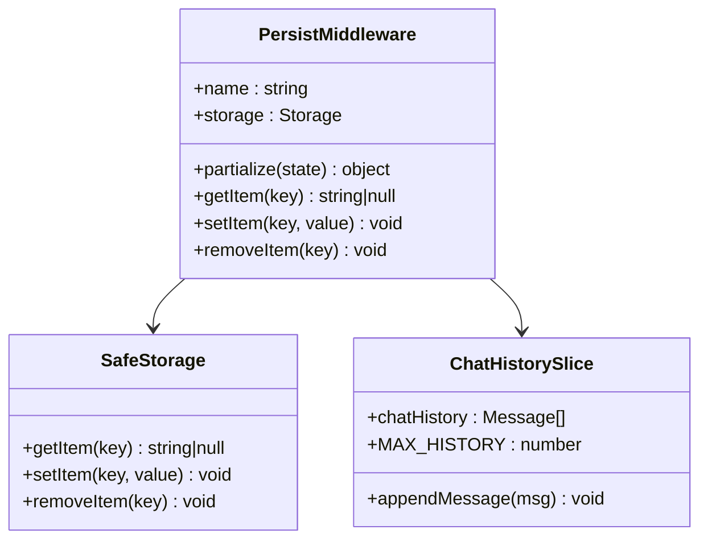

**图表来源**
- [lib/store.ts:7-17](file://lib/store.ts#L7-L17)
- [lib/store.ts:159-174](file://lib/store.ts#L159-L174)

**章节来源**
- [lib/store.ts:159-175](file://lib/store.ts#L159-L175)

## 依赖关系分析

### 外部依赖关系

Loveart 的状态管理系统依赖于多个外部库，形成了清晰的依赖层次：

```mermaid
graph TB
subgraph "核心依赖"
Zustand[zustand]
ZustandMiddleware[zustand/middleware]
end
subgraph "业务依赖"
FAL[@fal-ai/client]
FALProxy[@fal-ai/server-proxy]
end
subgraph "UI 依赖"
React[react]
Konva[react-konva]
Lucide[lucide-react]
end
subgraph "开发依赖"
Vitest[vitest]
TestingLib[@testing-library/react]
end
Zustand --> ZustandMiddleware
Zustand --> React
FAL --> FALProxy
FALProxy --> ZustandMiddleware
Konva --> React
Lucide --> React
Vitest --> TestingLib
```

**图表来源**
- [package.json:11-29](file://package.json#L11-L29)

### 内部模块依赖

系统内部模块之间的依赖关系清晰明确，遵循单一职责原则，新增了 InlineEditPanel 与状态管理的紧密集成：

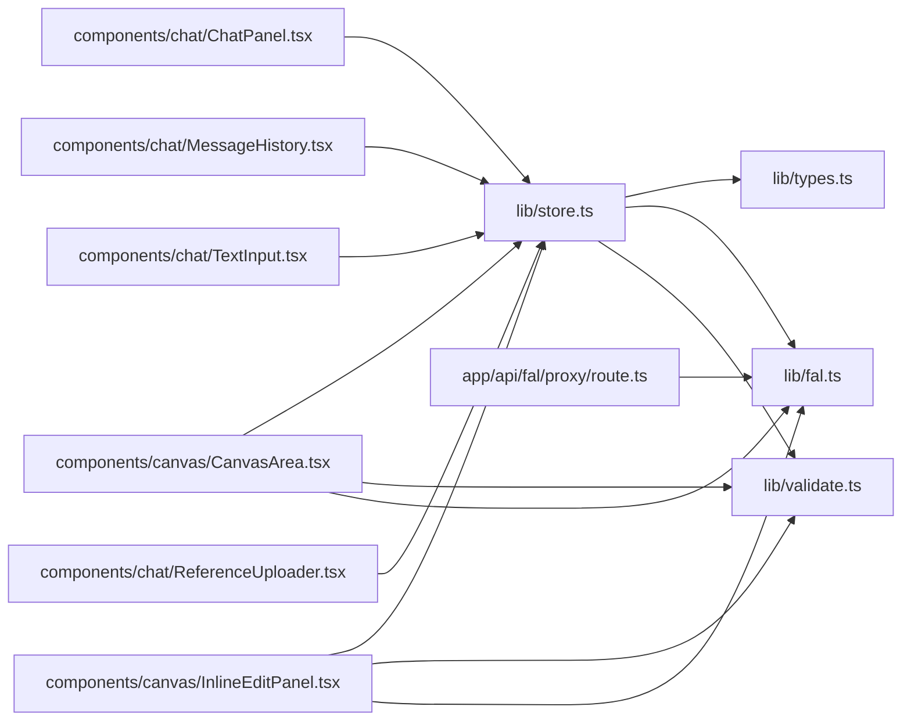

**图表来源**
- [lib/store.ts:1-3](file://lib/store.ts#L1-L3)
- [components/canvas/CanvasArea.tsx:3-13](file://components/canvas/CanvasArea.tsx#L3-L13)
- [components/canvas/InlineEditPanel.tsx:1-11](file://components/canvas/InlineEditPanel.tsx#L1-L11)

**章节来源**
- [package.json:1-48](file://package.json#L1-L48)

## 性能考虑

### 状态更新优化

系统采用了多种性能优化策略来确保状态管理的高效性：

1. **原子性更新**: 所有状态更新都是原子性的，避免中间状态导致的渲染问题
2. **选择性订阅**: 组件只订阅需要的状态片段，减少不必要的重新渲染
3. **批量更新**: 对于相关的状态更新，系统会自动合并以提高性能
4. **内存管理优化**: 新增的每项参考图片管理包含自动 URL 撤销机制

### 内存管理

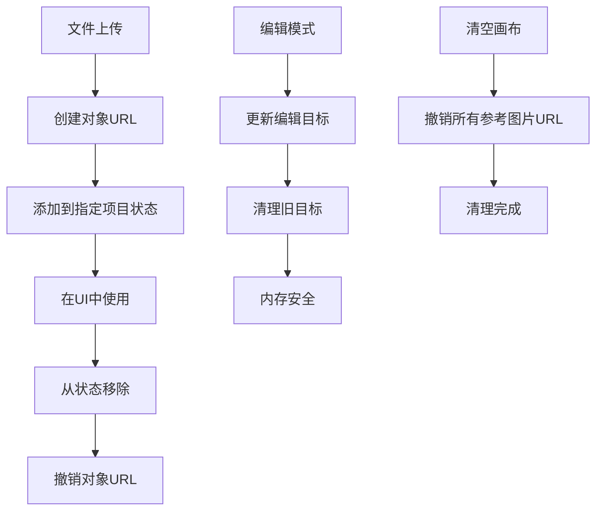

**图表来源**
- [components/canvas/CanvasArea.tsx:327-338](file://components/canvas/CanvasArea.tsx#L327-L338)
- [components/canvas/InlineEditPanel.tsx:70-83](file://components/canvas/InlineEditPanel.tsx#L70-L83)
- [lib/store.ts:70-88](file://lib/store.ts#L70-L88)

### 渲染优化

系统通过以下方式优化渲染性能：
- 使用 React.memo 包装纯组件
- 实现自定义比较函数避免不必要的重渲染
- 采用虚拟滚动处理大量消息的历史记录
- 每项参考图片的细粒度更新减少不必要的重渲染

**章节来源**
- [components/canvas/CanvasArea.tsx:163-431](file://components/canvas/CanvasArea.tsx#L163-L431)
- [components/canvas/InlineEditPanel.tsx:1-333](file://components/canvas/InlineEditPanel.tsx#L1-L333)
- [components/chat/MessageHistory.tsx:1-37](file://components/chat/MessageHistory.tsx#L1-L37)

## 故障排除指南

### 常见问题及解决方案

#### 状态持久化失败

**问题**: 浏览器不支持本地存储或存储空间不足

**解决方案**: 
- 系统使用安全包装器处理存储异常
- 自动降级到内存存储模式
- 提供错误提示和恢复选项

#### AI 生成超时

**问题**: FAL 服务响应超时或网络连接失败

**解决方案**:
- 实现重试机制和超时处理
- 显示友好的错误提示
- 自动回滚状态变更

#### 文件上传失败

**问题**: 图片格式不支持或文件过大

**解决方案**:
- 实时文件验证和错误提示
- 支持多种图片格式（JPG/PNG/WebP）
- 文件大小限制（10MB）

#### 参考图片管理问题

**问题**: 每项参考图片状态不同步

**解决方案**:
- 确保使用正确的 itemId 参数
- 检查参考图片 ID 的唯一性
- 验证状态更新函数的调用时机

**章节来源**
- [lib/store.ts:7-17](file://lib/store.ts#L7-L17)
- [lib/validate.ts:1-14](file://lib/validate.ts#L1-L14)
- [components/chat/TextInput.tsx:82-88](file://components/chat/TextInput.tsx#L82-L88)

### 调试技巧

1. **状态监控**: 使用浏览器开发者工具观察状态变化
2. **日志记录**: 在关键状态更新点添加日志
3. **单元测试**: 编写全面的测试用例验证状态行为
4. **性能分析**: 使用 React DevTools 分析渲染性能
5. **参考图片调试**: 使用测试套件验证每项参考管理功能

**章节来源**
- [__tests__/store.test.ts:1-112](file://__tests__/store.test.ts#L1-L112)

## 最佳实践

### 状态设计原则

1. **单一真相源**: 每个状态只在一个地方修改
2. **不可变性**: 状态更新总是创建新的对象实例
3. **类型安全**: 使用 TypeScript 确保编译时类型检查
4. **模块化**: 将相关状态组织在同一个切片中
5. **作用域隔离**: 每项参考图片状态与项目 ID 绑定，避免全局污染

### 组件通信模式

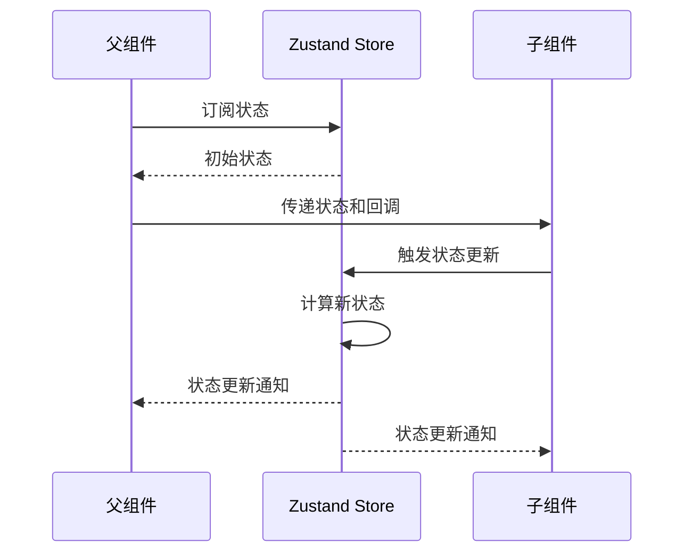

**图表来源**
- [components/canvas/CanvasArea.tsx:163-172](file://components/canvas/CanvasArea.tsx#L163-L172)

### 避免常见陷阱

1. **避免直接修改状态**: 始终使用状态更新函数
2. **防止无限循环**: 注意状态更新中的副作用
3. **正确处理异步操作**: 确保异步操作的错误处理
4. **内存泄漏防护**: 及时清理事件监听器和定时器
5. **参考图片管理陷阱**: 确保每个项目都有独立的参考图片集合
6. **URL 管理**: 始终撤销不再使用的对象 URL

### 使用示例

#### 基本状态读取

```typescript
// 从状态存储中读取特定状态
const canvasItems = useAppStore(state => state.canvasItems)
const isLoading = useAppStore(state => state.isLoading)
```

#### 状态更新操作

```typescript
// 添加画布项
useAppStore.getState().addCanvasItem(newItem)

// 更新编辑模式
useAppStore.getState().setEditingMode(true, targetItem)

// 追加聊天消息
useAppStore.getState().appendMessage(message)

// 每项参考图片管理
useAppStore.getState().addItemReference("itemId", reference)
useAppStore.getState().removeItemReference("itemId", "refId")
useAppStore.getState().updateItemReference("itemId", "refId", patch)
useAppStore.getState().reorderItemReferences("itemId", ["ref3", "ref1", "ref2"])
```

#### 异步状态处理

```typescript
// 处理文件上传
try {
  const falUrl = await uploadFile(file)
  useAppStore.getState().updateItemReference(itemId, id, { falUrl, uploading: false })
} catch (error) {
  useAppStore.getState().removeItemReference(itemId, id)
}
```

**章节来源**
- [lib/store.ts:46-175](file://lib/store.ts#L46-L175)
- [components/canvas/CanvasArea.tsx:331-338](file://components/canvas/CanvasArea.tsx#L331-L338)
- [components/canvas/InlineEditPanel.tsx:54-86](file://components/canvas/InlineEditPanel.tsx#L54-L86)
- [components/chat/TextInput.tsx:64-89](file://components/chat/TextInput.tsx#L64-L89)

## 结论

Loveart 的状态管理系统展现了现代前端应用的最佳实践。通过采用 Zustand 的轻量级架构、严格的类型安全设计和智能的持久化策略，系统实现了高性能、可维护的状态管理方案。

**重大更新总结**：
- 成功从全局参考图片管理迁移到每项参考处理模式
- 新增了完整的每项参考图片生命周期管理功能
- 实现了参考图片的添加、删除、更新和重新排序能力
- 优化了内存管理，自动处理对象 URL 的撤销
- 保持了向后兼容性，原有功能不受影响

### 主要优势

1. **简洁高效**: Zustand 的简单 API 减少了样板代码
2. **类型安全**: 完整的 TypeScript 类型定义确保运行时安全
3. **持久化支持**: 智能的本地存储机制提升用户体验
4. **模块化设计**: 清晰的状态切片分离便于维护
5. **性能优化**: 原子性更新和选择性订阅确保高效渲染
6. **内存安全**: 自动化的对象 URL 管理防止内存泄漏
7. **细粒度控制**: 每项参考图片管理提供更好的用户体验

### 技术亮点

- **原子性状态更新**: 确保状态变更的完整性和一致性
- **智能持久化**: 只持久化必要的状态数据
- **异步操作处理**: 完善的错误处理和状态回滚机制
- **内存管理**: 自动清理临时资源，防止内存泄漏
- **测试友好**: 完善的单元测试覆盖关键状态逻辑
- **架构演进**: 平滑的从全局到每项管理的迁移

该状态管理系统为 Loveart 提供了坚实的技术基础，支持复杂的画布编辑和 AI 交互功能，同时保持了良好的可扩展性和可维护性。新的每项参考图片管理功能为用户提供了更精细的控制和更好的使用体验，开发者可以基于此架构快速扩展新的功能模块，而无需担心状态管理的复杂性。