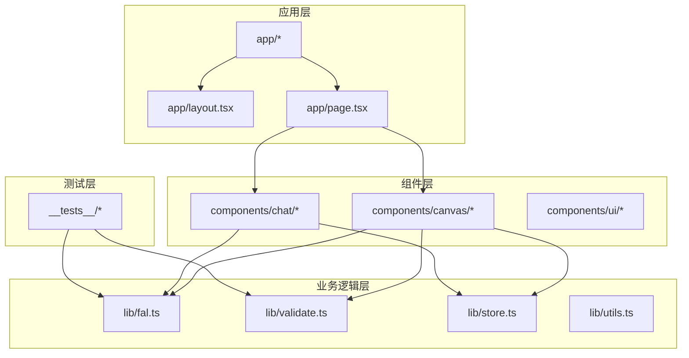
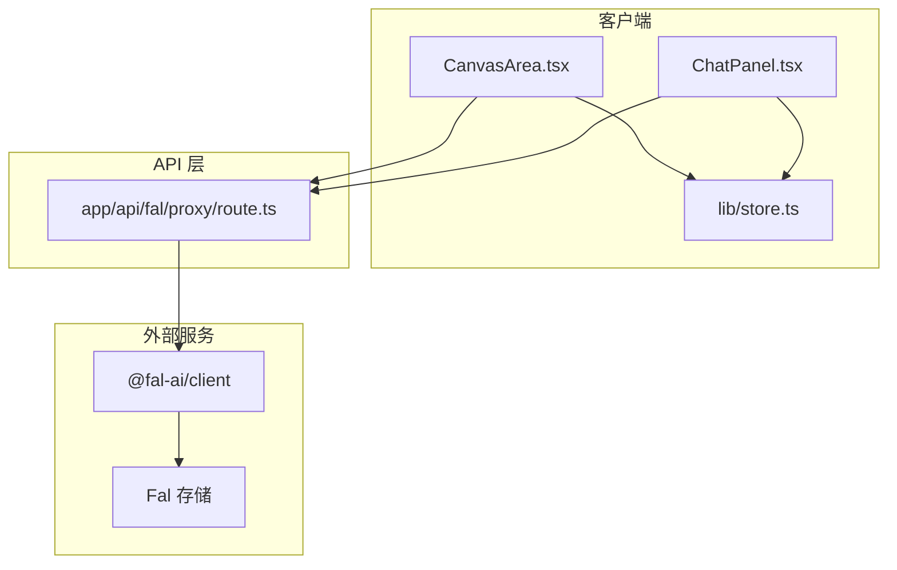
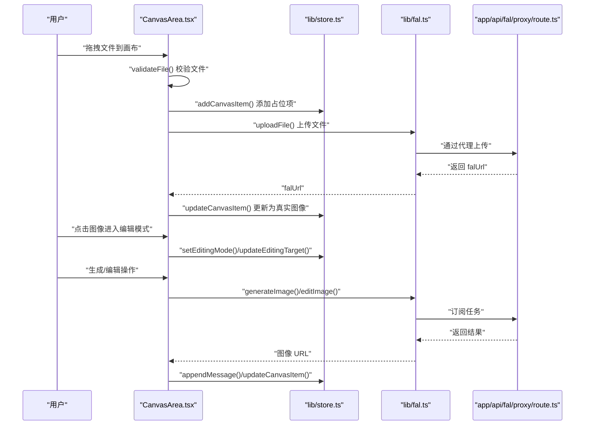
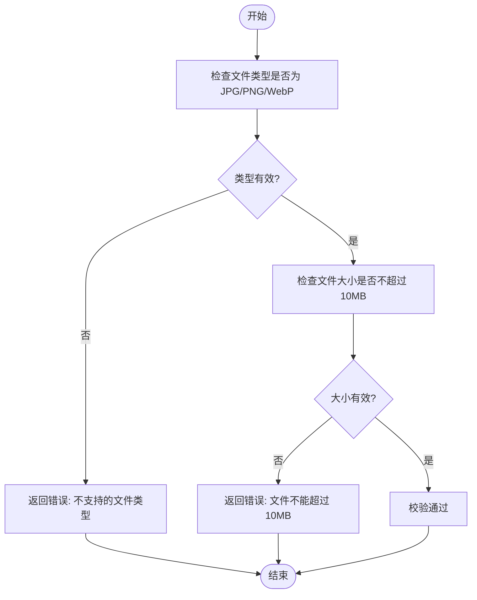
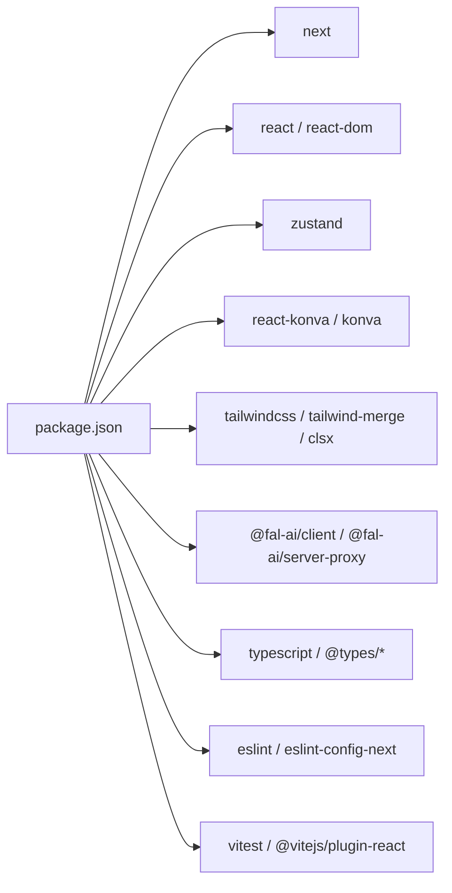

# 贡献指南

<cite>
**本文档引用的文件**
- [README.md](file://README.md)
- [package.json](file://package.json)
- [eslint.config.mjs](file://eslint.config.mjs)
- [vitest.config.ts](file://vitest.config.ts)
- [__tests__/setup.ts](file://__tests__/setup.ts)
- [__tests__/fal.test.ts](file://__tests__/fal.test.ts)
- [__tests__/validate.test.ts](file://__tests__/validate.test.ts)
- [lib/fal.ts](file://lib/fal.ts)
- [lib/validate.ts](file://lib/validate.ts)
- [lib/store.ts](file://lib/store.ts)
- [lib/utils.ts](file://lib/utils.ts)
- [components/canvas/CanvasArea.tsx](file://components/canvas/CanvasArea.tsx)
- [components/chat/ChatPanel.tsx](file://components/chat/ChatPanel.tsx)
- [app/layout.tsx](file://app/layout.tsx)
- [app/page.tsx](file://app/page.tsx)
- [AGENTS.md](file://AGENTS.md)
- [.claude/settings.local.json](file://.claude/settings.local.json)
</cite>

## 目录
1. [简介](#简介)
2. [项目结构](#项目结构)
3. [核心组件](#核心组件)
4. [架构总览](#架构总览)
5. [详细组件分析](#详细组件分析)
6. [依赖关系分析](#依赖关系分析)
7. [性能考虑](#性能考虑)
8. [故障排除指南](#故障排除指南)
9. [结论](#结论)
10. [附录](#附录)

## 简介
本指南面向开源贡献者，提供 Loveart 项目的完整参与流程与最佳实践。内容涵盖：Fork 与分支管理、代码规范与提交信息格式、本地开发与测试、Bug 报告与功能请求流程、审查流程以及社区行为准则与沟通渠道。

## 项目结构
Loveart 是基于 Next.js 的前端应用，采用 TypeScript、TailwindCSS 和 Zustand 状态管理。项目采用功能模块化组织，核心目录如下：
- app：页面与路由入口
- components：可复用 UI 组件与业务组件
- lib：业务逻辑与工具函数（状态、验证、Fal 接口等）
- __tests__：单元测试与测试设置
- docs/superpowers：设计与实现文档
- 配置文件：package.json、eslint.config.mjs、vitest.config.ts 等

图表来源
- [app/layout.tsx](file://app/layout.tsx)
- [app/page.tsx](file://app/page.tsx)
- [components/canvas/CanvasArea.tsx](file://components/canvas/CanvasArea.tsx)
- [components/chat/ChatPanel.tsx](file://components/chat/ChatPanel.tsx)
- [lib/fal.ts](file://lib/fal.ts)
- [lib/validate.ts](file://lib/validate.ts)
- [lib/store.ts](file://lib/store.ts)
- [__tests__/fal.test.ts](file://__tests__/fal.test.ts)
- [__tests__/validate.test.ts](file://__tests__/validate.test.ts)

章节来源
- [README.md:1-37](file://README.md#L1-L37)
- [package.json:1-48](file://package.json#L1-L48)

## 核心组件
- 状态管理：Zustand Store 提供画布元素、参考图、消息历史与加载状态的持久化与会话状态管理。
- 图像处理：通过 Fal AI 客户端进行图像生成与编辑，并使用本地存储上传文件。
- 文件校验：限制文件类型与大小，确保上传质量与性能。
- UI 组件：CanvasArea 支持拖拽、缩放、平移与选择；ChatPanel 提供消息历史、参考图上传与输入框。

章节来源
- [lib/store.ts:1-119](file://lib/store.ts#L1-L119)
- [lib/fal.ts:1-62](file://lib/fal.ts#L1-L62)
- [lib/validate.ts:1-14](file://lib/validate.ts#L1-L14)
- [components/canvas/CanvasArea.tsx:1-431](file://components/canvas/CanvasArea.tsx#L1-L431)
- [components/chat/ChatPanel.tsx:1-22](file://components/chat/ChatPanel.tsx#L1-L22)

## 架构总览
系统采用前后端分离思路：前端负责用户交互与状态管理，后端代理通过 Next.js API 路由对接 Fal AI 服务。文件上传通过 Fal 存储接口完成。

图表来源
- [components/canvas/CanvasArea.tsx:1-431](file://components/canvas/CanvasArea.tsx#L1-L431)
- [components/chat/ChatPanel.tsx:1-22](file://components/chat/ChatPanel.tsx#L1-L22)
- [lib/store.ts:1-119](file://lib/store.ts#L1-L119)
- [lib/fal.ts:1-62](file://lib/fal.ts#L1-L62)
- [app/api/fal/proxy/route.ts](file://app/api/fal/proxy/route.ts)

## 详细组件分析

### CanvasArea 组件
CanvasArea 实现了画布交互的核心能力：拖拽文件到画布、缩放与平移、选择与变换、下载与清理。组件通过 Zustand 管理画布项与编辑目标，并调用 Fal API 进行图像生成与编辑。

图表来源
- [components/canvas/CanvasArea.tsx:1-431](file://components/canvas/CanvasArea.tsx#L1-L431)
- [lib/store.ts:1-119](file://lib/store.ts#L1-L119)
- [lib/fal.ts:1-62](file://lib/fal.ts#L1-L62)
- [app/api/fal/proxy/route.ts](file://app/api/fal/proxy/route.ts)

章节来源
- [components/canvas/CanvasArea.tsx:163-431](file://components/canvas/CanvasArea.tsx#L163-L431)
- [lib/store.ts:45-119](file://lib/store.ts#L45-L119)
- [lib/fal.ts:21-62](file://lib/fal.ts#L21-L62)

### 文件校验流程
文件上传前需通过 validateFile 校验类型与大小，避免无效或超大文件影响性能与体验。

图表来源
- [lib/validate.ts:1-14](file://lib/validate.ts#L1-L14)

章节来源
- [lib/validate.ts:1-14](file://lib/validate.ts#L1-L14)
- [__tests__/validate.test.ts:1-43](file://__tests__/validate.test.ts#L1-L43)

### ChatPanel 组件
ChatPanel 聚合消息历史、参考图上传与文本输入，配合 Zustand 管理聊天上下文与历史记录。

章节来源
- [components/chat/ChatPanel.tsx:1-22](file://components/chat/ChatPanel.tsx#L1-L22)
- [lib/store.ts:33-50](file://lib/store.ts#L33-L50)

## 依赖关系分析
项目依赖以 Next.js 为核心，结合 TailwindCSS、React Konva、Zustand、Fal AI 客户端等技术栈。开发依赖包括 ESLint、Vitest、TypeScript 等。

图表来源
- [package.json:1-48](file://package.json#L1-L48)

章节来源
- [package.json:1-48](file://package.json#L1-L48)

## 性能考虑
- 画布渲染优化：CanvasArea 使用 requestAnimationFrame 实现平滑动画与渐变效果，避免不必要的重绘。
- 图像尺寸控制：自动计算最大宽度并按比例缩放，减少内存占用与传输开销。
- 状态持久化：Zustand 持久化仅保存必要字段，限制历史长度，降低存储压力。
- 上传与代理：通过 Fal 存储与代理路由减少跨域与鉴权复杂度，提升稳定性。

章节来源
- [components/canvas/CanvasArea.tsx:17-67](file://components/canvas/CanvasArea.tsx#L17-L67)
- [lib/store.ts:5-6](file://lib/store.ts#L5-L6)
- [lib/store.ts:102-117](file://lib/store.ts#L102-L117)

## 故障排除指南
- 开发服务器启动失败：确认 Node.js 版本与包管理器兼容，执行安装依赖后再启动。
- ESLint 报错：遵循 Next.js ESLint 规则，检查文件忽略配置与规则覆盖。
- Vitest 测试异常：确保 jsdom 环境与 setup 文件正确加载，检查别名路径配置。
- Fal 上传失败：检查环境变量与代理路由配置，确认网络连通性与鉴权设置。
- 文件上传被拒绝：确认文件类型与大小限制，避免超出边界值。

章节来源
- [README.md:5-15](file://README.md#L5-L15)
- [eslint.config.mjs:1-19](file://eslint.config.mjs#L1-L19)
- [vitest.config.ts:1-16](file://vitest.config.ts#L1-L16)
- [__tests__/setup.ts:1-2](file://__tests__/setup.ts#L1-L2)
- [lib/validate.ts:6-7](file://lib/validate.ts#L6-L7)

## 结论
Loveart 项目提供了清晰的模块划分与现代化的技术栈。贡献者应遵循统一的代码规范与测试要求，确保功能稳定与用户体验一致。通过本指南的流程与最佳实践，您可以高效地参与项目贡献。

## 附录

### 代码贡献流程
- Fork 仓库并在本地克隆
- 创建功能分支（建议使用 feat/、fix/ 或 docs/ 前缀）
- 编写代码与单元测试，确保通过 ESLint 与 Vitest
- 提交前运行 lint 与测试命令
- 发起 Pull Request，填写变更说明与关联 Issue

章节来源
- [package.json:5-10](file://package.json#L5-L10)
- [eslint.config.mjs:1-19](file://eslint.config.mjs#L1-L19)
- [vitest.config.ts:1-16](file://vitest.config.ts#L1-L16)

### 代码规范与提交信息格式
- 使用 ESLint 与 TypeScript 规则，保持一致的命名与风格
- 提交信息建议采用以下格式：type(scope): subject
  - 示例：feat(canvas): 支持拖拽缩放功能
- 在 PR 描述中说明变更动机、具体修改与测试情况

章节来源
- [eslint.config.mjs:1-19](file://eslint.config.mjs#L1-L19)
- [package.json:9](file://package.json#L9)

### 开发环境搭建
- 安装依赖：使用 npm、yarn、pnpm 或 bun
- 启动开发服务器：运行 dev 脚本
- 访问 http://localhost:3000 查看应用
- 配置 Fal 代理与鉴权（如需）

章节来源
- [README.md:5-15](file://README.md#L5-L15)
- [lib/fal.ts:3](file://lib/fal.ts#L3)

### 测试要求
- 单元测试：使用 Vitest 与 @testing-library
- 覆盖范围：核心逻辑（Fal 接口、文件校验、状态更新）
- 运行方式：执行测试脚本，确保无失败用例

章节来源
- [vitest.config.ts:1-16](file://vitest.config.ts#L1-L16)
- [__tests__/setup.ts:1-2](file://__tests__/setup.ts#L1-L2)
- [__tests__/fal.test.ts:1-61](file://__tests__/fal.test.ts#L1-L61)
- [__tests__/validate.test.ts:1-43](file://__tests__/validate.test.ts#L1-L43)

### Bug 报告模板
- 标题：简洁描述问题
- 复现步骤：最小可复现的操作序列
- 期望行为：预期结果
- 实际行为：实际结果
- 环境信息：操作系统、浏览器、Node.js 版本、依赖版本
- 截图或日志：有助于定位问题

### 功能请求流程
- 在 Issue 中描述需求背景与使用场景
- 提供可选的实现方案与优先级
- 讨论后由维护者评估并分配任务

### 社区行为准则与沟通渠道
- 尊重与包容：遵守开源社区行为准则
- 沟通渠道：Issue 讨论、PR 评审、文档补充
- 注意事项：遵循 AGENT 规则与 Next.js 版本差异提示

章节来源
- [AGENTS.md:1-6](file://AGENTS.md#L1-L6)
- [CLAUDE.md:1-2](file://CLAUDE.md#L1-L2)