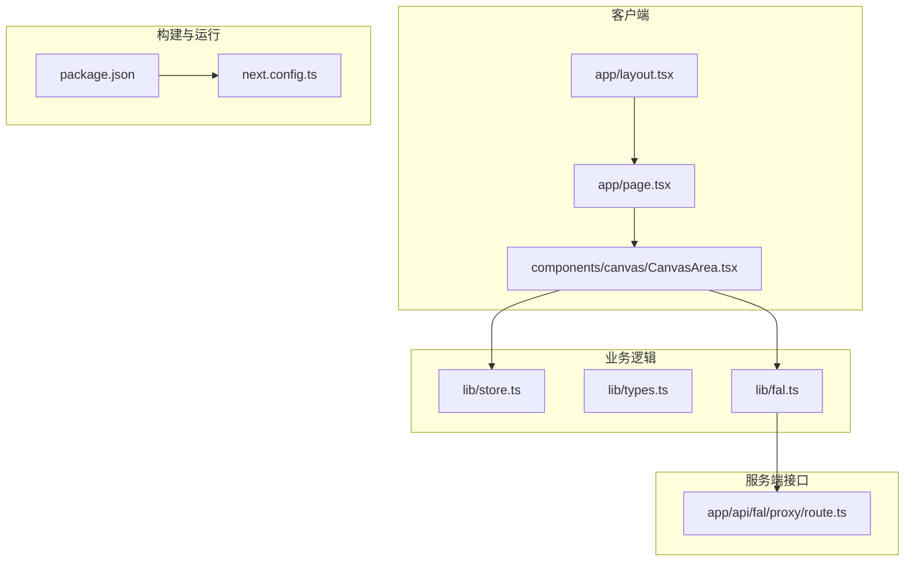
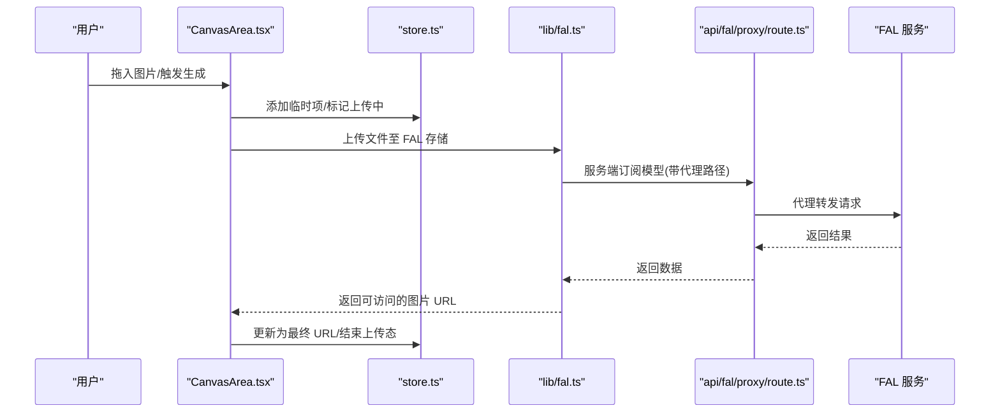
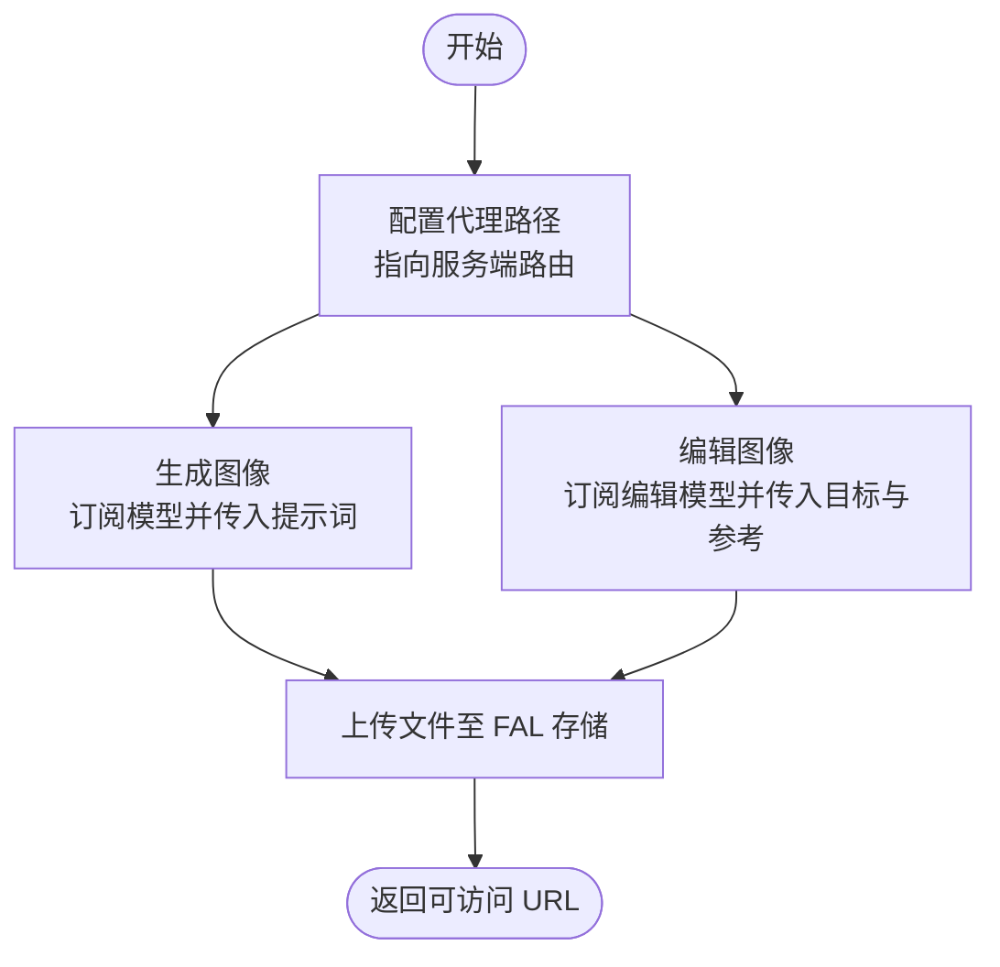
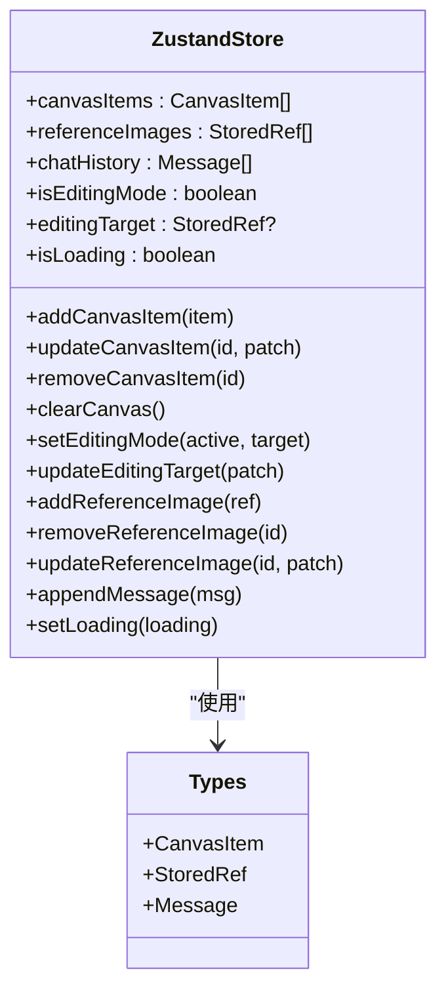
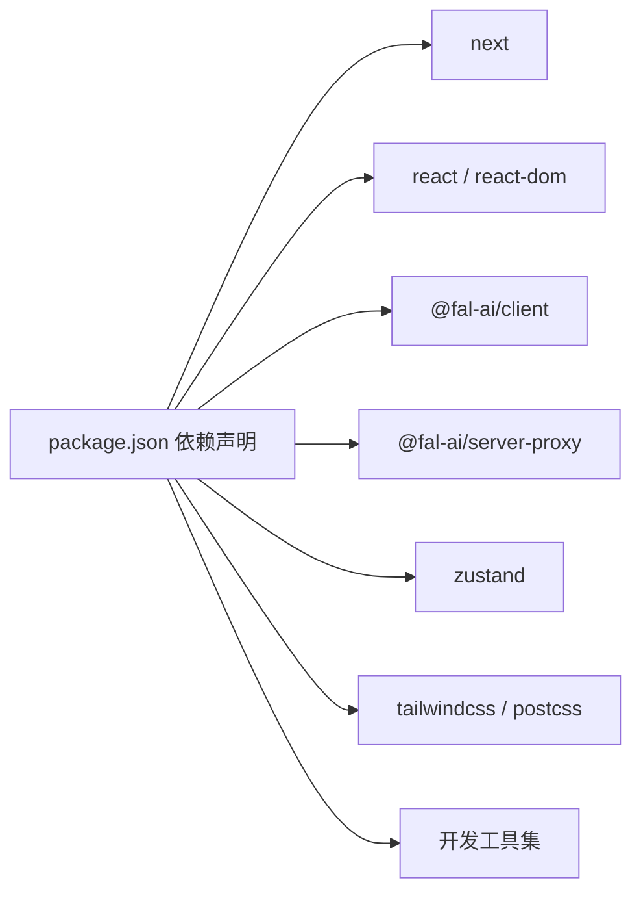

# 部署运维

<cite>
**本文引用的文件**
- [package.json](file://package.json)
- [next.config.ts](file://next.config.ts)
- [README.md](file://README.md)
- [lib/fal.ts](file://lib/fal.ts)
- [app/api/fal/proxy/route.ts](file://app/api/fal/proxy/route.ts)
- [lib/store.ts](file://lib/store.ts)
- [lib/types.ts](file://lib/types.ts)
- [app/layout.tsx](file://app/layout.tsx)
- [app/page.tsx](file://app/page.tsx)
- [components/canvas/CanvasArea.tsx](file://components/canvas/CanvasArea.tsx)
- [__tests__/fal.test.ts](file://__tests__/fal.test.ts)
- [__tests__/store.test.ts](file://__tests__/store.test.ts)
</cite>

## 目录
1. [简介](#简介)
2. [项目结构](#项目结构)
3. [核心组件](#核心组件)
4. [架构总览](#架构总览)
5. [详细组件分析](#详细组件分析)
6. [依赖分析](#依赖分析)
7. [性能考虑](#性能考虑)
8. [故障排除指南](#故障排除指南)
9. [结论](#结论)
10. [附录](#附录)

## 简介
本文件为 Loveart 项目的部署与运维指南，聚焦于基于 Vercel 的部署流程、环境变量管理、构建优化、性能监控、生产最佳实践与安全配置、错误处理与日志、CI/CD 自动化以及回滚策略。项目采用 Next.js 应用（App Router），前端通过 FAL AI 服务生成与编辑图像，并通过自定义 API 路由代理实现服务端调用。

## 项目结构
- 应用入口与页面：根布局、首页页面、全局样式与字体。
- 组件层：画布与聊天面板等 UI 组件。
- 业务逻辑：状态管理（Zustand）、类型定义、FAL 客户端封装与上传。
- API 层：FAL 服务代理路由，用于在服务端发起请求并返回结果。
- 测试：单元测试覆盖 FAL 封装与状态管理行为。

图示来源
- [app/layout.tsx:1-38](file://app/layout.tsx#L1-L38)
- [app/page.tsx:1-59](file://app/page.tsx#L1-L59)
- [components/canvas/CanvasArea.tsx:1-431](file://components/canvas/CanvasArea.tsx#L1-L431)
- [lib/store.ts:1-119](file://lib/store.ts#L1-L119)
- [lib/types.ts:1-37](file://lib/types.ts#L1-L37)
- [lib/fal.ts:1-62](file://lib/fal.ts#L1-L62)
- [app/api/fal/proxy/route.ts:1-4](file://app/api/fal/proxy/route.ts#L1-L4)
- [package.json:1-48](file://package.json#L1-L48)
- [next.config.ts:1-8](file://next.config.ts#L1-L8)

章节来源
- [README.md:1-37](file://README.md#L1-L37)
- [package.json:1-48](file://package.json#L1-L48)
- [next.config.ts:1-8](file://next.config.ts#L1-L8)

## 核心组件
- 状态管理与持久化：使用 Zustand 管理画布、参考图与消息历史，支持本地存储安全包装与部分状态持久化。
- FAL 图像生成与编辑：封装订阅模型与存储上传，配置代理路径以在服务端发起请求。
- 画布交互：基于 Konva/Konva React 实现拖拽、缩放、变换与下载；支持拖入图片并上传至 FAL 存储。
- 布局与主题：根布局设置字体与全局样式，页面按移动端与桌面端分栏布局。

章节来源
- [lib/store.ts:1-119](file://lib/store.ts#L1-L119)
- [lib/types.ts:1-37](file://lib/types.ts#L1-L37)
- [lib/fal.ts:1-62](file://lib/fal.ts#L1-L62)
- [components/canvas/CanvasArea.tsx:1-431](file://components/canvas/CanvasArea.tsx#L1-L431)
- [app/layout.tsx:1-38](file://app/layout.tsx#L1-L38)
- [app/page.tsx:1-59](file://app/page.tsx#L1-L59)

## 架构总览
下图展示从浏览器到 FAL 服务的端到端调用链，包括客户端状态更新、服务端代理与外部服务响应。

图示来源
- [components/canvas/CanvasArea.tsx:306-340](file://components/canvas/CanvasArea.tsx#L306-L340)
- [lib/fal.ts:3-62](file://lib/fal.ts#L3-L62)
- [app/api/fal/proxy/route.ts:1-4](file://app/api/fal/proxy/route.ts#L1-L4)

## 详细组件分析

### FAL 服务集成与代理
- 客户端配置：通过代理 URL 指向服务端路由，避免在客户端暴露密钥。
- 生成与编辑：分别订阅不同模型，自动处理输出格式与参数合并。
- 存储上传：将本地文件上传至 FAL 存储，返回可访问 URL。

图示来源
- [lib/fal.ts:3-62](file://lib/fal.ts#L3-L62)

章节来源
- [lib/fal.ts:1-62](file://lib/fal.ts#L1-L62)
- [app/api/fal/proxy/route.ts:1-4](file://app/api/fal/proxy/route.ts#L1-L4)

### 画布与状态管理
- 状态切片：持久化聊天历史、会话内画布与参考图、加载态等。
- 本地存储安全包装：在异常情况下不中断应用。
- 画布操作：添加/更新/删除元素、选择与变换、清空画布、下载与清理。

图示来源
- [lib/store.ts:45-119](file://lib/store.ts#L45-L119)
- [lib/types.ts:1-37](file://lib/types.ts#L1-L37)

章节来源
- [lib/store.ts:1-119](file://lib/store.ts#L1-L119)
- [lib/types.ts:1-37](file://lib/types.ts#L1-L37)

### 页面与布局
- 根布局：设置字体变量、全局样式与通知组件。
- 首页：移动端与桌面端两套布局，侧边画布与聊天面板。

章节来源
- [app/layout.tsx:1-38](file://app/layout.tsx#L1-L38)
- [app/page.tsx:1-59](file://app/page.tsx#L1-L59)

## 依赖分析
- 运行时依赖：Next.js、React、@fal-ai/client、@fal-ai/server-proxy、Zustand、Tailwind 等。
- 开发依赖：TypeScript、ESLint、Vitest、TailwindCSS 等。
- 构建配置：Next 配置文件为空，表示默认行为；字体与 Tailwind 已启用。

图示来源
- [package.json:11-46](file://package.json#L11-L46)

章节来源
- [package.json:1-48](file://package.json#L1-L48)
- [next.config.ts:1-8](file://next.config.ts#L1-L8)

## 性能考虑
- 字体与样式：使用 Next Font 自动优化字体加载，Tailwind 启用以减少未使用 CSS。
- 构建优化：保持默认 Next 配置，确保静态资源与 ISR/SSR 优势；如需进一步优化可在 next.config.ts 中扩展。
- 画布渲染：Konva 使用 requestAnimationFrame 与批量绘制，避免不必要的重绘；对大图自动缩放以控制初始尺寸。
- 状态持久化：仅持久化必要状态，避免本地存储膨胀影响性能。

章节来源
- [app/layout.tsx:6-14](file://app/layout.tsx#L6-L14)
- [components/canvas/CanvasArea.tsx:85-102](file://components/canvas/CanvasArea.tsx#L85-L102)
- [lib/store.ts:102-117](file://lib/store.ts#L102-L117)

## 故障排除指南
- FAL 上传失败
  - 现象：拖入图片后提示上传失败。
  - 排查：确认服务端代理路由可用；检查客户端是否正确配置代理路径；验证 FAL_KEY 是否在服务端可用且有效。
  - 处置：在服务端重新部署并刷新环境变量；检查代理路由返回状态码与超时设置。
- 画布无响应或卡顿
  - 现象：拖拽、缩放或变换时卡顿。
  - 排查：检查是否有过多元素同时渲染；确认批量绘制与 RAF 使用是否正确。
  - 处置：减少一次性渲染元素数量；确保 Konva 层与 Transformer 正确绑定；避免在渲染回调中执行重计算。
- 状态不同步
  - 现象：上传完成但 UI 未更新。
  - 排查：确认状态更新函数调用顺序与异步处理。
  - 处置：在上传完成后更新对应项的 URL 与上传态；确保本地存储异常时不阻塞主流程。
- 回滚策略
  - 建议：在 Vercel 上保留最近几个版本的部署快照；若问题出现，切换到上一个稳定版本；同时对比环境变量与代理路由变更记录。

章节来源
- [components/canvas/CanvasArea.tsx:331-337](file://components/canvas/CanvasArea.tsx#L331-L337)
- [lib/store.ts:7-17](file://lib/store.ts#L7-L17)
- [lib/fal.ts:3](file://lib/fal.ts#L3)

## 结论
本指南提供了 Loveart 在 Vercel 上的部署与运维要点：明确环境变量与代理配置、利用默认 Next 构建与字体/Tailwind 优化、通过 Zustand 管理状态并保障本地存储健壮性、在服务端代理中调用 FAL 以保护密钥。结合本文提供的故障排除与回滚建议，可确保生产环境的稳定性与可维护性。

## 附录

### Vercel 部署与环境变量
- 部署方式：推荐直接使用 Vercel 平台一键部署 Next.js 应用。
- 关键环境变量：FAL_KEY（用于服务端代理访问 FAL）。
- 构建命令：使用默认 Next 构建脚本。
- 预览与生产：区分预览分支与生产分支，确保生产分支使用生产环境变量。

章节来源
- [README.md:32-36](file://README.md#L32-L36)
- [package.json:5-10](file://package.json#L5-L10)
- [lib/fal.ts:3](file://lib/fal.ts#L3)

### 错误处理与日志
- 客户端错误：在上传失败时弹出提示并恢复上传态，避免阻塞后续操作。
- 本地存储异常：对读写进行 try/catch 包装，保证应用可用性。
- 日志与监控：建议在服务端代理层增加请求日志与错误捕获，结合 Vercel 日志查看器定位问题。

章节来源
- [components/canvas/CanvasArea.tsx:331-337](file://components/canvas/CanvasArea.tsx#L331-L337)
- [lib/store.ts:7-17](file://lib/store.ts#L7-L17)

### CI/CD 与自动化
- 触发条件：推送至受保护分支或创建标签。
- 步骤建议：安装依赖 → 运行测试 → 构建应用 → 部署到 Vercel（预览或生产）。
- 最佳实践：在合并前强制通过测试；对生产部署启用审批流程。

章节来源
- [__tests__/fal.test.ts:1-61](file://__tests__/fal.test.ts#L1-L61)
- [__tests__/store.test.ts:1-92](file://__tests__/store.test.ts#L1-L92)
- [package.json:5-10](file://package.json#L5-L10)