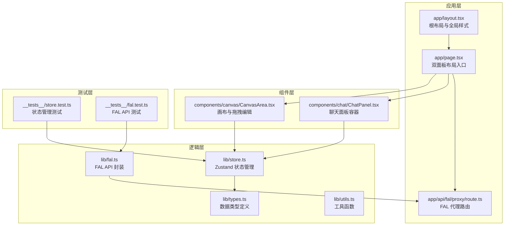
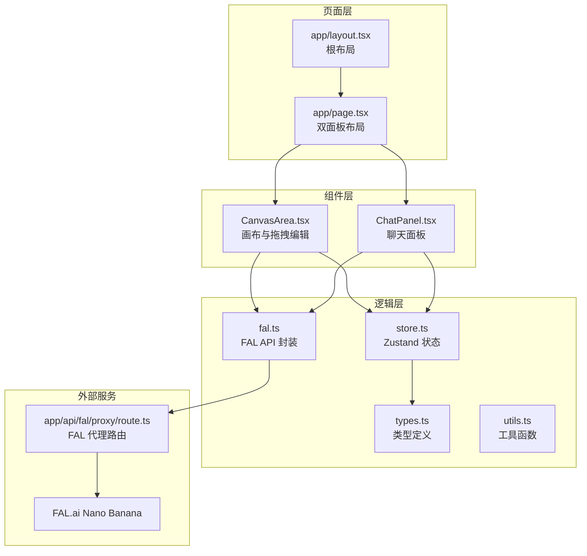
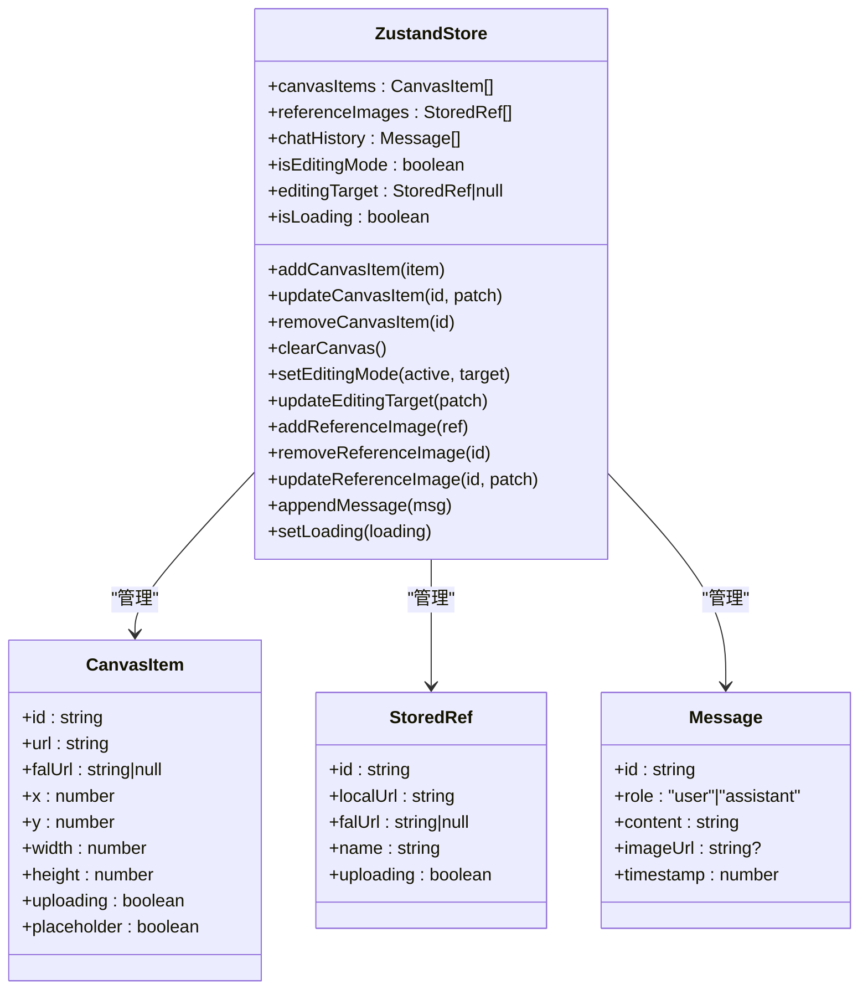
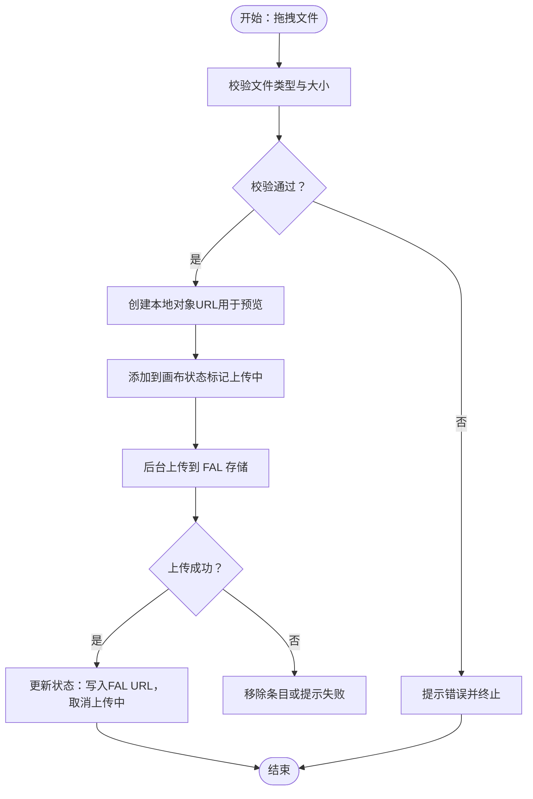
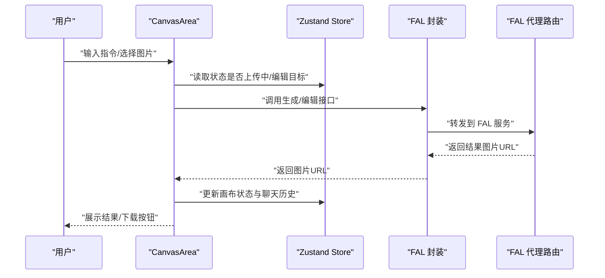
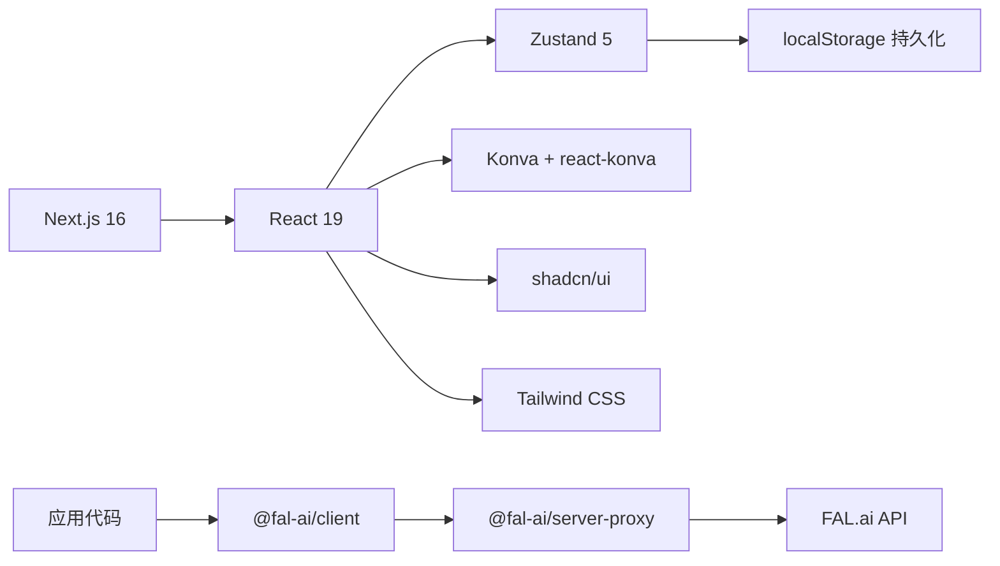

# 项目概述

<cite>
**本文档引用的文件**
- [README.md](file://README.md)
- [package.json](file://package.json)
- [app/layout.tsx](file://app/layout.tsx)
- [app/page.tsx](file://app/page.tsx)
- [lib/store.ts](file://lib/store.ts)
- [lib/fal.ts](file://lib/fal.ts)
- [lib/types.ts](file://lib/types.ts)
- [lib/utils.ts](file://lib/utils.ts)
- [components/canvas/CanvasArea.tsx](file://components/canvas/CanvasArea.tsx)
- [components/chat/ChatPanel.tsx](file://components/chat/ChatPanel.tsx)
- [components/ui/button.tsx](file://components/ui/button.tsx)
- [app/api/fal/proxy/route.ts](file://app/api/fal/proxy/route.ts)
- [docs/superpowers/specs/2026-03-25-lovart-design.md](file://docs/superpowers/specs/2026-03-25-lovart-design.md)
- [__tests__/store.test.ts](file://__tests__/store.test.ts)
- [__tests__/fal.test.ts](file://__tests__/fal.test.ts)
</cite>

## 目录
1. [引言](#引言)
2. [项目结构](#项目结构)
3. [核心组件](#核心组件)
4. [架构总览](#架构总览)
5. [详细组件分析](#详细组件分析)
6. [依赖关系分析](#依赖关系分析)
7. [性能考虑](#性能考虑)
8. [故障排除指南](#故障排除指南)
9. [结论](#结论)
10. [附录](#附录)

## 引言

Loveart AI 是一个基于自然语言的 AI 图像生成与编辑创意设计平台，采用现代前端技术栈构建：Next.js 16（App Router）、React 19 以及 Zustand 状态管理。项目通过响应式双面板界面设计，将主画布与聊天面板有机结合，既满足桌面端的高效协作，也兼顾移动端的沉浸式体验。

技术价值主张包括：
- 响应式双面板布局：桌面端横向分屏、移动端底部抽屉，适配多设备场景。
- FAL.ai API 集成：通过代理路由安全调用云端模型，支持图像生成与编辑。
- 本地状态管理：Zustand 结合持久化中间件，保障会话状态与聊天历史的可用性。
- 组件化 UI：基于 shadcn/ui 的可复用组件体系，统一视觉与交互风格。
- 可扩展架构：模块化设计便于后续接入用户认证与数据库持久化。

业务价值体现在：
- 降低创意门槛：用户通过自然语言即可完成图像生成与编辑。
- 提升创作效率：聊天驱动的工作流减少工具切换成本。
- 良好的用户体验：暗色主题、流畅动画与直观操作提升使用感受。

## 项目结构

项目采用按功能域划分的目录组织方式，核心目录与职责如下：
- app：Next.js 应用入口与页面布局，包含根布局、首页与 API 路由。
- components：可复用 UI 组件与业务组件，如画布区域、聊天面板等。
- lib：核心逻辑封装，包括状态管理、FAL API 封装、类型定义与工具函数。
- __tests__：单元测试，覆盖状态管理与 API 封装。
- docs：产品设计规范与技术规格说明。

**图表来源**
- [app/layout.tsx:1-38](file://app/layout.tsx#L1-L38)
- [app/page.tsx:1-59](file://app/page.tsx#L1-L59)
- [app/api/fal/proxy/route.ts:1-4](file://app/api/fal/proxy/route.ts#L1-L4)
- [components/canvas/CanvasArea.tsx:1-431](file://components/canvas/CanvasArea.tsx#L1-L431)
- [components/chat/ChatPanel.tsx:1-22](file://components/chat/ChatPanel.tsx#L1-L22)
- [lib/store.ts:1-119](file://lib/store.ts#L1-L119)
- [lib/fal.ts:1-62](file://lib/fal.ts#L1-L62)
- [lib/types.ts:1-37](file://lib/types.ts#L1-L37)
- [lib/utils.ts:1-7](file://lib/utils.ts#L1-L7)
- [__tests__/store.test.ts:1-92](file://__tests__/store.test.ts#L1-L92)
- [__tests__/fal.test.ts:1-61](file://__tests__/fal.test.ts#L1-L61)

**章节来源**
- [package.json:1-48](file://package.json#L1-L48)
- [docs/superpowers/specs/2026-03-25-lovart-design.md:31-48](file://docs/superpowers/specs/2026-03-25-lovart-design.md#L31-L48)

## 核心组件

- 根布局与主题
  - 根布局负责注入字体变量、全局样式与通知组件，设置暗色主题与全局类名，确保一致的视觉基础。
  - 全局样式通过 Tailwind CSS 与自定义变量实现，保证组件间风格统一。

- 双面板布局
  - 桌面端：左侧 60%/70% 画布区，右侧聊天区，满足高效创作与沟通。
  - 移动端：画布占上半区，聊天以底部抽屉形式呈现，支持展开/收起与自动聚焦输入。

- 状态管理（Zustand）
  - 管理画布元素、参考图、聊天历史、编辑模式与加载状态。
  - 使用持久化中间件仅持久化聊天历史，避免过期的 CDN URL 存储导致 404。

- FAL API 封装
  - 通过代理路由隐藏密钥，统一调用 Nano Banana 模型进行图像生成与编辑。
  - 支持文件上传、结果提取与错误处理。

**章节来源**
- [app/layout.tsx:16-37](file://app/layout.tsx#L16-L37)
- [app/page.tsx:8-58](file://app/page.tsx#L8-L58)
- [lib/store.ts:45-118](file://lib/store.ts#L45-L118)
- [lib/fal.ts:1-62](file://lib/fal.ts#L1-L62)

## 架构总览

系统采用“页面层 → 组件层 → 逻辑层 → 外部服务”的分层架构。页面层负责布局与响应式控制；组件层承载业务交互；逻辑层封装状态与 API；外部服务通过代理路由访问 FAL.ai。

**图表来源**
- [app/page.tsx:1-59](file://app/page.tsx#L1-L59)
- [app/layout.tsx:1-38](file://app/layout.tsx#L1-L38)
- [components/canvas/CanvasArea.tsx:1-431](file://components/canvas/CanvasArea.tsx#L1-L431)
- [components/chat/ChatPanel.tsx:1-22](file://components/chat/ChatPanel.tsx#L1-L22)
- [lib/store.ts:1-119](file://lib/store.ts#L1-L119)
- [lib/fal.ts:1-62](file://lib/fal.ts#L1-L62)
- [lib/types.ts:1-37](file://lib/types.ts#L1-L37)
- [lib/utils.ts:1-7](file://lib/utils.ts#L1-L7)
- [app/api/fal/proxy/route.ts:1-4](file://app/api/fal/proxy/route.ts#L1-L4)

## 详细组件分析

### 状态管理（Zustand）分析

- 设计要点
  - 分离持久化切片与会话切片：聊天历史持久化，其他状态不持久化，避免过期 URL 导致的异常。
  - 安全存储包装：对 localStorage 进行 try/catch 包装，防止异常中断应用。
  - 动作聚合：集中定义画布、参考图、消息与加载状态的操作，便于测试与维护。

- 数据结构与复杂度
  - 聊天历史：最大容量限制为 50 条，插入时截断旧记录，时间复杂度 O(n)。
  - 画布元素与参考图：数组操作为主，查找/更新按 ID 进行映射，平均 O(n)。

- 错误处理与边界
  - localStorage 异常时降级为空状态，保证应用可用性。
  - 编辑模式与上传状态联动，防止发送包含空 URL 的请求。

**图表来源**
- [lib/store.ts:19-118](file://lib/store.ts#L19-L118)
- [lib/types.ts:17-36](file://lib/types.ts#L17-L36)

**章节来源**
- [lib/store.ts:1-119](file://lib/store.ts#L1-L119)
- [lib/types.ts:1-37](file://lib/types.ts#L1-L37)
- [__tests__/store.test.ts:1-92](file://__tests__/store.test.ts#L1-L92)

### 画布组件（CanvasArea）分析

- 核心能力
  - 拖拽上传：支持文件拖放，即时预览与后台上传至 FAL 存储。
  - 选择与变换：点击选中图片，显示变换框进行缩放与拖拽。
  - 中键平移与滚轮缩放：提供专业绘图体验。
  - 占位符动画：生成过程中的视觉反馈，提升感知速度。

- 处理流程（拖拽上传）

**图表来源**
- [components/canvas/CanvasArea.tsx:294-340](file://components/canvas/CanvasArea.tsx#L294-L340)
- [lib/fal.ts:59-62](file://lib/fal.ts#L59-L62)

- 交互序列（生成/编辑）

**图表来源**
- [components/canvas/CanvasArea.tsx:163-431](file://components/canvas/CanvasArea.tsx#L163-L431)
- [lib/fal.ts:21-57](file://lib/fal.ts#L21-L57)
- [app/api/fal/proxy/route.ts:1-4](file://app/api/fal/proxy/route.ts#L1-L4)

**章节来源**
- [components/canvas/CanvasArea.tsx:1-431](file://components/canvas/CanvasArea.tsx#L1-L431)
- [lib/fal.ts:1-62](file://lib/fal.ts#L1-L62)

### 聊天面板（ChatPanel）分析

- 组成结构
  - 标题区：平台标识与说明。
  - 消息历史：滚动列表，支持自动滚动到底部。
  - 参考图上传器：水平缩略图条，支持添加/删除与上传状态指示。
  - 文本输入：根据当前模式动态占位符，支持快捷键与禁用条件。

- 关键交互
  - 输入焦点事件：移动端抽屉自动展开，提升可用性。
  - 发送按钮门控：当存在上传中或加载中时禁用，防止无效请求。

**章节来源**
- [components/chat/ChatPanel.tsx:1-22](file://components/chat/ChatPanel.tsx#L1-L22)

### UI 组件（Button）分析

- 设计理念
  - 基于 Base UI 的 Button 原语，结合 cva 实现变体与尺寸系统。
  - 通过 cn 工具函数合并与去重类名，保持样式一致性。

- 使用场景
  - 画布底部操作栏：下载、清空等动作按钮。
  - 聊天输入区：发送按钮与辅助操作。

**章节来源**
- [components/ui/button.tsx:1-61](file://components/ui/button.tsx#L1-L61)
- [lib/utils.ts:1-7](file://lib/utils.ts#L1-L7)

## 依赖关系分析

- 技术栈与版本
  - Next.js 16、React 19：提供 App Router 与客户端渲染能力。
  - Zustand 5：轻量状态管理，支持持久化中间件。
  - FAL.ai SDK 与服务器代理：安全调用云端模型。
  - Konva 与 react-konva：提供高性能的 2D 画布操作。
  - Tailwind CSS 与 shadcn/ui：快速构建一致的 UI 组件。

- 外部集成
  - FAL 代理路由：隐藏密钥，统一转发请求。
  - 通知组件：sonner 提供暗色主题下的友好提示。

**图表来源**
- [package.json:11-29](file://package.json#L11-L29)
- [app/api/fal/proxy/route.ts:1-4](file://app/api/fal/proxy/route.ts#L1-L4)

**章节来源**
- [package.json:1-48](file://package.json#L1-L48)
- [docs/superpowers/specs/2026-03-25-lovart-design.md:17-26](file://docs/superpowers/specs/2026-03-25-lovart-design.md#L17-L26)

## 性能考虑

- 渲染优化
  - Konva 层批处理绘制，减少重排与重绘。
  - 占位符动画使用 requestAnimationFrame，帧率稳定且开销可控。

- 状态与存储
  - 仅持久化必要数据（聊天历史），避免大体积数据进入 localStorage。
  - 上传中状态与加载状态不持久化，避免过期 URL 导致的无效请求。

- 网络与缓存
  - FAL CDN 返回的图片 URL 由服务端代理访问，浏览器侧仅处理最终资源。
  - 本地对象 URL 用于即时预览，上传完成后替换为永久 URL。

[本节为通用性能建议，无需特定文件引用]

## 故障排除指南

- 常见问题与处理
  - 文件类型/大小限制：超出限制或格式不支持时弹出提示并拒绝上传。
  - 参考图数量上限：超过上限时提示并拒绝添加。
  - FAL API 失败：弹出错误提示，保持当前状态以便重试。
  - 网络异常：提供重试机制与提示信息。
  - 上传失败：移除对应缩略图并清理编辑目标。

- 测试验证
  - 状态管理测试：覆盖画布增删改、参考图管理与聊天历史截断。
  - FAL API 测试：验证订阅调用参数与返回值结构。

**章节来源**
- [docs/superpowers/specs/2026-03-25-lovart-design.md:244-254](file://docs/superpowers/specs/2026-03-25-lovart-design.md#L244-L254)
- [__tests__/store.test.ts:17-92](file://__tests__/store.test.ts#L17-L92)
- [__tests__/fal.test.ts:1-61](file://__tests__/fal.test.ts#L1-61)

## 结论

Loveart AI 通过简洁而强大的技术组合，实现了“自然语言驱动的图像生成与编辑”这一核心目标。其响应式双面板设计兼顾桌面与移动场景，Zustand 的本地状态管理确保了良好的用户体验，FAL.ai 的集成则提供了稳定的云端算力支撑。对于初学者，项目提供了清晰的入口与直观的交互；对于有经验的开发者，模块化的架构与完善的测试覆盖为后续扩展奠定了坚实基础。

[本节为总结性内容，无需特定文件引用]

## 附录

- 快速开始
  - 启动开发服务器后访问本地端口查看效果。
  - 在聊天面板输入自然语言指令，或在画布中拖拽图片进行编辑。

- 环境变量
  - FAL_KEY：FAL.ai 服务密钥，仅在服务端使用，避免泄露到前端。

**章节来源**
- [README.md:5-17](file://README.md#L5-L17)
- [docs/superpowers/specs/2026-03-25-lovart-design.md:290-295](file://docs/superpowers/specs/2026-03-25-lovart-design.md#L290-L295)